#### 目录

- [知识框架](#_1)
- [No.0 筑基](#No0__3)
- [No.1 年份处理](#No1__8)
- - [题目来源：PTA-L1-033 出生年](#PTAL1033__10)
  - [题目来源：PTA-L1-042 日期格式化](#PTAL1042__60)
  - [题目来源：PTA-L1-075 强迫症](#PTAL1075__94)
  - [题目来源：Acwing-3391-今年的第几天？](#Acwing3391_130)
  - [题目来源：蓝桥杯-第十四届模拟-第一期 晨跑](#___172)
  - [题目来源：蓝桥杯-第十四届模拟-第三期 相等日期](#___208)
  - [题目来源：蓝桥杯-2012省赛-猜生日](#2012_277)
  - [题目来源：蓝桥杯-2015省赛-星系炸弹](#2015_316)
- [No.2 一天内时间处理](#No2__355)
- - [题目来源：PTA-L1-018 大笨钟](#PTAL1018__357)
  - [题目来源：PTA-L2-042 老板的作息表](#PTAL2042__397)
  - [题目来源：蓝桥杯-第十四届模拟-第一期 充电器](#___471)
  - [题目来源：蓝桥杯-2022省赛模拟-时长计算](#2022_516)
  - [题目来源：蓝桥杯-2018省赛-航班时间](#2018_549)

## 知识框架

## No.0 筑基

> 请先学习下知识点，道友！  
>  题目知识点大部分来源于此：

## No.1 年份处理

### 题目来源：PTA-L1-033 出生年

题目描述：  
 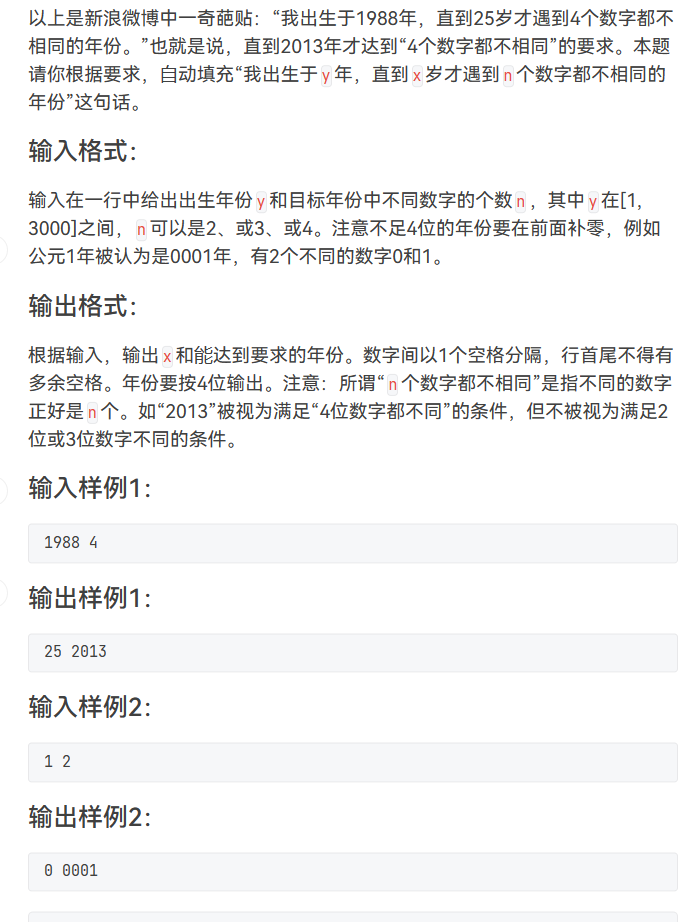

题目思路：

题目代码：

```cpp
//对于N要进行适应性的更改，对于字段错误
#include<bits/stdc++.h>
using namespace std;
#define inf 0x3f3f3f3f
#define N 100100
long long n,m,k,g,d,t;
int x,y,z;
char ch;
string str;
vector<int>v[N];


int check(int year){
	int book[13]={0};
	for(int i=0;i<4;i++){
		book[year%10]=1;
		year=year/10;
	}
	int sum=0;
	for(int i=0;i<=9;i++){
		if(book[i]>0)sum++;
	}
	return sum;
}
int main() {
	int year;
	cin>>year>>n;
	for(int i=0;;i++){
		if(check(i+year)==n){
			cout<<i;
			printf(" %04d",year+i);
			break;
		}
	}

	return 0;
}
```

### 题目来源：PTA-L1-042 日期格式化

题目描述：  
 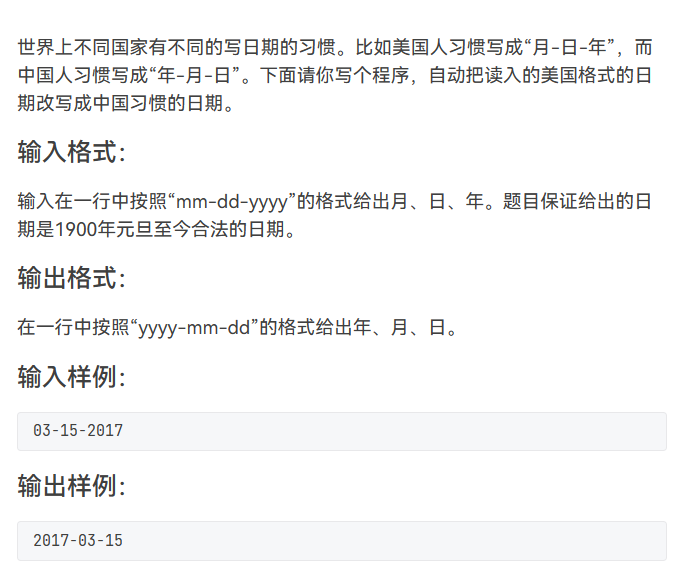

题目思路：


题目代码：

```cpp
#include <bits/stdc++.h>

using namespace std;

int main()
{

    string mei;
    cin>>mei;
    string nian,yue,ri;
    nian=mei.substr(6,4);
    yue=mei.substr(0,2);
    ri=mei.substr(3,2);
    cout<<nian<<'-'<<yue<<'-'<<ri<<endl;


    return 0;
}
```

### 题目来源：PTA-L1-075 强迫症

题目描述：  
 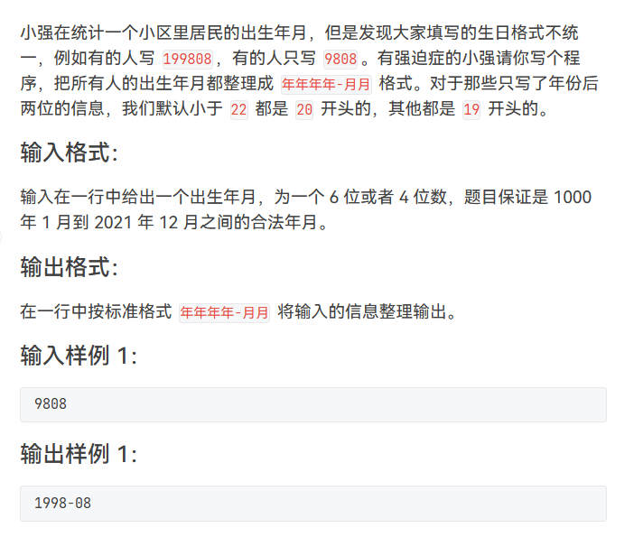

题目思路：


题目代码：

```cpp
#include <bits/stdc++.h>
using namespace std;
int xin[24];
int main() {

    string str;
    cin>>str;
    if(str.size()==4){
        if((str[0]-'0'==2 &&str[1]-'0'>=2) || (str[0]-'0'>2)){
            cout<<19<<str[0]<<str[1]<<"-"<<str[2]<<str[3]<<endl;
        }else{
            cout<<20<<str[0]<<str[1]<<"-"<<str[2]<<str[3]<<endl;
        }
    }else{
        cout<<str[0]<<str[1]<<str[2]<<str[3]<<"-"<<str[4]<<str[5]<<endl;
    }
    return 0;
}
```

### 题目来源：Acwing-3391-今年的第几天？

题目描述：  
 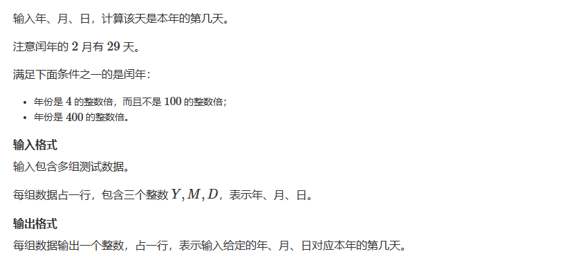

题目思路：

题目代码：

```cpp
//对于N要进行适应性的更改，对于字段错误
#include<bits/stdc++.h>
using namespace std;
#define inf 0x3f3f3f3f
#define N 100100
long long n,m,k,g,d,t;
int x,y,z;
char ch;
string str;
vector<int>v[N];

int day[13]={0,31,28,31,30,31,30,31,31,30,31,30,31};
int sumday(int y,int m,int d){
    int res=0;
    for(int i=0;i<m;i++){
        res=res+day[i];
    }
    res=res+d;
    if((y%4==0&&y%100!=0)||(y%400==0)){
        if(m>2)res++;
    }
    return res;
}
int main() {
    int y,m,d;
    while(cin>>y>>m>>d){
        cout<<sumday(y,m,d)<<endl;
    }
	return 0;
}
```

### 题目来源：蓝桥杯-第十四届模拟-第一期 晨跑

题目描述：  
 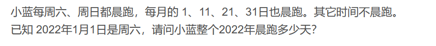

题目思路：

> 对每一天进行模拟遍历

题目代码：

```cpp
#include<bits/stdc++.h>


using namespace std;
typedef long long ll;
int d[] = {0, 31, 28, 31, 30, 31, 30, 31, 31, 30, 31, 30, 31};

int main() {
    int ans = 0;
    int week = 6;
    for (int i = 1; i <= 12; i++) {
        for (int j = 1; j <= d[i]; j++) {
            if (week == 6 || week == 0 || j == 1 || j == 11 || j == 21 || j == 31) {
                ans++;
            }
            week++;
            week = week % 7;
        }
    }
    cout << ans << endl;
    return 0;
}
```

### 题目来源：蓝桥杯-第十四届模拟-第三期 相等日期

题目描述：  
 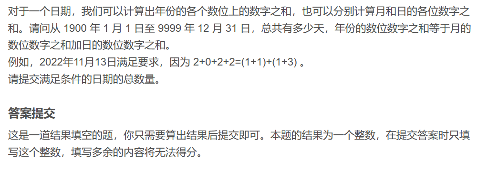

题目思路：


题目代码：

```cpp
//对于N要进行适应性的更改，对于字段错误
#include<bits/stdc++.h>
using namespace std;
#define inf 0x3f3f3f3f
#define N 100100
long long n,m,k,g,d,t;
int x,y,z;
char ch;
string str;
vector<int>v[N];

int day[13]={0,31,28,31,30,31,30,31,31,30,31,30,31};


int check(int year){
	if((year%4==0&&year%100!=0)||(year%400==0)){
		return 1;
	}else{
		return 0;
	}
}
int sumhe(int x){
	int sum=0;
	for(int i=0;i<4;i++){
		sum+=x%10;
		x=x/10;
	}
	return sum;
}

int main() {
	int y,m,d;
	int res=0;
	for(y=1900;y<=9999;y++){
		if(check(y)){
			day[2]=29;
		}else{
			day[2]=28;
		}
		for(m=1;m<=12;m++){
			for(d=1;d<=day[m];d++){
				
				if(sumhe(y)==sumhe(m)+sumhe(d))res++;
			}
		}
	}
	cout<<res<<endl;
	
	return 0;
}
```

### 题目来源：蓝桥杯-2012省赛-猜生日

题目描述：

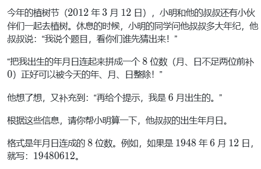

题目思路：


题目代码：

```cpp
#include <iostream>
using namespace std;
int main()
{
  // 请在此输入您的代码
  for(int i = 19000101;i<20120312;i++)
  {
    int year = i/10000;
    int month = i/100 % 100;
    int day = i%100;
    if(i%2012 == 0 && month==6 && day<30)
    {
      if(i%3 == 0)
      {
        if(i%12 == 0)
        {
          printf("%d\n",i);
        }
      }
    }
  }
  return 0;
}
```

### 题目来源：蓝桥杯-2015省赛-星系炸弹

题目描述：

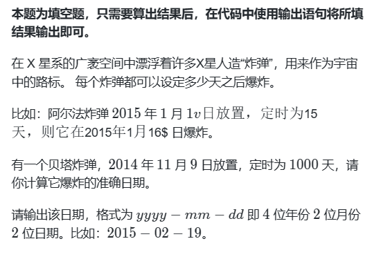

题目思路：


题目代码：

```cpp
#include <bits/stdc++.h>
using namespace std;
int main(){
    int mon[13]={0,31,28,31,30,31,30,31,31,30,31,30,31};
    int y=2014,d=9,m=11,w;
    for(w=0;w<1000;w++){
      if((y%4==0&&y%100!=0)||(y%400==0)) mon[2]=29;
      else  mon[2]=28;
      d++;
      if(d>mon[m]){
        d=1;
        m++;
      }
      if(m>12){
        y++;
        m=1;
      }
    }
    printf("%04d-%02d-%02d",y,m,d);
    return 0;
}
```

## No.2 一天内时间处理

### 题目来源：PTA-L1-018 大笨钟

题目描述：  
 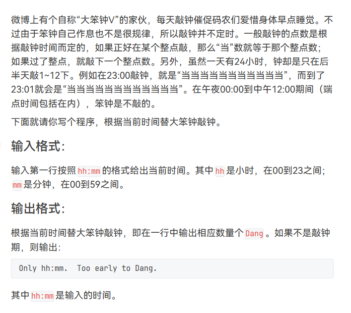

题目思路：


题目代码：

```cpp
#include<iostream>

using namespace std;
int main()
{    
	int h=0,m=0;
	char temp=':';    
	cin>>h>>temp>>m;    
	int count=h-12;    
	if(m>0)    
	{        
		count+=1;    
	}    
	if(count<=0)    
	{        
		printf("Only %02d:%02d.  Too early to Dang.",h,m);    
	}    
	else    
	{        
		for(int i=0;i<count;i++)        
		{            
			cout<<"Dang";        
		}     
	} 
}
```

### 题目来源：PTA-L2-042 老板的作息表

题目描述：  
 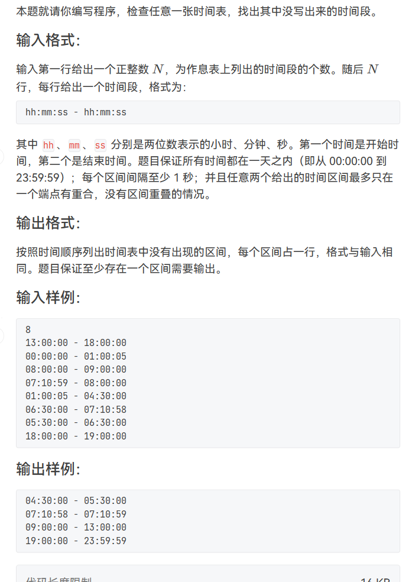

题目思路：


题目代码：

```cpp
//对于N要进行适应性的更改，对于字段错误
#include<bits/stdc++.h>
using namespace std;
#define inf 0x3f3f3f3f
#define N 505
int n,m,k,g,d;
int x,y,z;
char ch;
string str;
vector<int>v[N];

set<int>timet;
int vis[24*3601];
int main() {
	
	//vis[j]  表示 以j为结尾的是否 已经在了；
	int hh,mm,ss;
	cin>>n;
	for(int i=0;i<n;i++){
		cin>>hh>>ch>>mm>>ch>>ss;
		timet.insert(hh*3600+mm*60+ss);
		cin>>ch;
		cin>>hh>>ch>>mm>>ch>>ss;
		timet.insert(hh*3600+mm*60+ss);
		vis[hh*3600+mm*60+ss]=1;
	}
	vector<int>ans;
	
	for(auto ii:timet)ans.push_back(ii);
	
	vis[0]=1;
	ans.push_back(23*3600+59*60+59);
	
	for(int i=0;i<ans.size();i++){
		if(vis[ans[i]]!=1){
			hh=ans[i-1]/3600;
			mm=(ans[i-1]-hh*3600)/60;
			ss=ans[i-1]-hh*3600-mm*60;
			printf("%02d:%02d:%02d - ",hh,mm,ss);
			hh=ans[i]/3600;
			mm=(ans[i]-hh*3600)/60;
			ss=ans[i]-hh*3600-mm*60;
			printf("%02d:%02d:%02d",hh,mm,ss);
			cout<<endl;
		}
	}
	 

	return 0;
}
```

### 题目来源：蓝桥杯-第十四届模拟-第一期 充电器

题目描述：  
 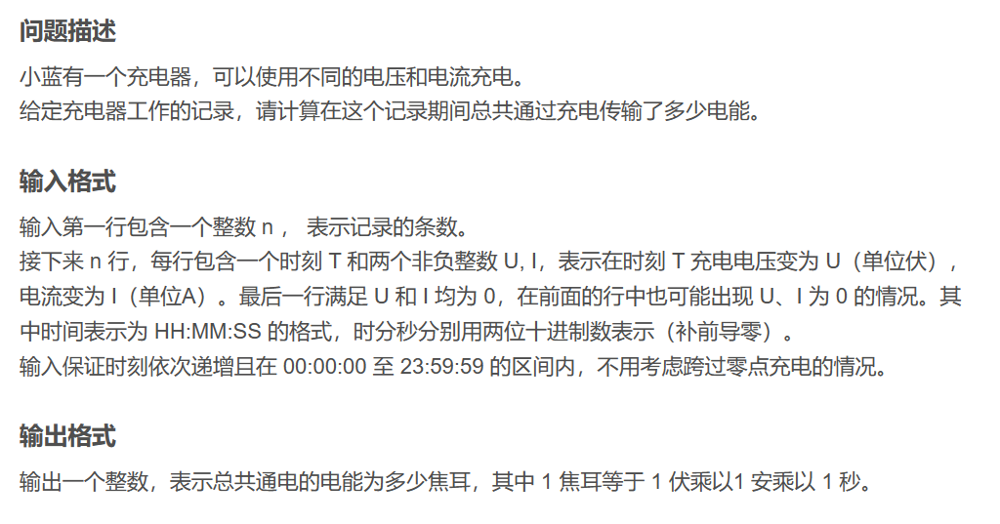

题目思路：


题目代码：

```cpp
#include <bits/stdc++.h>
using namespace std;
#define int long long

int n;
int last = 0, p = 0;	// 上次时间戳与功率
int ans = 0;

// 时间字符串转化为秒作为时间戳
int toSecond(string s) {
    int h = (s[0] - '0' + 0) * 10 + (s[1] - '0' + 0);
    int m = (s[3] - '0' + 0) * 10 + (s[4] - '0' + 0);
    int second = (s[6] - '0' + 0) * 10 + (s[7] - '0' + 0);
    return second + m * 60 + h * 60 * 60;
}

signed main() {
    string s;
    int u, i;
    cin >> n;
    while (n--) {
        cin >> s >> u >> i;
        int second = toSecond(s);
        ans += p * (second - last);
        last = second;
        p = u * i;
    }
    cout << ans << endl;
    return 0;
}
```

### 题目来源：蓝桥杯-2022省赛模拟-时长计算

题目描述：  
 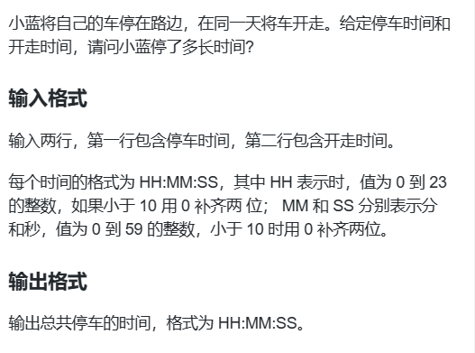

题目思路：


题目代码：

```cpp
#include<stdio.h>
int main()
{
    int h0,m0,s0;
    int h,m,s;
    int h1,m1,s1;
    int sum;
    scanf("%d:%d:%d",&h0,&m0,&s0);
    scanf("%d:%d:%d",&h,&m,&s);
    sum=(h*3600+m*60+s)-    (h0*3600+m0*60+s0);
    h1=sum/3600;
    m1=sum/60%60;
    s1=sum%60%60;
        printf("%02d:%02d:%02d",h1,m1,s1);
    return 0;
}
```

### 题目来源：蓝桥杯-2018省赛-航班时间

题目描述：  
 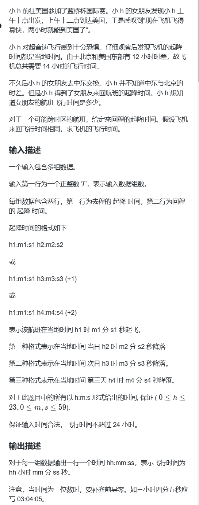

题目思路：


题目代码：

```cpp
#include<bits/stdc++.h>
using namespace std;

const int day = 24*60*60;    //全部转化为秒 
const int hour = 60*60;
const int minutes = 60;
 
int start() {      //出发时间 
    int a,b,c;
    scanf("%d:%d:%d",&a,&b,&c);
    int time = a*hour + b*minutes + c;
    return time;
}
 
int end() {   //到达时间 
    int a,b,c;
    scanf("%d:%d:%d",&a,&b,&c);
    int time = a*hour + b*minutes + c;
    char ch,extra_day;
    while( (ch = getchar())!='\n' && ch != '\r' ) {
        if(ch == '(') {
            getchar();  //除去"+" 
            extra_day = getchar();   //额外天数 
            time = time + (extra_day - '0')*day;
        }
    } 
    return time;
}
 
void display(int time) {    //显示时间 
    int a,b,c;
    a = time/hour;
    time = time % hour;
    b = time / minutes;
    time = time % minutes;
    c = time;
    printf("%02d:%02d:%02d\n",a,b,c);
}
 
int main() {
    int h1,m1,s1,h2,m2,s2;
    int t;
    scanf("%d",&t);
    while(t--) {
        int start1 = start();
        int end1 = end();
        int start2 = start();
        int end2 = end();
        int ans = 0;
        ans = (end1 - start1) + (end2 - start2);  //相加 
        display(ans/2);    //除2 
    }
    return 0;
}
```
