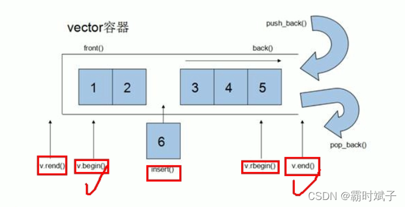

#### 目录

- [知识框架](#_3)
- [No.0 筑基](#No0__5)
- [No.1：积累的小知识](#No1_13)
- - [一：之前的知识点](#_15)
  - [二：输入的各自小细节规划](#_72)
  - [三：输出格式规范细节](#_106)
  - [四：数组设置](#_150)
  - [五：字符转数字](#_154)
  - [六：判断数字中不同的个数](#_158)
  - [七：对于位数不足进行前面补0](#0_200)
  - [八：闰年知识](#_203)
  - [九：auto的方便使用](#auto_206)
  - [十:二分查找](#_216)
- [No.2：STL知识](#No2STL_242)
- - - [一：vector](#vector_243)
    - - [1：与数组非常相似](#1_244)
      - [2：int](#2int_254)
      - [3：自定义类型](#3_293)
      - [4：嵌套容器](#4_295)
      - [5：vector的赋值](#5vector_335)
      - [6：vector 的容器的容量和大小操作](#6vector__384)
      - [7：vector的插入与删除](#7vector_417)
      - [8： 数据存取](#8__451)
    - [二：stack 、queue](#stack_queue_479)
    - - [1：栈](#1_480)
      - [2： 队列](#2__502)
    - [三：map](#map_528)
    - - [1：map中所有的元素都是pair像字典](#1mappair_529)
    - [四：set](#set_560)
    - - [1：set特点：插入自动从小到大排序，且不重复](#1set_561)
      - [2：set的大小和是否为空](#2set_589)
      - [3：set 的插入和删除](#3set__618)
      - [4：数据的查找](#4_653)
    - [五：list](#list_716)
    - - [1：list就是链表，结点：数据域+指针域](#1list_717)
      - [2：数据的插入与删除](#2_761)
      - [3：数据存取](#3_821)
    - [六：deque](#deque_858)
    - - [1：基础操作](#1_859)
      - [2：赋值操作和vector一样](#2vector_888)
    - [七：string](#string_891)
    - - [1：字符串的赋值](#1_892)
      - [2：string字符串拼接](#2string_909)
      - [3：字符串的查找](#3_945)
      - [4：字符串的替换](#4_975)
      - [5：字符串的比较](#5_993)
      - [6：字符串的单个](#6_1020)
      - [7：字符串的插入与删除](#7_1041)
      - [8：字符串的 字串，截取](#8_%09_1060)

## 知识框架

## No.0 筑基

> 请先学习下知识点，道友！  
>  题目知识点大部分来源于此：
>
> 题目例题大部分来源于此：

## No.1：积累的小知识

### 一：之前的知识点

> 1不是素数，2是素数

```cpp
int(38.9);
//1不是素数，2是素数
//push_back与pop_back均为容器vector操作函数
//求string的最后一个字符：此函数返回对字符串最后一个字符的直接引用。这只能用于非空字符串。
char ch=str.back()

//
string a="abcd";
1.获取字符串最后一个字符
auto b=a.back(); //结果为 b='d';

2.修改字符串最后一个字符
a.back()='!'; //结果为 a="abc!";

3.获取字符串第一个字符
auto b=a.front(); //结果为 b='a';

4.修改字符串第一个字符
a.front()='!'; //结果为 a="!bcd";


//substr是C++语言函数，主要功能是复制子字符串，要求从指定位置开始，并具有指定的长度。如果没有指定长度则子字符串将延续到源字符串//的结尾。
string s=str.substr(i,几个);


//字符串的倒置：

 getline(cin, str);
 reverse(str.begin(), str.end());
 cout << str << endl;


//数字转字符串：
string str=to_string(int x);
cin>>x;
string s=to_string(x);


//四舍五入：
我们输出的行数实际上是列数的50%（四舍五入取整）。
    if(n%2==0){
        h=n/2;
    }else{
        h=n/2+1;
    }


//求多个的最大值
maxx=max({a1,a2,a3,a4});
```

### 二：输入的各自小细节规划

```cpp
用getchar()吃回车

当第一行是n
第二行是getline	getline会自动吃回车。所以第三行的getline两个相隔不需要吃回车,但第一行与第二行要吃回车


当第一行是n时，
第二行读取字符用c=getchar()的时候

当用cin>>ch的时候不需要进行吃回车，会自动过滤空格；好像

例子1：
I love GPLT!  It's a fun game!
aeiou
当是这样的输入的时候：就是下面这样写：
getline(cin,s1);
getline(cin,s2);


例子2：
4
This is a test case
当是这样的输入的时候：就是下面这样写：
    cin>>n;
    getchar();
    getline(cin,str);
```

### 三：输出格式规范细节

```cpp
//每5个数字占一行，每个数字占5个字符宽度，向右对齐。
    for(int i=a;i<=b;i++){
        cout<<setfill(' ')<<setiosflags(ios::right)<<setw(5);
        cout<<i;
        sum=sum+i;
        cou++;
        if(cou%5==0){
            cout<<endl;
        }

    }
    if(cou%5!=0)cout<<endl;
    cout<<"Sum = "<<sum<<endl;

//


//设置ok 进行 格式设置 以及  数字个数确定的printf格式
	cin>>k;
    int ok=0;
    int book2[N]={0};
    int flag=0;
    while(k--){
        cin>>x;
        if(book[x]==0 &&book2[x]==0){
            if(ok==0){
                printf("%05d",x);
                ok=1;
            }else{
                printf(" %05d",x);
            }
            flag=1;
            book2[x]=1;
        }
    }
```

### 四：数组设置

> 对于 dp[20190324];这么大的数组，不能在main函数内部进行声明；  
>  要在main函数上面 进行声明，切记；

### 五：字符转数字

```cpp
int num=str[i]-'0' //的好处。
```

### 六：判断数字中不同的个数

```cpp
#include <bits/stdc++.h>

using namespace std;

int check(int x, int n){
    int a[10]={0}; //因为数字是十个
    int cnt=0;
    int i=4;   //检查几个位数、、
    while(i--){
            //a[x%10] x%10为从低位到高位的数字
        if(!a[x%10]++){cnt++;}

        x=x/10;
    }

    return cnt==n?1:0;
    // 如果cnt正好是要求的n，则返回1；
}
int main()
{
    int x,n;
    cin>>x>>n;
    int cn=0;
    for(int i=x; ;i++){
        if(check(i,n)){
            cout<<cn<<" ";
            cout << setw(4) << setfill('0')<<i<< endl;
            //这个不用break了，直接return了
            return 0;
        }
        cn++;

    }

    return 0;
}
```

### 七：对于位数不足进行前面补0

> cout << setw(4) << setfill(‘0’)<<i<< endl;

### 八：闰年知识

> 普通二月28天，一年365天；闰年二月29天，一年366天。

### 九：auto的方便使用

```cpp
	string str;
	cin>>str;
	for(auto s:str){
		cout<<s<<endl;
	}
```

### 十:二分查找

```cpp
class Solution {
public:
    int search(vector<int>& nums, int target) {

        int l=0,r=nums.size()-1;

        while(l<=r){
            int mid = (l+r)/2;
            if(nums[mid]==target){
                return mid;
            }else if(nums[mid]<target){
                l=l+1;
            }else if(nums[mid]>target){
                r=r-1;
            }
        }

        return -1;

    }
};
```

## No.2：STL知识

#### 一：vector

##### 1：与数组非常相似

> 首先这个是涉及到：,与数组类似，但是可以动态扩展：再找一个更大的空间，复制到更大的空间，然后释放原来的  
>  容器：Vector  
>  算法：for\_each  
>  迭代器：vector::iterator



##### 2：int

```cpp
#include <iostream>
#include<vector>
using namespace std;

int main()
{
    //一：先是创建一个int 类型的数组a；
    vector<int> v;
    
    //二：输入数据，尾插法
    v.push_back(6);
    v.push_back(8);

	//三：通过迭代器访问容器内的数据
	//第一种遍历方式：
	vector<int>:: iterator itBegin = v.begin();//指向容器的第一个元素
	vector<int>:: iterator itEnd = v.end();//指向容器的最后一个元素的下一个位置
	while(itBegin!=itEnd){
	cout<<*itBegin<<endl;
	itBegin++;
	
	}
	//第二种遍历方式：
	for(vector<int>::iterator it=v.begin();it!=v.end();it++){
	cout<<*it<<endl;
	}
	//第三种遍历方式：
	void MyPrint(int val){
	cout<<val<<endl;
	}
	for_each(v.begin(),v.end(),MyPrint);

    return 0;
}
```

##### 3：自定义类型

##### 4：嵌套容器

> 容器里面嵌套容器：：

```cpp
#include <iostream>
#include<vector>
using namespace std;

int main()
{
	vector<vector<int>> v;
	//创建小容器
	vector<int> v1;
	vector<int>v2;
	vector<int>v3;
	//
	for(int i=1;i<4;i++){
	v1.push_back(i);
	v2.push_back(i);
	v3.push_back(i);
	}
	//
	v.push_back(v1);
	v.push_back(v2);
	v.push_back(v3);
	//通过大容器遍历数据：
	for(vector< vector<int>>::iterator it=v.begin();it!=v.end();it++){
	//(*it) 是一个存放int的容器
	
		for(vector<int>::iterator vit=(*it).begin();vit!=(*it).end();vit++){
		cout<<(*vit);
		cout<<endl;
		}


	}

    return 0;
}
```

##### 5：vector的赋值

```cpp
#include <bits/stdc++.h>
using namespace std;

int main()
{
    vector<int> v;
    for(int i=0;i<10;i++){
        v.push_back(i);
    }

    for(vector<int>::iterator it=v.begin();it!=v.end();it++){
        cout<< *it<<" ";
    }
    cout<<endl;

    //直接赋值
    vector<int >v2;
    v2=v;
        for(vector<int>::iterator it=v2.begin();it!=v2.end();it++){
        cout<< *it<<" ";
    }
    cout<<endl;

    //assign
    vector<int> v3;
    v3.assign(v.begin(),v.end());

    for(vector<int>::iterator it=v3.begin();it!=v3.end();it++){
        cout<< *it<<" ";
    }
    cout<<endl;

    //n个elem值赋值
    vector<int> v4;
    v4.assign(10,100);// ten 100

    for(vector<int>::iterator it=v4.begin();it!=v4.end();it++){
        cout<< *it<<" ";
    }
    cout<<endl;

    return 0;
}
```

##### 6：vector 的容器的容量和大小操作

```cpp
#include <bits/stdc++.h>
using namespace std;

int main()
{
    vector<int> v;
    for(int i=0;i<10;i++){
        v.push_back(i);
    }

    if(v.empty()){
        cout<<"为空"<<endl;
    }else{
        cout<<"容量"<<v.capacity()<<endl;
        cout<<"大小"<<v.size()<<endl;

    }
    v.resize(12);//用0填充
    v.resize(13,4);//用4填充

    for(vector<int>::iterator it=v.begin();it!=v.end();it++){
        cout<< *it<<" ";
    }
    cout<<endl;
  //最终结果  0 1 2 3 4 5 6 7 8 9 0 0 4
    return 0;
}
```

##### 7：vector的插入与删除

```cpp
#include <iostream>
#include<vector>
using namespace std;
void Print(vector<int> &v){
    for(int i=0;i<v.size();i++){
        cout<<v[i]<<" ";
    }
    cout<<endl;
}
int main()
{

    vector<int> v;
    v.push_back(10);
    v.push_back(20);
    Print(v);
    v.pop_back();
    Print(v);
    v.insert(v.begin(),100); // 第一个参数是迭代器
    Print(v);
    v.insert(v.begin(),3,66);
    Print(v);
    v.erase(v.begin()); //删除的参数也是迭代器
    Print(v);
    v.clear();
    Print(v);

    return 0;
}
```

##### 8： 数据存取

```cpp
#include <iostream>
#include<vector>
using namespace std;
void Print(vector<int> &v){
    for(int i=0;i<v.size();i++){
        cout<<v[i]<<" ";
    }
    cout<<endl;
}
int main()
{

    vector<int> v;
    v.push_back(10);
    v.push_back(20);
    v.push_back(30);
    v.push_back(40);
    cout<<"第一个元素"<<v.front()<<endl;
    cout<<"最后个元素"<<v.back()<<endl;
    Print(v);

    return 0;
}
```

#### 二：stack 、queue

##### 1：栈

```cpp
#include <iostream>
#include<stack>
using namespace std;
int main()
{
    stack<int> s;
    s.push(10);
    s.push(20);
    s.push(30);
    cout<<"栈的大小"<<s.size()<<endl;
    while(!s.empty()){
        cout<<s.top()<<" "<<endl;
        s.pop();
    }
    cout<<"栈的大小"<<s.size()<<endl;
    return 0;
}
```

##### 2： 队列

```cpp
#include <iostream>
#include<queue>
using namespace std;
int main()
{
    queue<int> q;
    q.push(10);
    q.push(20);
    q.push(30);
    cout<<"队列的长度"<<q.size()<<endl;
    while(!q.empty()){
        cout<<"队列的第一个：对头"<<q.front()<<endl;

        cout<<"队列的最后一个"<<q.back()<<endl;

        q.pop();
    }
    cout<<"队列的长度"<<q.size()<<endl;
    return 0;
}
```

#### 三：map

##### 1：map中所有的元素都是pair像字典

```cpp
#include <iostream>
#include<string>
#include<map>
using namespace std;
void Print(map<int,int> &m){
    for(map<int,int>::iterator  it=m.begin();it!=m.end(); it++){
        cout<<"key="<<(*it).first <<"   "<<"value="<<it->second<<endl;
    }

}


int main()
{
    map<int,int>m;
    m.insert(pair<int,int>(1,10));
    m.insert(pair<int,int>(3,20));
    m.insert(pair<int,int>(2,30));
    Print(m);

    cout<<m.size()<<endl;
    cout<<m.empty();
    return 0;
}
```

#### 四：set

##### 1：set特点：插入自动从小到大排序，且不重复

```cpp
#include <iostream>
#include<set>
using namespace std;


void Print(set<int> &lt){
    for(set<int>:: iterator it=lt.begin(); it!=lt.end();it++){
        cout<<*it<<" ";
    }
    cout<<endl;
}

int main()
{
    set<int> sc;
    //插入只有insert, 容器的特点，在插入的时候自动排序
    sc.insert(8);
    sc.insert(6);
    sc.insert(7);
    Print(sc);

    return 0;
}
```

##### 2：set的大小和是否为空

```cpp
#include <iostream>
#include<set>
using namespace std;


void Print(set<int> &lt){
    for(set<int>:: iterator it=lt.begin(); it!=lt.end();it++){
        cout<<*it<<" ";
    }
    cout<<endl;
}

int main()
{
    set<int> sc;
    //插入只有insert, 容器的特点，在插入的时候自动排序
    sc.insert(8);
    sc.insert(6);
    sc.insert(7);
    Print(sc);
    cout<<sc.size()<<" "<<sc.empty()<<endl;

    return 0;
}
```

##### 3：set 的插入和删除

```cpp
#include <iostream>
#include<set>
using namespace std;


void Print(set<int> &lt){
    for(set<int>:: iterator it=lt.begin(); it!=lt.end();it++){
        cout<<*it<<" ";
    }
    cout<<endl;
}

int main()
{
    set<int> sc;
    //插入只有insert, 容器的特点，在插入的时候自动排序
    sc.insert(8);
    sc.insert(6);
    sc.insert(7);
    Print(sc);
    sc.erase(sc.begin());
    Print(sc);

    sc.erase(8);
    Print(sc);
    
    sc.clear();

    return 0;
}
```

##### 4：数据的查找

```cpp
#include <iostream>
#include<set>
using namespace std;


void Print(set<int> &lt){
    for(set<int>:: iterator it=lt.begin(); it!=lt.end();it++){
        cout<<*it<<" ";
    }
    cout<<endl;
}

int main()
{
    set<int> sc;
    //插入只有insert, 容器的特点，在插入的时候自动排序
    sc.insert(8);
    sc.insert(6);
    sc.insert(7);

    if(sc.find(7)!=sc.end()){
        cout<<"找到了"<<endl;
    }else{
        cout<<"没有找到"<<endl;
    }

    if(sc.count(7)){ // 返回只有0和1
        cout<<"找到了"<<endl;
    }else{

        cout<<"没有找到"<<endl;
    }


    return 0;
}


两个set，计数相同的元素：
	while(k--)
	{
		int a,b;
		cin>>a>>b;
		int sum1=sc[a].size();
		int sum2=sc[b].size();
		int sum3=0;
        set<int>::iterator it;
		for(it=sc[a].begin(); it!=sc[a].end(); it++)
		{
		    //共有的
			if(sc[b].find(*it)!=sc[b].end())
			  sum3++;
		}
		printf("%.2lf",1.0*sum3/(sum1+sum2-sum3)*100);
		cout<<"%"<<endl;
	}
```

#### 五：list

##### 1：list就是链表，结点：数据域+指针域

```cpp
#include <iostream>
#include<list>
using namespace std;
void Print(const list<int> &lt){
    for(list<int>::const_iterator it=lt.begin(); it!=lt.end();it++){
        cout<<*it<<" ";
    }
    cout<<endl;

}
int main()
{
    list<int> lt;
    lt.push_back(10);
    lt.push_back(20);
    lt.push_back(30);
    Print(lt);


    list<int> ltt;
    ltt=lt;
    Print(ltt);

    list<int>lt5(3,10);
    lt5.assign(4,9);
    Print(lt5);

    if(lt5.empty()){
        cout<<"为空"<<endl;
    }
    cout<<"元素个数："<<lt5.size()<<endl;

    lt5.resize(10,6);
    Print(lt5);
    lt5.resize(2);
    Print(lt5);

    return 0;
}
```

##### 2：数据的插入与删除

```cpp
#include <iostream>
#include<list>
using namespace std;
/*
push_back(elem);//在容器尾部加入一个元素
pop_back() ;//删除容器中最后一个元素
push_front(elem);//在容器开头插入一个元素
pop_front();//从容器开头移除第一个元素
insert(pos,elem) ;//在pos位置插elem元素的拷贝，返回新数据的位置。
insert(pos,n, elem) ;//在pos位置插入n个elem数据，无返回值。
insert(pos, beg, end); //在pos位置插入[beg, end)区间的数据，无返回值。
clear() ;//移除容器的所有数据
erase (beg, end) ;//删除[beg, end)区间的数据，返回下一个数据的位置。
erase(pos);//删除pos位置的数据，返回下一个数据的位置。
remove(elem);//删除容器中所有与elem值匹配的元素。
*/

void Print(const list<int> &lt){
    for(list<int>::const_iterator it=lt.begin(); it!=lt.end();it++){
        cout<<*it<<" ";
    }
    cout<<endl;
}

int main()
{
    list<int> lt;
    //尾插
    lt.push_back(10);
    lt.push_back(20);
    lt.push_back(30);

    //头插

    lt.push_front(3);
    lt.push_front(2);
    lt.push_front(1);

    Print(lt);

    //尾删
    lt.pop_back();
    lt.pop_front();
    Print(lt);

    lt.insert(lt.begin(),888);
    Print(lt);
    
    lt.remove(888);
    Print(lt);


    return 0;
}
```

##### 3：数据存取

```cpp
#include <iostream>
#include<list>
using namespace std;


void Print(const list<int> &lt){
    for(list<int>::const_iterator it=lt.begin(); it!=lt.end();it++){
        cout<<*it<<" ";
    }
    cout<<endl;
}

int main()
{
    list<int> lt;
    lt.push_back(10);
    lt.push_back(20);
    lt.push_back(30);
    //L1[0]不可以用[访问list容器中的元素
    //L1.at(0)不可以用at方式访问list容器中的元素
    //原因是list本质链表，不是用连续线性空间存储数据，迭代器也是不支持随机访问的


    cout<<lt.back()<<"   "<<lt.front()<<endl;
    
    //验证迭代器是不支持随机访问的
    list<int> : :iterator it = L1.begin() ;
    it++;//支持双向
    it--;
    //it = it + 1;//错误，不支持随机访问
    return 0;
}
```

#### 六：deque

##### 1：基础操作

```cpp
#include <iostream>
#include<deque>
using namespace std;
void Print(deque<int> &d){
    for(int i=0;i<d.size();i++){
        cout<<d[i]<<" ";
    }
    cout<<endl;

}
int main()
{

    deque<int > d;
    //双端队列四个基本操作
    d.push_back(10);
    d.push_front(5);
    Print(d);
    d.pop_back();
    d.pop_front();
    Print(d);

    return 0;
}
```

##### 2：赋值操作和vector一样


#### 七：string

##### 1：字符串的赋值

> 把字符串的前n个赋值给字符串

```cpp
#include <iostream>

using namespace std;

int main()
{
    string str1;
    str1.assign("hello,jack",5);
    cout << str1<< endl;
    return 0;
}
//结果为前五个字符：hello
```

##### 2：string字符串拼接

> 第一种直接用 “+”

```cpp
#include <iostream>
#include<string>
using namespace std;

int main()
{
    string str1="I";
    str1=str1+"ai wan you xi";
    cout << str1<< endl;
    return 0;
}
```

> 第二种：用append（）

```cpp
#include <iostream>
#include<string>
using namespace std;

int main()
{
    string str1="I";
    str1.append("love");
    str1.append("you.......",3);//增加前三个‘
    str1.append("you...",0,3)//从第0个开始截取三个字符
    
    cout << str1<< endl;
    return 0;
}
```

##### 3：字符串的查找

> 字符串中查找字符串

```cpp
#include <bits/stdc++.h>
using namespace std;

int main()
{
    string str1="abcdefgde";
    //从左往右查找
    int pos=str1.find("de");
    cout<<pos<<endl;//输出为3
    pos = str1.find("df");//输出为-1

    if(pos==-1){
        cout<<"未找到字符串"<<endl;
    }else{
        cout<<"该字符串位置"<<pos<<endl;
    }

        //从右往左查找
    int pos2=str1.rfind("de");//输出为7
    cout<<pos2<<endl;


    return 0;
}
```

##### 4：字符串的替换


```cpp
#include <bits/stdc++.h>
using namespace std;

int main()
{
    string str1="abcdefgde";

    str1.replace(1,3,"1234");
    // 从1开始bcd三个字符替换为1234四个字符串
    cout<<str1<<endl;
    return 0;
}
```

##### 5：字符串的比较

> 逐个按照字符 的ASCII码值进行比较  
>  ==返回0； > 返回1；；<返回-1；；

```cpp
#include <bits/stdc++.h>
using namespace std;

int main()
{
    string str1="xello";
    string str2="hello";
    int res=str1.compare(str2);

    if(res==0){
        cout<<"两个字符串相等"<<endl;
    }
    else if(res>0){
        cout<<"大于"<<endl;
    }
    else if(res<0){
        cout<<"小于"<<endl;
    }
    return 0;
}
```

##### 6：字符串的单个

```cpp
#include <bits/stdc++.h>
using namespace std;

int main()
{
    string str1="xello";
    for(int i=0;i<str1.size();i++){
        cout<<str1[i]<<" "<<endl;
    }
    str1[0]='h';//这个必须是单引号

    for(int i=0;i<str1.size();i++){
        cout<<str1[i]<<" "<<endl;
    }
    return 0;
}
```

##### 7：字符串的插入与删除

```cpp
#include <bits/stdc++.h>
using namespace std;

int main()
{
    string str1="xello";
    //在第i个位置进行插入
    str1.insert(1,"2");//x2ello
    // 进行删除
    str1.erase(1,2);   //xllo
    
    cout<<str1<<endl;
    return 0;
}
```

##### 8：字符串的 字串，截取

```cpp
#include <bits/stdc++.h>
using namespace std;

int main()
{
    string str1="xello";
    string strsub=str1.substr(1,3);

    cout<<str1<<endl;
    cout<<strsub<<endl;

    //实用操作
    string str="zhangsan@qq.com";
    int pos = str.find('@');
    string Name=str.substr(0,pos);
    cout<<Name<<endl;
    return 0;
}
```
