#### 目录

- [知识框架](#_1)
- [No.0 筑基](#No0__2)
- [No.1 双指针](#No1__25)
- - [题目来源：LeetCode-283. 移动零](#LeetCode283__28)
  - [题目来源：LeetCode-15. 三数之和](#LeetCode15__93)
  - [题目来源：LeetCode-27-移除元素](#LeetCode27_195)
  - [题目来源：LeetCode-977-有序数组的平方](#LeetCode977_228)
  - [题目来源：LeetCode-1014. 最佳观光组合](#LeetCode1014__265)
  - [题目来源：蓝桥杯-第九届-日志统计](#_301)
  - [题目来源：Acwing-800. 数组元素的目标和](#Acwing800__364)
  - [题目来源：Acwing-4483-格斗场](#Acwing4483_408)
  - [题目来源：LeetCode-189. 轮转数组](#LeetCode189__495)
- [No.2 接雨水类似题目](#No2__553)
- - [题目来源：LeetCode-11. 盛最多水的容器](#LeetCode11__557)
  - [题目来源：LeetCode-42. 接雨水](#LeetCode42__630)

## 知识框架

## No.0 筑基

> 请先学习下知识点，道友！  
>  题目知识点大部分来源于此：[代码随想录：双指针](https://www.programmercarl.com/%E5%8F%8C%E6%8C%87%E9%92%88%E6%80%BB%E7%BB%93.html)  
>  来自Acwing的Y总的模板

```cpp
for (int i = 0, j = 0; i < n; i ++ )
{
    while (j < i && check(i, j)) j ++ ;

    // 具体问题的逻辑
}

int left=0, right=n-1;
while(left<right){
    // 只看 left 和 right 两个点
    if(nums[left]+nums[right] == target) ...
}
常见问题分类：
    (1) 对于一个序列，用两个指针维护一段区间
    (2) 对于两个序列，维护某种次序，比如归并排序中合并两个有序序列的操作
```

## No.1 双指针

### 题目来源：LeetCode-283. 移动零

题目描述：  
 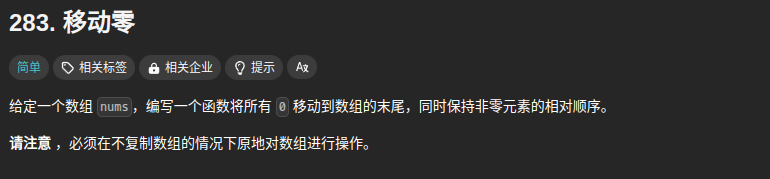

题目思路：


题目代码：

```cpp
class Solution {
public:
    void moveZeroes(vector<int>& nums) {
        // 双指针，一个在前面维持住 
        // 把0挪到后面，意味着把数字全部放在前面。
        // i 指针维持着 存在数字的位置。
        // j指针循环往后就可以了。
        int n = nums.size();
        //同向的双指针， 双指针就不一定固定 left 还是 right了。
        // 维护左边， for右边。
        int left = 0, right = 0;
        for(right = 0; right < n; right++){
            if(nums[right] != 0){
                swap(nums[left], nums[right]);
                left++;
            }
        }
    }
};
```

```cpp
class Solution {
public:
    void moveZeroes(vector<int>& nums) {
        // 双指针，一个在前面维持住 
        // 因为是相对顺序，前面读错了读成了  有序
        // 因为是相对顺序，所以 遇到0的要和 后面第一个非0的进行 交换就可以了
        int i = 0;
        int j = 0;
        int n = nums.size();
        int tmp = 0;
        for( ; i < n; i++){
            if(nums[i] == 0){
                // 和后面的第一个非0的进行交换
                for(j = i + 1; j < n; j++){
                    if(nums[j] != 0){
                        nums[i] = nums[j];
                        nums[j] = 0;
                        break;
                    }
                }
            }
        }
        
    }
};
```

### 题目来源：LeetCode-15. 三数之和

题目描述：  
 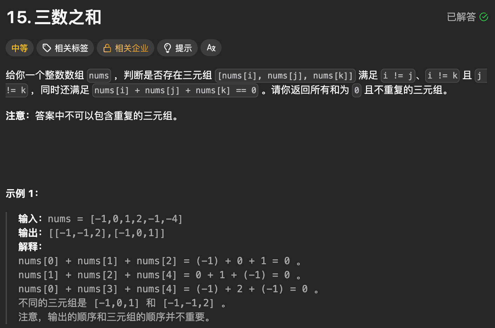

题目思路：

> 三层暴力超时， 需要考虑、、、311/316

题目代码：

```cpp
class Solution {
public:
    vector<vector<int>> threeSum(vector<int>& nums) {
        // 即 nums[i] + nums[j] = - nums[k]
        // 暂定pos = -nums[k]
        // 1- 先是直接进行 三层for循环暴力
        // 2- 由于不能重复，将结果进行sort然后insert到set
        // 3- 暴力超时，进行剪纸 还是超时、、、、
        

        // 主要是这个相向指针？？？。
        // 有序的相向指针？
        sort(nums.begin(), nums.end());
        vector<vector<int>>res;
        int n = nums.size();
        for(int i = 0; i < n - 2; i++){
            int x = nums[i];
            int target = -x;
            if(i >= 1 && nums[i] == nums[i - 1])continue;
            if(x > 0)break;
            
            int j = i + 1; 
            int k = n - 1;
            while(j < k){
                int sum = x + nums[j] + nums[k];
                if(sum > 0){
                    k--;
                }else if(sum < 0){
                    j++;
                }else if(sum == 0){
                    res.push_back({x, nums[j], nums[k]});
                    // 判断重复;因为已经是排序过的
                    do{
                        j++;
                    }while(j < k && nums[j] == nums[j - 1]);
                    do{
                        k--;
                    }while(k > j && nums[k] == nums[k + 1]);
                }
            }
        }
        return res;
    }
};
```

```cpp
class Solution {
public:
    vector<vector<int>> threeSum(vector<int>& nums) {
        // 即 nums[i] + nums[j] = - nums[k]
        // 暂定pos = -nums[k]
        // 1- 先是直接进行 三层for循环暴力
        // 2- 由于不能重复，将结果进行sort然后insert到set
        // 3- 暴力超时，进行剪纸 还是超时、、、、
        
        std::sort(nums.begin(), nums.end());
        std::set<vector<int>>res;
        vector<int>tmp;
        int n = nums.size();
        for(int i = 0; i < n; i++){
            if(nums[i] > 0)break;
            for(int j = i + 1; j < n; j++){
                if(nums[j] > -nums[i])break;
                int now = nums[i] + nums[j];
                for(int k = j + 1; k < n; k++){
                    if(nums[k] > -now)break;
                    if(nums[k] == -now){
                        tmp.push_back(nums[i]);
                        tmp.push_back(nums[j]);
                        tmp.push_back(nums[k]);
                        std::sort(tmp.begin(), tmp.end());
                        res.insert(tmp);
                        tmp.clear();
                        break;
                    }
                }
            }
        }
        // 那就去掉重复的
        std::vector<std::vector<int>>ans;
        for(auto rs : res)ans.push_back(rs);
        return ans;

    }
};
```

### 题目来源：LeetCode-27-移除元素

题目描述：  
 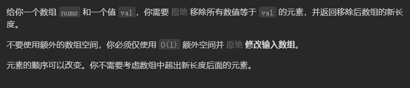

题目思路：


题目代码：

```cpp
class Solution {
public:
    int removeElement(vector<int>& nums, int val) {
        // 维护左边，for右边
        int n = nums.size();
        int left = 0, right = 0;
        for(right = 0; right < n; right++){
            if(nums[right] == val)continue;
            swap(nums[left], nums[right]);
            left++;
        }
        return left;
    }
};
```

### 题目来源：LeetCode-977-有序数组的平方

题目描述：  
 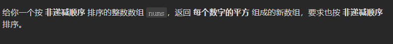

题目思路：

> 思想？

题目代码：

```cpp
class Solution {
public:
    vector<int> sortedSquares(vector<int>& nums) {
        // 有序，考虑 相向 双指针。
        // 这个主要是 放置吧，从最大的开始放置
        int n = nums.size();
        vector<int>res(n, 0);
        int left = 0, right = n - 1;
        for(int i = n - 1; i >= 0; i--){
            int x = nums[left];
            int y = nums[right];
            if(x * x  > y * y){
                res[i] = x * x;
                left++;
            }else{
                res[i] = y*y;
                right--;
            }
        }
        return res;
    }
};
```

### 题目来源：LeetCode-1014. 最佳观光组合

题目描述：

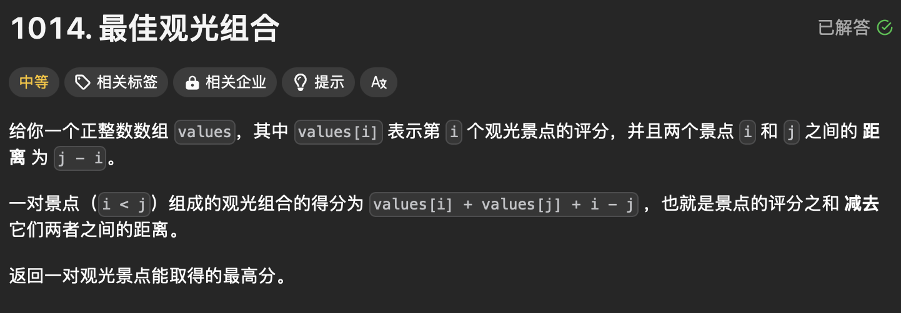

题目思路：


题目代码：

```cpp
class Solution {
public:
    int maxScoreSightseeingPair(vector<int>& values) {
        // 这种没有顺序的也能相向吗？
        // 看这样不行，

        // 这种是属于 维护左边的; 然后遍历for 右边的。

        int n = values.size();
        int left = 0, right = 0;
        int maxLen = 0;
        int left_max = 0;
        for(right = 0; right < n; right++){
            maxLen = max(maxLen, left_max + values[right] - right);
            left_max = max(left_max, values[right] + right);
        }
        return maxLen;
        
    }
};
```

### 题目来源：蓝桥杯-第九届-日志统计

题目描述：  
 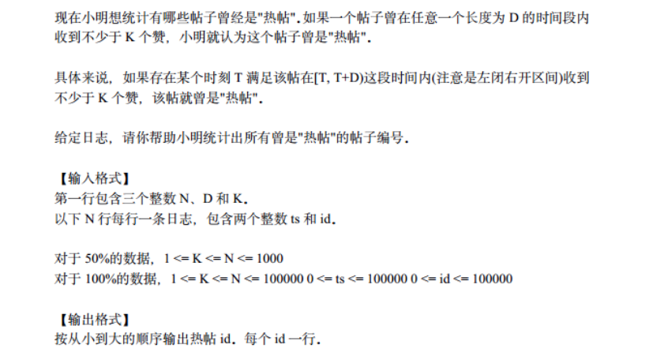

题目思路：

> 利用vector来保存时刻，再利用set去重

题目代码：

```cpp
#include<iostream>
#include<algorithm>
#include<vector> 
#include<set>
using namespace std;
#define N 100005
vector<int> t[N];
set<int> s;
int n,d,k; 
bool judge(int x)
{
	int len=t[x].size();
	if(len<k)
		return 0;
	sort(t[x].begin(),t[x].end());	
	int l=0,r=0,sum=0;
	while(l<=r&&r<len)
	{
		sum++;
		if(sum>=k)
		{
			if(t[x][r]-t[x][l]<d)
				return 1;
			else
			{
				l++;
				sum--;
			}
		}
		r++;
	}	
	return 0;
}
int main()
{
	cin>>n>>d>>k;
	for(int i=0;i<n;i++)
	{
		int ts,id;
		cin>>ts>>id;
		t[id].push_back(ts);
		s.insert(id);
	}
	for (set<int>::iterator it = s.begin(); it != s.end(); it++)
	{
		int x = *it;
		if(judge(x))
			cout<<x<<endl;
	}
	return 0;
}
```

### 题目来源：Acwing-800. 数组元素的目标和

题目描述：

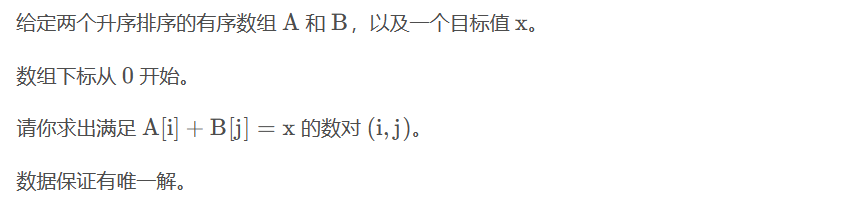

题目思路：


题目代码：

```cpp
#include <iostream>
using namespace std;

const int N = 1e5 + 10;
int a[N], b[N], n, m, x;

int main()
{
    scanf("%d%d%d", &n, &m, &x);
    
    for (int i = 0; i < n; i++) scanf("%d", &a[i]);
    for (int i = 0; i < m; i++) scanf("%d", &b[i]);
    
    for (int i = 0, j = m - 1; i < n; i++)
    {
        // 因为保证了一定有解
        while (a[i] + b[j] > x) j--;
        if (a[i] + b[j] == x)
        {
            printf("%d %d\n", i, j);
            break;
        }
    }
    
    return 0;
}
```

### 题目来源：Acwing-4483-格斗场

题目描述：  
 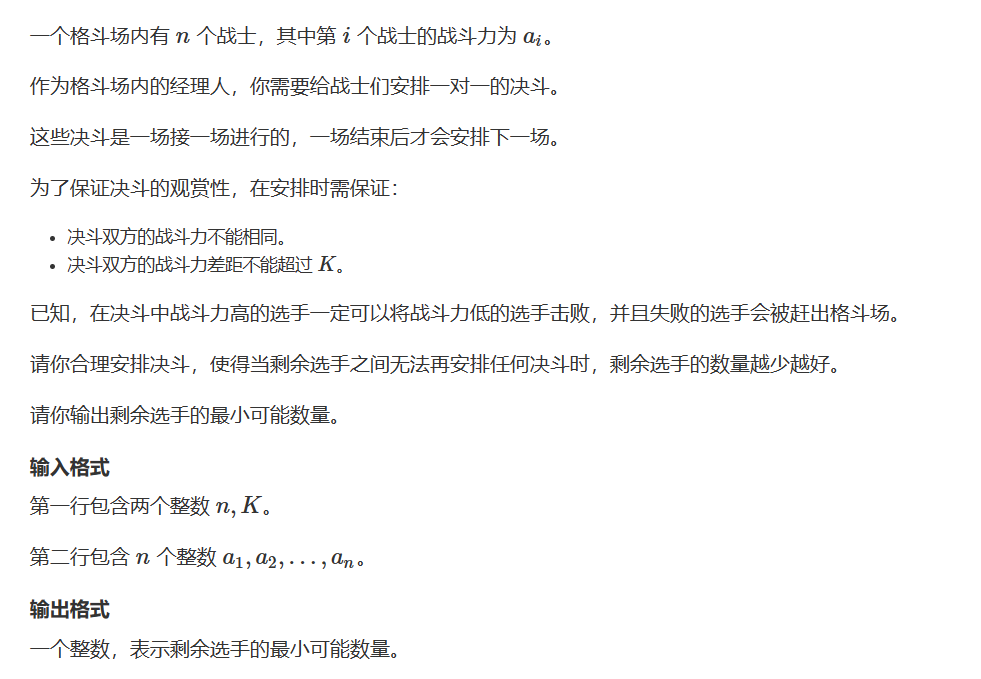

题目思路：

> 双指针，指的是在遍历对象的过程中，不是普通的使用单个指针进行访问，而是使用两个相同方向（快慢指针）或者相反方向（对撞指针）的指针进行扫描，从而达到相应的目的。  
>  换言之，双指针法充分使用了数组有序这一特征，从而在某些情况下能够简化一些运算

题目代码：

```cpp
第一种方法：双指针
//在本题中因为如果i在后面限制条件下直到找到j为对手才满足条件；那么i+1选手想要找到满足条件的位置最少为i+1 ； 即第二个指针
// 不用再从1开始了；用第二个指针进行标记；
第二种方法：low_bouner;那类的直接找到
    
//对于每一个i，维护一个j，使得a[j] - a[i] 是大于 k //的第一个数。则前一个数可以删掉

下面这个是超时的：就是因为输出超时了
#include <bits/stdc++.h>
using namespace std;
#define  N 100100
int n,m,s,k,d;
int x,y,z;
vector<int>v[N];
int vis[N]={0};
int main()
{
    cin>>n>>k;
    int a[n+1];
    int vis[N]={0};
    int j=1;
    for(int i=0;i<n;i++){
        cin>>a[i];
    }
    sort(a,a+n);
    for(int i=0;i<n;i++){
        while(j<n&&a[j]-a[i]<=k)j++;
        if(a[j-1]>a[i])vis[a[i]]=1;


    }
    int coun=0;
    for(int i=0;i<n;i++){
        if(vis[a[i]]==0)coun++;
    }
    cout<<coun<<endl;
    return 0;
}


下面这个是没有超时的
#include <bits/stdc++.h>
using namespace std;
#define  N 100100
int n,m,s,k,d;
int x,y,z;
vector<int>v[N];
int vis[N]={0};
int main()
{
    cin>>n>>k;
    int a[n+1];
    int vis[N]={0};
    int j=1;
    for(int i=0;i<n;i++){
        cin>>a[i];
    }
    int coun=n;
    sort(a,a+n);
    for(int i=0;i<n;i++){
        while(j<n&&a[j]-a[i]<=k)j++;
        if(a[j-1]>a[i])coun--;
    }
    cout<<coun<<endl;
    return 0;
}
```

### 题目来源：LeetCode-189. 轮转数组

题目描述：  
 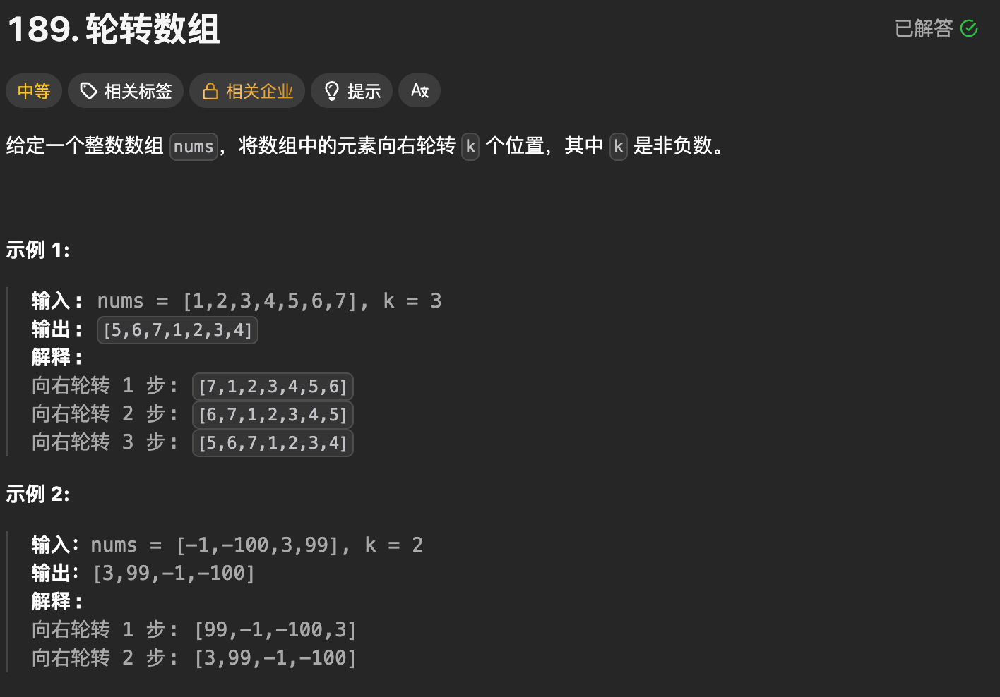

题目思路：


题目代码：

```cpp
class Solution {
public:
    void rotate(vector<int>& nums, int k) {
        int n = nums.size();
        k = k % n;
        int left = 0, right = 0;
        left = 0 + k;
        // 用 1 2 3 4 5 6 7 k=2为例子
        reverse(nums.begin(), nums.end());
        // 7 6 5 4 3 2 1;
        reverse(nums.begin() + k, nums.end());
        // 7 6 1 2 3 4 5;
        reverse(nums.begin(), nums.begin() + k);
        // 6 7 1 2 3 4 5;
    }
};
```

```cpp
class Solution {
public:
    void rotate(vector<int>& nums, int k) {
        int n = nums.size();
        k = k % n;
        if(n <= k)return;


        // 填补k个
        std::vector<int>tmp(k);
        for(size_t i = 0; i < k; i++){
            tmp[i] = nums[n - k + i];
        }
        for(int i = n - k - 1; i >= 0; i--){
            nums[i + k] = nums[i];
        }
        for(size_t i = 0; i < k; i++){
            nums[i] = tmp[i];
        }
    }
};
```

## No.2 接雨水类似题目

### 题目来源：LeetCode-11. 盛最多水的容器

题目描述：  
 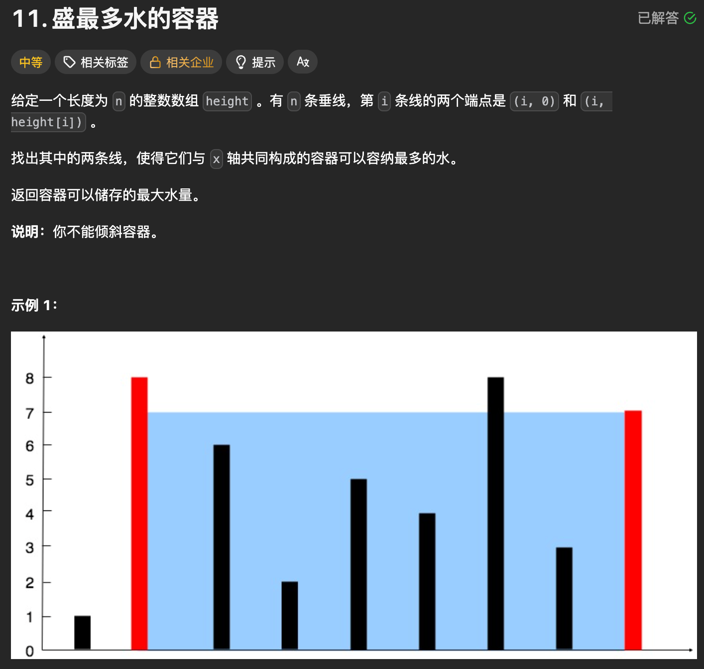

题目思路：


题目代码：

```cpp
class Solution {
public:
    int maxArea(vector<int>& height) {

        // 这里不能排序sort
        // 暴力的话是 进行 (j - i + 1) * (min()) 但是并不高效,会超时n^2
        // 但是和单调栈也没有关系啊

        // 真的不能进行 sort吗？ 本质就是(j - i) * min()
        // 假设先排序，然后 从左往右有序，那么先假定最大的是 0 和 n
        // 那么右边的指针 开始往左，只要height小于的话就不比了；

        // int n = height.size();
        // int maxx = 0;
        // for(int i=0;i<height.size();i++){
        //     if(i > 0 && height[i] <= height[i - 1])continue;
        //     int now_j_max = 0;
        //     for(int j = n - 1; j > i; j--){
        //         if(height[j] <= now_j_max)continue;
        //         int minn = min(height[i],height[j]);
        //         maxx = max(maxx, minn*(j - i));
        //     }
        // }
        // return maxx;


        // 如果是双端指针呢？ 两边往中间移动，这样 直到碰面，这样就是 n了
        // 但是 这样好像 左侧的遇不到左侧的啊？也不是
        // 也不对，好像根据规则是能够便利的
        int left = 0;
        int right = 0;
        int maxx = 0;
        int n = height.size();
        right = n - 1;


        while(left <= right){
            int width = right - left;
            maxx = max(maxx, width*(min(height[left], height[right])));
       

            // 如果 height[left] 更矮，
            //则 height[left] 与右边的任意垂线都无法组成一个比 ans 更大的面积
            
            // 如果 height[right] 更矮，
            // 则 height[right] 与左边的任意垂线都无法组成一个比 ans 更大的面积
            if(height[left] < height[right]){
                left++;
            }else{  
                right--;
            }
        }
        return maxx;
    }
};
```

### 题目来源：LeetCode-42. 接雨水

题目描述：  
 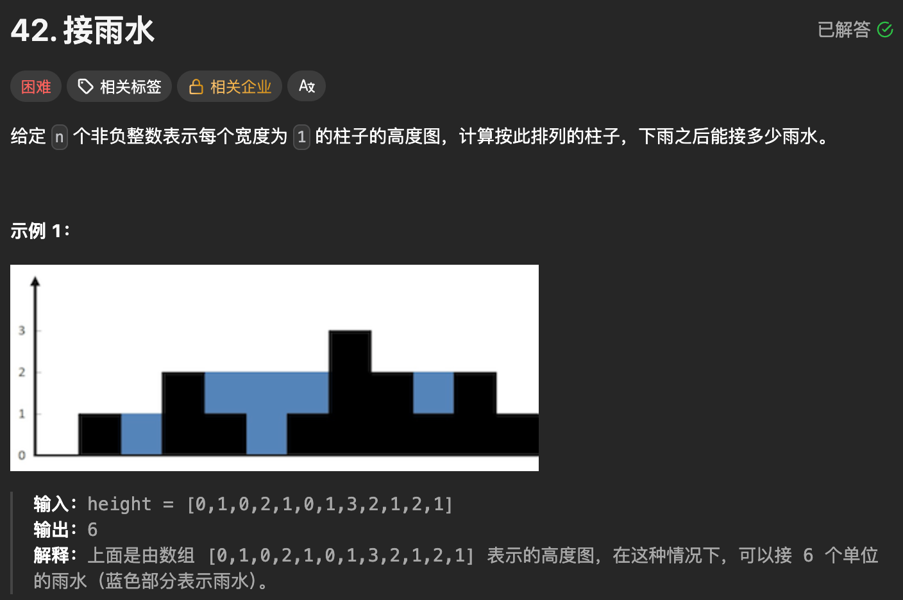

题目思路：


题目代码：

```cpp
class Solution {
public:
    int trap(vector<int>& height) {
        
        
        // 这个在双指针和单调栈那里都要记录
        // 这道题目的能接多少雨水是固定的，因为柱子固定了
        // 如果 固定左边， 另外一个 往右边单调栈的话


        // 接雨水的核心公式：
        // 当前位置能接的雨水量 = min(左侧最大高度, 右侧最大高度) - 当前高度（如果结果 > 0）
        // 但是如果按照公式进行的话 又是时间复杂度 n^2的
        // 所以需要两个单调栈进行解决也是可以的； 但是如果使用 双指针进行解决呢？
        // 双指针的话就是这样了， left维护左侧的最大高度, right维护右侧的最大高度
        

        // 太难优化到 O(n) 了。 双端指针
        // 这个还需要再看看、、、、
        if (height.empty()) return 0; // 空数组直接返回0
        
        int n = height.size();
        int left = 0;                // 左指针，从数组头部开始
        int right = n - 1;           // 右指针，从数组尾部开始
        int left_max = 0;            // 左侧遍历过的最大高度
        int right_max = 0;           // 右侧遍历过的最大高度
        int total_water = 0;         // 总接水量
        
        while (left < right) {
            // 更新左右最大高度（当前指针位置的高度可能成为新的最大）
            left_max = max(left_max, height[left]);
            right_max = max(right_max, height[right]);
            
            // 核心判断：哪边的最大高度更小，就计算哪边的雨水量
            if (left_max < right_max) {
                // left位置的雨水量由left_max决定
                total_water += left_max - height[left];
                left++; // 左指针右移
            } else {
                // right位置的雨水量由right_max决定
                total_water += right_max - height[right];
                right--; // 右指针左移
            }
        }
        return total_water;
    }
};
```
