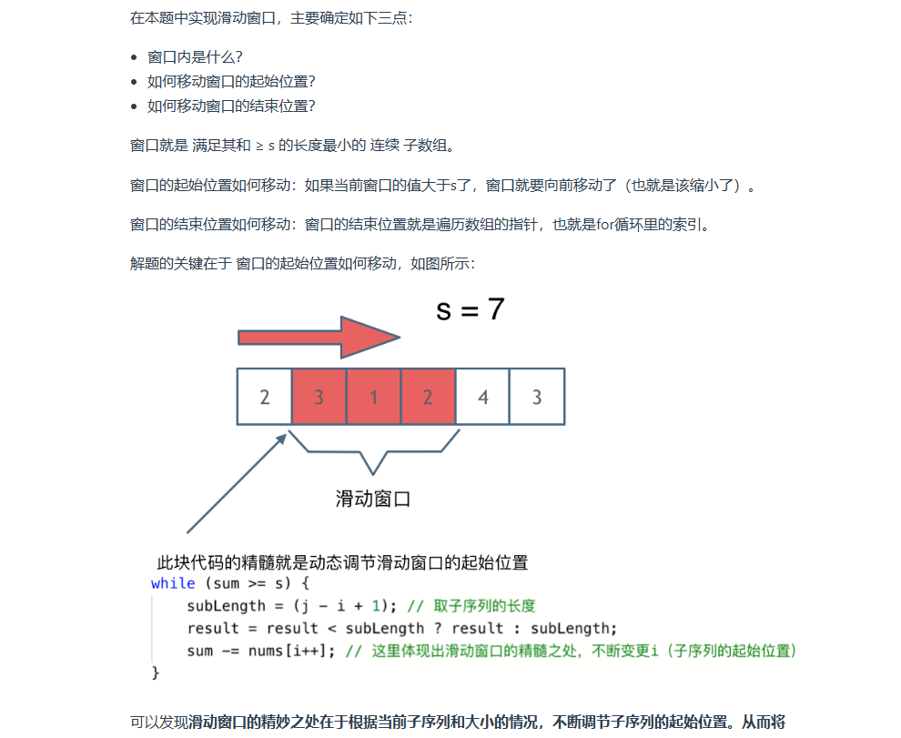
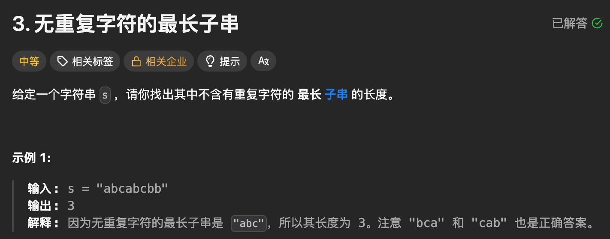
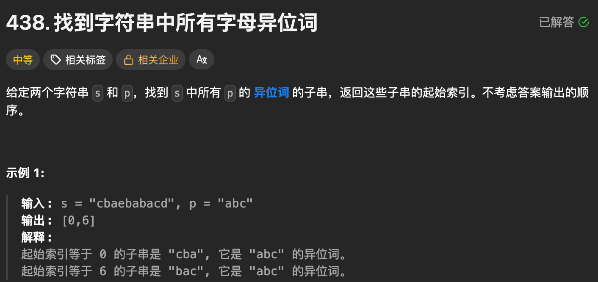
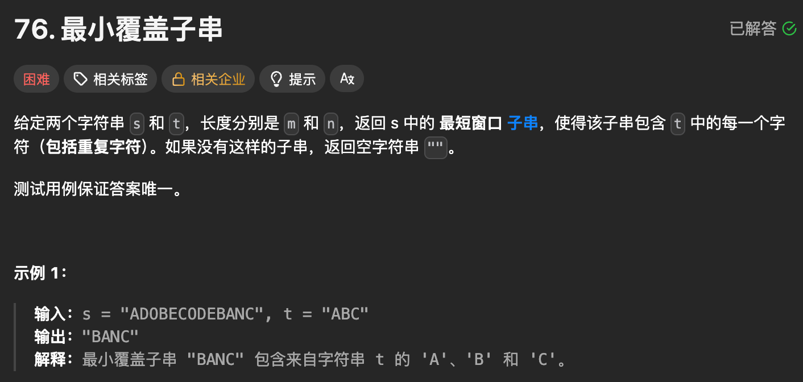
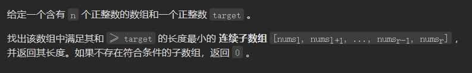
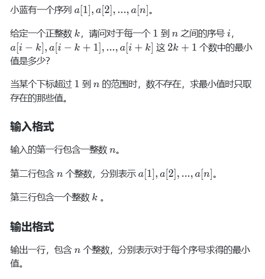

# 【完整题单01、滑动窗口】【✅✅✅✅】

> 来源：[【完整题单01、滑动窗口】【✅✅✅✅】](https://blog.csdn.net/weixin_51429773/article/details/129806054) · 发布时间：2026-06-14 · 阅读量：粉丝可见

#### 目录

- [知识框架](#_1)
- [No.0 筑基](#No0__2)
- - [知识框架](#_10)
  - [滑动窗口核心原理](#_16)
- [No.1 字符串滑动窗口](#No1__40)
- - [题目来源：LeetCode-3. 无重复字符的最长子串](#LeetCode3__41)
  - [题目来源：LeetCode-438. 找到字符串中所有字母异位词](#LeetCode438__136)
  - [题目来源：LeetCode-76. 最小覆盖子串](#LeetCode76__245)
- [No.2 数组滑动窗口](#No2__359)
- - [题目来源：LeetCode-209-长度最小的子数组](#LeetCode209_361)
  - [题目来源：蓝桥杯-第十四届模拟-附近最小](#_424)

## 知识框架

## No.0 筑基

> 请先学习下知识点，道友！  
>  题目知识点大部分来源于此：
>
> 题目例题大部分来源于此：

### 知识框架

滑动窗口 = **同向双指针**  
 核心思想：**用一个指针控制窗口右端点，另一个指针动态调整窗口左端点**，把**O(n²)暴力解法**优化成 **O(n) 线性解法**。

---

### 滑动窗口核心原理

1. **暴力解法**：两个for循环，枚举所有子区间 → 时间复杂度 O(n²)
2. **滑动窗口**：
   - 只用**一个for循环遍历窗口右端点 `right`**
   - 用`while/条件`动态**收缩窗口左端点 `left`**
   - 全程只遍历一次数组/字符串 → **O(n) 效率**

> 一句话口诀：**固定右，收缩左，窗口动，结果出**

---

> 所谓滑动窗口，就是不断的调节子序列的起始位置和终止位置，从而得出我们要想的结果。  
>  所谓滑动窗口，就是不断的调节子序列的起始位置和终止位置，从而得出我们要想的结果。  
>  在暴力解法中，是一个for循环滑动窗口的起始位置，一个for循环为滑动窗口的终止位置，用两个for循环 完成了一个不断搜索区间的过程。  
>  那么滑动窗口如何用一个for循环来完成这个操作呢?  
>  首先要思考 如果用一个for循环，那么应该表示 滑动窗口的起始位置，还是终止位置?  
>  如果只用一个for循环来表示 滑动窗口的起始位置，那么如何遍历剩下的终止位置？  
>  此时难免再次陷入 暴力解法的怪圈。  
>  所以 只用一个for循环，那么这个循环的索引，一定是表示 滑动窗口的终止位置。  
>  那么问题来了， 滑动窗口的起始位置如何移动呢？  
>  

## No.1 字符串滑动窗口

### 题目来源：LeetCode-3. 无重复字符的最长子串

题目描述：  
 

题目思路：


题目代码：

```
class Solution {
public:
    int lengthOfLongestSubstring(string s) {
        // 滑动窗口，感觉像是 同向双指针
        // 不过滑动窗口更像是 固定一个right，内部while的同时移动left
        // 虽然像是 同向双指针，但是在固定 一个right之后行为方式更像双端指针了
        unordered_map<char, int>mp;
        int n = s.size();
        int left = 0, right = 0;
        int maxLen = 0;
        for(right = 0; right < n; right++){
            mp[s[right]]++;
            while(mp[s[right]] > 1){
                mp[s[left]]--;
                left++;
            }
            maxLen = max(maxLen, right - left + 1);
        }
        return maxLen;
    }
};
```

```
class Solution {
public:
    int lengthOfLongestSubstring(string s) {
        int len = s.size();
        map<char,int>mp;
        int ans=0;

        for(int i=0, j=0;j<len;j++){
            //先判断右边指向的是否在窗口内；
            //在里面
            if( mp[s[j] ]==1){
                while(mp[s[j]]==1){
                    mp[s[i] ]=0;
                    i++;
                }
            }
            mp[s[j] ]=1;
            ans=max(ans,j-i+1);
        }
        return ans;
    }
};
```

```
class Solution {
public:
    int lengthOfLongestSubstring(string s) {

        // 滑动窗口，感觉像是 同向双指针
        // 不过滑动窗口更像是 固定一个right，内部while的同时移动left
        // 虽然像是 同向双指针，但是在固定 一个right之后行为方式更像双端指针了
        int n = s.size();
        if(n == 0)return 0;

        unordered_set<char>lookup;
        int maxx = 0;
        int left = 0;
        for(int right = 0; right < n; right++){
            // 开始位置
            while(lookup.find(s[right]) != lookup.end()){
                //找到的话 left要左移动了
                lookup.erase(s[left]);
                left++;
            }
            maxx = max(maxx, right - left + 1);
            lookup.insert(s[right]);
        }
        return maxx;
        
    }
};
```

### 题目来源：LeetCode-438. 找到字符串中所有字母异位词

题目描述：  
 

题目思路：

> 感觉和双指针差不多，第一个想到的就是暴力循环的超时的版本  
>  这个是定长的 滑动窗口，就是说 right++ left++ ,然后维持住 使得 这个窗口中的判断尽量超级简单即可

题目代码：

```
class Solution {
public:
    vector<int> findAnagrams(string s, string p) {
        // p小 s大
        // 定长滑动窗口 ， 如果固定右侧的话
        // 感觉如果找到第一个，那么后面的就容易了

        // 搞个数组， 如果两个数组相等就可以了，完美
        // 然后向右边移动的时候进行 left的对应的减， right对应的加
        int s_n = s.size();
        int p_n = p.size();
        if(p_n > s_n)return{};

        vector<int>ans_p(26, 0);
        vector<int>ans_s(26, 0);
        for(auto &ch : p)ans_p[ch - 'a']++;


        vector<int>res;
        int left = 0, right = 0;
        for(right = 0; right < s_n; right++){
            auto ch = s[right];
            ans_s[ch - 'a']++;

            if(right - left + 1 < p_n)continue;

            if(ans_s == ans_p){
                res.push_back(left);
            }

            ans_s[s[left] - 'a']--;
            left++;
        }
        return res;
    }
};
```

```
class Solution {
public:
    vector<int> findAnagrams(string s, string p) {
        // p小 s大
        // 定长滑动窗口 ， 如果固定右侧的话
        // 感觉如果找到第一个，那么后面的就容易了

        // 搞个数组， 如果两个数组相等就可以了，完美
        // 然后向右边移动的时候进行 left的对应的减， right对应的加
        int s_n = s.size();
        int p_n = p.size();
        if(p_n > s_n)return{};

        vector<int>cnts(26, 0);
        for(int i = 0; i < p_n; i++){
            cnts[p[i] - 'a']--;
            cnts[s[i] - 'a']++;
        }

        int differ = 0;
        for(int i = 0; i < 26; i++){
            if(cnts[i] != 0)differ++;
        }
        

        vector<int>res;
        if(differ == 0)res.push_back(0);


        int left = 0, right = left + p_n;
        for(right =  p_n; right < s_n; right++){
            // 加入
            int tmp = cnts[s[right] - 'a'];
            cnts[s[right] - 'a']++;
            int now = cnts[s[right]-'a'];
            if(tmp == -1 && now == 0)differ--;
            if(tmp == 0 && now == 1)differ++;

            // 删除
            tmp = cnts[s[left] - 'a'];
            cnts[s[left] - 'a']--;
            now = cnts[s[left] - 'a'];
            if(tmp == 1 && now == 0)differ--;
            if(tmp == 0 && now == -1)differ++;

            left++;
            if(differ == 0)res.push_back(left);
        }
        return res;
    }
};
```

### 题目来源：LeetCode-76. 最小覆盖子串

题目描述：  
 

题目思路：


题目代码：

```
class Solution {
public:
    bool is_cover(vector<int>&a, vector<int>&b){
        for(int i = 0; i < 128; i++){
            if(a[i] < b[i])return false;
        }
        return true;
    }
    string minWindow(string s, string t) {
        // 一般这种都是滑动窗口

        // 如果按照之前那个就是 对于t的话每个位置++
        // 然后是 对于s 进行滑动窗口
        // 但是怎么滑动呢？

        // 像这种子串肯定要用 char-'a' 来计数的
        // 假设现将t进行计数，然后呢就是滑动窗口了，
        // left， right，固定右边，左侧向右滑动，
        int t_n = t.size();
        int s_n = s.size();

        vector<int>ans_s(128, 0);
        vector<int>ans_t(128, 0);
        for(auto & ch : t)ans_t[ch - 'A']++;


        int left = 0, right = 0;
        int minLen = INT_MAX;
        int minStart = 0;
        
        for(right = 0; right < s.size(); right++){
            auto ch = s[right];
            ans_s[ch - 'A']++;
            
            while(is_cover(ans_s, ans_t)){
                if(right - left + 1 < minLen){
                    minLen = min(minLen, right - left + 1);
                    minStart = left;
                }
                ans_s[s[left] - 'A']--;
                left++;
            }
        }
        if(minLen == INT_MAX)return "";
        return s.substr(minStart, minLen);
    }
};
```

```
class Solution {
public:
    string minWindow(string s, string t) {
        int diff[128]{}; // 窗口每种字母个数 - t 每种字母个数
        int kinds = 0;
        for (char c : t) {
            if (diff[c] == 0) {
                kinds++; // 统计 t 有多少个不同的字母
            }
            diff[c]--;
        }

        int m = s.size();
        int ans_left = -1, ans_right = m;
        int ge_cnt = 0; // 窗口内有 ge_cnt 种字母的出现次数 >= t 中相应字母的出现次数
        int left = 0;

        for (int right = 0; right < m; right++) { // 移动子串右端点
            char c = s[right]; // 右端点字母
            diff[c]++; // 右端点字母移入子串
            if (diff[c] == 0) { // 原来窗口内 c 的出现次数比 t 的少，现在一样多
                ge_cnt++; // 从 < 变成 >=
            }

            while (ge_cnt == kinds) { // 涵盖：所有字母的出现次数都是 >=
                if (right - left < ans_right - ans_left) { // 找到更短的子串
                    ans_left = left; // 记录此时的左右端点
                    ans_right = right;
                }

                char x = s[left]; // 左端点字母
                if (diff[x] == 0) {
                    // x 移出窗口之前，检查出现次数，
                    // 如果窗口内 x 的出现次数和 t 一样，
                    // 那么 x 移出窗口后，窗口内 x 的出现次数比 t 的少
                    ge_cnt--; // 从 >= 变成 <
                }
                diff[x]--; // 左端点字母移出子串
                left++;
            }
        }
        if(ans_left < 0)return "";
        return s.substr(ans_left, ans_right - ans_left + 1);
    }
};
```

## No.2 数组滑动窗口

### 题目来源：LeetCode-209-长度最小的子数组

题目描述：  
 

题目思路：

> 滑动窗口的题目；

题目代码：

```
class Solution {
public:
    int minSubArrayLen(int target, vector<int>& nums) {
        // 很正常的就顺下来了
        int n = nums.size();
        int left = 0, right = 0;
        int sum = 0;
        int minLen = INT_MAX;
        
        for(right = 0; right < n; right++){
            sum = sum + nums[right];
            while(sum >= target){
                minLen = min(minLen, right - left + 1);
                sum = sum - nums[left];
                left++;
            }
        }
        if(minLen == INT_MAX)return 0;
        return minLen;
    }
};


class Solution {
public:
    int minSubArrayLen(int s, vector<int>& nums) {
        int result = INT32_MAX;
        int sum = 0; // 滑动窗口数值之和
        int i = 0; // 滑动窗口起始位置
        int subLength = 0; // 滑动窗口的长度
        for (int j = 0; j < nums.size(); j++) {
            sum += nums[j];
            // 注意这里使用while，每次更新 i（起始位置），并不断比较子序列是否符合条件
            while (sum >= s) {
                subLength = (j - i + 1); // 取子序列的长度
                result = result < subLength ? result : subLength;
                sum -= nums[i++]; // 这里体现出滑动窗口的精髓之处，不断变更i（子序列的起始位置）
            }
        }
        // 如果result没有被赋值的话，就返回0，说明没有符合条件的子序列
        return result == INT32_MAX ? 0 : result;
    }
};
```

### 题目来源：蓝桥杯-第十四届模拟-附近最小

题目描述：



题目思路：


题目代码：

```
#include<bits/stdc++.h>
#define int long long
using namespace std;
const int N = 1e7 + 10;
int q[N];int a[N];
int b[N];int n, k;
int sum;
/*
* 滑动窗口是从寻找到的位置i开始算长度的
* 而这个是从i-k开始算的，所以题目可以转换为
* 原数组n+2k个元素，然后从1开始遍历，滑动窗口长度为2*k+1
* 记得初始化前k个元素和后k个元素极大值如1e18，这样就可以防止初值0造成影响
*/
void min_q()
{
    int h = 1, t = 0;
    int len = 2 * k + 1;
    for (int i = 1; i <= n+2*k; i++)
    {
        while (h <= t && q[h] + len <= i)h++;
        while (h <= t && b[i] < b[q[t]])t--;
        q[++t] = i;
        if (i >= len)
        {
            cout << b[q[h]] << " ";
        }
    }
    cout << endl;
}
int main()
{
    cin >> n;
    for (int i = 1; i <= n; i++)cin >> a[i];
    cin >> k;
    for (int i = 1; i <= k; i++)b[i] = 1e18;
    for (int i = k + n + 1; i <= n + 2 * k; i++)b[i] = 1e18;
    for (int i = k + 1; i <= k + n; i++)b[i] = a[i - k];
    //for (int i = 1; i <= n + 2 * k; i++)cout << b[i] << " ";
    //cout << endl;
    min_q();
    return 0;
}
```
