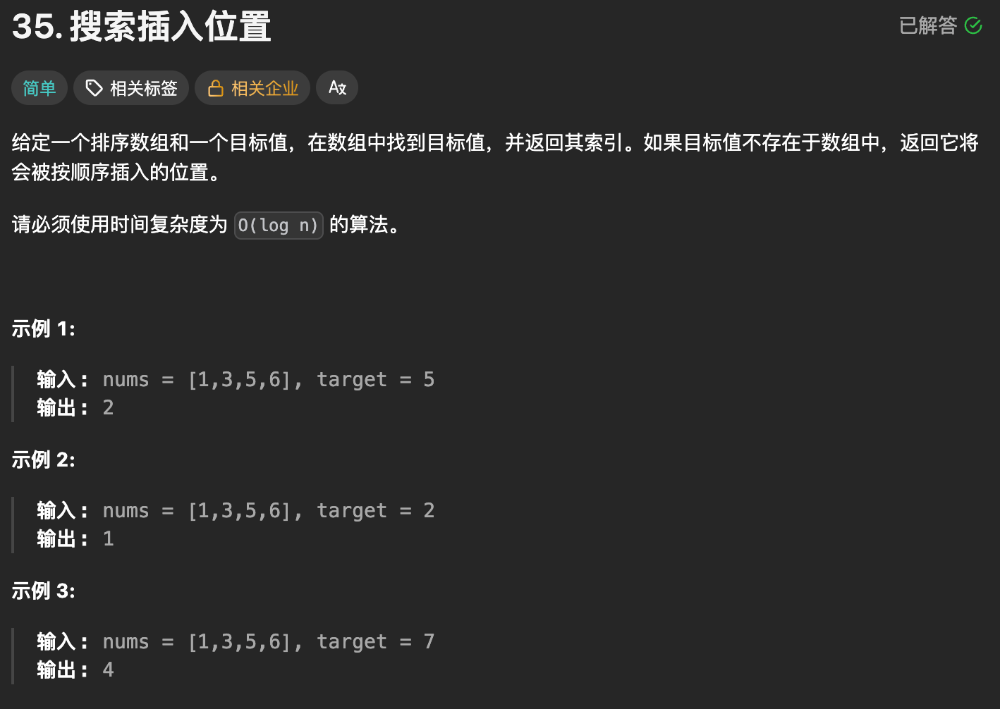
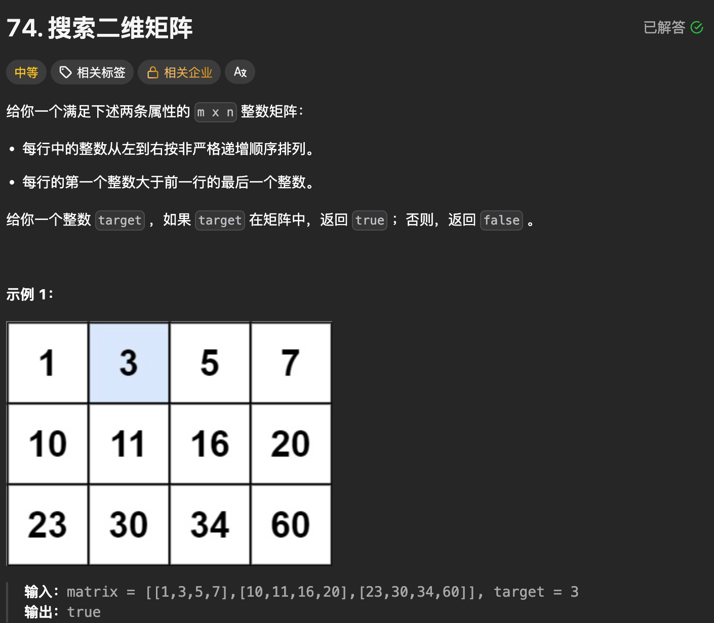
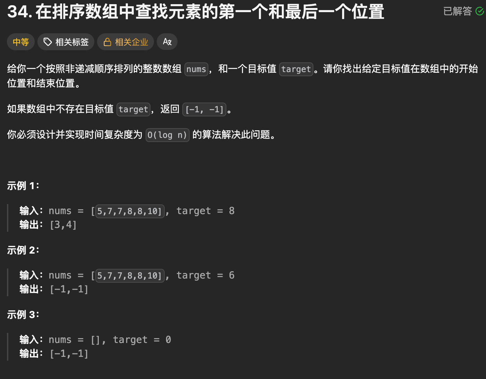
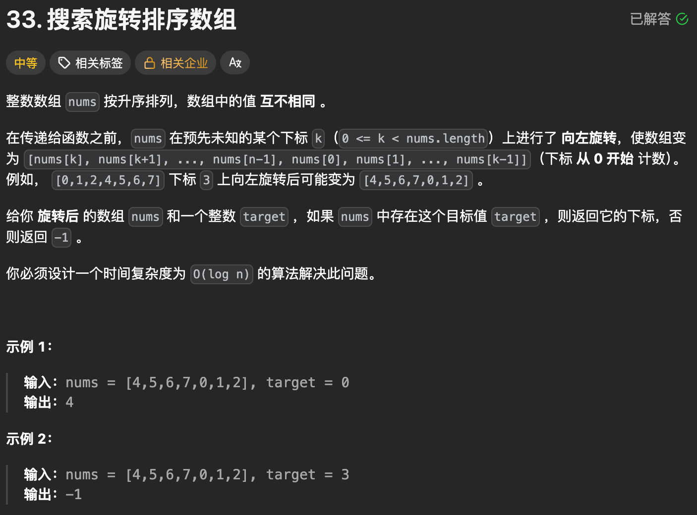
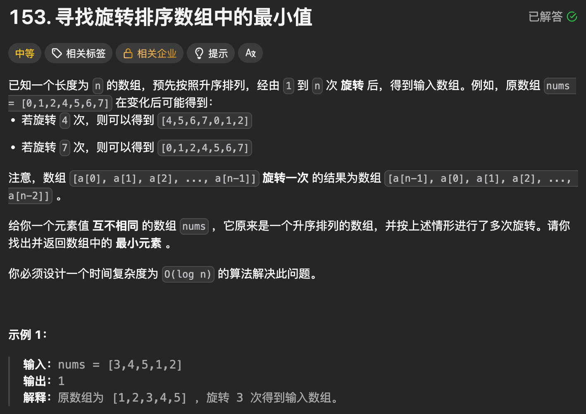
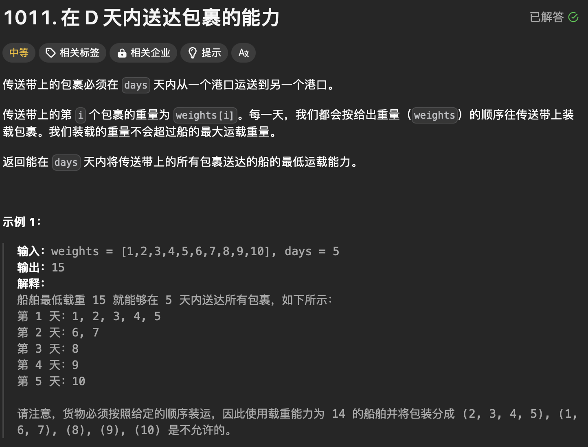

#### 目录

- [知识框架](#_2)
- [No.0 筑基](#No0__4)
- - [【二分模版】](#_11)
- [No.1 正常的二分查找](#No1__79)
- - [题目来源：LeetCode-35. 搜索插入位置🔥](#LeetCode35__81)
  - [题目来源：LeetCode-74. 搜索二维矩阵🔥](#LeetCode74__153)
  - [题目来源：LeetCode-34. 在排序数组中查找元素的第一个和最后一个位置🔥](#LeetCode34__197)
- [No.2 分段切且段内有序即二分查找](#No2__254)
- - [题目来源：LeetCode-33. 搜索旋转排序数组](#LeetCode33__255)
  - [题目来源：LeetCode-153. 寻找旋转排序数组中的最小值🔥🔥🔥](#LeetCode153__357)
- [No.3 两数组合并找中位数](#No3__408)
- - [题目来源：LeetCode-4. 寻找两个正序数组的中位数](#LeetCode4__409)
- [No.4 数字太大遍历/二分](#No4__525)
- - [题目来源：LeetCode-1011. 在 D 天内送达包裹的能力](#LeetCode1011__D__527)

## 知识框架

## No.0 筑基

> 请先学习下知识点，道友！  
>  题目知识点大部分来源于此：
>
> 题目例题大部分来源于此：

### 【二分模版】

```cpp
class Solution {
    // lower_bound 返回最小的满足 nums[i] >= target 的 i
    // 如果数组为空，或者所有数都 < target，则返回 nums.size()
    // 要求 nums 是非递减的，即 nums[i] <= nums[i + 1]

    // 闭区间写法
    int lower_bound(vector<int>& nums, int target) {
        int left = 0, right = (int) nums.size() - 1; // 闭区间 [left, right]
        while (left <= right) { // 区间不为空
            // 循环不变量：
            // nums[left-1] < target
            // nums[right+1] >= target
            int mid = left + (right - left) / 2;
            if (nums[mid] < target) {
                left = mid + 1; // 范围缩小到 [mid+1, right]
            } else {
                right = mid - 1; // 范围缩小到 [left, mid-1]
            }
        }
        return left;
    }

    // 左闭右开区间写法
    int lower_bound2(vector<int>& nums, int target) {
        int left = 0, right = nums.size(); // 左闭右开区间 [left, right)
        while (left < right) { // 区间不为空
            // 循环不变量：
            // nums[left-1] < target
            // nums[right] >= target
            int mid = left + (right - left) / 2;
            if (nums[mid] < target) {
                left = mid + 1; // 范围缩小到 [mid+1, right)
            } else {
                right = mid; // 范围缩小到 [left, mid)
            }
        }
        return left;
    }

    // 开区间写法
    int lower_bound3(vector<int>& nums, int target) {
        int left = -1, right = nums.size(); // 开区间 (left, right)
        while (left + 1 < right) { // 区间不为空
            // 循环不变量：
            // nums[left] < target
            // nums[right] >= target
            int mid = left + (right - left) / 2;
            if (nums[mid] < target) {
                left = mid; // 范围缩小到 (mid, right)
            } else {
                right = mid; // 范围缩小到 (left, mid)
            }
        }
        return right;
    }

public:
    int searchInsert(vector<int>& nums, int target) {
        return lower_bound(nums, target); // 选择其中一种写法即可
    }
};
```

## No.1 正常的二分查找

### 题目来源：LeetCode-35. 搜索插入位置🔥

题目描述：  
 

题目思路：


题目代码：

```cpp
class Solution {
public:
    int searchInsert(vector<int>& nums, int target) {
        // 整体就是low_bound();
        int n  = nums.size();
        int l = 0, r = n;
        int mid = 0;
        while(l < r){
            mid = l + (r - l) / 2;
            if(nums[mid] < target){
                l = mid + 1;
            }else{
                r = mid;
            }
        }
        // 1️⃣先判断是不是 最后的位置
        if(l == n)return n;
        // 2️⃣再判断 l == r的位置，因为while出循环是l==r的时候，并未进行判断。
        return l;
        // 返回的结果就是 >= target的第一个位置。
        // 这样无论是找到 还是 插入位置都是这个位置了。
    }
};
```

### 题目来源：LeetCode-74. 搜索二维矩阵🔥

题目描述：  
 

题目思路：


题目代码：

```cpp
class Solution {
public:
    bool searchMatrix(vector<vector<int>>& matrix, int target) {
        int m = matrix.size();
        int n = matrix[0].size();
        int sz = m * n;
        int l = 0, r = sz;
        while(l < r){
            int mid = l + (r - l) / 2;
            int row = mid / n;
            int col = mid % n;
            if(matrix[row][col] < target){
                l = mid + 1;
            }else{
                r = mid;
            }
        }
        // 1️⃣先判断是不是 最后的位置
        if(l == m * n)return false;
        int l_row = l / n;
        int l_col = l % n;
        // 2️⃣再判断 l == r的位置，因为while出循环是l==r的时候，并未进行判断。
        if(matrix[l_row][l_col] == target)return true;
        return false;
    }
};
```

### 题目来源：LeetCode-34. 在排序数组中查找元素的第一个和最后一个位置🔥

题目描述：  
 

题目思路：


题目代码：

```cpp
class Solution {
public:
    int low_bound(vector<int>& nums, int target){
        int l = 0, r = nums.size();
        while( l < r){
            int mid = l + (r - l) / 2;
            if(nums[mid] < target){
                l = mid + 1;
            }else{
                r = mid;
            }
        }
        return l;
    }
    vector<int> searchRange(vector<int>& nums, int target) {
        int n = nums.size();
        int st = low_bound(nums, target);
        vector<int>res(2, -1);
        // 1️⃣先判断是不是 最后的位置
        if(st == n)return res;
        // 2️⃣再判断 l == r的位置，因为while出循环是l==r的时候，并未进行判断。
        if(nums[st] != target)return res;
        res[0] = st;
        int ed = low_bound(nums, target + 1) - 1;
        res[1] = ed;
        return res;
    }
};
```

## No.2 分段切且段内有序即二分查找

### 题目来源：LeetCode-33. 搜索旋转排序数组

题目描述：



题目思路：


题目代码：

```cpp
class Solution {
public:
    int search(vector<int>& nums, int target) {
        int n = nums.size();
        int end = nums[n - 1];
        int left = 0;
        int right = n - 1;
        while (left <= right) {
            int mid = left + (right - left) / 2;
            if(nums[mid] == target)return mid;

            if (target <= end && nums[mid] > end) {
                // 目标在右半部分，mid在左半部分
                left = mid + 1;
            } else if (target > end && nums[mid] <= end) {
                // 目标在左半部分，mid在右半部分
                right = mid - 1;
            } else {
                // 目标和mid在同一部分
                if (nums[mid] < target) {
                    left = mid + 1;
                } else {
                    right = mid - 1;
                }
            }
        }
        return -1;
    }
};
```

```cpp
class Solution {
public:
    int search(vector<int>& nums, int target) {

        // 先找位置 ， 不能前后判断因为访存，直接 固定一个比较的数字
        // 但是这个找位置是不是 O(n) 了？
        int n = nums.size(); 

        if(n <= 5){
            for(int i = 0; i < n; i++){
                if(target == nums[i])return i;
            }
        }

        int pos = 0;
        int last = nums[0];
        for(int i = 0; i < n; i++){
            if(nums[i] < last){
                pos = i;
                break;
            }
        }

        int l = 0, r = pos - 1;
        int mid = 0;
        while(l <= r){
            mid = (l + r) / 2;
            if(target < nums[mid]){
                r = mid - 1;
            }else if(target == nums[mid]){
                break;
            }else if(target > nums[mid]){
                l = mid + 1;
            }
        }
        if(target == nums[mid])return mid;

        l = pos;
        r = n - 1;
        while(l <= r){
            mid = (l + r) / 2;
            if(target < nums[mid]){
                r = mid - 1;
            }else if(target == nums[mid]){
                break;
            }else if(target > nums[mid]){
                l = mid + 1;
            }
        }
        if(target == nums[mid]) return mid;
        return -1;        
    }
};
```

### 题目来源：LeetCode-153. 寻找旋转排序数组中的最小值🔥🔥🔥

题目描述：  
 

题目思路：


题目代码：

```cpp
class Solution {
public:
    int findMin(vector<int>& nums) {
        // 这个的话 还得考虑旋转次数
        // 最小的在 pos xuanzhuan+1的位置
        // 因为没有 target， 所以用mid和 两端进行比较
        // 目的是 将 min 限制在 [ ]然后不断的缩短这个[ ]
        // 因为要求时间复杂度为 O(log n) 即要求一次要减少一半的错误选择
        // 肯定是二分 一次缩小一半的 [ ]范围;这个是重要的思想
        int n = nums.size();
        int l = 0, r = n;
        // 整个过程就是找mid位置判断与 nums.back()进行对比
        // [l, n) 左闭右开区。
        while (l < r) {
            int mid = l + (r - l) / 2;
            if (nums[mid] > nums.back()) {
                // 最小值在右半部分
                l = mid + 1;
            } else{
                r = mid;
            }
        }
        // if(l == n)
        // 1️⃣先判断是不是 最后的位置； 这里不用判断
        // 2️⃣再判断 l == r的位置，因为while出循环是l==r的时候，并未进行判断。
        return nums[l];
    }
};
```

## No.3 两数组合并找中位数

### 题目来源：LeetCode-4. 寻找两个正序数组的中位数

题目描述：

题目思路：

> 一开始想的是按照之前的数据结构后面的例题那样；再看后面题解的二分；；

题目代码：

```cpp
class Solution {
public:
    double findMedianSortedArrays(vector<int>& nums1, vector<int>& nums2) {
        int m=nums1.size();
        int n = nums2.size();

        vector<int>ans;
        int pos1=0,pos2=0;
        while(pos1<m&&pos2<n){
            if(nums1[pos1]<=nums2[pos2]){
                ans.push_back(nums1[pos1]);
                pos1++;
            }else{
                ans.push_back(nums2[pos2]);
                pos2++;
            }
        }
        if(pos1>=m){
            for( ; pos2<n;pos2++)ans.push_back(nums2[pos2]);
        }
        if(pos2>=n){
            for( ; pos1<m;pos1++)ans.push_back(nums1[pos1]);
        }
        double res =0.0;
        if((m+n)%2==0){
            res=(ans[(m+n)/2-1]+ans[(m+n)/2])/2.0;
        }else{
            res=ans[(m+n-1)/2]*1.0;
        }
        return res;


    }
};


// 二分
class Solution {
public:
    int getKthElement(const vector<int>& nums1, const vector<int>& nums2, int k) {
        /* 主要思路：要找到第 k (k>1) 小的元素，那么就取 pivot1 = nums1[k/2-1] 和 pivot2 = nums2[k/2-1] 进行比较
         * 这里的 "/" 表示整除
         * nums1 中小于等于 pivot1 的元素有 nums1[0 .. k/2-2] 共计 k/2-1 个
         * nums2 中小于等于 pivot2 的元素有 nums2[0 .. k/2-2] 共计 k/2-1 个
         * 取 pivot = min(pivot1, pivot2)，两个数组中小于等于 pivot 的元素共计不会超过 (k/2-1) + (k/2-1) <= k-2 个
         * 这样 pivot 本身最大也只能是第 k-1 小的元素
         * 如果 pivot = pivot1，那么 nums1[0 .. k/2-1] 都不可能是第 k 小的元素。把这些元素全部 "删除"，剩下的作为新的 nums1 数组
         * 如果 pivot = pivot2，那么 nums2[0 .. k/2-1] 都不可能是第 k 小的元素。把这些元素全部 "删除"，剩下的作为新的 nums2 数组
         * 由于我们 "删除" 了一些元素（这些元素都比第 k 小的元素要小），因此需要修改 k 的值，减去删除的数的个数
         */

        int m = nums1.size();
        int n = nums2.size();
        int index1 = 0, index2 = 0;

        while (true) {
            // 边界情况
            if (index1 == m) {
                return nums2[index2 + k - 1];
            }
            if (index2 == n) {
                return nums1[index1 + k - 1];
            }
            if (k == 1) {
                return min(nums1[index1], nums2[index2]);
            }

            // 正常情况
            int newIndex1 = min(index1 + k / 2 - 1, m - 1);
            int newIndex2 = min(index2 + k / 2 - 1, n - 1);
            int pivot1 = nums1[newIndex1];
            int pivot2 = nums2[newIndex2];
            if (pivot1 <= pivot2) {
                k -= newIndex1 - index1 + 1;
                index1 = newIndex1 + 1;
            }
            else {
                k -= newIndex2 - index2 + 1;
                index2 = newIndex2 + 1;
            }
        }
    }

    double findMedianSortedArrays(vector<int>& nums1, vector<int>& nums2) {
        int totalLength = nums1.size() + nums2.size();
        if (totalLength % 2 == 1) {
            return getKthElement(nums1, nums2, (totalLength + 1) / 2);
        }
        else {
            return (getKthElement(nums1, nums2, totalLength / 2) + getKthElement(nums1, nums2, totalLength / 2 + 1)) / 2.0;
        }
    }
};
```

## No.4 数字太大遍历/二分

### 题目来源：LeetCode-1011. 在 D 天内送达包裹的能力

题目描述：



题目思路：


题目代码：

```cpp
class Solution {
public:
    int shipWithinDays(vector<int>& weights, int days) {
        /// 难道是暴力二分查找？？
        /// 先找 左边界， 和 右边界. 这个思想到底是为什么呢？？？
        int left = 0;
        int right = 0;
        for(auto ww : weights)
        {
            left = std::max(left, ww);
            right += ww;
        }
        

        /// 然后是二分查找：
        while(left <= right)
        {
            int mid = (left + right) / 2;
            // 假设 mid满足，看需要的天数：
            int need = 1;
            int now_sum = 0;
            for(auto ww : weights)
            {
                if(ww + now_sum > mid)
                {
                    need++;
                    now_sum = ww;
                }else{
                    now_sum += ww;
                }
            }

            if(need > days){
                left = mid + 1;
            }else{
                right = mid - 1;
            }

        }
        return left;

    }
};
```
