#### 目录

- [No.0 筑基](#No0__2)
- [No.1 基础单调栈](#No1__7)
- - [题目来源：LeetCode-739. 每日温度[模版]](#LeetCode739__8)
  - [题目来源：LeetCode-1475. 商品折扣后的最终价格[没必要看，同上]](#LeetCode1475__94)
  - [题目来源：LeetCode-496. 下一个更大元素 I [没必要看，同上]](#LeetCode496__I__148)
  - [题目来源：LeetCode-503-下一个更大元素 II [循环]](#LeetCode503_II__197)
  - [题目来源：LeetCode-901. 股票价格跨度](#LeetCode901__271)
  - [题目来源：LeetCode-853. 车队](#LeetCode853__314)
- [No.2 进阶](#No2__390)
- - [题目来源：LeetCode-1019. 链表中的下一个更大节点](#LeetCode1019__393)
- [No.3 思维扩展](#No3__497)
- - [题目来源：Acwing-4487-最长连续子序列](#Acwing4487_501)
  - [题目来源：Acwing-131. 直方图中最大的矩形](#Acwing131__556)
  - [题目来源：LeetCode-84. 柱状图中最大的矩形](#LeetCode84__715)
  - [题目来源：LeetCode-42. 接雨水](#LeetCode42__868)

## No.0 筑基

> 请先学习下知识点，阁下！  
>  题目大部分来源于此：[代码随想录：单调栈！](https://www.programmercarl.com/0739.%E6%AF%8F%E6%97%A5%E6%B8%A9%E5%BA%A6.html#%E6%80%9D%E8%B7%AF)

## No.1 基础单调栈

### 题目来源：LeetCode-739. 每日温度[模版]

题目图片：  
 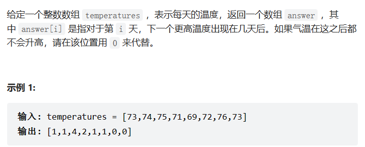

题目思考：

题目代码：

```cpp
vector<int> dailyTemperatures(vector<int>& temperatures) {
  // stack存着未找到的。 相当于暴力了
  // 栈中记录还没算出下一个更大元素的那些数的下标。
  // 相当于栈是一个 todolist，在循环的过程中，
  // 现在还不知道答案是多少，在后面的循环中会算出答案。
  int n = temperatures.size();
  stack<int>sc; //存放的未找到的pos, 以下标来对应元素。
  vector<int>res(n, 0);
  sc.push(0);

  for(int i = 1; i < n; i++){
    while(!sc.empty()){
      int top_pos = sc.top();
      if(temperatures[i] > temperatures[top_pos]){
        sc.pop();
        res[top_pos] = i;
      }else{ // 因为如果比它小，说明前面那个已经充当了 nextMax了
        break;
      }
    }
    sc.push(i);
  }
  return res;
}


class Solution {
public:
    vector<int> dailyTemperatures(vector<int>& temperatures) {
        //就是说 假设是 从 左边 往 右边
        // stack存储的是pos；
        // 由于是单调战
        // 像是以右边为界限；然后遍历左边的东西/
        // 思路感觉是这样：每进入一个点，然后往前找是谁的nextMax点；
        //      找过之后，然后再放入到stack里面。
        std::stack<int>sc;
        int n = temperatures.size();

        sc.push(0);

        std::vector<int>res(n, 0);
        for(size_t i = 1; i < n; i++)
        {
            while(!sc.empty())
            {
                int top_ele_pos = sc.top();
                if(temperatures[i] > temperatures[top_ele_pos]){
                    res[top_ele_pos] = i;
                    sc.pop();
                }else{
                    break;
                }
            }
            sc.push(i);
        }
        for(size_t i = 0; i < res.size(); i++)
        {
            if(res[i]==0)continue;
            res[i] = res[i] - i;
        }
        return res;
    }
};
```

### 题目来源：LeetCode-1475. 商品折扣后的最终价格[没必要看，同上]

题目描述：

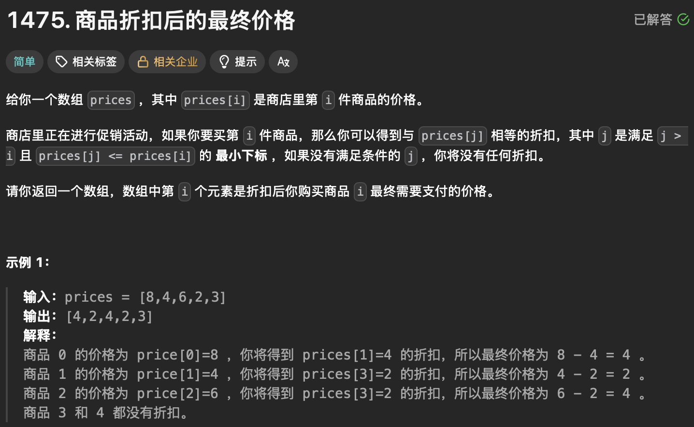

题目思路：


题目代码：

```cpp
class Solution {
public:
    vector<int> finalPrices(vector<int>& prices) {

        // 这个是 找到 右边 第一个小于等于的
        int n = prices.size();
        std::stack<int>sc;
        sc.push(0);

        std::vector<int>res(n, 0);

        for(size_t i = 1; i < n; i++)
        {
            while(!sc.empty())
            {
                int top_pos = sc.top();
                if(prices[i] <= prices[top_pos]){
                    sc.pop();
                    res[top_pos] = i;

                }else{
                    break;
                }
            }
            sc.push(i);
        }
        for(size_t i = 0; i < prices.size(); i++)
        {
            if(res[i]==0)continue;
            prices[i] = prices[i] - prices[ res[i] ];
        }
        auto ans = prices;
        return ans;
    }
};
```

### 题目来源：LeetCode-496. 下一个更大元素 I [没必要看，同上]

题目描述：

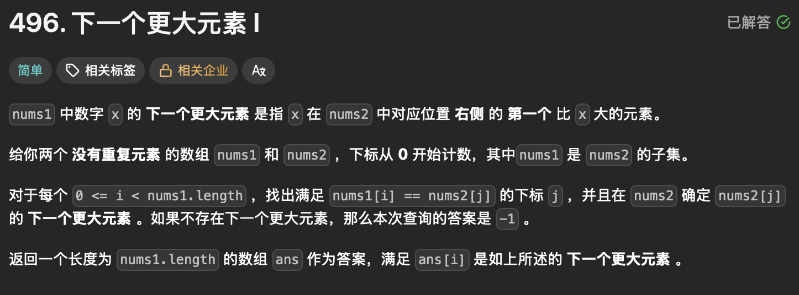

题目思路：


题目代码：

```cpp
class Solution {
public:
    vector<int> nextGreaterElement(vector<int>& nums1, vector<int>& nums2) {
        
        int n1 = nums1.size();
        int n2 = nums2.size();

        std::vector<int>ans(1e5, -1);
        std::stack<int>sc;
        sc.push(0);
        for(size_t i = 1; i < n2; i++)
        {
            while(!sc.empty())
            {
                int top_pos = sc.top();
                if(nums2[i] > nums2[top_pos]){
                    sc.pop();
                    ans[nums2[top_pos]] = nums2[i];
                }else{
                    break;
                }
            }
            sc.push(i);
        }
        std::vector<int>rl(n1, -1);
        for(size_t i = 0; i < nums1.size();i++)
        {
            rl[i] = ans[nums1[i]];
        }
        return rl;
    }
};
```

### 题目来源：LeetCode-503-下一个更大元素 II [循环]

题目图片：

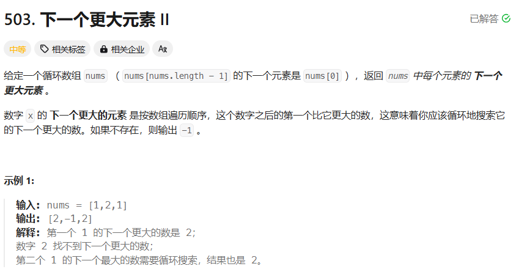

题目思考：

> 单调栈？很像，  
>  单调栈 其 s 保存的是下标index；但是是根据数值value进行单调的？  
>  单调栈的本质是空间换时间，因为在遍历的过程中需要用一个栈来记录右边第一个比当前元素高的元素，

题目代码：

```cpp
vector<int> nextGreaterElements(vector<int>& nums) {
  int n = nums.size();
  stack<int>sc;
  sc.push(0);
  vector<int>res(n, -1);

  for(int i = 1; i < n*2; i++){
    while(!sc.empty()){
      int top_pos = sc.top();
      if(nums[i%n] > nums[top_pos]){
        sc.pop();
        res[top_pos] = i % n;
      }else{
        break;
      }
    }
    if(i < n)sc.push(i);
  }
  return res;
}


class Solution {
public:
    vector<int> nextGreaterElements(vector<int>& nums) {
        //感觉像这样的循环的完全可以在添加一个同样大小的vector


        int n = nums.size();
        std::vector<int>ans(n, -1);
        std::stack<int>sc;
        sc.push(0);

        for(size_t i = 1; i < 2*n; i++)
        {
            if(sc.empty() && i >= n)break;//这个要记得。

            while(!sc.empty())
            {
                int top_pos = sc.top();
                if(nums[i%n] > nums[top_pos]){
                    ans[top_pos] = nums[i % n];
                    sc.pop();
                }else{
                    break;
                }
            }
            sc.push(i%n);
        }
        return ans;
        
    }
};
```

### 题目来源：LeetCode-901. 股票价格跨度

题目描述：  
 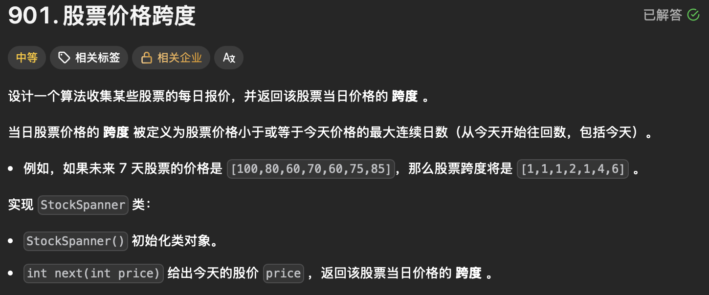

题目思路：


题目代码：

```cpp
class StockSpanner {
public:
    // 就是往左的， 比今天 大的第一个数的位置。
    StockSpanner() {
        this->stk.emplace(-1, INT_MAX);
        this->idx = -1;
    }
    
    int next(int price) {
        idx++;
        while (price >= stk.top().second) {
            stk.pop();
        }
        int ret = idx - stk.top().first;
        stk.emplace(idx, price);
        return ret;
    }

private:
    stack<pair<int, int>> stk; 
    int idx;
};

/**
 * Your StockSpanner object will be instantiated and called as such:
 * StockSpanner* obj = new StockSpanner();
 * int param_1 = obj->next(price);
 */
```

### 题目来源：LeetCode-853. 车队

题目描述：  
 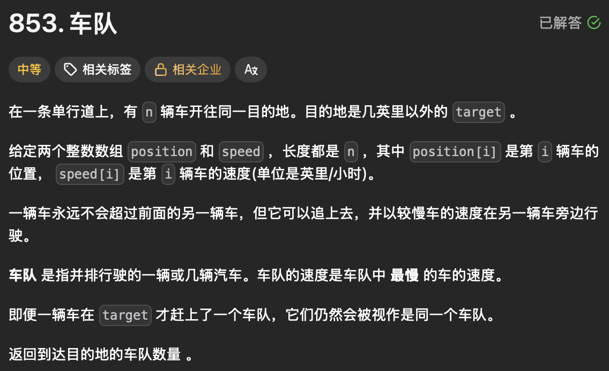

题目思路：


题目代码：

```cpp
class Solution {
public:
    int carFleet(int target, vector<int>& position, vector<int>& speed) {

        //对于每辆车 找到 其右边位置 的。速度 且 小于自己的；
        //。然后并查集 找到 最终多少个 车队。？？
        // 但是一开始 会不会就有 车在 同一个pos的呢？？

        int n = position.size();
        // 先根据位置排队；然后就是找到右边第一个 到达目的地时间小于自己的。
        // 就可以跟着一个车队
        std::vector<std::pair<int, int>>pp;
        for(int i = 0; i < n; i++)
        {
            pp.push_back(std::pair<int, int>(position[i], speed[i]));
        }
        std::sort(pp.begin(), pp.end());

        std::vector<int>ans(n, -1);
        std::stack<int>sc;
        sc.push(0);

        for(size_t i = 1; i < n; i++)
        {
            double time = double(target - pp[i].first) / pp[i].second;
            while(!sc.empty())
            {
                int top_pos = sc.top();
                double top_pos_time = double(target - pp[top_pos].first) / pp[top_pos].second;
                if(top_pos_time <= time){
                    ans[top_pos] = i; 
                    sc.pop();
                }else{
                    break;
                }
            }
            sc.push(i);
        }

        //并查集 整一下；
        // for(size_t i = 0; i < ans.size(); i++)
        // {
        //     int tmp = i;
        //     while(ans[tmp]!= -1)
        //     {
        //         tmp = ans[tmp];
        //     }
        // }

        //一或者统计 -1 的
        int res = 0;
        for(size_t i = 0; i < ans.size(); i++)
        {
            if(ans[i] == -1)res++;
        }
        return res;
        
    }
};
```

## No.2 进阶

### 题目来源：LeetCode-1019. 链表中的下一个更大节点

题目描述：

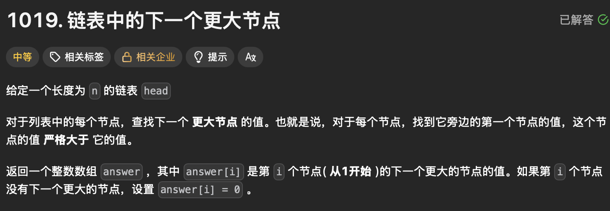

题目思路：


题目代码：

```cpp
/**
 * Definition for singly-linked list.
 * struct ListNode {
 *     int val;
 *     ListNode *next;
 *     ListNode() : val(0), next(nullptr) {}
 *     ListNode(int x) : val(x), next(nullptr) {}
 *     ListNode(int x, ListNode *next) : val(x), next(next) {}
 * };
 */

#include <vector>
#include <stack>
using namespace std;

struct ListNode {
    int data;
    ListNode* next;
};

vector<int> nextLargerNodes(ListNode* head) {
    if (head == nullptr) return {};

    vector<int> res;
    stack<pair<ListNode*, int>> sc;   // 同时存节点指针和它的索引
    sc.push({head, 0});               // 第一个节点入栈，索引为0
    res.push_back(0);                 // 为第0个节点占位，默认值为0

    ListNode* next = head->next;
    int idx = 1;                      // 下一个节点的索引

    while (next != nullptr) {
        res.push_back(0);             // 为当前 next 节点占位

        while (!sc.empty()) {
            auto top_pair = sc.top();           // 取栈顶 pair
            if (next->data > top_pair.first->data) {
                // 找到了下一个更大值，写入这个节点的正确位置
                res[top_pair.second] = next->data;
                sc.pop();
            } else {
                break;
            }
        }

        sc.push({next, idx});         // 当前节点及索引入栈
        next = next->next;
        ++idx;
    }

    // 栈中剩余的节点保持 res 中的初始值 0，无需额外处理
    return res;
}


class Solution {
public:
    vector<int> nextLargerNodes(ListNode* head) {
        std::vector<int>nums;
        while(head)
        {
            nums.push_back(head->val);
            head = head->next;
        }

        int n = nums.size();
        std::vector<int>ans(n, 0);
        std::stack<int>sc;
        sc.push(0);
        for(int i = 1; i < n; i++)
        {
            while(!sc.empty())
            {
                int top_pos = sc.top();
                if(nums[i] > nums[top_pos]){
                    sc.pop();
                    ans[top_pos] = nums[i];
                }else{
                    break;
                }
            }
            sc.push(i);
        }
        return ans;
    }
};
```

## No.3 思维扩展

### 题目来源：Acwing-4487-最长连续子序列

题目描述：

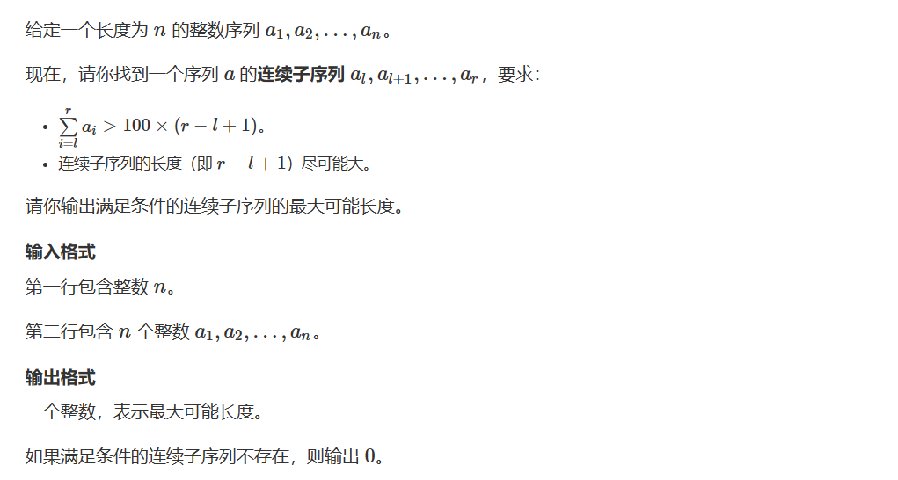

题目思路：

> // 所以可以转化成 几个数字相加为>0 即可；  
>  // 定尾巴，动前面的  
>  // 将前面的逆的序列删掉； 最后称为一个单调递减的数列；  
>  单调栈维护一个单调递减序列  
>  如果小于，直接入栈  
>  如果大于，说明前面能找到答案，二分找最前面的

题目代码：

```cpp
top表示栈顶元素的位置；；
#include<bits/stdc++.h>
#define int long long
using namespace std;
const int N=1e6+10;
int a[N],n,ans;
int s[N],top;

signed main(){
    cin>>n;
    for(int i=1;i<=n;i++){
        cin>>a[i];
        a[i]+=a[i-1]-100;
    }
    s[++top]=0;
    for(int i=1;i<=n;i++){
        if(a[i]==a[s[top]])continue;
        if(a[i]<a[s[top]])s[++top]=i;
        else{
            int l=1,r=top;
            while(l<r){
                int mid=l+r>>1;
                if(a[i]>a[s[mid]])r=mid;
                else l=mid+1;
            }
            ans=max(ans,i-s[r]);
        }
    }
    cout<<ans;
}
```

### 题目来源：Acwing-131. 直方图中最大的矩形

题目描述：  
 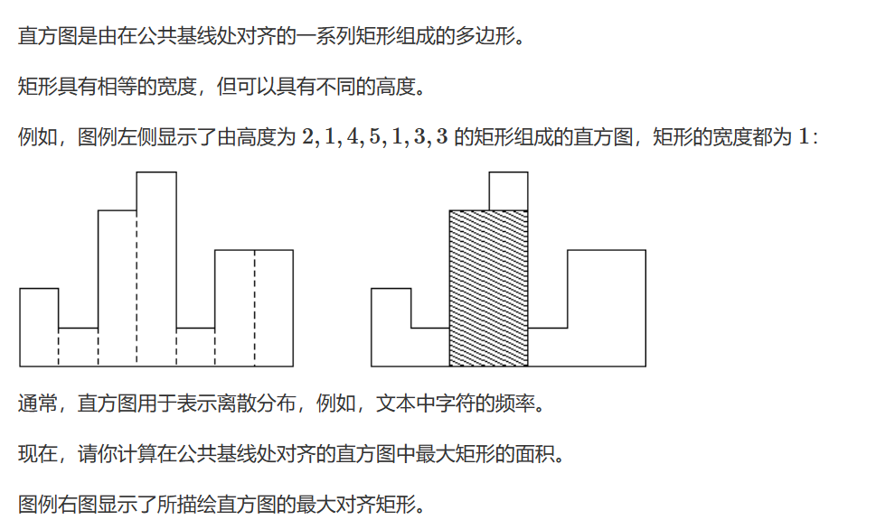

题目思路：

> 首先考虑暴力做法，以每个矩形的高度为准，向两边扩展，直到遇到比它矮的为止  
>  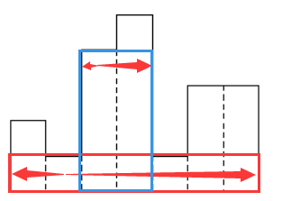  
>  它扩展出的矩形面积为s=（r-l+1）\*h

> 然后再进行单调栈优化；  
>  //在计算每个矩形可以扩展的左边界时，可以发现有一些矩形是可以不考虑的  
>  //因为在暴力计算的时候是遇到 比之小的就停下来了，也就是说 很快想到单调栈；  
>  // 找到 pos 左边和右边碰到的 比之小的第一个的位置下标；

题目代码：

```cpp
//首先是暴力 超时
#include <bits/stdc++.h>
using namespace std;
#define N 100100
#define inf 0x3f3f3f3f
#define debug(x) cout<<#x<<" = "<<x<<endl;

int n,m,k,d,g;
int x,y,z;
string str;
char ch;
vector<int>v[N];

stack<int>a,b;
int total=0;
int st[N];
vector<int>path;//全局变量跟参数基本意思是一样了；
vector<vector<int>>res;

int main()
{
    vector<int>ans;
    while(cin>>n){
        if(n==0)break;
        ans.clear();
        for(int i=1;i<=n;i++){
            cin>>x;
            ans.push_back(x);
        }
        //遍历循环
        int maxx=-inf;
        for(int i=0;i<n;i++){
            int l=i,r=i;
            while(l-1>=0){
                if(ans[l-1]>=ans[l]){
                    l--;
                }else{
                    break;
                }
            }
            while(r+1<n){
                if(ans[r+1]>=ans[r]){
                    r++;
                }else{
                    break;
                }
            }

            maxx=max(maxx,ans[i]*(r-l+1));
        }
        cout<<maxx<<endl;
    }

    return 0;
}


然后是单调栈优化问题
#include <bits/stdc++.h>
using namespace std;
#define N 100010
#define inf 0x3f3f3f3f
#define debug(x) cout<<#x<<" = "<<x<<endl;
#define LL long long
int n,m,k,d,g;
int x,y,z;
string str;
char ch;
vector<int>v[N];

stack<int>a,b;
int total=0;
int st[N];
vector<int>path;//全局变量跟参数基本意思是一样了；
vector<vector<int>>res;


//l[i], r[i]表示第i个矩形的高度可向两侧扩展的左右边界
//q[tt]作为栈顶元素下标，当满足h[q[tt]] >= h[i]时，弹出栈顶
int h[N], q[N], l[N], r[N];
//单调栈优化
//在计算每个矩形可以扩展的左边界时，可以发现有一些矩形是可以不考虑的
//因为在暴力计算的时候是遇到 比之小的就停下来了，也就是说 很快想到单调栈；
// 找到 pos 左边和右边碰到的 比之小的第一个的位置下标；
int main()
{
    while(cin>>n){
        if(n==0)break;

        for(int i=1;i<=n;i++)cin>>h[i];


        //每个矩形的高度都是>=0的，为了使得每个矩形的两侧都有矮于它的矩形，

        //因此可以省略栈中是否有元素的判断条件tt >= 0
        h[0]=h[n+1]=-1;

        int tt=0;
        q[tt]=0;

        //先找左边界
        for(int i=1;i<=n;i++){
            while(h[q[tt]]>=h[i])tt--;
            l[i]=i-q[tt];
            q[++tt]=i;

        }

        tt=0;
        q[tt]=n+1;

        //再找右边界
        for(int i=n;i>=1;i--){
            while(h[q[tt]]>=h[i])tt--;
            r[i]=q[tt]-i;
            q[++tt]=i;

        }

        LL res=0;
        for(int i=1;i<=n;i++)res=max(res,(LL)h[i]*(r[i]+l[i]-1));
        cout<<res<<endl;

    }


    return 0;
}
```

### 题目来源：LeetCode-84. 柱状图中最大的矩形

题目图片：

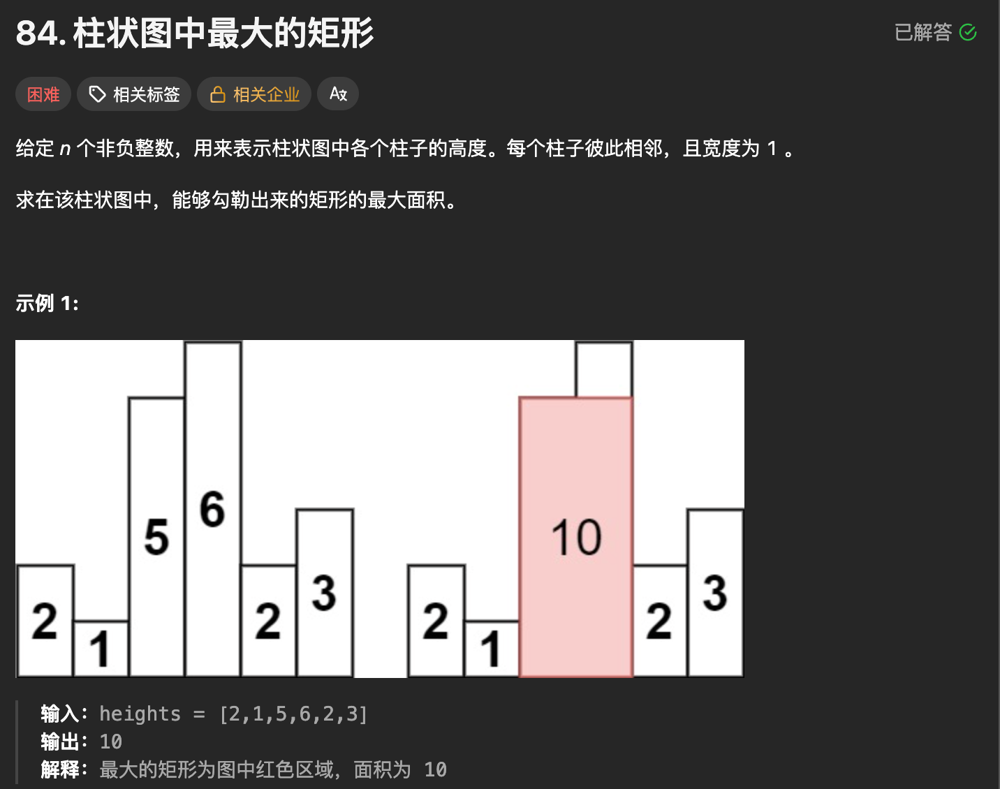

题目思考：

题目代码：

```cpp
int largestRectangleArea(vector<int>& heights) {
    // 先以单调栈的思路进行
    // 不过这页的CSDN上面的ACW那里有更详细的解释好像

    int n = heights.size();
    if (n == 0) return 0; // 补充空数组边界处理
    stack<int>sc;
    std::vector<int>res_r(n, -1); // 右边界默认值改为n（无更小元素时的边界）
    std::vector<int>res_l(n, -1); // 左边界默认值改为-1（无更小元素时的边界）

    // ===== 第一步：修正并补全右边界计算 =====
    sc.push(0);
    for(size_t i = 1; i < n; i++)
    {
        while(!sc.empty())
        {
            int top_ele_pos = sc.top();
            // 核心修正：找更小的元素作为右边界（原逻辑写反了）
            if(heights[i] < heights[top_ele_pos]){
                res_r[top_ele_pos] = i;
                sc.pop();
            }else{
                break;
            }
        }
        sc.push(i);
    }
    // 处理栈中剩余元素（这些元素没有右边界，保持默认值n）
    while(!sc.empty()) sc.pop(); // 清空栈，准备计算左边界

    // ===== 第二步：补充左边界计算 =====
    sc.push(n-1); // 从最后一个元素开始
    for(int i = n-2; i >= 0; i--) // 反向遍历找左边界
    {
        while(!sc.empty())
        {
            int top_ele_pos = sc.top();
            // 同样找更小的元素作为左边界
            if(heights[i] < heights[top_ele_pos]){
                res_l[top_ele_pos] = i;
                sc.pop();
            }else{
                break;
            }
        }
        sc.push(i);
    }

    // ===== 第三步：修正面积计算逻辑 =====
    int maxx = 0;
    for(int i = 0; i < n; i++){
        int width = 0;
        if(res_l[i] == -1 && res_r[i] == -1){
          width = n;
        }else if(res_l[i] == -1){
          width = res_r[i]
        }else if(res_r[i] == -1){
          width = n - res_l[i] - 1;
        }else{
          width = res_r[i] - res_l[i] - 1;
        }
        // 核心修正：宽度计算 = 右边界 - 左边界 - 1（原逻辑+1错误）
        maxx = max(maxx, width * heights[i]);
    }
    return maxx;
}


#include <vector>
#include <stack>
#include <algorithm>
using namespace std;

class Solution {
public:
    int largestRectangleArea(vector<int>& heights) {
        // 先以单调栈的思路进行
        // 不过这页的CSDN上面的ACW那里有更详细的解释好像

        int n = heights.size();
        if (n == 0) return 0; // 补充空数组边界处理
        stack<int>sc;
        std::vector<int>res_r(n, n); // 右边界默认值改为n（无更小元素时的边界）
        std::vector<int>res_l(n, -1); // 左边界默认值改为-1（无更小元素时的边界）

        // ===== 第一步：修正并补全右边界计算 =====
        sc.push(0);
        for(size_t i = 1; i < n; i++)
        {
            while(!sc.empty())
            {
                int top_ele_pos = sc.top();
                // 核心修正：找更小的元素作为右边界（原逻辑写反了）
                if(heights[i] < heights[top_ele_pos]){
                    res_r[top_ele_pos] = i;
                    sc.pop();
                }else{
                    break;
                }
            }
            sc.push(i);
        }
        // 处理栈中剩余元素（这些元素没有右边界，保持默认值n）
        while(!sc.empty()) sc.pop(); // 清空栈，准备计算左边界

        // ===== 第二步：补充左边界计算 =====
        sc.push(n-1); // 从最后一个元素开始
        for(int i = n-2; i >= 0; i--) // 反向遍历找左边界
        {
            while(!sc.empty())
            {
                int top_ele_pos = sc.top();
                // 同样找更小的元素作为左边界
                if(heights[i] < heights[top_ele_pos]){
                    res_l[top_ele_pos] = i;
                    sc.pop();
                }else{
                    break;
                }
            }
            sc.push(i);
        }

        // ===== 第三步：修正面积计算逻辑 =====
        int maxx = 0;
        for(int i = 0; i < n; i++){
            // 核心修正：宽度计算 = 右边界 - 左边界 - 1（原逻辑+1错误）
            int width = res_r[i] - res_l[i] - 1;
            maxx = max(maxx, width * heights[i]);
        }
        return maxx;
    }
};
```

### 题目来源：LeetCode-42. 接雨水

题目描述：  
 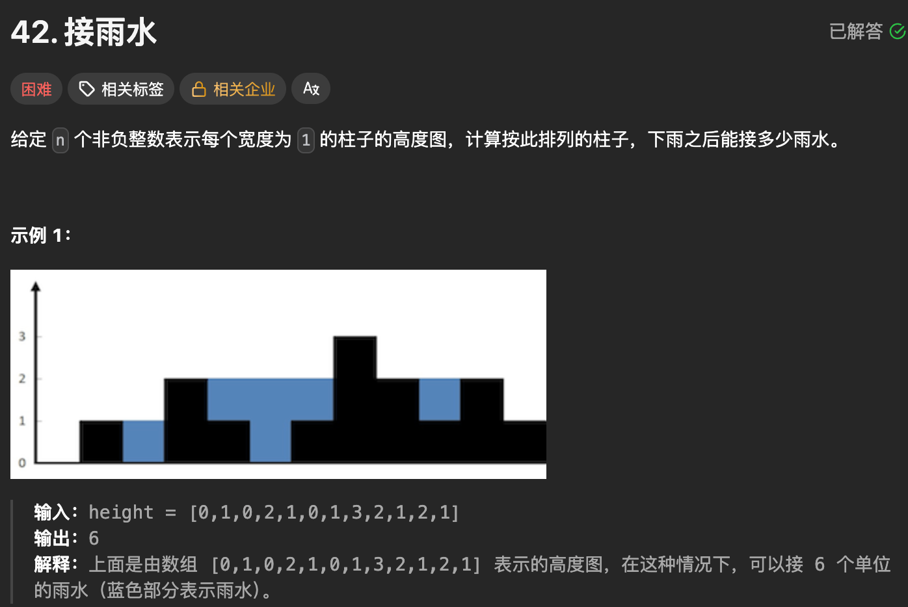

题目思路：

> ```
>    当前位置能接的雨水量 = min(左侧最大高度, 右侧最大高度) - 当前高度（如果结果 > 0）
>    双指针是 “贪心找左右最大高度”，单调栈是 “找每个柱子的左右第一个更高柱，计算横向接水量”。
> ```

题目代码：

```cpp
int trap(vector<int>& height) {

  // 竖着计算吧
  // = min(left_max, right_max) - height)
  int n = height.size();
  if(n < 3)return 0;
  vector<int>left_max(n, -1);
  vector<int>right_max(n, -1);

  // left_max
  left_max[0] = height[0];
  int maxx = max(-1, height[0]);
  for(int i = 1; i < n; i++){
    maxx = max(maxx, height[i]);
    left_max[i] = maxx;
  }

  // right_max
  right_max[n-1] = height[n-1];
  maxx = max(-1, height[n-1]);
  for(int i = n - 2; i >= 0; i--){
    maxx = max(maxx, height[i]);
    right_max[i] = maxx;
  }

  int res = 0;
  for(int i = 0; i < n; i++){
    if(left_max[i] <= 0 || right_max[i] <= 0)continue;
    int min_h = min(left_max[i], right_max[i]);
    if(min_h > height[i])res += min_h - height[i];
  }
  return res;
}


#include <vector>
#include <stack>
#include <algorithm>
using namespace std;

class Solution {
public:
    int trap(vector<int>& height) {
        int n = height.size();
        if (n < 3) return 0; // 至少3个柱子才能接水
        
        stack<int> st; // 单调递减栈，存储柱子的下标（不是高度！）
        int total_water = 0; // 总接水量
        
        for (int i = 0; i < n; ++i) {
            // 核心：当前柱子高度 > 栈顶柱子高度 → 找到凹槽，计算接水量
            while (!st.empty() && height[i] > height[st.top()]) {
                // 1. 弹出栈顶：这是凹槽的底部
                int bottom_idx = st.top();
                st.pop();
                
                // 2. 如果栈空，说明没有左边界，无法接水，直接break
                if (st.empty()) break;
                
                // 3. 找凹槽的左边界（新的栈顶）和右边界（当前i）
                int left_idx = st.top(); // 左边界下标
                int right_idx = i;       // 右边界下标
                
                // 4. 计算凹槽的高度和宽度
                // 接水高度 = 左右边界的较小值 - 凹槽底部高度
                int water_height = min(height[left_idx], height[right_idx]) - height[bottom_idx];
                // 接水宽度 = 右边界下标 - 左边界下标 - 1（中间的距离）
                int water_width = right_idx - left_idx - 1;
                
                // 5. 累加接水量（高度×宽度）
                total_water += water_height * water_width;
            }
            // 6. 当前柱子入栈（保持栈的单调递减）
            st.push(i);
        }
        return total_water;
    }
};
```
