#### 目录

- [知识框架](#_2)
- [No.0 筑基](#No0__4)
- [No.1 改化BFS](#No1_BFS_8)
- - [题目来源：LeetCode-994. 腐烂的橘子](#LeetCode994__12)
  - [题目来源：LeetCode-127-单词接龙](#LeetCode127_140)
  - [题目来源：蓝桥杯-第九届-调手表](#_188)
  - [题目来源：蓝桥杯-2017省赛-跳蚱蜢](#2017_241)
  - [题目来源：蓝桥杯-2017省赛-青蛙跳杯子](#2017_333)
- [No.2 V[N]版本BFS搜索统计层数模板](#No2_VNBFS_419)
- - [题目来源：PTA-L2-026 小字辈](#PTAL2026__420)
  - [题目来源：PTA-L2-031 深入虎穴](#PTAL2031__507)
  - [题目来源：PTA-L3-008 喊山](#PTAL3008__586)
- [No.3 迷宫矩阵问题BFS](#No3_BFS_660)
- - [题目来源：蓝桥杯-第十届-迷宫](#_661)
  - [题目来源：蓝桥杯-第十四届模拟-第三期 最大连通分块](#___777)
  - [题目来源：蓝桥杯-2018省赛-迷宫与陷阱](#2018_840)
  - [题目来源：蓝桥杯-2019省赛-大胖子走迷宫](#2019_928)
  - [题目来源：LeetCode-505-迷宫II](#LeetCode505II_1012)
- [No.4 字符矩阵BFS](#No4_BFS_1079)
- - [题目来源：蓝桥杯-2012省赛-移动字母](#2012_1082)
  - [题目来源：蓝桥杯-2013省赛-九宫重排](#2013_1145)
  - [题目来源：蓝桥杯-2015省赛-穿越雷区](#2015_1216)

## 知识框架

## No.0 筑基

> 请先学习下知识点，道友！  
>  题目知识点大部分来源于此：

## No.1 改化BFS

### 题目来源：LeetCode-994. 腐烂的橘子

题目描述：  
 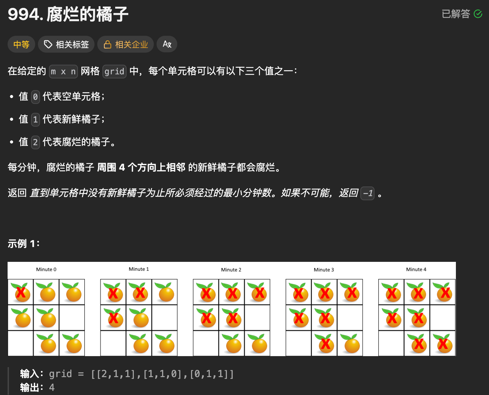

题目思路：

> 1-单源 BFS 解法  
>  2-多源 BFS 最优解法

题目代码：

```
#include <queue>
#include <vector>
#include <climits>
using namespace std;

class Solution {
public:
    int orangesRotting(vector<vector<int>>& grid) {
        if (grid.empty() || grid[0].empty()) return 0;
        int m = grid.size(), n = grid[0].size();
        int max_time = 0;
        int dirs[4][2] = {{-1,0}, {1,0}, {0,-1}, {0,1}};

        // 辅助函数：单源BFS，找(x,y)到最近腐烂橘子的距离
        auto bfs = [&](int x, int y) -> int {
            queue<pair<int, int>> q;
            vector<vector<bool>> visited(m, vector<bool>(n, false));
            q.emplace(x, y);
            visited[x][y] = true;
            int dist = 0; // 到腐烂橘子的距离（时间）

            while (!q.empty()) {
                int size = q.size();
                dist++; // 每一层距离+1
                for (int k = 0; k < size; ++k) {
                    auto [cx, cy] = q.front();
                    q.pop();
                    for (auto& d : dirs) {
                        int nx = cx + d[0], ny = cy + d[1];
                        if (nx < 0 || nx >= m || ny < 0 || ny >= n || visited[nx][ny]) {
                            continue;
                        }
                        if (grid[nx][ny] == 2) { // 找到最近的腐烂橘子
                            return dist;
                        }
                        if (grid[nx][ny] == 1) { // 新鲜橘子，继续搜索
                            visited[nx][ny] = true;
                            q.emplace(nx, ny);
                        }
                        // grid[nx][ny]==0：空单元格，跳过
                    }
                }
            }
            return -1; // 无可达的腐烂橘子
        };

        // 遍历每个新鲜橘子，找最近腐烂橘子的距离
        for (int i = 0; i < m; ++i) {
            for (int j = 0; j < n; ++j) {
                if (grid[i][j] == 1) {
                    int dist = bfs(i, j);
                    if (dist == -1) return -1; // 有橘子无法腐烂
                    max_time = max(max_time, dist); // 取最大距离（总时间）
                }
            }
        }

        return max_time;
    }
};
```

```
#include <queue>
#include <vector>
using namespace std;

class Solution {
public:
    int dirs[4][2] = {{-1, 0}, {1, 0}, {0, -1}, {0, 1}};
    int orangesRotting(vector<vector<int>>& grid) {
        int n = grid.size();
        int m = grid[0].size();
        int fresh_n = 0;
        queue<pair<int, int>>qp;

        for(int i = 0; i < n; i++){
            for(int j = 0; j < m; j++){
                if(grid[i][j] == 2){
                    qp.push({i, j});
                }
                if(grid[i][j] == 1){
                    fresh_n++;
                }
            }
        }
        int res_time = 0;
        while(!qp.empty() && fresh_n){
            // 目前的qp全部进行四周扩展;
            res_time++;
            int qp_size = qp.size(); // 合理的利用size来进行层序遍历。
            for(int i = 0; i < qp_size; i++){
                auto tmp = qp.front();
                for(int k = 0; k < 4; k++){
                    int now_x = tmp.first + dirs[k][0];
                    int now_y = tmp.second + dirs[k][1];
                    if(now_x >=0 && now_x < n && now_y >= 0 && now_y < m){
                        if(grid[now_x][now_y] == 1){
                            fresh_n--;
                            grid[now_x][now_y] = 2;
                            qp.push({now_x, now_y});
                        }
                    }
                }
                qp.pop();
            }
        }
        if(fresh_n)return -1;
        return res_time;

    }
};
```

### 题目来源：LeetCode-127-单词接龙

题目描述：  
 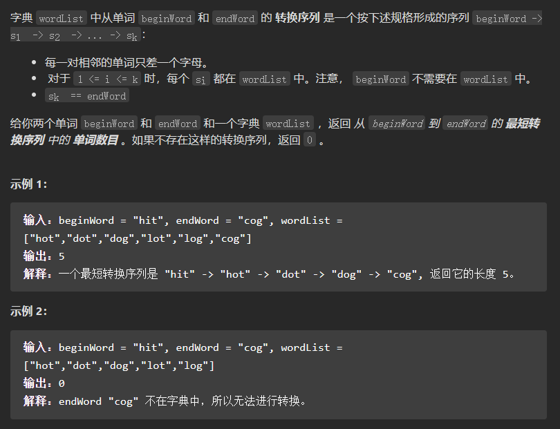

题目思路：

> 常见的BFS进行搜素；

题目代码：

```
class Solution {
public:
    int ladderLength(string beginWord, string endWord, vector<string>& wordList) {
        // 将vector转成unordered_set，提高查询速度
        unordered_set<string> wordSet(wordList.begin(), wordList.end());
        // 如果endWord没有在wordSet出现，直接返回0
        if (wordSet.find(endWord) == wordSet.end()) return 0;
        // 记录word是否访问过
        unordered_map<string, int> visitMap; // <word, 查询到这个word路径长度>
        // 初始化队列
        queue<string> que;
        que.push(beginWord);
        // 初始化visitMap
        visitMap.insert(pair<string, int>(beginWord, 1));

        while(!que.empty()) {
            string word = que.front();
            que.pop();
            int path = visitMap[word]; // 这个word的路径长度
            for (int i = 0; i < word.size(); i++) {
                string newWord = word; // 用一个新单词替换word，因为每次置换一个字母
                for (int j = 0 ; j < 26; j++) {
                    newWord[i] = j + 'a';
                    if (newWord == endWord) return path + 1; // 找到了end，返回path+1
                    // wordSet出现了newWord，并且newWord没有被访问过
                    if (wordSet.find(newWord) != wordSet.end()
                            && visitMap.find(newWord) == visitMap.end()) {
                        // 添加访问信息
                        visitMap.insert(pair<string, int>(newWord, path + 1));
                        que.push(newWord);
                    }
                }
            }
        }
        return 0;
    }
};
```

### 题目来源：蓝桥杯-第九届-调手表

题目描述：  
 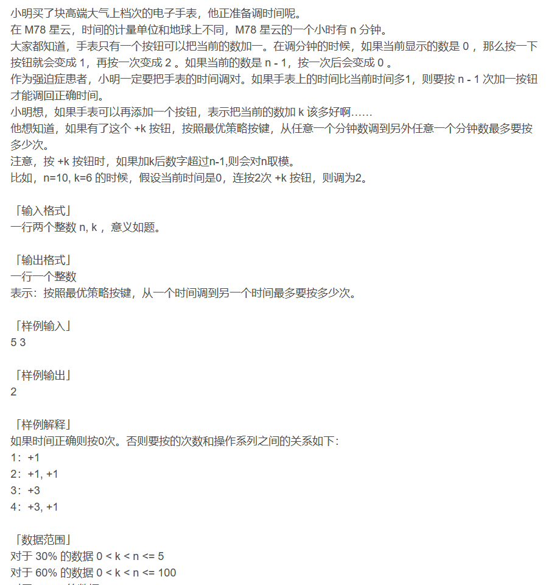

题目思路：

> 广度搜索（bfs）解决的，因为广度搜索出来的步数一定是最小的。思路是从0出发，每次走1步或k步，一直这样，用一个vis[i]判断i是否走过。一直这样，直到走完所有点。

题目代码：

```
#include<bits/stdc++.h>
using namespace std;
queue<int> que;
int step[100005];
bool vis[100005];
int main(){
	int n, k;
	cin>>n>>k;
	for(int i = 0; i < n; i++){
		step[i] = 0;
		vis[i] = false;
	}
	que.push(0);
	step[0] = 0;
	vis[0] = true;
	while(!que.empty()){
		int now = que.front();
		que.pop();
		int one_step = (now + 1) % n;
		if(vis[one_step] == false){
			vis[one_step] = true;
			step[one_step] = step[now] + 1;
			que.push(one_step);
		}
		int k_step = (now + k) % n;
		if(vis[k_step] == false){
			vis[k_step] = true;
			step[k_step] = step[now] + 1;
			que.push(k_step);
		}
	}
	int max_step = step[0];
	for(int i = 0; i < n; i++)
		max_step = max(max_step, step[i]);
	cout<<max_step<<endl;
	return 0;
}
```

### 题目来源：蓝桥杯-2017省赛-跳蚱蜢

题目描述：

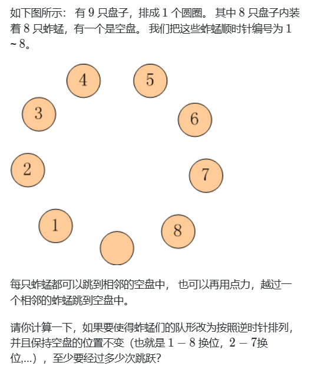

题目思路：


题目代码：

```
#include<iostream>
#include<algorithm>
#include<cmath>
#include<queue>
#include<map> 
using namespace std;
map<string,bool> st;
map<string,int> arr;
//初始状态为012345678，结束状态为087654321
void bfs()
{
    queue<string> q;
    q.push("012345678");
    st["012345678"] = true;
    while(!q.empty())
    {
        if(st["087654321"])
        {
            cout<<arr["087654321"]<<endl;
            return;
        }
        string key = q.front();
//        cout<<key<<endl;
        q.pop();
        int num=0;
        for(int i=0;i<=key.length()-1;i++)
            if(key[i]=='0')
            {
                num = i;
                break;
            }
        
        string temp;
        temp = key;
        swap(temp[num],temp[(num+1)%9]);
        
        if(!st[temp])
        {
            st[temp] = true;
            arr[temp] = arr[key]+1;
            q.push(temp);
        }
        
        temp = key;
        swap(temp[num],temp[(num-1+9)%9]);//加个9防止取到负数 
        if(!st[temp])
        {
            st[temp] = true;
            arr[temp] = arr[key]+1;
            q.push(temp);
        }
        
        temp = key;
        swap(temp[num],temp[(num+2)%9]);
        if(!st[temp])
        {
            st[temp] = true;
            arr[temp] = arr[key]+1;
            q.push(temp);
        }
        
        temp = key;
        swap(temp[num],temp[(num-2+9)%9]);
        if(!st[temp])
        {
            st[temp] = true;
            arr[temp] = arr[key]+1;
            q.push(temp);
        }
    }
}
int main()
{
    bfs();
     return 0;
}
```

### 题目来源：蓝桥杯-2017省赛-青蛙跳杯子

题目描述：  
 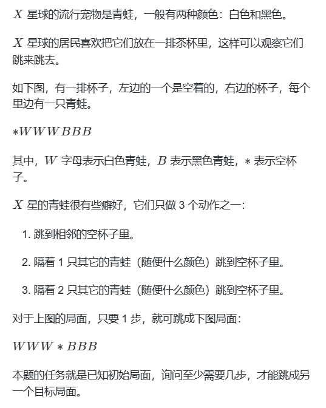

题目思路：


题目代码：

```
#include <bits/stdc++.h>

using namespace std;
string st_str,end_str;
int n;
int d[6] = {-3,-2,-1,1,2,3};
map<string,int> ans;


//补全BFS函数,百分之八十都是模板了，直接背(狗头)
int bfs()
{
    //声明一个队列
    queue<string> q;
    //将当前的状态入队
    q.push(st_str);
    
    ans[st_str] = 0;
    
    //当队列不为空的时候
    while(q.size())
    {
        //取出队头
        string ss = q.front();
        q.pop();
        
        int cnt = ans[ss];
        
        int x = ss.find('*');
        
        //拓展六个方向
        for(int i = 0;i < 6;i++)
        {
            int z = x + d[i];
            
            //判断出来的距离，是合法的
            if(z>= 0 && z < n)
            {
                swap(ss[x],ss[z]); //交换青蛙和当前空杯子的位置
                if(!ans.count(ss)) //用count来判断当前字符串是否在哈希表中出现过
                {
                    ans[ss] = cnt + 1;
                    //符合结果，输入
                    if(ss == end_str) return ans[ss];
                    q.push(ss);
                    
                }

                //还原现场
                swap(ss[x],ss[z]);
            }
        }
    }
    
    return -1;
}

int main()
{

    cin >> st_str >>end_str;
    n = st_str.size();

    cout << bfs() <<endl;
    
    return 0;
}
```

## No.2 V[N]版本BFS搜索统计层数模板

### 题目来源：PTA-L2-026 小字辈

题目描述：  
 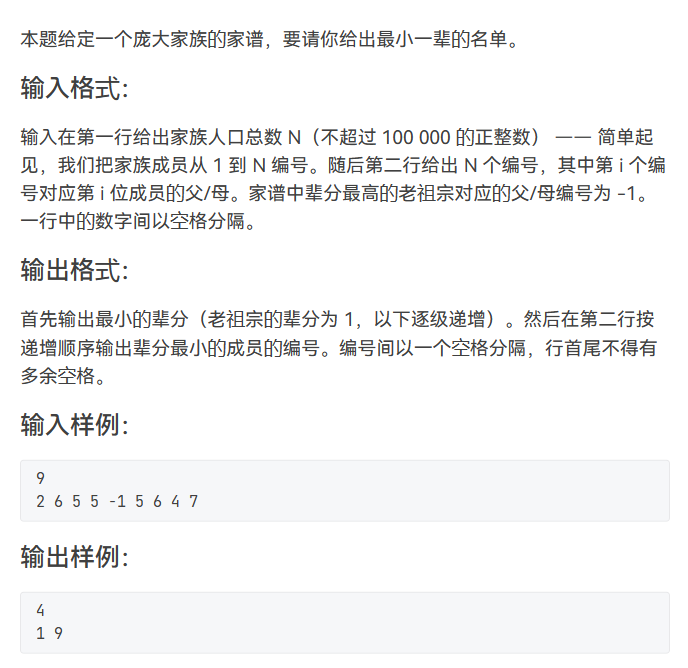

题目思路：

题目代码：

```
//    v[x].push_back(i);

#include <bits/stdc++.h>
using namespace std;
#define inf 0x3f3f3f3f
#define N 101000
vector<int>v[N];
int level[N],vis[N]={0};
void bfs(int u)
{
    memset(vis,0,sizeof vis);
    memset(level,0,sizeof level);
    queue<int>q;
    q.push(u);
    
    while(!q.empty())
    {
        int x=q.front();
        vis[x]=1;
        q.pop();
        for(int i=0;i<v[x].size();i++)
        {
            if(!vis[v[x][i]])
            {
                level[v[x][i]]=level[x]+1;	//level[x]表示x点在第几层次
                vis[v[x][i]]=1;
                q.push(v[x][i]);
            }
        }
    }

}


int main() {

    int n,m,k;
    int x,y,z;
     int start;
    cin>>n;
    if(n==1){
        cout<<"1"<<endl;
        cout<<"1"<<endl;
        return 0;
    }
    for(int i=1;i<=n;i++){
        cin>>x;
        if(x==-1){
            start=i;
        }else{
            v[x].push_back(i);
        }
    }


    bfs(start);
    int maxx=0;
    for(int i=1;i<=n;i++)
        if(maxx<level[i]) maxx=level[i];//保存最大层数
    cout<<maxx+1<<endl;
    int ok=1;
    for(int i=1;i<=n;i++)
        if(maxx==level[i]) {
            if(ok==1){
                cout<<i;
                ok=0;
            }else{
                cout<<" "<<i;
            }
        }//返回最大层数的最小编号，无相连的跳过

    return 0;
}
```

### 题目来源：PTA-L2-031 深入虎穴

题目描述：  
 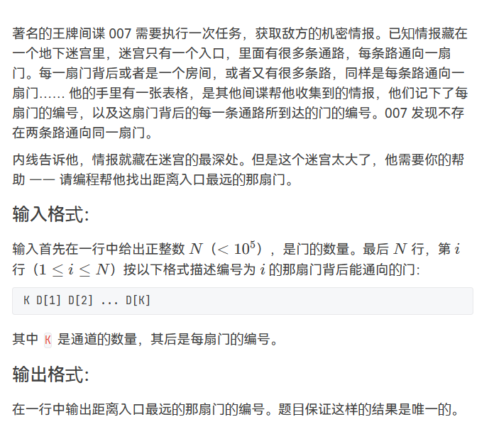

题目思路：

题目代码：

```
//从1开始且最后是输出编号
//
#include<bits/stdc++.h>
#define N 10003
using namespace std;
#define inf 0x3f3f3f3f
#define N 100100
int n,m,k,d;
int x,y,z;
vector<int>v[N];
int root[N]={0};

int level[N],vis[N];
void bfs(int index){
    memset(level,0,sizeof(level));
    memset(vis,0,sizeof(vis));
    queue<int>q;
    q.push(index);
    while(!q.empty()){
        int num=q.front();
        vis[num]=1;
        q.pop();
        for(int i=0;i<v[num].size();i++){
            if(vis[v[num][i]]==0 && level[v[num][i]]==0){
                level[v[num][i]]=level[num]+1;
                vis[v[num][i]]=1;
                q.push(v[num][i]);
            }
        }
    }
}
int main() {
    cin>>n;
    if(n==1){
        cout<<"1"<<endl;
        return 0;
    }
    for(int i=1;i<=n;i++){
        cin>>k;
        while(k--){
            cin>>x;
            root[x]=1;
            v[i].push_back(x);
        }
    }
    int start;
    for(int i=1;i<=n;i++){
        if(root[i]==0){
            start=i;
        }
    }
    bfs(start);
    int maxx=0;
    for(int i=1;i<=n;i++){
        if(level[i]>maxx){
            maxx=level[i];
        }
    }
    for(int i=1;i<=n;i++){
        if(level[i]==maxx){
            cout<<i<<endl;
            break;
        }
    }    
	return 0;
}
```

### 题目来源：PTA-L3-008 喊山

题目描述：  
 

题目思路：

题目代码：

```
#include<bits/stdc++.h>

using namespace std;

const int N=10010;
int n,m,k;

int level[N],vis[N];
vector<int>v[N];


int bfs(int u)
{
    memset(vis,0,sizeof vis);
    memset(level,0,sizeof level);
    queue<int>q;
    q.push(u);
    while(!q.empty())
    {
        int x=q.front();
        vis[x]=1;
        q.pop();
        for(int i=0;i<v[x].size();i++)
        {
            if(!level[v[x][i]]&&!vis[v[x][i]])
            {
                level[v[x][i]]=level[x]+1;
                vis[v[x][i]]=1;
                q.push(v[x][i]);
            }
        }
    }
    int maxx=0;
    for(int i=1;i<=n;i++)
        if(maxx<level[i]) maxx=level[i];//保存最大层数
    for(int i=1;i<=n;i++)
        if(maxx&&maxx==level[i]) return i;//返回最大层数的最小编号，无相连的跳过
    return 0;
}
int main()
{
    cin>>n>>m>>k;
    while(m--)
    {
        int a,b;
        cin>>a>>b;
        v[a].push_back(b);
        v[b].push_back(a);
    }
    int x;
    while(k--)
    {
        cin>>x;
        cout<<bfs(x)<<endl;
    }
    return 0;
}
```

## No.3 迷宫矩阵问题BFS

### 题目来源：蓝桥杯-第十届-迷宫

题目描述：  
 [转自这里：迷宫问题的题解](http://t.csdn.cn/WTtCH)  
 题目思路：

题目代码：

```
#include<bits/stdc++.h>
using namespace std;

struct Index//坐标位置
{
    int x;
    int y;
};
struct Ch//这个结点的值和前驱结点的坐标
{
    char ch;
    Index per;
};
Ch mp[40][60];
bool vis[40][60];
//字典序最小的方向数组 - DLRU - 最优性剪枝
int fx[] = {1,0,0,-1};
int fy[] = {0,-1,1,0};
//进行bfs搜索
void bfs(int x,int y)
{
    queue<Index> q;
    //将起点入队
    q.push((Index){1,1});
    vis[1][1] = true;
    while(!q.empty())
    {
        //获取头结点
        Index temp = q.front();
        //进行四个方向的搜索
        for(int i = 0;i < 4;i++)
        {
            Index t = (Index){temp.x + fx[i],temp.y + fy[i]};
            //判断这个点是否合法 - 是空地且未访问
            if(mp[t.x][t.y].ch == '1' && vis[t.x][t.y] == false)
            {
                //将这个点记录前驱结点位置
                mp[t.x][t.y].per = temp;
                //然后将这个结点设置为以访问
                vis[t.x][t.y] = true;
                //再将这个点加入队列等待搜索
                q.push(t);
            }
        }
        //搜索完所有的情况，，将这个结点出队
        q.pop();
    }
}
int main()
{
    string s;//记录路径
    //初始化迷宫
    for(int i = 1;i <= 30;i++)
    {
        for(int j = 1;j <= 50;j++)
        {
            cin >> mp[i][j].ch;
            mp[i][j].ch += 1;
        }
    }
    //从起点开始搜索
    bfs(1,1);
    //因为每个位置都有前驱结点的位置
    //从终点开始遍历每个结点的前驱结点，直到起点结束
    Index t = {30,50};
    //当两个坐标都为1的时候，循环结束
    while(t.x != 1 || t.y != 1)
    {
        //当前结点减去前驱结点得到的值对应的就是前驱节点移动的方向
        int x = t.x - mp[t.x][t.y].per.x;
        int y = t.y - mp[t.x][t.y].per.y;
        int flag;
        for(int i = 0;i < 4;i++)
        {
            if(x == fx[i] && y == fy[i])
            {
                flag = i;
                break;
            }
        }
        switch(flag)
        {
        case 0:
            s += 'D';
            break;
        case 1:
            s += 'L';
            break;
        case 2:
            s += 'R';
            break;
        case 3:
            s += 'U';
            break;
        }
        //更新结点
        t = mp[t.x][t.y].per;
        //cout << t.x << " " << t.y << endl;
    }
    //将得到的路径翻转输出
    for(int i = s.size() - 1;i >= 0;i--)
    {
        cout << s[i];
    }
    return 0;
}
```

### 题目来源：蓝桥杯-第十四届模拟-第三期 最大连通分块

题目描述：  
 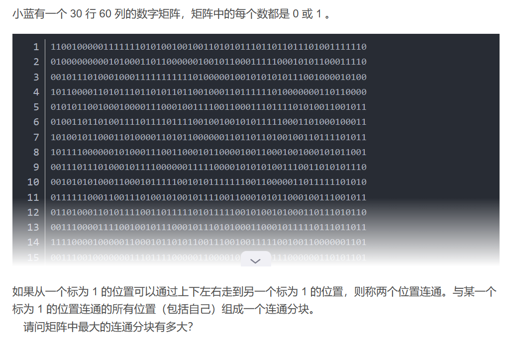

题目思路：


题目代码：

```
// 答案：148
#include <bits/stdc++.h>
using namespace std;

int m = 30, n = 60;
char mat[35][65];
int ans = 0;

int dx[4] = {1, 0, -1, 0};
int dy[4] = {0, 1, 0, -1};

int get_cnt(int i, int j) {
	queue<int> q;
	q.push(i * 100 + j);
	mat[i][j] = '0';
	int cnt = 0;
	while (q.size()) {
		int x = q.front();
		q.pop();
		i = x / 100;
		j = x % 100;
		cnt ++;
		
		for (int k = 0; k < 4; k ++) {
			int x = i + dx[k];
			int y = j + dy[k];
			if (x < 0 || x >= m || y < 0 || y >= n || mat[x][y] != '1') {
				continue;
			}
			mat[x][y] = '0';
			q.push(x * 100 + y);
		}
	}
	return cnt;
}

int main() {
	for (int i = 0; i < m; i ++) {
		cin >> mat[i];
	}
	for (int i = 0; i < m; i ++) {
		for (int j = 0; j < n; j ++) {
			if (mat[i][j] == '1') {
				ans = max(ans, get_cnt(i, j));
			}
		}
	}
	cout << ans << endl;
	return 0;
}
```

### 题目来源：蓝桥杯-2018省赛-迷宫与陷阱

题目描述：  
 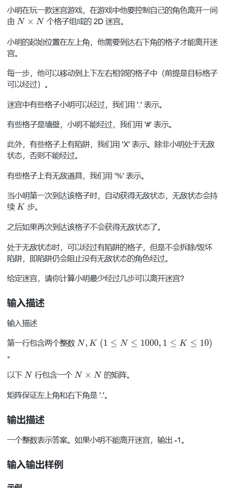

题目思路：


题目代码：

```
#include <bits/stdc++.h>
using namespace std;
int n,k;
struct node
{
  int x,y,cnt,num;
};
int dx[]={-1,1,0,0},dy[]={0,0,-1,1};
bool vis[1005][1005];
char mp[1005][1005];
int s[1005][1005];
bool check(node nex)
{
  if(nex.x<1 || nex.x>n || nex.y<1 || nex.y>n || mp[nex.x][nex.y]=='#')return 0;
  if(mp[nex.x][nex.y]=='X' && nex.num<1)return 0;
  return 1;
}
int bfs()
{
  queue<node>q;
  q.push({1,1,0,0});
  vis[1][1]=1;
  while(!q.empty())
  {
    node now;
    now=q.front();
    q.pop();
    if(now.x==n && now.y==n)return now.cnt;
    for(int i=0;i<4;i++)
    {
      node nex=now;
      nex.x=now.x+dx[i];
      nex.y=now.y+dy[i];
      if(!check(nex))continue;
      nex.num=max(0,now.num-1);
      nex.cnt++;
      if(mp[nex.x][nex.y]=='%')
      {
        vis[nex.x][nex.y]=1;
        mp[nex.x][nex.y]='.';
        nex.num=k;
        q.push(nex);
      }
      else 
      {
        if(!vis[nex.x][nex.y])
        {
          vis[nex.x][nex.y]=1;
          q.push(nex);
          continue;
        }
        if(nex.num<=s[nex.x][nex.y])continue;
        s[nex.x][nex.y]=nex.num;
        q.push(nex);
      }
    }
  }
  return -1;
}
int main()
{
  // 请在此输入您的代码
  cin>>n>>k;
  for(int i=1;i<=n;i++)
  {
    for(int j=1;j<=n;j++)
    {
      cin>>mp[i][j];
    }
  }
  cout<<bfs();
  return 0;
}
```

### 题目来源：蓝桥杯-2019省赛-大胖子走迷宫

题目描述：  
 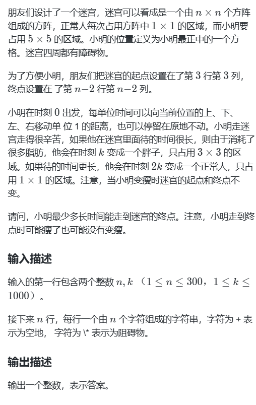

题目思路：


题目代码：

```
#include <bits/stdc++.h>
#include <queue>
#define INF 0x3f3f3f3f
using namespace std;
typedef long long LL;
int t,n,k,vis[1005][1005];//体重、行数、变瘦时间标记数组
char mp[400][400];//存图
//上下左右
const int dr[]= {0,0,-1,1};
const int dc[]= {-1,1,0,0};

struct node {
    int x,y,dis;
    node(int x=0,int y=0,int dis=0):x(x),y(y),dis(dis) {}
};
//在迷宫里饿死啦(T_T)
bool inside(int xx, int yy) {
    if(xx+t/2<n && xx-t/2>=0 && yy+t/2<n && yy-t/2>=0) return true;//记得加上大胖子的身材哦！
    else return false;
}
//大胖子吃太多好胖~卡住啦，动不了，只能在迷宫里饿一饿变瘦子
bool check(int xx,int yy) {
    for(int i=xx-t/2; i<=xx+t/2; i++)
        for(int j=yy-t/2; j<=yy+t/2; j++)
            if(mp[i][j]=='*') return false;
    return true;
}
//博主最爱的bfs 
void bfs() {
    queue<node> q;
    node u(2,2,0);//大胖子出发啦
    vis[2][2]=1;
    q.push(u);
    while(!q.empty()) {
        node u=q.front();
        q.pop();
        if(u.x==n-3 && u.y==n-3) {
            cout<<u.dis;
            return;
        }
                
        if(u.dis<k) t=5;//大胖子
        else if(u.dis>=k && u.dis<2*k) t=3;//胖子
        else if(u.dis>=2*k) t=1;//瘦子
        
        if(t!=1) q.push(node(u.x,u.y,u.dis+1));//胖子太胖啦，出不去，只能呆在原地 
        
        for(int i=0; i<4; i++) {
            int nx=u.x+dr[i];
            int ny=u.y+dc[i];
            if(inside(nx,ny) && !vis[nx][ny] && check(nx,ny)) {
                vis[nx][ny]=1;
                int diss=u.dis+1;
                node v(nx,ny,diss);
                q.push(v);
            }
        }
    }
}


int main() {
    cin>>n>>k;
    for(int i=0; i<n; i++)
        cin>>mp[i];
    bfs();
    return 0;
}
```

### 题目来源：LeetCode-505-迷宫II

题目描述：  
 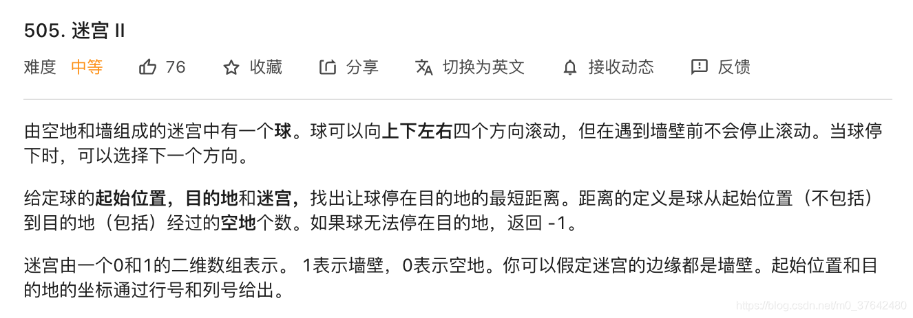  
 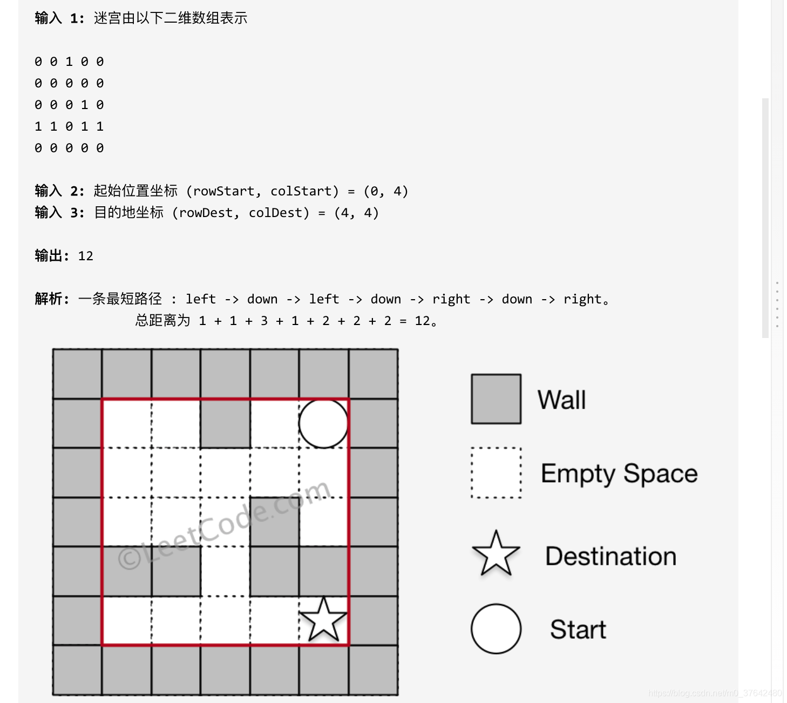

题目思路：

> BFS的平面上的；矩阵的BFS；  
>  1.迷宫中只有一个球和一个目的地。  
>  2.球和目的地都在空地上，且初始时它们不在同一位置。  
>  3.给定的迷宫不包括边界(如图中的红色矩形),但你可以假设迷宫的边缘都是墙壁。  
>  4.迷宫至少包括2块空地，行数和列数均不超过100。

题目代码：

```
class Solution {
public:
    int shortestDistance(vector<vector<int>>& maze, vector<int>& start, vector<int>& destination) {
        int m = maze.size();
        int n = maze[0].size();
        vector<vector<int>> directions = {{-1, 0}, {1, 0}, {0, -1}, {0, 1}};

        vector<vector<int>> distance(m, vector<int>(n, INT_MAX));
        distance[start[0]][start[1]] = 0;
        
        queue<pair<int, int>> q;
        q.push(make_pair(start[0], start[1]));

        while (!q.empty()) {
            auto cur = q.front();
            q.pop();
            int curx = cur.first;
            int cury = cur.second;

            for (auto& dir : directions) {
                int dx = dir[0];
                int dy = dir[1];
                int x = curx + dx;
                int y = cury + dy;
                int count = 0;

                while (x >= 0 && x < m && y >= 0 && y < n && maze[x][y] == 0) {
                    x += dx;
                    y += dy;
                    count++;
                }

                x -= dx;
                y -= dy;
                int tmp = distance[curx][cury] + count;

                if (tmp < distance[x][y]) {
                    distance[x][y] = tmp;
                    q.push(make_pair(x, y));
                }
            }
        }

        int x = destination[0];
        int y = destination[1];
        return distance[x][y] != INT_MAX ? distance[x][y] : -1;
    }
};
```

## No.4 字符矩阵BFS

### 题目来源：蓝桥杯-2012省赛-移动字母

题目描述：  
 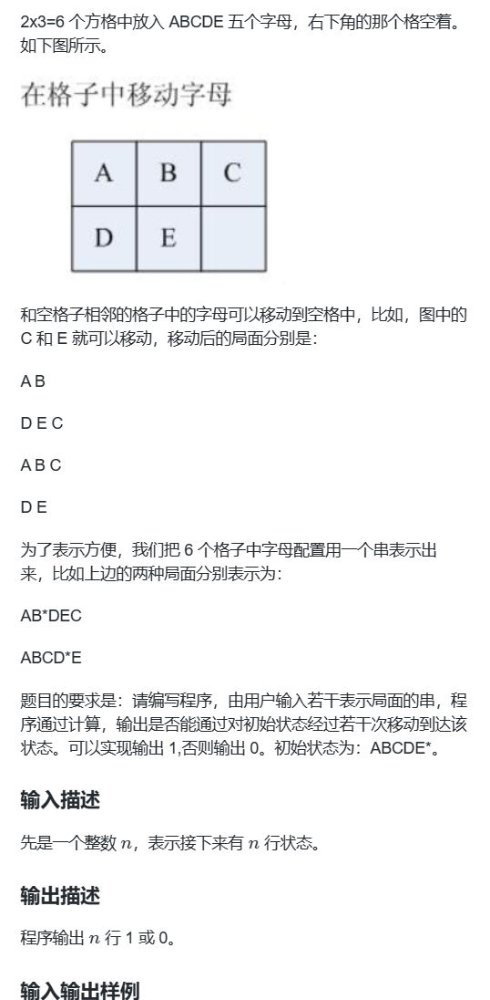

题目思路：


题目代码：

```
#include <iostream>
#include <queue>
#include <unordered_set>

using namespace std;

// 记录每个位置可以移动到空格来的下标
vector<int> d[6] = {{1, 3}, {0, 2, 4}, {1, 5}, {0, 4}, {1, 3, 5}, {2, 4}};
unordered_set<string> vis; // 用来记录所有状态，顺便用来剪枝
int n;
string s;

// 算上不可能的状态也才6！= 720种状态，先把所有可能的状态全部枚举出来
void bfs() 
{
    queue<string> q;
    q.push("ABCDE*");
    vis.insert("ABCDE*");
    while (!q.empty())
    {
        string p = q.front(); q.pop();
        int i_star = p.find("*");
        for (auto i: d[i_star])
        {
            swap(p[i], p[i_star]);
            if (!vis.count(p))
            {
                vis.insert(p);
                q.push(p);
            }
            swap(p[i], p[i_star]);
        }
    }
}

int main()
{
    bfs();
    cin >> n;
    while (n -- )
    {
        cin >> s;
        puts(vis.count(s) ? "1" : "0");
    }
    return 0;
}
```

### 题目来源：蓝桥杯-2013省赛-九宫重排

题目描述：  
 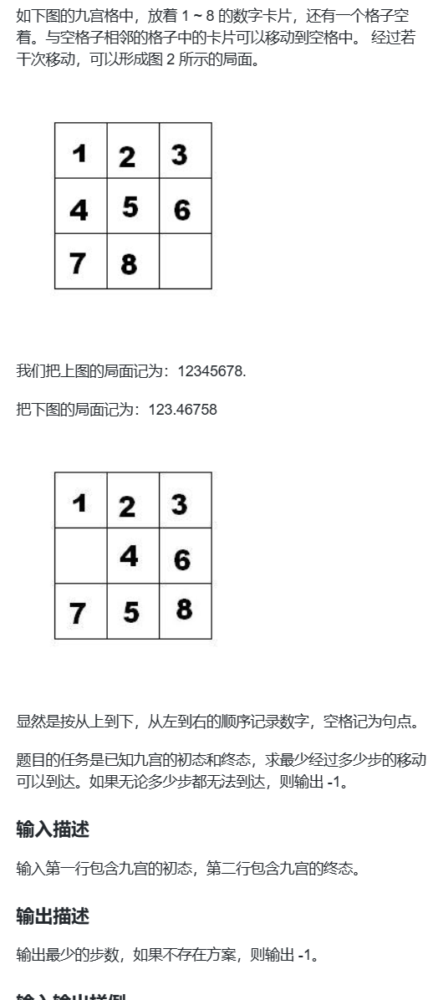

题目思路：


题目代码：

```
#include <iostream>
#define int long long
using namespace std;

const int N = 10;
string start,End;
int dx[4] = {-1, 0, 1, 0}, dy[4] = {0, 1, 0, -1};

int bfs(string start){
    
    queue<string>q;
    unordered_map<string,int>f;
    
    q.push(start);
    f[start]=0;
    
    while(q.size()){
        
        auto t=q.front();
        q.pop();
        
        int dist=f[t];
        if(t==End)  return dist;
        
        int k=t.find('.');
        int x=k/3,y=k%3;
        
        for(int i=0;i<4;i++){
            int tx=x+dx[i],ty=y+dy[i];
            if(tx>=0&&ty>=0&&tx<3&&ty<3){
                swap(t[k],t[tx*3+ty]);
                if(!f.count(t)){
                    
                    f[t]=dist+1;
                    q.push(t);
                }
                swap(t[k],t[tx*3+ty]);
            }
        }
    }
    return -1;
}

signed main(){
    
    IOScc;
    
    cin>>start>>End;
    
    
    cout<<bfs(start);
    
    return 0;
}
```

### 题目来源：蓝桥杯-2015省赛-穿越雷区

题目描述：  
 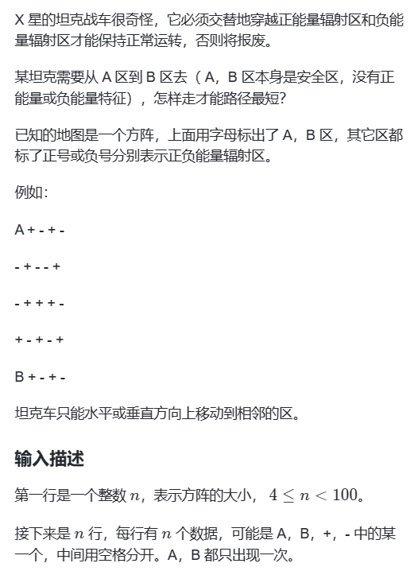

题目思路：


题目代码：

```
#include<iostream>
using namespace std;
char g[110][110];
int visited[110][110];
int y[4]={1,0,-1,0};
int x[4]={0,1,0,-1};
int n;
int bfs(int ax,int ay){
    visited[ax][ay]=1;
    if( g[ax][ay]=='B' )
        return 0;
    int d=n*n;
    for(int i=0;i<4;i++){
        int dx=x[i]+ax;
        int dy=y[i]+ay;
        if( visited[dx][dy] || dx>n || dy>n || dx<1 || dy<1)
            continue;
        if( g[ax][ay]!=g[dx][dy]){
            int nd=bfs(dx,dy)+1;
            d=nd<d?nd:d;
            visited[dx][dy]=0;
        }
            
    }
    
    return d;
    
} 
int main(){
    int ax,ay;
    cin>>n;
    
    for(int i=1;i<=n;i++){
        for(int j=1;j<=n;j++){
            cin>>g[i][j];
            getchar();
            if(g[i][j]=='A'){
                ax=i; ay=j;
            }
        }
    }
    int d=bfs(ax,ay);
    if(d==n*n)
      cout<<-1;
    else cout<<d;
    return 0;
}
```
