# 【完整题单0406、DFS】【✅✅✅✅】

> 来源：[【完整题单0406、DFS】【✅✅✅✅】](https://blog.csdn.net/weixin_51429773/article/details/129690896) · 发布时间：2026-06-10 · 阅读量：粉丝可见

#### 目录

- [知识框架](#_2)
- [No.0 筑基](#No0__4)
- [No.1 图进行DFS搜索](#No1_DFS_9)
- - [题目来源：LeetCode-841-钥匙和房间](#LeetCode841_11)
  - [题目来源：蓝桥杯-2013省赛-网络寻路](#2013_53)
- [No.2 改化DFS](#No2_DFS_101)
- - [题目来源：蓝桥杯-第九届-激光样式](#_106)
  - [题目来源：蓝桥杯-第六届-居民集会](#_152)
  - [题目来源：蓝桥杯-2017省赛-分考场](#2017_162)
  - [题目来源：蓝桥杯-2017省赛-小朋友崇拜圈](#2017_217)
- [No.3 矩阵格子搜索](#No3__264)
- - [题目来源：蓝桥杯-2023省赛模拟-最大连通](#2023_267)
  - [题目来源：蓝桥杯-2017省赛-全球变暖](#2017_321)
  - [题目来源：蓝桥杯-2013省赛-剪格子](#2013_400)
  - [题目来源：蓝桥杯-2018省赛-字母阵列](#2018_458)
  - [题目来源：蓝桥杯-第十四届模拟-最大连通](#_515)
  - [题目来源：蓝桥杯-第七届-剪邮票](#_581)
  - [题目来源：蓝桥杯-第八届-方格分割](#_589)
  - [题目来源：蓝桥杯-第十届-拼接](#_597)
  - [题目来源：蓝桥杯-第十届-路径计数](#_606)
  - [题目来源：蓝桥杯-第十四届模拟-第三期 最长滑行](#___657)
  - [题目来源：蓝桥杯-2022省赛模拟-X图形](#2022X_716)
  - [题目来源：蓝桥杯-2016省赛-路径之谜](#2016_811)
  - [题目来源：蓝桥杯-2017省赛-迷宫](#2017_883)
- [No.4 V[N]版本DFS搜索统计连通分量个数模板](#No4_VNDFS_950)
- - [题目来源：LeetCode-200. 岛屿数量](#LeetCode200__954)
  - [题目来源：LeetCode-695. 岛屿的最大面积](#LeetCode695__1056)
  - [题目来源：LeetCode-3619. 总价值可以被 K 整除的岛屿数目](#LeetCode3619__K__1169)
  - [题目来源：LeetCode-463. 岛屿的周长](#LeetCode463__1279)
  - [题目来源：LeetCode-733. 图像渲染](#LeetCode733__1321)
  - [题目来源：PTA-L2-013 红色警报](#PTAL2013__1440)
  - [题目来源：PTA-L2-025 分而治之](#PTAL2025__1516)
  - [题目来源：Acwing-4493-环形连通分量](#Acwing4493_1593)
- [No.5 V[N]版本DFS搜索根据条件判断正否模板：](#No5_VNDFS_1663)
- - [题目来源：PTA-L2-016 愿天下有情人都是失散多年的兄妹](#PTAL2016__1664)
  - [题目来源：PTA-L2-030 冰岛人](#PTAL2030__1743)
  - [题目来源：PTA-L2-023 图着色问题](#PTAL2023__1823)
- [No.6 有向图V[N]版本DFS搜索储存路径模板](#No6_VNDFS_1882)
- - [题目来源：PTA-L3-025 那就别担心了](#PTAL3025__1883)
  - [题目来源：PTA-L2-020 功夫传人](#PTAL2020__1947)
  - [题目来源：PTA-L2-038 病毒溯源](#PTAL2038__2008)
- [No.7 无向图即模拟树搜索路径](#No7__2076)
- - [题目来源：PTA-L3-032 关于深度优先搜索和逆序对的题应该不会很难吧这件事](#PTAL3032__2077)
  - [题目来源：PTA-L2-043 龙龙送外卖](#PTAL2043__2152)
  - [题目来源：Acwing-3712-根能抵达的点](#Acwing3712_2225)
  - [题目来源：RoboCom-2022-RC-u5 树与二分图](#RoboCom2022RCu5__2244)

## 知识框架

## No.0 筑基

> 请先学习下知识点，道友！  
>  题目知识点大部分来源于此：

## No.1 图进行DFS搜索

### 题目来源：LeetCode-841-钥匙和房间

题目描述：  
 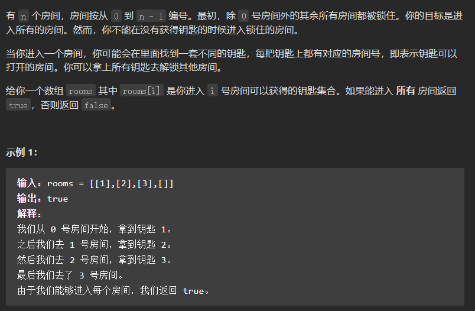

题目思路：

> 深度搜索三部曲：  
>  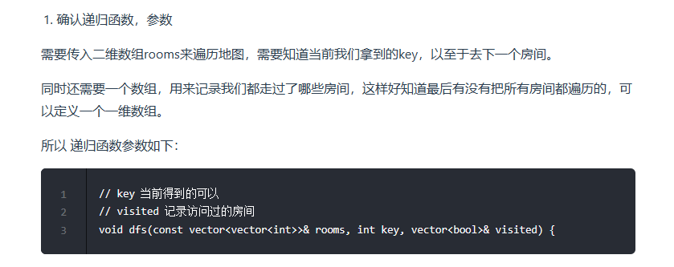  
>  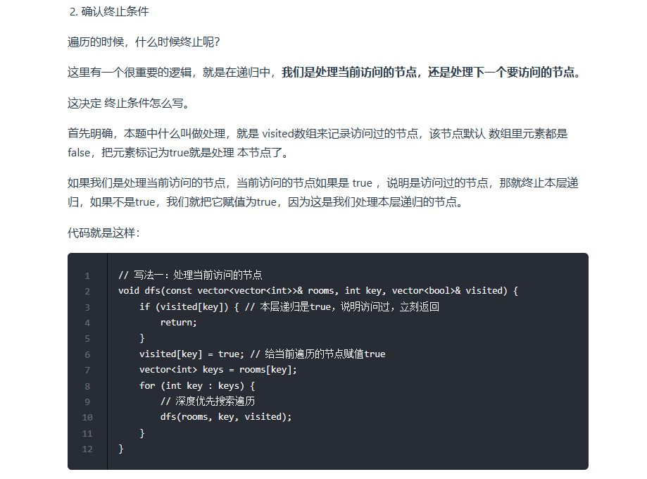  
>  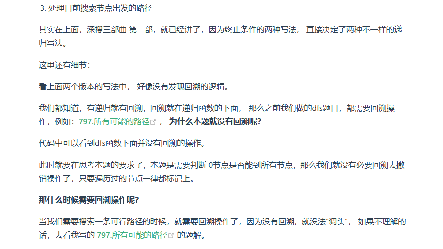

题目代码：

```
class Solution {
private:
    void dfs(const vector<vector<int>>& rooms, int index, vector<bool>& vis_room) {
        vis_room[index] = 1;
        for(int i = 0; i < rooms[index].size(); i++){
            auto now_room = rooms[index][i];
            if(vis_room[now_room])continue;
            dfs(rooms, now_room, vis_room);
        }
    }
public:
    bool canVisitAllRooms(vector<vector<int>>& rooms) {
        int n = rooms.size();
        vector<bool> vis_room(n, false);
        dfs(rooms, 0, vis_room);
        //检查是否都访问到了
        for (bool i : vis_room) {
            if (i == false) return false;
        }
        return true;
    }
};
```

### 题目来源：蓝桥杯-2013省赛-网络寻路

题目描述：  
 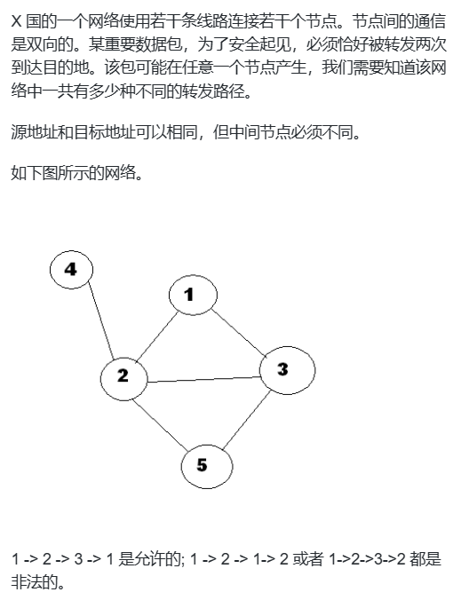

题目思路：


题目代码：

```
#include <iostream>
#include<vector>
using namespace std;
int n,m,ans;
vector <int >mp[10005];
void dfs(int last ,int x,int num){
    if(num==3){
        ans++;
        return;
    }
    for(int i=0;i<mp[x].size();i++){
        if(mp[x][i]!=last){
            dfs(x,mp[x][i],num+1);
        } 
    }
}
int main(){
    cin>>n>>m;
    for(int i=0;i<m;i++){
        int u,v;
        cin>>u>>v;
        mp[u].push_back(v);
        mp[v].push_back(u);
    }
    for(int i=1;i<=n;i++){
        dfs(-1,i,0);
    }
    cout<<ans;
    return 0;
}
```

## No.2 改化DFS

### 题目来源：蓝桥杯-第九届-激光样式

题目描述：  
 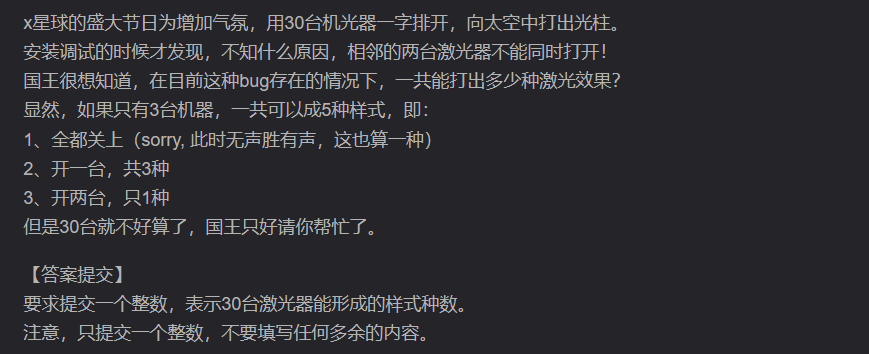

题目思路：

> 就一层一层的进行遍历下去；

题目代码：

```
#include <iostream>
using namespace std;

int ans;
const int N = 30;
bool st[N];

void dfs(int u)
{
    if(u == 31)
    {
        ans ++;
        return;
    }
                          // 每一次都有两种选择  
                          
    dfs(u + 1);              // 1、关闭,对 u 不进行操作 
    
    if(!st[u - 1])           // 2、打开
    {
        st[u] = true;
        dfs(u + 1);
        st[u] = false;
    }
}

int main()
{
    dfs(1);
    cout << ans << endl;
    return 0;
}
```

### 题目来源：蓝桥杯-第六届-居民集会

题目描述：  
 [转自这里：居民集会的题解](http://t.csdn.cn/EwHA0)  
 题目思路：

题目代码：

### 题目来源：蓝桥杯-2017省赛-分考场

题目描述：  
 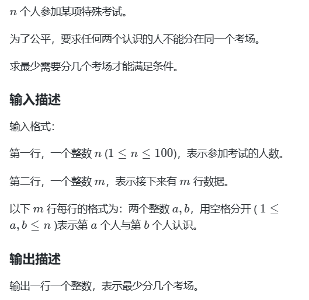

题目思路：


题目代码：

```
#include "bits/stdc++.h"

using namespace std;
int room[101][101], mp[101][101];
int n, ans, m;

void dfs(int step, int k) {
    if (k >= ans) return;
    if (step > n) {
        ans = k;
        return;
    }
    for (int i = 1; i <= k; i++) {
        int t = 0;
        while (room[i][t] && mp[step][room[i][t]] == 0)
            t++;
        if (room[i][t] == 0) {
            room[i][t] = step;
            dfs(step + 1, k);
            room[i][t] = 0;
        }
    }
    room[k + 1][0] = step;
    dfs(step + 1, k+1);
    room[k + 1][0] = 0;
}

int main() {
    cin >> n >> m;
    ans = n;
    for (int i = 0; i < m; i++) {
        int x, y;
        cin >> x >> y;
        mp[x][y] = 1;
        mp[y][x] = 1;
    }
    dfs(1, 1);
    cout << ans;
    return 0;
}
```

### 题目来源：蓝桥杯-2017省赛-小朋友崇拜圈

题目描述：

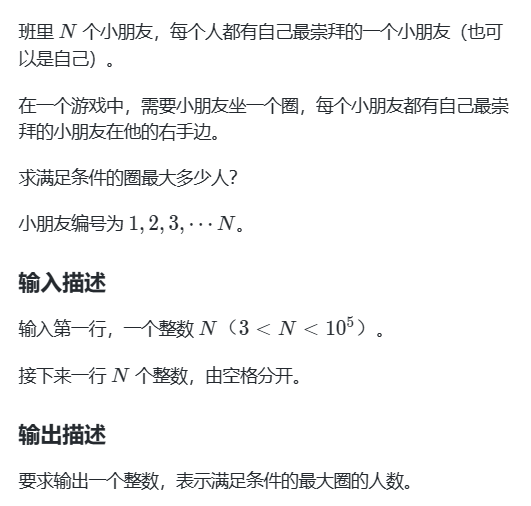

题目思路：


题目代码：

```
#include <iostream>
using namespace std;
int a[2000000];
int vis[2000000];
int m, N, t;
void dfs(int x, int ans){
  if(vis[x]){
      if(a[x] == a[t]){
          if(ans > m){
              m = ans;
          }
      }
    return;
  }
      vis[x] = 1;
      dfs(a[x], ans + 1);
      vis[x] = 0;
}
int main()
{
   cin>>N;
   for(int i = 1; i <= N; i++){
     cin>>a[i];
   }
   for(int i = 1; i <= N; i++){
           t = i;
        dfs(i, 0);
  }
  cout<<m;
  return 0;
}
```

## No.3 矩阵格子搜索

### 题目来源：蓝桥杯-2023省赛模拟-最大连通

题目描述：  
 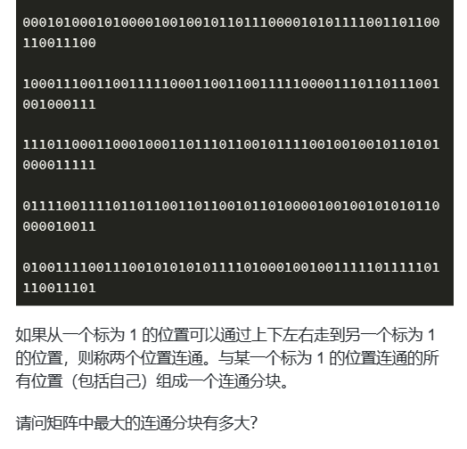

题目思路：

> 搜索计数

题目代码：

```
#include <iostream>
using namespace std;

char a[100][100];
int ans;
int d[4][2] = {{0, 1}, {1, 0}, {0, -1}, {-1, 0}};

int dfs(int x, int y) {
    if (a[x][y] == '0') return 0;
    int cnt = 1;
    a[x][y] = '0';
    for (int i = 0; i < 4; ++i) {
        int tx = x + d[i][0];
        int ty = y + d[i][1];
        if (tx <= 0 || ty <= 0 || tx > 30 || ty > 60) continue;
        cnt += dfs(tx, ty);
    }
    return cnt;
}

int main() {
    for (int i = 1; i <= 30; ++i) {
        for (int j = 1; j <= 60; ++j) {
            cin >> a[i][j];
        }
    }
    for (int i = 1; i <= 30; ++i) {
        for (int j = 1; j <= 60; ++j) {
            if (a[i][j] == '1') {
                ans = max(ans, dfs(i, j));
            }
        }
    }
    cout << ans;

    return 0;
}
```

### 题目来源：蓝桥杯-2017省赛-全球变暖

题目描述：

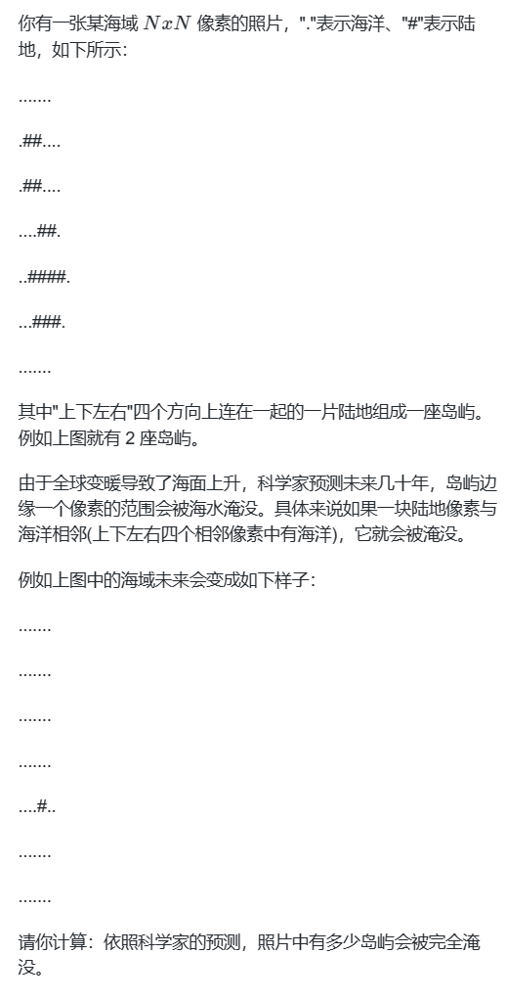

题目思路：


题目代码：

```
#include<bits/stdc++.h>
using namespace std;
int N;
const int SIZE = 1e4+4; 
char area[SIZE][SIZE];
bool flag;
int cnt; 
int d[4][2]={
    {1,0},
    {-1,0},
    {0,1},
    {0,-1}
};
//注意：求的是被淹没的岛屿的数量   总岛屿数量-被淹没的岛屿的数量 
int ans=0;//没有被淹没岛屿的数量 
int res_ans=0;//岛屿的总数量 
//用DFS判断搜到的这个岛屿会不会被淹没，仅此而已，不需要返回什么 昨判断关系
void dfs(int x,int y)
{
    if(flag==false){ //一个岛屿只要有一个点满足就不会变淹没了
        cnt = 0;
    for(int i=0; i<4; i++){
        int tx=d[i][0]+x;
        int ty=d[i][1]+y;
        if(area[tx][ty]!='.')
        cnt++;
    }
    if(cnt==4){//有一个点满足不会被淹没的条件
        ans++;
        flag=true;//这个岛屿不需要再遍历了
         }
    }
    area[x][y]='*';//将遍历过的点变为 *，下一次就不会遍历他了，所以不用标记数组
    //注意这里不可以是‘.’因为上面if(area[tx][ty]!='.')cnt++
     for(int i=0;i<4;i++){
         int xx = x + d[i][0];
         int yy = y + d[i][1];
         if(area[xx][yy]=='#'&&x<N&&x>=0&&y<N&&y>=0)
         dfs(xx,yy);
    }
}
 
int main()
{    
     cin>>N; 
    for(int i=0; i<N; i++)
        for(int j=0; j<N; j++)
            cin>>area[i][j];
            
    for(int i=0; i<N; i++){ 
        for(int j=0; j<N; j++){
            if(area[i][j]=='#'){
                res_ans++;
                flag=false;
                dfs(i,j);
            }
        }
    }        
    cout<<res_ans-ans;    
    return 0;
}
```

### 题目来源：蓝桥杯-2013省赛-剪格子

题目描述：

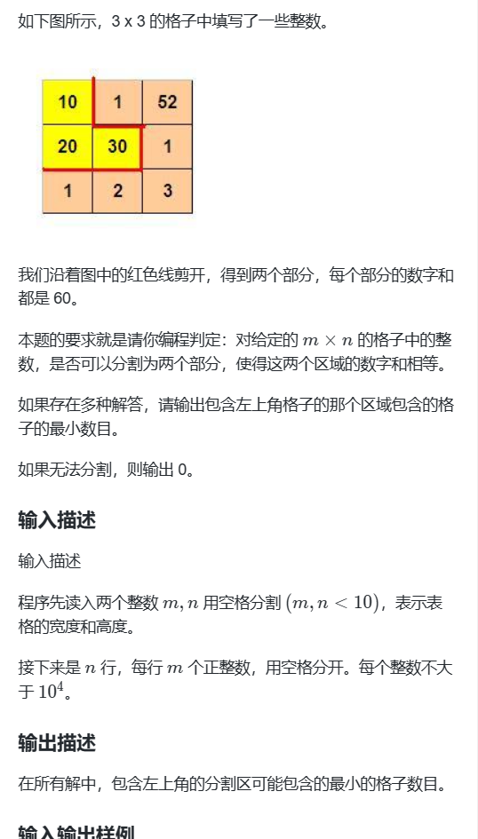

题目思路：


题目代码：

```
#include<bits/stdc++.h>
using namespace std;
int m,n;
int a[11][11];
int vis[11][11];
int sum=0,sum2=0;
int minn=1e5;
int d[4][2] = { {1,0},{0,-1},{0,1},{-1,0} };//4个方向
void dfs(int x,int y,int step){
    if(x<1||y<1||x>n||y>m) return ;
    if(sum2>sum/2) return ;
    if(step>minn) return ;
    if(sum2==sum/2){
       minn=min(minn,step); 
       return ;        
    } 
    vis[x][y]=1;
    //cout<<sum2<<endl;
    for(int i=0;i<4;i++){
        int tx=x+d[i][0], ty=y+d[i][1];
        if(!vis[tx][ty]){
            vis[tx][ty]=1;
            sum2+=a[tx][ty];            
            dfs(tx,ty,step+1);
            vis[tx][ty]=0;
            sum2-=a[tx][ty];
        }
    }
}
int main(){
    cin>>m>>n;
    for(int i=1;i<=n;i++)
       for(int j=1;j<=m;j++){
          cin>>a[i][j];
          sum+=a[i][j];           
       }
       sum2=a[1][1];
    dfs(1,1,1);
    cout<<minn<<endl;
    return 0;
}
```

### 题目来源：蓝桥杯-2018省赛-字母阵列

题目描述：  
 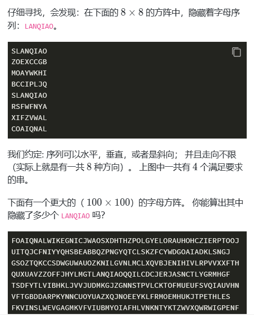

题目思路：


题目代码：

```
#include <iostream>
using namespace std;

char map[110][110];
int dx[]={1,0,-1,0,1,-1,1,-1},dy[]={0,1,0,-1,1,-1,-1,1};//方向
int res;
char q[]="LANQIAO";//用于对比

void dfs(int x, int y)
{

  for(int i=0;i<8;i++)//八个方向循环搜索
    {
        int cnt=0;
        int newx=x+dx[i];
        int newy=y+dy[i];
        for(int j=1;j<=6;j++)//与q数组对应
        {
          if(newx>=0 && newx<100 && newy>=0 && newy<100 && map[newx][newy]==q[j])//边界问题
            cnt++;

          newx=newx+dx[i];
          newy=newy+dy[i];
        }
        if(cnt==6)  res++;//与q[]完美对应，答案+1
    }
}

int main()
{
  for(int i=0;i<100;i++)  scanf("%s",&map[i]);
  for(int i=0;i<100;i++)
    for(int j=0;j<100;j++)
      if(map[i][j]=='L')  dfs(i,j);
  //cout<<res;
  cout<<"41";
  return 0;
}
```

### 题目来源：蓝桥杯-第十四届模拟-最大连通

题目描述：  
 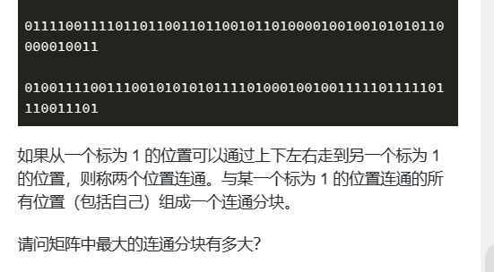

题目思路：


题目代码：

```
#include <iostream>
using namespace std;
char a[35][65];//千万注意，这题是字符型，我一开始用整形，全是0
int b[35][65]={0};
int num=0;
int xy[4][2]={{1,0},{-1,0},{0,1},{0,-1}};
void dfs(int x,int y)
{
  if(x<1||x>30||y<1||y>60||a[x][y]=='0'||b[x][y]==1)//不符合标准的就返回
    return ;
  b[x][y]=1;//判定用的，看这个位置是否被搜索过，搜过就置1
  num++;//深度搜索周边所有为1的位置时+1，记录本次搜索的连通量
  for(int i=0;i<4;i++)
  {
    int tx=x+xy[i][0];//进行偏移量转化
    int ty=y+xy[i][1];
    if(tx>=1&&tx<=30&ty>=1&&ty<=60&&a[tx][ty]=='1'&&b[tx][ty]==0)//偏移量满足条件的
      dfs(tx,ty);                                                                                                  //继续搜索；
  }
}

int main()
{
  int res=0;
  for(int i=1;i<=30;i++)
  {
    for(int j=1;j<=60;j++)
    {
      cin>>a[i][j];
    }
  }
   for(int i=1;i<=30;i++)
  {
    for(int j=1;j<=60;j++)
    {
      num=0;      //连通量初始化
      dfs(i,j);        //对这个位置进行搜索
      res=max(num,res);//记录最大值
    }
  }
 // cout<<res;//直接输出就是不对，索性148
    cout<<148;
  // 请在此输入您的代码
  return 0;
}
```

### 题目来源：蓝桥杯-第七届-剪邮票

题目描述：  
 [转自这里：剪邮票的题解](http://t.csdn.cn/2p52M)  
 题目思路：

题目代码：

### 题目来源：蓝桥杯-第八届-方格分割

题目描述：  
 [转自这里：方格分割的题解](http://t.csdn.cn/Qxg0I)  
 题目思路：

题目代码：

### 题目来源：蓝桥杯-第十届-拼接

题目描述：  
 [转自这里：拼接的题解](http://t.csdn.cn/2JNkK)

题目思路：

题目代码：

### 题目来源：蓝桥杯-第十届-路径计数

题目描述：  
 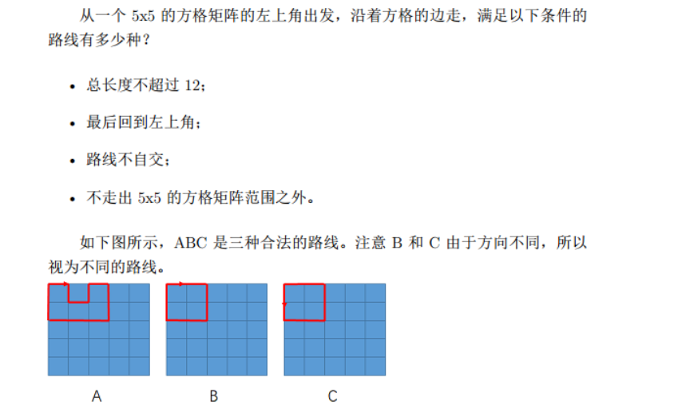

题目思路：

题目代码：

```
#include <iostream>
using namespace std;

int ans, step;
bool st[10][10];

int dx[4] = {-1, 0, 1, 0};
int dy[4] = {0, 1, 0, -1};

void dfs(int x, int y, int step)
{
	if(step > 12) return;
	
	if(x == 1 && y == 1 && st[x][y] && step > 2)
	{
		ans ++;
		return;
	}
	
	for (int i = 0; i < 4; i ++)
	{
		int a = x + dx[i], b = y + dy[i];
		if(a < 1 || a > 6 || b < 1 || b > 6 || st[a][b]) continue;
		
		st[a][b] = true;
		dfs(a, b, step + 1);
		st[a][b] = false;
	}
}

int main()
{
	dfs(1, 1, 0);	
	cout << ans << endl;
	return 0;
}
```

### 题目来源：蓝桥杯-第十四届模拟-第三期 最长滑行

题目描述：  
 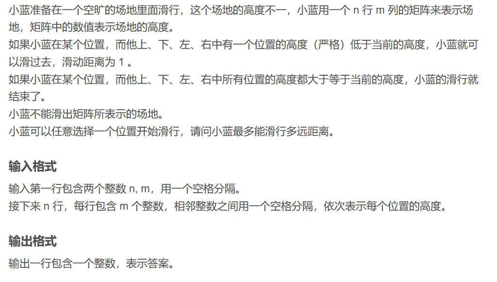

题目思路：

> 记忆化搜搜；；后面有时间的话看看这篇文章：https://blog.csdn.net/lady\_killer9/article/details/108539937

题目代码：

```
#include <bits/stdc++.h>
using namespace std;

const int N = 105;

int a[N][N];
int mp[N][N];
int m, n;

int dx[4] = {1, 0, -1, 0};
int dy[4] = {0, -1, 0, 1};

int dfs(int i, int j) {
     //因为会形成环，所以遇到已经整过的，直接返回数值
    if (mp[i][j] != -1) return mp[i][j];
    int ret = 0;
    for (int k = 0; k < 4; k ++) {
        int x = i + dx[k];
        int y = j + dy[k];
        if (x < 0 || x >= m || y < 0 || y >= n || a[x][y] >= a[i][j]) {
            continue;
        }
        ret = max(ret, dfs(x, y));
    }
    mp[i][j]=ret+1;
    return mp[i][j];
}


int main() {
    memset(mp, -1, sizeof(mp));
    cin >> m >> n;
    for (int i = 0; i < m; i ++) {
        for (int j = 0; j < n; j ++) {
            cin >> a[i][j];
        }
    }
    int ans = 0;
    for (int i = 0; i < m; i ++) {
        for (int j = 0; j < n; j ++) {
            ans = max(ans, dfs(i, j));
        }
    }
    cout << ans<< endl;
    return 0;
}
```

### 题目来源：蓝桥杯-2022省赛模拟-X图形

题目描述：  
 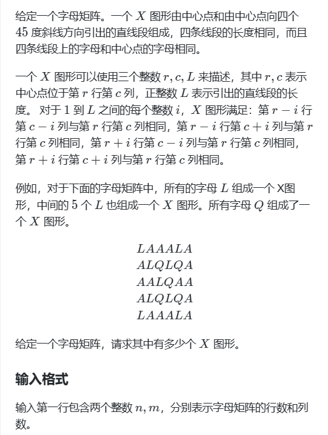

题目思路：


题目代码：

```
#include <iostream>
using namespace std;
char a[100][100];
int n, m;
int a1, a2, a3, a4;
bool check(int x, int y)
{
    if (x >= 0 && x < n && y >= 0 && y < m)return true;
    else return false;
}
void zs(int x, int y, char s)
{
    if (a[x - 1][y - 1] == s && check(x - 1, y - 1))
    {
        a1++;
       zs(x - 1, y - 1, s);
    }
   
}
void zx(int x, int y, char s)
{
    if (a[x + 1][y - 1] == s && check(x + 1, y - 1))
    {
        a2++;
        zx(x + 1, y - 1, s);
    }
}
void ys(int x, int y, char s)
{
    if (a[x - 1][y + 1] == s && check(x - 1, y + 1))
    {
        a3++;
        ys(x - 1, y + 1, s);
    }
   
}
void yx(int x, int y, char s)
{
    if (a[x + 1][y + 1] == s && check(x + 1, y + 1))
    {
        a4++;
        yx(x + 1, y + 1, s);
    }
  
}
int main()
{
    cin >> n >> m;
    
    for (int i = 0;i < n;++i)
    {
        for (int j = 0;j < m;++j)
        {
            cin >> a[i][j];
        }
    }
    int sum = 0;
    for (int i = 1;i < n - 1;++i)
    {
        for (int j = 1;j < m - 1;++j)
        {
            a1 = 0, a2 = 0, a3 = 0, a4 = 0;
            zs(i, j, a[i][j]);
            zx(i, j, a[i][j]);
            ys(i, j, a[i][j]);
            yx(i, j, a[i][j]);
            
            if ( a1!= 0 &&a2 != 0 &&a3  != 0 && a4 != 0)
            {
                sum =sum+ min(min(a1, a2), min(a3, a4));
               
            }
        }
    }
    cout << sum;
    return 0;
}
```

### 题目来源：蓝桥杯-2016省赛-路径之谜

题目描述：  
 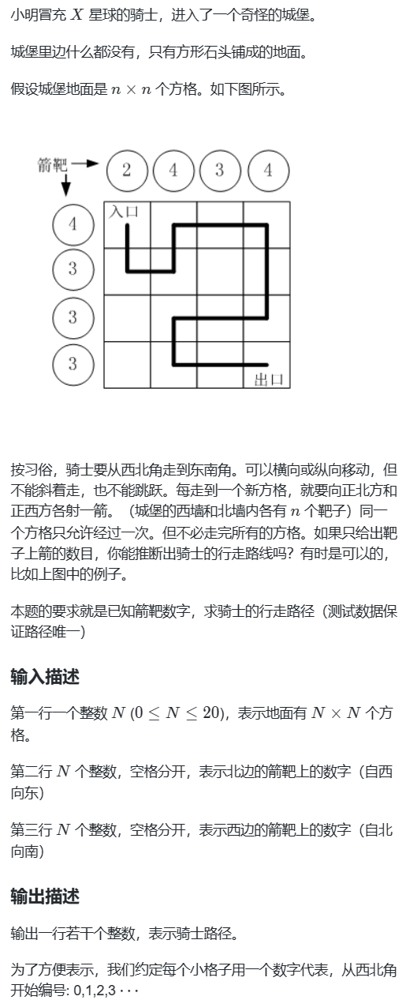

题目思路：


题目代码：

```
#include <bits/stdc++.h>
using namespace std;
typedef long long LL; 
int n, k1, k2, num, flag, a[25], b[25], vis[25][25], s[600];
const int v[4][2] = {0, 1, 0, -1, 1, 0, -1, 0}; 
//必须从右边开始找，因为答案可能有多种，输出最小编号序的答案;
void dfs(int x, int y, int k)    //常规dfs搜索模板;
{
    if(x < 1 || y < 1 || x > n || y > n) return ;    //判断越界;
    if(b[x] < 0 || a[y] < 0 || flag == 1) return ;    //不符合题意或找到答案了就返回;
    s[k] = (x-1)*n + (y-1);      //记录路径，(编号可用坐标表示为i*m+j，m为列数);
    if(x == n && y == n && k1 == 1 && k2 == 1)    //找到答案就返回;
    {
        flag = 1;
        num = k;    
        return ;
    }
    for(int i = 0; i < 4; i++)    //查找右左下上;
    {
        int xx = x + v[i][0]; 
        int yy = y + v[i][1];
        if(vis[xx][yy] == 1) continue;    //该点走过，跳过;
        b[xx]--;
        a[yy]--;
        k1--;
        k2--;
        vis[xx][yy] = 1;
        dfs(xx, yy, k+1);
        b[xx]++;                      //回溯，还原值;
        a[yy]++;
        k1++;
        k2++;
        vis[xx][yy] = 0;
    }
}
int main()
{
    cin >> n;
    for(int i = 1; i <= n; i++) 
    {
        cin >> a[i];
        k1 += a[i];          //记录每列可走的总数;
    }
    for(int i = 1; i <= n; i++) 
    {
        cin >> b[i];
        k2 += b[i];         //记录每行可走的总数;
    }
    flag = 0;
    vis[1][1] = 1;
    dfs(1, 1, 1);
    for(int i = 1; i <= num; i++)   //从头遍历一遍，输出编号;
        cout << s[i] << " "; 
    return 0;
}
```

### 题目来源：蓝桥杯-2017省赛-迷宫

题目描述：  
 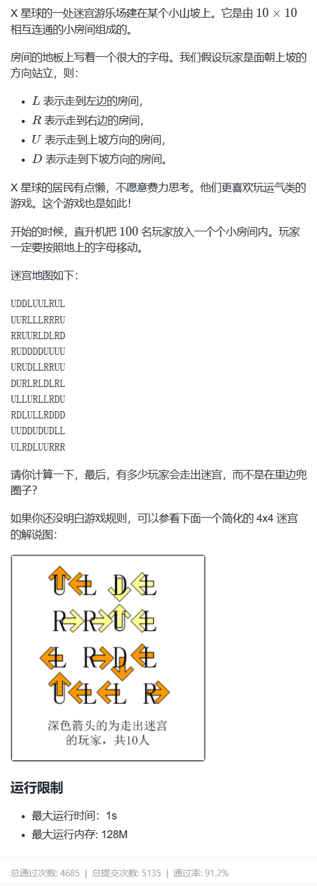

题目思路：


题目代码：

```
#include<bits/stdc++.h>
using namespace std;
//typedef long long LL;
//const int N = 100010;
char mp[15][15]; //地图存放 
bool vis[15][15];//判断该路是否走过 
int cnt = 0;     //记录走出人数 
void dfs(int x, int y){//从(x,y)点出发的人 
    if(x<1 || x>10 || y < 1 || y > 10){ //如果超出范围，则走出 
        cnt=cnt+1;//走出的人数加一 
        return;
    }
    
    if(vis[x][y]) return;//如果该点走过则返回，用以判断是否绕圈 
    vis[x][y] = 1;       //没走过则标记走过 
    
    if(mp[x][y] == 'U'){
        int dx = x - 1;
        int dy = y;
        dfs(dx,dy);
    }else if(mp[x][y] == 'D'){
        int dx = x + 1;
        int dy = y;
        dfs(dx,dy);
    }else if(mp[x][y] == 'L'){
        int dx = x;
        int dy = y - 1;
        dfs(dx,dy);
    }else if(mp[x][y] == 'R'){
        int dx = x;
        int dy = y + 1;
        dfs(dx,dy);
    }
}

int main(){
    for(int i = 1; i <= 10; i++){
        for(int j = 1; j <= 10; j++){
            cin >> mp[i][j];
        }
    }
    for(int i = 1; i <= 10; i++){
        for(int j = 1; j <= 10; j++){
            dfs(i,j); //枚举每个点作为起点 
            memset(vis,0,sizeof vis);//换起点时初始化vis数组 
        }
    }
    cout << cnt;
    return 0;
}
```

## No.4 V[N]版本DFS搜索统计连通分量个数模板

### 题目来源：LeetCode-200. 岛屿数量

题目描述：  
 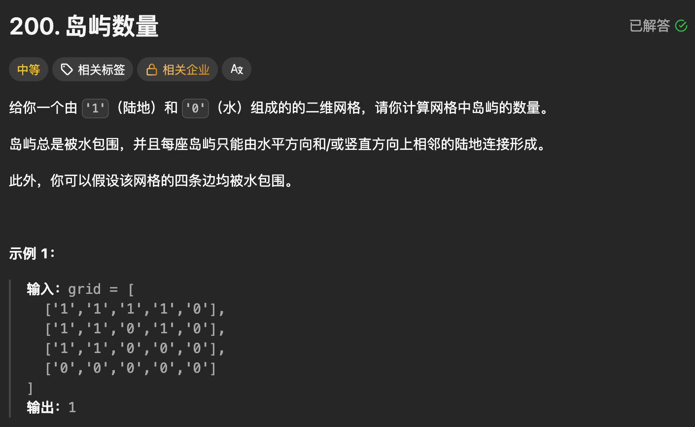

题目思路：


题目代码：

```
class Solution {
public:
    int dirs[4][2] = {{-1, 0}, {1, 0}, {0, 1}, {0, -1}};
    int n = 0;
    int m = 0;

    void dfs(const vector<vector<char>>& grid, int ii, int jj, vector<vector<bool>>& vis_grid) {
        vis_grid[ii][jj] = true;

        for(int k = 0; k < 4; k++){
            int now_x = ii + dirs[k][0];
            int now_y = jj + dirs[k][1];
            if(now_x >= 0 && now_x < n && now_y >=0 && now_y < m){
                if(grid[now_x][now_y] == '1' && !vis_grid[now_x][now_y]){
                    dfs(grid, now_x, now_y, vis_grid);
                }
            }
        }
    }

    int numIslands(vector<vector<char>>& grid) {
        if (grid.empty()) return 0; // 处理空网格的特殊情况
        n = grid.size();
        m = grid[0].size();
        int cnt = 0;

        vector<vector<bool>> vis_grid(n, vector<bool>(m, false));

        for (int i = 0; i < n; i++) {
            for (int j = 0; j < m; j++) {
                if (grid[i][j] == '1' && !vis_grid[i][j]) {
                    cnt++;
                    dfs(grid, i, j, vis_grid);
                }
            }
        }
        return cnt;
    }
};


class Solution {
public:
    void dfs(const vector<vector<char>>& grid, int ii, int jj, vector<vector<bool>>& vis_grid) {
        vis_grid[ii][jj] = true;

        // 处理上下左右，修正判断条件
        if ((ii - 1) >= 0 && !vis_grid[ii - 1][jj] && grid[ii - 1][jj] == '1') {
            dfs(grid, ii - 1, jj, vis_grid);
        }
        if ((ii + 1) < grid.size() && !vis_grid[ii + 1][jj] && grid[ii + 1][jj] == '1') {
            dfs(grid, ii + 1, jj, vis_grid);
        }
        if ((jj - 1) >= 0 && !vis_grid[ii][jj - 1] && grid[ii][jj - 1] == '1') {
            dfs(grid, ii, jj - 1, vis_grid);
        }
        if ((jj + 1) < grid[0].size() && !vis_grid[ii][jj + 1] && grid[ii][jj + 1] == '1') {
            dfs(grid, ii, jj + 1, vis_grid);
        }
    }

    int numIslands(vector<vector<char>>& grid) {
        if (grid.empty()) return 0; // 处理空网格的特殊情况
        int n = grid.size();
        int m = grid[0].size();
        int cnt = 0;

        vector<vector<bool>> vis_grid(n, vector<bool>(m, false));

        for (int i = 0; i < n; i++) {
            for (int j = 0; j < m; j++) {
                if (grid[i][j] == '1' && !vis_grid[i][j]) {
                    cnt++;
                    dfs(grid, i, j, vis_grid);
                }
            }
        }
        return cnt;
    }
};
```

### 题目来源：LeetCode-695. 岛屿的最大面积

题目描述：  
 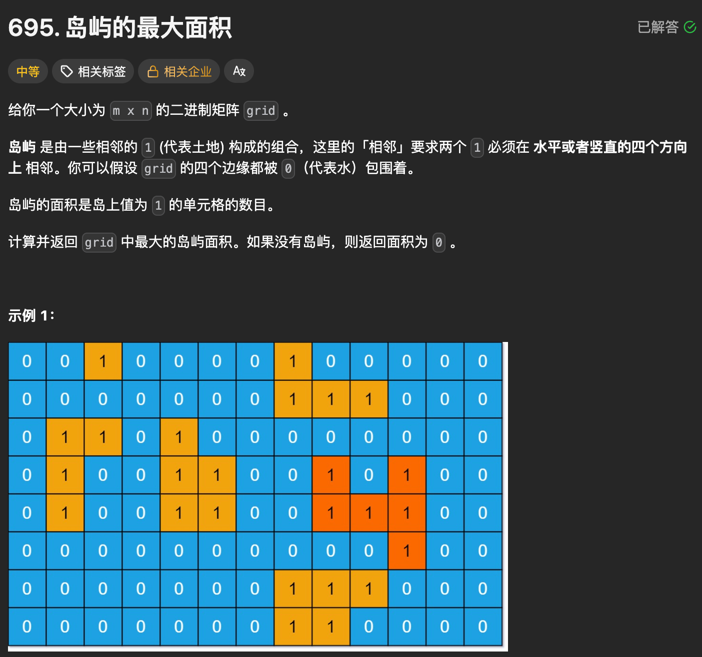

题目思路：


题目代码：

```
class Solution {
public:
    int dirs[4][2] = {{1,0}, {-1, 0}, {0, 1}, {0, -1}};
    int n = 0;
    int m = 0;
    int dfs(const vector<vector<int>>& grid, int ii, int jj, vector<vector<bool>>& vis_grid) {
        vis_grid[ii][jj] = true;

        int local_area = 1;
        for(int k = 0; k < 4; k++){
            int now_x = ii + dirs[k][0];
            int now_y = jj + dirs[k][1];
            if(now_x >= 0 && now_x < n && now_y >= 0 && now_y < m){
                if(grid[now_x][now_y] == 1 && !vis_grid[now_x][now_y]){
                    local_area += dfs(grid, now_x, now_y, vis_grid);
                }
            }
        }
        return local_area;
    }

    int maxAreaOfIsland(vector<vector<int>>& grid) {
        if (grid.empty()) return 0; // 处理空网格的特殊情况
        n = grid.size();
        m = grid[0].size();
        int maxx = 0;
        int curr = 0;

        vector<vector<bool>> vis_grid(n, vector<bool>(m, false));

        for (int i = 0; i < n; i++) {
            for (int j = 0; j < m; j++) {
                if (grid[i][j] == 1 && !vis_grid[i][j]) {
                    
                    curr = dfs(grid, i, j, vis_grid);

                    maxx = max(maxx, curr);
                }
            }
        }
        return maxx;
    }
};


class Solution {
public:
    int dfs(const vector<vector<int>>& grid, int ii, int jj, vector<vector<bool>>& vis_grid) {
        vis_grid[ii][jj] = true;
        int ss = 0, xx = 0, zz = 0, yy = 0;
        // 处理上下左右，修正判断条件
        if ((ii - 1) >= 0 && !vis_grid[ii - 1][jj] && grid[ii - 1][jj] == 1) {
            ss = dfs(grid, ii - 1, jj, vis_grid);
        }
        if ((ii + 1) < grid.size() && !vis_grid[ii + 1][jj] && grid[ii + 1][jj] == 1) {
            xx = dfs(grid, ii + 1, jj, vis_grid);
        }
        if ((jj - 1) >= 0 && !vis_grid[ii][jj - 1] && grid[ii][jj - 1] == 1) {
            zz = dfs(grid, ii, jj - 1, vis_grid);
        }
        if ((jj + 1) < grid[0].size() && !vis_grid[ii][jj + 1] && grid[ii][jj + 1] == 1) {
            yy = dfs(grid, ii, jj + 1, vis_grid);
        }
        return ss + xx + zz + yy + 1;
    }

    int maxAreaOfIsland(vector<vector<int>>& grid) {
        if (grid.empty()) return 0; // 处理空网格的特殊情况
        int n = grid.size();
        int m = grid[0].size();
        int maxx = 0;
        int curr = 0;

        vector<vector<bool>> vis_grid(n, vector<bool>(m, false));

        for (int i = 0; i < n; i++) {
            for (int j = 0; j < m; j++) {
                if (grid[i][j] == 1 && !vis_grid[i][j]) {
                    
                    curr = dfs(grid, i, j, vis_grid);

                    maxx = max(maxx, curr);
                }
            }
        }
        return maxx;
    }
};
```

### 题目来源：LeetCode-3619. 总价值可以被 K 整除的岛屿数目

题目描述：  
 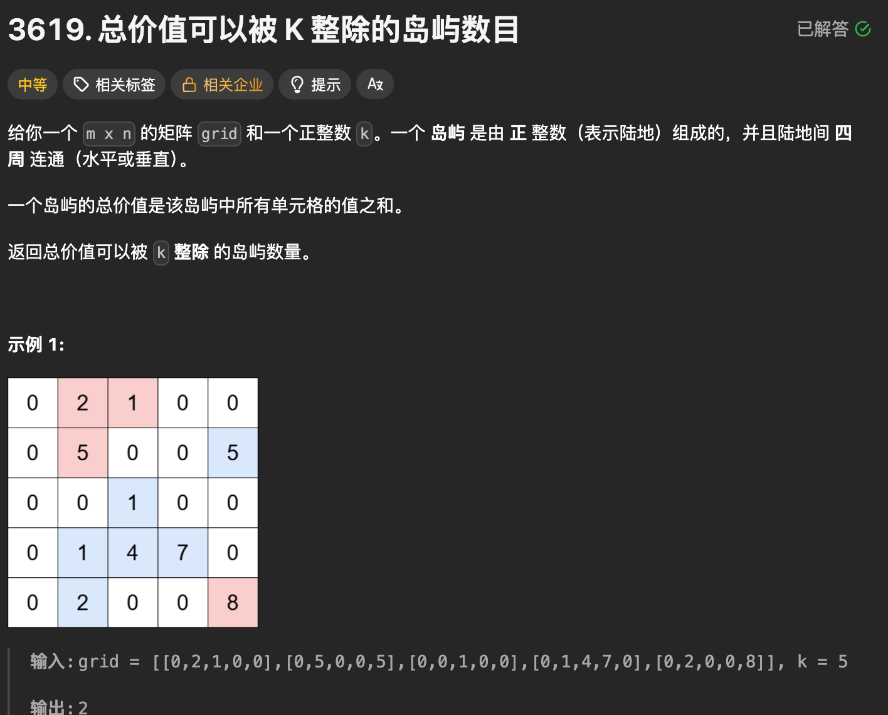

题目思路：


题目代码：

```
class Solution {
public:
    int dirs[4][2] = {{1,0}, {-1, 0}, {0, 1}, {0, -1}};
    int n = 0;
    int m = 0;
    size_t dfs(const vector<vector<int>>& grid, int ii, int jj, vector<vector<bool>>& vis_grid) {
        vis_grid[ii][jj] = true;

        size_t local_val = grid[ii][jj];
        for(int k = 0; k < 4; k++){
            int now_x = ii + dirs[k][0];
            int now_y = jj + dirs[k][1];
            if(now_x >= 0 && now_x < n && now_y >= 0 && now_y < m){
                if(grid[now_x][now_y] >= 1 && !vis_grid[now_x][now_y]){
                    local_val += dfs(grid, now_x, now_y, vis_grid);
                }
            }
        }
        return local_val;
    }

    int countIslands(vector<vector<int>>& grid, int k) {
        if (grid.empty()) return 0; // 处理空网格的特殊情况
        n = grid.size();
        m = grid[0].size();
        int maxx = 0;
        size_t curr = 0;

        vector<vector<bool>> vis_grid(n, vector<bool>(m, false));

        for (int i = 0; i < n; i++) {
            for (int j = 0; j < m; j++) {
                if (grid[i][j] >= 1 && !vis_grid[i][j]) {
                    
                    curr = dfs(grid, i, j, vis_grid);
                    if(curr % k == 0)maxx++;
                    // maxx = max(maxx, curr);
                }
            }
        }
        return maxx;
    }
};


class Solution {
public:
    size_t dfs(const vector<vector<int>>& grid, int ii, int jj, vector<vector<bool>>& vis_grid) {
        vis_grid[ii][jj] = true;
        size_t ss = 0, xx = 0, zz = 0, yy = 0;
        // 处理上下左右，修正判断条件
        if ((ii - 1) >= 0 && !vis_grid[ii - 1][jj] && grid[ii - 1][jj] >= 1) {
            ss = dfs(grid, ii - 1, jj, vis_grid);
        }
        if ((ii + 1) < grid.size() && !vis_grid[ii + 1][jj] && grid[ii + 1][jj] >= 1) {
            xx = dfs(grid, ii + 1, jj, vis_grid);
        }
        if ((jj - 1) >= 0 && !vis_grid[ii][jj - 1] && grid[ii][jj - 1] >= 1) {
            zz = dfs(grid, ii, jj - 1, vis_grid);
        }
        if ((jj + 1) < grid[0].size() && !vis_grid[ii][jj + 1] && grid[ii][jj + 1] >= 1) {
            yy = dfs(grid, ii, jj + 1, vis_grid);
        }

         // 要加上本身 1 
        return ss + xx + zz + yy + grid[ii][jj];
    }

    int countIslands(vector<vector<int>>& grid, int k) {
        if (grid.empty()) return 0; // 处理空网格的特殊情况
        int n = grid.size();
        int m = grid[0].size();
        int maxx = 0;
        size_t curr = 0;

        vector<vector<bool>> vis_grid(n, vector<bool>(m, false));

        for (int i = 0; i < n; i++) {
            for (int j = 0; j < m; j++) {
                if (grid[i][j] >= 1 && !vis_grid[i][j]) {
                    
                    curr = dfs(grid, i, j, vis_grid);
                    if(curr % k == 0)maxx++;
                    // maxx = max(maxx, curr);
                }
            }
        }
        return maxx;
    }
};
```

### 题目来源：LeetCode-463. 岛屿的周长

题目描述：

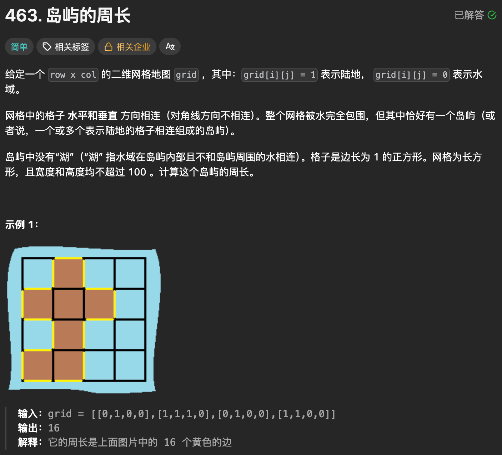

题目思路：


题目代码：

```
class Solution {
public:
    int islandPerimeter(vector<vector<int>>& grid) {
        //对于每一个陆地，都判断其上下左右是否有，如果没有，则自己的那边就为界限的边长

        int res=0;
        int n=grid.size();
        int m=grid[0].size();
        for(int i=0;i<n;i++){
            for(int j=0;j<m;j++){
                if(grid[i][j]==1){
                    if(i-1<0||grid[i-1][j]==0)res++;
                    if(i+1>=n||grid[i+1][j]==0)res++;

                    if(j-1<0||grid[i][j-1]==0)res++;
                    if(j+1>=m||grid[i][j+1]==0)res++;

                }
            }
        }

        return res;

    }
};
```

### 题目来源：LeetCode-733. 图像渲染

题目描述：  
 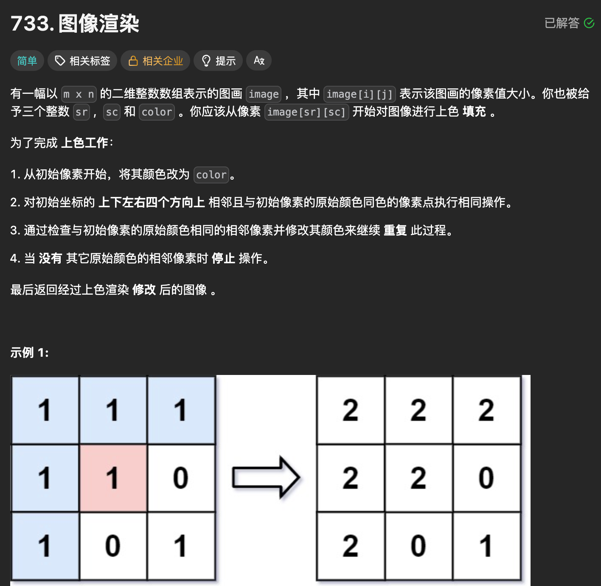

题目思路：


题目代码：

```
class Solution {
public:
    int dirs[4][2] = {{1,0}, {-1, 0}, {0, 1}, {0, -1}};
    int n = 0;
    int m = 0;
    void dfs(vector<vector<int>>& image, int ii, int jj, vector<vector<bool>>& vis_image, int ori, int src) {
        // 先处理本次index
        if(image[ii][jj] != ori)return;
        if(image[ii][jj] == ori){
            image[ii][jj] = src;
        }
        vis_image[ii][jj] = true;

        for(int k = 0; k < 4; k++){
            int now_x = ii + dirs[k][0];
            int now_y = jj + dirs[k][1];
            if(now_x >= 0 && now_x < n && now_y >= 0 && now_y < m){
                if(image[now_x][now_y] == ori && !vis_image[now_x][now_y]){
                    dfs(image, now_x, now_y, vis_image, ori, src);
                }
            }
        }
    }

    vector<vector<int>> floodFill(vector<vector<int>>& image, int sr, int sc, int color) {
        if (image.empty()) return image; // 处理空网格的特殊情况
        n = image.size();
        m = image[0].size();
        int maxx = 0;
        size_t curr = 0;

        vector<vector<bool>> vis_image(n, vector<bool>(m, false));
        if(image[sr][sc] == color)return image;

        int ori = image[sr][sc];
        dfs(image, sr, sc, vis_image, ori, color);
        return image;
        // return maxx;
    }
};


class Solution {
public:
    void dfs(vector<vector<int>>& image, int ii, int jj, vector<vector<bool>>& vis_image, int ori, int src) {
        // 先处理本次index
        if(image[ii][jj] != ori)return;
        if(image[ii][jj] == ori){
            image[ii][jj] = src;
        }
        vis_image[ii][jj] = true;


        size_t ss = 0, xx = 0, zz = 0, yy = 0;
        // 处理上下左右，修正判断条件
        if ((ii - 1) >= 0 && !vis_image[ii - 1][jj] && image[ii - 1][jj] == ori) {
            dfs(image, ii - 1, jj, vis_image, ori, src);
        }
        if ((ii + 1) < image.size() && !vis_image[ii + 1][jj] && image[ii + 1][jj] == ori) {
            dfs(image, ii + 1, jj, vis_image, ori, src);
        }
        if ((jj - 1) >= 0 && !vis_image[ii][jj - 1] && image[ii][jj - 1] == ori) {
            dfs(image, ii, jj - 1, vis_image, ori, src);
        }
        if ((jj + 1) < image[0].size() && !vis_image[ii][jj + 1] && image[ii][jj + 1] == ori) {
            dfs(image, ii, jj + 1, vis_image, ori, src);
        }

         // 要加上本身 1 
        // return ss + xx + zz + yy + image[ii][jj];
    }

    vector<vector<int>> floodFill(vector<vector<int>>& image, int sr, int sc, int color) {
        if (image.empty()) return image; // 处理空网格的特殊情况
        int n = image.size();
        int m = image[0].size();
        int maxx = 0;
        size_t curr = 0;

        vector<vector<bool>> vis_image(n, vector<bool>(m, false));
        if(image[sr][sc] == color)return image;

        int ori = image[sr][sc];
        dfs(image, sr, sc, vis_image, ori, color);
        return image;
        // return maxx;
    }
};
```

### 题目来源：PTA-L2-013 红色警报

题目描述：  
 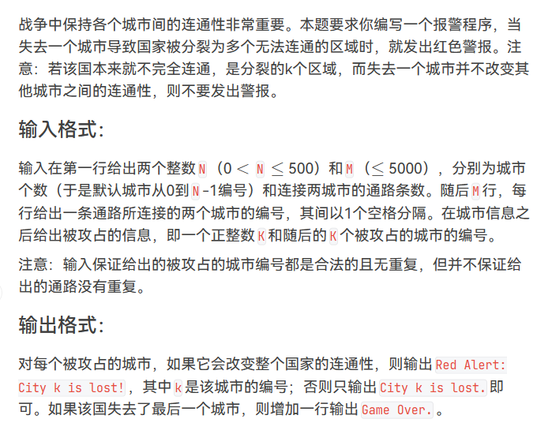

题目思路：

题目代码：

```
//这道题注意更新 sum=cur
//这次因为输出的字符串少了最后那个句号标点
#include<bits/stdc++.h>
using namespace std;
#define inf 0x3f3f3f3f
#define N 1001
int n,m,k,g,d;
int x,y,z;
vector<int>v[N];
int vis[N]={0};
void dfs(int index){
    vis[index]=1;
    for(int i=0;i<v[index].size();i++){
        if(vis[v[index][i]]==0){
            dfs(v[index][i]);
        }
    }
    
}
int cnt(){
    int count=0;
    for(int i=0;i<n;i++){
        if(vis[i]==0){
            count++;
            dfs(i);
        }
    }
    
    memset(vis,0,sizeof(vis));
    return count;
}
int main() {
    cin>>n>>m;
    for(int i=0;i<m;i++){
        cin>>x>>y;
        v[x].push_back(y);
        v[y].push_back(x);
    }
    int sum=cnt();
    cin>>k;
    vector<int>lost;
    while(k--){
        cin>>x;
        lost.push_back(x);
        for(int i=0;i<lost.size();i++){
            vis[lost[i]]=1;
        }
        int cur=cnt();//目前这个cur是不算lost的其它的连通分量，
        //连通区域越多，说明城市间越不连通，月危险
        if(cur>sum){
            cout<<"Red Alert: City "<<x<<" is lost!"<<endl;
        }else if(cur<=sum){
            // 这个是因为如果失去的那个是独立的，则cur会比一开始的-1；
            cout<<"City "<<x<<" is lost."<<endl;
        }
        sum=cur;
    }
    if(lost.size()==n){
        cout<<"Game Over."<<endl;
    }
	return 0;
}
```

### 题目来源：PTA-L2-025 分而治之

题目描述：  
 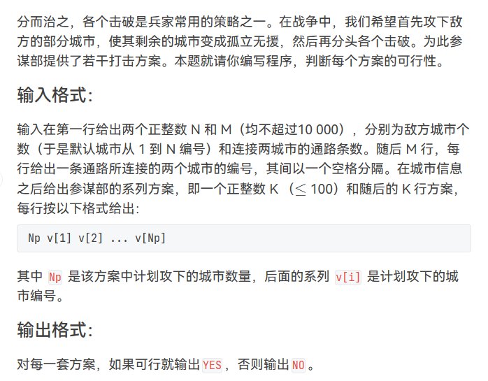

题目思路：

题目代码：

```
//        if(vis[v[index][i]]==0){


#include<bits/stdc++.h>
using namespace std;
#define inf 0x3f3f3f3f
#define N 100100
int n,m,k,g,d;
int x,y,z;
char ch;
string str;
vector<int>v[N];
int vis[N];

void dfs(int index){
    vis[index]=1;
    for(int i=0;i<v[index].size();i++){
        if(vis[v[index][i]]==0){
            dfs(v[index][i]);
        }
    }
}
int cnt(){
    int count=0;
    for(int i=1;i<=n;i++){
        if(vis[i]==0){
            count++;
            dfs(i);
        }
    }
    memset(vis,0,sizeof(vis));
    return count;
}
int main() {
    cin>>n>>m;
    for(int i=0;i<m;i++){
        cin>>x>>y;
        v[x].push_back(y);
        v[y].push_back(x);
    }
    
    cin>>k;
    while(k--){
        vector<int>lost;
        cin>>d;
        for(int i=0;i<d;i++){
            cin>>x;
            lost.push_back(x);
        }
        for(int i=0;i<lost.size();i++){
            vis[lost[i]]=1;
        }
        int cur=cnt();
        if(n==cur+d){
            cout<<"YES"<<endl;
        }else{
            cout<<"NO"<<endl;
        }
    }


	return 0;
}
```

### 题目来源：Acwing-4493-环形连通分量

题目描述：

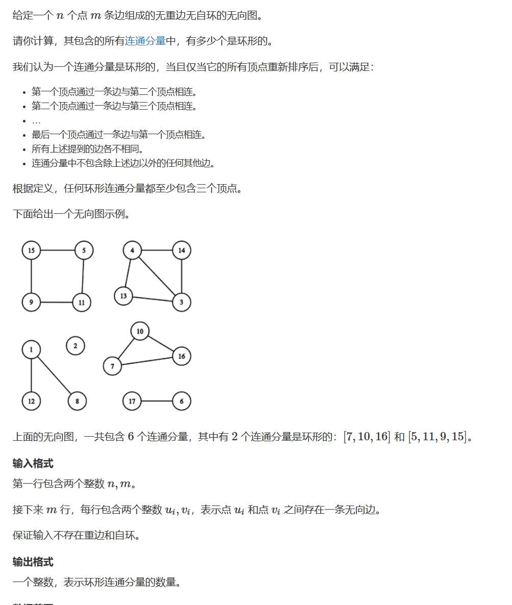

题目思路：

> 我们可以发现,一个联通分量中要使得满足环的要求  
>  那么每个典的度都需要是2,因此我们只需要统计度数  
>  然后再跑一遍基础课中 深度优先遍历图即可

题目代码：

```
vector<int> g[N];
int deg[N];

int st[N];
int n,m;

int flag ;

void dfs(int u){
    st[u] = 1;
    for(auto x : g[u]){
        if(!st[x]){
            if(deg[x]!=2)flag = 1;
            dfs(x);
        }
    }
}
void solve(){
    cin>>n>>m;

    for(int i=1;i<=m;i ++ ){
        int a,b;cin>>a>>b;
        g[a].pb(b);
        g[b].pb(a);
        deg[a] ++ ,deg[b]++;
    }

    int res =0  ;

    for(int i = 1;i <= n; i ++ ){
        if(st[i]) continue;
        if(deg[i]!=2) continue;
        flag = 0 ;

        dfs(i);
        if(flag) continue;


        ++res;
    }
    cout<<res<<endl;

}

int main(){
    //int t;cin>>t;while(t--)
    solve();
    return 0 ;
}
```

## No.5 V[N]版本DFS搜索根据条件判断正否模板：

### 题目来源：PTA-L2-016 愿天下有情人都是失散多年的兄妹

题目描述：  
 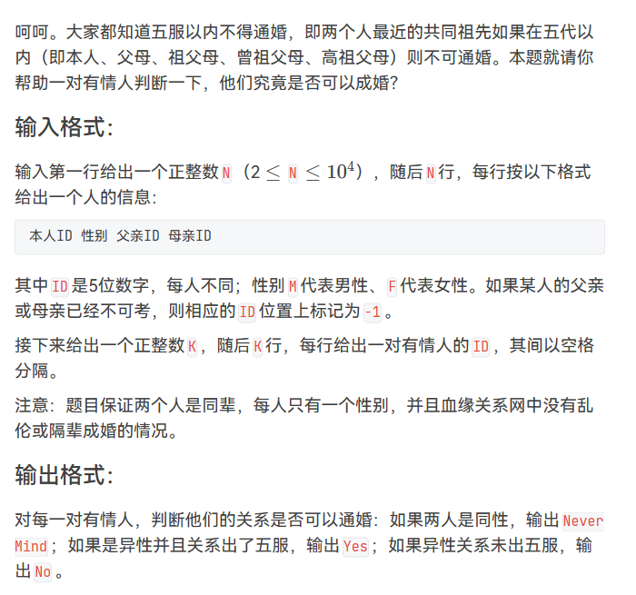

题目思路：

题目代码：

```
//共同祖先如果在五代以内（即本人、父母、祖父母、曾祖父母、高祖父母）则不可通婚
// 即dfs(x,1)  到4的时候就行了   if(dai>4){

#include<bits/stdc++.h>
using namespace std;
#define inf 0x3f3f3f3f
#define N 100100
int n,m,k,g,d;
int x,y,z;
vector<int>v[N];
int sex[N];
int flag=0;
int vis[N]={0};
void dfs(int index , int dai){
    if(dai>4){
        return;
    }
    for(int i=0;i<v[index].size();i++){
        if(vis[v[index][i]]==0){
            vis[v[index][i]]=1;
            dfs(v[index][i],dai+1);
        }else{
            flag=1;
        }
    }
}
int main() {
    cin>>n;
    int id,fa,ma ;
    char s;
    for(int i=0;i<n;i++){
        cin>>id>>s>>fa>>ma;
        sex[id]=s;
        if(fa!=-1){
            sex[fa]='M';
            v[id].push_back(fa);
        }
        if(ma!=-1){
            sex[ma]='F';
            v[id].push_back(ma);
        }
        
        
    }
    cin>>k;
    while(k--){
        cin>>x>>y;
        if(sex[x]==sex[y]){
            cout<<"Never Mind"<<endl;
        }else{
            //每次都要初始化一次。。。
            flag=0;
            memset(vis,0,sizeof(vis));
            vis[x]=vis[y]=1;
            
            bfs(x,1);
            bfs(y,1);
            if(flag==0){
                cout<<"Yes"<<endl;
            }else{
                cout<<"No"<<endl;
            }
            
        }
    }
	return 0;
}
```

### 题目来源：PTA-L2-030 冰岛人

题目描述：  
 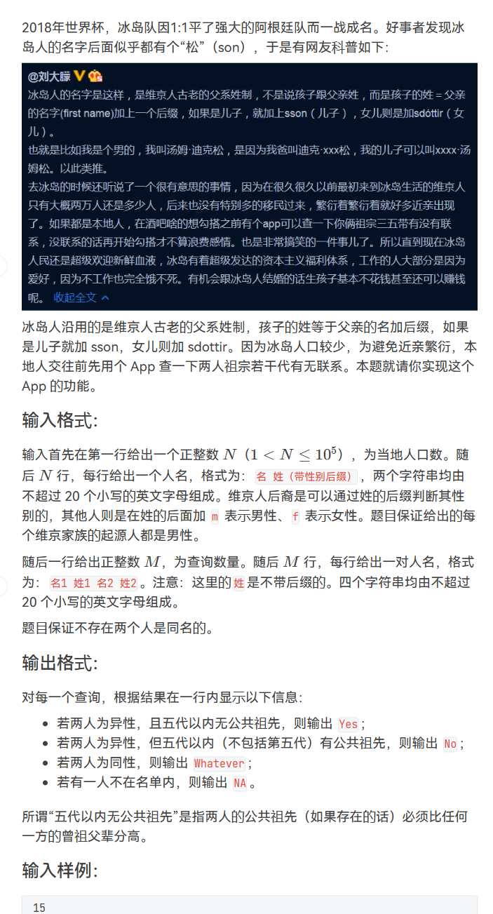

题目思路：

题目代码：

```
// 但五代以内（不包括第五代）有公共祖先
//第一点：五代以内，不包括第五代：表示 cong i=1 to i<5 ;
//所以分两种情况：在男方的五代以内出现了女方的祖先，or 在女方的五代以内出现了男方的祖先。
//注意问题：因为k次调用函数check 所以在函数内定义vis，，

//名用来区分人，姓用来区分男女和父类；；其他人则是在姓的后面加 m 表示男性、f 表示女性。
//对于N要进行适应性的更改，对于字段错误
#include<bits/stdc++.h>
using namespace std;
#define inf 0x3f3f3f3f
#define N 100100
int n,m,k,g,d;
int x,y,z;
char ch;
string str;
vector<int>v[N];
struct node{
    char sex;
    string father;
};
map<string , node>mp;
bool check(string a, string b){
    map<string , int>vis;
    for(int i=1; ; i++){
        vis[a]=i;
        a=mp[a].father;
        if(a.empty())break;
    }
    
    for(int i=1;  ;i++){
        //首先男方五代以内出现：
        if(vis[b]>0 && vis[b]<5)return false;
        //然后女方这边五代以内出现的话
        if(vis[b]>0 && i<5)return false;
        b=mp[b].father;
        if(b.empty())break;
    }
    return true;
}
int main() {
    cin>>n;
    string a,b;
    while(n--){
        cin>>a>>b;
        if(b.back()=='n'){
            mp[a].sex='m';
            mp[a].father=b.substr(0,b.size()-4);
        }else if(b.back()=='r'){
            mp[a].sex='f';
            mp[a].father=b.substr(0,b.size()-7);
        }else{
            mp[a].sex=b.back();
        }
    }
    
    string a1,b1;
    cin>>k;
    while(k--){
        cin>>a>>a1>>b>>b1;
        if(mp.find(a)==mp.end() || mp.find(b)==mp.end())cout<<"NA"<<endl;
        else if(mp[a].sex==mp[b].sex) cout<<"Whatever"<<endl;
        else {
            if(check(a,b))cout<<"Yes"<<endl;
            else cout<<"No"<<endl;
        }
    }
	return 0;
}
```

### 题目来源：PTA-L2-023 图着色问题

题目描述：  
 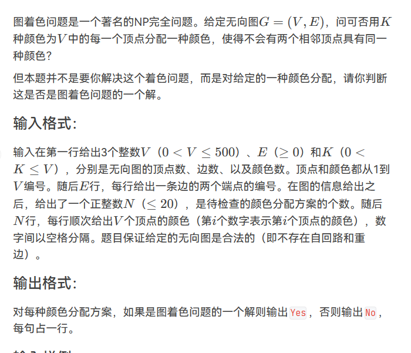

题目思路：

题目代码：

```
//                if(color[i]==color[v[i][j] ] || sc.size()!=d){

//对于N要进行适应性的更改，对于字段错误
#include<bits/stdc++.h>
using namespace std;
#define inf 0x3f3f3f3f
#define N 100100
int n,m,k,g,d;
int x,y,z;
char ch;
string str;
vector<int>v[N];

int main() {
    cin>>n>>m>>d;
    for(int i=0;i<m;i++){
        cin>>x>>y;
        v[x].push_back(y);
        v[y].push_back(x);
    }
    cin>>k;
    while(k--){
        int flag=0;
        vector<int>color;
        set<int>sc;
        color.push_back(0);
        for(int i=0;i<n;i++){
            cin>>x;
            sc.insert(x);
            color.push_back(x);
        }
        for(int i=1;i<=n;i++){
            for(int j=0;j<v[i].size();j++){
                if(color[i]==color[v[i][j]] || sc.size()!=d){
                    flag=1;
                }
            }
        }
        if(flag==0)cout<<"Yes"<<endl;
        else cout<<"No"<<endl;
    }
   
	return 0;
}
```

## No.6 有向图V[N]版本DFS搜索储存路径模板

### 题目来源：PTA-L3-025 那就别担心了

题目描述：  
 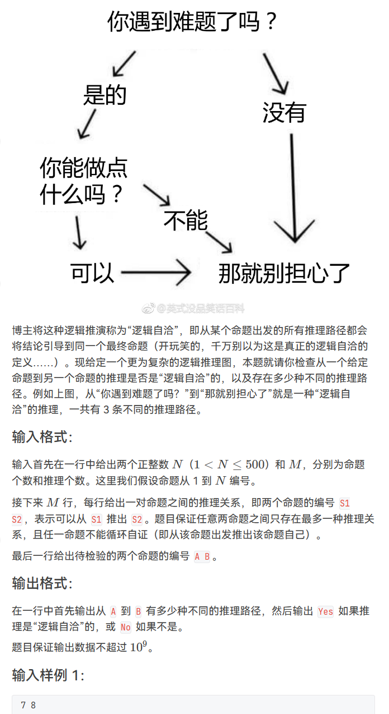

题目思路：

> 也是根据dfs 那个函数进行的 深度搜索，然后判断在函数里面；然后得分肯定没满，能捞点是点。而且有向图在遍历的时候 不用像 无向图那样进行 判断v[N]的时候的父结点。

题目代码：

```
#include <bits/stdc++.h>
using namespace std;
#define N 1001
#define inf 0x3f3f3f3f
string str;
char ch;
int n,m,s,d,k;
int x,y,z;
vector<int>v[N];

//找到 遍历的路径；并且看 是否 其还能有后续；
// 有向图不需要 last 变量；
vector<int>path;
vector<vector<int>>res; 
int anspath; 
int flag=0;
void dfs(int index,int end,vector<int>&path){
	
	if(v[index].size()==0&&index!=end)flag=1;
	if(index==end){
		anspath++;
		return;
	}
	for(int i=0;i<v[index].size();i++){
		path.push_back(v[index][i]);
		dfs(v[index][i],end,path);
		path.pop_back();
	}
	
}

int main()
{
	cin>>n>>m;
	for(int i=0;i<m;i++){
		cin>>x>>y;
		v[x].push_back(y);
	}
	cin>>x>>y;
	
	path.push_back(x);
	dfs(x,y,path);
	cout<<anspath<<" ";
	if(flag==1)cout<<"No"<<endl;
	else cout<<"Yes"<<endl;
	
	
	
    return 0;
}
```

### 题目来源：PTA-L2-020 功夫传人

题目描述：  
 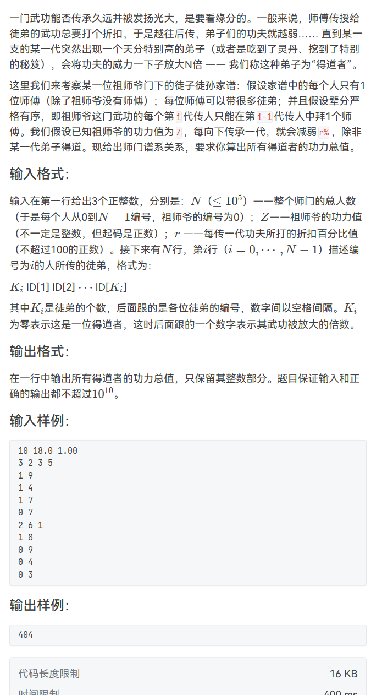

题目思路：

题目代码：

```
//有向图
//只保留其整数部分
 //   cout<<(int)sum<<endl;
#include <bits/stdc++.h>
using namespace std;
#define inf 0x3f3f3f3f
#define N 101000
vector<int>v[N];
vector<int>cur; //存储最终的
vector<int>upda; //存储随时更新的
double cnt=0;
int de[N]={0};
double f,k;
void dfs(int index, vector<int>&upda  ,double gong){
    //增添判断区域。
    if(de[index]!=0){
        cnt=cnt+gong*de[index];
    }


    for( int i=0;i<v[index].size();i++){
	upda.push_back(v[index][i]);
	dfs(v[index][i], upda , gong*(1-0.01*k));
	upda.pop_back(); //记得回溯！！
	}
}
int main() {
    int n;
    int x,y;
    cin>>n>>f>>k;
    for(int i=0;i<n;i++){
        cin>>x;
        if(x==0){
            cin>>y;
            de[i]=y;
        }else{
        while(x--){
            cin>>y;
            v[i].push_back(y);
        }
        }
    }
    upda.push_back(0);
    dfs(0, upda, f );
    //只保留其整数部分
    cout<<(int)cnt<<endl;

    return 0;
}
```

### 题目来源：PTA-L2-038 病毒溯源

题目描述：  
 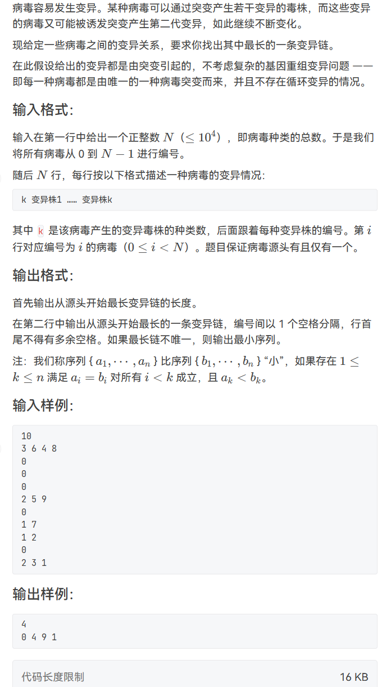

题目思路：

题目代码：

```
//对于N要进行适应性的更改，对于字段错误
//     if(v[i].size()>0)sort(v[i].begin(),v[i].end());
#include<bits/stdc++.h>
using namespace std;
#define inf 0x3f3f3f3f
#define N 100100
int n,m,k,g,d;
int x,y,z;
char ch;
string str;
vector<int>v[N];

vector<int>upda;
vector<int>cur;
void dfs(int index, vector<int>&upda){
    if(upda.size()>cur.size()){
        cur.clear();
        cur=upda;
    }
    for(int i=0;i<v[index].size();i++){
        upda.push_back(v[index][i]);
        dfs(v[index][i] ,upda);
        upda.pop_back();//vector的跳出用pop_back();;;
    }
}
int main() {
    cin>>n;
    int start;
    int book[N]={0};
    for(int i=0;i<n;i++){
        cin>>k;
        while(k--){
            cin>>x;
            book[x]=1;
            v[i].push_back(x);
        }
        if(v[i].size())sort(v[i].begin(),v[i].end());
        
    }
    for(int i=0;i<n;i++){
        if(book[i]==0)start=i;
    }
    upda.push_back(start);
    dfs(start,upda);
    cout<<cur.size()<<endl;
    for(auto i:cur){
        if(i==start)cout<<i;
        else cout<<" "<<i;
    }
	return 0;
}
```

## No.7 无向图即模拟树搜索路径

### 题目来源：PTA-L3-032 关于深度优先搜索和逆序对的题应该不会很难吧这件事

题目描述：  
 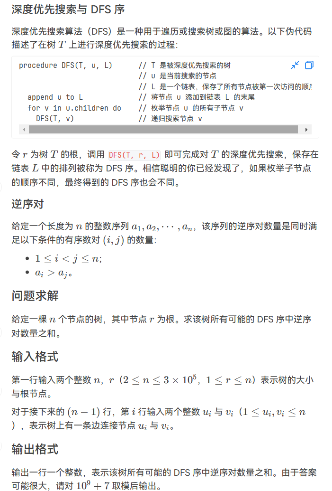

题目思路：

> 因为这道题目是L3的，所有能捞分就行；那么按照这样的话，这里面的题意大概就是，给出起点，然后去搜索所有的dfs序列存储，然后再计算逆序对数量之和；  
>  主要还是 无向图的输入创建，  
>  dfs的函数书写和路径存储，在遍历子节点的时候怎么判断是否是父子结点；  
>  最后两个for循环找数量。

题目代码：

```
// 下面是 一分 都没有的代码；哎

#include<bits/stdc++.h>
using namespace std;
#define inf 0x3f3f3f3f
#define N 100100

const int MOD=1e9+7;
int n,m,k,g,d;
int x,y,z;
char ch;
string str;
vector<int>v[N];
vector<int>upda;
int vis[N]={0};
int sum=0;
void auusun(vector<int>&upda){
    for(unsigned int i=0;i<upda.size()-1;i++){
        for(unsigned int j=i+1;j<upda.size();j++){
            if(upda[i]>upda[j]){
                sum=(sum+1)%MOD;
            }
        }
    }
}
void dfs(int index, vector<int>&upda){
    vis[index]=1;
    if(upda.size()==n){
        auusun(upda);
    }

    for(int i=0;i<v[index].size();i++){
        if(vis[v[index][i]]==1)continue;

        upda.push_back(v[index][i]);
        dfs(v[index][i] ,upda);
        upda.pop_back();//vector的跳出用pop_back();;;
    }
}

int main() {
    cin>>n;
    int start;
    cin>>start;
    for(int i=0;i<n-1;i++){
        cin>>x>>y;
        v[x].push_back(y);
        v[y].push_back(x);
    }
    vector<int>upda;
    dfs(start,upda);

    cout<<sum<<endl;

	return 0;
}
```

### 题目来源：PTA-L2-043 龙龙送外卖

题目描述：  
 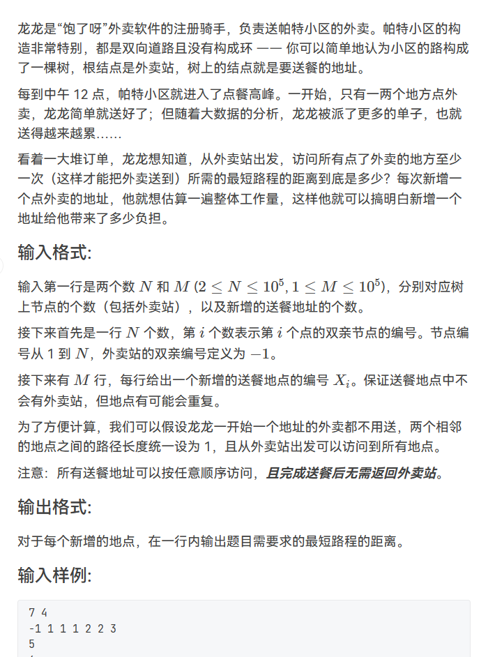

题目思路：


题目代码：

```
//对于N要进行适应性的更改，对于字段错误
#include<bits/stdc++.h>
using namespace std;
#define inf 0x3f3f3f3f
#define N 505000
int n,m,k,g,d;
int x,y,z;
char ch;
string str;
vector<int>v[N];

int depth[N];
int father[N]; 
void dfs(int index){
	
	for(auto i:v[index]){
		depth[i]=depth[index]+1;
		dfs(i);
	}
	
}
int main() {
	cin>>n>>m;
	
	int root;
	for(int i=1;i<=n;i++){
		cin>>x;//位置的双亲 
		if(x==-1){
			root=i;
		}
		v[x].push_back(i);
		father[i]=x;
	}
	dfs(root);
	
	//贪心，将深度最大的  放到最后一个送； 
	int maxx=0; 
	int res=0;
	int vis[N]={0};
	while(m--){
		cin>>x;
		maxx=max(depth[x],maxx);
		
		//新增导致的  增加路程 
		while(vis[x]==0&&x!=root){
			vis[x]=1;
			x=father[x];
			res=res+2;
		}
		cout<<res-maxx<<endl;
	
	}
	
	return 0;
}
```

### 题目来源：Acwing-3712-根能抵达的点

题目描述：  
 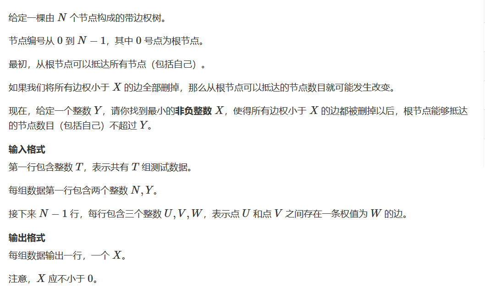

题目思路：

> 观看Acwing上面的讲解视频[点击这里](https://cdn.acwing.com/video/4204/)  
>  大概就是链式前向星进行存储，，然后搜索的时候用二分从l=0，r=1e8；进行二分搜索；然后dfs的时候带上fu参数进行dfs搜索；

题目代码：

```
代码代码啊
```

### 题目来源：RoboCom-2022-RC-u5 树与二分图

题目描述：

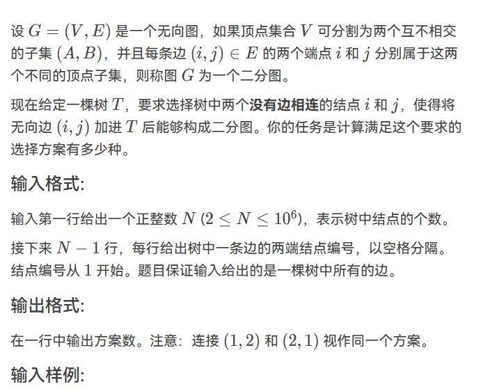

题目思路：


题目代码：

```
//普通版本 得不了满分；没找到问题在哪？这个要注意开LL；
#include <bits/stdc++.h>
using namespace std;
#define N 100010
#define inf 0x3f3f3f3f
#define debug(x) cout<<#x<<" = "<<x<<endl;
#define LL long long
int n,m,k,d,g;
int x,y,z;
string str;
char ch;
vector<int>v[N];

int main()
{
    ios::sync_with_stdio(false),cin.tie(0),cout.tie(0);
    cin>>n;
    set<int>sc,sr;
    cin>>x>>y;
    sc.insert(x);
    sr.insert(y);
    v[x].push_back(y);
    v[y].push_back(x);
    for(int i=2;i<n;i++)
    {
        cin>>x>>y;


        if(sc.count(x))
        {
            sr.insert(y);

        }else{
            sc.insert(y);
            sr.insert(x);
        }

        v[x].push_back(y);
        v[y].push_back(x);
    }
    LL res=0;
    LL sum=sr.size();
    for(auto uu:sc)
    {
        res=res+sum-v[uu].size();
    }
    cout<<res<<endl;


    return 0;
}


//dfs版本的；因为x，y都是1e6的，乘起来会爆int，所以要ll，不然只有23分。
//AC
#include<bits/stdc++.h>
using namespace std;
typedef long long LL;
const LL maxn = 1e6+10;
vector<LL>G[maxn];
LL x = 0, y = 0, xx = 0, yy = 0;
void dfs(LL u, LL fa, LL dep){
    if(dep%2==1){ x++; xx += G[u].size();
    }else{ y++; yy += G[u].size(); }
    for(LL to : G[u]){
        if(to != fa){
            dfs(to, u, dep+1);
        }
    }
}
int main(){
    LL n;  cin>>n;
    for(LL i = 1; i < n; i++){
        LL u, v;  cin>>u>>v;
        G[u].push_back(v);
        G[v].push_back(u);
    }
    dfs(1, -1, 1);
    cout<<x*y-xx<<endl;
    return 0;
}
```
