#### 目录

- [知识框架](#_2)
- [No.0 筑基](#No0__4)
- [No.1 字符矩阵模拟](#No1__8)
- - [题目来源：LeetCode-6. N 字形变换](#LeetCode6_N__10)
  - [题目来源：PTA-L1-002 打印沙漏](#PTAL1002__61)
  - [题目来源：PTA-L1-015 跟奥巴马一起画方块](#PTAL1015__105)
  - [题目来源：PTA-L1-039 古风排版](#PTAL1039__151)
  - [题目来源：PTA-L1-054 福到了](#PTAL1054__206)
  - [题目来源：蓝桥杯-2013省赛-打印十字图](#2013_268)
  - [题目来源：蓝桥杯-2015省赛-空心菱形](#2015_288)
- [No.2 数字矩阵](#No2__334)
- - [题目来源：LeetCode-73. 矩阵置零](#LeetCode73__338)
  - [题目来源：LeetCode-54. 螺旋矩阵](#LeetCode54__441)
  - [题目来源：LeetCode-48. 旋转图像](#LeetCode48__541)
  - - [方法一：转置 + 左右翻转（最推荐）](#___559)
    - [方法二：四点同时旋转（一次到位）](#_596)
    - [方法三：用额外空间（最直观，面试不推荐）](#_638)
    - [三种方法对比](#_661)
    - [举一反三](#_671)
  - [题目来源：LeetCode-240. 搜索二维矩阵 II](#LeetCode240__II_720)
  - [题目来源：LeetCode-498. 对角线遍历](#LeetCode498__762)
  - [题目来源：PTA-L1-048 矩阵A乘以B](#PTAL1048_AB_853)
  - [题目来源：PTA-L1-049 天梯赛座位分配](#PTAL1049__910)
  - [题目来源：PTA-L1-072 刮刮彩票](#PTAL1072__977)
  - [题目来源：PTA-L1-087 机工士姆斯塔迪奥](#PTAL1087__1034)
  - [题目来源：PTA-L2-028 秀恩爱分得快](#PTAL2028__1088)
  - [题目来源：蓝桥杯-2022省赛-统计子矩阵](#2022_1188)
  - [题目来源：蓝桥杯-第十四届模拟-第一期 最小矩阵](#___1251)
  - [题目来源：蓝桥杯-2012省赛-放棋子](#2012_1315)
  - [题目来源：蓝桥杯-2014省赛-兰顿蚂蚁](#2014_1440)
- [No.3 图形面积求解](#No3__1506)
- - [题目来源：蓝桥杯-2012省赛-土地测量](#2012_1509)
  - [题目来源：蓝桥杯-2018省赛-方格计数](#2018_1523)

## 知识框架

## No.0 筑基

> 请先学习下知识点，道友！  
>  题目知识点大部分来源于此：

## No.1 字符矩阵模拟

### 题目来源：LeetCode-6. N 字形变换

题目描述：  
 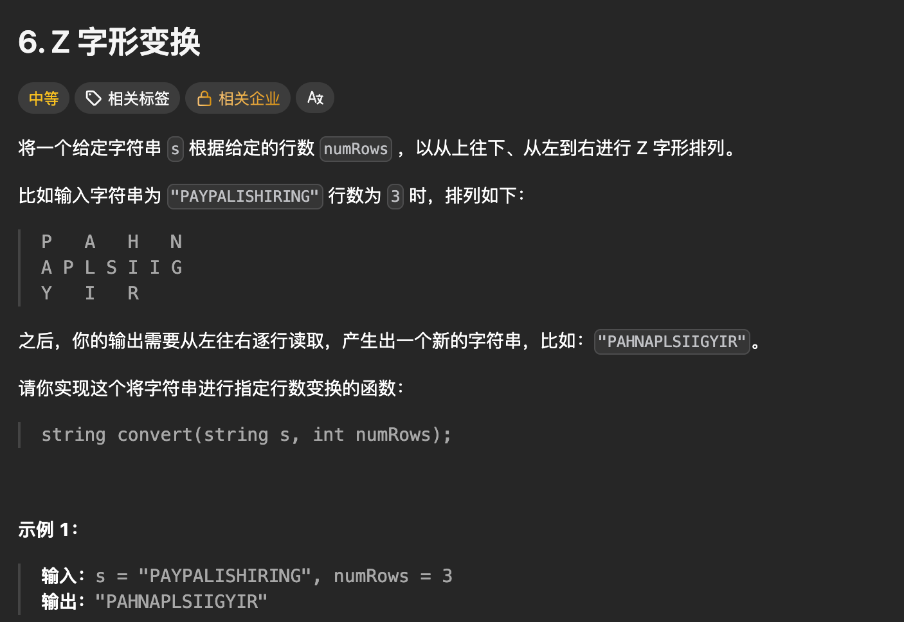

题目思路：


题目代码：

```
class Solution {
public:
    string convert(string s, int numRows) {
        int n = s.length(), r = numRows;
        //首先判断极致情况只有一行or只有一列的话
        if (r == 1 || r >= n) {
            return s;
        }

        // 一个周期有t个字符数量
        int t = r + t - 2;
        // 每个周期占据的列数量 r-1 列
        int c = (n + t - 1) / t * (r - 1);
        vector<string> mat(r, string(c, 0));
        int x=0,y=0;
        for (int i = 0; i < n; ++i) {
            mat[x][y] = s[i];
            if (i % t < r - 1) {
                ++x; // 向下移动
            } else {
                --x;
                ++y; // 向右上移动
            }
        }
        string ans;
        for (auto row : mat) {
            for (char ch : row) {
                if (ch) {
                    ans += ch;
                }
            }
        }
        return ans;
    }
};
```

### 题目来源：PTA-L1-002 打印沙漏

题目描述：  
 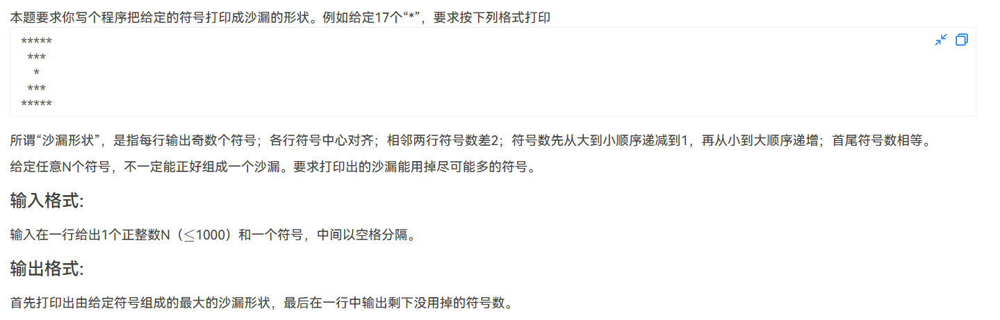

题目思路：

> 思路怎么说呢：找规律吧

题目代码：

```
#include<bits/stdc++.h>
using namespace std;
#define inf 0x3f3f3f3f
#define N 10010
int n,m,k,g,d;
int x,y,z;
char ch;
vector<int>v[N];

int main() {
    cin>>n>>ch;
    //h 为上面的行数==下面的行数。
    //累加规律：1行有1个，2行有4个，3行有9个。即几行和为几平方。
    //该行规律：1行有1个，2行有3个，3行有5个。2*i-1；
    int shang = (n+1)/2;
    int h=sqrt(shang);
    for(int i=h;i>=1;i--){
        for(int j=1;j<=h-i;j++)cout<<" ";
        for(int j=1;j<=2*i-1;j++)cout<<ch;
        cout<<endl;
    }
    
    for(int i=2;i<=h;i++){
        for(int j=1;j<=h-i;j++)cout<<" ";
        for(int j=1;j<=2*i-1;j++)cout<<ch;
        cout<<endl;
    }

    cout<<n-(2*h*h-1)<<endl;
	return 0;
}
```

### 题目来源：PTA-L1-015 跟奥巴马一起画方块

题目描述：  
 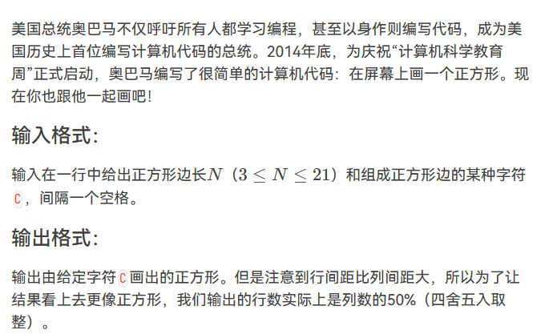

题目思路：


题目代码：

```
//对于N要进行适应性的更改，对于字段错误
#include<bits/stdc++.h>
using namespace std;
#define inf 0x3f3f3f3f
#define N 100100
int n,m,k,g,d;
int x,y,z;
char ch;
string str;
vector<int>v[N];

int main() {
    cin>>n>>ch;
    int h=0;
    if(n%2==0){
        h=n/2;
    }else{
        h=n/2+1;
    }
    for(int i=1;i<=h;i++){
        for(int j=1;j<=n;j++){
            cout<<ch;
        }
        cout<<endl;
    }


	return 0;
}
```

### 题目来源：PTA-L1-039 古风排版

题目描述：  
 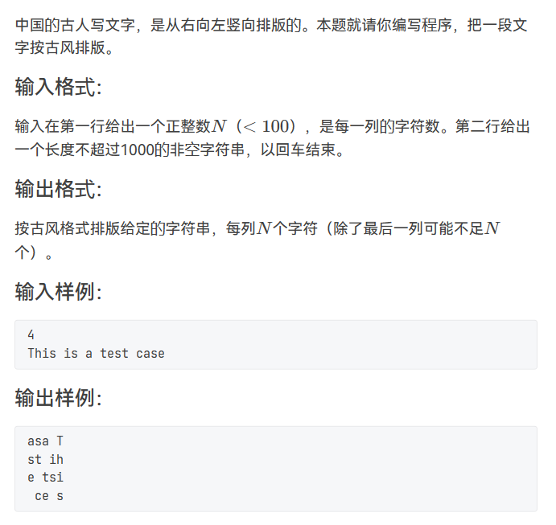

题目思路：

题目代码：

```
//    char a[N][N]; 注意是 char


#include<bits/stdc++.h>
using namespace std;
#define inf 0x3f3f3f3f
#define N 10010
int n,m,k,g,d;
int x,y,z;
char ch;
string str;
vector<int>v[N];

int main() {
    cin>>n;
    getchar();
    getline(cin,str);
    int len=str.size();
    int lie=len%n==0?len/n:len/n+1;
    int a=0;
    char cc[105][105];
    for(int i=lie;i>=1;i--){
        for(int j=1;j<=n;j++){
             //因为a比需要的大一
            //str[0]开始的，所以【a】最大为length-1；即当【】内最大时，a++之后 a==length
            if(a<len){
                cc[j][i]=str[a++];
            }else{
                cc[j][i]=' ';
            }
        }
    }
    
    for(int i=1;i<=n;i++){
        for(int j=1;j<=lie;j++){
            cout<<cc[i][j];
        }
        cout<<endl;
    }
	return 0;
}
```

### 题目来源：PTA-L1-054 福到了

题目描述：  
 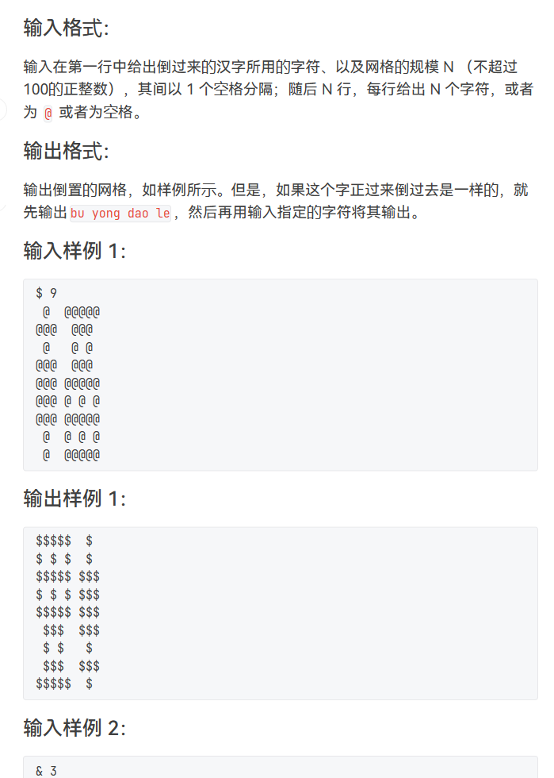

题目思路：

题目代码：

```
//这道题主要考察吃回车。。。
//在使用c=getchar()的时候要特别注意。。。
#include<bits/stdc++.h>
using namespace std;
#define inf 0x3f3f3f3f
#define N 105
int n,m,k,g,d;
int x,y,z;
char ch;
string str;
vector<int>v[N];

int main() {
    char a[N][N],b[N][N];
    cin>>ch>>n;
    char c;
    getchar();
    for(int i=1;i<=n;i++){
        for(int j=1;j<=n;j++){
            c=getchar();
            a[i][j]=c;
        }
        getchar();
    }
    int flag=0;
    for(int i=1;i<=n;i++){
        for(int j=1;j<=n;j++){
            b[i][j]=a[n-i+1][n-j+1];
            if(a[i][j]!=b[i][j]){
                flag=1;
            }
        }
    }
    if(flag==0){
        cout<<"bu yong dao le"<<endl;
    }
    for(int i=1;i<=n;i++){
        for(int j=1;j<=n;j++){
            if(b[i][j]=='@'){
                cout<<ch;
            }else{
                cout<<b[i][j];
            }
        }
        cout<<endl;
    }
	return 0;
}
```

### 题目来源：蓝桥杯-2013省赛-打印十字图

题目描述：

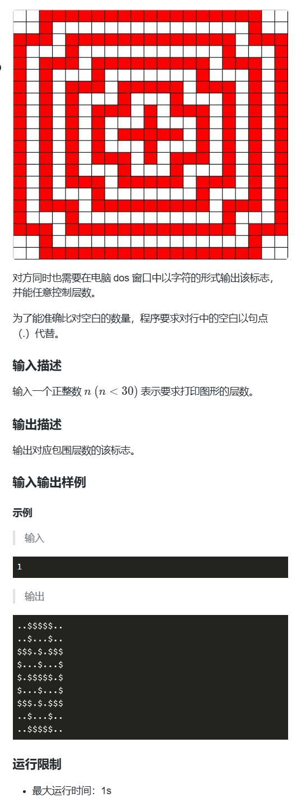

题目思路：


题目代码：

```
在这里插入代码片
```

### 题目来源：蓝桥杯-2015省赛-空心菱形

题目描述：  
 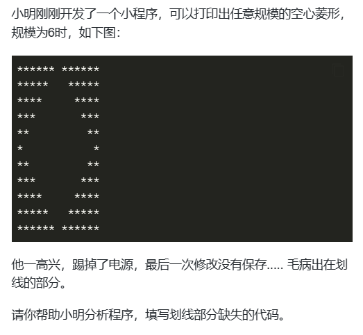

题目思路：


题目代码：

```
import java.util.*;
public class Main
{
    
    static String pr(int m, int n)
    {
        String s = "";
        for(int i=0; i<n; i++) s += ".";
        for(int i=0; i<m; i++) s = "*" + s + "*";
        return s;
    }
    
    static void f(int n)
    {
        String s = pr(1,n*2-1) + "\n";
        String s2 = s;
            
        for(int i=1; i<n; i++){
            s = pr(i + 1,2 * (n - i)  - 1) + "\n";
            s2 = s + s2 + s; 
        }
        
        System.out.print(s2);
    }
    
    public static void main(String[] args)
    {
        f(9);
    }
}
```

## No.2 数字矩阵

### 题目来源：LeetCode-73. 矩阵置零

题目描述：  
 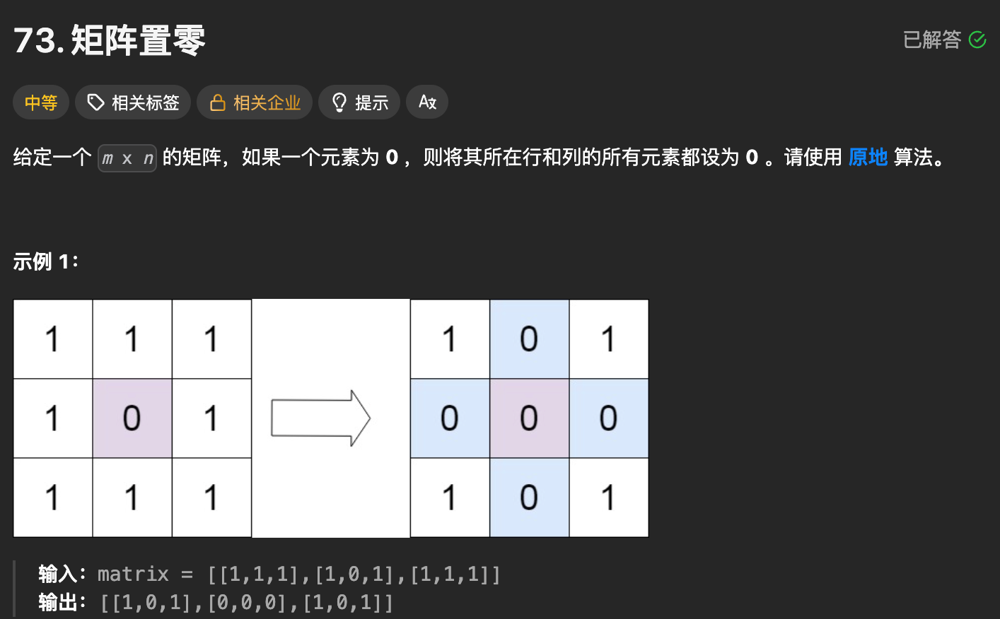

题目思路：


题目代码：

```
class Solution {
public:
    void setZeroes(vector<vector<int>>& matrix) {

        // 唯一要注意的就是本来的0和添加的0即可
        int m = matrix.size();
        int n = matrix[0].size();   
        // 用第一行和第一列存储信息

        int first_row = 0;
        int first_col = 0;
        for(int i =0; i < m; i++){
            if(matrix[i][0] == 0)first_col = 1;
        }
        for(int j = 0; j < n; j++){
            if(matrix[0][j] == 0)first_row = 1;
        }


        // 置0 在第一行和第一列对应的位置
        for(int i = 1; i < m; i++){
            for(int j = 1; j < n; j++){
                if(matrix[i][j] == 0){
                    matrix[0][j] = 0;
                    matrix[i][0] = 0;
                }
            }
        }
        // 传播
        for(int i = 1; i < m; i++){
            if(matrix[i][0] == 0){
                for(int j = 1; j < n; j++){
                    matrix[i][j] = 0;
                }
            }
        }

        for(int j = 1; j < n; j++){
            if(matrix[0][j] == 0){
                for(int i = 1; i < m; i++){
                    matrix[i][j] = 0;
                }
            }
        }
        // 最后处理第一行和第一列的
        if(first_row == 1){
            for(int j = 0; j < n; j++){
                matrix[0][j] = 0;
            }
        }
        if(first_col == 1){
            for(int i = 0; i < m; i++){
                matrix[i][0] = 0;
            }
        }
    }
};
```

```
class Solution {
public:
    void setZeroes(vector<vector<int>>& matrix) {

        // 唯一要注意的就是本来的0和添加的0即可
        int m = matrix.size();
        int n = matrix[0].size();
        vector<vector<bool>> lookup(m, std::vector<bool>(n, false));
        for(int i = 0; i < m; i++){
            for(int j = 0; j < n; j++){
                if(matrix[i][j] == 0)lookup[i][j] = true;
            }
        }
        for(int i = 0; i < m; i++){
            for(int j = 0; j < n; j++){
                if(matrix[i][j] == 0 && lookup[i][j]){
                    // 进行操作
                    // i 行
                    for(int k = 0; k < n; k++)matrix[i][k] = 0;
                    // j 列
                    for(int k = 0; k < m; k++)matrix[k][j] = 0;
                }
            }
        }
        
    }
};
```

### 题目来源：LeetCode-54. 螺旋矩阵

题目描述：  
 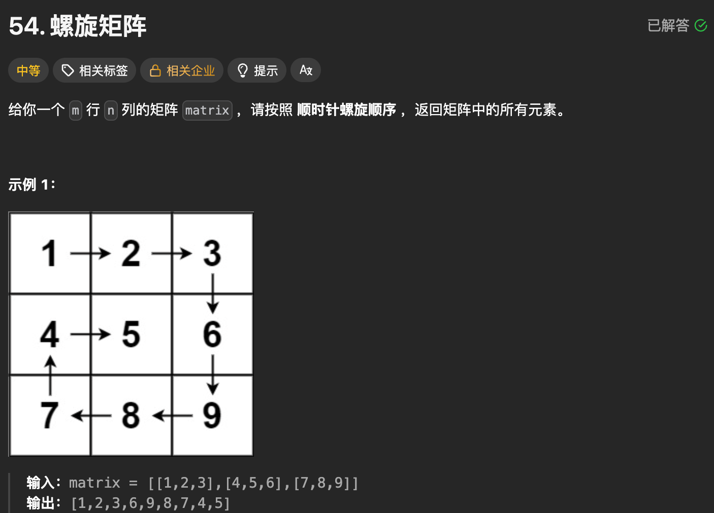

题目思路：

> 使用dirs 进行方向变换

题目代码：

```
class Solution {
public:
    vector<int> spiralOrder(vector<vector<int>>& mat) {
        int m = mat.size();    // 行数
        int n = mat[0].size(); // 列数

        // 方向：右 → 下 → 左 → 上
        int dirs[4][2] = {{0, 1}, {1, 0}, {0, -1}, {-1, 0}};
        // 什么时候 转弯呢？？？
        // 当遇到 墙 或者 已经访问过的 就直接转弯就行了。
        vector<int>res;
        int cur_x = 0, cur_y = 0;
        int cur_dir = 0;
        for(int i = 0; i < m * n; i++){
            res.push_back(mat[cur_x][cur_y]);
            mat[cur_x][cur_y] = INT_MAX;

            // 尝试下一个点为[next_x, next_y];
            int next_x = cur_x + dirs[cur_dir][0];
            int next_y = cur_y + dirs[cur_dir][1];

            // 是否转弯
            if(next_x <0 || next_x >= m || next_y < 0 || next_y >= n || mat[next_x][next_y] == INT_MAX){
                cur_dir = (cur_dir + 1)%4;
            }
            cur_x = cur_x + dirs[cur_dir][0];
            cur_y = cur_y + dirs[cur_dir][1];
        }
        return res;
    }
};
```

```
class Solution {
public:
    vector<int> spiralOrder(vector<vector<int>>& mat) {
        // 空矩阵判断
        if (mat.empty() || mat[0].empty()) return {};

        int n = mat.size();    // 行数
        int m = mat[0].size(); // 列数

        // 方向：右 → 下 → 左 → 上
        int dir_x[4] = {0, 1, 0, -1};
        int dir_y[4] = {1, 0, -1, 0};
        int cur_dir = 0; // 当前方向

        vector<int> ans;
        int now_num = 0; // 已经遍历的数量
        int now_x = 0;
        int now_y = 0;

        // 访问标记
        vector<vector<int>> vis_able(n, vector<int>(m, 0));

        while (now_num < n * m) {
            // 把当前位置加入答案
            ans.push_back(mat[now_x][now_y]);
            vis_able[now_x][now_y] = 1;
            now_num++;

            // 计算下一个位置
            int next_x = now_x + dir_x[cur_dir];
            int next_y = now_y + dir_y[cur_dir];

            // 判断下一个位置是否合法
            if (next_x >= 0 && next_x < n && next_y >= 0 && next_y < m && vis_able[next_x][next_y] == 0) {
                // 可以走，就移动
                now_x = next_x;
                now_y = next_y;
            } else {
                // 不能走，转向
                cur_dir = (cur_dir + 1) % 4;
                // 转向后重新计算下一步
                now_x += dir_x[cur_dir];
                now_y += dir_y[cur_dir];
            }
        }

        return ans;
    }
};
```

### 题目来源：LeetCode-48. 旋转图像

题目描述：  
 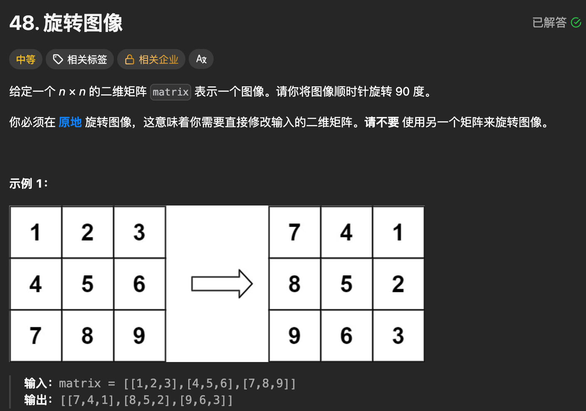

题目思路：

```
输入:          输出(顺时针90°):
1 2 3          7 4 1
4 5 6    →     8 5 2
7 8 9          9 6 3
```

**规律**：位置 `(i, j)` → 旋转后到 `(j, n-1-i)`

---

#### 方法一：转置 + 左右翻转（最推荐）

```
class Solution {
public:
    void rotate(vector<vector<int>>& matrix) {
        int n = matrix.size();
        
        // 第一步：沿主对角线转置
        // 只遍历上三角，避免重复交换
        for (int i = 0; i < n; i++) {
            for (int j = i + 1; j < n; j++) {
                swap(matrix[i][j], matrix[j][i]);
            }
        }
        
        // 第二步：每行左右翻转
        for (int i = 0; i < n; i++) {
            // 只需遍历前半段
            for (int j = 0; j < n / 2; j++) {
                swap(matrix[i][j], matrix[i][n - 1 - j]);
            }
        }
    }
};
```

**图解过程：**

```
原始:          转置后:        左右翻转后:
1 2 3          1 4 7          7 4 1  ✓
4 5 6    →     2 5 8    →     8 5 2  ✓
7 8 9          3 6 9          9 6 3  ✓
```

---

#### 方法二：四点同时旋转（一次到位）

```
class Solution {
public:
    void rotate(vector<vector<int>>& matrix) {
        int n = matrix.size();
        
        // 每次处理4个对称位置，只需遍历左上角 1/4 区域
        for (int i = 0; i < n / 2; i++) {
            for (int j = i; j < n - 1 - i; j++) {
                int temp = matrix[i][j];
                
                // 逆时针方向依次赋值
                matrix[i][j]         = matrix[n-1-j][i];      // 左←下
                matrix[n-1-j][i]     = matrix[n-1-i][n-1-j];  // 下←右
                matrix[n-1-i][n-1-j] = matrix[j][n-1-i];      // 右←上
                matrix[j][n-1-i]     = temp;                   // 上←左(原)
            }
        }
    }
};
```

**四点旋转图解（以3×3为例）：**

```
(i,j) ──────────→ (j, n-1-i)
  ↑                     ↓
(n-1-j, i) ←── (n-1-i, n-1-j)

具体到 (0,0) 这组4个点:
[0][0]=1 → [0][2]=3位置
[0][2]=3 → [2][2]=9位置  
[2][2]=9 → [2][0]=7位置
[2][0]=7 → [0][0]=1位置

旋转一圈后:
1→3→9→7→1 (顺时针)
```

---

#### 方法三：用额外空间（最直观，面试不推荐）

```
class Solution {
public:
    void rotate(vector<vector<int>>& matrix) {
        int n = matrix.size();
        vector<vector<int>> tmp(n, vector<int>(n));
        
        // 直接按公式复制
        // (i,j) 旋转90°后 → (j, n-1-i)
        for (int i = 0; i < n; i++) {
            for (int j = 0; j < n; j++) {
                tmp[j][n - 1 - i] = matrix[i][j];
            }
        }
        matrix = tmp;
    }
};
```

---

#### 三种方法对比

| 方法 | 时间 | 空间 | 推荐度 |
| --- | --- | --- | --- |
| 转置+翻转 | O(n²) | O(1) | ⭐⭐⭐ 首选 |
| 四点旋转 | O(n²) | O(1) | ⭐⭐ 理解难度大 |
| 额外空间 | O(n²) | O(n²) | ⭐ 不符合题意 |

---

#### 举一反三

```
// 逆时针 90° = 转置 + 上下翻转
for (int i = 0; i < n / 2; i++)
    swap(matrix[i], matrix[n - 1 - i]);

// 旋转 180° = 上下翻转 + 左右翻转
// 或者连续旋转两次90°
```

---

> 坐标规律  
>  对于 n 阶矩阵，元素 matrix[i][j] 顺时针旋转 90° 后会到 matrix[j][n-1-i]，需要循环交换 4 个位置的元素：  
>  原位置：(i, j)  
>  旋转后位置 1：(j, n-1-i)  
>  旋转后位置 2：(n-1-i, n-1-j)  
>  旋转后位置 3：(n-1-j, i)

题目代码：

```
class Solution {
public:
    void rotate(vector<vector<int>>& matrix) {
        int n = matrix.size();
        // 遍历矩阵的1/4区域（避免重复旋转）
        for (int i = 0; i < n / 2; ++i) {
            for (int j = i; j < n - 1 - i; ++j) {
                // 保存原位置值
                int temp = matrix[i][j];
                // 四次交换：位置3 → 原位置，位置2 → 位置3，位置1 → 位置2，原位置 → 位置1
                matrix[i][j] = matrix[n - 1 - j][i];          // 位置3 → 原位置
                matrix[n - 1 - j][i] = matrix[n - 1 - i][n - 1 - j]; // 位置2 → 位置3
                matrix[n - 1 - i][n - 1 - j] = matrix[j][n - 1 - i]; // 位置1 → 位置2
                matrix[j][n - 1 - i] = temp;                  // 原位置 → 位置1
            }
        }
    }
};
```

### 题目来源：LeetCode-240. 搜索二维矩阵 II

题目描述：  
 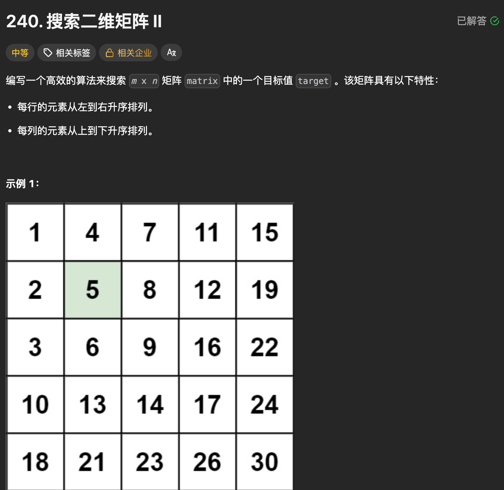

题目思路：

> 由此可得核心规律：  
>  选择「右上角」作为起始点：  
>  如果当前值 > 目标值 → 目标值一定在当前列的左侧（削去当前列，列数 - 1）；  
>  如果当前值 < 目标值 → 目标值一定在当前行的下方（削去当前行，行数 + 1）；  
>  如果相等 → 找到目标，返回 true。  
>  也可选择「左下角」作为起始点（逻辑对称），推荐右上角（更符合直觉）。

题目代码：

```
class Solution {
public:
    bool searchMatrix(vector<vector<int>>& matrix, int target) {
        // 边界处理：空矩阵直接返回false
        if (matrix.empty() || matrix[0].empty()) return false;
        
        int m = matrix.size();    // 行数
        int n = matrix[0].size(); // 列数
        int i = 0, j = n - 1;     // 起始点：右上角
        
        while (i < m && j >= 0) {
            if (matrix[i][j] == target) {
                return true; // 找到目标
            } else if (matrix[i][j] > target) {
                j--; // 目标更小，削去当前列（向左找）
            } else {
                i++; // 目标更大，削去当前行（向下找）
            }
        }
        
        return false; // 遍历完未找到
    }
};
```

### 题目来源：LeetCode-498. 对角线遍历

题目描述：  
 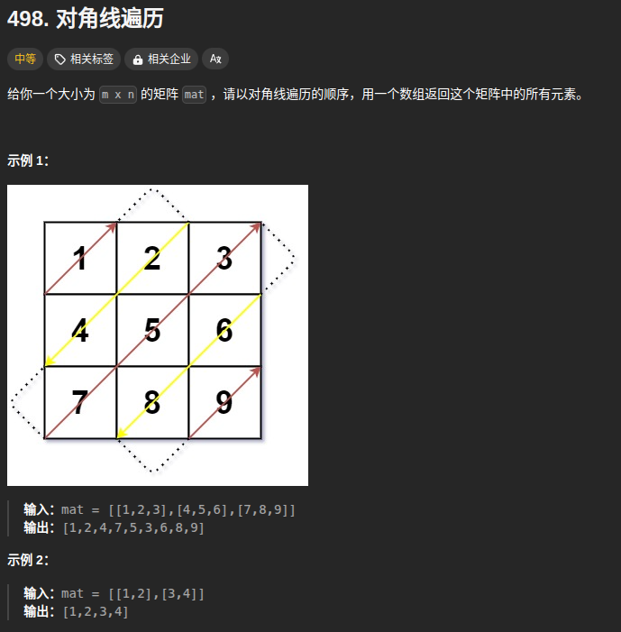

题目思路：


题目代码：

```
class Solution {
public:
    vector<int> findDiagonalOrder(vector<vector<int>>& mat) {
        


        int m = mat.size();
        int n = mat[0].size();
        int total = m * n;
        int row = 0;
        int col = 0;
        vector<int>res(total);


        // 最开始为 右上，所以为 (-1, 1); 即index = 0 的方向为 右上
        // 当转向的时候为 左下 为(1, -1); 即index = 1 的方向为 左下;
        // 也就是说 这个 dirs 也是 需要根据题目意思进行 修改的。
        int dirs[2][2] = { {-1, 1}, {1, -1}};
        int index = 0;

        // 如果是四个方向的话：：假设是 右上，左下，右下，左上
        // int dirs[4][2] = { {-1, 1}, {1, -1}, {1, 1}, {-1, -1}}
        // 这样的话就是 index = 0; 换方向的时候 index = (index + 1) % 4;

        // 如果是四个方向的话：：假设是 上，下， 左， 右
        // int dirs[4][2] = { {-1, 0}, {1, 0}, {0, -1}, {0, 1}}
        // 这样的话就是 index = 0; 换方向的时候 index = (index + 1) % 4;

        


        int nums = 0;
        for(int i = 0; nums < total; i++)
        {
            if (col >= 0 && col <n && row >= 0 && row <m)
            {
                res[nums++] = mat[row][col];
            }
            int next_row = row + dirs[index][0];
            int next_col = col + dirs[index][1];


            if(next_col < 0 || next_col >=n || next_row < 0 || next_row >=m)
            {

                if(next_row >= m)
                {
                    // 将要向下越界了还未发生
                    next_row = row;
                    next_col = col + 1;
                }else if(next_row < 0){
                    // 向上越界；还未发生
                    next_row = row;
                    next_col = col + 1;
                }else if(next_col < 0){
                    // 向左  还未发生
                    next_col = col;
                    next_row = row + 1;
                }else if(next_col >= n){
                    //向右  还未发生
                    next_col = col;
                    next_row = row + 1;
                }

                // 发生越界就要 更换方向。
                index = (index + 1) % 2;
            }


            // 将 row 和 col 更新
            row = next_row;
            col = next_col;
        }
        return res;
    }
};
```

### 题目来源：PTA-L1-048 矩阵A乘以B

题目描述：  
 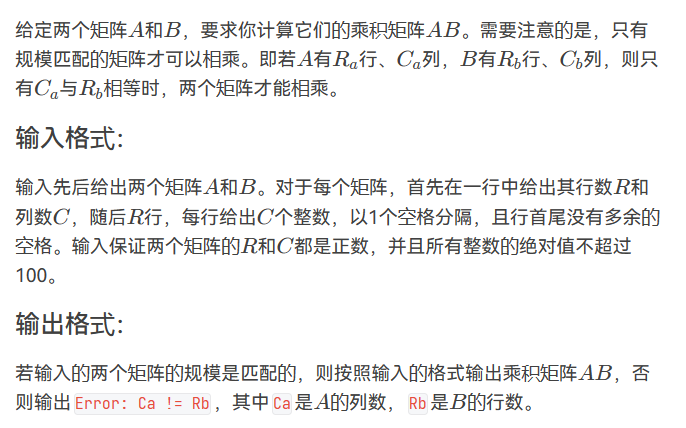

题目思路：

题目代码：

```
#include<bits/stdc++.h>
using namespace std;
#define inf 0x3f3f3f3f
#define N 1001
int n,m,k,g,d;
int x,y,z;
char ch;
string str;
vector<int>v[N];

int main() {
    int ah,al,bh,bl;
    int a[N][N],b[N][N];
    cin>>ah>>al;
    for(int i=1;i<=ah;i++){
        for(int j=1;j<=al;j++){
            cin>>a[i][j];
        }
    }
    cin>>bh>>bl;
    for(int i=1;i<=bh;i++){
        for(int j=1;j<=bl;j++){
            cin>>b[i][j];
        }
    }
    if(al!=bh){
        cout<<"Error: "<<al<<" != "<<bh<<endl;
    }else{
        cout<<ah<<" "<<bl<<endl;
        for(int i=1;i<=ah;i++){
            for(int j=1;j<=bl;j++){
                int sum=0;
                for(int k=1;k<=al;k++){
                    sum=sum+a[i][k]*b[k][j];
                }
                if(j==1)cout<<sum;
                else cout<<" "<<sum;
            }
            cout<<endl;
        }
    }
	return 0;
}
```

### 题目来源：PTA-L1-049 天梯赛座位分配

题目描述：  
 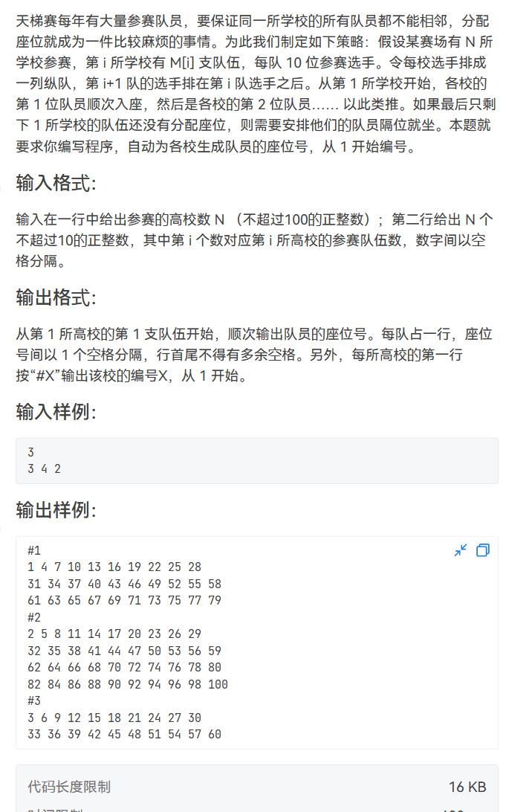

题目思路：

> 这个的矩阵模拟就比较复杂了

题目代码：

```
//记住N为大于100的但是不能太大
//记住那个 j<=num[i]
#include<bits/stdc++.h>
using namespace std;
int num[111];//记录每个学校的队伍数量
int pos[111][11][11];//i学校j队伍中k队员的位置
int maxx,pre;//maxx记录学校中队伍数量的最大值，pre记录上一个被编号的学校
int x;//记录编号
int main()
{
    int n;//学校数量
    cin>>n;
    for(int i=1; i<=n; i++)
    {
        cin>>num[i];//每个学校的队伍数量
        maxx=max(maxx,num[i]);//记录最大队伍数量
    }
    for(int j=1; j<=maxx; j++) //以最大队伍数量为上界，为了让每个人都能在这个循环里添加上位置
    {
        for(int k=1; k<=10; k++)//循环每个队员
        {
            for(int i=1; i<=n; i++)//遍历学校开始编号
            {
                if(j<=num[i])//如果当前的队伍数量j小于等于当前学校的队伍数量，说明可以编号，否则不可以，因为该学校里没有队员可以被编号了，都编完号了
                {
                    if(pre==i)//相邻学校的两个队员必须隔位就坐
                        x+=2;
                    else
                        x++;//不是同一个学校的，连续编排
                    pos[i][j][k]=x;//特别有意思的循环，i学校j队伍中k队员的编号就是x
                    pre=i;//记录上一个被编号的学校
                }
            }
        }
    }
    for(int i=1;i<=n;i++)
    {
        cout<<"#"<<i<<endl;
        for(int j=1;j<=num[i];j++)
        {
            for(int k=1;k<=10;k++)
            {
                if(k<=9)
                    cout<<pos[i][j][k]<<" ";
                else
                    cout<<pos[i][j][k]<<endl;
            }
        }
 
    }
    return 0;
 
}
```

### 题目来源：PTA-L1-072 刮刮彩票

题目描述：  
 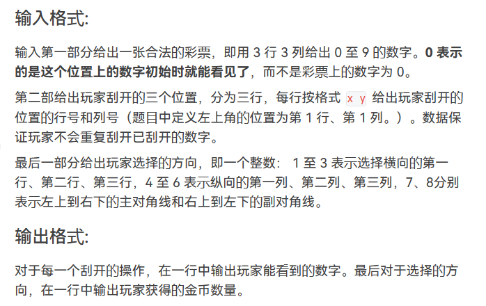

题目思路：

题目代码：

```
#include<iostream>
using namespace std;
int x,y,k;
int main(){
    int a[4][4],value[25]={0,0,0,0,0,0,10000,36,720,360,80,252,108,72,54,180,72,180,119,36,306,1080,144,1800,3600};
    int ix=0,iy=0;
    int book[15]={0};
    for(int i=1;i<=3;i++){
        for(int j=1;j<=3;j++){
            cin>>x;
            if(x==0){
                ix=i;
                iy=j;
            }else{
                a[i][j]=x;
                book[x]=1;
            }
        }
    }
    for(int i=1;i<=9;i++){
        if(book[i]==0){
            a[ix][iy]=i;
        }
    }
    for(int i=0;i<3;i++){
        cin>>x>>y;
        cout<<a[x][y]<<endl;
    }
    cin>>k;
    int sum=0;
    if(k<=3){
        sum=a[k][1]+a[k][2]+a[k][3];
        cout<<value[sum]<<endl;
    }else if(k<=6){
        sum=a[1][k-3]+a[2][k-3]+a[3][k-3];
        cout<<value[sum]<<endl;
    }else if(k==7){
        sum=a[1][1]+a[2][2]+a[3][3];
        cout<<value[sum]<<endl;
    }else if(k==8){
        sum=a[3][1]+a[2][2]+a[1][3];
        cout<<value[sum]<<endl;
    }
    
    return 0;
}
```

### 题目来源：PTA-L1-087 机工士姆斯塔迪奥

题目描述：  
 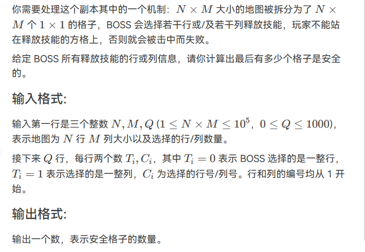

题目思路：


题目代码：

```
#include<bits/stdc++.h>
using namespace std;
#define inf 0x3f3f3f3f
#define N 505
int n,m,k,g,d;
int x,y,z;
char ch;
string str;
vector<int>v[N];
#define PII pair<int,int>


	
int main()
{
    cin>>n>>m>>k;
    int map[n+1][m+1]={0};
    while(k--){
        cin>>x>>y;
        if(x==1){
            for(int i=1;i<=n;i++)map[i][y]=1;
        }else{
            for(int j=1;j<=m;j++)map[y][j]=1;
        }
    }
    int res=0;
    for(int i=1;i<=n;i++){
        for(int j=1;j<=m;j++){
            if(map[i][j]==0)res++;
        }
    }
 	cout<<res<<endl;
    return 0;
}
```

### 题目来源：PTA-L2-028 秀恩爱分得快

题目描述：  
 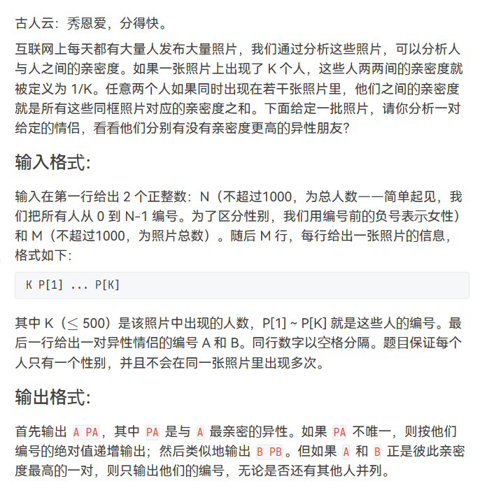

题目思路：

题目代码：

```
思路：用一个二维数组g来存储在同一张照片的不同人之间的亲密度，maxn来记录和A和异性的最大亲密度和B和异性的最大亲密度，因为题目要求按他们编号的绝对值递增输出，所以我们采用set分别存储男性和女性，最后遍历输出就行了

//注意一定要将cin>>str的转化为abs(stoi(str));
注：stoi是将string类型转换成int型
 //1010 1000 1001
//这个1010会超时，1001不会超时。。

#include<iostream>
#include<algorithm>
#include<cstring>
#include<set>
#include<vector>
 
using namespace std;
#define N 1010
int n,m,k;
int x,y,z;
char ch;
string str;
int main() {
    cin>>n>>m;
    double g[N][N]={0.0};
    double maxx[N]={0};
    set<int>A,B;
    for(int i=0;i<m;i++){
        cin>>k;
        vector<int>a;
        vector<int>b;
        for(int j=0;j<k;j++){
            cin>>str;
            int num=abs(stoi(str));
            if(str[0]=='-'){
                a.push_back(num);
                A.insert(num);
            }else{
                b.push_back(num);
                B.insert(num);
            }
        }
        for(auto p:a){
            for(auto q:b){
                g[q][p]=g[p][q]+=1.0/k;
                maxx[p]=max(maxx[p],g[p][q]);
                maxx[q]=max(maxx[q],g[p][q]);
            }
        }
    }
    string s1,s2;
    cin>>s1>>s2;
    x=abs(stoi(s1));
    y=abs(stoi(s2));
    if(maxx[x]==g[x][y]&&maxx[y]==g[x][y]){
        cout<<s1<<" "<<s2<<endl;
        return 0;
    }
    //下面对于s1;
    if(s1[0]=='-'){
        for(auto i:B){
            if(maxx[x]==g[x][i]){
                cout<<s1<<" "<<i<<endl;
            }
        }
    }else{
        for(auto i:A){
            if(maxx[x]==g[x][i]){
                cout<<s1<<" -"<<i<<endl;
            }
        }
    }
    
    
    //下面对于s2；
    if(s2[0]=='-'){
        for(auto i:B){
            if(maxx[y]==g[y][i]){
                cout<<s2<<" "<<i<<endl;
            }
        }
    }else{
        for(auto i:A){
            if(maxx[y]==g[y][i]){
                cout<<s2<<" -"<<i<<endl;
            }
        }
    }
	return 0;
}
```

### 题目来源：蓝桥杯-2022省赛-统计子矩阵

题目描述：  
 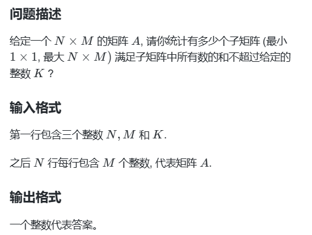

题目思路：

> 1使用前缀和+滑动窗口 ，但是这里是二维矩阵，所以要先计算出纵向的前缀和，a[i][j]表示前i行第j列之和  
>  2然后遍历上边界i和下边界ii，再这个上下边界内使用滑动窗口，由于前面维护了纵向前缀和，所以转化成类似一维的滑动窗口。  
>  3滑动窗口【l,r】：遍历右端点，根据区间和调整左端点，如果区间和大了，左端点右移。注意区间和也要移除左端点，直到找到满足的区间，区间大小r-l+1就是以r为右端点的满足条件子矩阵个数，累加即可

题目代码：

```
#include <iostream>
using namespace std;
const int maxn = 501;
int a[maxn][maxn];
long long ans = 0;
int main()
{
// 请在此输入您的代码
int n,m,k;
cin >> n >> m >> k;

for(int i = 1; i <= n ; i++)
{
 for(int j = 1; j <= m; j++)
 {
   cin >> a[i][j];
   //为了后面计算方便，维护纵向前缀和
   //a[i][j]表示前i行第j列之和
   a[i][j] += a[i-1][j];
 }
}
//遍历上边界和下边界

for(int i = 1; i <= n; i++)//遍历上边界
{
 for(int ii = i; ii <= n; ii++)//遍历下边界
 {
   int l = 1, r = 1;//滑动窗口的左右端点
   int sum = 0;//区间前缀和：[l,r]区间的累计和
   for(r = 1; r <= m; r++)//遍历右端点，根据区间和调整左端点
   {
     sum += a[ii][r] - a[i-1][r];//加上右端点处的和
     while(sum > k)//区间和了，左端点右移，区间变小
     {
       sum -= a[ii][l] - a[i-1][l];//减去移出去的左端点处的和
       l++;
     }
     ans += r - l + 1;//方法数就是找到的区间大小累加
   }
 }
}
cout << ans << endl;
return 0;
}
```

### 题目来源：蓝桥杯-第十四届模拟-第一期 最小矩阵

题目描述：  
 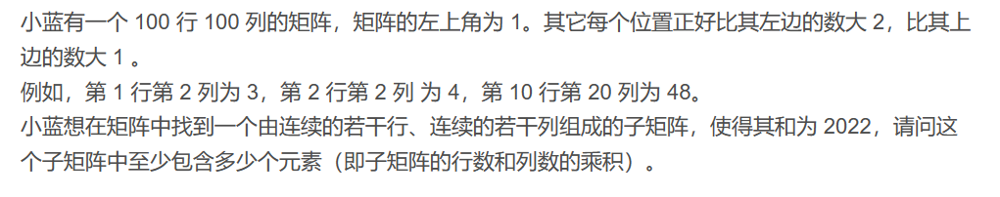

题目思路：

> 枚举起点与终点的位置，寻找和为 2022 时最小的元素个数  
>  二维前缀和获取子矩阵和的复杂度为 O(1)

题目代码：

```
// 答案：12
#include <bits/stdc++.h>
using namespace std;
#define int long long
const int n = 101;
int a[n][n];

void init() {
    a[1][1] = 1;
    // 构建初始矩阵
    for (int i = 1; i < n; i++) {
        for (int j = 1; j < n; j++) {
            if (i > 1) a[i][j] = a[i - 1][j] + 1;
            else if (j > 1) a[i][j] = a[i][j - 1] + 2;
        }
    }
    // 构建前缀和
    for (int i = 1; i < n; i++) {
        for (int j = 1; j < n; j++) {
            a[i][j] += a[i][j - 1] + a[i - 1][j] - a[i - 1][j - 1];
        }
    }
}

// 获取 [i][j] 到 [x][y] 之间子矩阵的和
int getSum(int i, int j, int x, int y) {
    return a[x][y] - a[x][j - 1] - a[i - 1][y] + a[i - 1][j - 1];
}

signed main() {
    init();
    int ans = n * n;
    for (int i = 1; i < n; i ++) {
        for (int j = 1; j < n; j ++) {
            for (int x = i; x < n; x ++) {
                for (int y = j; y < n; y ++) {
                    int tmp = getSum(i, j, x, y);
                    if (tmp == 2022)
                        ans = min(ans, (x - i + 1) * (y - j + 1));
                    else if (tmp > 2022)	// 超过 2022 可以剪枝
                        break;
                }
            }
        }
    }
    cout << ans << endl;
    return 0;
}
```

### 题目来源：蓝桥杯-2012省赛-放棋子

题目描述：  
 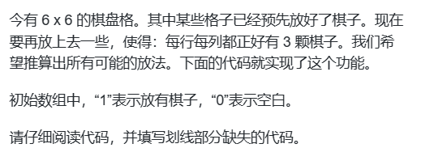

题目思路：


题目代码：

```
#include <stdio.h>
#include <stdlib.h>
int N = 0;

bool CheckStoneNum(int x[][6])
{
    for(int k=0; k<6; k++)
    {
        int NumRow = 0;
        int NumCol = 0;
        for(int i=0; i<6; i++)
        {
            if(x[k][i]) NumRow++;
            if(x[i][k]) NumCol++;
        }
        if(NumRow!=3||NumCol!=3) return false;  // 填空
    }
    return true;
}

int GetRowStoneNum(int x[][6], int r)
{
    int sum = 0;
    for(int i=0; i<6; i++)     if(x[r][i]) sum++;
    return sum;
}

int GetColStoneNum(int x[][6], int c)
{
    int sum = 0;
    for(int i=0; i<6; i++)     if(x[i][c]) sum++;
    return sum;
}

void show(int x[][6])
{
    for(int i=0; i<6; i++)
    {
        for(int j=0; j<6; j++) printf("%2d", x[i][j]);
        printf("\n");
    }
    printf("\n");
}

void f(int x[][6], int r, int c);

void GoNext(int x[][6],  int r,  int c)
{
    if(c<6)
        f(x,r,c+1);   // 填空
    else
        f(x, r+1, 0);
}

void f(int x[][6], int r, int c)
{
    if(r==6)
    {
        if(CheckStoneNum(x))
        {
            N++;
            show(x);
        }
        return;
    }

    if(x[r][c])  // 已经放有了棋子  // 填空
    {
        GoNext(x,r,c);
        return;
    }
    
    int rr = GetRowStoneNum(x,r);
    int cc = GetColStoneNum(x,c);

    if(cc>=3)  // 本列已满
        GoNext(x,r,c);  
    else if(rr>=3)  // 本行已满
        f(x, r+1, 0);   
    else
    {
        x[r][c] = 1;
        GoNext(x,r,c);
        x[r][c] = 0;
        
        if(!(3-rr >= 6-c || 3-cc >= 6-r))  // 本行或本列严重缺子，则本格不能空着！
            GoNext(x,r,c);  
    }
}

int main(int argc, char* argv[])
{
    int x[6][6] = {
        {1,0,0,0,0,0},
        {0,0,1,0,1,0},
        {0,0,1,1,0,1},
        {0,1,0,0,1,0},
        {0,0,0,1,0,0},
        {1,0,1,0,0,1}
    };

    f(x, 0, 0);
    
    printf("%d\n", N);

    return 0;
}
```

### 题目来源：蓝桥杯-2014省赛-兰顿蚂蚁

题目描述：

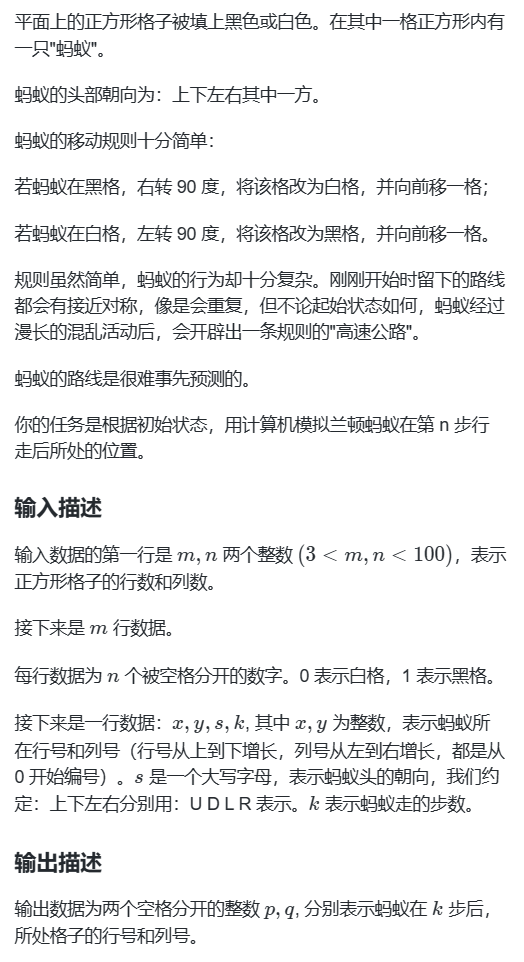

题目思路：


题目代码：

```
#include <iostream>
#include<vector>
using namespace std;
int f[4] = { 0,1,2,3 };
int d[4][2] = { -1,0,0,-1,1,0,0,1 };
int main()
{
    // 请在此输入您的代码
    int m, n;
    cin >> m >> n;
    vector<vector<int>> vec(m, vector<int>(n));
    for (int i = 0; i < m; i++)
    {
        for (int j = 0; j < n; j++)
        {
            int a;
            cin >> a;
            vec[i][j] = a;
        }
    }
    int dir = 0;
    int x, y, k;
    string s;
    cin >> x >> y >> s >> k;
    if (s == "U")dir = 0;
    if (s == "L")dir = 1;
    if (s == "D")dir = 2;
    if (s == "R")dir = 3;
    while (k--)
    {
        if (vec[x][y] == 0)
        {
            vec[x][y] = 1;
            dir++;
            if (dir == 4)dir = 0;

        }
        else
        {
            vec[x][y] = 0;
            dir--;
            if (dir == -1)dir = 3;
        }
        x += d[dir][0];
        y += d[dir][1];
    }
    cout << x << " " << y;
    return 0;
}
```

## No.3 图形面积求解

### 题目来源：蓝桥杯-2012省赛-土地测量

题目描述：  
 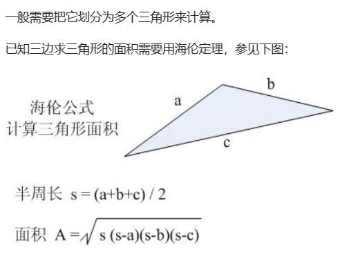

题目思路：


题目代码：

### 题目来源：蓝桥杯-2018省赛-方格计数

题目描述：  
 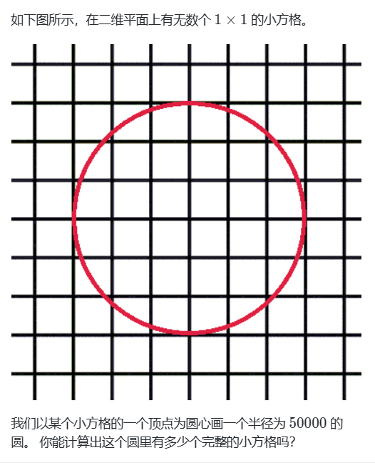

题目思路：


题目代码：

```
#include <iostream>
#include <cmath>
using namespace std;
int main()
{
  long long r=50000,ans=0,pre=0;
  for(long long x=r-1;x>0;x--){
    long long y=sqrt(r*r-x*x);
    ans+=(y-pre)*x*4;
    pre=y;
  }
  cout<<ans;
  return 0;
}
```
