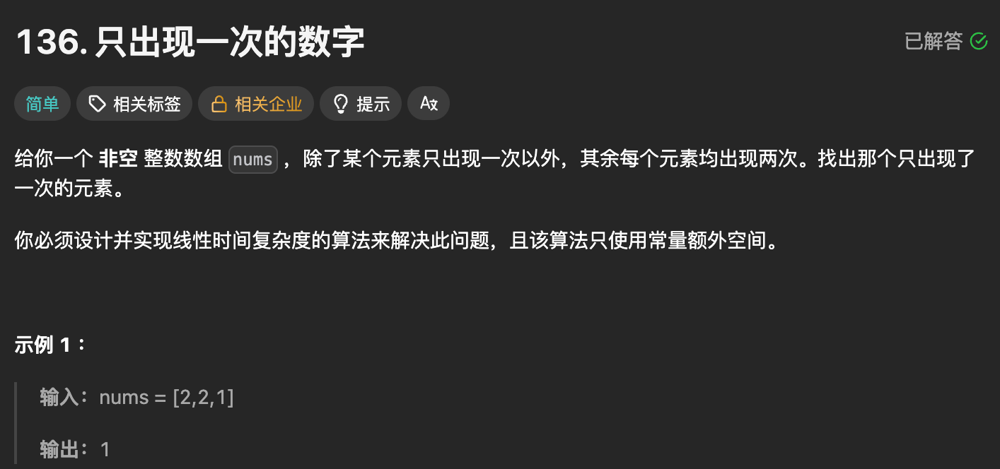

#### 目录

- [知识框架](#_2)
- [No.0 筑基](#No0__4)
- - - [C++ 全部\*\*位运算符号\*\*（刷题必考）](#C__11)
    - [1. 按位与 `&`](#1___14)
    - [2. 按位或 `|`](#2___22)
    - [3. 按位异或 `^`](#3___30)
    - [4. 按位取反 `~`](#4___41)
    - [5. 左移 `<<`](#5___45)
    - [6. 右移 `>>`](#6___53)
    - [刷题最常用 5 个经典公式（直接背）](#_5__63)
    - [最简记忆口诀](#_75)
- [No.1 位运算](#No1__84)
- - [题目来源：LeetCode-136. 只出现一次的数字](#LeetCode136__87)

## 知识框架

## No.0 筑基

> 请先学习下知识点，道友！  
>  题目知识点大部分来源于此：
>
> 题目例题大部分来源于此：

#### C++ 全部**位运算符号**（刷题必考）

一共 **6 个**，全记牢

#### 1. 按位与 `&`

- 规则：**同为1才是1**
- 用途：取低位、清零某些位、判断奇偶

```
1 & 1 = 1
1 & 0 = 0
```

#### 2. 按位或 `|`

- 规则：**有1就是1**
- 用途：把某一位置1

```
1 | 0 = 1
0 | 0 = 0
```

#### 3. 按位异或 `^`

- 规则：**不同为1，相同为0**
- 神级用途：
  1. 两数交换
  2. 找唯一单数
  3. 翻转二进制位

```
1 ^ 1 = 0
1 ^ 0 = 1
```

#### 4. 按位取反 `~`

- 规则：**0变1，1变0**
- 注意：带符号整数会变负数

#### 5. 左移 `<<`

- `a << k` 整体**向左挪k位**
- 等价：**乘 2^k**

```
3 << 1  = 6   乘2
3 << 2  = 12  乘4
```

#### 6. 右移 `>>`

- `a >> k` 整体**向右挪k位**
- 等价：**除以 2^k 向下取整**

```
6 >> 1 = 3
6 >> 2 = 1
```

---

#### 刷题最常用 5 个经典公式（直接背）

1. **判断奇数** `x & 1`
2. **乘2** `x << 1`
3. **除2** `x >> 1`
4. **交换两数**

```
a ^= b; b ^= a; a ^= b;
```

5. **消掉最后一个1** `x & (x-1)`

---

#### 最简记忆口诀

- **& 留1**
- **| 补1**
- **^ 异同**
- **<< 翻倍**
- **>> 减半**
- **~ 全反转**

需要我给你出**5道位运算小题**当场练会吗？

## No.1 位运算

### 题目来源：LeetCode-136. 只出现一次的数字

题目描述：  
 

题目思路：

> 我是进行的直接暴力的，  
>  看题解是 可以 进行 异或

题目代码：

```
class Solution {
public:
    int singleNumber(vector<int>& nums) {

        // 像这种常量额外空间 就是直接把 nums的长度大小的即可

        // 如果按照解体思路的话：首先排除 暴力法 和 辅助哈希表法 。
        int n = nums.size();
        if(n <= 1)return nums[0];
        map<int,int>mp;
        for(int i = 0; i < n; i++)mp[nums[i]]++;
        for(int i = 0; i < n; i++){
            if(mp[nums[i]] == 1)return nums[i];
        }
        return 0;
    }
};
```

```
class Solution {
public:
    int singleNumber(vector<int>& nums) {
        // ^ 异或 虽然 可以说 是这样: 相同的为0;不同的为1
        // 但是这道题主要还是 从计算结果的过程来看 是因为交换律和结合律的存在
        // 就是 直接 连续 ^ 和 交换然后结合的结合是一样的。
        int x = 0;
        for (int &num : nums)  // 1. 遍历 nums 执行异或运算
            x = x ^ num;
        return x;            // 2. 返回出现一次的数字 x
    }
};
```
