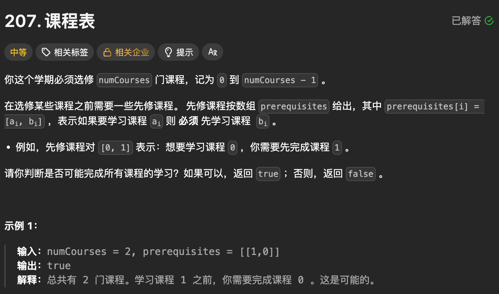
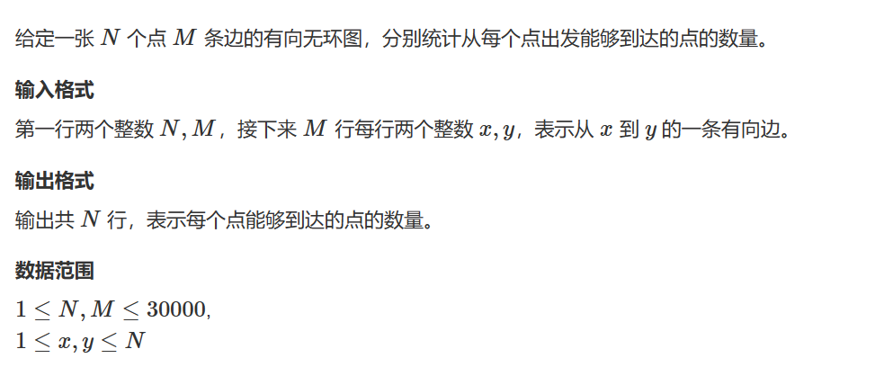

# 【完整题单06、图论算法(拓扑排序)】【无】

> 来源：[【完整题单06、图论算法(拓扑排序)】【无】](https://blog.csdn.net/weixin_51429773/article/details/130533112) · 发布时间：2026-06-14 · 阅读量：粉丝可见

#### 目录

- [知识框架](#_2)
- [No.0 筑基](#No0__4)
- [No.1 拓扑排序](#No1__17)
- - [题目来源：LeetCode-207. 课程表](#LeetCode207__20)
  - [题目来源：Acwing-164. 可达性统计](#Acwing164__128)

## 知识框架

## No.0 筑基

> 请先学习下知识点，道友！  
>  题目知识点大部分来源于此：
>
> 题目例题大部分来源于此：

## No.1 拓扑排序

### 题目来源：LeetCode-207. 课程表

题目描述：



题目思路：

> 核心考点  
>  拓扑排序解决「有向无环图 (DAG)」的环路检测，判断是否能完成所有课程（无环）。  
>  模板化思路（Kahn 算法 / BFS 版）  
>  构建「邻接表」（存储课程的依赖关系）和「入度数组」（每个课程的前置课程数）；  
>  初始化队列：将入度为 0 的课程（无前置课程）入队；  
>  BFS 遍历：每次取出一个课程，减少其后续课程的入度，若后续课程入度变为 0 则入队；  
>  统计已完成的课程数：若等于总课程数，说明无环，返回 true；否则返回 false。

题目代码：

```
class Solution {
private:
    bool res = true;
    vector<int>vised;
    vector<vector<int>>v;

public:
    void dfs(int index, int round){
        vised[index] = 1;
        for(int i = 0; i < v[index].size(); i++){
            int t = v[index][i];
            if(vised[t] == 1){
                res = false;
                return;
            }else if(vised[t] == 0){
                dfs(t, round);
                if(res == false)return;
            }
        }
        vised[index] = 2;
    }
    bool canFinish(int numCourses, vector<vector<int>>& prerequisites) {

        // 感觉不如这样， 随便一个点 dfs，然后参数有本身
        // 看是否过程中有 本身进行判断。

        vised.resize(numCourses, 0);
        v.resize(numCourses);
        res = true;

        
        for(int i = 0; i < prerequisites.size(); i++){
            auto tmp = prerequisites[i];
            v[tmp[1]].push_back(tmp[0]);
        }


        // auto dfs = [&](int index, int round){

        // }

        for(int i = 0; i < numCourses; i++){
            if(res == false)return false;
            if(vised[i] == 0){
                dfs(i, i + 1);
            }
        }
        return res;
    }
};
```

```
class Solution {
public:
    bool canFinish(int numCourses, vector<vector<int>>& prerequisites) {
        // 1. 构建邻接表+入度数组
        vector<vector<int>> adj(numCourses); // adj[i]：课程i的后续课程
        vector<int> inDegree(numCourses, 0); // 入度：前置课程数

        for (auto& p : prerequisites) {
            int cur = p[0], pre = p[1];
            adj[pre].push_back(cur); // 先修pre，再修cur
            inDegree[cur]++;
        }

        // 2. 初始化队列：入度为0的课程
        queue<int> q;
        for (int i = 0; i < numCourses; ++i) {
            if (inDegree[i] == 0) q.push(i);
        }

        // 3. 拓扑排序
        int count = 0; // 已完成的课程数
        while (!q.empty()) {
            int u = q.front();
            q.pop();
            count++;
            // 遍历u的后续课程，减少入度
            for (int v : adj[u]) {
                inDegree[v]--;
                if (inDegree[v] == 0) q.push(v);
            }
        }

        // 4. 判断是否无环（所有课程都完成）
        return count == numCourses;
    }
};
```

### 题目来源：Acwing-164. 可达性统计

题目描述：  
 

题目思路：

> 下面这个是超时的，dfs超时的，应该用拓扑排序的

题目代码：

```
#include <bits/stdc++.h>
using namespace std;
#define N 100010
#define inf 0x3f3f3f3f
#define debug(x) cout<<#x<<" = "<<x<<endl;
#define LL long long
const int mod = 1e9+7;
int n,m,k,d,g;
int x,y,z;
string str;
char ch;
vector<int>v[N];
LL dp[N]={0};

int vis[N];
void dfs(int index,int &num){
    if(dp[index]!=0){
        num=num+dp[index];
        return;
    }
    vis[index]=1;
    num++;

    for(int i=0;i<v[index].size();i++){
        if(vis[v[index][i]]==0){
            dfs(v[index][i],num);
        }
    }
}
int main()
{
    ios::sync_with_stdio(false),cin.tie(0),cout.tie(0);

    cin>>n>>m;
    for(int i=1;i<=m;i++){
        cin>>x>>y;
        v[x].push_back(y);
    }

    for(int i=1;i<=n;i++){
        memset(vis,0,sizeof(vis));
        int num=0;
        dfs(i,num);
        dp[i]=num;
        cout<<num<<endl;
    }
    return 0;
}
```
