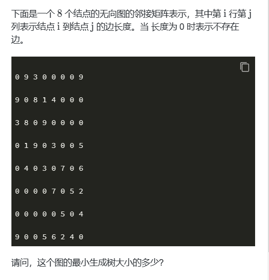

# 【完整题单06、图论算法(最小生成树)】【无】

> 来源：[【完整题单06、图论算法(最小生成树)】【无】](https://blog.csdn.net/weixin_51429773/article/details/129930700) · 发布时间：2026-06-03 · 阅读量：粉丝可见

#### 目录

- [知识框架](#_2)
- [No.0 筑基](#No0__4)
- [No.1 图的转最小生成树](#No1__17)
- - [题目来源：蓝桥杯-2022省赛模拟-生成树](#2022_19)

## 知识框架

## No.0 筑基

> 请先学习下知识点，道友！  
>  题目知识点大部分来源于此：[OI WiKi的最小生成树](https://oi-wiki.org/graph/mst/)
>
> 题目例题大部分来源于此：[LeetCode的最小生成树题目](https://leetcode.cn/tag/minimum-spanning-tree/problemset/)

## No.1 图的转最小生成树

### 题目来源：蓝桥杯-2022省赛模拟-生成树

题目描述：  
 

题目思路：

题目代码：
