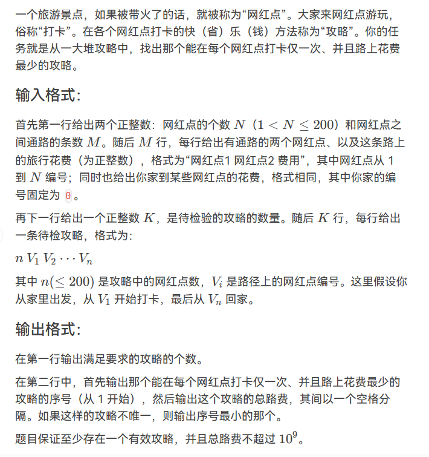
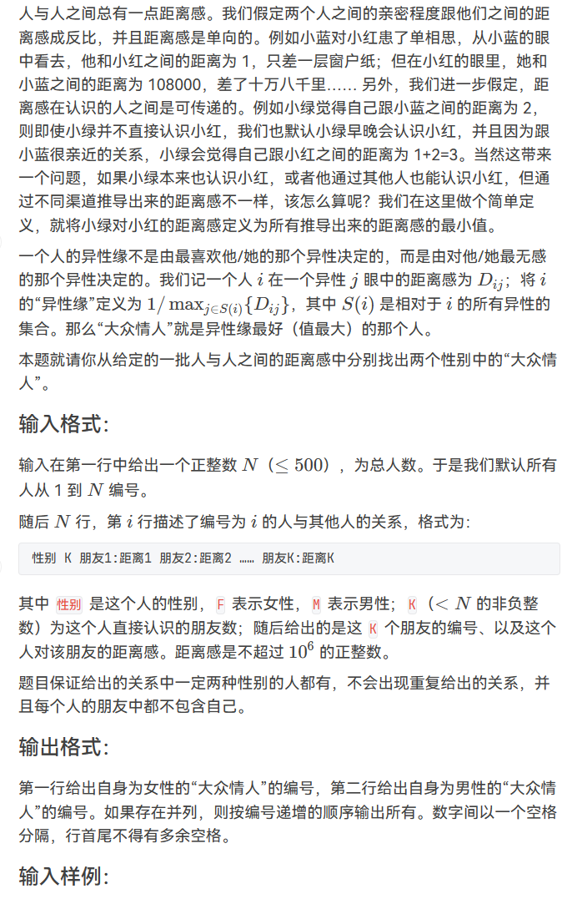
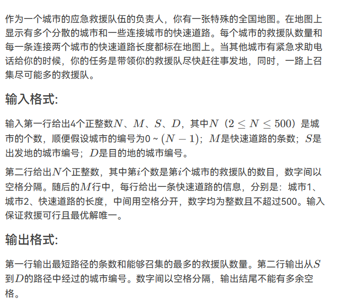
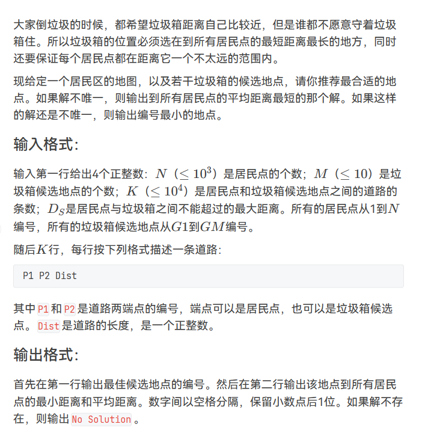
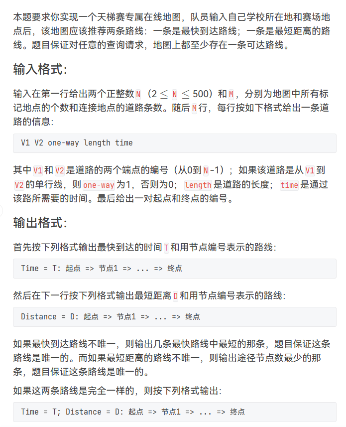
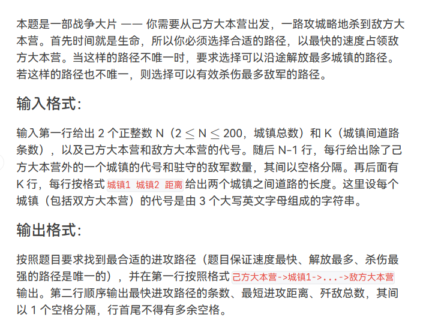
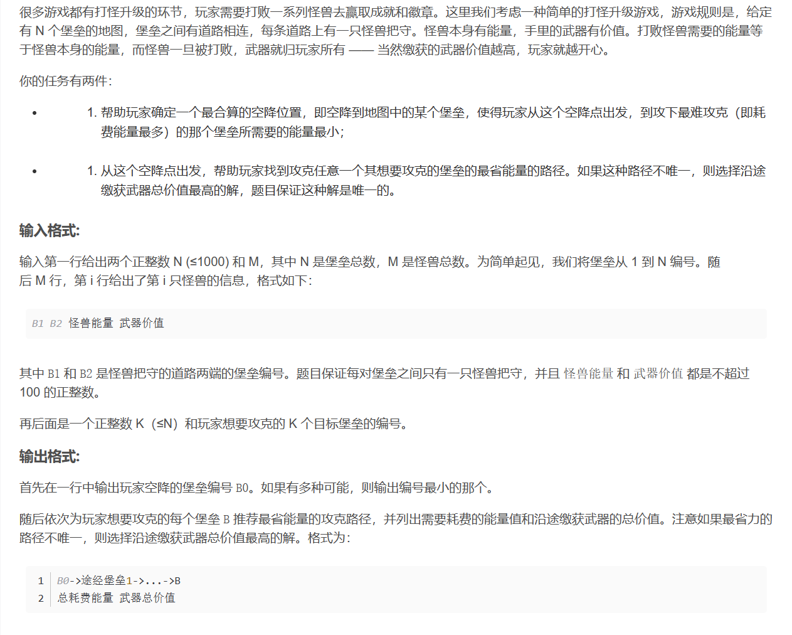
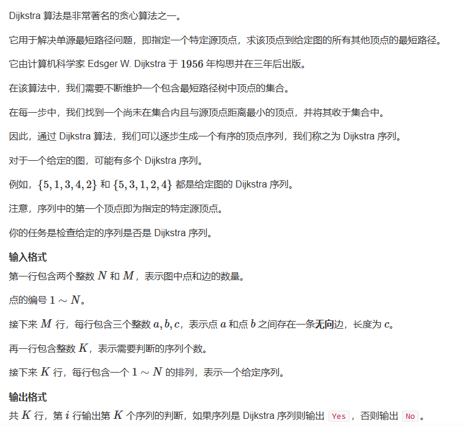
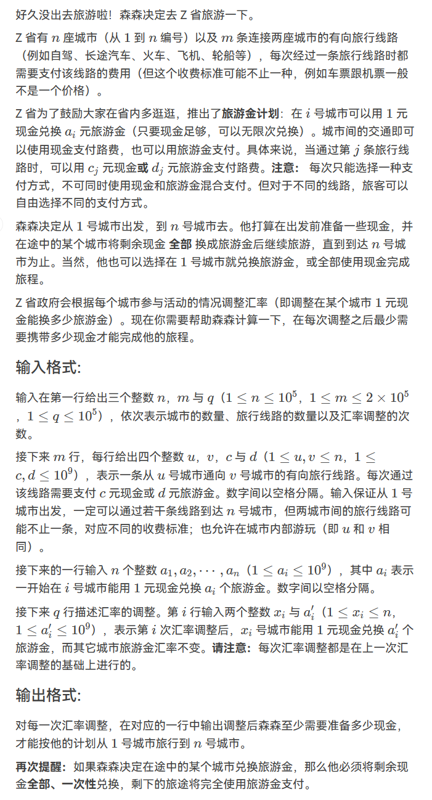
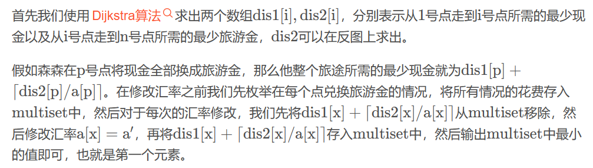

# 【完整题单06、图论算法(最短路径)】【无】

> 来源：[【完整题单06、图论算法(最短路径)】【无】](https://blog.csdn.net/weixin_51429773/article/details/129358241) · 发布时间：2026-06-03 · 阅读量：公开

#### 目录

- [知识框架](#_2)
- [No.0 筑基](#No0__4)
- [No.1 MP[ N ][N】版本Dijs最短路径模板给出路径让判断是否可行](#No1_MP_N_NDijs_9)
- - [题目来源：PTA-L2-036 网红点打卡攻略](#PTAL2036__10)
- [No.2 floyd](#No2_floyd_96)
- - [题目来源：PTA-L2-044 大众情人](#PTAL2044__98)
- [No.3 完全体求各种东西的dijs](#No3_dijs_211)
- - [题目来源：PTA-L2-001 紧急救援](#PTAL2001__213)
  - [题目来源：PTA-L3-005 垃圾箱分布](#PTAL3005__325)
  - [题目来源：PTA-L3-007 天梯地图](#PTAL3007__441)
  - [题目来源：PTA-L3-011 直捣黄龙](#PTAL3011__740)
  - [题目来源：RoboCom-7-3 打怪升级](#RoboCom73__841)
- [No.4 dijkstra](#No4_dijkstra_957)
- - [题目来源：Acwing-4275-dijkstra序列](#Acwing4275dijkstra_958)
  - [题目来源：PTA-L3-028 森森旅游](#PTAL3028__1021)
- [No.n 牛客网-最短路径](#Non__1131)
- - [Bellman-Ford算法](#BellmanFord_1183)
  - [Dijkstra算法/Dijkstra + 优先队列的优化](#DijkstraDijkstra___1191)
  - [floyd-Warshall算法](#floydWarshall_1206)
  - [SPFA](#SPFA_1212)
  - [NC14369：最短路：很直接](#NC14369_1229)
  - [NC15522：武 ：很直接](#NC15522__1295)
  - [NC15549：小木乃伊到我家](#NC15549_1363)
  - [NOI1997：最优乘车](#NOI1997_1438)
  - [NC22947：香甜的黄油](#NC22947_1544)
  - [NC17511：公交线路](#NC17511_1629)
  - [NC14292：Travel](#NC14292Travel_1699)

## 知识框架

## No.0 筑基

> 请先学习下知识点，道友！  
>  题目知识点大部分来源于此：

## No.1 MP[ N ][N】版本Dijs最短路径模板给出路径让判断是否可行

### 题目来源：PTA-L2-036 网红点打卡攻略

题目描述：  
 

题目思路：

题目代码：

```
//注意使用int 而不是 double ，注意出现flag=1的 三 个条件
//对于N要进行适应性的更改，对于字段错误
// //          if(num==inf || vis[ans[i]]==1 ||x!=n ){
#include<bits/stdc++.h>
using namespace std;
#define inf 0x3f3f3f3f
#define N 205
int n,m,k,g,d;
int x,y,z;
char ch;
string str;
vector<int>v[N];
int mp[N][N];
int vis[N];
int dis[N];

int main() {
    cin>>n>>m;
    //因为是判断，即只要在main里面搞就行了
    //初始化；
    memset(vis,0,sizeof(vis));
    memset(mp,inf,sizeof(mp));
    memset(dis,inf,sizeof(dis));
    for(int i=0;i<=n;i++)mp[i][i]=0;
    for(int i=0;i<m;i++){
        cin>>x>>y>>z;
        mp[x][y]=mp[y][x]=z;
    }
    //初始化结束
    
    cin>>k;
    int count=0;
    int start=0;
    int minn=inf;
    for(int i=1;i<=k;i++){
        cin>>x;
        vector<int>ans;//用ans来存储路径，方便接下来进行判断
        
        //因为要计算别处景点到家(0)的距离，即先把0放入；；
        ans.push_back(0);
        for(int i=0;i<x;i++){
            cin>>y;
            ans.push_back(y);
        }
        ans.push_back(0);
        
        
        int flag=0;
        int value=0;
        memset(vis,0,sizeof(vis));
        for(int j=1;j<ans.size();j++){
            int num=mp[ans[j]][ans[j-1]];
            if(num==inf || vis[ans[j]]==1 || x!=n){//判断条件，每个景点都只访问一次；即访问，还只需一次；
                flag=1;
                break;
            }
            vis[ans[j]]=1;
            value+=num;
        }

        if(flag==1)continue;

        count++;
        if(value<minn){
            minn=value;
            start=i;
        }
    }
    cout<<count<<endl;
    cout<<start<<" "<<minn<<endl;
	return 0;
}
```

## No.2 floyd

### 题目来源：PTA-L2-044 大众情人

题目描述：



题目思路：


题目代码：

```
//对于 每个 结点  找 异性且 距离 最远的结点，得到该 数值；存储，然后找到 最小的；
// 先弗洛伊德，然后对于每个 都遍历得到数值； 
//对于N要进行适应性的更改，对于字段错误
#include<bits/stdc++.h>
using namespace std;
#define inf 0x3f3f3f3f
#define N 505
int n,m,k,g,d;
int x,y,z;
char ch;
string str;
vector<int>v[N];
#define PII pair<int,int>

int mp[510][510];
int sex[505];


bool cmp(PII x,PII y){
	if(x.second!=y.second){
		return x.second<y.second;
	}else if(x.first!=y.first){
		return x.first<y.first;
	}
}


void floyd(){
	//遍历每个顶点，将其作为其它顶点之间的中间顶点，更新 mp 数组
	for(int k = 1; k <= n; k ++ )
    {
        for(int i = 1; i <= n; i ++ )
        {
            for(int j = 1; j <= n; j ++ )
            { //如果新的路径比之前记录的更短，则更新 mp 数组
                mp[i][j] = min(mp[i][j], mp[i][k] + mp[k][j]);
            }
        }
    }
}

int main()
{
    memset(mp, inf, sizeof mp); //设初始距离为无穷 
    for(int i=1;i<=n;i++)mp[i][i]=0;
    
    cin >> n;
    for(int i=1;i<=n;i++){
    	cin>>ch>>k;
    	if(ch=='M')sex[i]=1;
    	else sex[i]=0;
    	while(k--){
    		cin>>x>>ch>>y;
    		mp[i][x]=y;
		}
	}
  

    //以xia为Floyd最短路的模板
	floyd();
	
	vector<PII>woman,man;
    for(int i = 1; i <= n; i ++ ) //i = 1开始遍历，遍历每个异性和i的距离 
    {
    	int maxx = -1;
    	for(int j = 1; j <= n; j ++ )
    	{
    		if(i != j && sex[i] != sex[j]) //如果是异性就取距离最大值 
    		{
    			maxx = max(maxx, mp[j][i]);
			}
		}
		if(sex[i] == 1) man.push_back({i, maxx});
		else woman.push_back({i,  maxx});
	}
	sort(man.begin(), man.end(), cmp);
	sort(woman.begin(), woman.end(), cmp);
	
	//按题目要求输出
	cout << woman[0].first;
	for(int i = 1; i < woman.size(); i ++ )
	{
		if(woman[i].second == woman[0].second) cout << " " << woman[i].first;
	}
	cout<<endl;
	
	
	
	cout << man[0].first;
	for(int i = 1; i < man.size(); i ++ )
	{
		if(man[i].second == man[0].second) cout << " " << man[i].first;
	}
    return 0;
}
```

## No.3 完全体求各种东西的dijs

### 题目来源：PTA-L2-001 紧急救援

题目描述：  
 

题目思路：

题目代码：

```
//这道题给的教训就是：：#define N 要恰到好处不能太大，也不能太小。。切记
//对于N要进行适应性的更改，对于字段错误
#include<bits/stdc++.h>
using namespace std;
#define inf 0x3f3f3f3f
#define N 505
int n,m,k,s,g,d;
int x,y,z;
char ch;
string str;
vector<int>v[N];
int mp[N][N];
int dis[N];
int vis[N];
int way[N];
//分割线
int people[N];
int cnt[N];
int num[N];
void dij(int index){
    //初始化vis，dis，以及main上面的变量；；
    memset(vis,0,sizeof(vis));
    memset(dis,inf,sizeof(dis));
    for(int i=0;i<n;i++)dis[i]=mp[index][i];
    dis[index]=0;
    way[index]=index;
    //初始化的人员，初始化的道路选择；；
    num[index]=people[index];
    cnt[index]=1;
    
    //找n个最短点，一个for找到一个点，vis【点】=1；
    //显然，第一个点是自己本身dis【index】=0；
    
    //第一部分：找最短的
    for(int i=0;i<n;i++){
        int u=-1,minn=inf;
        for(int j=0;j<n;j++){
            if(vis[j]==0&&dis[j]<minn){
                u=j;
                minn=dis[j];
            }
        }
        if(u==-1)break;
        vis[u]=1;
        //第二部分：更新距离
        for(int j=0;j<n;j++){
            if(vis[j]==0&&dis[j]>dis[u]+mp[u][j]){
                dis[j]=dis[u]+mp[u][j];
                num[j]=num[u]+people[j];
                way[j]=u;
                cnt[j]=cnt[u];
                     //c出现下面这个条件啊，就会再出来一个最优判断。
            }else if(vis[j]==0&&dis[j]==dis[u]+mp[u][j]){
                cnt[j]=cnt[u]+cnt[j];
                if(num[j]<num[u]+people[j]){
                    way[j]=u;
                    num[j]=num[u]+people[j];
                }
                
            }
        }
    }
}

int main() {
    cin>>n>>m>>s>>d;
    for(int i=0;i<n;i++)cin>>people[i];
    
    //初始化mp
    memset(mp,inf,sizeof(mp));
    for(int i=0;i<n;i++)mp[i][i]=0;
    for(int i=0;i<m;i++){
        cin>>x>>y>>z;
        mp[x][y]=mp[y][x]=z;
    }
    //初始化mp结束
    
    dij(s);
    cout<<cnt[d]<<" "<<num[d]<<endl;
    
    //输出路径用ans倒着存起来；
    vector<int>ans;
    int t=d;
    while(t!=s){
        ans.push_back(t);
        t=way[t];
    }
    ans.push_back(s);
    //存结束
    
    //输出,尽量不用ok，这样快，简便
    int ok=1;
    for(int i=ans.size()-1;i>=0;i--){
        if(i!=0)cout<<ans[i]<<" ";
        else cout<<ans[i];
    }
	return 0;
}
```

### 题目来源：PTA-L3-005 垃圾箱分布

题目描述：  
 

题目思路：

题目代码：

```
//这个注意点时最短距离最远加上平均距离，这两个；；
//但是最后4分不知道为啥怎么办？好像是精度的问题：
//对于N要进行适应性的更改，对于字段错误
#include<bits/stdc++.h>
using namespace std;
#define inf 0x3f3f3f3f
#define N 1020
int n,m,k,g,d;
int x,y,z;
char ch;
string str;
vector<int>v[N];
int dis[N]={0};
int vis[N]={0};
int mp[N][N]={0};

void dij(int index ){
    memset(dis,inf,sizeof(dis));
    memset(vis,0,sizeof(vis));
    dis[index]=0;
    
    for(int i=0;i<n+m;i++){
        int u=-1,minn=inf;
        for(int j=1;j<=n+m;j++){
            if(vis[j]==0&& dis[j]<minn){
                u=j;
                minn=dis[j];
            }
        }
        if(u==-1){
            break;
        }
        vis[u]=1;
        for(int j=1;j<=n+m;j++){
            if(vis[j]==0 &&dis[j]>dis[u]+mp[u][j]){
                dis[j]=dis[u]+mp[u][j];
            }
        }
    }
}
int main() {
    cin>>n>>m>>k>>d;
    memset(mp,inf,sizeof(mp));
    for(int i=1;i<N;i++)mp[i][i]=0;
    string a,b;
    while(k--){
        cin>>a>>b>>z;
        if(a[0]=='G'){
            x=n+a[1]-'0';
        }else{
            x=a[0]-'0';
        }
        if(b[0]=='G'){
            y=n+b[1]-'0';
            
        }else{
            y=b[0]-'0';
        }
        mp[x][y]=mp[y][x]=z;
    }
    double avedis=0;
    int start=0;
    double premindis=0;
    for(int i=n+1;i<=n+m;i++){
        double sum=0;
        int flag=0;
        int mindis=inf;
        dij(i);
        for(int j=1;j<=n;j++){
            if(dis[j]>d){
                flag=1;
                break;
            }
            sum=sum+dis[j];
            if(dis[j]<mindis)mindis=dis[j];
        }
        if(flag==1){
            continue;
        }
        if(mindis>premindis){
            start=i;
            premindis=mindis;
            avedis=sum;
        }else if(mindis==premindis){
            if(sum<avedis){
                start=i;
                premindis=mindis;
                avedis=sum;
            }
            
        }
    }
    if(start==0){
        cout<<"No Solution"<<endl;
    }else{
        cout<<"G"<<start-n<<endl;
        printf("%.1f",premindis);
        printf(" %.1f",(double)avedis/n);
    }
	return 0;
}
```

### 题目来源：PTA-L3-007 天梯地图

题目描述：  
 

题目思路：

题目代码：

```
//对于N要进行适应性的更改，对于字段错误
#include<bits/stdc++.h>
using namespace std;
#define inf 0x3f3f3f3f
#define N 505
int n,m,k,g,d;
int x,y,z;
char ch;
string str;
vector<int>v[N];

int dislen[N];
int distime[N];
int vis[N];
int mpT[N][N];
int mpL[N][N];
int wayT[N];
int wayL[N];
void dijLen(int index){
    memset(vis,0,sizeof(vis));
    memset(dislen,inf,sizeof(dislen));
    for(int i=0;i<n;i++)dislen[i]=mpL[index][i];
    dislen[index]=0;

    int jiedian[N]={0};
    for(int i=0;i<n;i++){
        int u=-1,minn=inf;
        for(int j=0;j<n;j++){
            if(vis[j]==0&&dislen[j]<minn){
                u=j;
                minn=dislen[j];
            }
        }

        if(u==-1)break;
        vis[u]=1;
        for(int j=0;j<n;j++){
            if(vis[j]==0&&dislen[j]>dislen[u]+mpL[u][j]){
                dislen[j]=dislen[u]+mpL[u][j];
                wayL[j]=u;
                jiedian[j]=jiedian[u]+1;

            }else if(vis[j]==0 && dislen[j]==dislen[u]+mpL[u][j]){
                if(jiedian[j]>jiedian[u]+1){
                    jiedian[j]=jiedian[u]+1;
                    wayL[j]=u;
                }

            }
        }
    }

}
void dijTime(int index){
    memset(vis,0,sizeof(vis));
    memset(distime,inf,sizeof(distime));
    //如果少了下面这一行的代码，则会输出多个开头
    for(int i=0;i<n;i++)distime[i]=mpT[index][i];
    int dis[N];//复制一份最短，
    memset(dis,inf,sizeof(dis));
    for(int i=0;i<n;i++)dis[i]=dislen[i];
    dis[index]=distime[index]=0;
    for(int i=0;i<n;i++){
        int u=-1,minn=inf;
        for(int j=0;j<n;j++){
            if(vis[j]==0 && distime[j]<minn){
                u=j;
                minn=distime[j];
            }
        }
        if(u==-1)break;
        vis[u]=1;
        for(int j=0;j<n;j++){
            if(vis[j]==0 && distime[j]>distime[u]+mpT[u][j]){

                wayT[j]=u;
                distime[j]=distime[u]+mpT[u][j];
                dis[j]=dis[u]+mpL[u][j];

            }else if(vis[j]==0 && distime[j]==distime[u]+mpT[u][j]){
                if(dis[j]>dis[u]+mpL[u][j]){
                    wayT[j]=u;
                    dis[j]=dis[u]+mpL[u][j];
                }

            }
        }
    }
}
int main() {
    cin>>n>>m;
    memset(mpT,inf,sizeof(mpT));
    memset(mpL,inf,sizeof(mpL));
    memset(wayL,-1,sizeof(wayL));
    memset(wayT,-1,sizeof(wayT));
    int time,len;
    while(m--){
        cin>>x>>y>>z>>time>>len;
        if(z==1){
            mpT[x][y]=time;
            mpL[x][y]=len;
        }else{
            mpT[x][y]=mpT[y][x]=time;
            mpL[x][y]=mpL[y][x]=len;
        }
    }
    int start,end;
    cin>>start>>end;
    dijLen(start);
    dijTime(start);


    vector<int>ansl;
    vector<int>anst;
    int mid=end;
    while(mid!=-1){
        ansl.push_back(mid);
        mid=wayL[mid];
    }
    ansl.push_back(start);
    
     mid=end;
    while(mid!=-1){
        anst.push_back(mid);
        mid=wayT[mid];
    }
    anst.push_back(start);


    if(ansl==anst){
        cout << "Time = " <<dislen[end]<<"; Distance = "<<distime[end]<<": ";
        for(int i=ansl.size()-1;i>=0;i--){
            if(i==0)cout<<ansl[i];
            else cout<<ansl[i]<<" => ";
        }
    }else{
        cout<< "Time = " <<dislen[end]<<": ";
        for(int i=ansl.size()-1;i>=0;i--){
            if(i==0)cout<<ansl[i];
            else cout<<ansl[i]<<" => ";
        }
        cout<<endl;
        cout<< "Distance = "<<distime[end]<<": ";
        for(int i=anst.size()-1;i>=0;i--){
            if(i==0)cout<<anst[i];
            else cout<<anst[i]<<" => ";
        }
        cout<<endl;
    }
	return 0;
}


///下面是找到的网上的正确的不知道为啥：：
#include<bits/stdc++.h>
#define inf 0x3f3f3f3f
using namespace std;
int n, m, v1, v2, oneway, length, ti, s, e, tmp, flag;
int disto[510], dis[510][510], timeto[510], tme[510][510], disvis[510], timevis[510], sum[510];
int dispre[510], timepre[510];
int a[510], b[510], ka, kb;
int fdisto[510];
void Dijstrldis() {
  disto[s] = 0;
  for(int i = 0; i < n; i++) {
    int minn = inf, next = -1;
    for(int j = 0; j < n; j++) {
      if(disvis[j] == 0 && disto[j] < minn) {
        minn = disto[j];
        next = j;
      }
    }
    if(next == -1) break;
    else
      disvis[next] = 1;
    for(int j = 0; j < n; j++) {
      if(disvis[j] == 0 && disto[next] + dis[next][j] < disto[j]) {
        disto[j] = disto[next] + dis[next][j];
        dispre[j] = next;
        sum[j] = sum[next] + 1;
      } else if(disvis[j] == 0 && disto[next] + dis[next][j] == disto[j]) {
        if(sum[next] + 1 < sum[j]) {
          sum[j] = sum[next] + 1;
          dispre[j] = next;
        }
      }
    }
  }
}
void Dijstrltime() {
  timeto[s] = 0;
  for(int i = 0; i < n; i++) {
    int minn = inf, next = -1;
    for(int j = 0; j < n; j++) {
      if(timevis[j] == 0 && timeto[j] < minn) {
        minn = timeto[j];
        next = j;
      }
    }
    if(next == -1) break;
    else
      timevis[next] = 1;
    for(int j = 0; j < n; j++) {
      if(timevis[j] == 0 && timeto[next] + tme[next][j] < timeto[j]) {
        timeto[j] = timeto[next] + tme[next][j];
        timepre[j] = next;
        fdisto[j] = fdisto[next] + dis[next][j];
      } else if(timevis[j] == 0 && timeto[next] + tme[next][j] == timeto[j]) {
        if(fdisto[j] > fdisto[next] + dis[next][j]) {
          timepre[j] = next;
          fdisto[j] = fdisto[next] + dis[next][j];
        }
      }
    }
  }
}
int main() {
    cin>>n>>m;
    memset(dis,inf,sizeof(dis));
    memset(tme,inf,sizeof(tme));
    
    
  for(int i = 0; i < n; i++) {
    sum[i] = 1;
    disto[i] = inf;
    timeto[i] = inf;
  }
  for(int i = 0; i < m; i++) {
    scanf("%d%d%d%d%d", &v1, &v2, &oneway, &length, &ti);
    dis[v1][v2] = length;
    tme[v1][v2] = ti;
    if(oneway == 0) {
      dis[v2][v1] = length;
      tme[v2][v1] = ti;
    }
  }
  scanf("%d%d", &s, &e);
  Dijstrldis();
    
    
  tmp = e;
  ka = 0;
  a[ka++] = tmp;
  while(tmp != s) {
    tmp = dispre[tmp];
    a[ka++] = tmp;
  }
  Dijstrltime();
  tmp = e;
  kb = 0;
  b[kb++] = tmp;
  while(tmp != s) {
    tmp = timepre[tmp];
    b[kb++] = tmp;
  }
  flag = 1;
  if(ka == kb) {
    for(int i = 0; i < ka; i++) {
      if(a[i] != b[i]) {
        flag = 0;
        break;
      }
    }
  } else {
    flag = 0;
  }
  if(flag) {
    printf("Time = %d; Distance = %d: ", timeto[e], disto[e]);
    for(int i = ka-1; i >= 0; i--) 
      printf(i == ka-1 ? "%d" : " => %d", a[i]);
    printf("\n");
  } else {
    printf("Time = %d: ", timeto[e]);
    for(int i = kb-1; i >= 0; i--) 
      printf(i == kb-1 ? "%d" : " => %d", b[i]);
    printf("\nDistance = %d: ", disto[e]);
    for(int i = ka-1; i >= 0; i--) 
      printf(i == ka-1 ? "%d" : " => %d", a[i]);
    printf("\n");
  }
  return 0;
}
```

### 题目来源：PTA-L3-011 直捣黄龙

题目描述：  
 

题目思路：

题目代码：

```
#include<bits/stdc++.h>
#define inf 0x3f3f3f3f
using namespace std;
int n, k, len;
int to[210], dis[210][210], sump[210], sum[210], num[210], pre[210], vis[210], sumpath[210];
string s1, s2, s, u, v;
map<string, int> m1;
map<int, string> m2;
void Dijstr(int start) {
  to[start] = 0;
  for(int i = 1; i <= n; i++) {
    int minn = inf, next = -1;
    for(int j = 1; j <= n; j++) {
      if(vis[j] == 0 && to[j] < minn) {
        minn = to[j];
        next = j;
      }
    }
    if(next == -1) break;
    else
      vis[next] = 1;
    for(int j = 1; j <= n; j++) {
      if(vis[j] == 0 && to[next] + dis[next][j] < to[j]) {
        to[j] = to[next] + dis[next][j];
        sump[j] = sump[next] + 1;
        sum[j] = sum[next] + num[j];
        sumpath[j] = sumpath[next];
        pre[j] = next;
      } else if(vis[j] == 0 && to[next] + dis[next][j] == to[j]) {
        sumpath[j]= sumpath[j] + sumpath[next];
        if(sump[next] + 1 > sump[j]) {
          sump[j] = sump[next] + 1;
          sum[j] = sum[next] + num[j];
          pre[j] = next;
        } else if(sump[next] + 1 == sump[j]) {
          if(sum[j] < sum[next] + num[j]) {
            sum[j] = sum[next] + num[j];
            pre[j] = next;
          }
        }
      }
    }
  }
}
int main() {
  cin >> n >> k >> s1 >> s2;
  for(int i = 1; i <= n; i++) {
    for(int j = 1; j <= n; j++) {
      dis[i][j] = inf;
    }
  }
  for(int i = 1; i <= n; i++) {
    sump[i] = 1;
    sumpath[i] = 1;
    to[i] = inf;
  }
  m1[s1] = 1;
  m2[1] = s1;
  for(int i = 2; i <= n; i++) {
    cin >> s >> num[i];
    m1[s] = i;
    m2[i] = s;
    sum[i] = num[i];
  }
  for(int i = 0; i < k; i++) {
    cin >> u >> v >> len;
    dis[m1[u]][m1[v]] = len;
    dis[m1[v]][m1[u]] = len;
  }
  Dijstr(1);
  int t = m1[s2], k = 0, path[210];
  path[k++] = t;
  while(t != 1) {
    t = pre[t];
    path[k++] = t;
  } 
  for(int i = k-1; i >= 0; i--) {
    if(i == k-1) cout << m2[path[i]];
    else
      cout << "->" << m2[path[i]];
  }
  printf("\n%d %d %d\n", sumpath[m1[s2]], to[m1[s2]], sum[m1[s2]]);
  return 0;
}
```

### 题目来源：RoboCom-7-3 打怪升级

题目描述：  
 

题目思路：

> 题目部分解释：“即空降到地图中的某个堡垒，使得玩家从这个空降点出发，到攻下最难攻克（即耗费能量最多）的那个堡垒所需要的能量最小；“

> 上面那个的意思是对于每一个点都dij一下，然后记录该点到其它点到底是哪一个消耗最大，同理得到n个消耗最大，然后找到消耗最大里面的最小的；也是相当于flod然后对于每个点找到最大的，再进行比较找最小的；；

题目代码：

```
#include <bits/stdc++.h>
using namespace std;
#define N 100100
#define inf 0x3f3f3f3f
int x,y,z;
int n,m,s,d;
string str;
char ch;
vector<int>v[N];
int mp[N][N];
int value[N][N];
int dis[N][N];
int vis[N]={0};
int disss[N];
int disvv[N];
int pre[N];
void dij(int index){
    memset(vis,0,sizeof(vis));
    memset(disss,inf,sizeof(disss));
    memset(disvv,0,sizeof(disvv));
    for(int i=1;i<=n;i++)disss[i]=mp[index][i];
    disss[index]=0;
    pre[index]=index;

    for(int i=1;i<=n;i++){
        int u=-1,minn=inf;
        for(int j=1;j<=n;j++){
            if(vis[j]==0&&disss[j]<minn){
                u=j;
                minn=disss[j];
            }
        }

    if(u==-1)break;
    vis[u]=1;
    for(int i=1;i<=n;i++){

        if(disss[i]>disss[u]+mp[u][i]){
            disss[i]=disss[u]+mp[u][i];
            disvv[i]=disvv[u]+value[u][i];
            pre[i]=u;
        }else if(disss[i]==disss[u]+mp[u][i]){
            if(disvv[i]<disvv[u]+value[u][i]){
                disvv[i]=disvv[u]+value[u][i];
                pre[i]=u;
            }


        }
    }

    }


}
int main()
{
    cin>>n>>m;
    //1~N
    memset(mp,inf,sizeof(mp));
    memset(value,0,sizeof(value));
    memset(dis,inf,sizeof(dis));
    while(m--){
        cin>>x>>y>>s>>z;
        mp[x][y]=mp[y][x]=s;
        dis[x][y]=dis[y][x]=s;
        value[x][y]=value[y][x]=z;
    }

    for(int k=1;k<=n;k++){
        for(int i=1;i<=n;i++){
            for(int j=1;j<=n;j++){
                dis[i][j]=min(dis[i][j], dis[i][k]+dis[k][j]);
            }
        }
    }
    vector<int>min_x;
    for(int i=1;i<=n;i++){
        int maxx=0;
        for(int j=1;j<=n;j++){
            if(maxx<dis[i][j]){
                maxx=dis[i][j];
            }
        }
        min_x.push_back(maxx);
    }
    sort(min_x.begin(),min_x.end());
    int start=min_x[0];
    dij(start);
    cin>>m;
    while(m--){
        
        
        
    }


    return 0;
}
```

## No.4 dijkstra

### 题目来源：Acwing-4275-dijkstra序列

题目描述：  
 

题目思路：

题目代码：

```
//对于N要进行适应性的更改，对于字段错误
#include<bits/stdc++.h>
using namespace std;
#define inf 0x3f3f3f3f
#define N 100100
int n,m,k,g,d;
int x,y,z;
char ch;
string str;
vector<int>v[N];
int mp[1005][1005];
int vis[N]={0};
int dist[N];
int p[N];
int dij(int index){
	memset(dist,inf,sizeof(dist));
	memset(vis,0,sizeof(vis));
	for(int i=1;i<=n;i++)dist[i]=mp[index][i];
	dist[index]=0;
	vis[index]=1;
	for(int i=1;i<=n;i++){
		int t=p[i];
		vis[t]=1;
		for(int j=1;j<=n;j++){
			if(vis[j]==0&&dist[j]<dist[t]){
				return 0;
			}
		}
		for(int j=1;j<=n;j++){
			if(dist[j]>dist[t]+mp[t][j]){
				dist[j]=dist[t]+mp[t][j];
			}
		}

	}
}
int main() {
	cin>>n>>m;
	memset(mp,inf,sizeof(mp));
	while(m--){
		cin>>x>>y>>z;
		mp[x][y]=mp[y][x]=z;
	}
	cin>>m;
	while(m--){
		for(int i=1;i<=n;i++)cin>>p[i];
		if(dij(p[1]))cout<<"Yes"<<endl;
		else cout<<"No"<<endl;
	}
	return 0;
}
```

### 题目来源：PTA-L3-028 森森旅游

题目描述：  
 

题目思路：

> 大致思路就是找个点 q，从开始到q，以及结尾到q的最短消费路径。



题目代码：

```
//又是一分没有的代码啊啊啊啊

#include <bits/stdc++.h>
using namespace std;
#define N 1001
#define inf 0x3f3f3f3f
string str;
char ch;
int n,m,s,d,k;
int x,y,z;
vector<int>v[N];
int mppre[N][N];
int mppost[N][N];
int dispre[N];
int dispost[N];
int vis[N];
void dijpre(int index){
    memset(dispre,inf,sizeof(dispre));
    memset(vis,0,sizeof(0));
    for(int i=1;i<=n;i++)dispre[i]=mppre[index][i];
    dispre[index]=0;
    for(int i=1;i<=n;i++){
        int u=-1,minn=inf;
        for(int j=1;j<=n;j++){
            if(vis[j]==0&&dispre[j]<minn){
                minn=dispre[j];
                u=j;
            }
        }
        if(u==-1)break;
        vis[u]=1;
        for(int j=1;j<=n;j++){
            dispre[j]=min(dispre[j],dispre[u]+mppre[u][j]);
        }
    }
}
void dijpost(int index){
    memset(dispost,inf,sizeof(dispost));
    memset(vis,0,sizeof(vis));
    for(int i=n;i>=1;i--)dispost[i]=mppost[index][i];
    dispost[index]=0;
    for(int i=1;i<=n;i++){
        int u=-1,minn=inf;
        for(int j=1;j<=n;j++){
            if(vis[j]==0&&dispost[j]<minn){
                minn=dispost[j];
                u=j;
            }
        }
        if(u==-1)break;
        vis[u]=1;
        for(int j=1;j<=n;j++){
            dispost[j]=min(dispost[j],dispost[u]+mppost[u][j]);
        }
    }
}
int main()
{
    memset(mppre,inf,sizeof(mppre));
    memset(mppost,inf,sizeof(mppost));
    
    int value[N];
    cin>>n>>m>>k;
    for(int i=0;i<m;i++){
        cin>>x>>y>>z>>d;
        if(x==y){
        mppre[i][i]=0;
        mppost[i][i]=0;
            continue;
        }
        mppre[x][y]=z;
        mppost[y][x]=d;
    }
    for(int i=1;i<=n;i++){
        cin>>value[i];
    }
    dijpre(1);
    dijpost(n);
    while(k--){
        cin>>x>>y;
        value[x]=y;
        double sum=inf;
        for(int i=1;i<=n;i++){
            if((dispre[i]+dispost[i]*1.0/value[i])<sum){
                sum=dispre[i]+dispost[i]*1.0/value[i];
            }
        }
        cout<<(int)(sum+0.5)<<endl;
    }
    return 0;
}
```

## No.n 牛客网-最短路径

[最短路算法详解\_weixin\_34018202的博客-CSDN博客](https://blog.csdn.net/weixin_34018202/article/details/93375903?spm=1001.2101.3001.6650.1&utm_medium=distribute.pc_relevant.none-task-blog-2~default~CTRLIST~default-1-93375903-blog-101321080.pc_relevant_multi_platform_whitelistv1_exp2&depth_1-utm_source=distribute.pc_relevant.none-task-blog-2~default~CTRLIST~default-1-93375903-blog-101321080.pc_relevant_multi_platform_whitelistv1_exp2&utm_relevant_index=2)

1：两种存储方式：因为邻接表没有 前向星可观，所以 ：邻接矩阵+前向星

NC14501：大吉大利，晚上吃鸡：最短路+动态规划

### Bellman-Ford算法

### Dijkstra算法/Dijkstra + 优先队列的优化

NC20131：飞行路线

```
//这个k层免费 不是简单的先找到最短，然后去掉k个最大的；
```

### floyd-Warshall算法

### SPFA

1：链式前向星：

其中edge[ ] .to表示第i条边的终点, edge[i] .next表示与第i条边同起点的下一条边的存储位置,edge[i] .w为边权值.  
 另外还有一个数组head[ ],它是用来表示以i为起点的第一条边存储的位置,实际上你会发现这里的第一条边存储的位置其实  
 在以i为起点的所有边的最后输入的那个编号．  
 head[]数组一般初始化为-1,对于加边的add函数是这样的:

下面是对链式前向星的讲解：注意那个 head[u] = cnt++;*//更新以u为起点上一条边的编号* 是先赋值，再 累加的；

[链式前向星–最通俗易懂的讲解\_sugarbliss的博客-CSDN博客\_链式前向星](https://blog.csdn.net/sugarbliss/article/details/86495945)

### NC14369：最短路：很直接

```
#include<bits/stdc++.h>
using namespace std;
#define inf 0x3f3f3f3f
#define N 100100
int n,m,k,g,d;
int x,y,z;
char ch;
string str;
vector<int>v[N];
int mp[2000+1][20000+1];
int vis[N];
int dist[N];
int to[N],w[N],head[N]={-1},ne[N],idx=0;
//vis数组标记了节点v是否在Q中
void add(int x,int y,int z){
    to[idx]=y;
    w[idx]=z;
    ne[idx]=head[x]; //这条边的上一条边
    head[x]=idx++;     // 这个点的最后一条边为： idx表示边
}
void spfa(){
	memset(dist,inf,sizeof(dist));
	memset(vis,0,sizeof(vis));
	dist[1]=0;
	vis[1]=1;
	queue<int>q;
	q.push(1);
	while(q.size()){
		x=q.front();
		q.pop();
		vis[x]=0;
		for(int j=head[x];j!=-1;j=ne[j]){
			//遍历以x为起点的所有的边；to
			int i=to[j];
			if(dist[i]>dist[x]+w[j]){
				dist[i]=dist[x]+w[j];
				if(vis[i]==0){
					q.push(i);
					vis[i]=1;
				}
			}
		}
	}
}

int main() {
	memset(head,-1,sizeof(head));
	cin>>n>>m;
	while(m--){
		cin>>x>>y>>z;
		add(x,y,z);
	}
	spfa();
	for(int i=2;i<=n;i++){
		cout<<dist[i]<<endl;
	}

	return 0;
}
```

### NC15522：武 ：很直接

```
//注意 链式前向星的 如果是无向图 需要两次 add  且 数据的N边数要乘以2
//对于N要进行适应性的更改，对于字段错误
#include<bits/stdc++.h>
using namespace std;
#define inf 0x3f3f3f3f
#define N 100010
int n,m,k,g,d;
int x,y,z;
char ch;
string str;
vector<int>v[N];
int dist[N],vis[N];
int to[N*2],head[N*2]={-1},ne[N*2],w[N*2];//这个因为是无向图；双向
int idx=0;
int p;
void add(int x,int y,int z){
    to[idx]=y;
    w[idx]=z;
    ne[idx]=head[x];
    head[x]=idx++;

}
void spfa(){
    memset(dist,inf,sizeof(dist));
    memset(vis,0,sizeof(vis));
    dist[p]=0;
    vis[p]=1;

    queue<int>q;
    q.push(p);
    while(q.size()){
        x=q.front();
        q.pop();
        vis[x]=0;
        for(int j=head[x];j!=-1;j=ne[j]){
            int i=to[j];
            if(dist[i]>dist[x]+w[j]){
                dist[i]=dist[x]+w[j];

                if(vis[i]==0){
                    q.push(i);
                    vis[i]=1;
                }
            }
        }
    }
}
int main() {
    memset(head,-1,sizeof(head));
    cin>>n>>p>>k;
    for(int i=1;i<=n-1 ;i++){
        cin>>x>>y>>z;
        add(x,y,z);
        add(y,x,z);
    }
    spfa();
    sort(dist+1,dist+1+n);
    cout<<dist[k+1]<<endl;//离得最短的是本身为0的
	return 0;
}
```

### NC15549：小木乃伊到我家

```
//对于N要进行适应性的更改，对于字段错误
#include<bits/stdc++.h>
using namespace std;
#define inf 0x3f3f3f3f
#define N 200010
int n,m,k,g,d;
int x,y,z;
char ch;
string str;
vector<int>v[N];
int dist[N],vis[N];
int to[N*2],head[N*2]={-1},ne[N*2],w[N*2];//这个因为是无向图；双向
int idx=0;
int p;
void add(int x,int y,int z){
    to[idx]=y;
    w[idx]=z;
    ne[idx]=head[x];
    head[x]=idx++;

}
void spfa(){
    memset(dist,inf,sizeof(dist));
    memset(vis,0,sizeof(vis));
    dist[p]=0;
    vis[p]=1;

    queue<int>q;
    q.push(p);
    while(q.size()){
        x=q.front();
        q.pop();
        vis[x]=0;
        for(int j=head[x];j!=-1;j=ne[j]){
            int i=to[j];
            if(dist[i]>dist[x]+w[j]){
                dist[i]=dist[x]+w[j];

                if(vis[i]==0){
                    q.push(i);
                    vis[i]=1;
                }
            }
        }
    }


}
int main() {
    memset(head,-1,sizeof(head));
    cin>>n>>m;
    p=1;//出发点
    while(m--){
        cin>>x>>y>>z;
        add(x,y,z);
        add(y,x,z);
    }
    spfa();
    if(dist[n]==inf)cout<<"qwb baka"<<endl;
    else cout<<dist[n]<<endl;


	return 0;
}
```

### NOI1997：最优乘车

对于：stringstream ss 等的用法；；

```
int main(){
    string s = "1 23 # 4";
    stringstream ss;
    ss<<s;
    while(ss>>s){
        cout<<s<<endl;
        int val = convert<int>(s);
        cout<<val<<endl;
    }
    return 0;
}
输出：1 1 23 23 # 0 4 4
```

```
//第一种方法：用bfs 函数类似;

//第二种类比距离：该条路线距离为0  换乘一次能达到的为距离为1 的点；所以最终结果要-1；下面用的是这个
// 类比化距离；；
//对于N要进行适应性的更改，对于字段错误
#include<bits/stdc++.h>
using namespace std;
#define inf 0x3f3f3f3f
#define N 200010
int n,m,k,g,d;
int x,y,z;
char ch;
string str;
vector<int>v[N];
int dist[N],vis[N],stop[N];
int to[N*2],head[N*2]={-1},ne[N*2],w[N*2];//这个因为是无向图；双向
int idx=0;
int p;//开始的地方：
void add(int x,int y,int z){
    to[idx]=y;
    w[idx]=z;
    ne[idx]=head[x];
    head[x]=idx++;

}
void spfa(){
    memset(dist,inf,sizeof(dist));
    memset(vis,0,sizeof(vis));
    dist[p]=0;
    vis[p]=1;

    queue<int>q;
    q.push(p);
    while(q.size()){
        x=q.front();
        q.pop();
        vis[x]=0;
        for(int j=head[x];j!=-1;j=ne[j]){
            int i=to[j];
            if(dist[i]>dist[x]+w[j]){
                dist[i]=dist[x]+w[j];

                if(vis[i]==0){
                    q.push(i);
                    vis[i]=1;
                }
            }
        }
    }


}
int main() {
    memset(head,-1,sizeof(head));
    cin>>m>>n;
    getchar();
    while(m--){
        getline(cin,str);
        stringstream ssin(str);
        int cnt=0;
        while(ssin>>p)stop[cnt++]=p;
        for(int i=0;i<cnt;i++){
            for(int j=i+1;j<cnt;j++){
                add(stop[i],stop[j],1);
            }
        }

    }
    p=1;//开始
    spfa();
    if(dist[n]==inf)cout<<"NO"<<endl;
    else cout<<dist[n]-1<<endl;


	return 0;
}
```

### NC22947：香甜的黄油

```
//问题是：图中已经确定的几点到 图中某一点的最短距离；
// 即 dist[c1]+dist[c2]+...+dist[cn]


//对于N要进行适应性的更改，对于字段错误
#include<bits/stdc++.h>
using namespace std;
#define inf 0x3f3f3f3f
#define N 200010
int n,m,k,c[N],g,d;
int x,y,z;
char ch;
string str;
vector<int>v[N];
int dist[N],vis[N],stop[N];
int to[N*2],head[N*2]={-1},ne[N*2],w[N*2];//这个因为是无向图；双向
int idx=0;
int p;//开始的地方：
void add(int x,int y,int z){
    to[idx]=y;
    w[idx]=z;
    ne[idx]=head[x];
    head[x]=idx++;

}
void spfa(){
    memset(dist,inf,sizeof(dist));
    memset(vis,0,sizeof(vis));
    dist[p]=0;
    vis[p]=1;

    queue<int>q;
    q.push(p);
    while(q.size()){
        x=q.front();
        q.pop();
        vis[x]=0;
        for(int j=head[x];j!=-1;j=ne[j]){
            int i=to[j];
            if(dist[i]>dist[x]+w[j]){
                dist[i]=dist[x]+w[j];

                if(vis[i]==0){
                    q.push(i);
                    vis[i]=1;
                }
            }
        }
    }


}
int main() {
    memset(head,-1,sizeof(head));
    int res=inf;
    cin>>d>>n>>m;
    for(int i=1;i<=d;i++){
        cin>>c[i];
    }
    while(m--){
        cin>>x>>y>>z;
        add(x,y,z);
        add(y,x,z);
    }
    for(int i=1;i<=n;i++){
        //以i为起点
        p=i;
        spfa();
        int num=0;
        for(int j=1;j<=d;j++){
            num+=dist[c[j]];
        }
        res=min(res,num);
    }
    cout<<res<<endl;
	return 0;
}
```

### NC17511：公交线路

```
//对于N要进行适应性的更改，对于字段错误
#include<bits/stdc++.h>
using namespace std;
#define inf 0x3f3f3f3f
#define N 200010
int n,m,k,c[N],g,s,d;
int x,y,z;
char ch;
string str;
vector<int>v[N];
int dist[N],vis[N],stop[N];
int to[N*2],head[N*2]={-1},ne[N*2],w[N*2];//这个因为是无向图；双向
int idx=0;
int p;//开始的地方：
void add(int x,int y,int z){
    to[idx]=y;
    w[idx]=z;
    ne[idx]=head[x];
    head[x]=idx++;

}
void spfa(){
    memset(dist,inf,sizeof(dist));
    memset(vis,0,sizeof(vis));
    dist[p]=0;
    vis[p]=1;

    queue<int>q;
    q.push(p);
    while(q.size()){
        x=q.front();
        q.pop();
        vis[x]=0;
        for(int j=head[x];j!=-1;j=ne[j]){
            int i=to[j];
            if(dist[i]>dist[x]+w[j]){
                dist[i]=dist[x]+w[j];

                if(vis[i]==0){
                    q.push(i);
                    vis[i]=1;
                }
            }
        }
    }


}
int main() {
    memset(head,-1,sizeof(head));
    cin>>n>>m>>s>>d;
    p=s;
    while(m--){
        cin>>x>>y>>z;
        add(x,y,z);
        add(y,x,z);
    }
    spfa();
    if(dist[d]==inf)cout<<0<<endl;
    else cout<<dist[d]<<endl;
	return 0;
}
```

### NC14292：Travel

```
//对于N要进行适应性的更改，对于字段错误
#include<bits/stdc++.h>
using namespace std;
#define inf 0x3f3f3f3f
#define N 200010
int n,m,k,q,g,d;
int x,y,z;
char ch;
string str;
vector<int>v[N];
int dist[N],vis[N];
int to[N*5],head[N*5]={-1},ne[N*5],w[N*5];//这个因为是无向图；双向
int idx=0;
int p;
void add(int x,int y,int z){
    to[idx]=y;
    w[idx]=z;
    ne[idx]=head[x];
    head[x]=idx++;

}
void spfa(){
    memset(dist,inf,sizeof(dist));
    memset(vis,0,sizeof(vis));
    dist[p]=0;
    vis[p]=1;

    queue<int>q;
    q.push(p);
    while(q.size()){
        x=q.front();
        q.pop();
        vis[x]=0;
        for(int j=head[x];j!=-1;j=ne[j]){
            int i=to[j];
            if(dist[i]>dist[x]+w[j]){
                dist[i]=dist[x]+w[j];

                if(vis[i]==0){
                    q.push(i);
                    vis[i]=1;
                }
            }
        }
    }

}
int main() {
    memset(head,-1,sizeof(head));
    cin>>n>>m;
    for(int i=1;i<=n;i++){
        if(i==n){
            cin>>x;
            add(i,1,x);
            add(1,i,x);
        }else{
            cin>>x;
            add(i,i+1,x);
            add(i+1,i,x);
        }
    }
    for(int i=1;i<=m;i++){
        cin>>x>>y>>z;
        if(x==y)continue;
        add(x,y,z);
        add(y,x,z);
    }
    cin>>q;
    while(q--){
        cin>>x>>y;
        p=x;
        spfa();
        cout<<dist[y]<<endl;
    }
	return 0;
}


///////-------------------------------------------
#include<bits/stdc++.h>
#define ll long long
#define PII pair<int,int>
using namespace std;
const int N=52501+10,M=22;
ll n,m,q,x,y;
ll p[N],dist[N][M<<1];
int d[N],h[N],tot,door[M<<1];
bool st[N];
struct node{
    int to,nxt,k;
}e[N*2];
void add(int u,int v,int w){
    e[++tot].to=v;
    e[tot].nxt=h[u];
    e[tot].k=w;
    h[u]=tot;
}
void dijkstra(int x){
    int s=door[x];
    dist[s][x]=0;
    priority_queue<PII,vector<PII>,greater<PII>> heap;
    heap.push({s,0});
    while(heap.size()){
        int u=heap.top().first;
        heap.pop();
        for(int i=h[u];i!=-1;i=e[i].nxt){
            int v=e[i].to;
            if(dist[v][x]>dist[u][x]+e[i].k){
                dist[v][x]=dist[u][x]+e[i].k;
                heap.push({v,dist[v][x]});
            }
        }
    }
}
int main(){
    cin>>n>>m;
    memset(h,-1,sizeof h);
    memset(dist,0x3f,sizeof dist);
    for(int i=1;i<=n;++i) cin>>d[i],p[i]=p[i-1]+d[i];
    for(int i=1;i<n;++i){
        add(i,(i+1),d[i]);add((i+1),i,d[i]);
    }
    add(1,n,d[n]),add(n,1,d[n]);
    int nd=0;
    for(ll i=1,u,v,w;i<=m;++i){
        cin>>u>>v>>w;
        add(u,v,w),add(v,u,w);
        door[++nd]=u,door[++nd]=v;
    }
    sort(door+1,door+1+nd);
    nd=unique(door+1,door+1+nd)-(door+1);
    for(int i=1;i<=nd;++i)
        dijkstra(i);
    cin>>q;
    while(q--){
        cin>>x>>y;
        ll len=abs(p[x-1]-p[y-1]);
        ll ans=min(len,p[n]-len);
        for(int i=1;i<=nd;++i)
            ans=min(ans,dist[x][i]+dist[y][i]);
        cout<<ans<<endl;
    }
    return 0;
}
```
