#### 目录

- [知识框架](#_2)
- [No.0 筑基](#No0__4)
- [No.1 层数普通dp](#No1_dp_8)
- - [题目来源：LeetCode-509-斐波那契数列](#LeetCode509_9)
  - [题目来源：LeetCode-118. 杨辉三角](#LeetCode118__36)
  - [题目来源：LeetCode-70-爬楼梯](#LeetCode70_78)
  - [题目来源：LeetCode-746-使用最小花费爬楼梯](#LeetCode746_112)
  - [题目来源：蓝桥杯-第六届-垒骰子](#_151)
  - [题目来源：蓝桥杯-第九届-测试次数](#_218)
  - [题目来源：蓝桥杯-第九届-搭积木](#_253)
- [No.2 长度DP](#No2_DP_264)
- - [题目来源：LeetCode-198. 打家劫舍](#LeetCode198__268)
  - [题目来源：LeetCode-279. 完全平方数](#LeetCode279__324)
  - [题目来源：LeetCode-322. 零钱兑换](#LeetCode322__367)
  - [题目来源：LeetCode-53. 最大子数组和](#LeetCode53__410)
  - [题目来源：PTA-L3-020 至多删三个字符](#PTAL3020__466)
  - [题目来源：LeetCode-343-整数拆分](#LeetCode343_511)
  - [题目来源：LeetCode-139. 单词拆分](#LeetCode139__552)
  - [题目来源：LeetCode-300. 最长递增子序列](#LeetCode300__598)
  - [题目来源：LeetCode-152. 乘积最大子数组](#LeetCode152__677)
  - [题目来源：LeetCode-416-分割等和子集](#LeetCode416_737)
  - [题目来源：Acwing-3652- 最大连续子序列（模板题）](#Acwing3652__791)
  - [题目来源：LeetCode-32. 最长有效括号](#LeetCode32__902)
  - [题目来源：牛客网-NC21302](#NC21302_987)
  - [题目来源：蓝桥杯-第十届-最优包含](#_1056)
  - [题目来源：蓝桥杯-第十届-排列数](#_1108)
  - [题目来源：蓝桥杯-2013省赛-买不到的数目](#2013_1120)
  - [题目来源：蓝桥杯-2017省赛-对局匹配](#2017_1165)
  - [题目来源：蓝桥杯-2018省赛-乘积最大](#2018_1226)
  - [题目来源：蓝桥杯-2022省赛-最大和](#2022_1297)
  - [题目来源：蓝桥杯-2022省赛-李白打酒加强版](#2022_1358)
  - [题目来源：蓝桥杯-2022省赛-2022](#20222022_1404)
- [No.3 平面DP](#No3_DP_1442)
- - [知识](#_1443)
  - [题目来源：LeetCode-62-不同路径](#LeetCode62_1450)
  - [题目来源：LeetCode-63-不同路径 II](#LeetCode63_II_1501)
  - [题目来源：LeetCode-64. 最小路径和](#LeetCode64__1556)
  - [题目来源：LeetCode-5. 最长回文子串](#LeetCode5__1622)
  - [题目来源：LeetCode-1143. 最长公共子序列](#LeetCode1143__1737)
  - [题目来源：LeetCode-72. 编辑距离](#LeetCode72__1862)
  - [题目来源：蓝桥杯-第十四届模拟-第二期 矩阵的最小路径](#___2001)
  - [题目来源：蓝桥杯-2013省赛-格子刷油漆](#2013_2036)
  - [题目来源：蓝桥杯-2021省赛-覆盖](#2021_2055)
- [No.4 树状dp](#No4_dp_2076)
- - [题目来源：蓝桥杯-第六届-生命之树](#_2078)
  - [题目来源：LeetCode-343-整数拆分](#LeetCode343_2134)
- [No.5 状压DP](#No5_DP_2174)
- - [题目来源：蓝桥杯-2015省赛-铺瓷砖](#2015_2177)
- [No.n 背包问题筑基](#Non__2189)
- [No.n+1 01背包](#Non1__01_2196)
- - [引言：内容介绍](#_2199)
  - [之前的模板](#_2247)
  - [题目来源：PTA-L3-001 凑零钱](#PTAL3001__2417)
  - [题目来源：PTA-L3-2 拼题A打卡奖励](#PTAL32_A_2479)
  - [题目来源：蓝桥杯-第十届-质数拆分](#_2537)
  - [题目来源：蓝桥杯-第十四届模拟-第二期 质数拆分](#___2604)
  - [01背包状态压缩](#01_2616)
  - - [0/1 背包问题逻辑整理](#01__2617)
    - - [1. 二维矩阵：逐行计算的结构](#1__2618)
      - [2. 二维计算的依赖规律](#2__2627)
      - [3. 状态压缩：从二维到一维的演变](#3__2636)
      - [4. 0/1 背包的关键：为什么要“从后往前”？](#4_01__2640)
- [No.n+2 完全背包问题](#Non2__2658)
- - [题目来源：蓝桥杯-第八届-包子凑数](#_2659)
  - [完全背包压缩](#_2711)
  - - [完全背包问题：深度解析与矩阵演变](#_2713)
    - [1. 完全背包的规则](#1__2717)
    - [2. 二维逻辑的微小差异（决定性的差异）](#2__2723)
    - [3. 大尺寸矩阵决策演示（核心对比）](#3__2740)
    - - [(1) 完全背包大矩阵推导过程：](#1__2746)
      - [(2) 依赖路径图示：](#2__2760)
    - [4. 一维压缩：为什么要正序？](#4__2773)
    - - [正序推导过程（例子）：](#_2779)
    - [5. 总结你的整理笔记](#5__2798)
    - [6.一个有趣的直观感受：](#6_2810)
    - - [1. 0/1 背包的依赖逻辑（你的理解：全看上一行）](#1_01__2823)
      - [2. 完全背包的依赖逻辑（你的理解：拿的话看这一行）](#2__2829)
      - [3.用矩阵坐标再感受一下这个精妙的差异：](#3_2837)
      - [4.总结你的结论（整理至笔记）：](#4_2861)

## 知识框架

## No.0 筑基

> 请先学习下知识点，阁下！  
>  题目大部分来源于此：[代码随想录：动态规划](https://www.programmercarl.com/%E5%8A%A8%E6%80%81%E8%A7%84%E5%88%92%E7%90%86%E8%AE%BA%E5%9F%BA%E7%A1%80.html)

## No.1 层数普通dp

### 题目来源：LeetCode-509-斐波那契数列

题目描述：  
 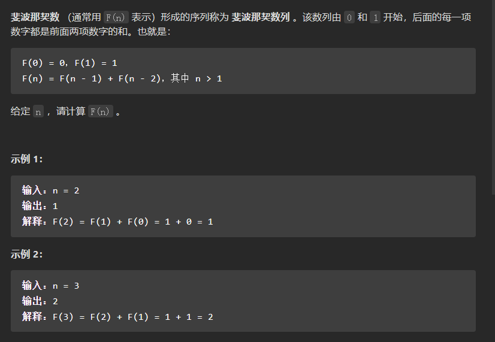

题目思路：

> 按照dp的五部曲进行分析即可；同时注意临界条件；

题目代码：

```
class Solution {
public:
    int fib(int N) {
        if (N <= 1) return N;
        vector<int> dp(N + 1);
        dp[0] = 0;
        dp[1] = 1;
        for (int i = 2; i <= N; i++) {
            dp[i] = dp[i - 1] + dp[i - 2];
        }
        return dp[N];
    }
};
```

### 题目来源：LeetCode-118. 杨辉三角

题目描述：

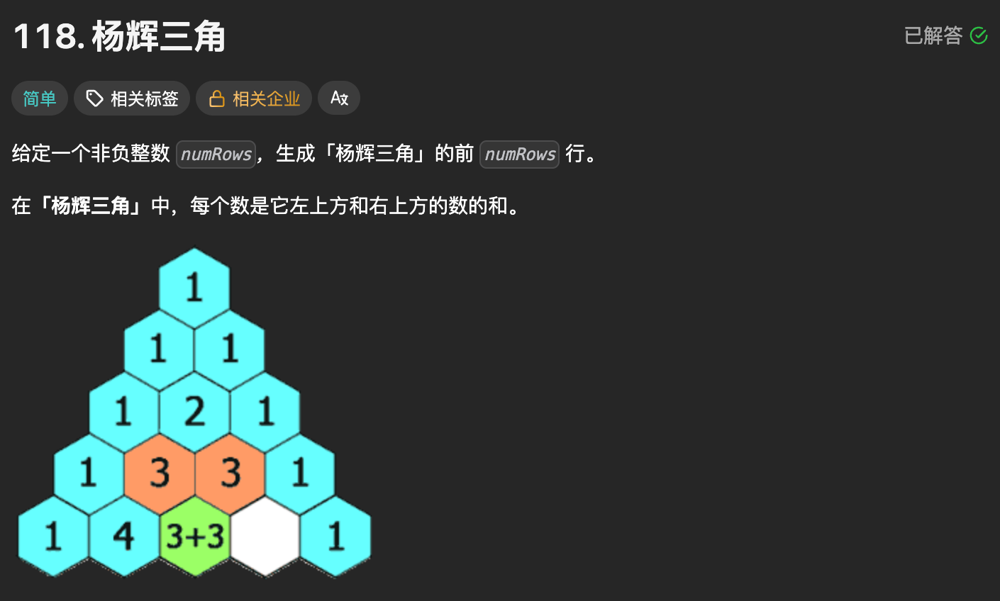

题目思路：


题目代码：

```
class Solution {
public:
    vector<vector<int>> generate(int numRows) {

        std::vector<std::vector<int>>res;
        std::vector<int>ans(1,1);
        res.push_back(ans);
        if(numRows == 1)return res;
        ans.clear();
        ans.push_back(1);ans.push_back(1);
        res.push_back(ans);
        
        int n = numRows;
        for(int i = 2; i < n; i++){
            ans.clear();
            ans.push_back(1);
            for(int j = 1; j < i; j++){
                int now = res[i - 1][j - 1] + res[i - 1][j];
                ans.push_back(now);
            }
            ans.push_back(1);
            res.push_back(ans);
        }
        return res;
        
    }
};
```

### 题目来源：LeetCode-70-爬楼梯

题目描述：  
 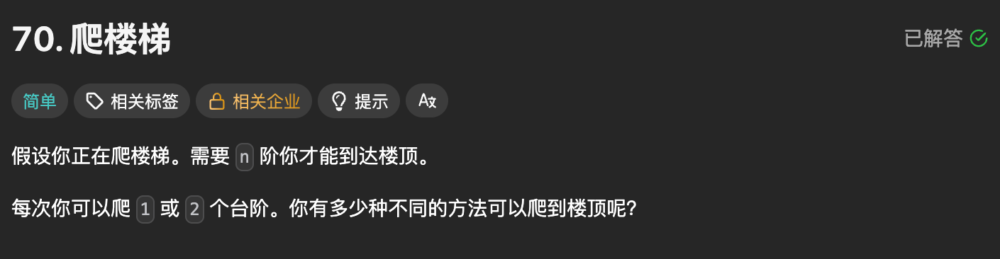

题目思路：

> 动态规划五部曲

题目代码：

```
class Solution {
public:
    int climbStairs(int n) {
        // 直接按照三部曲进行
        if(n <= 1)return 1;
        int dp[n + 1];
        // std::vector<int>dp(n + 1, 0);
        // 1- dp[i]的意思
        // 2- dp的初始化
        // 3- dp的转移公式

        // 
        dp[0] = 0;
        dp[1] = 1;
        dp[2] = 2;
        for(int i = 3; i <= n; i++){
            dp[i] = dp[i - 1] + dp[i - 2];
        }
        return dp[n];

    }
};
```

### 题目来源：LeetCode-746-使用最小花费爬楼梯

题目描述：  
 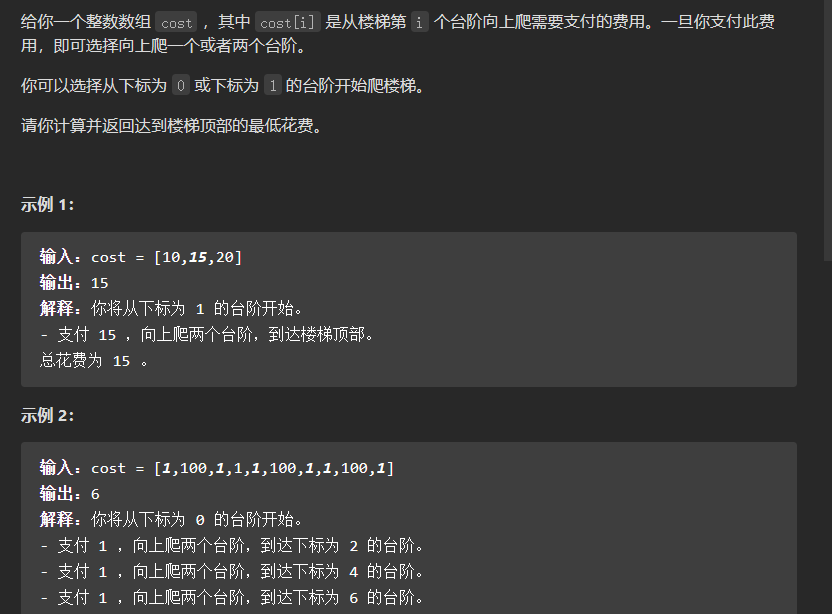

题目思路：

> 五部曲，然后这个主要是动态规划的状态转移方程式：还是按照题意进行最顺畅

题目代码：

```
class Solution {
public:
    int minCostClimbingStairs(vector<int>& cost) {
        int n=cost.size();
        if(n<=1)return 0;

        vector<int>dp (n+1);

        //从下标0开始
        dp[0]=0;
        dp[1]=cost[0];
        for(int i=2;i<=n;i++){
            dp[i]=min(dp[i-1]+cost[i-1],dp[i-2]+cost[i-2]);
        }
        int minn=dp[n];

        //从下标1开始
        dp[0]=0;
        dp[1]=0;
        for(int i=2;i<=n;i++){
            dp[i]=min(dp[i-1]+cost[i-1],dp[i-2]+cost[i-2]);
        }
        dp[n]=min(minn,dp[n]);
        return dp[n];
    }
};
```

### 题目来源：蓝桥杯-第六届-垒骰子

题目描述：  
 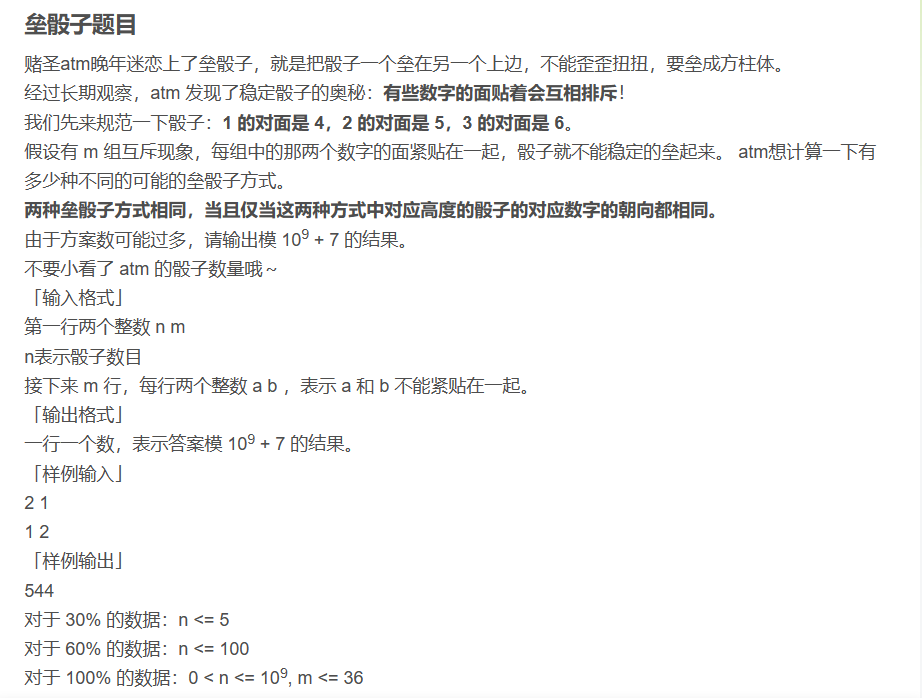

题目思路：  
 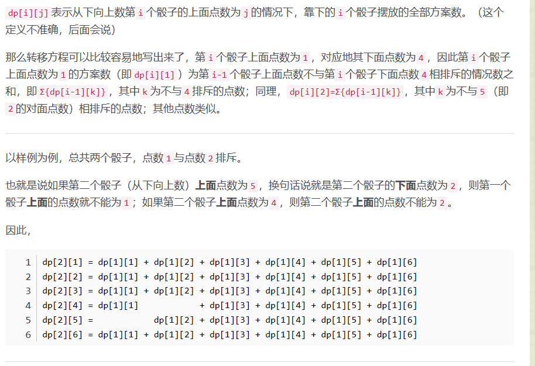

题目代码：

```
//对于N要进行适应性的更改，对于字段错误
#include<bits/stdc++.h>
using namespace std;
#define inf 0x3f3f3f3f
#define N 100100
#define mod 1000000007


long long n;
long long f[N];
long long res;
long long dp[N][7];//dp[i][j] 表示 第i层 数字j 朝上的方案数量。 
int m,k,g,d;
int x,y,z,t;
char ch;
string str;
vector<int>v[N];
int main() {
	
	//垒骰子
	memset (dp, false, sizeof dp);
	cin>>n>>m;
	map<int,int>mp;
	map<int,int>fanmian;
	fanmian[1]=4;
	fanmian[4]=1;
	fanmian[2]=5;
	fanmian[5]=2;
	fanmian[3]=6;
	fanmian[6]=3;
	while(m--){
		cin>>x>>y;
		mp[x]=y;
		mp[y]=x;
	}

	dp[1][1]=dp[1][2]=dp[1][3]=dp[1][4]=dp[1][5]=dp[1][6]=1;
	for(int i=2;i<=n;i++){	
		for(int j=1;j<=6;j++){
			
			
			int dui=fanmian[j];
			for(int q=1;q<=6;q++){
				if(q==mp[dui])continue;
				dp[i][j]+=dp[i-1][q]%mod;
			} 
			
		}
	}
	res=(dp[n][1]+dp[n][2]+dp[n][3]+dp[n][4]+dp[n][5]+dp[n][6])%mod;
	res=res*pow(4,n);
	res=res%mod;
	cout<<res<<endl;
	return 0;
}
```

### 题目来源：蓝桥杯-第九届-测试次数

题目描述：  
 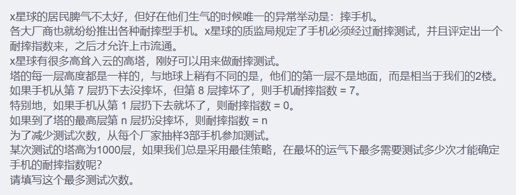

题目思路：  
 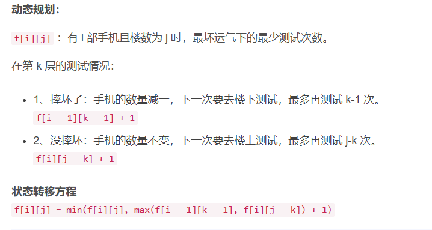

题目代码：

```
#include<iostream>
#include<algorithm>
using namespace std;
 
int f[5][1005];

int main()
{   
	for(int i = 1; i <= 3; i ++)
	   for(int j = 1; j <= 1000; j ++)
			f[i][j] = j;               // 无论有几部手机，运气最差时的测试次数就是楼层的高度                         
			                           // (第一部手机从第一层摔到最后一层，都不坏)                        
	
	for(int i = 2; i <= 3; i ++)
	   for(int j = 1; j <= 1000; j ++)
          for(int k = 1; k < j; k ++)           
               f[i][j] = min(f[i][j], max(f[i- 1][k - 1], f[i][j - k]) + 1);  // min 表示最佳策略，max 表示最差运气 
	
	cout << f[3][1000] << endl;
	return 0;
}
```

### 题目来源：蓝桥杯-第九届-搭积木

题目描述：  
 [转自这里：搭积木解题链接](http://t.csdn.cn/zjBie)  
 题目思路：

题目代码：

## No.2 长度DP

### 题目来源：LeetCode-198. 打家劫舍

题目描述：  
 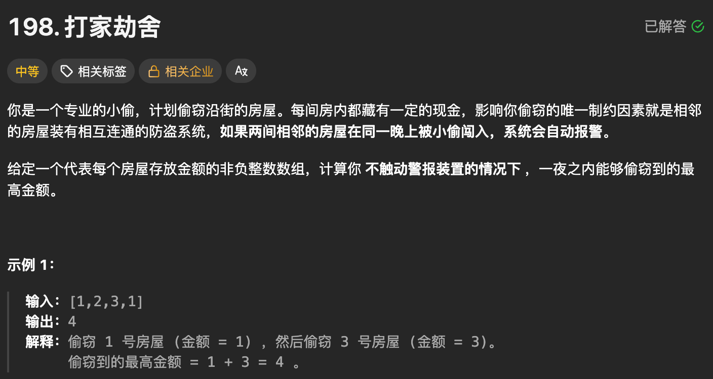

题目思路：

> 五部曲

题目代码：

```
class Solution {
public:
    int rob(vector<int>& nums) {

        // 这个是不能连着，五部曲

        int n = nums.size();
        if(n <= 1)return nums[0];
        std::vector<int>dp(n, 0);
        dp[0] = nums[0];
        dp[1] = max(nums[0], nums[1]);

        // 每次循环到pos的时候就当是最后一个位置pos
        for(int i = 2; i < n; i++){
            dp[i] = dp[i - 1]; //此次不搞
            // 搞此次
            if(dp[i - 2] + nums[i] > dp[i]){
                dp[i] = dp[i - 2] + nums[i];
            }
        }
        return dp[n - 1];
    }
};
```

```
class Solution {
public:
    int rob(vector<int>& nums) {
        int n = nums.size();
        if(n == 1)return nums[0];
        int dp[n + 1];
        dp[0] = 0;
        dp[1] = nums[0];
        dp[2] = max(nums[0], nums[1]);
        for(int i = 3; i <= n; i++){
            dp[i] = max(dp[i - 1], dp[i - 2] + nums[i - 1]);
        }
        return dp[n];
    }
};
```

### 题目来源：LeetCode-279. 完全平方数

题目描述：  
 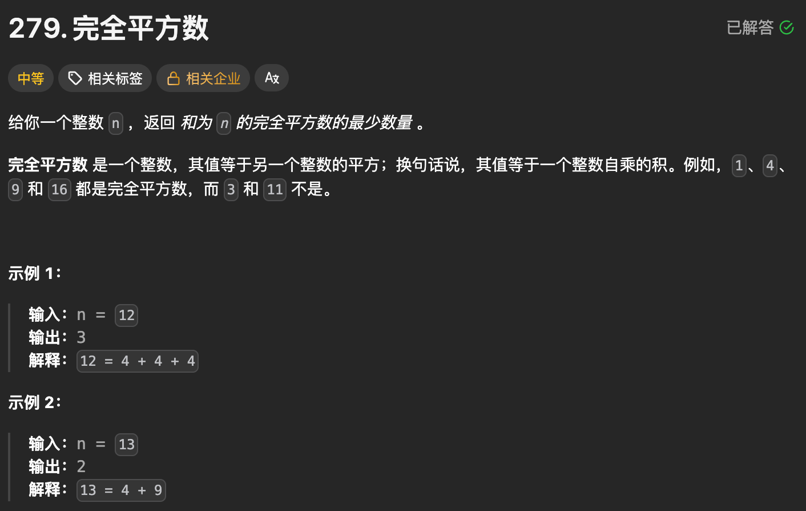

题目思路：


题目代码：

```
class Solution {
public:
    int numSquares(int n) {

        // 先把数据存放在vector
        // 因为最大n = 10000
        std::vector<int>ans;
        for(int i = 1; i <= 100; i++){
            ans.push_back(i * i);
        }
        std::vector<int>dp(n + 10, 0x3f3f3f3f);
        dp[0] = 0;
        dp[1] = 1;
        dp[2] = 2;
        dp[3] = 3;
        dp[4] = 1;
        // 转移公式, 两层循环
        for(int i = 5; i <= n; i++){
            // 选择其中的一个，然后+1；
            for(int j = 0; j < ans.size() && ans[j] <= i; j++){
                int now = ans[j];
                dp[i] = min(dp[i], dp[i - now] + 1);
            }
        }
        return dp[n];
    }
};
```

### 题目来源：LeetCode-322. 零钱兑换

题目描述：  
 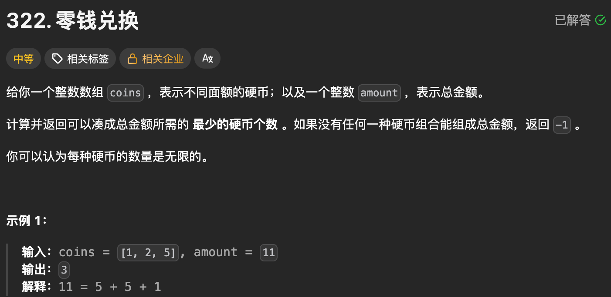

题目思路：


题目代码：

```
class Solution {
public:
    int coinChange(vector<int>& coins, int amount) {

        // 感觉和上一次的差不多；只不过ans是给的coins
        // 都是选不选和 选几个的问题吧？？？
        std::sort(coins.begin(), coins.end());


        std::vector<int>dp(amount + 10, 0x3f3f3f3f);
        dp[0] = 0;
        for(int i = 1; i <= amount; i++){
            for(int j = 0; j < coins.size() && coins[j] <= i ; j++){
                int now = coins[j];
                if(dp[i - now] != 0x3f3f3f3f){ //可选
                    dp[i] = min(dp[i], dp[i - now] + 1);
                }
            }
        }
        if(dp[amount] == 0x3f3f3f3f)return -1;
        return dp[amount];
    }
};
```

### 题目来源：LeetCode-53. 最大子数组和

题目描述：  
 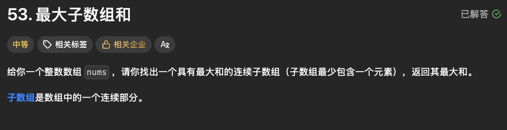

题目思路：

> 可能有的时候需要指针 减少下时间？？

题目代码：

```
class Solution {
public:
    int maxSubArray(vector<int>& nums) {
        int n = nums.size();
        int dp[n + 1];

        dp[0] = nums[0];
        int res = dp[0];
        for(int i = 1; i < n; i++){
            // 连续不连续
            int tmp1 = dp[i - 1] + nums[i];
            int tmp2 = 0 + nums[i];
            dp[i] = max(tmp1, tmp2);
            res = max(res, dp[i]);
        }
        return res;
    }
};
```

```
class Solution {
public:
    int maxSubArray(vector<int>& nums) {

        //五步骤：
        // 对于每个点的时候 都会面临选不选；
        // 选即加入，不选即重新一个序列的开始。
        // 选即更新，不选即
        int n = nums.size();
        int *dp = (int*)malloc(sizeof(int)*(n+1));
        for(size_t i = 0; i <= n; i++)dp[i]=0;
        int maxx = -0x3f3f3f3f;
        
        for(int i = 1; i <= n; i++){
            dp[i] = max(dp[i - 1] + nums[i - 1], nums[i - 1]);
            if(dp[i] >= maxx)maxx = dp[i];
        }
        return maxx;
    }
};
```

### 题目来源：PTA-L3-020 至多删三个字符

题目描述：  
 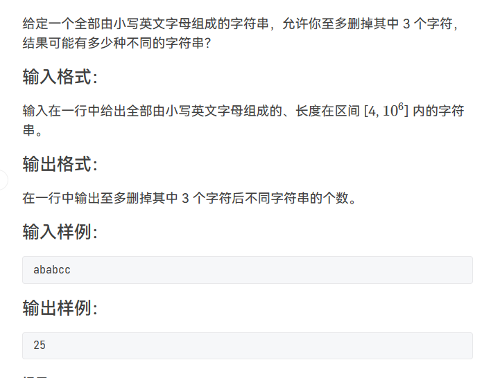

题目思路：

题目代码：

```
#include <bits/stdc++.h>
using namespace std;
#define ll long long
const int N = 1e6 + 9;
ll dp[N][5];
char s[N];
int main()
{
	cin >> (s+1);
	int n = strlen(s+1);
	dp[0][0] = 1;
	for (int i = 1; i <= n; i++)
	{
		for (int j = 0; j <= 3; j++)
		{
			dp[i][j] = dp[i - 1][j];
			if(j)
			dp[i][j] += dp[i - 1][j - 1];
			for(int k = i-1;k>=1&&(i-k)<=j;k--)
			{
				if(s[k]==s[i])
				{
					dp[i][j] -= dp[k-1][j-(i-k)];
					//[j-(i-k)] k-1 删了几个字符
					break;
				}
			}
		}
	}
	ll ans = 0;
	for(int  i = 0;i<=3;i++)
	ans += dp[n][i];
	cout<<ans<<"\n";
}
```

### 题目来源：LeetCode-343-整数拆分

题目描述：  
 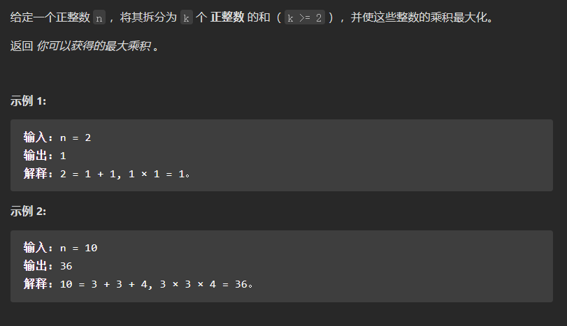

题目思路：

题目代码：

```
class Solution {
public:
    int integerBreak(int n) {

        //dp
        //先定义表示 dp[i] i的乘积最大化
        int dp[n+1];
        //初始化
        dp[1]=1;
        dp[2]=1;

        //状态转移方程：
        // dp[n]=max(dp[n-1]*1,dp[n-2]*2,.....);好像涉及到选还是不选了吗？

        for(int i=3;i<=n;i++){
            dp[i]=dp[i-1];
            for(int j=1;j<i;j++){
                // 这个还是不是很理解 多了的  j*(i-j);例子是 
                //也可以这么理解，j * (i - j) 是单纯的把整数拆分为两个数相乘，而j * dp[i - j]是拆分成两个以及两个以上的个数相乘。
                dp[i]=max({dp[i],j*(i-j),dp[i-j]*j});
            }
        }


        return dp[n];


    }
};
```

### 题目来源：LeetCode-139. 单词拆分

题目描述：  
 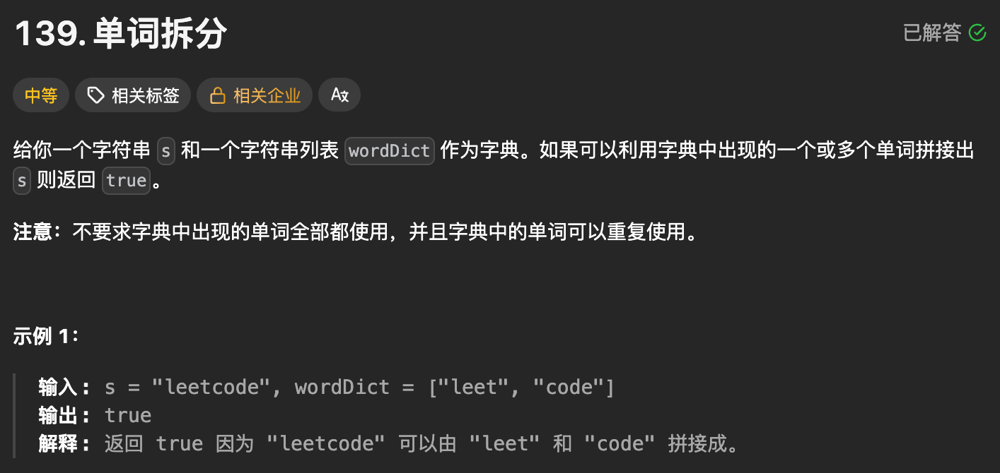

题目思路：


题目代码：

```
class Solution {
public:
    bool wordBreak(string s, vector<string>& wordDict) {

        // 思路：和最长有效括号 / 子数组 一样
        // dp[i] = 前 i 个字符 能否被成功拆分
        int n = s.size();
        
        // 用集合快速查找
        unordered_set<string> wordSet(wordDict.begin(), wordDict.end());
        
        // dp[i] 表示：s[0...i-1] 能不能拆分成字典里的单词
        vector<bool> dp(n + 1, false);
        
        // 初始状态：0 个字符，能拆分（空串）
        dp[0] = true;

        // 开始 DP
        for (int i = 1; i <= n; i++) {       // 枚举结尾位置 i
            for (int j = 0; j < i; j++) {    // 枚举分割点 j
                // 如果：前 j 个能拆分 + 从 j 到 i 的串在字典里
                if (dp[j] && wordSet.count(s.substr(j, i - j))) {
                    dp[i] = true;
                    break; // 找到一个就行，不用继续找
                }
            }
        }

        // 答案：前 n 个字符能否拆分
        return dp[n];
    }
};
```

### 题目来源：LeetCode-300. 最长递增子序列

题目描述：  
 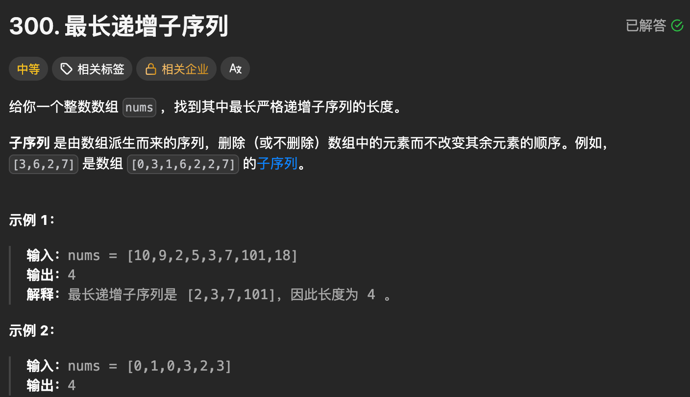

题目思路：

> 主要是五部曲中的定义  
>  dp[i] 表示：以第 i 个数字结尾的最长递增子序列长度

题目代码：

```
  class Solution {
  public:
      int lengthOfLIS(vector<int>& nums) {
          int n = nums.size();
          if (n == 0) return 0;
  
          // tails[i] 表示长度为 i+1 的递增子序列的最小末尾值
          vector<int> tails;

          for (int num : nums) {
              // 二分查找：找到第一个 >= num 的位置
              int l = 0, r = tails.size();
              while (l < r) {
                  int mid = l + (r - l) / 2;
                  if (tails[mid] < num) {
                      l = mid + 1;
                  } else {
                      r = mid;
                  }
              }
  
              // 如果 num 比所有 tails 都大，说明可以延长
              if (l == tails.size()) {
                  tails.push_back(num);
              } else {
                  // 否则替换掉第一个 >= num 的值
                  tails[l] = num;
              }
          }

          return tails.size();
      }
  };
```

```
class Solution {
public:
    int lengthOfLIS(vector<int>& nums) {

        // 基部曲策略
        // dp[i] 表示：以第 i 个数字结尾的最长递增子序列长度
        int n = nums.size();
        if(n <= 1)return 1;
        
         // 每个数字自己就是一个序列，初始都是1
        std::vector<int>dp(n + 10, 1); 
        dp[0] = 1;

        int maxx = 0;
        for(int i = 1; i < n; i++){
             // 看 i 前面所有数字 j
            for(int j = 0; j < i; j++){
                if(nums[j] < nums[i]){ // 满足递增：nums[i] > nums[j]

                    dp[i] = max(dp[i], dp[j] + 1);
                }
            }
            maxx = max(maxx, dp[i]);
        }
        return maxx;
    }
};
```

### 题目来源：LeetCode-152. 乘积最大子数组

题目描述：  
 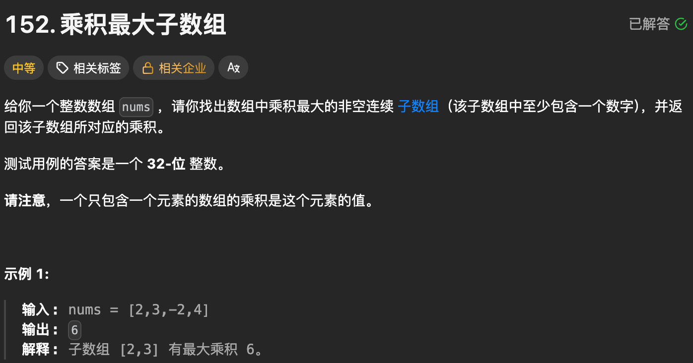

题目思路：

> 要注意 负负得正的事情，  
>  还要额外记录一个min\_dp

题目代码：

```
class Solution {
public:
    int maxProduct(vector<int>& nums) {

        // 这个相对于上面那个多了个连续；
        // 动态规划策略
        // dp[i] 表示：以第 i 个数字结尾的最大乘积累
        // 这个表示 第 i 个 是 必须 选择的
        int n = nums.size();
        if(n <= 1)return nums[0];
        
        // 因为乘积存在负负得正，所以必须同时维护最大值和最小值
        vector<int> max_dp(n);  // 以 i 结尾的最大乘积
        vector<int> min_dp(n);  // 以 i 结尾的最小乘积

        // 每个最大乘积累 先是自己本身
        for(int i = 0; i < n; i++) {
            max_dp[i] = nums[i];
            min_dp[i] = nums[i];
        }

        int res = nums[0]; // 答案初始化为第一个数

        // 你指定要用的 for 循环，我完完整整保留！
        for (int i = 1; i < n; i++) {
            // 之前是找前面的所有，现在仅仅需要找一个就行
            // 目前的 i 位置是 必须选的， 因为是以 i 为结尾的
            // 当前是正数：大×更大，小×更小
            if (nums[i] >= 0) {
                max_dp[i] = max(nums[i], max_dp[i-1] * nums[i]);
                min_dp[i] = min(nums[i], min_dp[i-1] * nums[i]);
            }
            // 当前是负数：大×小 反而变最大！
            else {
                max_dp[i] = max(nums[i], min_dp[i-1] * nums[i]);
                min_dp[i] = min(nums[i], max_dp[i-1] * nums[i]);
            }
            res = max(res, max_dp[i]);
        }

        return res;
    }
};
```

### 题目来源：LeetCode-416-分割等和子集

题目描述：  
 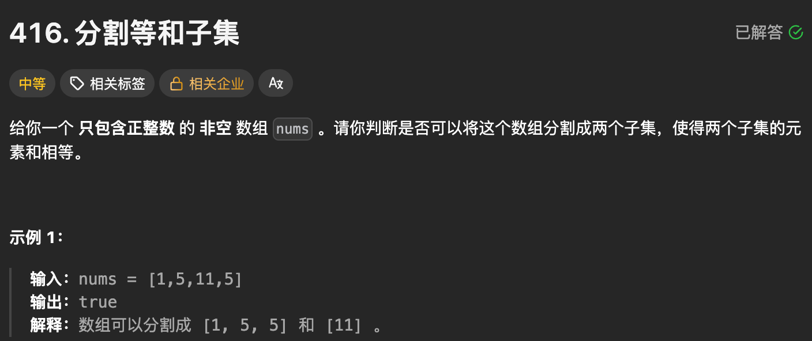

题目思路：


题目代码：

```
class Solution {
public:
    bool canPartition(vector<int>& nums) {
        // 两个子集合 和 相等
        // 直接转换 为 挑出部分数组 能否 == sum / 2；

        int n = nums.size();
        int sum = 0;
        for (int x : nums) sum += x;

        // 和是奇数，直接不能分
        if (sum % 2 != 0) return false;
        int target = sum / 2;

        // ==================== 二维 DP ====================
        // dp[i][j] 含义：
        // 前 i 个数字，能否凑出 和为 j
        // true = 能，false = 不能
        vector<vector<bool>> dp(n + 1, vector<bool>(target + 1, false));

        // 初始状态：前 i 个数字，凑 0，都能凑出来（不选）
        for (int i = 0; i <= n; i++) {
            dp[i][0] = true;
        }

        // 开始填二维表
        for (int i = 1; i <= n; i++) {      // 遍历第 i 个数字
            int num = nums[i - 1];          // 当前数字
            for (int j = 1; j <= target; j++) {  // 遍历和 j
                // 不选当前数字 → 直接继承上一行
                dp[i][j] = dp[i - 1][j];

                // 能选的话，看看选了能不能行
                if (j >= num) {
                    dp[i][j] = dp[i][j] || dp[i - 1][j - num];
                }
            }
        }

        // 答案：前n个数字，能否凑出target
        return dp[n][target];
    }
};
```

### 题目来源：Acwing-3652- 最大连续子序列（模板题）

题目描述：  
 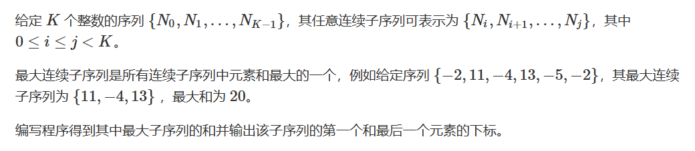

题目思路：

> 一开始想的是前缀和，但是呢，它会超时，所以要dp

题目代码：

```
//超时版本：
//对于N要进行适应性的更改，对于字段错误
#include<bits/stdc++.h>
using namespace std;
#define inf 0x3f3f3f3f
#define N 100100
int n,m,k,g,d;
int x,y,z;
char ch;
string str;
vector<int>v[N];

int main() {
    while (cin>>k)
    {
        int num[k+1]={0};
        int sum[k+1]={0};
        for(int i=1;i<=k;i++){
            cin>>num[i];
            sum[i]=sum[i-1]+num[i];
        }
        int l,r;
        int res=0;
        int resl,resr;
        //定左指针
        for( l =1;l<=k;l++){
            for( r=l;r<=k;r++){
                if(sum[r]-sum[l-1]>res){
                    res=sum[r]-sum[l-1];
                    resl=l;
                    resr=r;
                }
            }
        }
        if(res==0)cout<<"0 0 0"<<endl;
        else      cout<<res<<" "<<resl-1<<" "<<resr-1<<endl;
        
    }
    
	return 0;
}


//动态规划版本：
//AC版本：
//对于N要进行适应性的更改，对于字段错误
#include<bits/stdc++.h>
using namespace std;
#define inf 0x3f3f3f3f
#define N 100100
int n,m,k,g,d;
int x,y,z;
char ch;
string str;
vector<int>v[N];

int main() {
	int f[N];//五部曲1： 定义：以i为结尾的连续子序列的最值（肯定选了第i个数值的即选中了第i个数值） 
	f[0]=0;  //初始化：然后好像没有必要初始化的地方的，其实。
	int res,resl,resr; //用来返回最终结果。 
	
	while(cin>>n){
		res=-inf;
		int a[n+1];
		for(int i=1;i<=n;i++)cin>>a[i];
		
		int l=0,r=0,temp=0;//用来记录选择序列的 前后下标；
		
		for(int i=1;i<=n;i++){  //遍历顺序，从前往后；
			f[i]=max(f[i-1]+a[i],a[i]);// f[i]表示的是肯定选择a[i]的，然后看这个前面的选择的是否为负的；
			
			if(f[i]==f[i-1]+a[i]){
				//说明是前面的>=0的，再续接上a[i];
				l=l;
				r=i-1; 
			}else if(f[i]==a[i]){
				//说明是前面的小于0的，再续接上a[i];
				l=i-1;
				r=i-1;
			}
			
			
			if(f[i]>res){
				res=f[i];
				resl=l;
				resr=r;
			}
		
		} 
		if(res<0)printf("0 0 0\n");
		else printf("%d %d %d\n",res, resl , resr); 
		
	} 
	 
	return 0;
}
```

### 题目来源：LeetCode-32. 最长有效括号

题目描述：  
 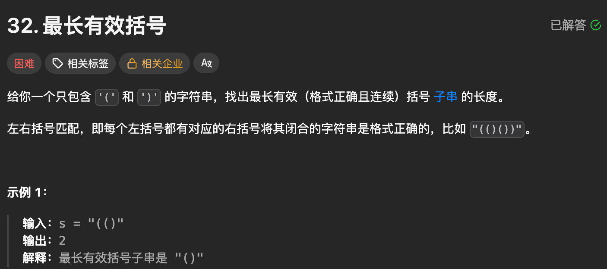

题目思路：

> 1-dp  
>  2-stack

题目代码：

```
class Solution {
public:
    int longestValidParentheses(string s) {

        // 像这种连续的。或者子串 直接是 以 该位置结尾的 最长即可
        // 按照前面的进行模版操作
        int n = s.size();
        if (n == 0) return 0;

        // dp[i] = 以 i 位置结尾的最长有效括号长度
        // 这个的意思是必须 是 连续有效的包含i位置的。
        vector<int> dp(n + 10, 0);
        int maxLen = 0;  // 记录全局最大值
        dp[0] = 0;

        for(int i = 1; i < n; i++){
            if(s[i] == ')'){
                // 
                if(s[i - 1] == '('){

                    dp[i] = dp[i - 2] + 2;
                    maxLen = max(maxLen, dp[i]);
                }else{
                    // ）） 这个的 那么找到上一个匹配的(位置就是 i - dp[i - 1] - 1;
                    // 因为 前面的只要是)肯定找到匹配的了。
                    int leftpos = i - dp[i - 1] - 1;
                    if(leftpos > 0){
                        dp[i] = dp[leftpos - 1] + 2;
                    }

                }
            }else{
                dp[i] = 0;
            }
        }


        return maxLen;
    }
};
```

```
class Solution {
public:
    int longestValidParentheses(string s) {
        stack<int> stk;
        stk.push(-1); // 虚拟红线（哨兵）
        int ans = 0;
        for (int i = 0; i < s.size(); i++) {
            if (s[i] == '(') { // 炸弹
                stk.push(i); // 记录炸弹下标
            } else if (stk.size() > 1) { // 栈顶是炸弹
                stk.pop(); // 拆弹
                ans = max(ans, i - stk.top()); // 右端点为 i 时，左端点最小是 stk.top() + 1
            } else { // 栈只有一个数，是红线，s[i] 无法拆弹，成为新的红线
                stk.top() = i; // 替换栈底
            }
        }
        return ans;
    }
};
```

### 题目来源：牛客网-NC21302

题目描述：  
 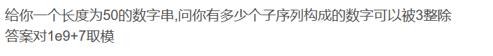

题目思路：

> 1. 一个数能被3整除，说明这个数每位的和是3的倍数
> 2. 利用动态规划的思想，dp[i][[j] 表示前i位，模3是j的数的个数。

题目代码：

```
#include <bits/stdc++.h>
using namespace std;
#define N 100010
#define inf 0x3f3f3f3f
#define debug(x) cout<<#x<<" = "<<x<<endl;
#define LL long long
const int mod = 1e9+7;
int n,m,k,d,g;
int x,y,z;
string str;
char ch;
vector<int>v[N];
LL dp[55][4];

int main()
{
    ios::sync_with_stdio(false),cin.tie(0),cout.tie(0);
    cin>>str;
    //1. 一个数能被3整除，说明这个数每位的和是3的倍数
    //2. 利用动态规划的思想，dp[i][[j] 表示前i位，模3是j的数的个数。

    for(int i=1;i<=str.size();i++)
    {
        x=str[i-1]-'0';
        if(x%3==0){
                // 这里的1 表示只选择第i个位置这一个数；，
                //第一个dp[i-1][0]表示不选，第二个表示选上再加上前面的；
            dp[i][0]=(1+dp[i-1][0]+dp[i-1][0])%mod;
            dp[i][1]=(dp[i-1][1]+dp[i-1][1])%mod;
            dp[i][2]=(dp[i-1][2]+dp[i-1][2])%mod;

        }
        if(x%3==1){
            dp[i][0]=(dp[i-1][0]+dp[i-1][2])%mod;
            dp[i][1]=(1+dp[i-1][1]+dp[i-1][0])%mod;
            dp[i][2]=(dp[i-1][2]+dp[i-1][1])%mod;

        }
        if(x%3==2){
            dp[i][0]=(dp[i-1][0]+dp[i-1][1])%mod;
            dp[i][1]=(dp[i-1][1]+dp[i-1][2])%mod;
            dp[i][2]=(1+dp[i-1][2]+dp[i-1][0])%mod;
        }
    }
    cout<<dp[str.size()][0]<<endl;

    return 0;
}
```

### 题目来源：蓝桥杯-第十届-最优包含

题目描述：  
 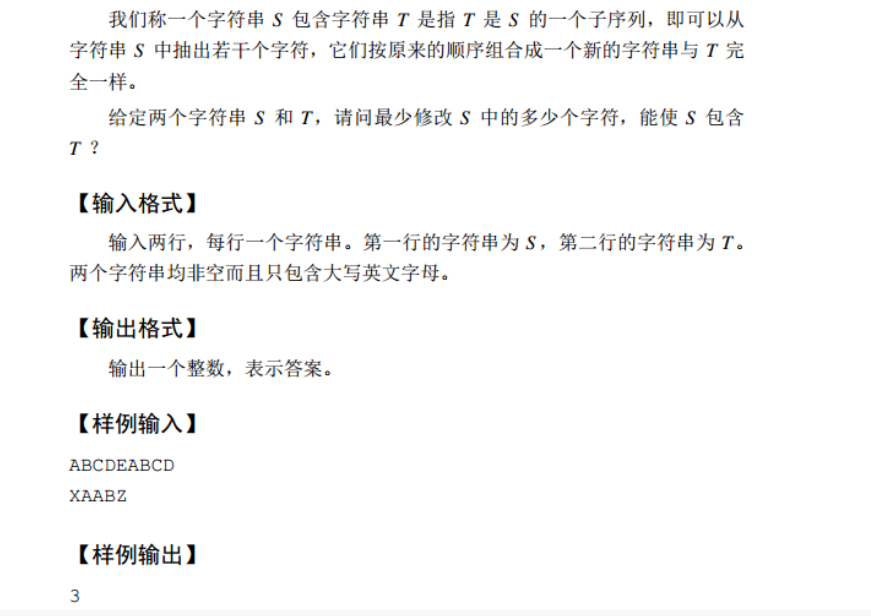

题目思路：

> 由于可以组成特别多的序列，因此我们使用动态规划思想来简化该过程。  
>  我们设dp[i][j]表示S串中前i个字符，包含有T串中前j个字符最少需要修改的字符个数。

> 因此分析得到：  
>  如果S[i]=T[j] ,那么T串中的最后一位要么让他和S[i]相等，要么让他和前面的相等。  
>  dp[i][j] = min(dp[i-1][j],dp[i-1][j-1]);

> 如果S[i]!=T[j],那么要么是让T[j]和S串前面的字符一样，要么修改S[i]。  
>  dp[i][j]= min(dp[i-1][j-1]+1,dp[i-1][j])

> 并且注意的是这里动态方程中我们的i，j为个数的意思，转换为代码时由于下标从0开始，所以实际上要大一。

题目代码：

```
#include<bits/stdc++.h>
using namespace std;
const int N=1e3+50;
char a[N],b[N];
int dp[N][N];
int main(){
    cin>>a+1>>b+1;
    int la=strlen(a+1);
    int lb=strlen(b+1);
    memset(dp,0x3f3f3f3f,sizeof dp);
    dp[0][0]=0;
    for(int i=1;i<=la;i++)
	{
        dp[i][0]=0;
        for(int j=1;j<=lb;j++)
		{
            if(a[i]==b[j]) 
				dp[i][j]=min(dp[i-1][j],dp[i-1][j-1]);
            else 
				dp[i][j]=min(dp[i-1][j],dp[i-1][j-1]+1);
        }
    }
    cout<<dp[la][lb];
    return 0;
}
```

### 题目来源：蓝桥杯-第十届-排列数

题目描述：

> [转自这里：排列数的题解](http://t.csdn.cn/W2Z05)  
>  题目思路：

题目代码：

### 题目来源：蓝桥杯-2013省赛-买不到的数目

题目描述：

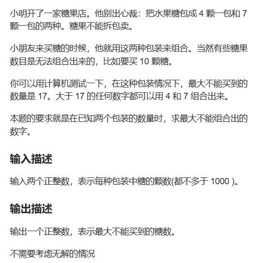

题目思路：


题目代码：

```
#include <iostream>
using namespace std;
const int MAX=1e5;
int x[2];
int maxy;
bool dp[MAX];
int main()
{
  //int x,y;
  //cin>>x>>y;
  //cout<<x*y-x-y; //好像因为什么因素直接这样输出就可以了
  dp[0]=1;
  for(int i=0;i<2;i++){//外层是一包糖数转换
    cin>>x[i];
    dp[x[i]]=1;
    for(int j=dp[i];j<MAX;j++){//内层是增长的数
      //dp[j]=dp[j]|dp[j-x[i]];
      if(dp[j]){dp[j+x[i]]=1;}
      if(!dp[j]){maxy=j;}
    }
  }
  cout<<maxy;


  return 0;
}
```

### 题目来源：蓝桥杯-2017省赛-对局匹配

题目描述：  
 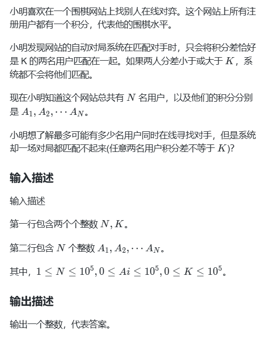

题目思路：


题目代码：

```
#include<iostream>
#include<algorithm>

using namespace std;

int N, K, dp[100001];
int cnt[100001] = {0}; 

int main() {
    int tmp, max_num = 0;
    size_t res = 0; 
    cin >> N >> K;
    
    for (int i = 0; i < N; ++i) {
        cin >> tmp;
        ++cnt[tmp];
        max_num = max(max_num, tmp);
    }
    
    // K = 0 时, 只需计算一共有多少种不同的数即可 
    if (K == 0) {
        for (int i = 0; i <= max_num; ++i) {
            if (cnt[i] != 0) {
                ++res;
            }
        }
    } else {
        // 把数据分成 K 组 
        for (int i = 0; i < K; ++i) {
            dp[i] = cnt[i];
            dp[i + K] = max(cnt[i], cnt[i + K]);
            int j;
            for (j = i + 2 * K; j <= max_num; j += K) {
                dp[j] = max(dp[j - K], dp[j - 2 * K] + cnt[j]);
            }
            
            res += dp[j - K];
        }
    }
    
    cout << res << endl;
    
    return 0;
}
```

### 题目来源：蓝桥杯-2018省赛-乘积最大

题目描述：

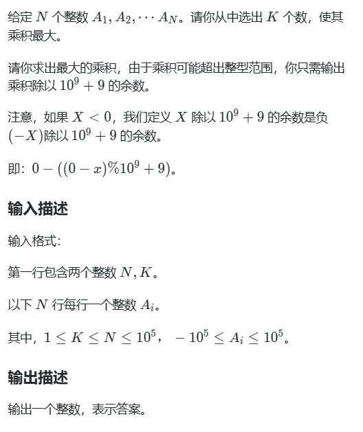

题目思路：

> 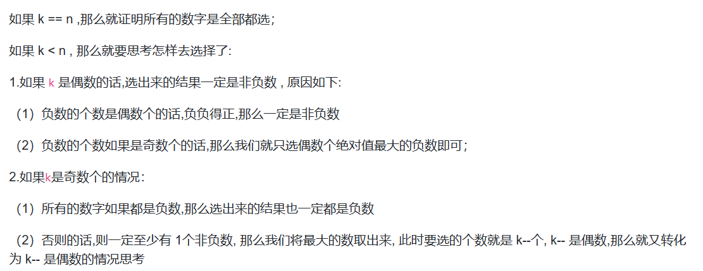

题目代码：

```
#include <iostream>
#include <algorithm>
using namespace std;

const int N = 100010,M =1000000009;
typedef long long ll;

ll a[N];
int n, k;
ll res = 1;

int main()
{
  cin >> n >> k;

  for(int i = 0;i < n; i++)
  {
    cin >> a[i];
  }

  sort(a,a+n);

  int l = 0,r = n - 1;
  int sigh = 1;   //符号标记
  while(k % 2)    //当k为奇数是，至少取一个最大的数，k--就是偶数则就偶数的求法取求
  {
    res = a[r];
    r--;
    k--;
    if(res < 0) sigh = -1;
  }
//双指针求法
  while(k)
  {
    ll x = a[l] * a[l+1];
    ll y = a[r] * a[r-1];

    if(x * sigh > y * sigh)
    {
      res = x % M * res % M;
      l += 2;
    }
    else
    {
      res = y % M * res % M;
      r -= 2;
    }
     k -= 2;
  }

  cout << res << endl;
  // 请在此输入您的代码
  return 0;
}
```

### 题目来源：蓝桥杯-2022省赛-最大和

题目描述：

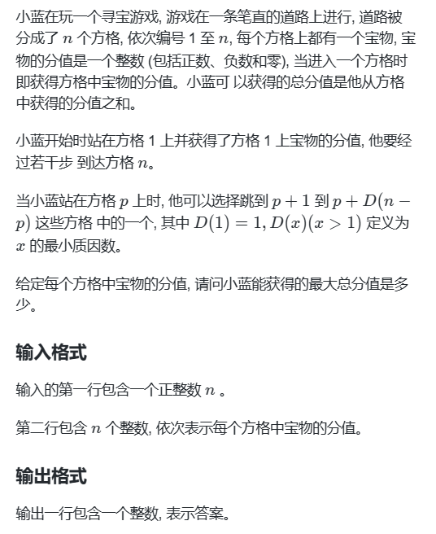

题目思路：


题目代码：

```
#include<bits/stdc++.h>
using namespace std;
const int MIN = -0x3f3f3f3f;
const int N = 1e5+10;
int a[N];
int f[N];

bool is_primer(int x)//判断是否为质数
{
  for(int i = 2;i<=x/i;i++)
  {
    if(x%i==0)return false;
  }
  return true;
}

int find(int x)//寻找最小质因数
{
  if(x==0)return 0;
  if(x==1)return 1;
  for(int i = 2;i<=x/i;i++)
    if(((x%i)==0)&&is_primer(i))return i;
}


int main()
{
  int n;
  scanf("%d",&n);
  for(int i = 1;i<=n;i++)scanf("%d",&a[i]);
  memset(f,MIN,sizeof f);//将所有状态初始化为负无穷
  f[1]=a[1];//走到第一格的最大分值为第一个宝物的分值
  for(int i = 1;i<=n;i++)
  {
    int x = i + find(n-i);
    for(int j = i+1;j<=x;j++)//枚举从下一格到D(x)的所有走法
    {
      f[j] = max(f[j],f[i]+a[j]);
    }
  }
  cout << f[n] << endl;
  
  return 0;
}
```

### 题目来源：蓝桥杯-2022省赛-李白打酒加强版

题目描述：  
 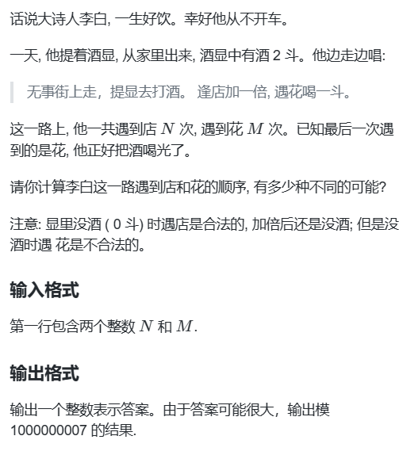

题目思路：


题目代码：

```
#include <bits/stdc++.h>
using namespace std;
using ll=long long;
const ll MOD=1000000007;

ll n,m,ans;
ll f[105][105][105];

int main(){
    cin.tie(0),cout.tie(0);
    ios::sync_with_stdio(false);
    cin>>n>>m;

    f[0][0][2]=1;//不管怎么样必然会有一种初始方案。
    for(int i=0;i<=n;i++){
        for(int j=0;j<=m;j++){
            for(int k=0;k<=m;k++){
                //遇到花
                if(j&&k)f[i][j][k]=(f[i][j][k]+f[i][j-1][k+1])%MOD;
                //遇到店
                if(i&&k%2==0)f[i][j][k]=(f[i][j][k]+f[i-1][j][k/2])%MOD;
            }
        }
    }
    //因为没有酒遇到花是不合法的，所以循环的时候没有执行f[][m][0]的所有情况
    //因为最后一步必须是遇到花，所以f[n][m-1][1]的值等于我们想要的f[n][m][0]
    cout<<f[n][m-1][1];
    return 0;
}
```

### 题目来源：蓝桥杯-2022省赛-2022

题目描述：

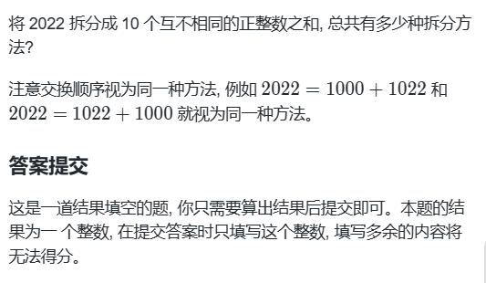

题目思路：


题目代码：

```
#include<bits/stdc++.h>
using namespace std;
//2022 拆分为十个整数 几种方法
//dp法
typedef long long ll;
ll dp[11][2025];
int main()
{
    dp[0][0]=1;//取0个数字 总和为0 的方案数;
    for(int i=1;i<=2022;i++)//枚举要加入的数字
    {
        for(int j=10;j>=1;j--)//取j个数字 10-9-8----1跟着状态转换方程来走 
        {
            for(int k=i;k<=2022;k++)
            {
                dp[j][k]+=dp[j-1][k-i];//10个数字拼成2022---->来源于9个数字拼成2022-最后要被加入的i 的方案数 
            }
         } 
     }
      cout<<dp[10][2022];
    return 0;
}
```

## No.3 平面DP

### 知识

- 这部分的话主要是画个 矩阵操作(m, n);
- 然后基本都是先初始化边框的一行和一列
- 然后就是 扫描一行一行的进行。
- 然后压缩空间的话就是也是一行一行的来进行。
- 大致过程：对于题目先通过在草稿纸上 画出个二维的矩阵把这道题目给做出来，就是熟悉 转移方程。
- 然后压缩空间的话就是根据二维的进行一维的 两行Vector的尝试操作。大概就是这样。

### 题目来源：LeetCode-62-不同路径

题目描述：  
 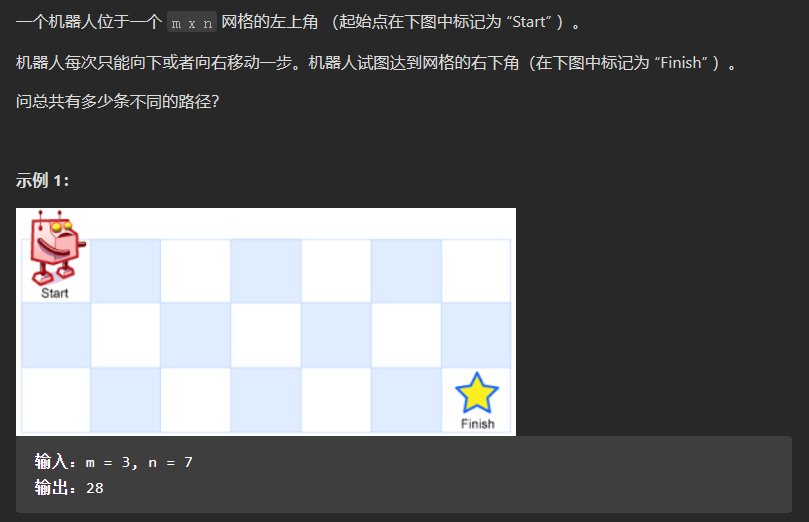

题目思路：

> 一定要小心 初始化；

题目代码：

```
class Solution {
public:
    int uniquePaths(int m, int n) {
        int dp[m + 1][n + 1];

        for(int i = 1; i <= m; i++){
            dp[i][1] = 1;
        }
        for(int j = 1; j <= n; j++){
            dp[1][j] = 1;
        }
        for(int i = 2; i <= m; i++){
            for(int j = 2; j <= n; j++){
                dp[i][j] = dp[i - 1][j] + dp[i][j - 1];
            }
        }
        return dp[m][n];
    }
};
```

```
class Solution {
public:
    int uniquePaths(int m, int n) {
        // 空间优化的话就是 自己在纸上画出矩阵格子。
        // 固定m，看一行的vector; 看是否 能用仅仅两行数据来进行即可。
        int dp[n + 1];
        dp[0]=0;
        for(int i = 1; i <= n; i++){
            dp[i] = 1;
        }
        for(int i = 2; i <= m; i++){
            for(int j = 1; j <= n; j++){
                dp[j] = dp[j - 1] + dp[j];
            }
        }
        return dp[n];
    }
};
```

### 题目来源：LeetCode-63-不同路径 II

题目描述：  
 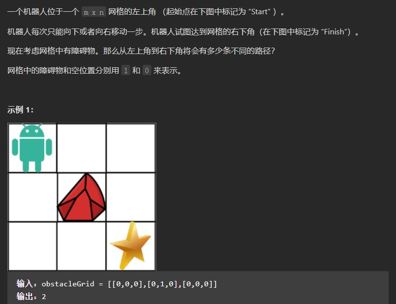

题目思路：

题目代码：

```
class Solution {
public:
    int uniquePathsWithObstacles(vector<vector<int>>& obstacleGrid) {
        int h=obstacleGrid.size();
        int l=obstacleGrid[0].size();
        //如果在起点或终点出现了障碍，直接返回0
        if (obstacleGrid[h - 1][l - 1] == 1 || obstacleGrid[0][0] == 1)return 0;

        //先定义
        int dp[h+1][l+1];
        memset(dp,0,sizeof(dp));
        dp[0][0]=1;
        //初始化
        for(int i=1;i<l;i++){
            if(obstacleGrid[0][i]==1){
                break;
            }else{
                dp[0][i]=1;
            }
        }
        for(int i=1;i<h;i++){
            if(obstacleGrid[i][0]==1){
                break;
            }else{
                dp[i][0]=1;
            }
        }

        // 转移方程
        for(int i=1;i<h;i++){
            for(int j=1;j<l;j++){
                if(obstacleGrid[i][j]==1){
                    dp[i][j]=0;
                }else{
                    dp[i][j]=dp[i-1][j]+dp[i][j-1];
                }
            }
        }
        return dp[h-1][l-1];

    }
};
```

### 题目来源：LeetCode-64. 最小路径和

题目描述：

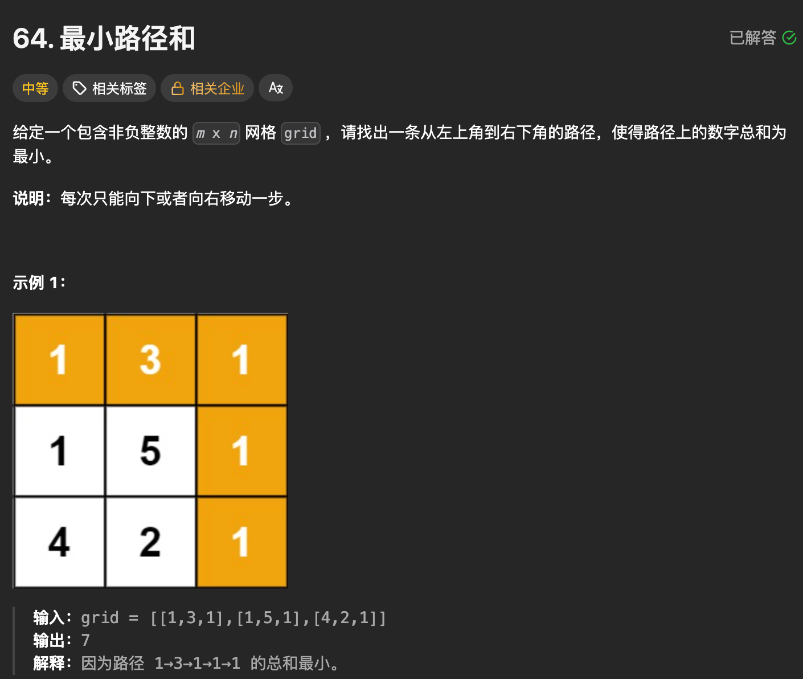

题目思路：


题目代码：

```
class Solution {
public:
    int minPathSum(vector<vector<int>>& grid) {
        int m = grid.size();
        int n = grid[0].size();

        // 先初始化，主要是为了更清晰的了解转移方程。
        int dp[m + 1][n + 1];
        dp[0][1] = 0;
        dp[1][0] = 0;
        for(int i = 1; i <= m; i++){
            dp[i][1] = dp[i - 1][1] + grid[i - 1][0];
        }
        for(int j = 1; j <= n; j++){
            dp[1][j] = dp[1][j - 1] + grid[0][j - 1];
        }

        for(int i = 2; i <= m; i++){
            for(int j = 2; j <= n; j++){
                dp[i][j] = min(dp[i - 1][j], dp[i][j - 1]) + grid[i - 1][j - 1];
            }
        }
        return dp[m][n];
    }
};
```

```
class Solution {
public:
    int minPathSum(vector<vector<int>>& grid) {
        int m = grid.size();
        int n = grid[0].size();

        // 先初始化
        // 同样的道理，先在纸上画个矩阵。然后用两行vector进行。
        int dp[n + 1];
        dp[0] = 0;
        for(int i = 1; i <= n; i++){
            dp[i] = dp[i - 1] + grid[0][i - 1];
        }

        for(int i = 2; i <= m; i++){
            dp[0] = INT_MAX;
            for(int j = 1; j <= n; j++){
                dp[j] = min(dp[j], dp[j - 1]) + grid[i - 1][j - 1];
            }
        }
        return dp[n];
    }
};
```

### 题目来源：LeetCode-5. 最长回文子串

题目描述：  
 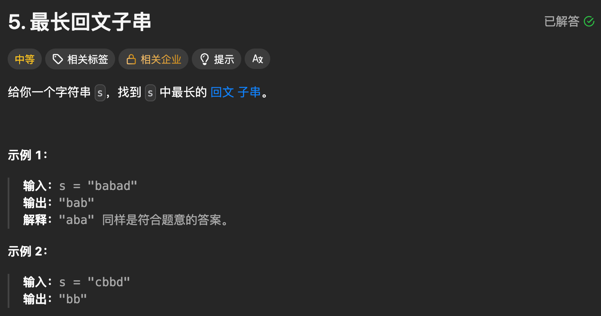

题目思路：

> 首先是动态规划；；然后也可以在中间进行判断；即遍历然后每个当次中间的；然后判断两边的是不是一样的；(假设奇数和偶数考虑)

题目代码：

```
// 这个称呼为中心转移法；
#include <iostream>
#include <string>
#include <vector>

using namespace std;

class Solution {
public:
    int maxLen = 0;
    int start = 0;
    int n = 0;
    void expan(int l, int r, const string & s){
        while(l >=0 && l < n && r >=0 && r <n && s[l] == s[r]){
            l--;
            r++;
        }
        if(maxLen < (r - l - 1)){
            maxLen = r - l - 1;
            start = l + 1;
        }
    }
    string longestPalindrome(string s) {
        n = s.size();
        for(int i = 0; i < n; i++){
            // 奇数个
            expan(i, i, s);
            // 偶数个
            expan(i, i + 1, s);
        }
        return s.substr(start, maxLen);
    }
};
```

```
#include <iostream>
#include <string>
#include <vector>

using namespace std;

class Solution {
public:
    string longestPalindrome(string s) {
        int n = s.size();
        if (n < 2) return s;

        int maxLen = 1;
        int begin = 0;
        // 第一步先定义
        // dp[i][j] 表示 s[i..j] 是否是回文串
        vector<vector<int>> dp(n, vector<int>(n));
        // 初始化：所有长度为 1 的子串都是回文串
        for (int i = 0; i < n; i++) {
            dp[i][i] = true;
        }
        // 递推开始
        // 先枚举子串长度
        for (int L = 2; L <= n; L++) {
            // 枚举左边界，左边界的上限设置可以宽松一些
            for (int i = 0; i < n; i++) {
                // 由 L 和 i 可以确定右边界，即 j - i + 1 = L 得
                int j = i+L - 1;
                // 如果右边界越界，就可以退出当前循环
                if (j >= n) {
                    break;
                }

                if (s[i] != s[j]) {
                    dp[i][j] = false;
                } else {
                    if (j - i < 3) {
                        dp[i][j] = true;
                    } else {
                        dp[i][j] = dp[i + 1][j - 1];
                    }
                }

                // 只要 dp[i][L] == true 成立，就表示子串 s[i..L] 是回文，此时记录回文长度和起始位置
                if (dp[i][j] && j - i + 1 > maxLen) {
                    maxLen = j - i + 1;
                    begin = i;
                }
            }
        }
        return s.substr(begin, maxLen);
    }
};
```

### 题目来源：LeetCode-1143. 最长公共子序列

题目描述：  
 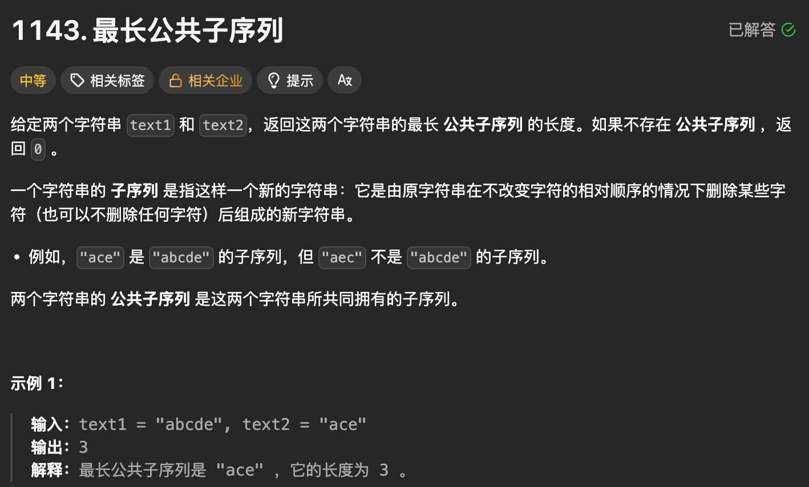

题目思路：


题目代码：

```
class Solution {
public:
    int longestCommonSubsequence(string text1, string text2) {

        // 二维 DP 模板
        // dp[i][j] = text1前i个 和 text2前j个 的最长公共子序列长度
        int n = text1.size();
        int m = text2.size();

        // 开 (n+1) × (m+1) 数组
        vector<vector<int>> dp(n + 1, vector<int>(m + 1, 0));

        // 开始填表
        for (int i = 1; i <= n; i++) {
            for (int j = 1; j <= m; j++) {

                // 字符一样 → 直接 +1
                if (text1[i-1] == text2[j-1]) {
                    dp[i][j] = dp[i-1][j-1] + 1;
                }
                // 字符不一样 → 取 上/左 最大
                else {
                    dp[i][j] = max(dp[i-1][j], dp[i][j-1]);
                }
            }
        }

        // 答案在右下角
        return dp[n][m];
    }
};
```

```
class Solution {
public:
    int longestCommonSubsequence(string text1, string text2) {
        int m = text1.size();
        int n = text2.size();

        int dp[m + 1][n + 1];
        // 初始化很重要。因为这样可以帮你理清楚转化方程式。
        dp[0][1] = 0;
        for(int i = 1; i <= m; i++){
            if(text1[i - 1] == text2[0]){
                dp[i][1] = max(1, dp[i - 1][1]);
            }else{
                dp[i][1] = dp[i - 1][1];
            }
        }
        dp[1][0] = 0;
        for(int j = 1; j <= n; j++){
            if(text1[0] == text2[j - 1]){
                dp[1][j] = max(1, dp[1][j - 1]);
            }else{
                dp[1][j] = dp[1][j - 1];
            }
        }

        for(int i = 2; i <= m; i++){
            for(int j = 2; j <= n; j++){
                if(text1[i - 1] == text2[j - 1]){
                    dp[i][j] = dp[i - 1][j - 1] + 1;
                }else{
                    dp[i][j] = max(dp[i - 1][j], dp[i][j - 1]);
                }
            }
        }
        return dp[m][n];
    }
};
```

```
class Solution {
public:
    int longestCommonSubsequence(string text1, string text2) {
        int m = text1.size();
        int n = text2.size();

        // 也是根据在草稿纸上画个矩阵。
        int dp[n + 1];
        dp[0] = 0;

        // 这个就是 text1 1个字母的时候，遍历text2；也就是草稿纸上的矩阵的第一行。
        for(int i = 1; i <= n; i++){
            if(text2[i - 1] == text1[0]){
                dp[i] = 1;
            }else{
                dp[i] = dp[i -1];
            }
        }

        for(int i = 2; i <= m; i++){
            int pre_pre = dp[0];
            for(int j = 1; j <= n; j++){ // 要注意dp[j - 1 == 0]即dp[0]
                int tmp = dp[j];
                
                if(j == 1)dp[0] = 0;
                if(text1[i - 1] == text2[j - 1]){
                    dp[j] = pre_pre + 1;
                }else{
                    dp[j] = max(dp[j], dp[j - 1]);
                }
                pre_pre = tmp;
            }
        }
        return dp[n];
    }
};
```

### 题目来源：LeetCode-72. 编辑距离

题目描述：  
 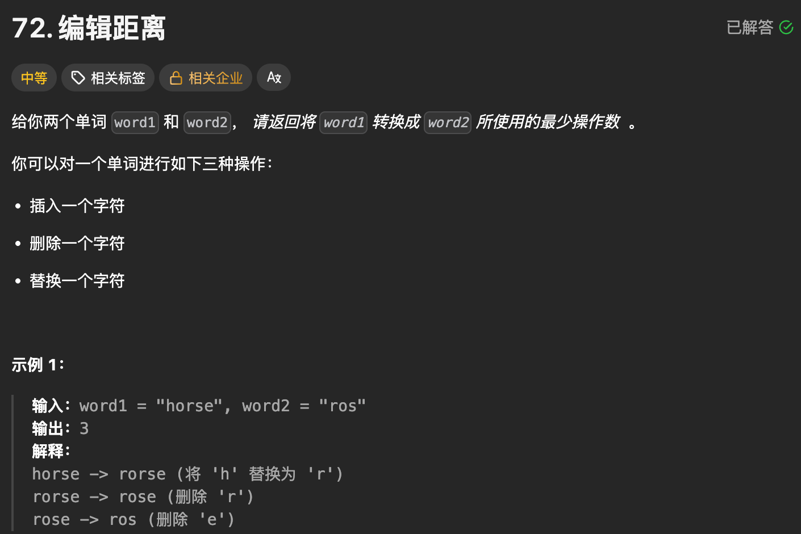

题目思路：


题目代码：

```
class Solution {
public:
    int minDistance(string word1, string word2) {

        // 二维DP：dp[i][j]
        // 表示：word1前i个字符 → 变成 word2前j个字符 最少需要几步
        int n = word1.size();
        int m = word2.size();
        
        // 开 n+1 行，m+1 列
        vector<vector<int>> dp(n+1, vector<int>(m+1, 0));

        // 初始化第一列：word2为空，word1删光
        for(int i=0; i<=n; i++) dp[i][0] = i;
        // 初始化第一行：word1为空，word1插入光
        for(int j=0; j<=m; j++) dp[0][j] = j;

        // 开始填表
        for(int i=1; i<=n; i++){
            for(int j=1; j<=m; j++){
                // 如果当前字符一样 → 不用操作，直接继承
                if(word1[i-1] == word2[j-1]){
                    dp[i][j] = dp[i-1][j-1];
                }
                // 不一样 → 3种操作选最小：
                // 1.删  2.增  3.换
                else{
                    dp[i][j] = min(
                        min(dp[i-1][j], dp[i][j-1]),
                        dp[i-1][j-1]
                    ) + 1;
                }
            }
        }

        // 答案：word1全部→word2全部
        return dp[n][m];
    }
};
```

```
class Solution {
public:
    int minDistance(string word1, string word2) {
        //同理进行先二维画矩阵
        int m = word1.size();
        int n = word2.size();

        int dp[m + 1][n + 1];

        // 这里从 word2为空开始的一列。
        for(int i = 0; i <= m; i++){
            dp[i][0] = i; //删除i次
        }
        // 然后是word1为空的一行。
        for(int j = 0; j <= n; j++){
            dp[0][j] = j; // 插入j次
        }

        // 内部矩阵循环开始
        for(int i = 1; i <= m; i++){
            for(int j = 1; j <= n; j++){
                if(word1[i - 1] == word2[j - 1]){
                    // 这里的话如果是 最后一个相等的话就不需要换
                    dp[i][j] = dp[i - 1][j - 1];
                }else{
                    // 这里的话 是按照矩阵来看的话是该行的vector往右边滑动
                    // 现在来了一个j； if数量相等，那么就是替换 dp[i-1][j-1] + 1;
                    // if 加入j 之后 j是多的。那么就是前面的插入，dp[i][j - 1] + 1;
                    // if 加入 j 之后 j是少的。那么就是之前的删除i， dp[i-1][j] + 1;
                    dp[i][j] = 1 + min(min(dp[i - 1][j], dp[i][j - 1]), dp[i - 1][j - 1]);
                }
            }
        }
        return dp[m][n];
    }
};
```

```
class Solution {
public:
    int minDistance(string word1, string word2) {
        //同理进行先二维画矩阵
        int m = word1.size();
        int n = word2.size();

        int dp[n + 1];

        // 这里从 word2为空开始的一列。
        // for(int i = 0; i <= m; i++){
        //     dp[i][0] = i;
        // }
        // 然后是word1为空的一行。
        for(int j = 0; j <= n; j++){
            dp[j] = j; // 插入j次。
        }

        //  开始填补一行一行的矩阵
        for(int i = 1; i <= m; i++){
            int pre_pre = dp[0];
            // dp[0] 就是之前的dp[i][0]
            dp[0] = i; // 该行就是word1有i个。dp[0] 就是word2没有，那就是删除i下
            for(int j = 1; j <= n; j++){
                int tmp = dp[j]; // 暂时存储左上角的数据
                
                if(word1[i - 1] == word2[j - 1]){
                    // 这里的话如果是 最后一个相等的话就不需要换
                    dp[j] = pre_pre;
                }else{
                    // 这里的话 是按照矩阵来看的话是该行的vector往右边滑动
                    dp[j] = min(pre_pre, min(dp[j], dp[j - 1])) + 1;
                }
                pre_pre = tmp;
            }
        }
        return dp[n];
    }
};
```

### 题目来源：蓝桥杯-第十四届模拟-第二期 矩阵的最小路径

题目描述：  
 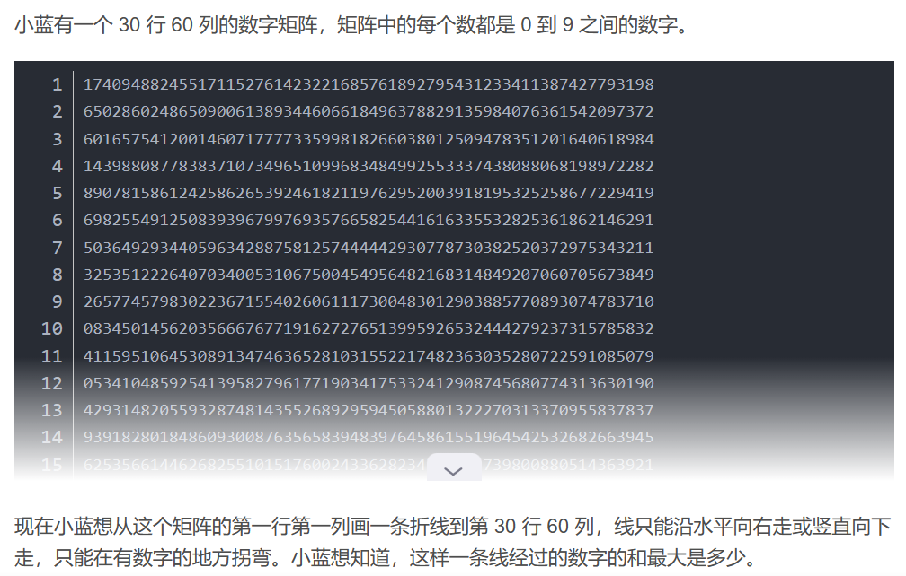

题目思路：


题目代码：

```
// 答案：592
#include <bits/stdc++.h>
using namespace std;

const int m = 30, n = 60;

char mat[m + 1][n + 2]; // mat: matrix
int dp[m + 1][n + 1];

int main() {
    for (int i = 1; i <= m; i ++) {
        cin >> (mat[i] + 1);
    }
    for (int i = 1; i <= m; i ++) {
        for (int j = 1; j <= n; j ++) {
            dp[i][j] = max(dp[i - 1][j], dp[i][j - 1]) + mat[i][j] - '0';
        }
    }
    cout << dp[m][n] << endl;
    return 0;
}
```

### 题目来源：蓝桥杯-2013省赛-格子刷油漆

题目描述：  
 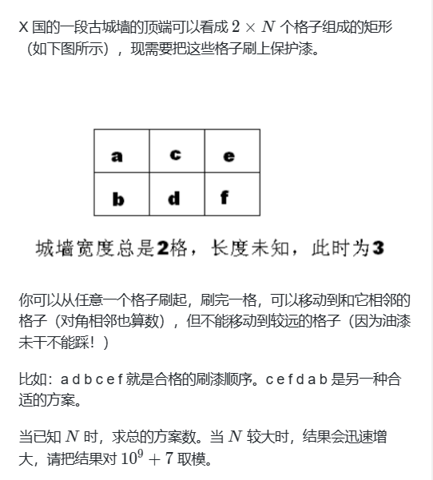

题目思路：


题目代码：

```
在这里插入代码片
```

### 题目来源：蓝桥杯-2021省赛-覆盖

题目描述：  
 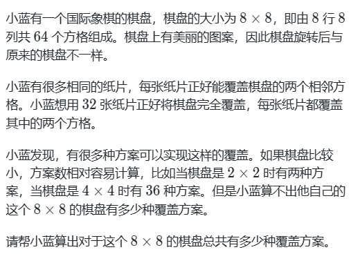

题目思路：

> [大佬题解](https://blog.csdn.net/qq_43449564/article/details/123056414)

题目代码：

```
在这里插入代码片
```

## No.4 树状dp

> 树状dp知识点链接[博客园链接](https://www.cnblogs.com/RioTian/p/15163878.html)

### 题目来源：蓝桥杯-第六届-生命之树

题目描述：  
 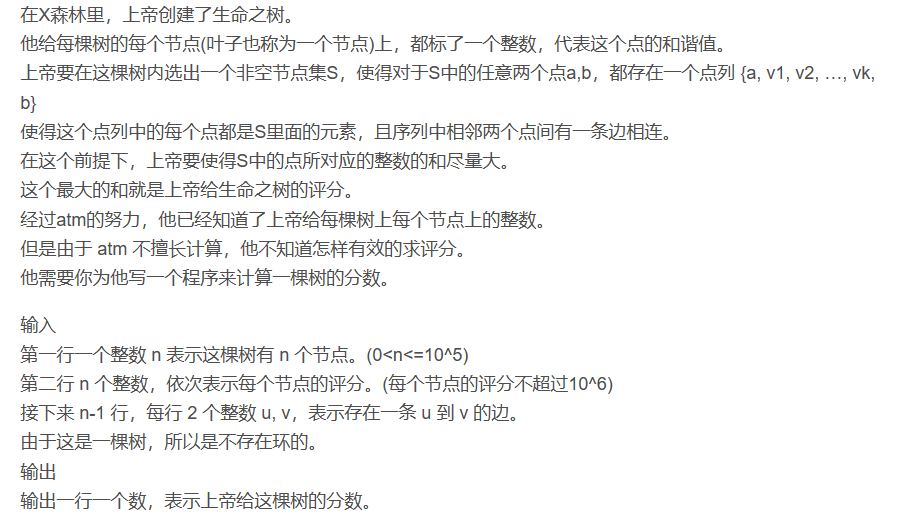

题目思路：

> 总的来说就是 给你一个树，然后每个节点赋个权值，然后让你找一个连通区域，使得这个区域内的权值和 最大。然后用树状dp，，从最底层的树，然后逐渐到最上层的根节点，然后定义dp[i],和状态转移方程；再用dfs进行 写个函数 用来 使得 dp[i] 进行更新。

题目代码：

```
//对于N要进行适应性的更改，对于字段错误
#include<bits/stdc++.h>
using namespace std;
#define inf 0x3f3f3f3f
#define N 100100
#define LL long long
int n,m,k,g,d;
int x,y,z,t;
char ch;
string str;
vector<int>v[N];

LL f[N];
LL res;
//从最底层开始  进行 计算，，然后递归到 根节点，， 
void dfs(int bt,int fa){
	for(int i=0;i<v[bt].size();i++){
		int son=v[bt][i];
		if(son!=fa){//遍历结点son的除父节点以外的所有结点，也就是遍历所有子树
			dfs(son,bt);//接着向下一层子结点遍历
			f[bt]=max(f[bt],f[bt]+f[son]);
			
		}
	}
}
int main() {
	cin>>n;
	int w[n+1];
	for(int i=1;i<=n;i++){
		cin>>w[i];
		f[i]=w[i];
	} 
	for(int i=1;i<n;i++){
		cin>>x>>y;
		v[x].push_back(y);
		v[y].push_back(x);
	}
	dfs(1,-1);
	
	for(int i=1;i<=n;i++)res = max(res,f[i]);
	
	cout<<res<<endl;
	return 0;
}
```

### 题目来源：LeetCode-343-整数拆分

题目描述：  
 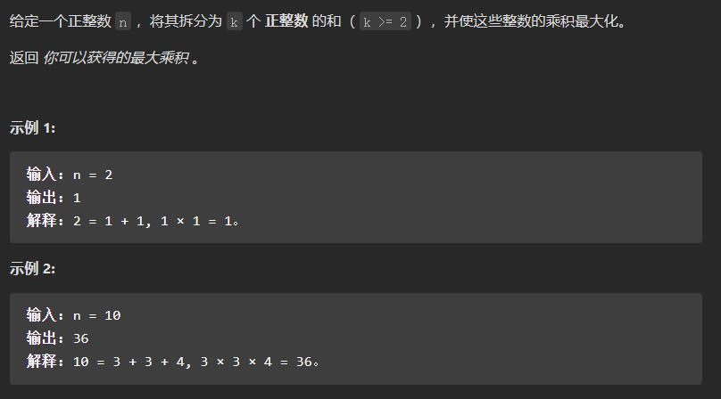

题目思路：

题目代码：

```
class Solution {
public:
    int integerBreak(int n) {

        //dp
        //先定义表示 dp[i] i的乘积最大化
        int dp[n+1];
        //初始化
        dp[1]=1;
        dp[2]=1;

        //状态转移方程：
        // dp[n]=max(dp[n-1]*1,dp[n-2]*2,.....);好像涉及到选还是不选了吗？

        for(int i=3;i<=n;i++){
            dp[i]=dp[i-1];
            for(int j=1;j<i;j++){
                // 这个还是不是很理解 多了的  j*(i-j);例子是 
                //也可以这么理解，j * (i - j) 是单纯的把整数拆分为两个数相乘，而j * dp[i - j]是拆分成两个以及两个以上的个数相乘。
                dp[i]=max({dp[i],j*(i-j),dp[i-j]*j});
            }
        }


        return dp[n];


    }
};
```

## No.5 状压DP

### 题目来源：蓝桥杯-2015省赛-铺瓷砖

题目描述：

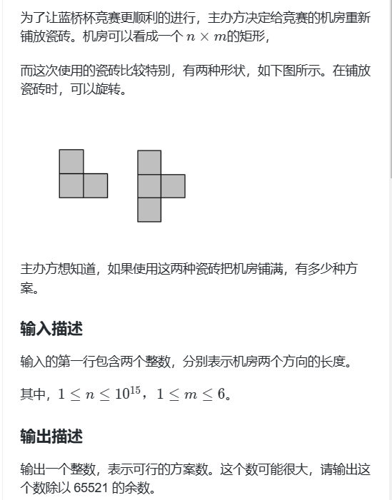

题目思路：


题目代码：

## No.n 背包问题筑基

> 请先学习下知识点，道友！  
>  题目知识点大部分来源于此：[闫氏DP分析法](https://www.acwing.com/problem/content/video/2/)
>
> 题目例题大部分来源于此：[Acwing的各自背包问题](https://www.acwing.com/problem/)

## No.n+1 01背包

### 引言：内容介绍

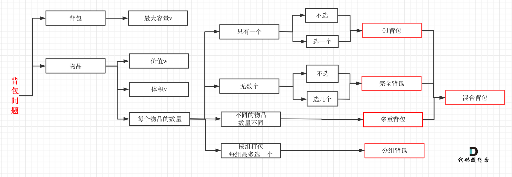

> 关于 01 背包:如下图所示；因为有1个可选，即每个物品即处于两种状态：选和不选；  
>  那么如果暴力进行选取的话，就是2^n 时间复杂度；不可行；进而才需要动态规划的解法来进行优化！也是从下面的往后面的进行推进的；

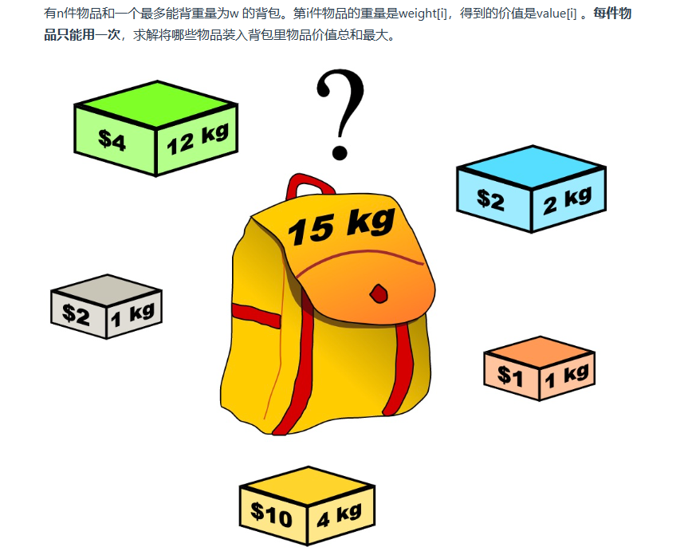

> 按照动态规划的五部曲进行 的话：  
>  首先是1：dp数组的定义：dp[i] [j] 从前面的i个物件中选取，装在容量j 的所得到到最大价值。  
>  2：确定递推关系式子：因为是两种情况，放和不放，即： dp[i][j] = max(dp[i - 1][j], dp[i - 1][j - weight[i]] + value[i]);  
>  3：初始化：等等  
>  4：遍历顺序

```
void test_2_wei_bag_problem1() {
    vector<int> weight = {1, 3, 4};
    vector<int> value = {15, 20, 30};
    int bagweight = 4;

    // 二维数组
    vector<vector<int>> dp(weight.size(), vector<int>(bagweight + 1, 0));

    // 初始化
    for (int j = weight[0]; j <= bagweight; j++) {
        dp[0][j] = value[0];
    }

    // weight数组的大小 就是物品个数
    for(int i = 1; i < weight.size(); i++) { // 遍历物品
        for(int j = 0; j <= bagweight; j++) { // 遍历背包容量
            if (j < weight[i]) dp[i][j] = dp[i - 1][j];
            else dp[i][j] = max(dp[i - 1][j], dp[i - 1][j - weight[i]] + value[i]);

        }
    }

    cout << dp[weight.size() - 1][bagweight] << endl;
}

int main() {
    test_2_wei_bag_problem1();
}
```

### 之前的模板

```
最简单的0-1背包问题：
//对于N要进行适应性的更改，对于字段错误
#include<bits/stdc++.h>
using namespace std;
#define inf 0x3f3f3f3f
#define N 100100
int n,m,k,g,d;
int x,y,z;
char ch;
string str;
vector<int>v[N];
int v[N];
int w[N];
int f[N][N];

int main() {
    //0-1背包
    cin>>n>>m;
    for(int i=1;i<=n;i++){
        cin>>v[i]>>w[i];
    }
    for(int i=1;i<=n;i++){
        for(int j=0;j<=m;j++){
            f[i][j]=f[i-1][j];
            if(j>=v[i]){
                f[i][j]=max(f[i][j],f[i-1][j-v[i]]+w[i]);
            }
        }
    }
    cout<<f[n][m]<<endl;
	return 0;
}


//变成一位的问题：尽量用这个
//对于N要进行适应性的更改，对于字段错误
#include<bits/stdc++.h>
using namespace std;
#define inf 0x3f3f3f3f
#define N 100100
int n,m,k,g,d;
int x,y,z;
char ch;
string str;
int v[N];
int w[N];
int f[N];
int main() {
    //0-1背包
    cin>>n>>m;
    for(int i=1;i<=n;i++){
        cin>>v[i]>>w[i];
    }
    for(int i=1;i<=n;i++){
        for(int j=m;j>=0;j--){
            if(j<v[i]){
                    f[j]=f[j];
            }else{
                f[j]=max(f[j],f[j-v[i]]+w[i]);
            }
        }
    }
    cout<<f[m]<<endl;
	return 0;
}


//完全背包问题：：
#include<iostream>
using namespace std;
const int N = 1010;
int f[N][N];
int v[N],w[N];
int main()
{
    int n,m;
    cin>>n>>m;
    for(int i = 1 ; i <= n ;i ++)
    {
        cin>>v[i]>>w[i];
    }

    for(int i = 1 ; i<=n ;i++)
    for(int j = 0 ; j<=m ;j++)
    {
        for(int k = 0 ; k*v[i]<=j ; k++)
            f[i][j] = max(f[i][j],f[i-1][j-k*v[i]]+k*w[i]);
    }

    cout<<f[n][m]<<endl;
}


//求能够达到最大的价值的方案数量，就是有好多种选择可以使得所选的物品价值最大；；
//背包求方案数：：
路径跟踪 g[i][j]g[i][j]
状态表示g(i,j)g(i,j)—集合： 考虑前 i 个物品，当前已使用体积恰好是 j 的，且 价值 为最大的方案

状态表示g(i,j)g(i,j)—属性： 方案的数量 SumSum
状态转移g(i,j)g(i,j)：

如果fi,j=fi−1,jfi,j=fi−1,j 且 fi,j=fi−1,j−v+wfi,j=fi−1,j−v+w 则 gi,j=gi−1,j+gi−1,j−vgi,j=gi−1,j+gi−1,j−v
如果fi,j=fi−1,jfi,j=fi−1,j 且 fi,j≠fi−1,j−v+wfi,j≠fi−1,j−v+w 则 gi,j=gi−1,jgi,j=gi−1,j
如果fi,j≠fi−1,jfi,j≠fi−1,j 且 fi,j=fi−1,j−v+wfi,j=fi−1,j−v+w 则 gi,j=gi−1,j−vgi,j=gi−1,j−v
初始状态：g[0][0] = 1


#include <iostream>
#include <cstring>

using namespace std;

const int N = 1010, mod = 1e9 + 7;

int n, m;
int w[N], v[N];
int f[N][N], g[N][N];

int main()
{
    cin >> n >> m;
    for (int i = 1; i <= n; ++ i) cin >> v[i] >> w[i];

    for (int i = 1; i <= n; ++ i)
    {
        for (int j = 0; j <= m; ++ j)
        {
            f[i][j] = f[i - 1][j];
            if (j >= v[i]) f[i][j] = max(f[i][j], f[i - 1][j - v[i]] + w[i]);
        }
    }
    g[0][0] = 1;
    for (int i = 1; i <= n; ++ i)
    {
        for (int j = 0; j <= m; ++ j)
        {
            if (f[i][j] == f[i - 1][j])
                g[i][j] = (g[i][j] + g[i - 1][j]) % mod;
            if (j >= v[i] && f[i][j] == f[i - 1][j - v[i]] + w[i])
                g[i][j] = (g[i][j] + g[i - 1][j - v[i]]) % mod;
        }
    }
    int res = 0;
    for (int j = 0; j <= m; ++ j)
    {
        if (f[n][j] == f[n][m])
        {
            res = (res + g[n][j]) % mod;
        }
    }
    cout << res << endl;
    return 0;
}


//求具体的方案数；
//看凑零钱那个就行了；
```

### 题目来源：PTA-L3-001 凑零钱

题目描述：  
 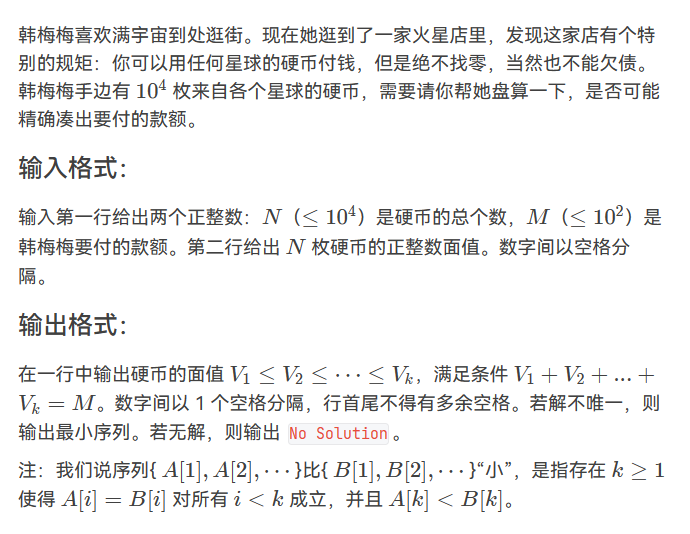

题目思路：

题目代码：

```
#include<bits/stdc++.h>
using namespace std;
#define N 10001
int value[N]={0};
int dp[N][N]={0};
int choose[N][N]={0}; //在加之最大未N时候，第N件物品是否选择‘
bool cmp(int x,int y){
    return x>y;
}
int main()
{
    int n,m;
    cin>>n>>m;
    for(int i=1;i<=n;i++){
        cin>>value[i];
    }
    sort(value+1,value+1+n,cmp);

    for(int i=1;i<=n;i++){
        for(int j=1;j<=m;j++){
            dp[i][j]=dp[i-1][j];
            if(j>=value[i]){
                dp[i][j]=max(dp[i][j] ,value[i]+ dp[i-1][j-value[i]]);
                if( dp[i][j]==value[i]+ dp[i-1][j-value[i]]){
                    choose[i][j]=1;
                }
            }
        }
    }
    if(dp[n][m]!=m){
        cout<<"No Solution"<<endl;
        return 0;
    }

    vector<int>ans;
    for(int i=n,j=m ; i>=1&& j>=0 ; i--){
        if(choose[i][j])
        {
            ans.push_back(value[i]);
            j=j-value[i];
        }
    }
    for(int i=0;i<ans.size();i++){
        if(i==0)cout<<ans[i];
        else cout<<" "<<ans[i];
    }
return 0;
}
```

### 题目来源：PTA-L3-2 拼题A打卡奖励

题目描述：

题目思路：

题目代码：

```
#include<bits/stdc++.h>
using namespace std;
#define inf 0x3f3f3f3f
#define N 100100
int n,k,g,d;
int x,y,z;
long long m;
char ch;
string str;
int v[N];
int w[N];

int main() {

    //0-1背包
    cin>>n>>m;
    int sumtimt=0;
    int sumvalue=0;
    for(int i=1;i<=n;i++){
        cin>>v[i];
        sumtimt+=v[i];
    }
    for(int i=1;i<=n;i++){
        cin>>w[i];
        sumvalue+=w[i];
    }
    if(sumtimt<=m){
        cout<<sumvalue<<endl;
        return 0;
    }
    int f[m+1]={0};//适者生存；；；；
    for(int i=1;i<=n;i++){
        for(int j=m;j>=0;j--){
            if(j<v[i]){
                    f[j]=f[j];
            }else{
                    f[j]=max(f[j], f[j-v[i]]+w[i]);
            }
        }
    }
    cout<<f[m]<<endl;
	return 0;
}
```

### 题目来源：蓝桥杯-第十届-质数拆分

题目描述：  
 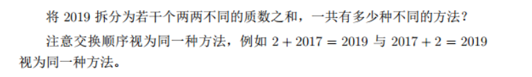

题目思路：

题目代码：

```
//对于N要进行适应性的更改，对于字段错误
#include<bits/stdc++.h>
using namespace std;
#define inf 0x3f3f3f3f
#define N 30100000
#define mod 1000000007
long long n;
long long f[N];
int res;
int m,k,g,d;
int x,y,z,t;
char ch;
string str;
vector<int>v[N];

vector<int>ans;

long long dp[2500][2500];
void is_zhi(){
	int flag=0;
	ans.push_back(2);
	for(int i=3;i<=2019;i++){
		flag=0;
		for(int j=2;j<=sqrt(i);j++){
			if(i%j==0){
				flag=1;
				break;
			}
		}
		if(flag==0)ans.push_back(i);
	}
}
int main() {
	ans.push_back(0);
	
	is_zhi();
	n = ans.size();
	dp[0][0]=1;//dp[i][j]：从前 i 个物品中选，且总体积恰好为 j 的方案的数量
	
	for(int i=1;i<n;i++){
		
		for(int j=0;j<=2019;j++){
			// 选或者不选
			////j<prime[i] 相当于当前最后一个质数取不了 相当于只能用前i-1个
     		 //j>=prime[j] 除了dp[i-1][j]可以取到j 
     		 //还能看dp[i-1][j-prime[i]]有多少种情况 这是算上了第i个质数的情况
     		dp[i][j]=dp[i-1][j];
			if(j>=ans[i]){
				dp[i][j]+= dp[i-1][j-ans[i]];
			} 
		}
	}
	cout<<dp[n-1][2019];
	
	return 0;
}
```

### 题目来源：蓝桥杯-第十四届模拟-第二期 质数拆分

题目描述：  
 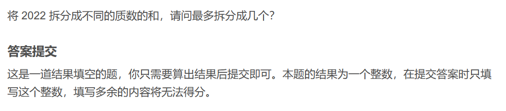

题目思路：


题目代码：

### 01背包状态压缩

#### 0/1 背包问题逻辑整理

##### 1. 二维矩阵：逐行计算的结构

动态规划的核心在于构建一个决策矩阵。每一行代表“增加一个新物品可选”，每一列代表“背包容量的变化”。

|  | 容量 0 | 容量 1 | 容量 2 | … | 容量  j − w i j-w\_i j−wi​ | … | 容量  j j j | … | 容量  V V V |
| --- | --- | --- | --- | --- | --- | --- | --- | --- | --- |
| **物品 1** | d p [ 1 ] [ 0 ] dp[1][0] dp[1][0] | d p [ 1 ] [ 1 ] dp[1][1] dp[1][1] | d p [ 1 ] [ 2 ] dp[1][2] dp[1][2] | … | … | … | … | … | d p [ 1 ] [ V ] dp[1][V] dp[1][V] |
| **物品 2** | d p [ 2 ] [ 0 ] dp[2][0] dp[2][0] | d p [ 2 ] [ 1 ] dp[2][1] dp[2][1] | d p [ 2 ] [ 2 ] dp[2][2] dp[2][2] | … | **参考点** | … | **目标点** | … | d p [ 2 ] [ V ] dp[2][V] dp[2][V] |
| **物品 3** | d p [ 3 ] [ 0 ] dp[3][0] dp[3][0] | d p [ 3 ] [ 1 ] dp[3][1] dp[3][1] | d p [ 3 ] [ 2 ] dp[3][2] dp[3][2] | … | … | … | … | … | d p [ 3 ] [ V ] dp[3][V] dp[3][V] |

##### 2. 二维计算的依赖规律

在计算矩阵中的某一个位置（例如 **物品 2** 的 **目标点 
d
p
[
2
]
[
j
]
dp[2][j]
dp[2][j]**）时，其值的来源仅受**上一行**（物品 1）的影响：

1. **正上方的值**：
   d
   p
   [
   1
   ]
   [
   j
   ]
   dp[1][j]
   dp[1][j]（代表不选物品 2，直接继承上一行的结果）。
2. **左上方的值**：
   d
   p
   [
   1
   ]
   [
   j
   −
   w
   i
   ]
   dp[1][j - w\_i]
   dp[1][j−wi​]（代表选了物品 2，腾出空间后，参考上一行剩余容量的最优解）。

**结论：** 计算当前行时，**只需要上一行的同列位置和左侧列位置**。这一行左侧的数据在计算当前点时是不需要的。

---

##### 3. 状态压缩：从二维到一维的演变

由于每一行的计算仅仅依赖于前一行的数据，我们可以将多行矩阵压缩为**一行数组** 
d
p
[
V
+
1
]
dp[V+1]
dp[V+1]。

- **覆盖逻辑**：计算物品 
  i
  i
  i 时，这一行数组里原本存的是物品 
  i
  −
  1
  i-1
  i−1 的结果。我们直接在原位置更新（覆盖）它，使其变成物品 
  i
  i
  i 的结果。

##### 4. 0/1 背包的关键：为什么要“从后往前”？

在一维数组中，为了保证更新当前位置时，参考的是\*\*“上一行”**的数据，必须采用**倒序遍历（从 
V
V
V 到 
0
0
0）\*\*。

- **逻辑证明**：
  - 当我们从后往前更新时，计算大容量 
    d
    p
    [
    j
    ]
    dp[j]
    dp[j] 需要参考左侧的小容量 
    d
    p
    [
    j
    −
    w
    i
    ]
    dp[j-w\_i]
    dp[j−wi​]。
  - 因为是从右往左走的，此时左侧的小容量位置**还没有被更新**，它们依然保存着“上一行”留下的旧值。
  - 这就完美符合了 0/1 背包“每个物品只能用一次”的要求。
- **反面教材（正序）**：
  - 如果从前往后（正序）更新，左侧的小容量位置会先被更新成“当前行”的新值。
  - 当算到右侧大容量时，参考的就是新值（意味着物品被多次放入），这会把 0/1 背包错误地变成完全背包。

---

**整理总结：**

1. **二维**：一行一行算，每一格看上一行的正上方和左上方。
2. **压缩**：只需一行空间，不断覆盖。
3. **倒序**：0/1 背包的命门，为了防止“左上方”的旧数据被提前覆盖。

## No.n+2 完全背包问题

### 题目来源：蓝桥杯-第八届-包子凑数

题目描述：  
 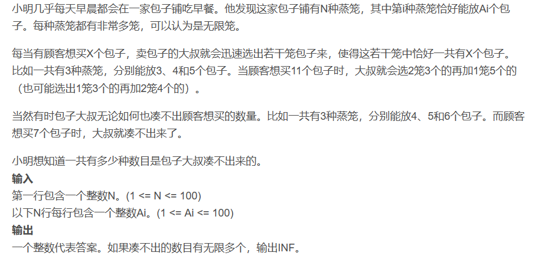

题目思路：

> 扩展欧几里德变形的，有个定理。如果满足所有数的最大公约数不为1则有无穷个，否则都是有限个。然后利用完全背包就可以统计了

题目代码：

```
#include<iostream>
#include<cstdio>
using namespace std;
const int N = 100005;
int arr[105], n, brr[N];
int gcd(int a, int b){
	if(a%b==0) return b;
	return gcd(b, a%b);
}
 
int main()
{
	scanf("%d", &n);
	for(int i=0; i<n; ++i){
		scanf("%d", &arr[i]);
	}
	int g = arr[0];
	for(int i=1; i<n; ++i){
		g = gcd(g, arr[i]);
	} 
	
	if(g != 1){
		printf("INF\n");
		return 0;
	}
	brr[0] = 1;
	for(int i=0; i<n; ++i){
		for(int j=arr[i]; j<N; ++j){
			if(brr[j-arr[i]])brr[j] = 1;
		}
	}
	
	int cnt = 0;
	for(int i=0; i<N; ++i){
		if(!brr[i]) cnt++;
	}
	printf("%d", cnt);
	return 0;
 }
```

### 完全背包压缩

#### 完全背包问题：深度解析与矩阵演变

理解了 0/1 背包的“倒序”逻辑后，学习\*\*完全背包（Complete Knapsack）\*\*会非常快，因为它们就像是一枚硬币的正反面。

#### 1. 完全背包的规则

- **0/1 背包**：每个物品只有 1 件。选了就没法再选（要么拿 0 件，要么拿 1 件）。
- **完全背包**：每个物品有**无数件**。只要背包装得下，你可以一直往里塞同一个物品（可以拿 0, 1, 2, … k 件）。

---

#### 2. 二维逻辑的微小差异（决定性的差异）

我们对比一下两者的转移方程：

- **0/1 背包**：  
   `dp[i][j] = max(dp[i-1][j], dp[i-1][j - w[i]] + v[i])`  
   \*注意：选了物品 i 之后，要去\*\*上一行（i-1）\**找剩下容量的最大价值。*
- **完全背包**：  
   `dp[i][j] = max(dp[i-1][j], dp[i][j - w[i]] + v[i])`  
   \*注意：选了物品 i 之后，依然在\*\*这一行（i）\**找剩下容量的最大价值。*

**为什么是这一行（i）？**  
 因为物品有无数件。当你拿了一个物品 
i
i
i 之后，你依然处于“可以选物品 
i
i
i”的状态，所以你要参考的是**已经考虑过放入物品 
i
i
i 后的状态**（即这一行左侧已经算出的结果）。

---

#### 3. 大尺寸矩阵决策演示（核心对比）

假设背包容量 
V
=
7
V=7
V=7，有两个物品：

- **物品 A**：重量 2，价值 10
- **物品 B**：重量 3，价值 20

##### (1) 完全背包大矩阵推导过程：

每一格的决策：`max(上方旧值, 左侧[当前容量-当前重量]的新值 + 当前价值)`

| 物品 \ 容量 | 0 | 1 | 2 | 3 | 4 | 5 | 6 | 7 | 决策逻辑分析 |
| --- | --- | --- | --- | --- | --- | --- | --- | --- | --- |
| **初始(空)** | 0 | 0 | 0 | 0 | 0 | 0 | 0 | 0 | 无物品可选 |
| **物品 A(重2,价10)** | 0 | 0 | **10** | 10 | **20** | 20 | **30** | 30 | 此时 A 可以无限连拿 |
| **物品 B(重3,价20)** | 0 | 0 | 10 | **20** | 20 | **30** | **40** | **40** | B 与 A 的组合最优解 |

**重点格子分析：**

- **物品 A 行，容量 4**：由于 A 可无限拿，它参考的是 `dp[A][4-2]`（即同一行容量为 2 时的 10）。结果为 
  10
  +
  10
  =
  20
  10+10=20
  10+10=20。
- **物品 B 行，容量 6**：它参考的是 `dp[B][6-3]`（即同一行容量为 3 时的 20）。结果为 
  20
  +
  20
  =
  40
  20+20=40
  20+20=40。（代表拿了 2 个 B）
- **物品 B 行，容量 5**：它参考的是 `dp[B][5-3]`（即同一行容量为 2 时的 10）。结果为 
  10
  +
  20
  =
  30
  10+20=30
  10+20=30。（代表拿了 1 个 B + 1 个 A）

##### (2) 依赖路径图示：

- **0/1 背包（斜向依赖）**：  
   `dp[i-1][j-w]` 
  ↘
  \searrow
  ↘ `dp[i][j]`  
   *（必须从上一行跳下来，保证物品不重复）*
- **完全背包（水平依赖）**：  
   `dp[i-1][j]` 
  ↓
  \downarrow
  ↓  
   `dp[i][j-w]` 
  →
  \rightarrow
  → `dp[i][j]`  
   *（可以从同一行的左侧跳过来，代表物品的累加）*

---

#### 4. 一维压缩：为什么要正序？

在一维数组优化时：

- **0/1 背包**为了避开“这一行”的新数据，被迫**倒着走**。
- **完全背包**为了利用“这一行”的新数据，恰恰需要**正着走**！

##### 正序推导过程（例子）：

物品 A：重量 2，价值 10。背包容量 5。  
 数组 `dp` 初始：`[0, 0, 0, 0, 0, 0]`

1. **j = 2**：能放 A。`dp[2] = max(0, dp[2-2] + 10) = 10`。
2. **j = 3**：能放 A。`dp[3] = max(0, dp[3-2] + 10) = 10`。
3. **j = 4**：能放 A。重点来了！
   - 我们要看 `dp[4-2]` 也就是 `dp[2]`。
   - 此时 `dp[2]` 已经在刚才第 1 步更新成了 **10**。
   - 计算：`10 (dp[2]新值) + 10 (物品价值) = 20`。
   - **物理意义**：我们在容量为 2 的基础上又放了一个物品 A，总共放了两个 A。
4. **j = 5**：
   - 看 `dp[5-2]` 也就是 `dp[3]`。
   - 计算：`10 (dp[3]新值) + 10 = 20`。

**这就是正序的神奇之处：** 它允许状态从小容量转移到大容量时，不断累加同一个物品。

---

#### 5. 总结你的整理笔记

你可以这样记录完全背包的压缩原理：

1. **核心规则**：物品无限选，因此当前状态 `dp[j]` 依赖于**当前行**左侧已经更新过的状态 `dp[j - w_i]`。
2. **压缩机制**：同样使用一维数组覆盖，但由于我们需要利用“这一行”的新结果，所以必须\*\*从左往右（正序）\*\*遍历。
3. **对比结论**：
   - **0/1 背包倒序**：为了拿到**上一行**的旧值（保证物品只用一次）。
   - **完全背包正序**：为了拿到**这一行**的新值（允许物品多次使用）。

---

#### 6.一个有趣的直观感受：

- **0/1 背包**：你是一个精明的商人，进货单上每个商品只有一件，你必须根据昨天的库存表（上一行）来决定今天要不要拿。为了不搞混，你得从货架最右边开始看，确保参考的每一项都是昨天的旧数据。
- **完全背包**：你是一个批发商，仓库里货多的是。你今天刚把一件货放进背包，发现还能放，就原地转身（参考这一行左边的结果）又拿了一件一模一样的塞了进去。你正着走，就是为了能不断看到自己刚刚放进去的东西，然后决定要不要“再来一个”。

**总结：**

- **0/1 背包**：**倒序**遍历 = **躲避**新值 = **只用一次**。
- **完全背包**：**正序**遍历 = **迎接**新值 = **无限多次**。

**你的理解完全正确！** 这是一个非常深刻且到位的总结。

为了巩固你的理解，我们把你的这段话转化成标准的算法逻辑表述：

##### 1. 0/1 背包的依赖逻辑（你的理解：全看上一行）

- **不拿**：`dp[i][j] = dp[i-1][j]` —— 直接继承**上一行**同列的值。
- **拿**：`dp[i][j] = dp[i-1][j - w[i]] + v[i]` —— 参考**上一行**左侧的值。
- **核心点**：无论拿不拿，都只看\*\*“上一行”\*\*（即还没开始处理当前物品时的“旧世界”）。
- **所以压缩时**：必须**从后往前**算，防止“上一行”的旧数据被这一行的新数据过早覆盖。

##### 2. 完全背包的依赖逻辑（你的理解：拿的话看这一行）

- **不拿**：`dp[i][j] = dp[i-1][j]` —— 依然是继承**上一行**同列的值（代表一个都不拿）。
- **拿**：`dp[i][j] = dp[i][j - w[i]] + v[i]` —— 参考**这一行**左侧的值。
- **核心点**：如果拿，就看\*\*“这一行”\*\*（即已经处理过当前物品、可能已经放过该物品的状态）。
- **所以压缩时**：必须**从前往后**算，因为我们刚好需要用到这一行左边刚刚更新好的“新数据”。

---

##### 3.用矩阵坐标再感受一下这个精妙的差异：

如果我们把 `dp[i][j]` 看作坐标：

- **0/1 背包的眼光**：

  ```
  (i-1, j-w)  (i-1, j)
        \        |
         \       |
          -> (i, j)
  ```

  *它的眼睛永远盯着**上方**。*
- **完全背包的眼光**：

  ```
  (i-1, j)
     |
     |
  (i, j-w) -> (i, j)
  ```

  *它的眼睛盯着**上方**和**左边**。*

---

##### 4.总结你的结论（整理至笔记）：

| 背包类型 | 决策：不拿 | 决策：拿 | 压缩后的遍历顺序 |
| --- | --- | --- | --- |
| **0/1 背包** | 参考上一行 `dp[i-1][j]` | 参考**上一行**左侧 `dp[i-1][j-w]` | **倒序** (V  → \to → 0) |
| **完全背包** | 参考上一行 `dp[i-1][j]` | 参考**这一行**左侧 `dp[i][j-w]` | **正序** (0  → \to → V) |

**你已经完全掌握了背包问题的精髓！** 这种通过依赖关系（坐标指向）来判断遍历顺序的思考方式，是解决所有复杂动态规划问题的“万能钥匙”。以后遇到变种背包（比如多重背包），你只要画出这个依赖关系，就知道该怎么压缩、该怎么写循环了。
