# 【完整题单08、常用数据结构(优先级队列)】【✅✅✅✅】

> 来源：[【完整题单08、常用数据结构(优先级队列)】【✅✅✅✅】](https://blog.csdn.net/weixin_51429773/article/details/129372205) · 发布时间：2026-06-14 · 阅读量：公开

#### 目录

- [知识框架](#_2)
- [No.0 筑基](#No0__4)
- [No.1 LeetCode 快速选择模块](#No1_LeetCode__9)
- - [题目来源：LeetCode-215. 数组中的第K个最大元素](#LeetCode215_K_11)
  - [题目来源：LeetCode-347. 前 K 个高频元素](#LeetCode347__K__142)
  - [题目来源：LeetCode-295. 数据流的中位数](#LeetCode295__234)
  - [题目来源：LeetCode-973. 最接近原点的 K 个点](#LeetCode973__K__309)
  - [题目来源：LeetCode-1985. 找出数组中的第 K 大整数](#LeetCode1985__K__386)
  - [题目来源：LeetCode-324. 摆动排序 II](#LeetCode324__II_466)
  - [题目来源：LeetCode-2343. 裁剪数字后查询第 K 小的数字](#LeetCode2343__K__561)
- [No.2 一元优先级队列](#No2__631)
- - [题目来源：LeetCode-239. 滑动窗口最大值[❌]](#LeetCode239__632)
  - [题目来源：LeetCode-506. 相对名次](#LeetCode506__751)
  - [题目来源：LeetCode-1356-根据数字二进制下 1 的数目排序](#LeetCode1356_1__797)
- [No.3 二元优先级队列](#No3__895)
- - [题目来源：蓝桥杯-2022c++B组-J：打印沙漏](#2022cBJ_896)

## 知识框架

## No.0 筑基

> 请先学习下知识点，道友！  
>  题目知识点大部分来源于此:  
>  对于第K个数字就是快速选择。  
>  对于前K个数字就是基本的操作sort。

## No.1 LeetCode 快速选择模块

### 题目来源：LeetCode-215. 数组中的第K个最大元素

题目描述：  
 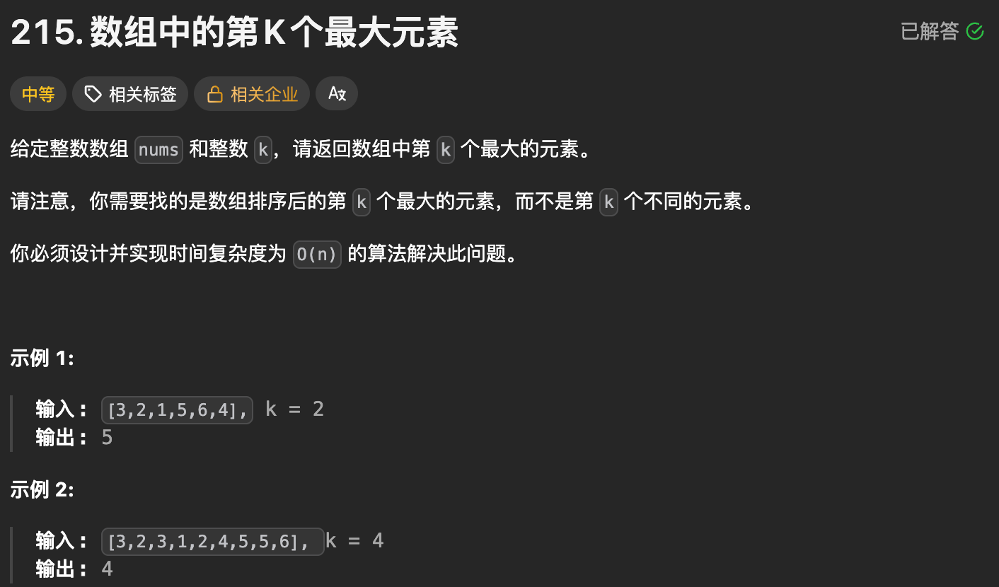

题目思路：

题目代码：

```
class Solution {
public:
    // 在子数组 [left, right] 中随机选择一个基准元素 pivot
    // 根据 pivot 重新排列子数组 [left, right]
    // 重新排列后，<= pivot 的元素都在 pivot 的左侧，>= pivot 的元素都在 pivot 的右侧
    // 返回 pivot 在重新排列后的 nums 中的下标
    // 特别地，如果子数组的所有元素都等于 pivot，我们会返回子数组的中心下标，避免退化
    int partition(vector<int>& nums, int left, int right) {
        // 1. 在子数组 [left, right] 中随机选择一个基准元素 pivot
        int i = left + rand() % (right - left + 1);
        int pivot = nums[i];
        // 把 pivot 与子数组第一个元素交换，避免 pivot 干扰后续划分，从而简化实现逻辑
        swap(nums[i], nums[left]);

        // 2. 相向双指针遍历子数组 [left + 1, right]
        // 循环不变量：在循环过程中，子数组的数据分布始终如下图
        // [ pivot | <=pivot | 尚未遍历 | >=pivot ]
        //   ^                 ^     ^         ^
        //   left              i     j         right

        i = left + 1;
        int j = right;
        while (true) {
            while (i <= j && nums[i] < pivot) {
                i++;
            }
            // 此时 nums[i] >= pivot

            while (i <= j && nums[j] > pivot) {
                j--;
            }
            // 此时 nums[j] <= pivot

            if (i >= j) {
                break;
            }

            // 维持循环不变量
            swap(nums[i], nums[j]);
            i++;
            j--;
        }

        // 循环结束后
        // [ pivot | <=pivot | >=pivot ]
        //   ^             ^   ^     ^
        //   left          j   i     right

        // 3. 把 pivot 与 nums[j] 交换，完成划分（partition）
        // 为什么与 j 交换？
        // 如果与 i 交换，可能会出现 i = right + 1 的情况，已经下标越界了，无法交换
        // 另一个原因是如果 nums[i] > pivot，交换会导致一个大于 pivot 的数出现在子数组最左边，不是有效划分
        // 与 j 交换，即使 j = left，交换也不会出错
        swap(nums[left], nums[j]);

        // 交换后
        // [ <=pivot | pivot | >=pivot ]
        //               ^
        //               j

        // 返回 pivot 的下标
        return j;
    }
    int findKthLargest(vector<int>& nums, int k) {

        int n = nums.size();
        srand(time(NULL));
        // 第K个最大的，从小到达排序；
        int target_index = n - k; // 找下标。


        int left = 0, right = n - 1;
        while(true){
            int pos = partition(nums, left, right);
            if(pos == target_index){
                return nums[pos];
            }else if(pos < target_index){
                left = pos + 1;
            }else if(pos > target_index){
                right = pos - 1;
            }
        }
        return nums[left];
    }
};
```

```
class cmp{
public:
        bool operator()(const int& a, const int& b) {
        return a > b;
    }
};
class Solution {
public:
    int findKthLargest(vector<int>& nums, int k) {

        int size = nums.size();
        priority_queue<int, vector<int>,cmp>q;
        

        for(int i=0;i<k;i++){
            q.push(nums[i]);
        }
        for(int i=k;i<size;i++){
            int temp = q.top();
            if(nums[i] > temp){
                q.pop();
                q.push(nums[i]);
            }
        }
        return q.top();
        
    }
};
```

### 题目来源：LeetCode-347. 前 K 个高频元素

题目描述：  
 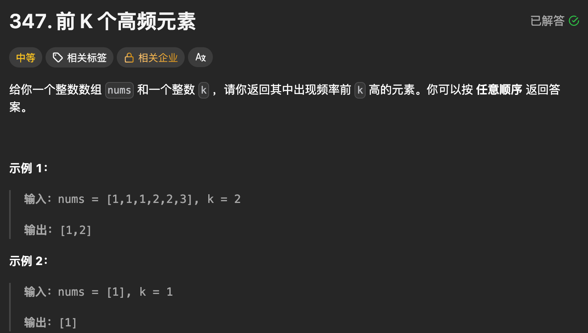

题目思路：

> 像这种 K个的就是数量多的，就必须要进行其它的简单的方法  
>  不能使用上面的快速选择的方法了。

题目代码：

```
class Solution {
public:
    vector<int> topKFrequent(vector<int>& nums, int k) {
        int n = nums.size();
        if(n == 0)return {};
        unordered_map<int, int>mp;
        int maxNums = 0;
        for(auto & tt : nums){
            mp[tt]++;
            maxNums = max(maxNums, mp[tt]);
        }

        vector<vector<int>>ans(maxNums + 1);
        for(auto & tmp : mp){
            ans[tmp.second].push_back(tmp.first);
        }

        vector<int>res;
        int now_sum = 0;
        for(int i = maxNums; i >= 0; i--){
            int now_size = ans[i].size();
            for(auto & tt : ans[i])res.push_back(tt);
            now_sum += now_size;
            if(res.size() == k)break;
        }
        return res;
    }
};


class cmp{
public:
        bool operator()(const std::pair<int,int>& a, const std::pair<int,int>& b) {
            return a.second > b.second;
    }
};

class Solution {
public:
    static bool cmp(pair<int, int>& m, pair<int, int>& n) {
        return m.second > n.second;
    }
    vector<int> topKFrequent(vector<int>& nums, int k) {
        int size = nums.size();
        vector<pair<int,int>>ans;

        map<int,int>mp;
        set<int>sc;
        for(size_t i = 0; i<size;i++){
            mp[  nums[i] ]++;
            sc.insert(  nums[i]);
        }
        priority_queue<pair<int,int>, vector<pair<int,int>>, decltype(&cmp)> q(cmp);
        for(auto i:sc){
            if(mp[i] > 0){
                if(q.size()<k){
                    q.push(pair<int,int>(i,mp[i]));
                }else{
                    int temp = q.top().second;
                    if(mp[i] > temp){
                        q.pop();
                        q.push(pair<int,int>(i,mp[i]));
                    }
                }
            }
        }
        vector<int>res;
        while(q.size()){
            res.push_back( q.top().first );
            q.pop();
        }
        return res;


    }
};
```

### 题目来源：LeetCode-295. 数据流的中位数

题目描述：  
 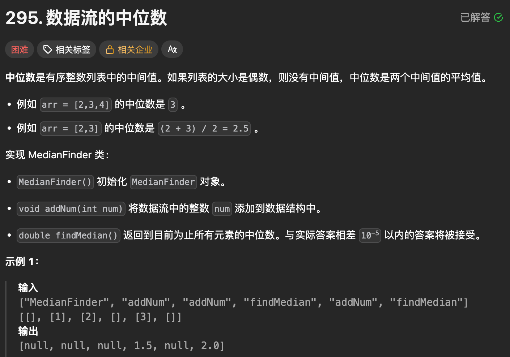

题目思路：

题目代码：

```
class MedianFinder {
    priority_queue<int> left; // 最大堆 保持左边的多一个元素如果是奇数个。
    priority_queue<int, vector<int>, greater<>> right; // 最小堆

public:
    void addNum(int num) {

        if (left.size() == right.size()) {
            right.push(num);
            left.push(right.top());
            right.pop();
        } else {
            left.push(num);
            right.push(left.top());
            left.pop();
        }
    }

    double findMedian() {
        if (left.size() > right.size()) {
            return left.top();
        }
        return (left.top() + right.top()) / 2.0;
    }
};


class MedianFinder {
    priority_queue<int> left; // 最大堆
    priority_queue<int, vector<int>, greater<>> right; // 最小堆

public:
    void addNum(int num) {
        if (left.size() == right.size()) {
            right.push(num);
            left.push(right.top());
            right.pop();
        } else {
            left.push(num);
            right.push(left.top());
            left.pop();
        }
    }

    double findMedian() {
        if (left.size() > right.size()) {
            return left.top();
        }
        return (left.top() + right.top()) / 2.0;
    }
};

/**
 * Your MedianFinder object will be instantiated and called as such:
 * MedianFinder* obj = new MedianFinder();
 * obj->addNum(num);
 * double param_2 = obj->findMedian();
 */
```

### 题目来源：LeetCode-973. 最接近原点的 K 个点

题目描述：  
 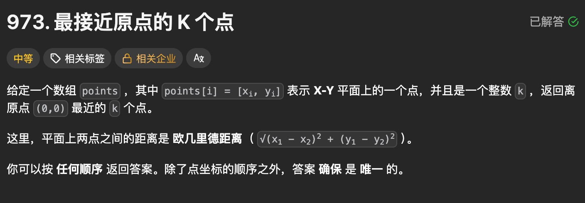

题目思路：

题目代码：

```
class Solution {
public:
    static bool cmp(const pair<int, int>&a, const pair<int, int>& b){
        if(a.first == b.first)return a.second < b.second;
        return a.first < b.first;
    }
    vector<vector<int>> kClosest(vector<vector<int>>& points, int k) {
        int n = points.size();
        vector<pair<int, int>>ans;

        for(int i = 0; i < n; i++){
            auto tmp = points[i];
            auto dst = tmp[0] * tmp[0] + tmp[1] * tmp[1];
            ans.push_back({dst, i});
        }
        sort(ans.begin(), ans.end(), cmp);

        vector<vector<int>>res;
        for(int i = 0; i < k; i++){
            int pos = ans[i].second;
            res.push_back(points[pos]);
        }
        return res;
    }
};


class Solution {
public:
    static bool cmp(vector<int>& m, vector<int>& n) {
        return (m[0]*m[0] + m[1]*m[1]) < (n[0]*n[0] + n[1]*n[1]);
    }
    vector<vector<int>> kClosest(vector<vector<int>>& points, int k) {
        int size = points.size();
        
        vector<vector<int>>res;
        priority_queue<vector<int>, vector<vector<int>>, decltype(&cmp)> q(cmp);
        for(int i=0;i<k;i++){
            q.push(points[i]);
        }
        for(int i=k;i<size;i++){
            int x1 = q.top()[0];
            int y1 = q.top()[1];
            int x2 = points[i][0];
            int y2 = points[i][1];
            if((x2*x2+y2*y2) < (x1*x1 + y1*y1)){
                q.pop();
                q.push(points[i]);
            }
        }
        while(q.size()){
            res.push_back(q.top());
            q.pop();
        }
        return res;
    }
};
```

### 题目来源：LeetCode-1985. 找出数组中的第 K 大整数

题目描述：  
 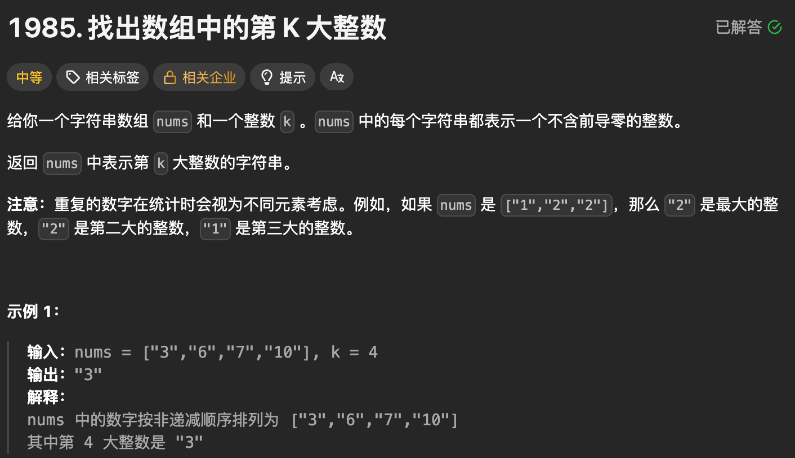

题目思路：

- 优先级队列，这样排序之后呢 是 大的在前，小的在后，然后呢 pop和top都是小的。
- 还有就是 尽量 保持K 个 不要all in 优先级队列。

题目代码：

```
class Solution {
public:
    static bool cmp(const string &a, const string &b){
        if(a.size() == b.size()){
            for(int i = 0; i < a.size(); i++){
                if(a[i] > b[i])return true;
                if(a[i] < b[i])return false;
            }
        }
        return a.size() > b.size();
    }
    string kthLargestNumber(vector<string>& nums, int k) {


        sort(nums.begin(), nums.end(), cmp);
        return nums[k - 1];   
    }
};


class cmp{
public:
        bool operator()(const std::string& a, const std::string& b) {
        // 如果长度不同，较长的字符串表示的整数较大
        if (a.length() != b.length()) {
            return a.length() > b.length();
        }
        // 长度相同，逐位比较
        for (size_t i = 0; i < a.length(); ++i) {
            if (a[i] != b[i]) {
                return a[i] > b[i];
            }
        }
        // 如果所有位都相同，则认为两个字符串表示的整数相等
        return true;
    }
};

class Solution {
public:
    string kthLargestNumber(vector<string>& nums, int k) {


        //这种快速选择的还是整成优先级队列
        priority_queue<string, vector<string>,cmp>q;
        int size = nums.size();
        for(int i = 0; i < k; ++i){
            q.push(nums[i]);
        }
        for(int i = k;i< size;++i){
            string temp = q.top();
            if(cmp()(nums[i] , temp)){
                q.pop();
                q.push(nums[i]);
            }
        }
        string res = q.top();
        return res;
    }
};
```

### 题目来源：LeetCode-324. 摆动排序 II

题目描述：  
 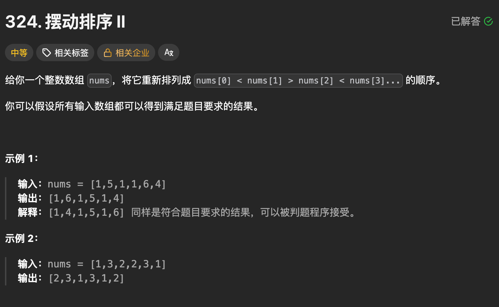

题目思路：

```
先是自己的版本但是呢 不对；特殊清苦不过

nums =

[4,5,5,6]

添加到测试用例

**标准输出**

4556

**输出**

[4,5,5,6]

**预期结果**

[5,6,4,5]


当出现重复的时候 会特殊

假设 n个元素；那么最多有  n+1 / 2 ; 用反证法进行证明的；

还是看题解吧这个
```

题目代码：

```
class Solution {
public:
    void wiggleSort(vector<int>& nums) {

        //也就是说 先截取 一半的最前面的；然后再再将其放在1 3 5 7 、、、
        int size = nums.size();
        vector<int>res(size);
        sort(nums.begin(),nums.end());
        int half = 0;
        if(size%2==0){
            half = size / 2;
        }else{
            half = size / 2 + 1;
        }
        for(int i = 0;i<half;i++){
            int pos = i * 2;
            res[pos] = nums[i];
        }
        int pos = half;
        for(int i = 1;i<size;i = i+2){
            res[i] = nums[pos++];
        }
        for(int i =0;i<size;i++){
            nums[i] = res[i];
        }
        for(auto &ss:nums){
            cout<<ss;
        }
    }
};


class Solution {
public:
    void wiggleSort(vector<int>& nums) {
        // 对于 void 的函数 进行 更改原始的数据即可.
        int n = nums.size();
        vector<int> arr = nums;
        sort(arr.begin(), arr.end());
        int x = (n + 1) / 2;
        for(int i =0, j=x-1, k=n-1; i<n; i+=2 , j--, k--){
            nums[i] = arr[j];
            if(i+1 < n){
                nums[i+1]=arr[k];
            }
        }


   
    }
};
```

### 题目来源：LeetCode-2343. 裁剪数字后查询第 K 小的数字

题目描述：  
 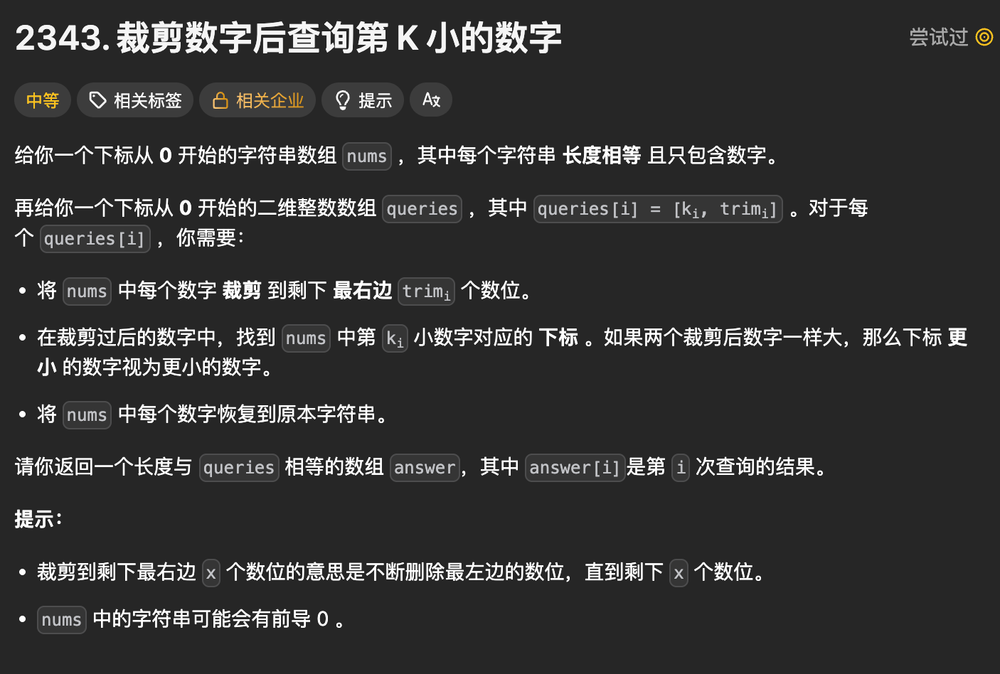

题目思路：

```
需要比较字符串

也是个难题  超时
```

题目代码：

```
class cmp{
public:
        bool operator()(pair<string,int> x,pair<string,int> y) {
        std::string a = x.first;
        std::string b = y.first;
        // 如果长度不同，较长的字符串表示的整数较大
        if (a.length() != b.length()) {
            return a.length() < b.length();
        }
        // 长度相同，逐位比较
        for (size_t i = 0; i < a.length(); ++i) {
            if (a[i] != b[i]) {
                return a[i] < b[i];
            }
        }
        // 如果所有位都相同，则认为两个字符串表示的整数相等
        return x.second < y.second;
        return true;
    }
};
class Solution {
public:

    vector<int> smallestTrimmedNumbers(vector<string>& nums, vector<vector<int>>& queries) {
        
        int size = nums.size();
        vector<int>res;
        for(int i= 0;i<queries.size();i++){
            int k = queries[i][0];
            int lengthToTake = queries[i][1];
                    // 对于每个query 进行 截取然后 插入
            priority_queue<pair<string,int>, vector<pair<string,int>>,cmp>q;
            for(int j = 0;j<k;j++){
                string str = nums[j];
                string lastPart = str.substr(str.length() - lengthToTake);
                //int num = stoi(lastPart);
                q.push(pair<string,int>(lastPart,j));
            }
            for(int j =k;j<nums.size();j++){
                string str = nums[j];
                string lastPart = str.substr(str.length() - lengthToTake);
                //int num = stoi(lastPart);
                if( cmp()(pair<string,int>(lastPart,j) ,pair<string,int>(q.top().first,q.top().second))){
                    q.pop();
                    q.push(pair<string,int>(lastPart,j));
                }
            }
            res.push_back(q.top().second);


        }
        return res;
    }
};
```

## No.2 一元优先级队列

### 题目来源：LeetCode-239. 滑动窗口最大值[❌]

题目描述：  
 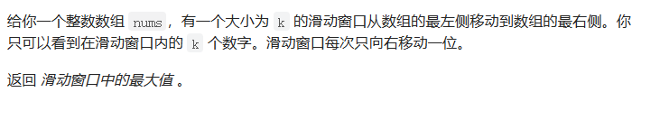

题目思路：

题目代码：

```
class Solution {
public:
    vector<int> maxSlidingWindow(vector<int>& nums, int k) {
        int n = nums.size();
        deque<int>q;

        // 维持单调递减的 一个 数字序列
        // 差不多就是维持一个 临时最大的 数组
        for(int i = 0; i < k - 1; i++){
            while(!q.empty() && nums[i] >= nums[q.back()]){
                q.pop_back();
            }
            q.push_back(i);
        }

        // 开始第 k 个
        vector<int>res;
        for(int i = k - 1; i < n; i++){
            int now_num = nums[i];

            while(!q.empty() && now_num >= nums[q.back()]){
                q.pop_back();
            }
            q.push_back(i);
            // 把前面的给赶出去
            while(!q.empty() && q.front() <= i - k){
                q.pop_front();
            }

            // 现在的第一个就是在范围内的了
            res.push_back(nums[q.front()]);
        }
        return res;
    }
};
```

```
//对于N要进行适应性的更改，对于字段错误
#include<bits/stdc++.h>
using namespace std;
#define inf 0x3f3f3f3f
#define N 100100
int n,m,k,g,d;
int x,y,z,t;
char ch;
string str;
vector<int>v[N];

int main() {
    vector<int>nums;
    vector<int>ans;
    priority_queue<pair<int,int>>q;
    cin>>n>>k;
    for(int i=0;i<k;i++){
        cin>>x;
        q.push({x,i});
    }
    ans.push_back(q.top().first);
    for(int i=k;i<n;i++){
        cin>>x;
        q.push({x,i});
        while(q.top().second<=i-k){
            q.pop();
        }
        ans.push_back(q.top().first);

    }
    for(auto i:ans)cout<<i<<endl;

    return 0;
}
```

```
class Solution {
public:
    vector<int> maxSlidingWindow(vector<int>& nums, int k) {
        // 这个的话, 去了解下 priority_queue<pair<int, int>> q;的性质
        int n = nums.size();

        int left = 0;
        int right = 0 + k - 1;
        priority_queue<pair<int, int>> q;

        for(int i = 0; i <= right; i++){
            q.push(std::pair(nums[i], i));
        }

        vector<int>res;
        res.push_back(q.top().first);
        for( right++; right < n; right++){
            // 开始加入新的，然后删除旧的
            q.push(std::pair(nums[right], right));
            // 如果我们 根据位置left删除旧的话要暴力了，
            // 我们只需要判断现在的top是不是left左侧的就行了就行了感觉
            
            left++;
            while(q.top().second < left){
                q.pop(); // pop之后会自动调整的
            }
            res.push_back(q.top().first);
        }
        return res;

    }
};
```

### 题目来源：LeetCode-506. 相对名次

题目描述：  
 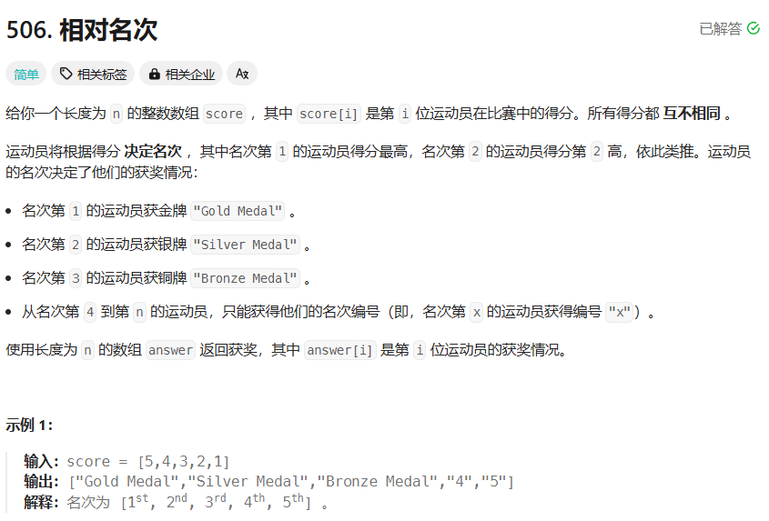

题目思路：

> 也是可以考虑pair  
>  然后存储 数据+index；然后根据数据排序；  
>  然后最后直接res 利用pc.second  
>  一个简单的优先级队列

题目代码：

```
class Solution {
public:
    vector<string> findRelativeRanks(vector<int>& score) {
        int size = score.size();
        vector<pair<int,int>>pc;
        vector<string>res(size);
        for(int i = 0; i < score.size(); ++i){
            pc.push_back(make_pair(score[i], i ));
        }

        sort(pc.begin(),pc.end(),[](pair<int,int> a, pair<int,int> b){
            return a.first > b.first;
        });

        for(int i = 0;i < score.size(); ++i){
            if(i==0){
                res[ pc[i].second ] = "Gold Medal";
            }else if(i == 1){
                res[ pc[i].second ] = "Silver Medal";
            }else if(i==2){
                res[ pc[i].second ] = "Bronze Medal";
            }else{
                res[ pc[i].second ] = to_string(i+1);
            }
        }
        return res;
    }
};
```

### 题目来源：LeetCode-1356-根据数字二进制下 1 的数目排序

题目描述：  
 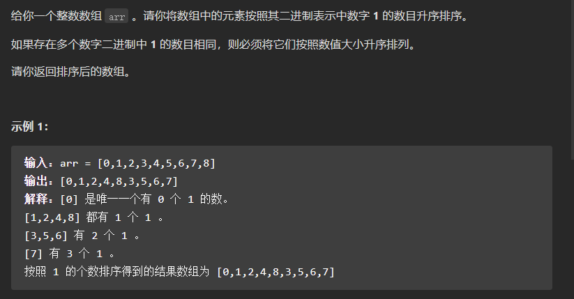

题目思路：

题目代码：

```
class Solution {
public:
    static bool com(const pair<int, int> &a, const pair<int, int>&b){
        if(a.first == b.first)return a.second < b.second;
        return a.first < b.first;
    }
    vector<int> sortByBits(vector<int>& arr) {

        vector<pair<int,int>>ans;

        for(int i=0;i<arr.size();i++){
            int sum = popcount((uint32_t)arr[i]);
            ans.push_back({sum,arr[i]});
        }
        sort(ans.begin(), ans.end(), com);
        vector<int>res;
        for(auto &aa : ans)res.push_back(aa.second);
        return res;
    }
};


class Solution {
public:
    static bool com(const pair<int, int> &a, const pair<int, int>&b){
        if(a.first == b.first)return a.second < b.second;
        return a.first < b.first;
    }
    vector<int> sortByBits(vector<int>& arr) {

        vector<pair<int,int>>ans;

        for(int i=0;i<arr.size();i++){
            int x=arr[i];
            int sum=0;
            while(x){
                if(x%2==1){
                    sum++;
                }
                x=x/2;
            }
            ans.push_back({sum,arr[i]});
        }
        sort(ans.begin(), ans.end(), com);
        vector<int>res;
        for(auto &aa : ans)res.push_back(aa.second);
        return res;
    }
};


class Solution {
public:
    vector<int> sortByBits(vector<int>& arr) {

        priority_queue<pair<int,int>>q;

        for(int i=0;i<arr.size();i++){
            int x=arr[i];
            int sum=0;
            while(x){
                if(x%2==1){
                    sum++;
                }
                x=x/2;
            }
            q.push({sum,arr[i]});
        }
        vector<int>res;
        while(!q.empty()){
            res.push_back(q.top().second);
            q.pop();
        }
        reverse(res.begin(),res.end());
        return res;

    }
};
```

## No.3 二元优先级队列

### 题目来源：蓝桥杯-2022c++B组-J：打印沙漏

题目描述：  
 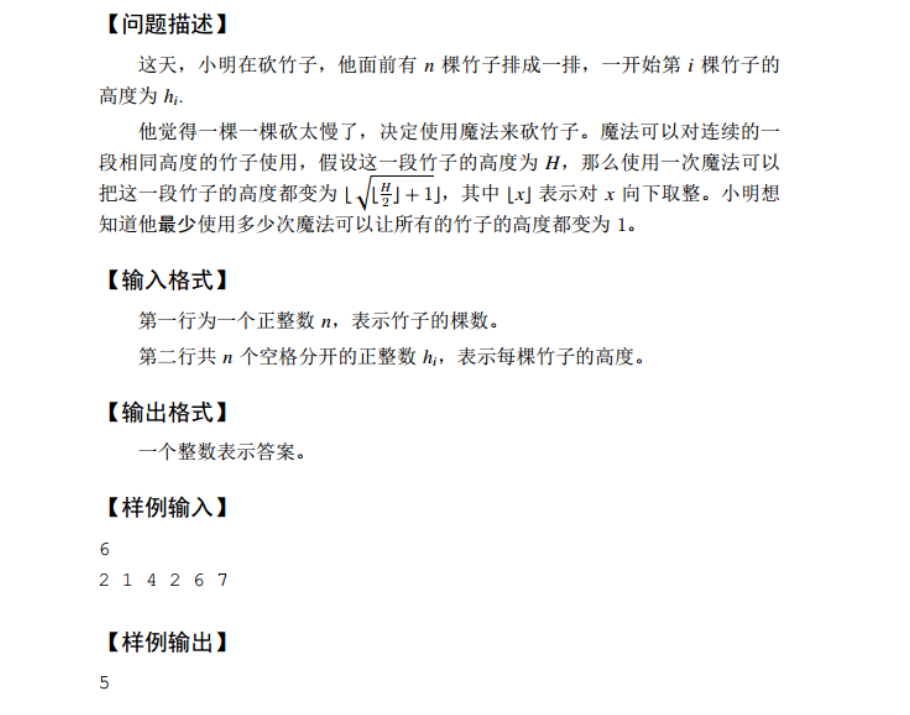

题目思路：


题目代码：

```
//先说 暴力的代码：
//这个代码有问题，不行
#include<bits/stdc++.h>
using namespace std;
#define inf 0x3f3f3f3f
#define N 100100
typedef long long LL;
int n,m,k,g,d;
int x,y,z,h;
char ch;
string str;
vector<LL>v[N];

int main() {
    cin>>n;
    LL cnt=0;
    map<LL,int>mp1,mp2;
    //下一列的竹子，只能随着前面一排的竹子随着；即i要看i-1 的；
    // 对于第一个特殊处理
    cin>>h;
    while(h>1){
        mp1[h]=1;
        cnt++;
        h=sqrtl((h/2)+1);
    }

    for(int i=1;i<n;i++){
        cin>>h;

        while(h>1){
            mp2[h]=1;
            if(mp1.find(h)==mp1.end())cnt++;
            h=sqrtl((h/2)+1);
        }
        mp1=mp2;
        mp2.clear();
    }
    cout<<cnt<<endl;
	return 0;
}


// 这个代码是可以的；
#include<bits/stdc++.h>
using namespace std;
typedef long long LL;
const int N = 200010;

int n;
vector<LL> e[N];
void solve()
{
	cin >> n;
	vector<LL> a;
  LL x;
  for(int i=0;i<n;i++){
    cin>>x;
    a.push_back(x);
  }

	LL ans = 0;
	for (int i = 0; i < n; ++i) {
		LL v = a[i];
		while (v > 1) {
			e[i].push_back(v);
			v = sqrtl(v / 2 + 1);
			ans++;
		}
	}
	for (int i = 1; i < n; ++i) {
		for (LL x : e[i - 1]) {
			for (LL v : e[i]) {
				if (x == v) ans--;
			}
		}
	}
	cout << ans << '\n';
}
int main()
{
	solve();
	return 0;
}


//再说 优先级队列的代码
```
