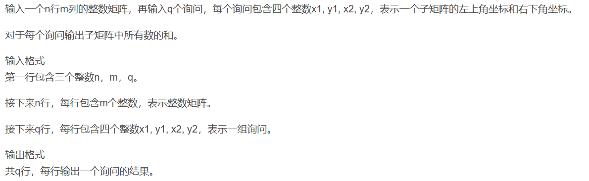
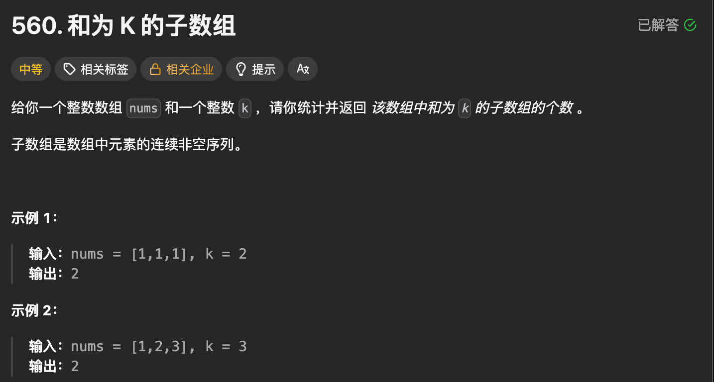
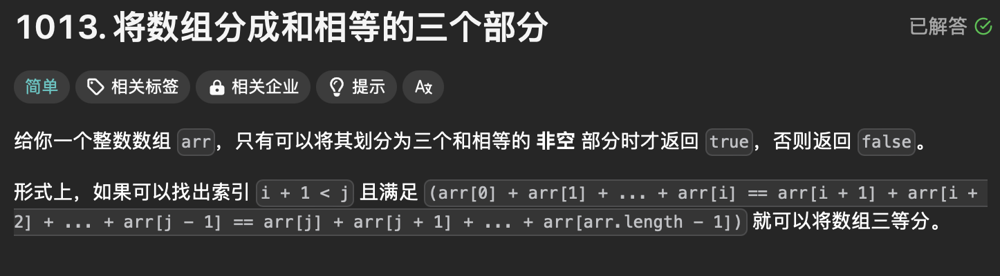
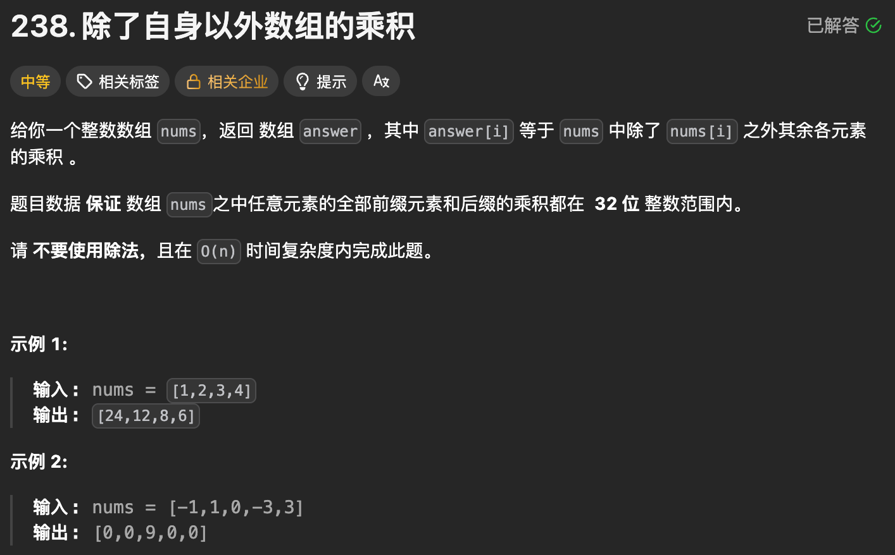
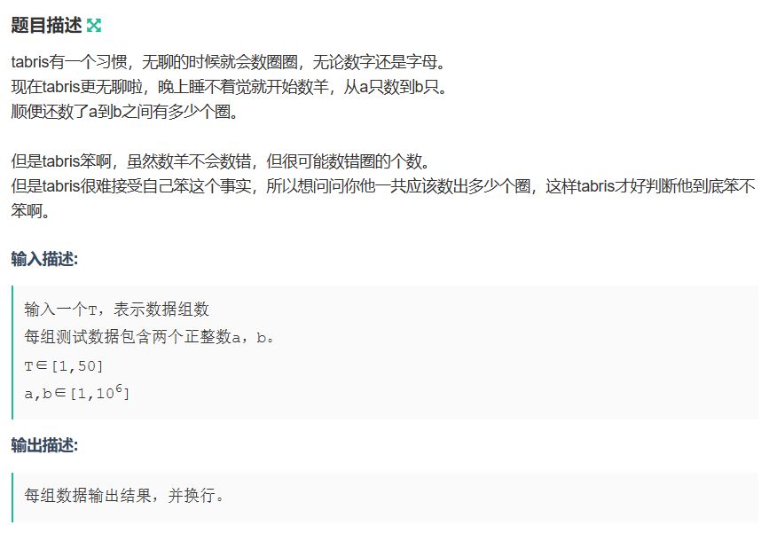
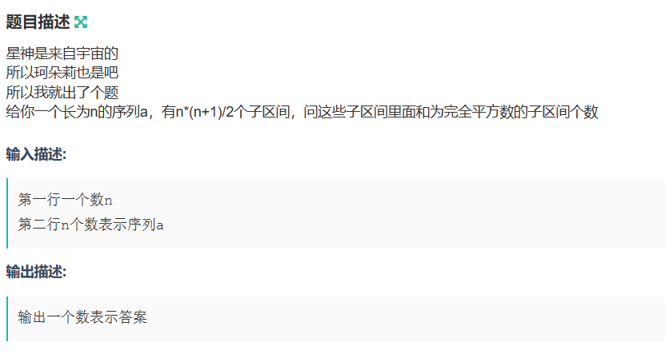
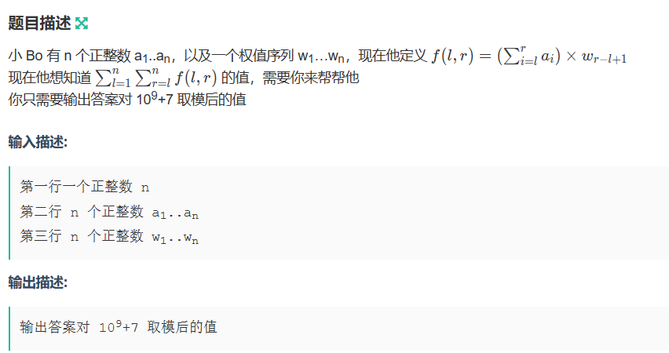

#### 目录

- [知识框架](#_2)
- [No.0 筑基](#No0__4)
- [No.1一维前缀和](#No1_13)
- [No.2 二维前缀和](#No2__20)
- - [题目来源：Acwing-796. 子矩阵的和](#Acwing796__21)
- [No.3 普通前缀和](#No3__76)
- - [题目来源：LeetCode-560. 和为 K 的子数组](#LeetCode560__K__80)
  - [题目来源：LeetCode-1013. 将数组分成和相等的三个部分](#LeetCode1013__142)
  - [题目来源：LeetCode-238. 除了自身以外数组的乘积](#LeetCode238__183)
  - [题目来源：牛客网-NC14556：数圈圈](#NC14556_276)
  - [题目来源：牛客网-NC14600：珂朵莉与宇宙](#NC14600_329)
  - [题目来源：牛客网-NC21195 ：Kuangyeye and hamburgers](#NC21195_Kuangyeye_and_hamburgers_385)
  - [题目来源：牛客网-NC19798：区间权值](#NC19798_434)
  - [题目来源：牛客网-NC15035：送分了qaq](#NC15035qaq_495)
- [No.4 leetcode的之前做的前缀和](#No4_leetcode_552)
- - [前缀和+哈希表](#_558)
  - [滑动窗口模板](#_564)
  - [[209. 长度最小的子数组](https://leetcode.cn/problems/minimum-size-subarray-sum/)：滑动窗口](#209_httpsleetcodecnproblemsminimumsizesubarraysum_617)
  - [[238. 除自身以外数组的乘积](https://leetcode.cn/problems/product-of-array-except-self/) 前缀和+后缀和](#238_httpsleetcodecnproblemsproductofarrayexceptself__648)
  - [[1004. 最大连续1的个数 III](https://leetcode.cn/problems/max-consecutive-ones-iii/)：滑动窗口](#1004_1_IIIhttpsleetcodecnproblemsmaxconsecutiveonesiii_682)
  - [[1124. 表现良好的最长时间段](https://leetcode.cn/problems/longest-well-performing-interval/)：前缀和+单调栈](#1124_httpsleetcodecnproblemslongestwellperforminginterval_714)
  - [[724. 寻找数组的中心下标](https://leetcode.cn/problems/find-pivot-index/)：前缀和](#724_httpsleetcodecnproblemsfindpivotindex_781)
  - [[560. 和为 K 的子数组](https://leetcode.cn/problems/subarray-sum-equals-k/)：前缀和+哈希表](#560__K_httpsleetcodecnproblemssubarraysumequalsk_811)
  - [[1248. 统计「优美子数组」](https://leetcode.cn/problems/count-number-of-nice-subarrays/):前缀和+哈希表](#1248_httpsleetcodecnproblemscountnumberofnicesubarrays_841)
  - [[974. 和可被 K 整除的子数组](https://leetcode.cn/problems/subarray-sums-divisible-by-k/)：前缀和+哈希表](#974__K_httpsleetcodecnproblemssubarraysumsdivisiblebyk_881)
  - [[523. 连续的子数组和](https://leetcode.cn/problems/continuous-subarray-sum/)：前缀和+哈希表](#523_httpsleetcodecnproblemscontinuoussubarraysum_911)
  - [[930. 和相同的二元子数组](https://leetcode.cn/problems/binary-subarrays-with-sum/)：前缀和+哈希表](#930_httpsleetcodecnproblemsbinarysubarrayswithsum_942)
  - [[904. 水果成篮](https://leetcode.cn/problems/fruit-into-baskets/)：滑动窗口+哈希表](#904_httpsleetcodecnproblemsfruitintobaskets_971)
  - [[904. 水果成篮](https://leetcode.cn/problems/fruit-into-baskets/)：滑动窗口+哈希表](#904_httpsleetcodecnproblemsfruitintobaskets_1047)

## 知识框架

## No.0 筑基

> 请先学习下知识点，道友！  
>  题目知识点大部分来源于此：[前缀和](https://oi-wiki.org/basic/prefix-sum/)
>
> 题目例题大部分来源于此：

## No.1一维前缀和

```
S[i] = a[1] + a[2] + ... a[i]
a[l] + ... + a[r] = S[r] - S[l - 1]
```

## No.2 二维前缀和

### 题目来源：Acwing-796. 子矩阵的和

题目描述：  
 

题目思路：

> 模板：

```
S[i, j] = 第i行j列格子左上部分所有元素的和
以(x1, y1)为左上角，(x2, y2)为右下角的子矩阵的和为：
S[x2, y2] - S[x1 - 1, y2] - S[x2, y1 - 1] + S[x1 - 1, y1 - 1]
```

题目代码：

```
#include <iostream>

using namespace std;

const int N = 1010;

int n, m, q;
int a[N][N], s[N][N];

int main()
{
    scanf("%d%d%d", &n, &m, &q);//因为数据规模比较大所以建议用scanf
    for (int i = 1; i <= n; i ++ )
    {
        for (int j = 1; j <= m; j ++ ) scanf("%d", &a[i][j]);
    }
    
    for (int i = 1; i <= n; i ++ )
    {
        for (int j = 1; j <= m; j ++ ) s[i][j] = s[i][j - 1] + s[i - 1][j] - s[i - 1][j - 1] + a[i][j];
    }//初始化前缀和数组
    
    while (q--)
    {
        int x1, y1, x2, y2;
        scanf("%d%d%d%d", &x1, &y1, &x2, &y2);
        printf("%d\n", s[x2][y2] - s[x1 - 1][y2] - s[x2][y1 - 1] + s[x1 - 1][y1 - 1]);
    }//询问
    
    return 0;
}//该代码引用AcWing网站的代码
```

## No.3 普通前缀和

### 题目来源：LeetCode-560. 和为 K 的子数组

题目描述：



题目思路：

> 前缀和+hash

题目代码：

```
class Solution {
public:
    int subarraySum(vector<int>& nums, int k) {
        //因为是子数组即一段数组的和，前缀和
        // 连续 非空
        // 如果整好前缀和之后
        // 那么问题演变为   right - left 位置 == k
        // 变成 哈希了感觉 后位置 = 前位置 + k 前面做hash的find
        // 也不对，这样也仅仅是记录个数，没有全部找到,,,
        // 应该来个map
        int n = nums.size();
        int res = 0;
        std::vector<int>sum_q(n + 1, 0);
        map<int, int>mp;
        mp[0] = 1;
        sum_q[0] = 0;
        for(int i = 1; i <= n; i++){
            sum_q[i] = sum_q[i - 1] + nums[i - 1];

            // res = res+ mp[sum_q[i] - k];
            res += mp.contains(sum_q[i] - k) ? mp[sum_q[i] - k] : 0;
            mp[sum_q[i]]++;
        }
        return res;
    }
};
```

```
// 时间复杂度较高的版本
int subarraySum(vector<int>& nums, int k){
  int n = nums.size();
  if(n == 0)return 0;
  // 因为是个数
  // 感觉其实在 求前缀和的时候 就可以和 前面的计算 全部了;
  // 一定要记住 用 h_sum[0] = 0;
  int res = 0;
  vector<int> h_sum(n + 1, 0);

  for(int i = 1; i <= n; i++){
    h_sum[i] = h_sum[i - 1] + nums[i - 1];
    for(int j = 0; j < i; j++){ // 0即是本身
      if(h_sum[i] - h_sum[j] == k)res++;
    }
  }
  return res;
}
```

### 题目来源：LeetCode-1013. 将数组分成和相等的三个部分

题目描述：



题目思路：


题目代码：

```
class Solution {
public:
    bool canThreePartsEqualSum(vector<int>& arr) {
        // 这个挺巧妙的;       
        /// 简单贪心， 先求累和球 / 3；
        int n = arr.size();
        
        vector<int>q_sum(n + 1, 0);
        for(int i = 1; i <= n; i++){
            q_sum[i] = q_sum[i - 1] + arr[i - 1];
        }
        
        int total = q_sum[n];
        int can_total = total / 3;
        if(can_total * 3 != total)return false;

        for(int i = 1; i <= n - 2; i++){
            if(q_sum[i] == can_total){
                for(int j = i + 1; j <= n - 1; j++){
                    if(q_sum[j] == 2*can_total)return true;
                }
            }
        }
        return false;
    }
};
```

### 题目来源：LeetCode-238. 除了自身以外数组的乘积

题目描述：



题目思路：


题目代码：

```
class Solution {
public:
    vector<int> productExceptSelf(vector<int>& nums) {
        int n = nums.size();
        vector<int> suf(n);
        suf[n - 1] = 1;
        for (int i = n - 2; i >= 0; i--) {
            suf[i] = suf[i + 1] * nums[i + 1];
        }

        int pre = 1;
        for (int i = 0; i < n; i++) {
            // 此时 pre 为 nums[0] 到 nums[i-1] 的乘积，直接乘到 suf[i] 中
            suf[i] *= pre;
            pre *= nums[i];
        }

        return suf;
    }
};
```

```
class Solution {
public:
    vector<int> productExceptSelf(vector<int>& nums) {
        // 不能进行除法，只能进行乘法
        // 前缀积、后面的反过来的进行
        // 乘法是比除法更快吗？？
        int n = nums.size();
        vector<int>sum_q(n);
        vector<int>sum_h(n);
        sum_h[n - 1] = nums[n - 1];
        sum_q[0] = nums[0];
        for(int i = 1; i < n; i++){
            sum_q[i] = sum_q[i - 1] * nums[i];
        }
        for(int i = n - 2; i >= 0; i--){
            sum_h[i] = sum_h[i + 1] * nums[i];
        }

        vector<int>res(n);
        res[0] = sum_h[1];
        res[n - 1] = sum_q[n - 2];
        for(int i = 1; i < n - 1; i++){
            res[i] = sum_q[i - 1] * sum_h[i + 1];
        }
        return res;
    }
};
```

```
class Solution {
public:
    vector<int> productExceptSelf(vector<int>& nums) {
        int length = nums.size();
        vector<int> answer(length);

        // answer[i] 表示索引 i 左侧所有元素的乘积
        // 因为索引为 '0' 的元素左侧没有元素， 所以 answer[0] = 1
        answer[0] = 1;
        for (int i = 1; i < length; i++) {
            answer[i] = nums[i - 1] * answer[i - 1];
        }

        // R 为右侧所有元素的乘积
        // 刚开始右边没有元素，所以 R = 1
        int R = 1;
        for (int i = length - 1; i >= 0; i--) {
            // 对于索引 i，左边的乘积为 answer[i]，右边的乘积为 R
            answer[i] = answer[i] * R;
            // R 需要包含右边所有的乘积，所以计算下一个结果时需要将当前值乘到 R 上
            R *= nums[i];
        }
        return answer;
    }
};
```

### 题目来源：牛客网-NC14556：数圈圈

题目描述：  
 

题目思路：


题目代码：

```
#include <bits/stdc++.h>
using namespace std;
#define inf 0x3f3f3f3f
#define N 1001000
long long n,m,t,k,d;
long long x,y,z;
char ch;
string str;
vector<int>v[N];
int num[10]={1,0,0,0,1,0,1,0,2,1}; //0~9
int onum[N+1];
int s[N+1];
void Init(){
    for(int i=1;i<=N;i++){
        str=to_string(i);
        for(auto ss:str){
            int num1=ss-'0';
            onum[i]+=num[num1];
        }
    }
    s[1]=0;
    for(int i=2;i<=N;i++){
        s[i]=s[i-1]+onum[i];
    }
}
int main()
{
    Init();
    cin>>n;
    for(int i=0;i<n;i++){
        cin>>x>>y;
        cout<<s[y]-s[x-1]<<endl;
    }
    return 0;
}
```

### 题目来源：牛客网-NC14600：珂朵莉与宇宙

题目描述：  
 

题目思路：


题目代码：

```
//巧妙地利用求平方 变化为减去平方看差是否存在：
//通过指针的指向，那么一串数组中的任意子区间就可以用 两个前缀和 进行 相减 得到：

#include <bits/stdc++.h>
using namespace std;
#define inf 0x3f3f3f3f
#define N 100100
long long n,m,t,k,d;
long long x,y,z,c;
char ch;
string str;
vector<int>v[N];
int s[N+1];

int main()
{
    cin>>n;
    for(int i=1;i<=n;i++){
        cin>>x;
        s[i]=s[i-1]+x;
    }
    int res=0;
    int cnt[N];
    cnt[0]=1;    //前缀和为0的表示 直接前面n个为平方和了
    //以每一个右边的端点为指针
    for(int i=1;i<=n;i++){
        //找到所有可能的平方和：//处理第i个前缀和的所有完全平方数
        for(int j=0;j*j<=s[i];j++){

            c=s[i]-j*j;         //假设前面有前缀和==c的； 即
            if(cnt[c]>0){       //如果前面有前缀和==c的 代表有子区间为j*j；
                res+=cnt[c];
            }
        }
        cnt[ s[i] ]++;   // 已处理过的这个端点，加入到cnt里面  表示前面的 前缀和为s[i] 的前缀和的个数加一
    }
    cout<<res;
    return 0;
}
```

### 题目来源：牛客网-NC21195 ：Kuangyeye and hamburgers

题目描述：

题目思路：


题目代码：

```
//vector 的 排序 比如降序：  sort(v.rbegin(),v.rend());
#include <bits/stdc++.h>
using namespace std;
#define inf 0x3f3f3f3f
#define N 100100
long long n,m,t,k,d;
long long x,y,z,c;
char ch;
string str;
vector<int>v[N];
int s[N+1]={0};

int main()
{
    cin>>n>>m;
    vector<int>ans;
    for(int i=1;i<=n;i++){
        cin>>x;
        ans.push_back(x);
    }
    sort(ans.rbegin(),ans.rend());
    for(int i=0;i<ans.size();i++){
        s[i+1]=s[i]+ans[i];
    }
    int res=0;
    while(m--){
        cin>>x>>y;

        res=max(res,s[y]-s[x-1]);
    }
    cout<<res<<endl;
    return 0;
}
```

### 题目来源：牛客网-NC19798：区间权值

题目描述：  
 

题目思路：


题目代码：

```
#include <bits/stdc++.h>
using namespace std;
#define inf 0x3f3f3f3f
#define N 100100
long long n,m,t,k,d;
long long x,y,z,c;
char ch;
string str;
vector<int>v[N];
int s[N+1]={0};
int w[N+1];
int leijia(int l,int r){
    return (s[r]-s[l-1])*w[r-l+1];
}
int main()
{
    cin>>n;
    for(int i=1;i<=n;i++){
        cin>>x;
        s[i]=s[i-1]+x;
    }
    for(int i=1;i<=n;i++){
        cin>>w[i];
    }
    

    //下面这个双层循环了导致时间复杂度很高：
    long long res=0;
    for(int i=1;i<=n;i++){
        for(int j=i;j<=n;j++){
            res=res+leijia(i,j);
        }
    }
    //将 j 的那部分再进行前缀和：因此要把过程改写：
    for(int j=1;j<=n;j++){
        
    }
    
    cout<<res%(1000000000+7);
    return 0;
}
```

### 题目来源：牛客网-NC15035：送分了qaq

**经典基础**：对x经行分位数处理，直到没有位数

```
#include<stdio.h>
int check(int x)
{
    int t=0;
    while(x > 0)//对x经行分位数处理，直到没有位数
   {
        if(x % 10 == 3)
        {
            return 1；//如果已经有1接下来的位数便不用再判断了，直接可以return 1了
        }
        x /= 10;
    }
    return 0;
}
```

```
#include <stdio.h>
int main()
{
	int m,n;
	while(scanf("%d%d",&n,&m)!=EOF)
	{if (m == 0 && n == 0)
            break;
	int ans=0;
		for(int i=n;i<=m;i++)
		{
			int x=i;
			while(x)
			{
			if(x%10==4||x%100==38) {ans++;break;}
			x/=10;
			}
		}
		printf("%d\n",ans);
	}
 }
```

## No.4 leetcode的之前做的前缀和

[【动画模拟】一文秒杀七道题 - 连续的子数组和 - 力扣（LeetCode）](https://leetcode.cn/problems/continuous-subarray-sum/solution/de-liao-wo-ba-qian-zhui-he-miao-de-gan-g-c8kp/)

### 前缀和+哈希表

要想着变化方程式，，比如哈希表的那个 pre[i] - pre[j-1] = k 变化为 pre[i] - k ; 找存在。

### 滑动窗口模板

滑动窗口是什么呢？ 可能是 一个start指针，一个end指针，进而进行滑动，根据一些题目条件进行移动。。

《挑战程序设计竞赛》这本书中把滑动窗口叫做「虫取法」，我觉得非常生动形象。因为滑动窗口的两个指针移动的过程和虫子爬动的过程非常像：前脚不动，把后脚移动过来；后脚不动，把前脚向前移动。

我分享一个**滑动窗口的模板**，能解决大多数的**滑动窗口**问题：

```
def findSubArray(nums):
    N = len(nums) # 数组/字符串长度
    left, right = 0, 0 # 双指针，表示当前遍历的区间[left, right]，闭区间
    sums = 0 # 用于统计 子数组/子区间 是否有效，根据题目可能会改成求和/计数
    res = 0 # 保存最大的满足题目要求的 子数组/子串 长度
    while right < N: # 当右边的指针没有搜索到 数组/字符串 的结尾
        sums += nums[right] # 增加当前右边指针的数字/字符的求和/计数
        while 区间[left, right]不符合题意: # 此时需要一直移动左指针，直至找到一个符合题意的区间
            sums -= nums[left] # 移动左指针前需要从counter中减少left位置字符的求和/计数
            left += 1 # 真正的移动左指针，注意不能跟上面一行代码写反
        # 到 while 结束时，我们找到了一个符合题意要求的 子数组/子串
        res = max(res, right - left + 1) # 需要更新结果
        right += 1 # 移动右指针，去探索新的区间
    return res
```

滑动窗口中用到了左右两个指针，它们移动的思路是：以右指针作为驱动，拖着左指针向前走。右指针每次只移动一步，而左指针在内部 while 循环中每次可能移动多步。右指针是主动前移，探索未知的新区域；左指针是被迫移动，负责寻找满足题意的区间。

**模板的整体思想是：**

1. 定义两个指针 `left` 和 `right` 分别指向区间的开头和结尾，注意是闭区间；定义 `sums` 用来统计该区间内的各个字符出现次数；
2. 第一重 `while` 循环是为了判断 `right` 指针的位置是否超出了数组边界；当 `right` 每次到了新位置，需要增加 `right` 指针的求和/计数；
3. 第二重 while 循环是让 left 指针向右移动到 [left, right] 区间符合题意的位置；当 left 每次移动到了新位置，需要减少 left 指针的求和/计数；
4. 在第二重 while 循环之后，成功找到了一个符合题意的 [left, right] 区间，题目要求最大的区间长度，因此更新 res 为 max(res, 当前区间的长度) 。
5. `right` 指针每次向右移动一步，开始探索新的区间。
6. 模板中的 sums 需要根据题目意思具体去修改，本题是求和题目因此把sums 定义成整数用于求和；如果是计数题目，就需要改成字典用于计数。当左右指针发生变化的时候，都需要更新 sums

### [209. 长度最小的子数组](https://leetcode.cn/problems/minimum-size-subarray-sum/)：滑动窗口

```
class Solution {
public:
    int minSubArrayLen(int s, vector<int>& nums) {
        int n = nums.size();
        if (n == 0) {
            return 0;
        }
        int ans = INT_MAX;
        int start = 0, end = 0;
        int sum = 0;
        while (end < n) {
            sum += nums[end];
            while (sum >= s) {
                ans = min(ans, end - start + 1);
                sum -= nums[start];
                start++;
            }
            end++;
        }
        return ans == INT_MAX ? 0 : ans;
    }
};
```

### [238. 除自身以外数组的乘积](https://leetcode.cn/problems/product-of-array-except-self/) 前缀和+后缀和

```
class Solution {
public:
    vector<int> productExceptSelf(vector<int>& nums) {
        int n=nums.size();
        int sumq[n];
        int sumh[n];
        for(int i=0;i<n;i++){
            if(i==0)sumq[i]=nums[i];
            else sumq[i]=sumq[i-1]*nums[i];
        }
        for(int i=n-1;i>=0;i--){
            if(i==n-1)sumh[i]=nums[i];
            else sumh[i]=sumh[i+1]*nums[i];
        }
        vector<int>ans;
        ans.push_back(sumh[1]);
        for(int i=1;i<n-1;i++){
            ans.push_back(sumq[i-1]*sumh[i+1]);
        }
        ans.push_back(sumq[n-2]);
        return ans;
    }
};
```

### [1004. 最大连续1的个数 III](https://leetcode.cn/problems/max-consecutive-ones-iii/)：滑动窗口

[外链图片转存失败,源站可能有防盗链机制,建议将图片保存下来直接上传(img-oGuEapDr-1679671888186)(D:/Typora/images/image-20221020153751247.png)]

```
class Solution {
public:
    int longestOnes(vector<int>& nums, int k) {
        int n=nums.size();
        int left = 0,right=0,sum=0;
        int res=0;
        for( ;right<n;right++){
            if(nums[right]==0)sum++;
            while(sum>k){
                if(nums[left]==0)sum--;
                left++;
            }
            res=max(res,right-left+1);
        }
        return res;
    }
};
```

### [1124. 表现良好的最长时间段](https://leetcode.cn/problems/longest-well-performing-interval/)：前缀和+单调栈

```
// 首先尝试滑动窗口 进行 求解，，但是不行，只能通过一半。
//我一开始也以为是滑动窗口，但想这样的case：[1,2,3,9,9,9,9,9];类似这样的滑窗做不了
class Solution {
public:
    int longestWPI(vector<int>& hours) {
        int n=hours.size();
        int left=0,right=0,sum1=0;
        int res=0;
        for(;right<n;right++){
            if(hours[right]>8)sum1++;
            else sum1--;
            while(sum1<=0&&left<=right){
                if(sum1<=0&&left==right)break;
                if(hours[left]>8)sum1--;
                else sum1++;
                left++;
            }
            
            res=max(res,right-left+1);
        }
        return res;

    }
};


// 下面的有点偏暴力了
class Solution {
public:
    int longestWPI(vector<int>& hours) {
        int n=hours.size();
        int sum[n];
        int nums[n];
        for(int i=0;i<n;i++){
            if(hours[i]>8)nums[i]=1;
            else nums[i]=-1;
        }
        sum[0]=nums[0];
        for(int i=1;i<n;i++){
            sum[i]=nums[i]+sum[i-1];
        }
        int left=0,right=0,sum1=0;
        int res=0;
        for(int i=0;i<n;i++){
            for(int j=i;j<n;j++){
                if(sum[j]-sum[i]+nums[i]>0){   //特别是这个判断条件的  +nums[i]
                    res=max(res,j-i+1);
                }
            }
        }
        return res;
    }
};
```

### [724. 寻找数组的中心下标](https://leetcode.cn/problems/find-pivot-index/)：前缀和

```
class Solution {
public:
    int pivotIndex(vector<int>& nums) {
        int n=nums.size();
        int sum[n+1];
        sum[0]=0;
        for(int i=0;i<n;i++){
            sum[i+1]=sum[i]+nums[i];
        }
        vector<int>ans;
        for(int i=1;i<=n;i++){
            int left = sum[i-1];
            int right = sum[n]-sum[i];
            if(left==right){
                ans.push_back(i-1);
            }
        }
        if(ans.size()==0)return -1;
        else return ans[0];
    }
};
```

### [560. 和为 K 的子数组](https://leetcode.cn/problems/subarray-sum-equals-k/)：前缀和+哈希表

思路：其实我们现在这个题目和两数之和原理是一致的，只不过我们是将所有的前缀和该前缀和出现的次数存到了 map 里。

[外链图片转存失败,源站可能有防盗链机制,建议将图片保存下来直接上传(img-ikxzAXnr-1679671888186)(D:/Typora/images/image-20221025191243786.png)]

```
class Solution {
public:
    int subarraySum(vector<int>& nums, int k) {
        map<int,int>mp;
        mp[0]=1;//是从开始到自身即pre[i]-k=0;即
        int n=nums.size();
        int pre[n+1];
        pre[0]=0;
        int res=0;
        for(int i=1;i<=n;i++){
            pre[i]=pre[i-1]+nums[i-1];
            if(mp.find(pre[i]-k)!=mp.end()){
                res+=mp[pre[i]-k];
            }
            mp[pre[i]]++;
        }
        return res;
    }
};
```

### [1248. 统计「优美子数组」](https://leetcode.cn/problems/count-number-of-nice-subarrays/):前缀和+哈希表

思路”要想着变化方程式；；；

```
class Solution {
public:
    int numberOfSubarrays(vector<int>& nums, int k) {
        int res=0;
        int n=nums.size();
        int pre[n+1];
        pre[0]=0;
        map<int,int>mp;
        mp[0]=1;
        for(int i=0;i<n;i++){
            if(nums[i]%2==0){
                nums[i]=0;
            }else{
                nums[i]=1;
            }
        }
        for(int i=1;i<=n;i++){
            pre[i]=pre[i-1]+nums[i-1];
            if(mp.find(pre[i]-k)!=mp.end()){
                res+=mp[pre[i]-k];
            }
            mp[pre[i]]++;
        }
        return res;

    }
};
```

### [974. 和可被 K 整除的子数组](https://leetcode.cn/problems/subarray-sums-divisible-by-k/)：前缀和+哈希表

其中 巧妙的 还是 方程变化。 以及对 负数的处理。

```
class Solution {
public:
    int subarraysDivByK(vector<int>& nums, int k) {
        map<int,int>mp;
        mp[0]=1;
        int n=nums.size();
        int pre[n+1];
        pre[0]=0;
        int res=0;
        for(int i=1;i<=n;i++){
            // 注意负数 的问题。
            pre[i]=pre[i-1]+nums[i-1];
            if(mp.find((pre[i]%k+k)%k)!=mp.end()){
                res+=mp[(pre[i]%k+k)%k];
            }
            mp[(pre[i]%k+k)%k]++;
        }
        return res;

    }
};
```

### [523. 连续的子数组和](https://leetcode.cn/problems/continuous-subarray-sum/)：前缀和+哈希表

```
class Solution {
public:
    bool checkSubarraySum(vector<int>& nums, int k) {
        int n = nums.size();
        map<int,int>mp;
        mp[0]=1;
        int pre[n+1];
        pre[0]=0;
        int res = 0;
        pre[1]=pre[0]+nums[0];
        for(int i=2;i<=n;i++){
            pre[i]=pre[i-1]+nums[i-1];
            if(mp.find(pre[i]%k)!=mp.end()){
                res+=mp[pre[i]%k];
            }
            mp[pre[i-1]%k]++; // 因为个数限制。
        }
        if(res==0)return false;
        else return true;

    }
};
```

### [930. 和相同的二元子数组](https://leetcode.cn/problems/binary-subarrays-with-sum/)：前缀和+哈希表

```
class Solution {
public:
    int numSubarraysWithSum(vector<int>& nums, int goal) {
        map<int,int>mp;
        mp[0]=1;
        int n=nums.size();
        int pre[n+1];
        pre[0]=0;
        int res=0;
        for(int i=1;i<=n;i++){
            pre[i]=pre[i-1]+nums[i-1];
            if(mp.find(pre[i]-goal)!=mp.end()){
                res+=mp[pre[i]-goal];
            }
            mp[pre[i]]++;           
        }
        return res;

    }
};
```

### [904. 水果成篮](https://leetcode.cn/problems/fruit-into-baskets/)：滑动窗口+哈希表

```
class Solution {
public:
    int totalFruit(vector<int>& fruits) {
        int res = 0;
        int n =fruits.size();
        int right=0,left=0;
        set<int>sc;
        map<int,int>mp;
        for(;right<n;right++){
            sc.insert(fruits[right]);
            mp[fruits[right]]++;
            while(sc.size()>2){
                mp[fruits[left]]--;
                if(mp[fruits[left]]==0)sc.erase(fruits[left]);
                left++;
            }
            res=max(res,right-left+1);
        }
        return res;
    }
};
```

1]=pre[0]+nums[0];  
 for(int i=2;i<=n;i++){  
 pre[i]=pre[i-1]+nums[i-1];  
 if(mp.find(pre[i]%k)!=mp.end()){  
 res+=mp[pre[i]%k];  
 }  
 mp[pre[i-1]%k]++; // 因为个数限制。  
 }  
 if(res==0)return false;  
 else return true;

```
}
```

};

```
## [930. 和相同的二元子数组](https://leetcode.cn/problems/binary-subarrays-with-sum/)：前缀和+哈希表

```c++
class Solution {
public:
    int numSubarraysWithSum(vector<int>& nums, int goal) {
        map<int,int>mp;
        mp[0]=1;
        int n=nums.size();
        int pre[n+1];
        pre[0]=0;
        int res=0;
        for(int i=1;i<=n;i++){
            pre[i]=pre[i-1]+nums[i-1];
            if(mp.find(pre[i]-goal)!=mp.end()){
                res+=mp[pre[i]-goal];
            }
            mp[pre[i]]++;           
        }
        return res;

    }
};
```

### [904. 水果成篮](https://leetcode.cn/problems/fruit-into-baskets/)：滑动窗口+哈希表

```
class Solution {
public:
    int totalFruit(vector<int>& fruits) {
        int res = 0;
        int n =fruits.size();
        int right=0,left=0;
        set<int>sc;
        map<int,int>mp;
        for(;right<n;right++){
            sc.insert(fruits[right]);
            mp[fruits[right]]++;
            while(sc.size()>2){
                mp[fruits[left]]--;
                if(mp[fruits[left]]==0)sc.erase(fruits[left]);
                left++;
            }
            res=max(res,right-left+1);
        }
        return res;
    }
};
```
