#### 目录

- [知识框架](#_1)
- [No.0 筑基](#No0__2)
- [No.1 简单哈希表](#No1__7)
- - [题目来源：LeetCode-1. 两数之和](#LeetCode1__8)
  - [题目来源：LeetCode-1010. 总持续时间可被 60 整除的歌曲](#LeetCode1010__60__65)
- [No.2 字符哈希](#No2__156)
- - [题目来源：LeetCode-500-键盘行](#LeetCode500_157)
- [No.3 哈希表](#No3__208)
- - [题目来源：PTA-L1-020 帅到没朋友](#PTAL1020__209)
  - [题目来源：PTA-L1-034 点赞](#PTAL1034__279)
  - [题目来源：PTA-L1-085 试试手气](#PTAL1085__330)
  - [题目来源：LeetCode-242-有效的字母异位词](#LeetCode242_391)
  - [题目来源：LeetCode-349-两个数组的交集](#LeetCode349_422)
  - [题目来源：LeetCode-202-快乐数](#LeetCode202_451)
  - [题目来源：蓝桥杯-第十四届模拟-第二期 单词去重](#___492)
- [No.4 map<vector< int >,int>mp;模板](#No4_mapvector_int_intmp_521)
- - [题目来源：PTA-L2-039 清点代码库](#PTAL2039__522)
  - [题目来源：LeetCode-49. 字母异位词分组](#LeetCode49__585)
- [No.4 连续数哈希](#No4__659)
- - [题目来源：LeetCode-128. 最长连续序列](#LeetCode128__664)
- [No.5 常数额外空间](#No5__715)
- - [题目来源：LeetCode-442. 数组中重复的数据](#LeetCode442__718)
  - [题目来源：LeetCode-41. 缺失的第一个正数](#LeetCode41__754)

## 知识框架

## No.0 筑基

> 请先学习下知识点，道友！  
>  题目知识点大部分来源于此：[代码随想录：哈希表](https://www.programmercarl.com/%E5%93%88%E5%B8%8C%E8%A1%A8%E7%90%86%E8%AE%BA%E5%9F%BA%E7%A1%80.html)

## No.1 简单哈希表

### 题目来源：LeetCode-1. 两数之和

题目描述：  
 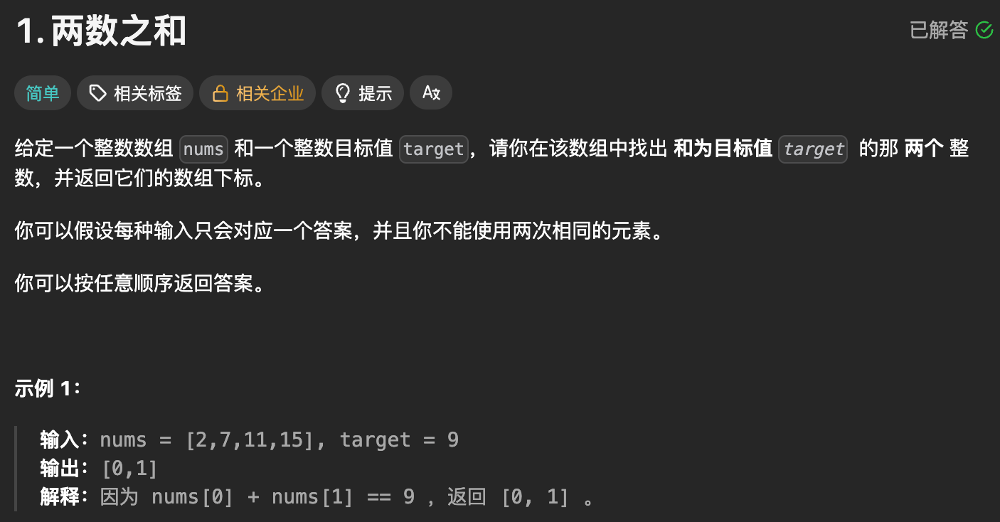

题目思路：

> 在暴力的时候是两层for循环；然后可以考虑哈希(find函数)

题目代码：

```
class Solution {
public:
    vector<int> twoSum(vector<int>& nums, int target) {
        unordered_map<int, int> mp; 
        int n = nums.size();

        for(int i = 0; i < n; i++){
            // 往前面找
            auto it = mp.find(target - nums[i]);
            if(it != mp.end()){
                return {it->second, i};
            }
            mp[nums[i]] = i;
        }
        return {};
    }
};
```

```
class Solution {
public:
    vector<int> twoSum(vector<int>& nums, int target) {
        int n = nums.size();
        vector<int>res;
        // 因为不能用两次同样的，那就往后找，不往前找呗。
        for(int i = 0; i < n; i++){
            auto it = find(nums.begin() + i + 1, nums.end(), target - nums[i]);
            if(it != nums.end()){
                res.push_back(i);
                res.push_back(it - nums.begin());
                return res;
            }
        }
        return res;
    }
};
```

### 题目来源：LeetCode-1010. 总持续时间可被 60 整除的歌曲

题目描述：

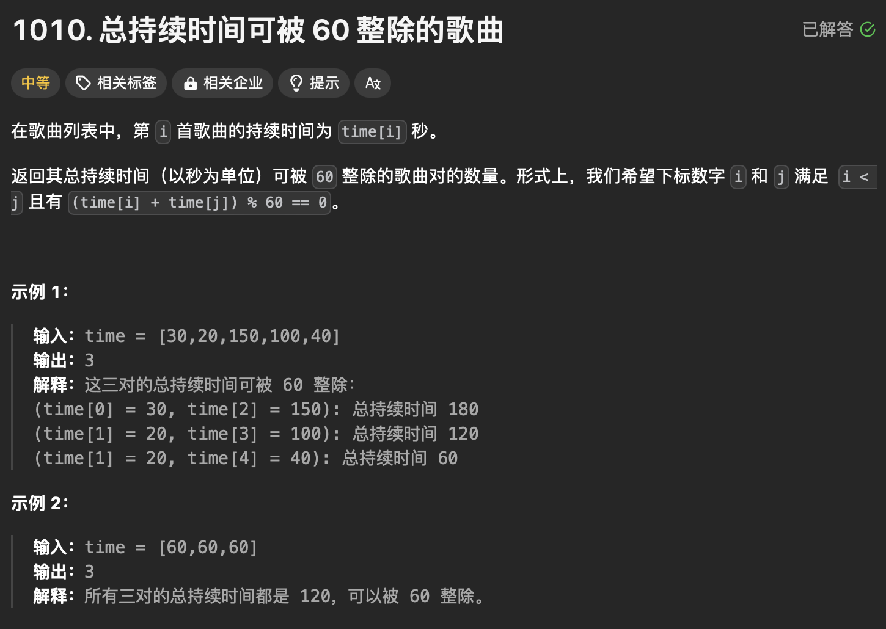

题目思路：


题目代码：

```
class Solution {
public:
    int numPairsDivisibleBy60(vector<int>& time) {

        // 两个 % 60 == 0；
        // 甚至感觉像是 维护左边， for右边
        int n = time.size();
        int res = 0;


        vector<int>left_cnt(62, 0);
        int right = 0;
        for(right = 0; right < n; right++){
            // 往左边找
            int x = time[right] % 60;
            int find = (60 - x) % 60;
            res = res + left_cnt[find];
            left_cnt[x]++;
        }
        return res;
    }
};


class Solution {
public:
    int numPairsDivisibleBy60(vector<int>& time) {
        /// 可以先set 和 pair记录数量？
        // 哈希数组， 直接 60 - 【】 ？ 由于 time[i] <= 500 是完全可以便利的。
        set<int>ans_set;
        int n = time.size();
        long long time_nums[2000] = {0};
        for(int i =  0; i < n; i++)
        {
            ans_set.insert(time[i]);
            time_nums[ time[i] ]++;
        }

        vector<int>iter_nums;
        for(int i = 0; i < 20; i++){
            iter_nums.push_back( i * 60);
        }

        long long res = 0;
        for(auto ss : ans_set)
        {
            long long add = 0;

            for(int iter = 0; iter < iter_nums.size(); iter++)
            {
                int now_num = iter_nums[iter];
                if(now_num <= ss)continue;
                if(ss == (now_num - ss)){
                    if(time_nums[ss] == 1)continue;
                    add = time_nums[ss] * (time_nums[ss] - 1);
                    res += add;
                    continue;
                }else{
                    add = time_nums[ss] * time_nums[now_num - ss];
                    res += add;
                    continue;
                }
            }
        }
        res = res / 2;
        return (int)res;
    }
};
```

## No.2 字符哈希

### 题目来源：LeetCode-500-键盘行

题目描述：  
 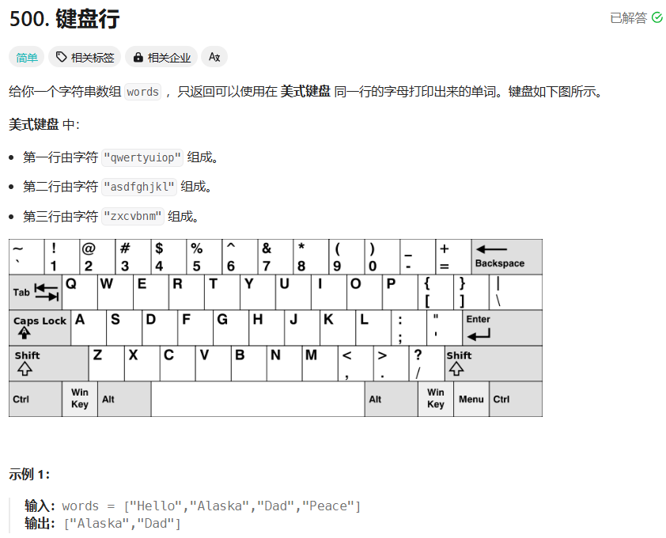

题目思路：

> 是关于字符串的，虽然一开始想的是暴力，但是看到标签之后，就想着用哈希了，比较快速。

题目代码：

```
class Solution {
public:
    vector<string> findWords(vector<string>& words) {
        string str1 = "qwertyuiop";
        string str2 = "asdfghjkl";
        string str3 = "zxcvbnm";
        vector<string>res;
        map<char,int>mp;
        for(int i = 0;i<str1.size();i++){
            mp[str1[i]] = 1;
            char ch = str1[i] - 32;
            mp[ch] = 1;
        }
        for(int i = 0;i<str2.size();i++){
            mp[str2[i]] = 2;
            char ch = str2[i] - 32;
            mp[ch] = 2;
        }
        for(int i = 0;i<str3.size();i++){
            mp[str3[i]] = 3;
            char ch = str3[i] - 32;
            mp[ch] = 3;
        }

        for(int i =0; i<words.size();i++){
            bool flag = true;
            auto ss = words[i];
            int temp = mp[ss[0]];
            for(int j =1;j<ss.size();j++){
                if( mp[ss[j]]!=temp ){
                    flag = false;
                    break;
                }
            }
            if(flag)res.push_back(words[i]); 
        }
        return res;
    }
};
```

## No.3 哈希表

### 题目来源：PTA-L1-020 帅到没朋友

题目描述：  
 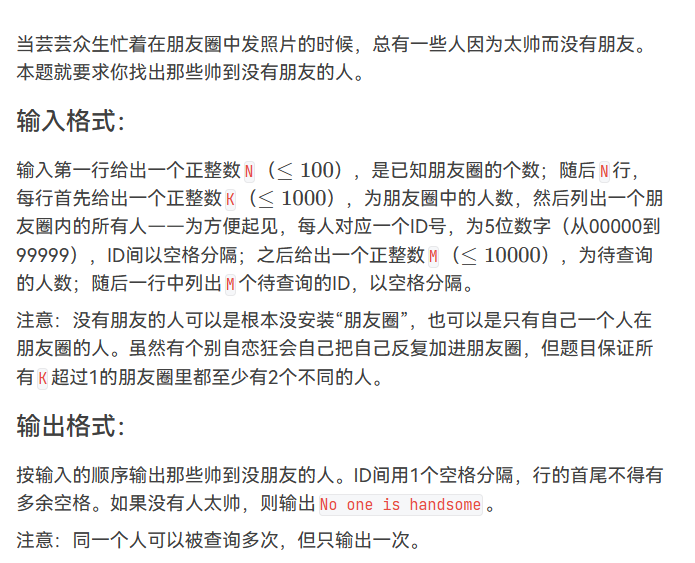

题目思路：


题目代码：

```
//对于N要进行适应性的更改，对于字段错误
#include<bits/stdc++.h>
using namespace std;
#define inf 0x3f3f3f3f
#define N 100100
int n,m,k,g,d;
int x,y,z;
char ch;
string str;
vector<int>v[N];

int main() {
    cin>>n;
    map<int,int>mp;
    for(int i=0;i<n;i++){
        cin>>k;
        if(k==1){
            cin>>x;
            continue;
        }
        
        while(k--){
            cin>>x;
            mp[x]=1;
        }
        
    }
    vector<int>ans;
    
    cin>>m;
    while(m--){
        cin>>x;
        if(mp[x]!=1)ans.push_back(x);
    }
    if(ans.size()==0)cout<<"No one is handsome"<<endl;
    
    for(int i=0;i<ans.size();i++){
        if(i==0){
                    if(mp[ans[i]]!=1)printf("%05d",ans[i]);
        mp[ans[i]]=1;
        }else{
                 if(mp[ans[i]]!=1)printf(" %05d",ans[i]);
        mp[ans[i]]=1;   
        }

    }
    
    
   

	return 0;
}
```

### 题目来源：PTA-L1-034 点赞

题目描述：  
 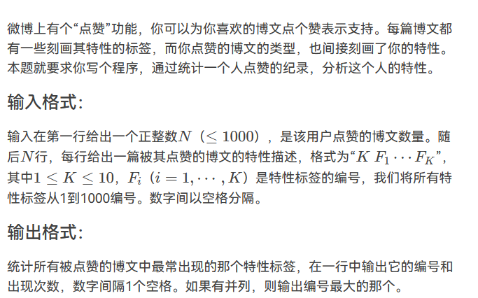

题目思路：


题目代码：

```
//对于N要进行适应性的更改，对于字段错误
#include<bits/stdc++.h>
using namespace std;
#define inf 0x3f3f3f3f
#define N 100100
int n,m,k,g,d;
int x,y,z;
char ch;
string str;
vector<int>v[N];

int main() {
    cin>>n;
    int book[N]={0};
    for(int i=0;i<n;i++){
        cin>>k;
        while(k--){
            cin>>x;
            book[x]++;
        }
    }
    int maxx=0;
    for(int i=0;i<1000;i++){
        if(book[i]>0)maxx=max(maxx,book[i]);
    }
    for(int i=1000;i>=0;i--){
        if(book[i]==maxx){
            cout<<i<<" "<<book[i];
            break;
        }
    }

	return 0;
}
```

### 题目来源：PTA-L1-085 试试手气

题目描述：  
 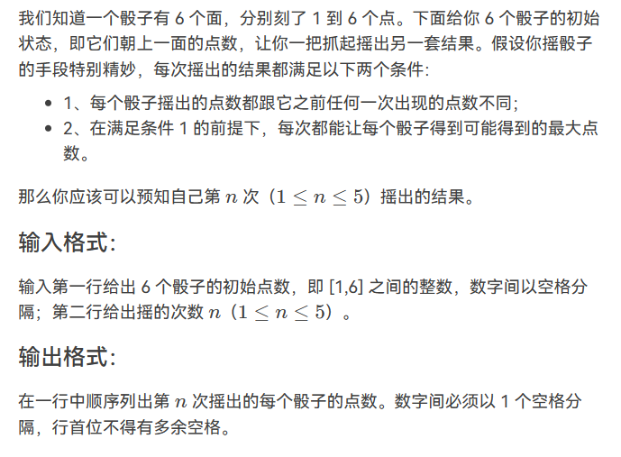

题目思路：


题目代码：

```
#include<bits/stdc++.h>
using namespace std;
#define inf 0x3f3f3f3f
#define N 505
int n,m,k,g,d;
int x,y,z;
char ch;
string str;
vector<int>v[N];
#define PII pair<int,int>


	
int main()
{
    for(int i=1;i<=6;i++){
        cin>>x;
        v[i].push_back(x);
    }
    cin>>k;
    vector<int>ans;
    while(k--){
        ans.clear();
        for(int i=1;i<=6;i++){//六个骰子 
            for(int j=6;j>=1;j--){
                if(count(v[i].begin(),v[i].end(),j)==0){
                    ans.push_back(j);
                    v[i].push_back(j);
                    break;
                }
            }
            
        }
    }
    for(int i=0;i<ans.size();i++){
        if(i==0)cout<<ans[i];
        else cout<<" "<<ans[i];
    }
    cout<<endl;

    
    return 0;
}
```

### 题目来源：LeetCode-242-有效的字母异位词

题目描述：  
 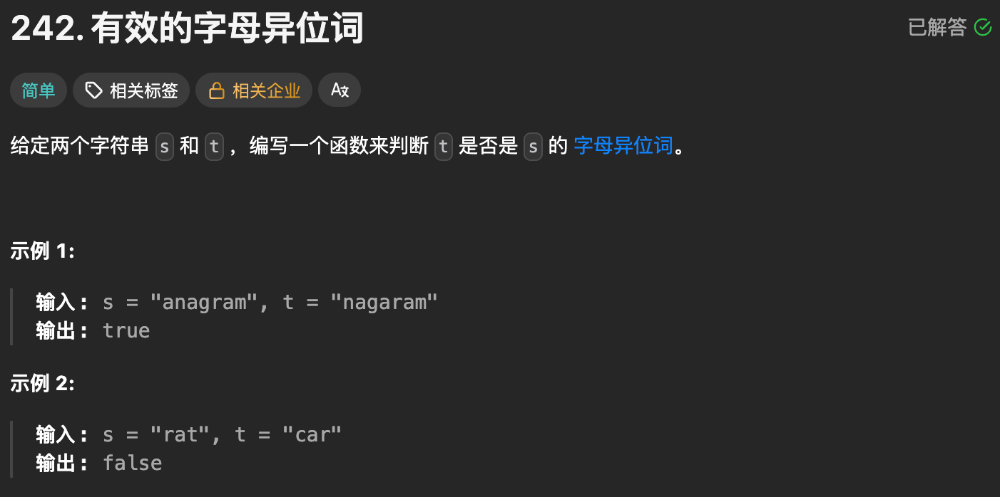

题目思路：

题目代码：

```
class Solution {
public:
    bool isAnagram(string s, string t) {
        int record[26] = {0};
        for (int i = 0; i < s.size(); i++) {
            // 并不需要记住字符a的ASCII，只要求出一个相对数值就可以了
            record[s[i] - 'a']++;
        }
        for (int i = 0; i < t.size(); i++) {
            record[t[i] - 'a']--;
        }
        for (int i = 0; i < 26; i++) {
            if (record[i] != 0) {
                // record数组如果有的元素不为零0，说明字符串s和t 一定是谁多了字符或者谁少了字符。
                return false;
            }
        }
        // record数组所有元素都为零0，说明字符串s和t是字母异位词
        return true;
    }
};
```

### 题目来源：LeetCode-349-两个数组的交集

题目描述：  
 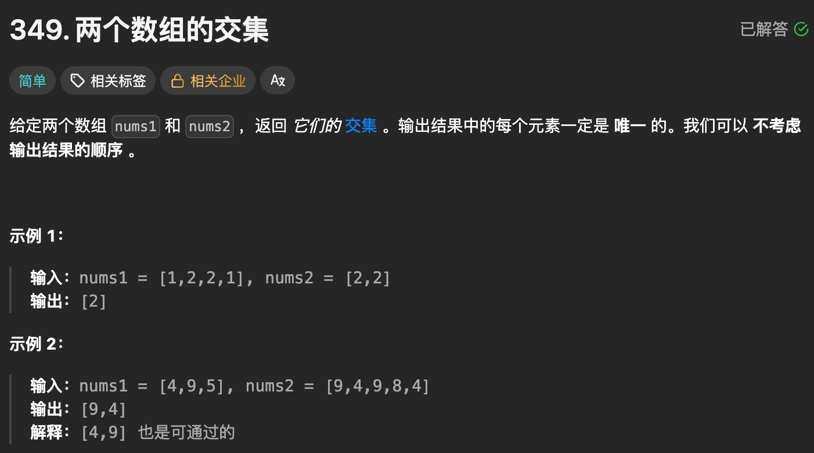

题目思路：

题目代码：

```
class Solution {
public:
    vector<int> intersection(vector<int>& nums1, vector<int>& nums2) {
        vector<int>res;
        unordered_map<int, int>mp;
        for(auto &x : nums1)mp[x]=1;

        for(auto &x : nums2){
            if(mp[x] == 1){
                mp[x]--;
                res.push_back(x);
            }
        }
        return res;
    }
};
```

### 题目来源：LeetCode-202-快乐数

题目描述：  
 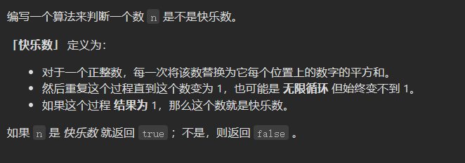

题目思路：

题目代码：

```
class Solution {
public:
    // 取数值各个位上的单数之和
    int getSum(int n) {
        int sum = 0;
        while (n) {
            sum += (n % 10) * (n % 10);
            n /= 10;
        }
        return sum;
    }
    bool isHappy(int n) {
        unordered_set<int> set;
        while(1) {
            int sum = getSum(n);
            if (sum == 1) {
                return true;
            }
            // 如果这个sum曾经出现过，说明已经陷入了无限循环了，立刻return false
            if (set.find(sum) != set.end()) {
                return false;
            } else {
                set.insert(sum);
            }
            n = sum;
        }
    }
};
```

### 题目来源：蓝桥杯-第十四届模拟-第二期 单词去重

题目描述：  
 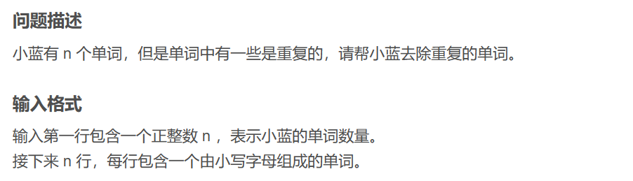

题目思路：


题目代码：

```
#include <bits/stdc++.h>
using namespace std;

int n;
set<string> st;
string str;

int main() {
    cin >> n;
    for (int i = 0; i < n; i ++) {
        cin >> str;
        if (st.count(str)) continue;
        st.insert(str);
        cout << str << endl;
    }
    return 0;
}
```

## No.4 map<vector< int >,int>mp;模板

### 题目来源：PTA-L2-039 清点代码库

题目描述：  
 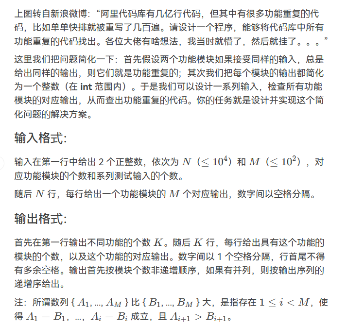

题目思路：

题目代码：

```
#include<bits/stdc++.h>
using namespace std;
#define inf 0x3f3f3f3f
#define N 100100
int n,m,k,g,d;
int x,y,z;
char ch;
string str;
vector<int>v[N];
struct node{
    vector<int>ff;
    int num;
}stu[N];
bool cmp(node a,node b){
    if(a.num!=b.num){
        return a.num>b.num;
    }
    return a.ff<b.ff;
}
int main() {
    map<vector<int> , int>mp;
    set<vector<int>>sc;
    cin>>n>>m;
    for(int i=1;i<=n;i++){
        vector<int>ans;
        for(int j=0;j<m;j++){
            cin>>x;
            ans.push_back(x);
        }
        mp[ans]++;
        sc.insert(ans);
    }
    int a=0;
    //结构体的创建以及赋值。。
    for(auto n:sc){
        stu[a].ff=n;
        stu[a].num=mp[n];
        a++;
    }
    sort(stu,stu+a,cmp);
    cout<<sc.size()<<endl;
    for(int i=0;i<a;i++){
        cout<<stu[i].num;
        for(auto q:stu[i].ff)cout<<" "<<q; 
        cout<<endl;
    }
	return 0;
}
```

### 题目来源：LeetCode-49. 字母异位词分组

题目描述：

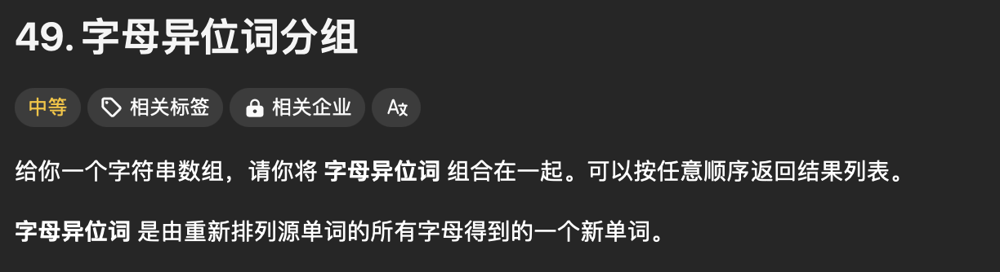

题目思路：

> 感觉更像是 各种容器的使用，以及 查找

题目代码：

```
class Solution {
public:
    vector<vector<string>> groupAnagrams(vector<string>& strs) {
        // 肯定还是用map
        unordered_map<string, vector<string>>mp;
        
        int n = strs.size();
        for(int i = 0; i < n; i++){
            auto ss = strs[i];
            sort(ss.begin(), ss.end());
            mp[ss].push_back(strs[i]);
        }

        vector<vector<string>>res;
        for(auto & ss : mp){
            res.push_back(ss.second);
        }
        return res;
    }
};
```

```
class Solution {
public:
    vector<vector<string>> groupAnagrams(vector<string>& strs) {

        vector<pair<string, int>>tmp;
        for(int i = 0; i < strs.size(); i++)
        {
            std::string st = strs[i];
            std::sort(st.begin(), st.end());
            tmp.push_back(std::pair(st, i));
        }
        map<std::string, vector<string>>mp;
        set<string>un_set;
        for(int i = 0; i < strs.size(); i++)
        {
            auto st = tmp[i].first;
            un_set.insert(st);
            auto ss = strs[tmp[i].second];
            mp[st].push_back(ss);
        }
        vector<vector<string>>res;
        for(auto ss : un_set){
            res.push_back(mp[ss]);
        }
        return res;

        
    }
};
```

## No.4 连续数哈希

### 题目来源：LeetCode-128. 最长连续序列

题目描述：  
 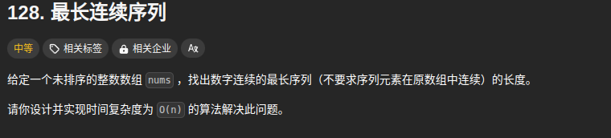

题目思路：

> 难题，靠思路了;

题目代码：

```
class Solution {
public:
    int longestConsecutive(vector<int>& nums) {
        // 这里的话时间复杂度n
        // 也是把所有的数字进行标记 == 1；
        // 然后判断暴力
        // 也就是说 必须哈兮表了  因为哈兮表的查找是O1
        // 简单来说就是每个数都判断一次这个数是不是连续序列的开头那个数。
        // 怎么判断呢，就是用哈希表查找这个数前面一个数是否存在，即num-1在序列中是否存在。存在那这个数肯定不是开头，直接跳过。
        // 因此只需要对每个开头的数进行循环，直到这个序列不再连续，因此复杂度是O(n)。
        int n = nums.size();
        unordered_set<int>un_set;
        for(auto num : nums)un_set.insert(num);

        int resmaxx = 0;
        int resnoww = 0;
        for(auto se : un_set)
        {
            if(un_set.count(se - 1)){
                continue;
            }else{
                // 起点开始.
                int cur_start = se;
                resnoww = 1;
                int next_num = cur_start + 1;
                while(un_set.count(next_num)){
                    resnoww++;
                    next_num++;
                }
                resmaxx = max(resmaxx, resnoww);
            }
        }
        return resmaxx;
    }
};
```

## No.5 常数额外空间

### 题目来源：LeetCode-442. 数组中重复的数据

题目描述：  
 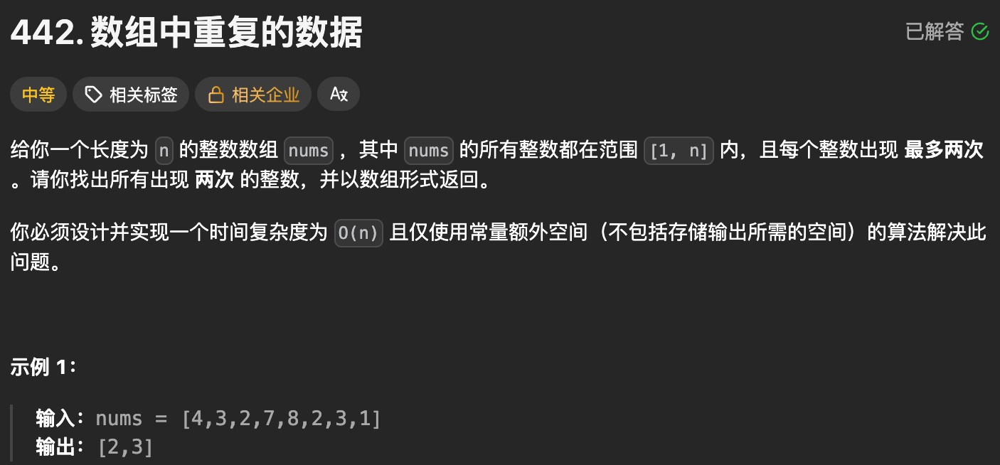

题目思路：

> 用下标和正负数。

题目代码：

```
class Solution {
public:
    vector<int> findDuplicates(vector<int>& nums) {

        // 用下标 和正负数。
        vector<int>res;
        int n = nums.size();
        for(int i = 0; i < n; i++){
            int x = abs(nums[i]);
            int pos = x - 1;
            if(nums[pos] < 0){
                res.push_back(x);
            }else{
                nums[pos] = -nums[pos];
            }
        }
        return res;
    }
};
```

### 题目来源：LeetCode-41. 缺失的第一个正数

题目描述：  
 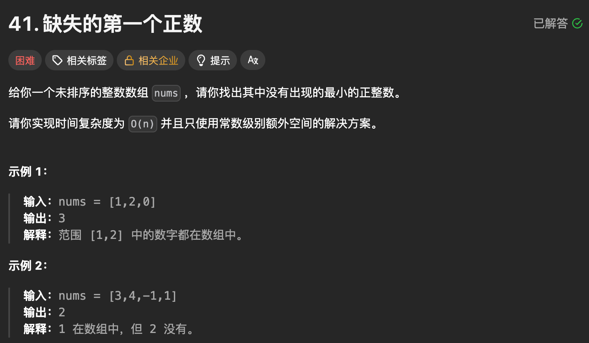

题目思路：


题目代码：

```
class Solution {
public:
    int firstMissingPositive(vector<int>& nums) {
        // 因为正整数，表示 其 可以这样; 就是其 各自到各自的位置

        int n = nums.size();
        for(int i = 0; i < n; i++){
            while(nums[i] > 0 && nums[i] <= n){
                int pos = nums[i] - 1;
                swap(nums[i], nums[pos]);
                if(nums[i] == pos + 1)break;
            }
        }
        for(int i = 0; i < n; i++){
            if(nums[i] != i + 1)return i + 1;
        }
        return n+1;
    }
};
```

```
class Solution {
public:
    int firstMissingPositive(vector<int>& nums) {
        //时间复杂度is n
        //肯定要走一遍的
        // 这部分要明白一个概念就是：
        // 1- 常数级别的额外空间 即 也是可以 n个的，只要不是nums[i] <= 2^31 那么多就行
        // 2-时间复杂度方面的话 可以常数量 次 的 遍历 n 次。

        int n = nums.size();
        int flag[n + 5];
        for(int i = 0; i < (n + 5); i++){
            flag[i] = 0;
        }

        for(int i = 0; i < n; i++){
            if(nums[i] <= (n + 5) && nums[i] > 0){
                flag[nums[i]] = 1;
            }
        }
        for(int i = 1; i <= (n + 4); i++){
            if(flag[i] == 0)return i;
        }
        return 1;
    }
};
```
