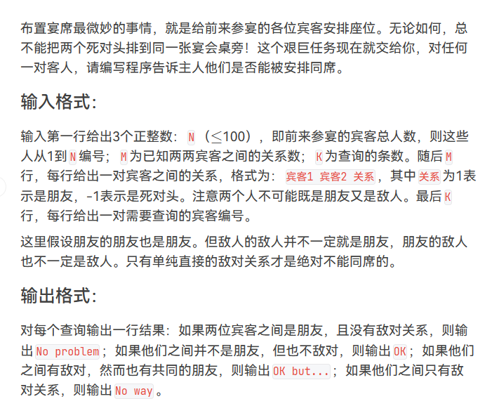
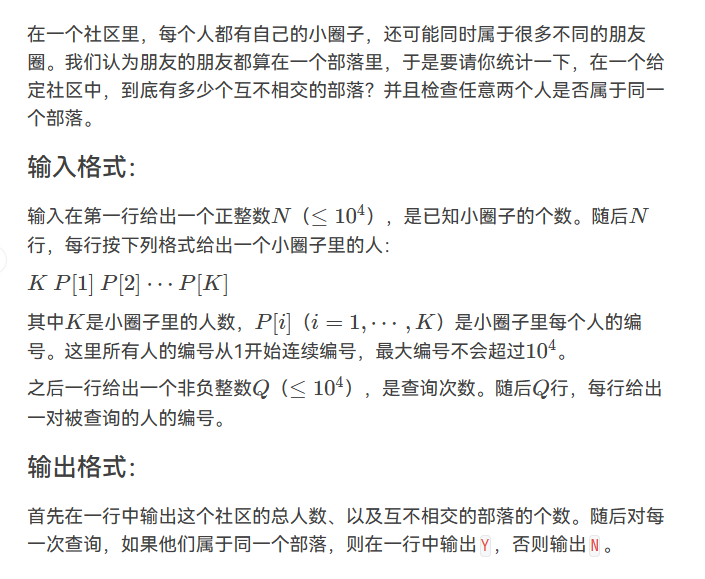
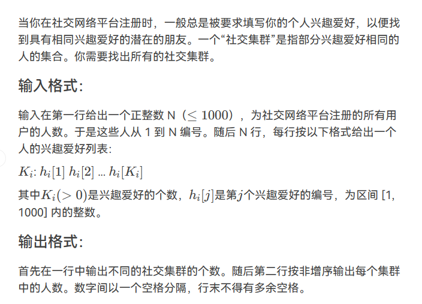
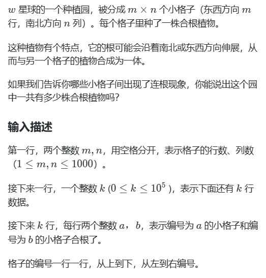
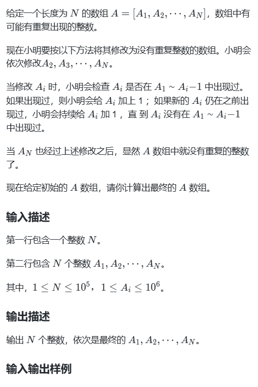
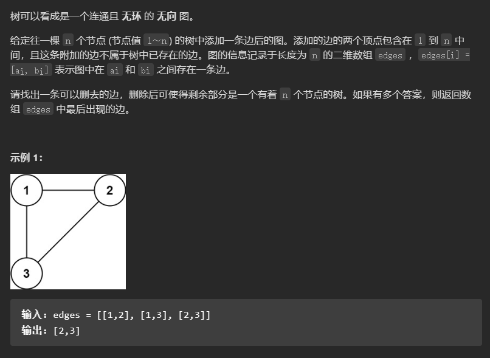
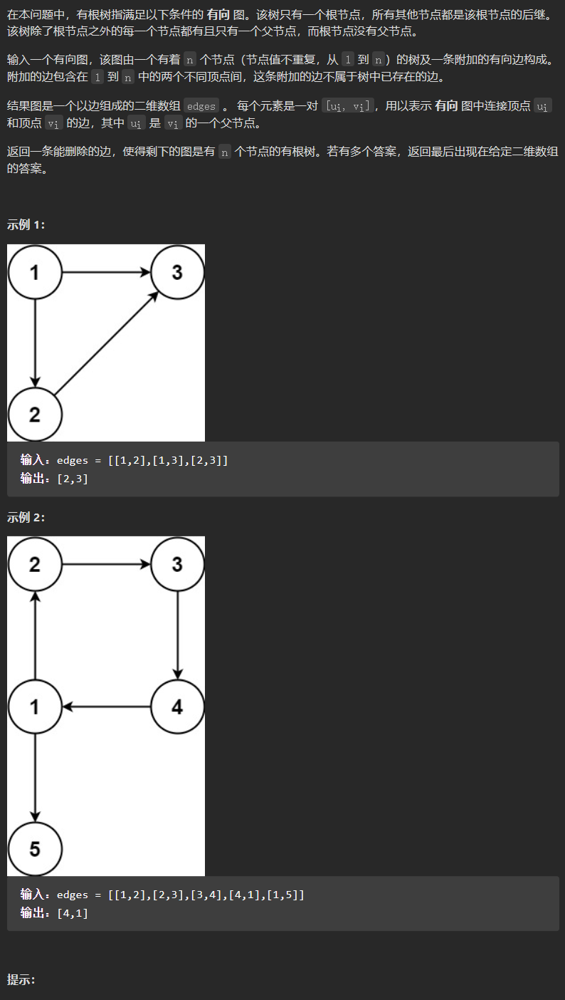

# 【完整题单08、常用数据结构(并查集)】【无】

> 来源：[【完整题单08、常用数据结构(并查集)】【无】](https://blog.csdn.net/weixin_51429773/article/details/129797657) · 发布时间：2026-06-03 · 阅读量：粉丝可见

#### 目录

- [知识框架](#_1)
- [No.0 并查集模板](#No0__2)
- [No.1 简单并查集查询](#No1__41)
- - [题目来源：PTA-L2-010 排座位](#PTAL2010__42)
  - [题目来源：PTA-L2-024 部落](#PTAL2024__117)
  - [题目来源：PTA-L3-003 社交集群](#PTAL3003__200)
  - [题目来源：蓝桥杯-2017省赛-合根植物](#2017_282)
  - [题目来源：蓝桥杯-2019省赛-修改数组](#2019_340)
- [No.4 并查集与树](#No4__385)
- - [题目来源：LeetCode-684-冗余连接](#LeetCode684_386)
  - [题目来源：LeetCode-685-冗余连接 II](#LeetCode685_II_438)

## 知识框架

## No.0 并查集模板

> 首先要知道并查集可以解决什么问题呢？

> 主要就是集合问题，两个节点在不在一个集合，也可以将两个节点添加到一个集合中。  
>  主要功能：  
>  1：寻找根节点，函数：find(int u)，也就是判断这个节点的祖先节点是哪个  
>  2：将两个节点接入到同一个集合，函数：join(int u, int v)，将两个节点连在同一个根节点上  
>  3：判断两个节点是否在同一个集合，函数：same(int u, int v)，就是判断两个节点是不是同一个根节点

```
int n = 1005; // 节点数量3 到 1000
int father[1005];

// 并查集初始化
void init() {
    for (int i = 0; i < n; ++i) {
        father[i] = i;
    }
}
// 并查集里寻根的过程
int find(int u) {
    return u == father[u] ? u : father[u] = find(father[u]);
}
// 将v->u 这条边加入并查集
void join(int u, int v) {
    u = find(u);
    v = find(v);
    if (u == v) return ;
    father[v] = u;
}
// 判断 u 和 v是否找到同一个根
bool same(int u, int v) {
    u = find(u);
    v = find(v);
    return u == v;
}
```

## No.1 简单并查集查询

### 题目来源：PTA-L2-010 排座位

题目描述：  
 

题目思路：

题目代码：

```
//这题别忘了把初始化给 在主函数进行调用实现。
//int mp[N][N]={0};
#include<bits/stdc++.h>
using namespace std;
#define inf 0x3f3f3f3f
#define N 101
int n,m,k,g,d;
int x,y,z;
vector<int>v[N];
int mp[N][N]={0};
int f[N];
void Init(){
    for(int i=1;i<=n;i++){
        f[i]=i;
    }
}

int find( int x){
    if(x!=f[x]){
        f[x]=find(f[x]);
    }
    return f[x];
}

void merge(int x, int y){
    int fx=find(x);
    int fy=find(y);
    if(fx>fy){
        f[fx]=fy;
    }else{
        f[fy]=fx;
    }
}

int main() {
    cin>>n>>m>>k;
    Init();
    for(int i=0;i<m;i++){
        cin>>x>>y>>z;
        if(z==-1){
            mp[x][y]=mp[y][x]=-1;
        }else{
            merge(x,y);
        }
    }
    while(k--){
        cin>>x>>y;
        int fx=find(x);
        int fy=find(y);
        if(fx==fy && mp[x][y]==0){
            cout<<"No problem"<<endl;
        }else if(fx!=fy && mp[x][y]==0){
            cout<<"OK"<<endl;
        }else if(fx==fy &&mp[x][y]==-1){
            cout<<"OK but..."<<endl;
        }else if(fx!=fy &&mp[x][y]==-1){
            cout<<"No way"<<endl;
        }
    }
	return 0;
}
```

### 题目来源：PTA-L2-024 部落

题目描述：  
 

题目思路：

题目代码：

```
//对于N要进行适应性的更改，对于字段错误
//注意f[i]=i 的时候，范围是N；
//对于N要进行适应性的更改，对于字段错误

//    for(auto i:people){
        book[find(i)]++;
    }
//
#include<bits/stdc++.h>
using namespace std;
#define inf 0x3f3f3f3f
#define N 100100
int n,m,k,g,d;
int x,y,z;
char ch;
string str;
vector<int>v[N];
int f[N]={0};
void Init(){
    for(int i=0;i<N;i++){
        f[i]=i;
    }
}
int find(int x){
    if(x!=f[x]){
        f[x]=find(f[x]);
    }
    return f[x];
}
void merge(int x, int y){
    int fx=find(x);
    int fy=find(y);
    if(fx>fy){
        f[fx]=fy;
    }else{
        f[fy]=fx;
    }
}
int main() {
    Init();
    cin>>n;
    set<int>people;
    for(int i=0;i<n;i++){
        cin>>k;
        cin>>x;
        people.insert(x);
        for(int j=1;j<k;j++){
            cin>>y;
            people.insert(y);
            merge(x,y);
        }
    }
    int cnt=0;
    int book[N]={0};
    //如果每次都用people 应该会很方便：：：：每次都要从people循环开始；；
    for(auto i:people){
        book[find(i)]++;
    }
    for(auto i:people){
        if(book[i]>0)cnt++;
    }
    cout<<people.size()<<" "<<cnt<<endl;
    cin>>k;
    while(k--){
        cin>>x>>y;
        if(find(x)==find(y))cout<<"Y"<<endl;
        else cout<<"N"<<endl;
    }
	return 0;
}
```

### 题目来源：PTA-L3-003 社交集群

题目描述：  
 

题目思路：

题目代码：

```
//对于N要进行适应性的更改，对于字段错误
#include<bits/stdc++.h>
using namespace std;
#define inf 0x3f3f3f3f
#define N 1001
int n,m,k,g,d;
int x,y,z;
char ch;
string str;
vector<int>v[N];

int f[N];
void Init( ){
    for(int i=0;i<=N;i++){
        f[i]=i;
    }
}
int find(int x){
    if(x!=f[x]){
        f[x]=find(f[x]);
    }
    return f[x];
}

void merge(int x,int y){
    int fx=find(x);
    int fy=find(y);
    if(fx>fy){
        f[fx]=fy;
    }else{
        f[fy]=fx;
    }
}
bool cmp(int x,int y){
    return x>y;
}
int main() {
    Init();
    cin>>n;
    for(int i=1;i<=n;i++){
        cin>>k>>ch;
        cin>>x;
        v[i].push_back(x);
        for(int j=1;j<k;j++){
            cin>>y;
            v[i].push_back(y);
            merge(x,y);//合并操作
        }
    }
    set<int>sc[N];
    for(int i=1;i<=n;i++){
            int num=find(v[i][0]);
            sc[num].insert(i);
    }
    int cnt=0;
    vector<int>ans;
    for(int i=1;i<=1000;i++){
        if(sc[i].size()>0){
            cnt++;
            ans.push_back(sc[i].size());
        }
    }
    sort(ans.begin(),ans.end(),cmp);
    cout<<cnt<<endl;
    for(int i=0;i<ans.size();i++){
        if(i==0)cout<<ans[i];
        else cout<<" "<<ans[i];
    }
	return 0;
}
```

### 题目来源：蓝桥杯-2017省赛-合根植物

题目描述：



题目思路：


题目代码：

```
#include <bits/stdc++.h>
using namespace std;

int m,n;
int k;
int f[1000005] = {0};
set<int> s;

void init_cha(){
    for(int i=1;i<=m*n;i++){
        f[i] = i;
    }
}

int find_cha(int n){
    if(f[n]==n){
        return n;
    }else{
        f[n] = find_cha(f[n]);
        return f[n];
    }
}

void merge_cha(int a,int b){
    f[find_cha(a)] = find_cha(b);
} 

int main(){
    cin>>m>>n>>k;
    init_cha();
    for(int i=0;i<k;i++){
        int a,b;
        cin>>a>>b;
        merge_cha(a,b);
    }
    for(int i=1;i<=m*n;i++){
        s.insert(find_cha(i));
    }
    cout<<s.size();
    
    return 0;
}
```

### 题目来源：蓝桥杯-2019省赛-修改数组

题目描述：  
 

题目思路：


题目代码：

```
#include<bits/stdc++.h>
using namespace std;
const int N=1e6;
int a[N],n,b[N];
void init(){
  for(int i=0;i<N;i++) a[i]=i;
}
int find(int x){
  if(x!=a[x]){
    a[x]=find(a[x]);
  }
  return a[x];
}
int main(){
  init();
  scanf("%d",&n);
  for(int i=1;i<=n;i++){
    scanf("%d",&b[i]);
    int temp=find(b[i]);
    b[i]=temp;
    //a[temp]=temp+1;
    // 改良
    a[temp]=find(temp+1);
  }
  for(int i=1;i<=n;i++) printf("%d ",b[i]);
  return 0;
}
```

## No.4 并查集与树

### 题目来源：LeetCode-684-冗余连接

题目描述：  
 

题目思路：

> 一个树在 添加一条边之后 变成了图，然后对该图进行 找到一条边进行 删除使得剩下的为一棵n结点树，如果有多个答案，就去掉数组中的最后面的那条边。  
>  思路：那么我们就可以从前向后遍历每一条边，边的两个节点如果不在同一个集合，就加入集合（即：同一个根节点）。  
>  如果边的两个节点已经出现在同一个集合里，说明着边的两个节点已经连在一起了，如果再加入这条边一定就出现环了。

题目代码：

```
class Solution {
private:
    int n = 1005; // 节点数量3 到 1000
    int father[1005];

    // 并查集初始化
    void init() {
        for (int i = 0; i < n; ++i) {
            father[i] = i;
        }
    }
    // 并查集里寻根的过程
    int find(int u) {
        return u == father[u] ? u : father[u] = find(father[u]);
    }
    // 将v->u 这条边加入并查集
    void join(int u, int v) {
        u = find(u);
        v = find(v);
        if (u == v) return ;
        father[v] = u;
    }
    // 判断 u 和 v是否找到同一个根，本题用不上
    bool same(int u, int v) {
        u = find(u);
        v = find(v);
        return u == v;
    }
public:
    vector<int> findRedundantConnection(vector<vector<int>>& edges) {
        init();
        for (int i = 0; i < edges.size(); i++) {
            if (same(edges[i][0], edges[i][1])) return edges[i];
            else join(edges[i][0], edges[i][1]);
        }
        return {};
    }
};
```

### 题目来源：LeetCode-685-冗余连接 II

题目描述：  
 

题目思路：

> 这个 也是跟上面那个差不多，不过要找情况；出现错误的情况：  
>  //两种不行的情况：入度为2；； 或者有了 有向环；  
>  // 还要返回 边；那么对于第一种情况 就是 去掉一条：前两种入度为2的情况，一定是删除指向入度为2的节点的两条边其中的一条，如果删了一条，判断这个图是一个树，那么这条边就是答案，同时注意要从后向前遍历，因为如果两天边删哪一条都可以成为树，就删最后那一条。  
>  ，第二种是  
>  此时应该是用到并查集了，并查集为什么可以判断 一个图是不是树呢？  
>  因为如果两个点所在的边在添加图之前如果就可以在并查集里找到了相同的根，那么这条边添加上之后 这个图一定不是树了  
>  最主要的还是不断初始化，然后加入边看是否已经那个啥来判断是否为树。

题目代码：

```
class Solution {
private:
    static const int N = 1010; // 如题：二维数组大小的在3到1000范围内
    int father[N];
    int n; // 边的数量
    // 并查集初始化
    void init() {
        for (int i = 1; i <= n; ++i) {
            father[i] = i;
        }
    }
    // 并查集里寻根的过程
    int find(int u) {
        return u == father[u] ? u : father[u] = find(father[u]);
    }
    // 将v->u 这条边加入并查集
    void join(int u, int v) {
        u = find(u);
        v = find(v);
        if (u == v) return ;
        father[v] = u;
    }
    // 判断 u 和 v是否找到同一个根
    bool same(int u, int v) {
        u = find(u);
        v = find(v);
        return u == v;
    }
    // 在有向图里找到删除的那条边，使其变成树
    vector<int> getRemoveEdge(const vector<vector<int>>& edges) {
        init(); // 初始化并查集
        for (int i = 0; i < n; i++) { // 遍历所有的边
            if (same(edges[i][0], edges[i][1])) { // 构成有向环了，就是要删除的边
                return edges[i];
            }
            join(edges[i][0], edges[i][1]);
        }
        return {};
    }

    // 删一条边之后判断是不是树
    bool isTreeAfterRemoveEdge(const vector<vector<int>>& edges, int deleteEdge) {
        init(); // 初始化并查集
        for (int i = 0; i < n; i++) {
            if (i == deleteEdge) continue;
            if (same(edges[i][0], edges[i][1])) { // 构成有向环了，一定不是树
                return false;
            }
            join(edges[i][0], edges[i][1]);
        }
        return true;
    }
public:

    vector<int> findRedundantDirectedConnection(vector<vector<int>>& edges) {
        int inDegree[N] = {0}; // 记录节点入度
        n = edges.size(); // 边的数量
        for (int i = 0; i < n; i++) {
            inDegree[edges[i][1]]++; // 统计入度
        }
        vector<int> vec; // 记录入度为2的边（如果有的话就两条边）
        // 找入度为2的节点所对应的边，注意要倒序，因为优先返回最后出现在二维数组中的答案
        for (int i = n - 1; i >= 0; i--) {
            if (inDegree[edges[i][1]] == 2) {
                vec.push_back(i);
            }
        }
        // 处理图中情况1 和 情况2
        // 如果有入度为2的节点，那么一定是两条边里删一个，看删哪个可以构成树
        if (vec.size() > 0) {
            if (isTreeAfterRemoveEdge(edges, vec[0])) {
                return edges[vec[0]];
            } else {
                return edges[vec[1]];
            }
        }
        // 处理图中情况3
        // 明确没有入度为2的情况，那么一定有有向环，找到构成环的边返回就可以了
        return getRemoveEdge(edges);

    }
};
```
