#### 目录

- [知识框架](#_1)
- [No.0 筑基](#No0__2)
- [No.1 栈与队列](#No1__9)
- - [题目来源：LeetCode-20. 有效的括号🔥](#LeetCode20__12)
  - [题目来源：LeetCode-155. 最小栈](#LeetCode155__89)
  - [题目来源：LeetCode-394. 字符串解码](#LeetCode394__161)
  - [题目来源：PTA-L2-014 列车调度](#PTAL2014__275)
  - [题目来源：PTA-L2-005 集合相似度](#PTAL2005__342)
  - [题目来源：PTA-L2-037 包装机](#PTAL2037__397)
  - [题目来源：PTA-L2-032 彩虹瓶](#PTAL2032__456)
  - [题目来源：PTA-L2-033 简单计算器](#PTAL2033__498)
  - [题目来源：PTA-L3-002 特殊堆栈](#PTAL3002__561)
  - [题目来源：PTA-L2-041 插松枝](#PTAL2041__687)
  - [题目来源：Acwing-128. 编辑器](#Acwing128__820)
  - [题目来源：Acwing-129. 火车进栈](#Acwing129__897)
  - [题目来源：蓝桥杯-2012省赛-括号问题](#2012_974)
  - [题目来源：蓝桥杯-2017省赛-拉马车](#2017_1026)
- [No.2 牛客网-栈](#No2__1039)
- - [NC15029：吐泡泡](#NC15029_1045)
  - [NC50998：括号画家](#NC50998_1160)
  - [NC15975：小c的记事本](#NC15975c_1208)
  - [NC14666：最优屏障](#NC14666_1302)
  - [NC14847：Masha与老鼠：](#NC14847Masha_1364)
  - [NC50999：表达式计算](#NC50999_1372)
- [No.3 模拟加减乘除运算-栈](#No3__1469)
- - [题目来源：LeetCode-1006.笨阶乘](#LeetCode1006_1475)

## 知识框架

## No.0 筑基

> 请先学习下知识点，道友！  
>  题目知识点大部分来源于此：[代码随想录：栈与队列](https://www.programmercarl.com/%E6%A0%88%E4%B8%8E%E9%98%9F%E5%88%97%E7%90%86%E8%AE%BA%E5%9F%BA%E7%A1%80.html)

## No.1 栈与队列

### 题目来源：LeetCode-20. 有效的括号🔥

题目描述：  
 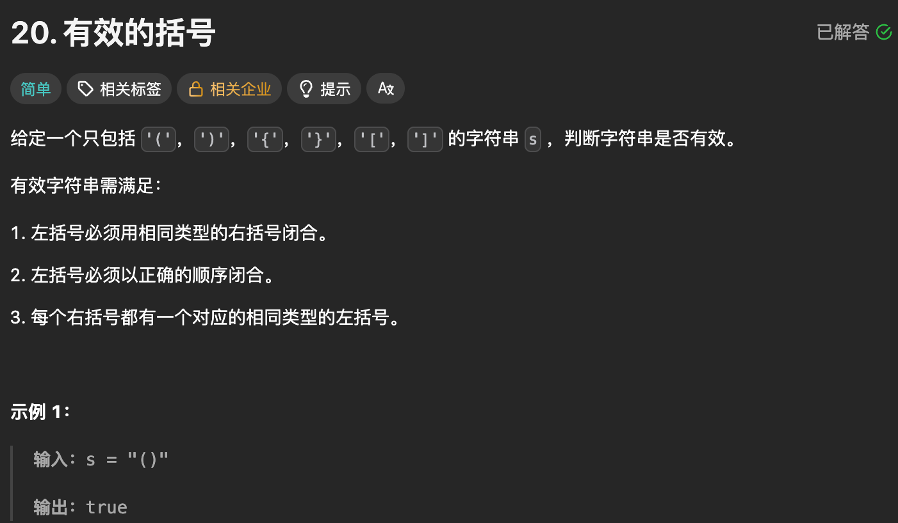

题目思路：


题目代码：

```cpp
class Solution {
public:
    unordered_map<char, char>mp = {{'(', ')'}, {'{', '}'}, {'[', ']'}};
    bool isValid(string s) {
        int m = s.size();
        if(m % 2 == 1 || m == 0)return false;
        stack<char>st;
        for(auto ch : s){
            // 如果是左括号就直接放入对应的右括号
            if(mp.contains(ch)){
                st.push(mp[ch]);
            }else{
                // 如果是右括号，就看出现错误的情况了
                if(st.empty() || ch != st.top()){
                    return false;
                }
                // 正常匹配
                st.pop();
            }
        }
        return st.empty();
    }
};
```

### 题目来源：LeetCode-155. 最小栈

题目描述：  
 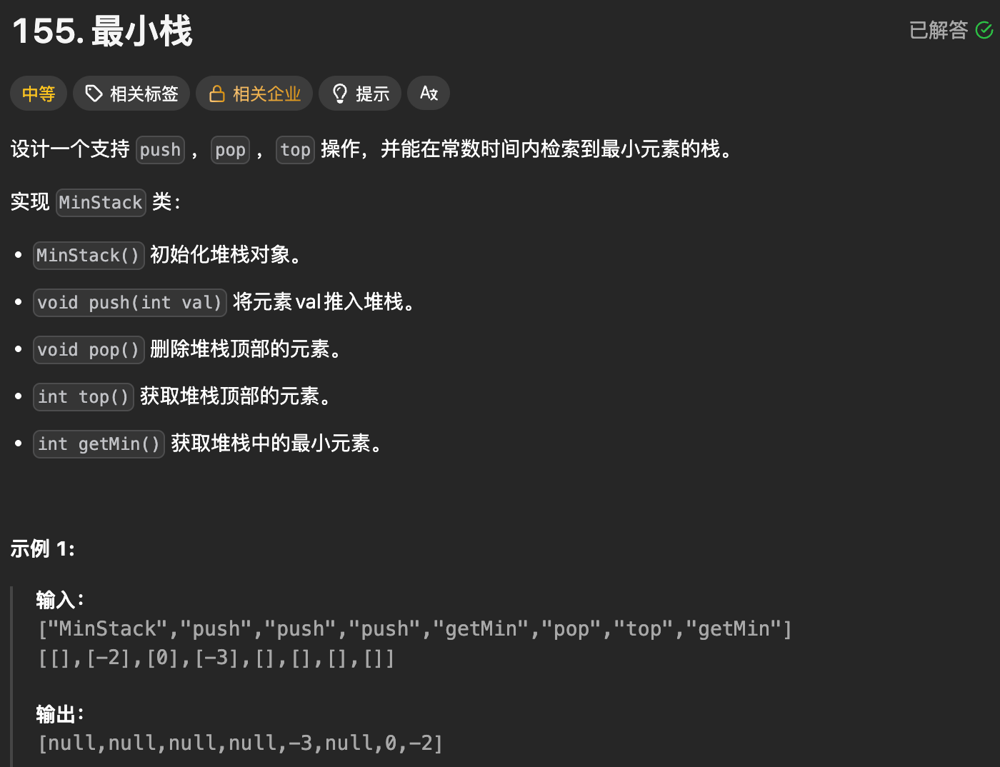

题目思路：


题目代码：

```cpp
class MinStack {
    stack<long long> st;
    long long mn = LLONG_MAX / 2; // 避免 val - mn 溢出

public:
    void push(int val) {
        // 栈中保存 val - 之前的最小值
        st.push(val - mn);
        mn = min(mn, 1LL * val);
    }

    void pop() {
        // 如果栈顶是负数，增大 mn，否则不变
        mn -= min(st.top(), 0LL);
        st.pop();
    }

    int top() {
        // 如果栈顶是正数，说明实际的 val 比 mn 大，否则 val 等于 mn
        return mn + max(st.top(), 0LL);
    }

    int getMin() {
        return mn;
    }
};
```

```cpp
class MinStack {
    stack<pair<int, int>> st;

public:
    MinStack() {
        // 添加栈底哨兵 INT_MAX
        // 这里的 0 写成任意数都可以，反正用不到
        st.emplace(0, INT_MAX);
    }

    void push(int val) {
        st.emplace(val, min(getMin(), val)); 
    }

    void pop() {
        st.pop();
    }

    int top() {
        return st.top().first;
    }

    int getMin() {
        return st.top().second;
    }
};
```

### 题目来源：LeetCode-394. 字符串解码

题目描述：  
 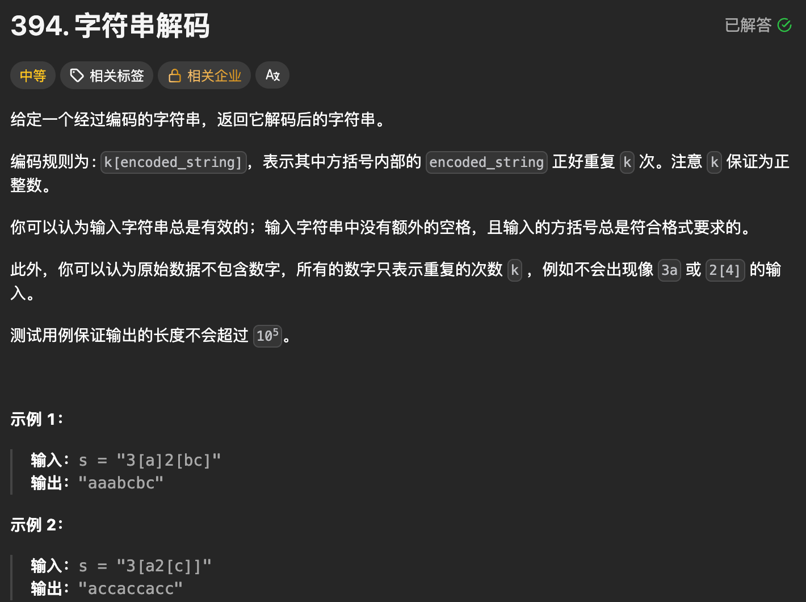

题目思路：


题目代码：

```cpp
class Solution {
public:
    string decodeString(string s) {
        stack<pair<string, int>> stk; // 用于模拟计算机的递归
        // 嵌套问题 → 天然用 栈
        // 遇到 [ = 进入递归
        // 遇到 ] = 退出递归
        // 不使用 move（复制 = 拷贝）stk.emplace(res, k); res.clear();
        string res;
        int k = 0;
        for (char c : s) {
            if (isalpha(c)) {
                res += c;
            } else if (isdigit(c)) {
                k = k * 10 + (c - '0');
            } else if (c == '[') {
                // 模拟递归
                // 在递归之前，把当前递归函数中的局部变量 res 和 k 保存到栈中
                stk.emplace(res, k);
                // 递归，初始化 res 和 k（由于 move 了，res 此时为空）
                res.clear();
                k = 0;
            } else { // ']'
                // 递归结束，从栈中恢复递归之前保存的局部变量
                auto [pre_res, pre_k] = stk.top();
                stk.pop();
                // 此时 res 是下层递归的返回值，将其重复 pre_k 次，拼接到递归前的 pre_res 之后
                while (pre_k--) {
                    pre_res += res;
                }
                res = pre_res;
            }
        }
        return res;
    }
};


class Solution {
public:
    string decodeString(string s) {
        // 对于栈来说的思路是 一个柱子， 中间的匹配对是可以消除的。
        // 对于本题目来说：是必定有的规则，左侧的符号直接入栈，
        // 右侧的符号一直找到左侧符号得到字符串，找到右侧符号找到具体数量。

        // 因为这里的肯定是[]匹配的。
        // 所以找到一个]即可匹配一个[ 找到对应的一小撮然后再丢进栈内。
        // 最终的结果就是整个栈内的内容。
        int n = s.size();
        std::stack<char>st;

        for (int i = 0; i < n; ++i) {
            char ch = s[i];
            if (ch != ']') {
                st.push(ch);
            } else {
                // 1. 先把括号内的字符串提取出来
                string tmp_str;
                while (st.top() != '[') {
                    tmp_str = st.top() + tmp_str;
                    st.pop();
                }
                st.pop(); // 弹出 '['
                
                // 2. 再提取前面的数字 k
                // 然后找数字，把str放入到栈里面(这个需要更大的循环时间复杂度)？
                // 亦或者存在临时变量str中
                int k = 0;
                int base = 1;
                while (!st.empty() && isdigit(st.top())) {
                    k = (st.top() - '0') * base + k;
                    base *= 10;
                    st.pop();
                }
                
                // 3. 把 tmp_str 重复 k 次，再逐个字符压回栈
                while (k--) {
                    for (char c : tmp_str) {
                        st.push(c);
                    }
                }
            }
        }
        
        // 4. 栈中剩余的就是解码后的字符串
        string res;
        while (!st.empty()) {
            res = st.top() + res;
            st.pop();
        }
        return res;

    }
};
```

### 题目来源：PTA-L2-014 列车调度

题目描述：  
 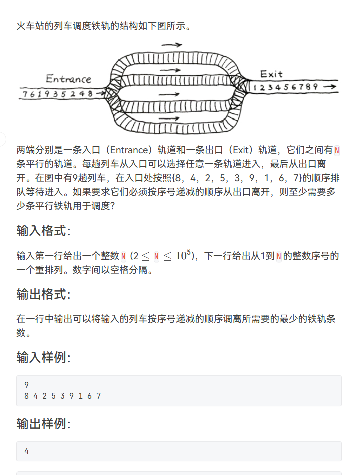

题目思路：


题目代码：

```cpp
if(当前编号>所有轨道上的最小编号)
{
	新增轨道并将该编号放入该轨道。
}
else
{
	把该编号放入最接近它的比他稍大一点的轨道中。
	（有同学可能会问为什么要放到最接近他的轨道，这是因为如果有这种情况出现
	{
		输入数据：8 4 2 5 3 9 1 6 
		在编号1进入之前按照伪代码每条轨道是这样过的情况：
		2 4 8
		3 5
		9
		如果将1放到最接近他的第一条轨道中，那么之后的6可以在不增加轨道的情况下放入第三条 
		轨  道，但如果要把1放入第三条轨道，那么就需要再增加一条轨道去放6，显然这样并不是
		最优解。
	}）
}

//对于N要进行适应性的更改，对于字段错误
#include<bits/stdc++.h>
using namespace std;
#define inf 0x3f3f3f3f
#define N 100100
int n,m,k,g,d;
int x,y,z;
char ch;
string str;
vector<int>v[N];

int main() {
    set<int>sc;
    cin>>n;
    for(int i=0;i<n;i++){
        cin>>x;
        set<int>::iterator it=sc.lower_bound(x);
        if(it==sc.end()){
            sc.insert(x);
        }else{
            sc.erase(it);
            sc.insert(x);
        }
    }
    cout<<sc.size()<<endl;
 
	return 0;
}


//平常算法是 进行贪心。记得补充；
```

### 题目来源：PTA-L2-005 集合相似度

题目描述：  
 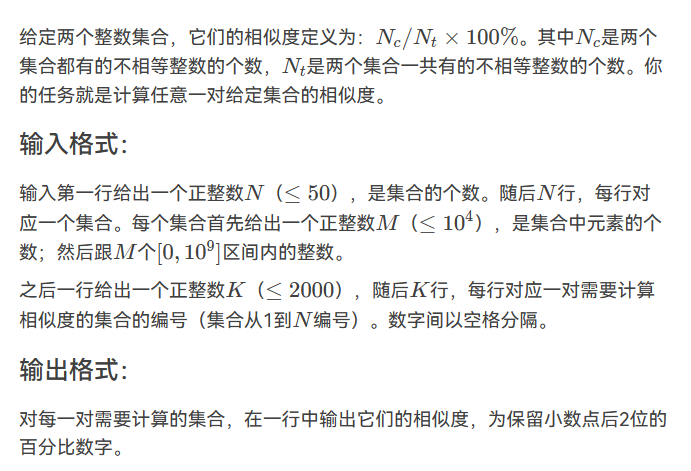

题目思路：


题目代码：

```cpp
//对于N要进行适应性的更改，对于字段错误
#include<bits/stdc++.h>
using namespace std;
#define inf 0x3f3f3f3f
#define N 100100
int n,m,k,g,d;
int x,y,z;
char ch;
string str;
vector<int>v[N];
set<int>sc[N];
int main() {
    
    cin>>n;
    for(int i=1;i<=n;i++){
        cin>>k;
        while(k--){
            cin>>x;
            sc[i].insert(x);
        }
    }
    cin>>k;
    while(k--){
        cin>>x>>y;
        int num1=sc[x].size();
        int num2=sc[y].size();
        int num3=0;
        set<int>::iterator it;
        for(it=sc[x].begin();it!=sc[x].end();it++){
            if(sc[y].find(*it)!=sc[y].end())num3++;
        }
        printf("%.2f",num3*1.0/(num1+num2-num3)*100);
        cout<<"%"<<endl;
    }
    
	return 0;
}
```

### 题目来源：PTA-L2-037 包装机

题目描述：  
 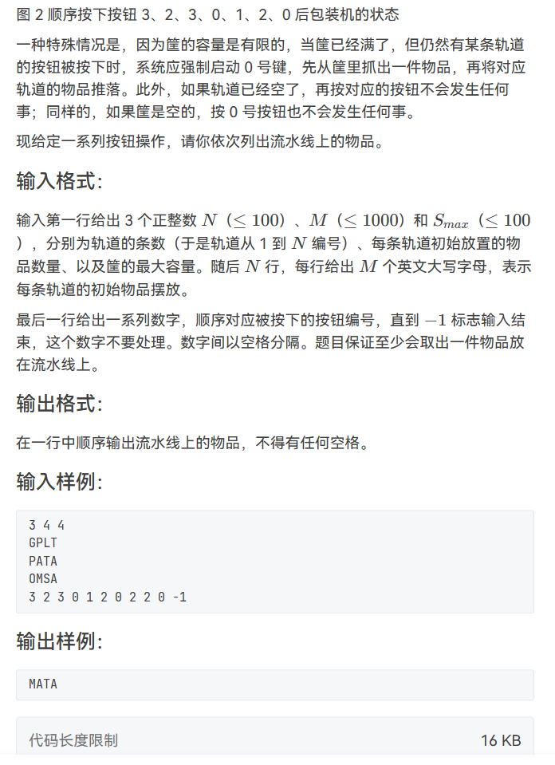

题目思路：

题目代码：

```cpp
//注意：stack的push() top()  pop()  queue 的push()  front()  pop();
//对于N要进行适应性的更改，对于字段错误
//if(sc[x].size()>0){
#include<bits/stdc++.h>
using namespace std;
#define inf 0x3f3f3f3f
#define N 1001
int n,m,k,g,d;
int x,y,z;
char ch;
string str;
vector<int>v[N];
queue<char>sc[N];

int main() {
    cin>>n>>m>>d;
    //注意铁轨上的用queue储存。
    for(int i=1;i<=n;i++){
        for(int j=1;j<=m;j++){
            cin>>ch;
            sc[i].push(ch);
        }
    }
    stack<char>s;
    while(cin>>k){
        if(k==-1)break;
        if(k==0){
            //抓取时，判断是否有
            if(s.size()>0){
                cout<<s.top();
                s.pop();
            }
        }else{
            //从铁轨推东西时看是否还有东西，以及容器里是否满了。
            if(sc[k].size()>0){
                if(s.size()==d){
                    cout<<s.top();
                    s.pop();
                }
                s.push(sc[k].front());
                sc[k].pop();
            }
        }
    }
	return 0;
}
```

### 题目来源：PTA-L2-032 彩虹瓶

题目描述：  
 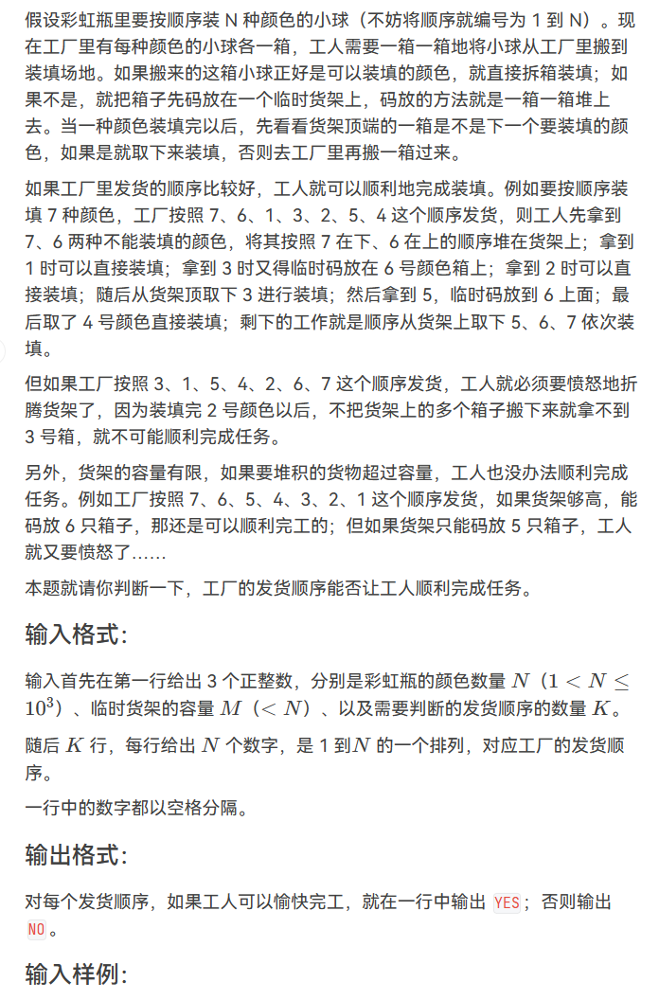

题目思路：

题目代码：

```cpp
//记住stack' 没有 s.clear（）
//记住要先判断s的非空才能使用s.top();;
//     while(!s.empty()&&cur==s.top()){
#include<bits/stdc++.h>
using namespace std;
int n,m,k;
int x,y,z;
int main(){
    cin>>n>>m>>k;
    while(k--){
        int cur=1;      //用来记录彩虹瓶当前需要填装的货号
        stack<int>s; //这个stack表示临时货架
        for(int i=1;i<=n;i++){
            cin>>x;
            if(x==cur){
                cur++;
                while(!s.empty() &&s.top()==cur){//必须加上判断s非空
                    s.pop();
                    cur++;
                }
            }else{
                if(s.size()<m)s.push(x);
            }
        }
        if(cur==n+1)cout<<"YES"<<endl;
        else cout<<"NO"<<endl;

    }
    return 0;
}
```

### 题目来源：PTA-L2-033 简单计算器

题目描述：  
 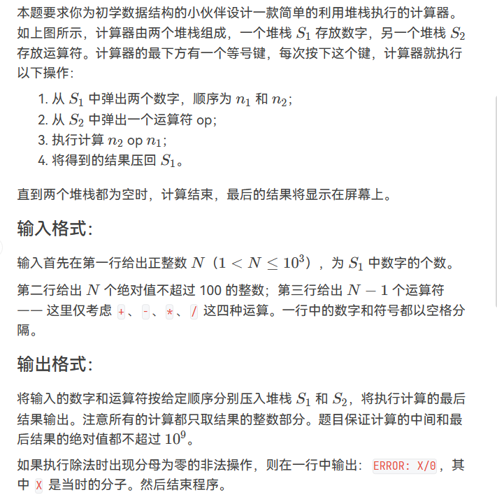

题目思路：

题目代码：

```cpp
//这里面是num2 op num1 

//对于N要进行适应性的更改，对于字段错误
#include<bits/stdc++.h>
using namespace std;
#define inf 0x3f3f3f3f
#define N 100100
int n,m,k,g,d;
int x,y,z;
char ch;
string str;
vector<int>v[N];

int main() {
    stack<int>s1;
    stack<char>s2;
    cin>>n;
    for(int i=0;i<n;i++){
        cin>>x;
        s1.push(x);
    }
    for(int i=0;i<n-1;i++){
        cin>>ch;
        s2.push(ch);
    }
    int flag=0;
    while(!s2.empty()){
        int num1=s1.top();
        s1.pop();
        int num2=s1.top();
        s1.pop();
        ch=s2.top();
        s2.pop();
        if(ch=='+'){
            s1.push(num2+num1);
        }else if(ch=='-'){
            s1.push(num2-num1);
        }else if(ch=='*'){
            s1.push(num2*num1);
        }else if(ch=='/'){
            if(num1==0){
                cout<<"ERROR: "<<num2<<"/0"<<endl;
                flag=1;
                break;
            }else{
                s1.push(num2/num1);
            }
        }
    }
    if(flag==0)cout<<s1.top();
	return 0;
}
```

### 题目来源：PTA-L3-002 特殊堆栈

题目描述：  
 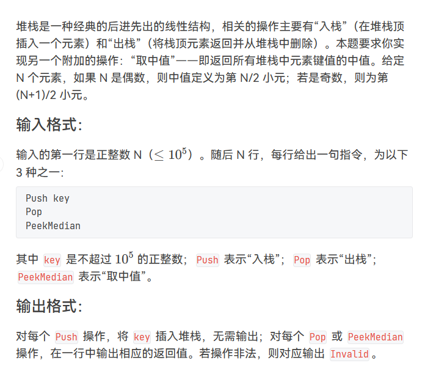

题目思路：

题目代码：

```cpp
//实现vector 插入时进行排序；；
//核心代码：
cin>>x;
it=lower_bound(v.begin(),v.end(),x);
v.insert(it,x);


//“取中值”——即返回所有堆栈中元素键值的中值。 并不进行跳出好像

//对于N要进行适应性的更改，对于字段错误
#include<bits/stdc++.h>
using namespace std;
#define inf 0x3f3f3f3f
#define N 100100
int n,m,k,g,d;
int x,y,z;
char ch;
string str;
vector<int>v[N];
int main()
{
	vector<int> ans;
    vector<int>order;
	vector<int>::iterator it;
	cin>>n;
    while(n--){
        cin>>str;
        if(str[1]=='u'){
            cin>>x;
            ans.push_back(x);
            it=lower_bound(order.begin(),order.end(),x);
            order.insert(it,x);
        }else if(str[1]=='e'){
            if(order.size()>0){
                int num=order.size();
                cout<<order[(num-1)/2]<<endl;
            }else{
                cout<<"Invalid"<<endl;
            }
            
        }else if(str[1]=='o'){
            if(order.size()>0){
                int num=ans[ans.size()-1];
                cout<<num<<endl;
                ans.pop_back();
                it=lower_bound(order.begin(),order.end(),num);
                order.erase(it);
            }else{
                cout<<"Invalid"<<endl;
            }
        }
    }

}


//超时的
#include <bits/stdc++.h>
using namespace std;
#define N 100100
#define inf 0x3f3f3f3f
int n,m,d,k;
int x,y,z;
string str;
char ch;
vector<int>v[N];

int main()
{
    cin>>n;
    stack<int>s;
    vector<int>cur;
    vector<int>::iterator it;
    while(n--){
        cin>>str;
        if(str=="Pop"){
            if(s.size()==0){
                cout<<"Invalid"<<endl;
            }else{
                int num=s.top();
                s.pop();
                cout<<num<<endl;
                it=lower_bound(cur.begin(),cur.end(),num);
                cur.erase(it);
            }
        }else if(str=="PeekMedian"){
            if(cur.size()>0){
            sort(cur.begin(),cur.end());
            int num=cur.size();
            cout<<cur[(num-1)/2]<<endl;
            }else{
                cout<<"Invalid"<<endl;
            }
            
            
        }else if(str=="Push"){
            cin>>x;
            cur.push_back(x);
            s.push(x);
        }
        
        
    }

    return 0;
}
```

### 题目来源：PTA-L2-041 插松枝

题目描述：  
 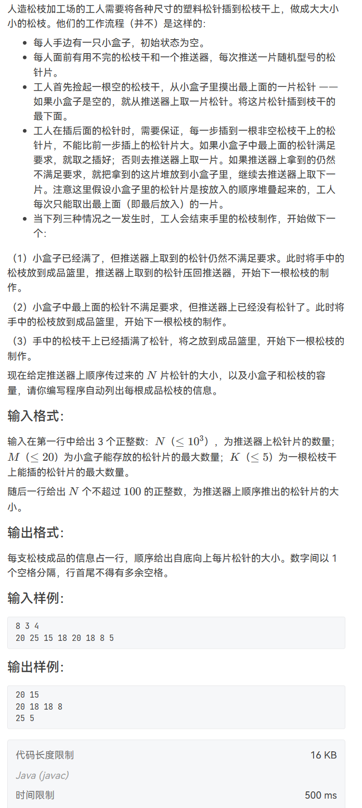

题目思路：

> 算是利用了continue吧；；

题目代码：

```cpp
//对于N要进行适应性的更改，对于字段错误
#include<bits/stdc++.h>
using namespace std;
#define inf 0x3f3f3f3f
#define N 505
int n,m,k,g,d;
int x,y,z;
char ch;
string str;
vector<int>v[N];

int main() {
	// box  松枝干 ，  推送器   推送 型号 松枝片
	//工人首先捡起一根空的松枝干，从小盒子里摸出最上面的一片松针 
	//—— 如果小盒子是空的，就从推送器上取一片松针。将这片松针插到枝干的最下面。
	
	queue<int>tui;
	stack<int>box;
	vector<int>tree;
	vector<vector<int>>res;
	cin>>n>>m>>k;
	for(int i=0;i<n;i++){
		cin>>x;
		tui.push(x);
	}
	int num=1;
	while(!box.empty() || !tui.empty()){//说明至少还有松枝片； 
		
		// tree已经满了 
		int size=tree.size();
		if(size==k){
			res.push_back(tree);
			tree.clear();
			continue;
		}
		
		// tree没有满为空； 
		if(size==0){
			//先从盒子拿； 
			if(box.size()>0){
				x=box.top();
				box.pop();
				tree.push_back(x);
			}else{
				x=tui.front();
				tui.pop();
				tree.push_back(x);
			}
			continue;
		}
		
		// tree没有满 但是不为空
		int last=tree[size-1]; 
		//先从盒子拿； 
		if(box.size()>0){
			int now=box.top();
			//盒子上的是否可以； 
			if(now<=last){
				tree.push_back(now);
				box.pop();
			}else{
				//就该看 推送器上的了；
				if(tui.size()>0){
					int now=tui.front();
					if(now<=last){
						tree.push_back(now);
						tui.pop();
					}else{
						//看是否可以放到盒子里去
						if(box.size()<m){
							box.push(tui.front());
							tui.pop();
						}else{
							res.push_back(tree);
							tree.clear();
							continue;
						}
					}
				}else{
					res.push_back(tree);
					tree.clear();
					continue;
				}
			}
			
			
			
		}else{//再从 推送器具拿； 
			int now=tui.front();
			if(now<=last){
				tree.push_back(tui.front());
				tui.pop();
			}else{
				//放在盒子里面；因为 这里的判断条件已经是盒子为空；
				box.push(tui.front());
				tui.pop();
			}
			
		}
	}
	
	for(int i=0;i<res.size();i++){
		for(int j=0;j<res[i].size();j++){
			if(j==0)cout<<res[i][j];
			else cout<<" "<<res[i][j];
		}
		cout<<endl;
	}
	for(int i=0;i<tree.size();i++){
		if(i==0)cout<<tree[i];
		else cout<<" "<<tree[i];
	}
	return 0;
}
```

### 题目来源：Acwing-128. 编辑器

题目描述：  
 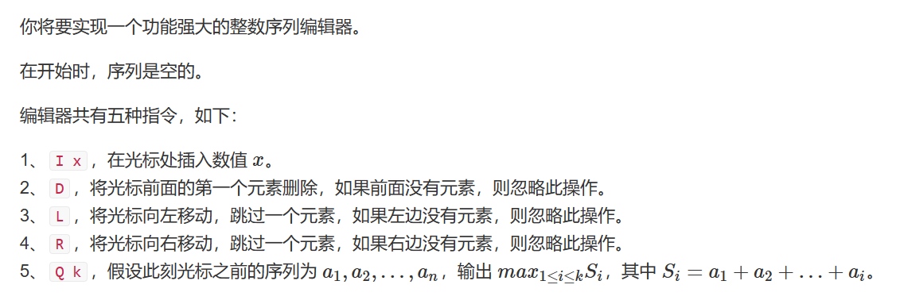

题目思路：

> 主要是看题目这些操作都是栈的操作步骤，然后另外一个就是 两个栈了，随后就是看着前缀和和f[ ]进行动态规划吧；大致就是这样吧

题目代码：

```cpp
#include <bits/stdc++.h>
using namespace std;
#define N 100100
#define inf 0x3f3f3f3f
#define debug(x) cout<<#x<<" = "<<x<<endl;

int n,m,k,d,g;
int x,y,z;
string str;
char ch;
vector<int>v[N];

stack<int>a,b;

int main()
{

    cin>>n;
    int sum[N];
    int f[N];
    sum[0]=0;
    f[0]=-inf;
    while(n--){
        cin>>ch;
        if(ch=='I'){
            cin>>x;
            a.push(x);
            sum[a.size()]=sum[a.size()-1]+x;//前1~a.size()-1的前缀和,加上这个一个新来的,构成1~a.size()
            f[a.size()]=max(f[a.size()-1],sum[a.size()]);//有负数,看是之前的最大值大,还是新来的最大值大

        }else if(ch=='D'){
            if(!a.empty()){
                a.pop();
            }
        }else if(ch=='L'){
            if(!a.empty()){
                b.push(a.top());//a+b等于整个插入序列,b负责管理当前光标右边的序列.
                a.pop();
            }
        }else if(ch=='R'){
            if(!b.empty()){
                x=b.top();
                b.pop();
                a.push(x);//a负责管理1~当前光标.所以现在a往右了,那么必然是要加入b栈的开头,因为b栈管理当前光标的右边.
                sum[a.size()]=sum[a.size()-1]+x;//同样的还是重新定义.
                f[a.size()]=max(f[a.size()-1],sum[a.size()]);//有负数
            }

        }else if(ch=='Q'){
            cin>>k;
            cout<<f[k]<<endl;//输出当前最大值区间.
        }
    }


    return 0;
}
```

### 题目来源：Acwing-129. 火车进栈

题目描述：

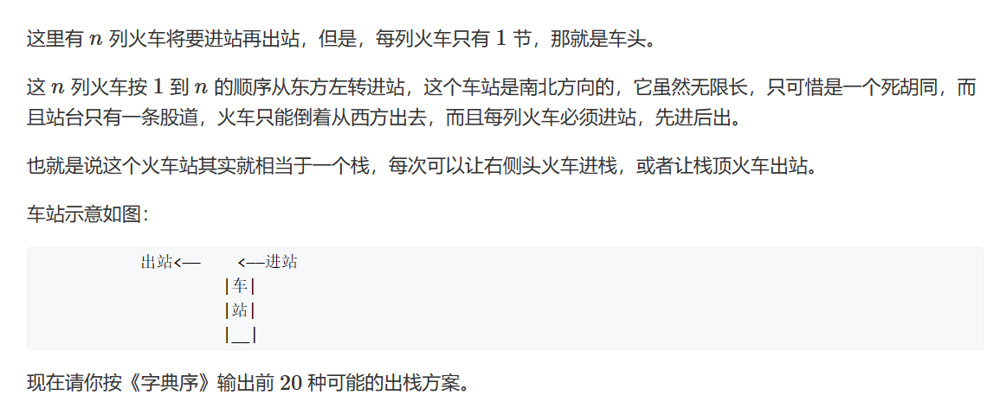

题目思路：


题目代码：

```cpp
#include <bits/stdc++.h>
using namespace std;
#define N 100100
#define inf 0x3f3f3f3f
#define debug(x) cout<<#x<<" = "<<x<<endl;

int n,m,k,d,g;
int x,y,z;
string str;
char ch;
vector<int>v[N];

stack<int>a,b;
int total=0;
int st[N];
vector<int>path;//全局变量跟参数基本意思是一样了；
vector<vector<int>>res;
void dfs(int top,int index){
    //先确定结束条件
    if(total>=20)return;

    if(top==0&&index>n){
        total++;
        res.push_back(path);

        return;
    }

    //两种状态分别进行dfs
    if(top){//出栈
        int now=st[top];
        path.push_back(now);
        dfs(top-1,index);
        //恢复状态
        path.pop_back();//主要是这里了，也就是说path经过dfs之后；因为是全局变量，所以还是第34行的path吗？是的；是它；
        st[top]=now;
    }

    if(index<=n){//进栈
        st[top+1]=index;
        dfs(top+1,index+1);
    }
}
int main()
{
    //由题目可以知道，火车栈存在两种情况，要么出栈，要么进栈。

    cin>>n;
    dfs(0,1);

    for(auto uu:res){
        for(auto zz:uu)cout<<zz;
        cout<<endl;
    }


    return 0;
}
```

### 题目来源：蓝桥杯-2012省赛-括号问题

题目描述：

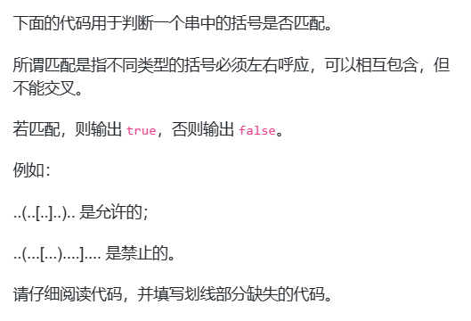

题目思路：


题目代码：

```cpp
import java.util.*;
public class Main
{
    public static boolean isGoodBracket(String s)
    {
        Stack<Character> a = new Stack<Character>();
        
        for(int i=0; i<s.length(); i++)
        {
            char c = s.charAt(i);
            if(c=='(') a.push(')');
            if(c=='[') a.push(']');
            if(c=='{') a.push('}');
            
            if(c==')' || c==']' || c=='}')
            {
                if(a.size()==0) return false;    // 填空
                if(a.pop() != c) return false;
            }
        }
        
        if(a.size()!=0) return false;  // 填空
        
        return true;
    }
    
    public static void main(String[] args)
    {
        System.out.println( isGoodBracket("...(..[.)..].{.(..).}..."));
        System.out.println( isGoodBracket("...(..[...].(.).){.(..).}..."));
        System.out.println( isGoodBracket(".....[...].(.).){.(..).}..."));
        System.out.println( isGoodBracket("...(..[...].(.).){.(..)...."));
    }
}
```

### 题目来源：蓝桥杯-2017省赛-拉马车

题目描述：

题目思路：


题目代码：

## No.2 牛客网-栈

### NC15029：吐泡泡

```cpp
//全对的
#include<iostream>
#include<string>
#include<stack>

using namespace std;

int main()  // stack 写法
{
    string str;
    while(cin >> str)
    {
        stack<char> st, sk; 
        for(auto ch : str)
        {
            if(st.size())
            {
                auto top = st.top();
                bool flag = 1;
                while(ch == top)
                {
                    if(ch == 'o')
                    {
                        st.pop();
                        ch = 'O';  
                    }
                    else
                    {
                        st.pop();
                        flag = 0;
                        break;
                    }
                    if(!st.size()) break;
                    top = st.top();
                }
                if(flag) st.push(ch);
            }
            else
            {
                st.push(ch);
            }
        }
        //输出
        while(st.size())
        {
            sk.push(st.top());
            st.pop();
        }
        while(sk.size())
        {
            cout << sk.top();
            sk.pop();
        }
        puts("");
    }
    return 0;
}


//  对了 百分之四十。
//对于N要进行适应性的更改，对于字段错误
	#include<bits/stdc++.h>
	using namespace std;
	#define inf 0x3f3f3f3f
	#define N 100100
	int n,m,k,g,d;
	int x,y,z;
	char ch;
	string str;

	int main() {
		
		cin>>str;
		stack<char>b;
		vector<char>a;
		for(auto i:str){
			a.push_back(i);
		}
		for(int i=0;i<a.size();i++){

			if(b.size()>0){
				char ss;
				ss=b.top();
				if(ss==a[i]&&ss=='o'){
					b.pop();
					a[i]='O';
					i--;
				}else if(ss==a[i]&&ss=='O'){
					b.pop();
				}else{
					b.push(a[i]);
				}
			}else{
				b.push(a[i]);
			}
		}

		vector<char>c;
		while(!b.empty()){
			c.push_back(b.top());
			b.pop();
		}
		reverse(c.begin(),c.end());
		for(auto i:c){
			cout<<i;
		}
		return 0;
	}
```

### NC50998：括号画家

例如 **(){}** 是美观的括号序列，而 )({)[}]( 则不是。

```cpp
思路：就是先用i指针 指着开始部位。  再有j指针循环以i起头的可能。
    
//对于N要进行适应性的更改，对于字段错误
	#include<bits/stdc++.h>
	using namespace std;
	#define inf 0x3f3f3f3f
	#define N 100100
	int n,m,k,g,d;
	int x,y,z;
	string str;

	int main() {
		
		cin>>str;
		int res=0;
		//类似双指针了好像；
		for(int i=0;i<str.size();i++){
			stack<char>st;
			for(int j=i;j<str.size();j++){
				if(str[j]=='['){
					st.push(']');
				}else if(str[j]=='{'){
					st.push('}');
				}else if(str[j]=='('){
					st.push(')');
				}else if(st.empty() || str[j]!=st.top()){
                    //夭折
					break;
				}else{
					st.pop();
                    //清空代表在此刻是 对称的。
					if(st.empty())res=max(res,j-i+1);
				}
			}
		}
		cout<<res<<endl;

		return 0;
	}
```

### NC15975：小c的记事本

```cpp
// 自己用 char
//对于N要进行适应性的更改，对于字段错误
#include<bits/stdc++.h>
using namespace std;
#define inf 0x3f3f3f3f
#define N 100100
long long n,m,k,g,d;
int x,y,z;
char ch;
string str;
vector<int>v[N];

int main() {
    ios::sync_with_stdio(false);
	cin>>n;
    stack<vector<char>>ans;
	vector<char>st;
	while(n--){
		cin>>x;
		if(x==1){
			ans.push(st);
			cin>>str;
			for(auto p:str){
				st.push_back(p);
			}
		}else if(x==2){
			ans.push(st);
			cin>>k;
			while(k--){
				st.pop_back();
			}
		}else if(x==3){
			cin>>k;
			cout<<st[k-1]<<endl;
		}else if(x==4){
			st=ans.top();
            ans.pop();
		}
	}
	return 0;
}


// 别人用 string
#include<bits/stdc++.h>
using namespace std;
int main()
{
	ios::sync_with_stdio(false);
	int t;
	while(cin>>t)
	{
		stack<string>s; //定义一个字符串类型的栈 
		int a;
		string s1;
		s.push("");
		while(t--)
		{
			cin>>a;
			if(a==1)
			{
				cin>>s1;
				s.push(s.top()+s1); //向记事本插入字符串 
			}
			else if(a==2)
			{
				int k;
				cin>>k;
				s1=s.top();
				s.push(s1.substr(0 , s1.length()-k));
		 	}
		 	else if(a==3)
		 	{
		 		int k;
		 		cin>>k;
		 		s1=s.top();
		 		cout<<s1[k-1]<<endl; 
		  	} 
		  	else 
		  		s.pop();
		}
	}
	return 0;
}
```

### NC14666：最优屏障

```cpp
//对于N要进行适应性的更改，对于字段错误
#include<bits/stdc++.h>
using namespace std;
#define inf 0x3f3f3f3f
#define N 100100
long long n,m,k,g,d,t;
int x,y,z;
char ch;
string str;
vector<int>v[N];
int num(vector<int>h , int l, int r){
	if(l==r)return 0;
	int res=0;
	int maxx=0;
	for(int i=l;i<=r;i++){
		maxx=0;
		for(int j=i+1;j<=r;j++){
			if(maxx<min(h[i-1],h[j-1]))res++;
			maxx=max(maxx,h[j-1]);
		}
	}
	return res;

}
int main() {
	cin>>t;
	for(int i=1;i<=t;i++){
		cin>>n;
		vector<int>h;
		for(int j=0;j<n;j++){
			cin>>x;
			h.push_back(x);
		}
		int sum=num(h,1,n);
		vector<int>cnt;
		cnt.push_back(0);
		cnt.push_back(0);
		for(int j=2;j<=n;j++){
			int zuo=num(h,1,j-1);
			int you=num(h,j,n);
			cnt.push_back(sum-zuo-you);
		}
		int maxxx=0;
		int weizhi=0;
		for(auto p:cnt)maxxx=max(maxxx,p);
		for(int j=0;j<cnt.size();j++){
			if(cnt[j]==maxxx){
				weizhi=j;
				break;
			}
		}
		cout<<"Case #"<<i<<": "<<weizhi<<" "<<maxxx<<endl;
	}   
	return 0;
}
```

### NC14847：Masha与老鼠：

```text

```

### NC50999：表达式计算

```cpp
#include<bits/stdc++.h>

using namespace std;
char s[50];
stack<int>s1;
stack<char>s2;

int level(char op){
    if(op=='+'||op=='-')
        return 1;
    else if(op=='*'||op=='/')
        return 2;
    else if(op=='^')
        return 3;
    return 0;
}

int Pow(int a,int b){
    int res=1;
    while(b--){
        res*=a;
    }
    return res;
}

void calc(char op){
    int x,y;
    x=s1.top();
    s1.pop();
    y=s1.top();
    s1.pop();
    if(op=='+')
        s1.push(x+y);
    else if(op=='-')
        s1.push(y-x);
    else if(op=='*')
        s1.push(x*y);
    else if(op=='/')
        s1.push(y/x);
    else if(op=='^')
        s1.push(Pow(y,x));
}

int main(){
    cin>>s+1;
    int n=strlen(s+1),num=0;
    s1.push(0);
    for(int i=1;i<=n;i++){
        if(s[i]>='0'&&s[i]<='9'){
            num=num*10+s[i]-'0';
            if(s[i+1]<'0'||s[i+1]>'9'){
                s1.push(num);
                num=0;
            }
            continue;
        }
        if(s[i]=='('){
            s2.push(s[i]);
        }
        else{
            if(s[i]==')'){
                while(!s2.empty()&&s2.top()!='('){
                    calc(s2.top());
                    s2.pop();
                }
                if(!s2.empty()&&s2.top()=='(')
                    s2.pop();
            }
            else{
                while(!s2.empty()&&level(s[i])<=level(s2.top())){
                    calc(s2.top());
                    s2.pop();
                }
                s2.push(s[i]);
            }
        }
    }
        while(!s2.empty()&&s2.top()!='('&&s2.top()!=')'){
            calc(s2.top());
            s2.pop();
        }
        cout<<s1.top()<<endl;
    return 0;
}
```

## No.3 模拟加减乘除运算-栈

### 题目来源：LeetCode-1006.笨阶乘

题目描述：  
 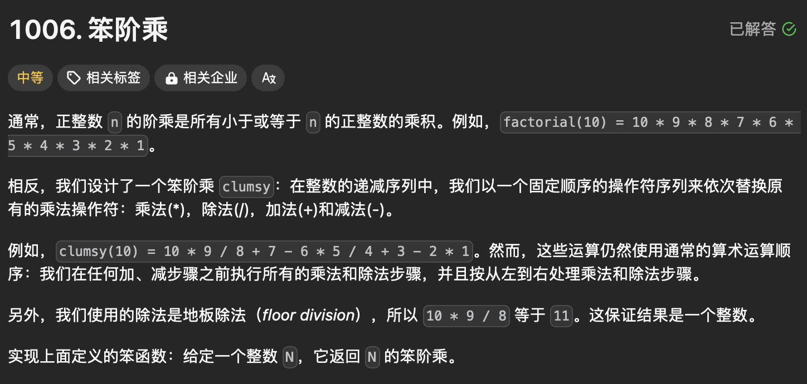

题目思路：


题目代码：

```cpp
class Solution {
public:
    int clumsy(int n) {
        /// 如果是自己的想法的话 就是 4个数字为一组；进行模拟，
        /// 如何模仿加减乘除的栈呢？，如果标记优先级的话感觉太慢；
        int iterN = n / 4;
        int mod = n % 4;
        vector<int>res;
        int now = n;
        for(int i = 0; i < iterN; i++)
        {
            int temp = now * (now - 1) / (now - 2) - (now - 3);
            if(i == 0)
            {
                temp = temp + (now - 3) * 2;
            }
            res.push_back(temp);
            now = now - 4;
        }
        if(mod == 1)
        {
            int temp = 1;
            res.push_back(temp);
        }else if(mod == 2){
            int temp = 2 * 1;
            res.push_back(temp);
        }else if(mod == 3){
            int temp = 3 * 2 / 1;
            res.push_back(temp);
        }
        now = res[0];
        for(int i = 1; i < res.size(); i++)
        {
            now = now - res[i];
        }
        return now; 
    }
};
```
