# 【完整题单08、常用数据结构】【无】

> 来源：[【完整题单08、常用数据结构】【无】](https://blog.csdn.net/weixin_51429773/article/details/129346209) · 发布时间：2026-06-03 · 阅读量：公开

#### 目录

- [知识框架](#_2)
- [No.0 筑基](#No0__4)
- [No.1 结构体遍历查询](#No1__8)
- - [题目来源：PTA-L1-005 考试座位号](#PTAL1005__9)
  - [题目来源：PTA-L1-030 一帮一](#PTAL1030__54)
  - [题目来源：PTA-L1-056 猜数字](#PTAL1056__98)
  - [题目来源：PTA-L2-019 悄悄关注](#PTAL2019__146)
- [No.2 结构体简单到复杂的排序](#No2__199)
- - [题目来源：PTA-L2-003 月饼](#PTAL2003__201)
  - [题目来源：PTA-L2-007 家庭房产](#PTAL2007__256)
  - [题目来源：PTA-L2-009 抢红包](#PTAL2009__373)
  - [题目来源：PTA-L2-015 互评成绩](#PTAL2015__442)
  - [题目来源：PTA-L2-021 点赞狂魔](#PTAL2021__494)
  - [题目来源：PTA-L2-027 名人堂与代金券](#PTAL2027__555)
  - [题目来源：Acwing-3601-成绩排序](#Acwing3601_621)
  - [题目来源：蓝桥杯-2022省赛模拟-运动会](#2022_671)
- [No.3 结构体设计固定时间间隔模拟模板](#No3__726)
- - [题目来源：PTA-L1-043 阅览室](#PTAL1043__727)
  - [题目来源：蓝桥杯-2019省赛-外卖店优先级](#2019_786)
- [No.4 结构体复杂模拟](#No4__855)
- - [题目来源：PTA-L2-034 口罩发放](#PTAL2034__856)
  - [题目来源：RoboCom-2022-RC-u2 智能服药助手](#RoboCom2022RCu2__934)

## 知识框架

## No.0 筑基

> 请先学习下知识点，道友！  
>  题目知识点大部分来源于此：

## No.1 结构体遍历查询

### 题目来源：PTA-L1-005 考试座位号

题目描述：  
 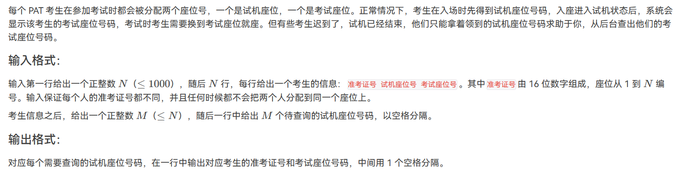

题目思路：


题目代码：

```
//结构体更方便点，然后再循环
//由 16 位数字组成要用到long 
//对于N要进行适应性的更改，对于字段错误
#include<bits/stdc++.h>
using namespace std;
#define inf 0x3f3f3f3f
#define N 1001
int n,m,k,g,d;
int x,y,z;
char ch;
string str;
vector<int>v[N];
struct node{
    string name;
    int a,b;
}stu[N];

// 尝试使用map<string,int>mp;
int main() {
    cin>>n;
    for(int i=0;i<n;i++){
        cin>>stu[i].name>>stu[i].a>>stu[i].b;
    }
    cin>>k;
    while(k--){
        cin>>x;
        for(int i=0;i<n;i++){
            if(stu[i].a==x)cout<<stu[i].name<<" "<<stu[i].b<<endl;
        }
    }
	return 0;
}
```

### 题目来源：PTA-L1-030 一帮一

题目描述：  
 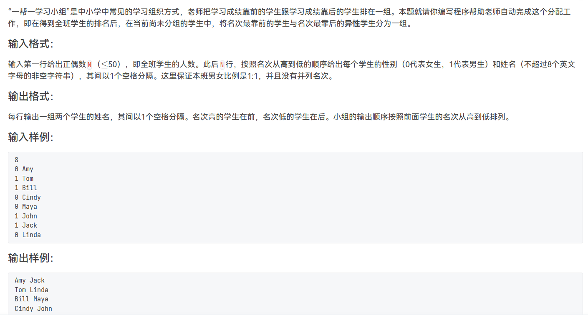

题目思路：

题目代码：

```
#include<bits/stdc++.h>
using namespace std;
struct node{
    string name;
    int sex;
    int flag=0;
}stu[1001];
int main(){
    int n,m,k;
    cin>>n;
    for(int i=0;i<n;i++){
        cin>>stu[i].sex>>stu[i].name;
    }
    for(int i=0;i<n/2;i++){
        if(stu[i].flag==1){
            continue;
        }
        cout<<stu[i].name<<" ";
        for(int j=n-1; j>=0;j--){
            if(stu[j].sex!=stu[i].sex && stu[j].flag==0){
                cout<<stu[j].name<<endl;
                stu[j].flag=1;
                break;
            }
        }

    }

return 0;
}
```

### 题目来源：PTA-L1-056 猜数字

题目描述：  
 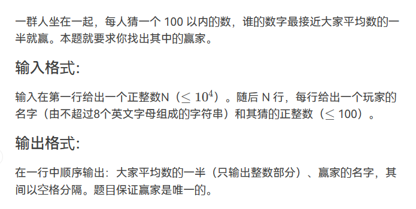

题目思路：

题目代码：

```
#include<bits/stdc++.h>
using namespace std;
#define inf 0x3f3f3f3f
#define N 10010
int n,m,k,g,d;
int x,y,z;
char ch;
string str;
vector<int>v[N];
struct node{
    string name;
    int num;
}stu[N];

int main() {
    cin>>n;
    double sum=0;
    for(int i=0;i<n;i++){
        cin>>stu[i].name>>stu[i].num;
        sum=sum+stu[i].num;
    }
    int avenum=sum/n/2;
    cout<<avenum<<" ";
    int minn=inf;
    vector<int>ans;
    for(int i=0;i<n;i++){
        int numx=abs(avenum-stu[i].num);
        if(numx<minn){
            minn=numx;
            ans.push_back(i);
        }
    }
    cout<<stu[ ans[ans.size()-1]].name<<endl;
	return 0;
}
```

### 题目来源：PTA-L2-019 悄悄关注

题目描述：  
 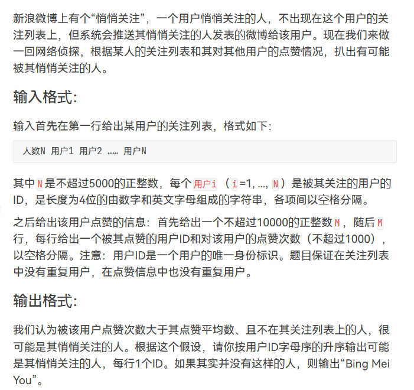

题目思路：

题目代码：

```
//        if(stu[i].num>sum && str.find(stu[i].name)==string::npos){

#include<bits/stdc++.h>
using namespace std;
#define inf 0x3f3f3f3f
#define N 10010
int n,m,k,g,d;
int x,y,z;
char ch;
string str;
vector<int>v[N];
struct node{
    string name;
    int num;
}stu[N];
bool cmp(node a,node b){
    return a.name<b.name;
}
int main() {
    getline(cin,str);
    cin>>n;
    int sum=0;
    for(int i=0;i<n;i++){
        cin>>stu[i].name>>stu[i].num;
        sum=sum+stu[i].num;
    }
    int avesum=sum/n;
    sort(stu,stu+n,cmp);
    int flag=0;
    for(int i=0;i<n;i++){
        if(stu[i].num>avesum && str.find(stu[i].name)==string::npos){
            cout<<stu[i].name<<endl;
            flag=1;
        }
    }
    if(flag==0){
        cout<<"Bing Mei You"<<endl;
    }
	return 0;
}
```

## No.2 结构体简单到复杂的排序

### 题目来源：PTA-L2-003 月饼

题目描述：  
 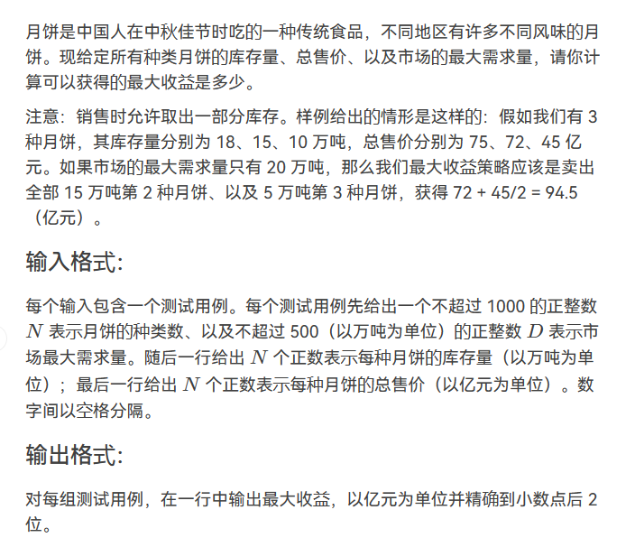

题目思路：

题目代码：

```
#include<bits/stdc++.h>
using namespace std;
#define inf 0x3f3f3f3f
#define N 100100
int n,m,k,g,d;
int x,y,z;
char ch;
string str;
vector<int>v[N];
struct node{
    double kucun,sale,avesale;
}moon[N];
bool cmp(node a, node b){
    return a.avesale>b.avesale;
}
int main() {
    cin>>n>>d;
    for(int i=0;i<n;i++){
        cin>>moon[i].kucun;
    }
    for(int i=0;i<n;i++){
        cin>>moon[i].sale;
        moon[i].avesale=moon[i].sale/moon[i].kucun;
    }
    sort(moon,moon+n,cmp);
    double sum=0.0;
    for(int i=0;i<n;i++){
        if(moon[i].kucun==d){
            sum+=moon[i].sale;
            break;
        }else if(moon[i].kucun<d){
            sum+=moon[i].sale;
            d=d-moon[i].kucun;
        }else if(moon[i].kucun>d){
            sum+=moon[i].avesale*d;
            break;
        }
    }
    printf("%.2f",sum);
	return 0;
}
```

### 题目来源：PTA-L2-007 家庭房产

题目描述：  
 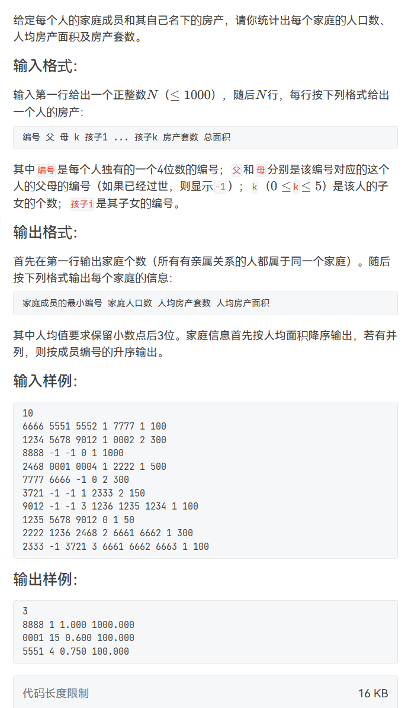

题目思路：

题目代码：

```
//注意N的取值要大于id 不只是4位数，要五位数
//如果出现cnt=0的时候就是忘了初始化Init了了了
#include <bits/stdc++.h>
using namespace std;
string str;
char ch;
#define N 10050
#define inf 0x3f3f3f3f
int n,m,k,s,d;
int x,y,z;
vector<int>v[N];
int f[N];
void Init(){
    for(int i=0;i<N;i++)f[i]=i;
}
int find(int x){
    if(x!=f[x]){
        f[x]=find(f[x]);
    }
    return f[x];
}
void merge(int x,int y){
    int fx=find(x);
    int fy=find(y);
    if(fx>fy){
        f[fx]=fy;
    }else{
        f[fy]=fx;
    }
}
struct me{
    int id;
    int num,area;
}member[N];
struct node{
    int flag;
    int id;
    int area , num;
    int peo;
    double avearea,avenum;
}fami[N];
bool cmp(node a, node b){
    if(a.avearea!=b.avearea){
        return a.avearea>b.avearea;
    }
    return a.id<b.id;
    
    
}
int main()
{
    Init();
    cin>>n;
    set<int>people;
    int id,fa,ma,child;
    for(int i=0;i<n;i++){
        cin>>id>>fa>>ma>>k;
        member[i].id=id;
        people.insert(id);
        if(fa!=-1){
            people.insert(fa);
            merge(id,fa);
        }
        if(ma!=-1){
            people.insert(ma);
            merge(id,ma);
        }
        while(k--){
            cin>>child;
            people.insert(child);
            merge(id,child);
        }
        cin>>member[i].num>>member[i].area;
    }
    
    for(int j=0;j<n;j++){
        int idx=find(member[j].id);
        fami[idx].id=idx;
        fami[idx].flag=1;
        fami[idx].num+=member[j].num;
        fami[idx].area+=member[j].area;
    }
    int cnt=0;
    for(auto j:people){
        fami[find(j)].peo++;
        if(fami[j].flag==1)cnt++;
    }
    for(auto j:people){
        if(fami[j].flag==1){
            fami[j].avearea=fami[j].area*1.0/fami[j].peo;
            fami[j].avenum=fami[j].num*1.0/fami[j].peo;
        }
    }
    sort(fami,fami+N,cmp);
    cout<<cnt<<endl;
    for(int i=0;i<cnt;i++){
        printf("%04d %d %.3f %.3f\n",fami[i].id,fami[i].peo,fami[i].avenum,fami[i].avearea);
    }
    return 0;
}
```

### 题目来源：PTA-L2-009 抢红包

题目描述：  
 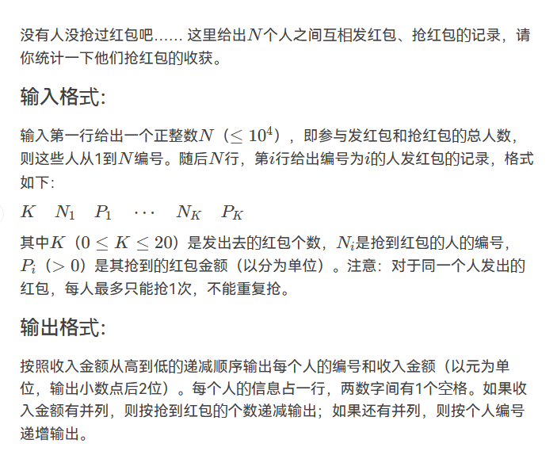

题目思路：

题目代码：

```
//这里注意输入的value 是分，所以单位换算成元。printf(" %.2f\n",stu[i].value/100);


#include<bits/stdc++.h>
using namespace std;
struct node
{
	int id;//人的编号;
	int num;//人抢到红包的个数;
	int value;//抢到红包的金额;	
}person[10000];
bool f(struct node a,struct node b)
{
	if(a.value!=b.value)//如果金额没有并列,则按照总金额从达到小的顺序递减输出; 
	{
		return a.value>b.value;
	}
	else if(a.num != b.num)//金额有并列，则按照抢到红包的个数递减输出;
	{
		return a.num>b.num;	
	} 
	else if(a.id != b.id)//如果金额和抢到红包的个数都有并列,则按照人的编号递增输出;
	{
		return a.id<b.id;	
	} 
}
int main()
{
	int n,k,p,i,j,sum=0,n1;//k指的是抢到红包的个数,n指的是抢红包人的编号,p指的是抢到红包的金额;
	cin>>n;
	for(i=1;i<=n;i++)
	{
		person[i].id = i;//编号是i的人对应的id值是i; 
		cin>>k;
		sum=0;
		for(j=1;j<=k;j++)
		{
			cin>>n1>>p;
//			person[n1].id = n1;易错点，因为你不知道每个人都抢了红包,当有的人没有抢，那么对应的id值就变成了0; 
			person[n1].value = person[n1].value + p;//记录抢到红包的金额; 
			person[n1].num ++;//记录抢到红包的个数; 
			sum = sum + p;//记录第i个人发红包的总金额; 
		}
		person[i].value = person[i].value - sum;//更新编号为i的人剩余的总金额;
	} 
	//因为人的编号n是正整数,故需要将person加1;
	//person+n+1包含的范围是person+n，不包括那个1;
	//[person+1,person+n+1)---->[1,n]
	sort(person+1,person+n+1,f);//自动调用f()函数,包含在头文件 ----> #include<algorithm>
	for(i=1;i<=n;i++)
	{
		//抢到红包的进金额是按照分这个单位来计算的,故需要在输出是转换成元; 
		printf("%d %.2lf\n",person[i].id,person[i].value*1.0/100);
	}
}
```

### 题目来源：PTA-L2-015 互评成绩

题目描述：  
 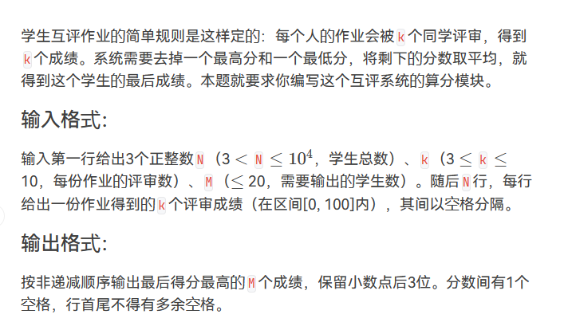

题目思路：

题目代码：

```
//    for(int i=m-1;i>=0;i--){

#include<bits/stdc++.h>
using namespace std;
#define inf 0x3f3f3f3f
#define N 100100
int n,m,k,g,d;
int x,y,z;
char ch;
string str;
vector<int>v[N];
bool cmp(double a,double b){
    return a>b;
}
int main() {
    vector<double> ans;
    cin>>n>>k>>m;
    for(int i=0;i<n;i++){
        double sum=0;
        int maxx=0,minn=inf;
        for(int j=0;j<k;j++){
            cin>>x;
            sum=sum+x;
            maxx=max(x,maxx);
            minn=min(x,minn);
        }
        sum=(sum-maxx-minn)/(k-2);
        ans.push_back(sum);
    }
    sort(ans.begin(),ans.end(),cmp);
    for(int i=m-1;i>=0;i--){
        if(i==m-1){
            printf("%.3f",ans[i]);
        }else{
            printf(" %.3f",ans[i]);
        }
    }
	return 0;
}
```

### 题目来源：PTA-L2-021 点赞狂魔

题目描述：  
 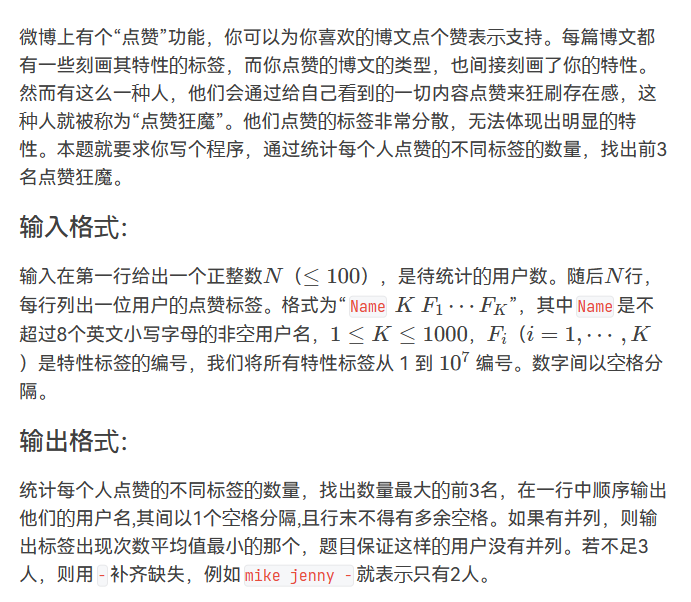

题目思路：

题目代码：

```
//        stu[i].ave=k;

#include<bits/stdc++.h>
using namespace std;
#define inf 0x3f3f3f3f
#define N 105
int n,m,k,g,d;
int x,y,z;
char ch;
string str;
vector<int>v[N];
struct node{
    string name;
    int count;
    int num;
}stu[N];
bool cmp(node a,node b){
    if(a.num!=b.num){
        return a.num>b.num;
    }else if(a.count!=b.count){
        return a.count<b.count;
    }
}
int main() {
    cin>>n;
    set<int>sc;
    for(int i=0;i<n;i++){
        cin>>stu[i].name;
        cin>>k;
        stu[i].count=k;
        sc.clear();
        while(k--){
            cin>>x;
            sc.insert(x);
        }
        stu[i].num=sc.size();
    }
    sort(stu,stu+n,cmp);
    if(n==1){
        cout<<stu[0].name<<" - -"<<endl;
    }else if(n==2){
        cout<<stu[0].name<<" "<<stu[1].name<<" -"<<endl;
    }else if(n>=3){
        cout<<stu[0].name<<" "<<stu[1].name<<" "<<stu[2].name<<endl;
    }
	return 0;
}
```

### 题目来源：PTA-L2-027 名人堂与代金券

题目描述：  
 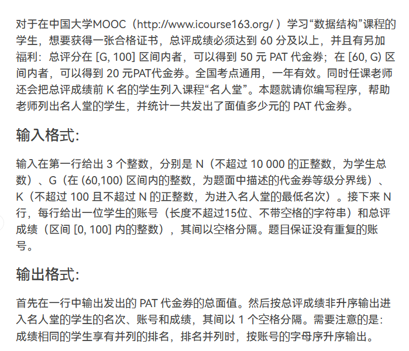

题目思路：

题目代码：

```
// 这一题是一个简单的结构体自定义排序，但是要解决一个输出前k名(有可能并列)的问题
       我们的解决方法是在排序完成之后重新遍历一次list数组，如果当前的人的成绩等于前一个人，那么我们就让当前的人的排名等于前一个人，如果不等于，他的成绩就等于他的下标加一。当然,在此之前，我们把第一个人的排名等于一
           
           
//    for(int i=0;rank[i]<=k&&i<n;i++){
#include<bits/stdc++.h>
#define N 10005
using namespace std;
#define inf 0x3f3f3f3f

int n,m,k,g,d;
int x,y,z;
vector<int>v[N];
struct node{
    string name;
    int fen;
}stu[N];
bool cmp(node a, node b){
    if(a.fen==b.fen){
        return a.name<b.name;
    }
    return a.fen>b.fen;
}
int main() {
    cin>>n>>g>>k;
    //这个一定要赋予初值0
    int sum=0;
    for(int i=0;i<n;i++){
        cin>>stu[i].name>>stu[i].fen;
        if(stu[i].fen>=g){
            sum=sum+50;
        }else if(stu[i].fen>=60){
            sum=sum+20;
        }
    }
    sort(stu,stu+n,cmp);
    cout<<sum<<endl;
    int rank[N];
    rank[0]=1;
    for(int i=1;i<n;i++){
        if(stu[i].fen==stu[i-1].fen){
            rank[i]=rank[i-1];
        }else{
            rank[i]=i+1;
        }
    }
    //输出的时候要注意。。
    for(int i=0;rank[i]<=k &&i<n;i++){
        cout<<rank[i]<<" "<<stu[i].name<<" "<<stu[i].fen<<endl;
    }
	return 0;
}
```

### 题目来源：Acwing-3601-成绩排序

题目描述：  
 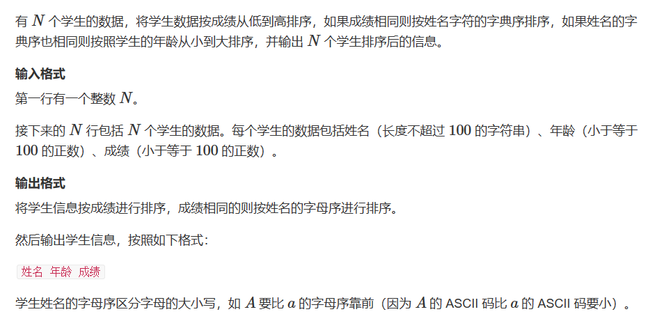

题目思路：

题目代码：

```
//对于N要进行适应性的更改，对于字段错误
#include<bits/stdc++.h>
using namespace std;
#define inf 0x3f3f3f3f
#define N 100100
long long n,m,k,g,d;
long long x,y,z;
char ch;
string str;
vector<int>v[N];
//别带着 typedef
struct node{
    float num;
    string name;
    int  age;

}stu[N];

bool cmp(node a,node b){
    if(a.num!=b.num){
        return a.num<b.num;
    }else if(a.name!=b.name){
        return a.name<b.name;
    }else{
        return a.age<b.age;
    }
}
int main() {
    cin>>n;
    for(int i=0;i<n;i++){
        cin>>stu[i].name>>stu[i].age>>stu[i].num;
    }
    sort(stu,stu+n,cmp);
    for(int i=0;i<n;i++){
        cout<<stu[i].name<<" "<<stu[i].age<<" "<<stu[i].num<<endl;
    }
	return 0;
}
```

### 题目来源：蓝桥杯-2022省赛模拟-运动会

题目描述：

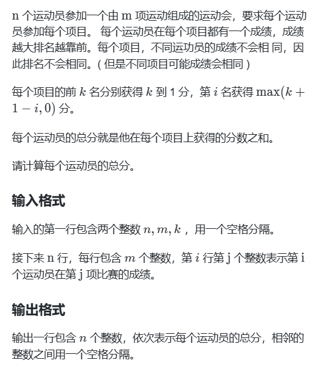

题目思路：


题目代码：

```
#include <bits/stdc++.h>
using namespace std;
int main()
{
    int i,j,n,m,k,cnt,p;
    cin >> n >> m >> k;
    int a[n][m]={},b[n][m]={},c[n]={};
    for(i=0;i<n;i++)
    {
        for(j=0;j<m;j++)
        {
            cin >> a[i][j];
        }
    }
    for(j=0;j<m;j++)
    {
        for(i=0;i<n;i++)
        {
            cnt=n;
            for(p=0;p<n;p++)
            {
                if(a[i][j]>a[p][j])cnt--;
            }
            b[i][j]=cnt;
        }
    }
    for(j=0;j<m;j++)//每个项目 每个人多少分 
    {
        for(i=0;i<n;i++)
        {
            if(b[i][j]<=k)c[i]+=(k+1)-b[i][j];
            else c[i]+=max(k+1-b[i][j],0);
        }
    }
    for(i=0;i<n;i++)
        cout << c[i] << " ";
    return 0;    
}
```

## No.3 结构体设计固定时间间隔模拟模板

### 题目来源：PTA-L1-043 阅览室

题目描述：  
 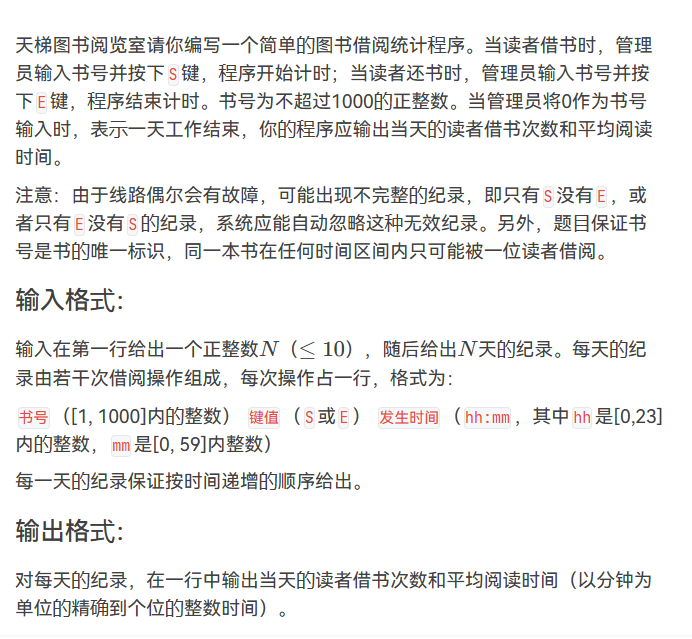

题目思路：

题目代码：

```
//由于线路偶尔会有故障，可能出现不完整的纪录，即只有S没有E，或者只有E没有S的纪录，系统应能自动忽略这种无效纪录。另外，题目保证书号是书的唯一标识，同一本书在任何时间区间内只可能被一位读者借阅。

#include<bits/stdc++.h>
using namespace std;
#define inf 0x3f3f3f3f
#define N 1001
int n,m,k,g,d;
int x,y,z;
char ch;
string str;
vector<int>v[N];
struct node{
    int vis;
    int time;
}book[N];
int main() {
    cin>>n;
    int id;
    char s;
    while(n--){

        int sum=0,sumtime=0;
        while(cin>>id>>s>>x>>ch>>y &&id!=0){
            int t=x*60+y;
            if(s=='S'){
                        //if(!book[id].vis)
                        //连续两次出现可能是中间一个E未记录到，所以直接替换初始时间，就因为这个细节第二个样例过不了
                        //只要出现S，就直接换上去。
                book[id].vis=1;
                book[id].time=t;
            }else{
                if(book[id].vis==1){
                sumtime=sumtime+t-book[id].time;
                book[id].vis=0;
                sum++;
                }
            }
        }
        if(sum==0){
            cout<<"0 0"<<endl;
        }else{
            //cnt=0时直接输出，不能相除，double自动进位，，因为是精确到个位，不是只要整数部分
            cout<<sum<<" "<<(int)(sumtime*1.0/sum*1.0+0.5)<<endl;
        }
    }
	return 0;
}
```

### 题目来源：蓝桥杯-2019省赛-外卖店优先级

题目描述：  
 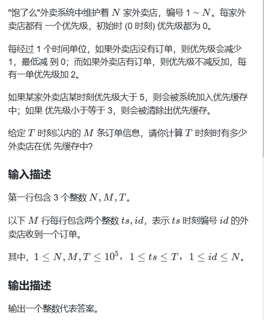

题目思路：


题目代码：

```
#include<cstdio>
#include<algorithm>
using namespace std;
int n,m,t;
struct node{
    int ts;
    int id;
};
int ans;
node arr[100005];
bool cmp(node x,node y)
{
    if(x.id!=y.id)
        return x.id<y.id;
    else
        return x.ts<y.ts;
}
int main()
{
    scanf("%d%d%d",&n,&m,&t);
    for(int i=1;i<=m;i++)
        scanf("%d%d",&arr[i].ts,&arr[i].id);

    sort(arr+1,arr+1+m,cmp);
    for(int i=1;i<=m;)
    {
        int nowid = arr[i].id;
        int weight = 2;
        int isin = false;
        while(arr[++i].id==nowid)
        {
            if(arr[i].ts!=arr[i-1].ts)
                weight -= arr[i].ts - arr[i-1].ts-1;
            if(weight<0)
                weight = 0;
            if(weight<=3) isin = false;
            weight+=2;
            if(weight>5) isin = true;
        }
        if(isin)
        {
          if(t!=arr[i-1].ts)
            weight -= t - arr[i-1].ts;
          if(weight>3)
            ans++;
        } 
    }
    printf("%d",ans);
    return 0;
}
```

## No.4 结构体复杂模拟

### 题目来源：PTA-L2-034 口罩发放

题目描述：  
 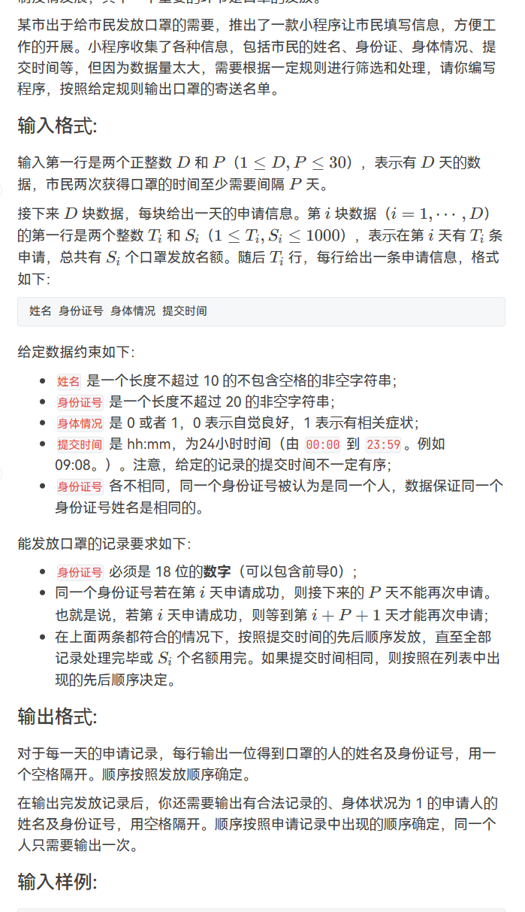

题目思路：

题目代码：

```
//就算是flag=0 的也可以申请；；
#include<bits/stdc++.h>
using namespace std;
#define inf 0x3f3f3f3f
#define N 1005
int n,m,k,g,d;
int x,y,z;
char ch;
string str;
vector<int>v[N];
struct node{
    string id,name;
    int hh;
    int mm;
    int time;
    int flag;
    int cixu;
}stu[N];
bool cmp(node a,node b){
    if(a.time!=b.time){
       return a.time<b.time;
    }
    return a.cixu<b.cixu;
}
int main() {
    int p,sum;
    map<string,int>day;
    cin>>d>>p;
    vector<node>vv;
    vector<node>ww;
    for(int i=1;i<=d;i++){
        vv.clear();
        cin>>k>>sum;
        for(int j=1;j<=k;j++){
            int flag=0;
            cin>>stu[j].name>>stu[j].id>>stu[j].flag>>stu[j].hh>>ch>>stu[j].mm;
            stu[j].cixu=j;
            stu[j].time=stu[j].hh*60+stu[j].mm;
            for(auto l:stu[j].id){
                if(l<'0'||l>'9')flag=1;
            }
            if(stu[j].id.size()==18 && flag==0){
                vv.push_back(stu[j]);
                ww.push_back(stu[j]);
            }           
        }
        sort(vv.begin(),vv.end(),cmp);
        for(auto n:vv){
            if(day[n.id]<=i &&sum>0){
                day[n.id]=i+p+1;
                cout<<n.name<<" "<<n.id<<endl;
                sum--;
            }
        }
    }
    map<string,int>vis;
    for(auto n:ww){
        if(n.flag==1 &&vis[n.id]==0){
            cout<<n.name<<" "<<n.id<<endl;
            vis[n.id]=1;
        }
    }

	return 0;
}
```

### 题目来源：RoboCom-2022-RC-u2 智能服药助手

题目描述：  
 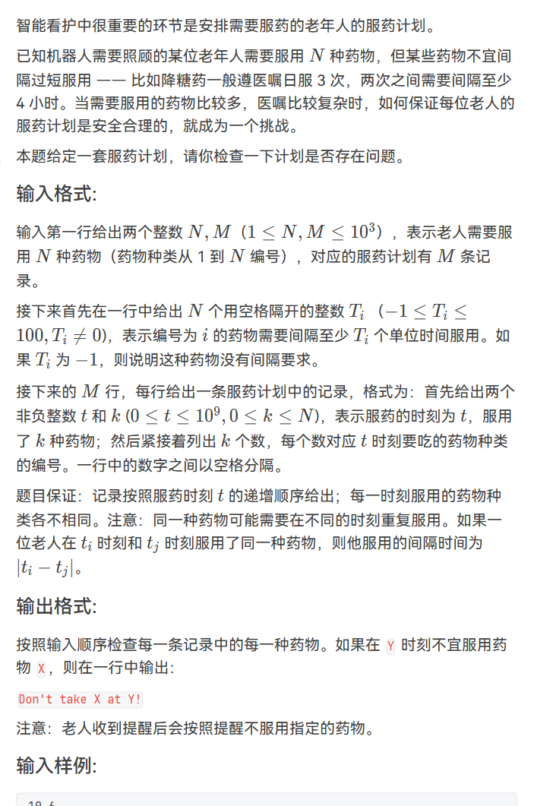

题目思路：

> 巧妙的利用tt

题目代码：

```
#include <bits/stdc++.h>
using namespace std;
#define N 100010
#define inf 0x3f3f3f3f
#define debug(x) cout<<#x<<" = "<<x<<endl;
#define LL long long
int n,m,k,d,g;
int x,y,z;
string str;
char ch;
vector<int>v[N];

stack<int>a,b;
int total=0;
int st[N];


map<int,int>tt;
map<int,int>jiange;
int main()
{
    cin>>n>>m;
    for(int i=1;i<=n;i++)
    {
        tt[i]=0;
        cin>>x;
        if(x!=-1){
            jiange[i]=x;
        }else{
            jiange[i]=0;
        }
    }
    int st;
    for(int i=1;i<=m;i++){
        cin>>st>>k;
        for(int j=1;j<=k;j++){
            cin>>x;
            if(tt[x]<=st){//可以吃，更新状态
                tt[x]=st+jiange[x];
            }else{//不可以吃
                cout<<"Don't take "<<x<<" at "<<st<<"!"<<endl;
            }
        }
    }


    return 0;
}
```
