#### 目录

- [知识框架](#_2)
- [No.0 筑基](#No0__3)
- [No.1 辗转除法相除转换模拟数学因子分解](#No1__9)
- - [题目来源：PTA-L1-006 连续因子](#PTAL1006__10)
  - [题目来源：Acwing-4484-有限小数](#Acwing4484_71)
  - [题目来源：Acwing-4486-数字操作](#Acwing4486_127)
  - [题目来源：蓝桥杯-第九届-乘积尾零](#_204)
  - [题目来源：蓝桥杯-第十四届模拟-第二期 最小的2022](#__2022_250)
  - [题目来源：蓝桥杯-2019省赛-求值](#2019_280)
  - [题目来源：LeetCode-507-完美数](#LeetCode507_316)
- [No.2 素数知识数学](#No2__345)
- - [题目来源：PTA-L1-028 判断素数](#PTAL1028__349)
- [No.3 数学进制问题](#No3__400)
- - [题目来源：PTA-L1-050 倒数第N个字符串](#PTAL1050_N_402)
  - [题目来源：LeetCode-504-七进制数](#LeetCode504_446)
  - [题目来源：LeetCode-1009. 十进制整数的反码](#LeetCode1009__484)
- [No.4 除法模拟计算过程](#No4__524)
- - [题目来源：PTA-L1-046 整除光棍](#PTAL1046__526)
  - [题目来源：PTA-L2-018 多项式A除以B](#PTAL2018_AB_581)
- [No.5 分数计算gcd，lcm模拟](#No5_gcdlcm_669)
- - [题目来源：PTA-L1-009 N个数求和](#PTAL1009_N_670)
- [No.6 记录次数数据循环模拟](#No6__718)
- - [题目来源：PTA-L1-019 谁先倒](#PTAL1019__721)
  - [题目来源：PTA-L1-023 输出GPLT](#PTAL1023_GPLT_774)
  - [题目来源：PTA-L1-035 情人节](#PTAL1035__831)
  - [题目来源：PTA-L1-044 稳赢](#PTAL1044__874)
  - [题目来源：PTA-L1-070 吃火锅](#PTAL1070__923)
  - [题目来源：PTA-L1-078 吉老师的回归](#PTAL1078__966)
  - [题目来源：Acwing-4501-收集卡牌](#Acwing4501_1017)
  - [题目来源：蓝桥杯-2016省赛-赢球票](#2016_1104)
- [No.7 数组全排列](#No7__1183)
- - [题目来源：蓝桥杯-第六届- 三羊献瑞](#__1184)
  - [题目来源：蓝桥杯-第九届-递增三元组](#_1237)
  - [题目来源：蓝桥杯-2011国赛-组合数问题](#2011_1281)
  - [题目来源：蓝桥杯-2012省赛-古堡算式](#2012_1309)
  - [题目来源：蓝桥杯-2014省赛-排列序数](#2014_1358)
  - [题目来源：蓝桥杯-2014省赛-李白打酒](#2014_1395)
  - [题目来源：蓝桥杯-2014省赛-扑克序列](#2014_1437)
  - [题目来源：蓝桥杯-2016省赛-随意组合](#2016_1475)
  - [题目来源：LeetCode-31-下一个排列](#LeetCode31_1511)
- [No.8 方程式求解](#No8__1541)
- - [题目来源：蓝桥杯-第七届-一步之遥](#_1542)
- [No.9 平面坐标综合](#No9__1583)
- - [题目来源：LeetCode-657-机器人能否返回原点](#LeetCode657_1586)
  - [题目来源：LeetCode-463-岛屿的周长](#LeetCode463_1619)
  - [题目来源：LeetCode-59-螺旋矩阵 II](#LeetCode59_II_1655)
  - [题目来源：蓝桥杯-第九届-螺旋折线](#_1665)
  - [题目来源：蓝桥杯-第十四届模拟- 信号覆盖](#__1673)
  - [题目来源：蓝桥杯-2011省赛模拟-上三角矩阵](#2011_1726)
  - [题目来源：蓝桥杯-2022省赛模拟-矩阵拼接](#2022_1789)
  - [题目来源：蓝桥杯-2012省赛-机器人行走](#2012_1805)
- [No.10 等差数列](#No10__1878)
- - [题目来源：蓝桥杯-第十届-等差数列](#_1879)
- [No.11 小数点精度问题](#No11__1912)
- - [题目来源：蓝桥杯-2012省赛-鲁卡斯队列](#2012_1915)
  - [题目来源：蓝桥杯-2017省赛-小数第n位](#2017n_1947)
- [No.12 后缀表达式](#No12__1991)
- - [题目来源：蓝桥杯-第十届-后缀表达式](#_1992)
- [No.13 数字循环处理即模拟余数使用](#No13__2001)
- - [题目来源：LeetCode-1015. 可被 K 整除的最小整数](#LeetCode1015__K__2004)
  - [题目来源：PTA-L2-029 特立独行的幸福](#PTAL2029__2048)
  - [题目来源：Acwing-3559-围圈报数](#Acwing3559_2126)
  - [题目来源：蓝桥杯-2018省赛-倍数问题](#2018_2176)
- [No.14 数值末尾处理](#No14__2238)
- - [题目来源：PTA-L1-080 乘法口诀数列](#PTAL1080__2240)
  - [题目来源：Acwing-4520-质数](#Acwing4520_2286)
  - [题目来源：Acwing-2074- 倒计数](#Acwing2074__2332)
  - [题目来源：Acwing-4426-整除子串](#Acwing4426_2388)
  - [题目来源：Acwing-4949-末尾连续0](#Acwing49490_2429)
  - [题目来源：蓝桥杯-数列求值](#_2464)
  - [题目来源：蓝桥杯-2015省赛-循环节长度](#2015_2489)
  - [题目来源：蓝桥杯-2016省赛-平方末尾](#2016_2530)
- [No.15 超大数据存储运算](#No15__2564)
- - [题目来源：LeetCode-7. 整数反转](#LeetCode7__2566)
  - [题目来源：Acwing-3596-a+b](#Acwing3596ab_2604)
  - [题目来源：Acwing-4425-改变数字](#Acwing4425_2652)
  - [题目来源：Acwing-4948. 大乘积](#Acwing4948__2705)
  - [题目来源：Acwing-791. 高精度加法](#Acwing791__2770)
  - [题目来源：Acwing-792. 高精度减法](#Acwing792__2825)
  - [题目来源：Acwing-793.高精度乘法](#Acwing793_2893)
  - [题目来源：Acwing-794. 高精度除法](#Acwing794__2950)
  - [题目来源：蓝桥杯-2011年国赛-最小公倍数(大数)](#2011_3006)
  - [题目来源：蓝桥杯-2013省赛-](#2013_3071)
  - [题目来源：蓝桥杯-2016省赛-阶乘位数](#2016_3108)
- [No.16 字符矩阵](#No16__3139)
- - [题目来源：蓝桥杯-2011国赛- 有理数的循环节](#2011__3141)
- [No.17 几何凸包](#No17__3222)
- - [题目来源：PTA-L3-029 还原文件](#PTAL3029__3223)
- [No.18 树状数组](#No18__3355)
- - [题目来源：蓝桥杯-第十四届模拟-第二期 最小交换](#___3356)
  - [题目来源：蓝桥杯-2014省赛-小朋友排队](#2014_3367)
- [No.n 其它](#Non__3426)
- - [题目来源：Acwing-4268-性感素数](#Acwing4268_3432)
  - [题目来源：Acwing-4461-范围分区](#Acwing4461_3479)
  - [题目来源：Acwing-3307-破纪录者](#Acwing3307_3549)
  - [题目来源：蓝桥杯-四平方和](#_3607)
  - [题目来源：蓝桥杯-2022省赛模拟-平方和拆分](#2022_3653)
  - [题目来源：蓝桥杯-2013省赛-幸运数](#2013_3694)
  - [题目来源：蓝桥杯-2014省赛-蚂蚁感冒](#2014_3738)
  - [题目来源：蓝桥杯-2019省赛-最大降雨量](#2019_3778)

## 知识框架

## No.0 筑基

> 请先学习下知识点，道友！  
>  题目知识点大部分来源于此：[代码随想录：数组](https://www.programmercarl.com/%E6%95%B0%E7%BB%84%E7%90%86%E8%AE%BA%E5%9F%BA%E7%A1%80.html)

## No.1 辗转除法相除转换模拟数学因子分解

### 题目来源：PTA-L1-006 连续因子

题目描述：  
 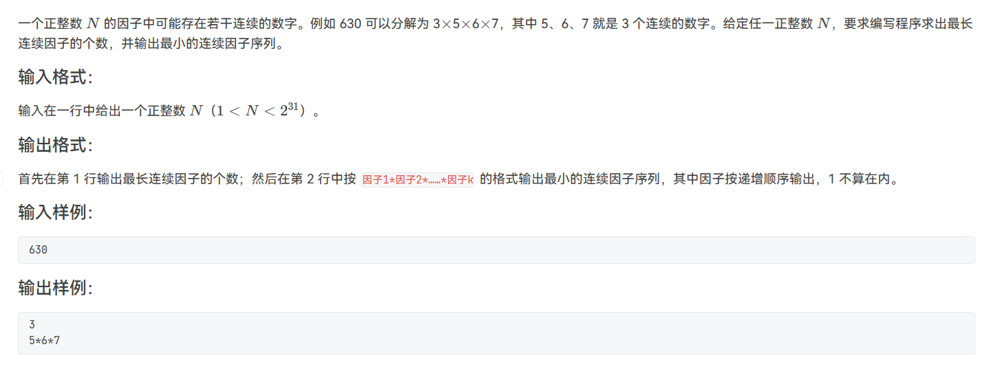

题目思路：


题目代码：

```
    //只是找其中部分因子是连续的        //这里只有count在这循环为0
//注意要注意那个 输出为1，即没有连续因子的状况！！！！！
//对于N要进行适应性的更改，对于字段错误
#include<bits/stdc++.h>
using namespace std;
#define inf 0x3f3f3f3f
#define N 100100
int n,m,k,g,d;
int x,y,z;
char ch;
string str;
vector<int>v[N];

int main() {
    int start=0,maxx=0,count=0;
    cin>>n;
    for(int i=2;i<=sqrt(n);i++){
        int cur=n;
        count=0;
        int j=i;
        while(cur%j==0){
            count++;
            cur=cur/j;
            j++;
        }
        if(count>maxx){
            maxx=count;
            start=i;
        }
    }
    if(maxx==0){
        cout<<"1"<<endl;
        cout<<n<<endl;
    }else{
        cout<<maxx<<endl;
        for(int i=0;i<maxx;i++){
            if(i==0)cout<<start+i;
            else cout<<"*"<<start+i;
        }
    }
	return 0;
}
```

### 题目来源：Acwing-4484-有限小数

题目描述：

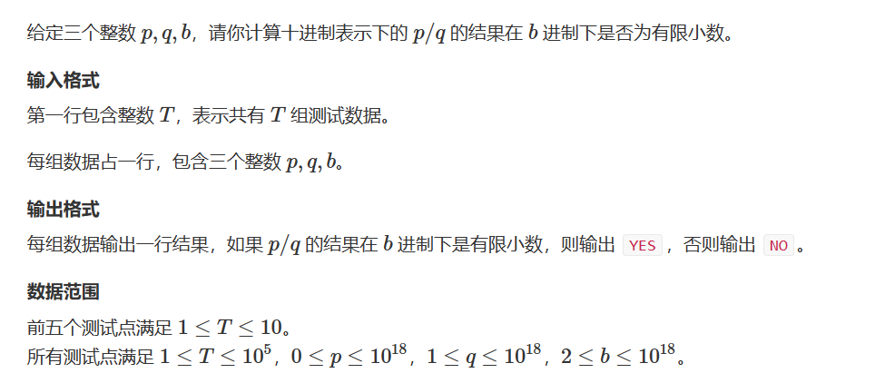

题目思路：

> 首先先化简即先求p与q 的最大公约；然后因为主要是看小数部分；  
>  即直接化为最简分子分母；也就是小数部分；；然后乘以进制b；；一直乘以看是否为整数；；  
>  所以 分子/分母*b^k 所以就是看  
>  必须用最大公因数去约分；；比如b=21 好多不能用除以21 但是21=3*7 可以约分；

题目代码：

```
首先先化简即先求p与q 的最大公约；然后因为主要是看小数部分；
    即直接化为最简分子分母；也就是小数部分；；然后乘以进制b；；一直乘以看是否为整数；；
    所以 分子/分母*b^k   所以就是看
    
    
    
    必须用最大公因数去约分；；比如b=21   好多不能用除以21   但是21=3*7  可以约分；
#include<iostream>
#include<cstring>
using namespace std;
#define int long long
int gcd(int a, int b)
{
    return b ? gcd(b, a % b) : a;
}
signed main()
{
    int t; scanf("%lld", &t);
    while(t --)
    {
        int p, q, b; scanf("%lld %lld %lld", &p, &q, &b);
        int d = gcd(p, q);
        q /= d;
        while(q > 1){
            int d = gcd(q, b);
            if(d == 1) break;
            while(q % d == 0) q /= d;
        }
        if(q > 1) puts("NO");
        else puts("YES");
    }
}
```

### 题目来源：Acwing-4486-数字操作

题目描述：  
 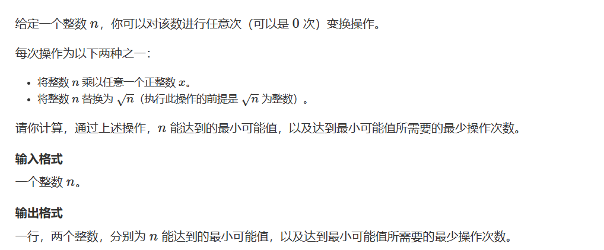

题目思路：

> 第二种：将一个数字进行质因子分解；；开一次方就是将各个质因子的指数➗2；所以第一步是要将各个的指数变为2的指数，因为不要求求要乘以的数字x，即如果输入的数字是目标形式直接连续开，如果不是，那就成个x，

题目代码：

```
#include <iostream>
#include <cstring>
#include <algorithm>
#include <cmath>

using namespace std;

const int MaxV=1E6+10;

int num,step;
int d[MaxV];                        //d[i]记录质因数i的指数

int Init()                          //先分解质因数
{
    int t=num,maxn=sqrt(t),maxc=-1;
    for(int i=2;i<=maxn;i++)
    {
        while(t%i==0)
        {
            t/=i;
            d[i]++;
            maxc=max(maxc,d[i]);
        }
    }
    //最后一个质因子；；
    if(t>1)
    {
        d[t]++;
        maxc=max(maxc,d[t]);
    }
    return maxc;                    //取所有因数的最大值
}

int main()
{
    int maxc;
    long long t=1;                  //记录所有质因数的乘积(不包括幂)
    cin>>num;
    maxc=Init();
    int i=0,sum2=0;
    while(maxc>pow(2,i))i++;        //寻找最小的2^n>=maxc
    int l=i;                        //记录结果
    for(int i=1;i<=num;i++)
    {
        if(d[i])
        {
            t*=i;                   //记录所有质因数的乘积
            sum2+=pow(2,l)-d[i];    //对(不用乘)的数字的特殊处理,即直接开根号
        }
    }
    if(sum2==0||i==0)               //特殊情况,直接开根号
    {
        cout<<t<<" "<<i<<endl;
    }
    else
    {
        cout<<t<<" "<<i+1<<endl;    //正常情况,先乘一次,再开根号
    }
    return 0;
}
```

### 题目来源：蓝桥杯-第九届-乘积尾零

题目描述：  
 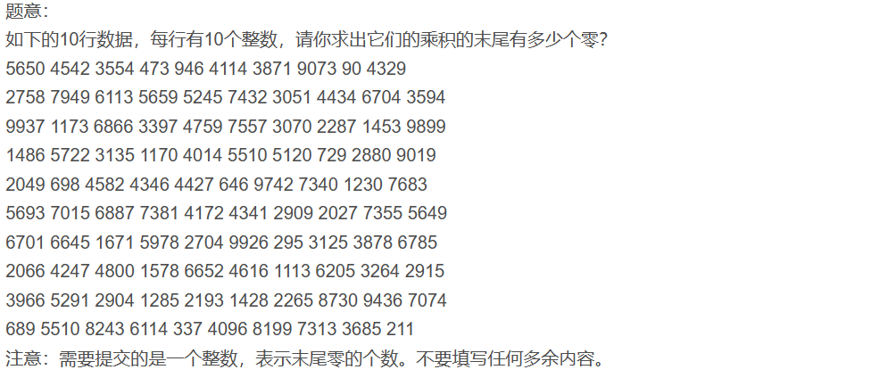

题目思路：

> 所有数相乘，可以转变为他们的因子相乘。我们知道0的来源是2和5相乘，所以我们只需要记录每个数的2和5的因子的个数。然后取2和5的最小值。即为所求0的个数。

题目代码：

```
//对于N要进行适应性的更改，对于字段错误
#include<bits/stdc++.h>
using namespace std;
#define inf 0x3f3f3f3f
#define N 100100
#define mod 1000000007
long long n;
long long f[N];
long long res;
int m,k,g,d;
int x,y,z,t;
char ch;
string str;
vector<int>v[N];
int main() {
	
	int num2=0,num5=0;
	for(int i=1;i<=100;i++){
		cin>>x;
		while(x%5==0){
			num5++;
			x=x/5;
		}
		while(x%2==0){
			num2++;
			x=x/2;
		}
	}
	int res= min(num2,num5);
	cout<<res<<endl;
	
	return 0;
}
```

### 题目来源：蓝桥杯-第十四届模拟-第二期 最小的2022

题目描述：  
 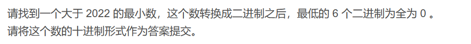

题目思路：

> 二进制后六位为 0，则该数字是 64 的倍数

题目代码：

```
// 答案 2048
#include <bits/stdc++.h>
using namespace std;

bool check(int x) {
    return (x & 63) == 0;
}

int main() {
    int x = 2023;
    while (!check(x)) {
    	x ++;
    }
    cout << x << endl;
    return 0;
}
```

### 题目来源：蓝桥杯-2019省赛-求值

题目描述：  
 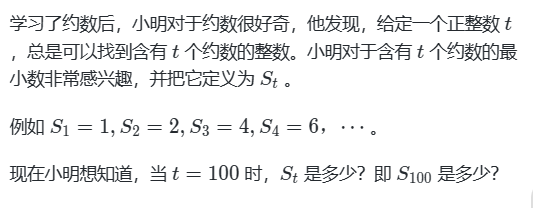

题目思路：


题目代码：

```
#include <iostream>
#include <math.h>
using namespace std;
int main()
{
  int t,x;
  for (int i=1;t<=100;i++)
  {
    t=1;
    for (int j=1;j<=sqrt (i);j++)
    {
      if (i%j)
        t++;
    }
    x=i;
  }
  printf ("%d",x);
  return 0;
}
```

### 题目来源：LeetCode-507-完美数

题目描述：  
 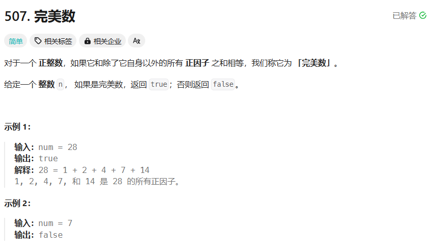

题目思路：

> 简单题

题目代码：

```
class Solution {
public:
    bool checkPerfectNumber(int num) {
        int sum = 0;
        for(int i = 1; i < num;i++){
            if(num % i ==0){
                sum += i;
            }
        }
        if(num == sum)return true;
        else return false;
    }
};
```

## No.2 素数知识数学

### 题目来源：PTA-L1-028 判断素数

题目描述：  
 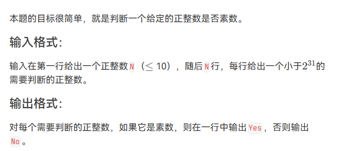

题目思路：


题目代码：

```
#include <bits/stdc++.h>

using namespace std;
int check(int q){
    if(q<=1){
        return 0;
    }
    for(int i=2;i<=sqrt(q);i++){
        if(q%i==0){
            return 0;
        }
    }
    return 1;
}
int main()
{

    int n;
    cin>>n;
     int tem=0;
    int arr[n];
    for(int i=0;i<n;i++){
        cin>>arr[i];
        tem=arr[i];
        if(check(tem)){
            cout<<"Yes"<<endl;
        }else{
            cout<<"No"<<endl;
        }
    }


        return 0;
}
```

## No.3 数学进制问题

### 题目来源：PTA-L1-050 倒数第N个字符串

题目描述：  
 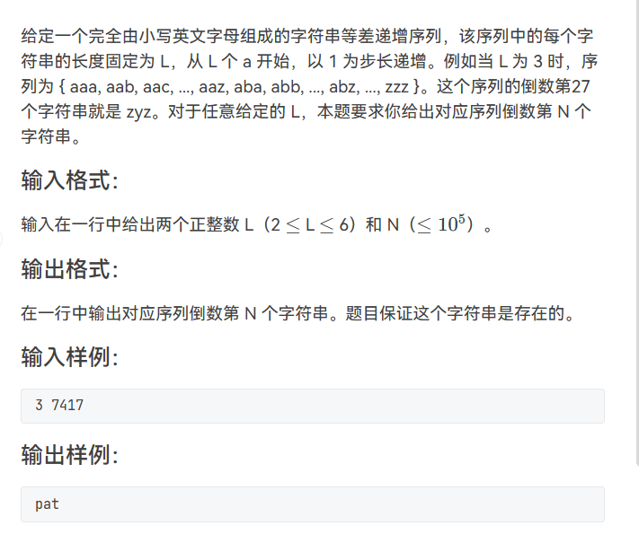

题目思路：


题目代码：

```
#include <bits/stdc++.h>
using namespace std;
string str;
char ch;
#define N 100100
#define inf 0x3f3f3f3f
int n,m,k,s,d;
int x,y,z;
vector<int>v[N];


int main()
{
    int l;
    cin>>l>>n;
    int cur=pow(26,l)-n;
    vector<int>ans;
    while(l--){
        ans.push_back(cur%26);
        cur=cur/26;
    }
    for(int i=ans.size()-1;i>=0;i--){
        cout<<(char)('a'+ans[i]);
    }
    
    return 0;
}
```

### 题目来源：LeetCode-504-七进制数

题目描述：  
 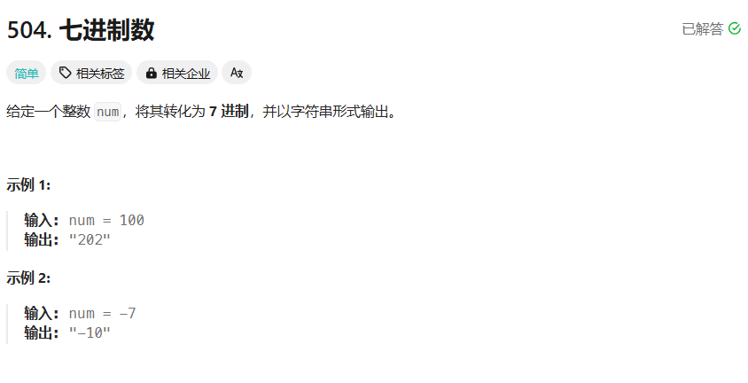

题目思路：

> 简单题目；进制的问题  
>  分情况看，先是判断是否为0 ；  
>  然后是 小于0，  
>  正常的大于0

题目代码：

```
class Solution {
public:
    string convertToBase7(int num) {
        if(num == 0) return "0";
        string res;
        string s1 = "";
        if(num < 0){
            num = abs(num);
            s1 = "-";
        }

        while(num){
            res = to_string(num % 7) + res;
            num = num/7;
        }
        res = s1+res;
        return res;
    }
};
```

### 题目来源：LeetCode-1009. 十进制整数的反码

题目描述：

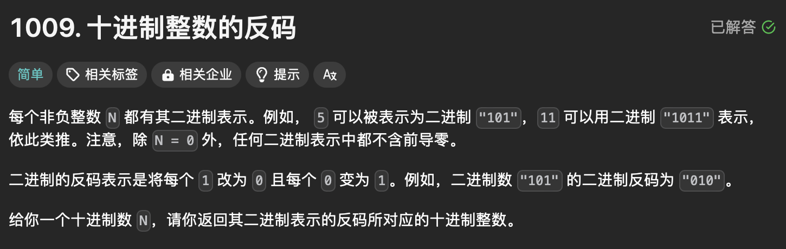

题目思路：


题目代码：

```
class Solution {
public:
    int bitwiseComplement(int n) {
        /// 先特殊处理下0
        if(n==0)return 1;

        vector<int>mod;
        // 先获取其二进制
        while(n>0)
        {
            mod.push_back(1 - (n%2));
            n = n / 2;
        }
        int res = 0;
        for(int i = 0; i < mod.size(); i++)
        {
            res += mod[i] * pow(2,i);
        }
        return res;
        
    }
};
```

## No.4 除法模拟计算过程

### 题目来源：PTA-L1-046 整除光棍

题目描述：

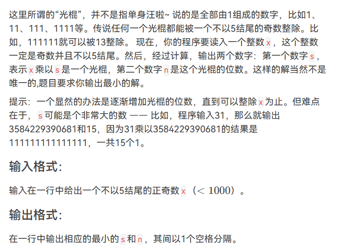

题目思路：

> 模拟手动计算除法

题目代码：

```
#include <bits/stdc++.h>
using namespace std;
string str;
char ch;
#define N 100100
#define inf 0x3f3f3f3f
int n,m,k,s,d;
int x,y,z;
vector<int>v[N];


int main()
{
    cin>>n;
    int ans=0,count=0;
    while(ans<n){
        ans=ans*10+1;
        count++;
    }
    
    while(1){
        cout<<ans/n;
        ans=ans%n;
        
        if(ans==0)break;
        
        ans=ans*10+1;
        count++;
    }
    cout<<" "<<count<<endl;
    
    
    
    
    
    return 0;
}
```

### 题目来源：PTA-L2-018 多项式A除以B

题目描述：  
 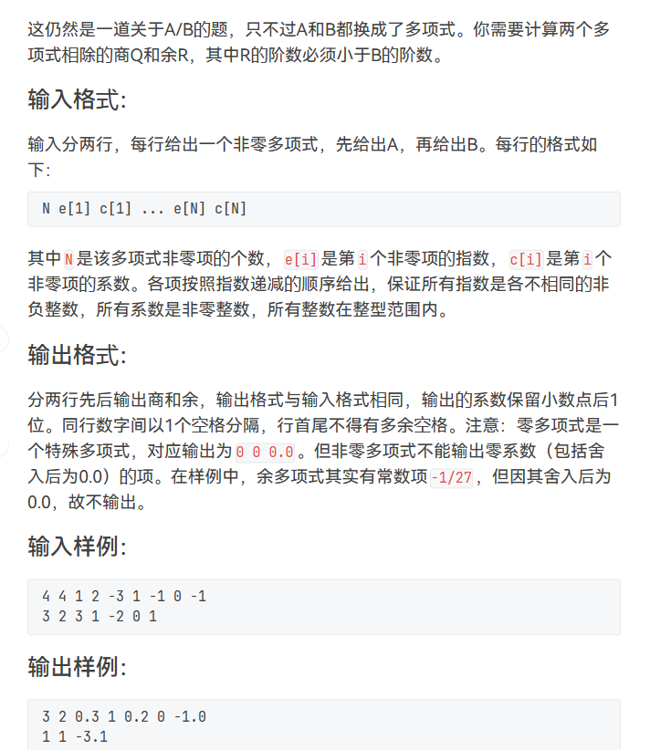

题目思路：

题目代码：

```
定义两个数组：a,b，分别表示多项式A和多项式B；

两个数组的下标表示指数，数组值代表系数；所以要定义double类型

并求出两个多项式中最大指数index1和index2；

在进行每一次除法之后，商的最高次幂是(max1-max2)，最高次幂的系数是（a[index1]/b[index2]）；

然后继续循环，并更新a，直至被除数的最高次幂小于除数；

    
#include<bits/stdc++.h>
using namespace std;
#define inf 0x3f3f3f3f
#define N 100100
int n,m,k,g,d;
int x,y,z;
char ch;
string str;
vector<int>v[N];
void pout(double arr[],int x)
{
	int num=0;
	for(int i=0;i<=x;i++){
        //因为保留一位小数，所以+0.05与0.1比较
        if(abs(arr[i])+0.05>=0.1)num++;
    }
    cout<<num;
    if(num==0){
        cout<<" 0 0.0";
    }else{
        for(int i=x;i>=0;i--){
            if(abs(arr[i])+0.05>=0.1){
                cout<<" "<<i;
                printf(" %.1f",arr[i]);
            }
        }
    }
}
int main()
{
    
    double a[N],b[N],c[N];
	int index1=-1,index2=-1;//两个多项式的最大指数 
    cin>>n;
	for(int i=1;i<=n;i++)
	{
        cin>>x;
        cin>>a[x];
		if(x>index1)index1=x;
	}
	cin>>m;
	for(int i=1;i<=m;i++)
	{
        cin>>x;
        cin>>b[x];
		if(x>index2)index2=x;
	}
	int temp=index1-index2;//商的最大指数
	
	while(index1>=index2)//中余数的阶数必须小于除数的阶数。
	{
		double q=a[index1]/b[index2];//cout<<index1<<" "<<index2<<" "<<q<<endl;
		c[index1-index2]=q;
		for(int i=index1,j=index2;i>=0&&j>=0;i--,j--)
		{
			a[i]-=b[j]*q;
		}
		while(a[index1]==0)index1--;//系数为0 
	} 
	pout(c,temp);
    cout<<endl;
	pout(a,index1);
	return 0;
}
```

## No.5 分数计算gcd，lcm模拟

### 题目来源：PTA-L1-009 N个数求和

题目描述：  
 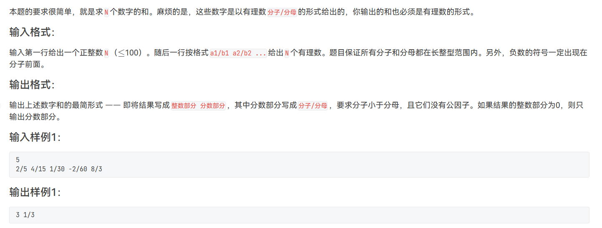

题目思路：

> 注意分情况的东西；

题目代码：

```
//对于N要进行适应性的更改，对于字段错误
#include<bits/stdc++.h>
using namespace std;
#define inf 0x3f3f3f3f
#define N 100100
int n,m,k,g,d;
int x,y,z;
char ch;
string str;
vector<int>v[N];
int gcd(int x,int y){
    if(y==0)return x;
    return gcd(y,x%y);
}
int main() {
    cin>>n;
    int fenzi,fenmu;
    cin>>fenzi>>ch>>fenmu;
    for(int i=1;i<n;i++){
        cin>>x>>ch>>y;
        fenzi=fenzi*y+fenmu*x;
        fenmu=fenmu*y;
        int yue=gcd(fenzi,fenmu);
        fenzi=fenzi/yue;
        fenmu=fenmu/yue;
    }
    if(fenzi%fenmu==0){
        cout<<fenzi/fenmu<<endl;
    }else if(fenzi<fenmu){
        cout<<fenzi<<"/"<<fenmu<<endl;
    }else if(fenzi>fenmu){
        cout<<fenzi/fenmu<<" "<<fenzi%fenmu<<"/"<<fenmu<<endl;
    }

	return 0;
}
```

## No.6 记录次数数据循环模拟

### 题目来源：PTA-L1-019 谁先倒

题目描述：  
 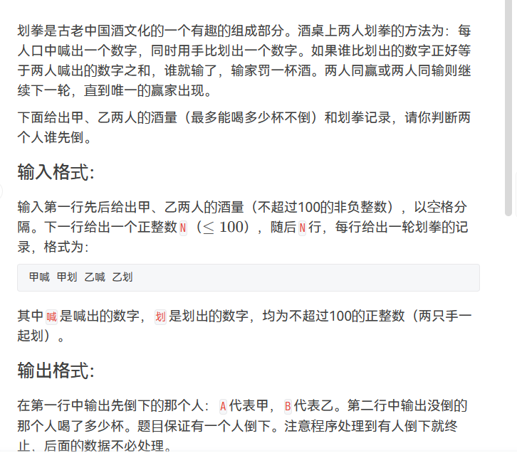

题目思路：

题目代码：

```
 注意通赢的时候都不喝
//注意第二个输出的是已经喝了多少了
#include<bits/stdc++.h>
using namespace std;

int main(){
    int n,m,k;
    int amax,bmax,a=0,b=0;
    int ahua,ahan,bhua,bhan;
    cin>>amax>>bmax;
    cin>>n;
    while(n--){
        cin>>ahan>>ahua>>bhan>>bhua;

        if(ahua==ahan+bhan){
            a++;
        }
        if(bhua==ahan+bhan){
            b++;
        }
        if(ahua==ahan+bhan && bhua==ahan+bhan){
            a--;
            b--;
        }

        if(amax-a<0){
            cout<<"A"<<endl;
            cout<<b<<endl;
            break;
        }
        if(bmax-b<0){
            cout<<"B"<<endl;
            cout<<a<<endl;
            break;
        }
    }

return 0;
}
```

### 题目来源：PTA-L1-023 输出GPLT

题目描述：  
 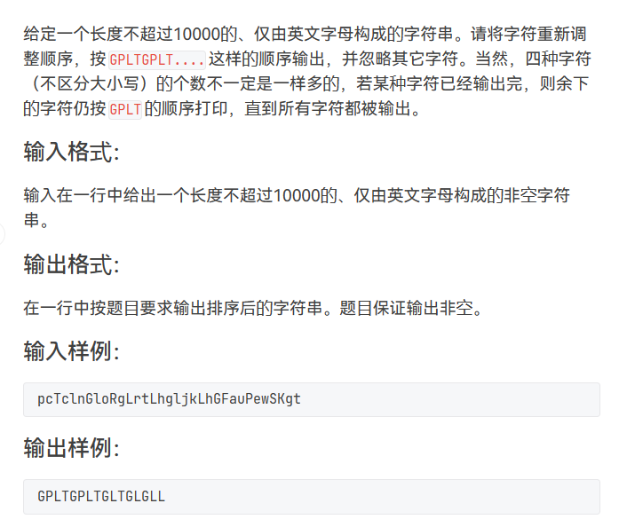

题目思路：

题目代码：

```
#include<bits/stdc++.h>
using namespace std;
#define inf 0x3f3f3f3f
#define N 10010
int n,m,k,g,d;
int x,y,z;
char ch;
vector<int>v[N];

int main() {
    string str;
    cin>>str;
    int pnum=0,gnum=0,lnum=0,tnum=0;
    for(auto i:str){
        if(i=='p' || i=='P')pnum++;
        if(i=='g' || i=='G')gnum++;
        if(i=='l' ||i=='L')lnum++;
        if(i=='t' || i=='T')tnum++;
    }
    int maxx=max({lnum,tnum,gnum,pnum});
    for(int i=1;i<=maxx;i++){
        if(gnum>0){
            cout<<"G";
            gnum--;
        }
        if(pnum>0){
            cout<<"P";
            pnum--;
        }
        if(lnum>0){
            cout<<"L";
            lnum--;
        }
        if(tnum>0){
            cout<<"T";
            tnum--;
        }
    }

    
	return 0;
}
```

### 题目来源：PTA-L1-035 情人节

题目描述：  
 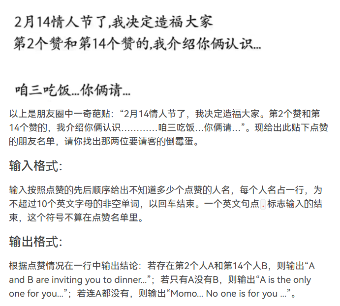

题目思路：

题目代码：

```
#include<bits/stdc++.h>
using namespace std;
#define inf 0x3f3f3f3f
#define N 10010
int n,m,k,g,d;
int x,y,z;
char ch;
string str;
vector<int>v[N];

int main() {
    
    vector<string>ans;
    for(int i=1; ;i++){
        cin>>str;
        if(str=="."){
            break;
        }
        ans.push_back(str);
    }
    int num=ans.size();
    if(num<2){
        cout<<"Momo... No one is for you ..."<<endl;
    }else if(num<14){
        cout<<ans[1]<<" is the only one for you..."<<endl;
    }else{
        cout<<ans[1]<<" and "<<ans[13]<<" are inviting you to dinner..."<<endl;
    }
	return 0;
}
```

### 题目来源：PTA-L1-044 稳赢

题目描述：  
 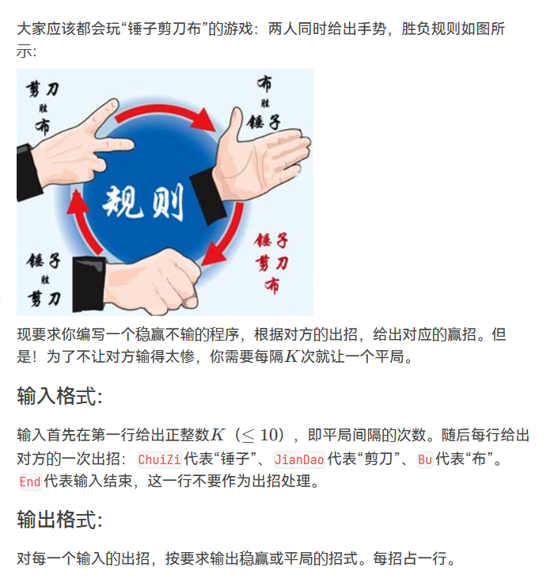

题目思路：

题目代码：

```
#include<bits/stdc++.h>
using namespace std;
#define inf 0x3f3f3f3f
#define N 100100
int n,m,k,g,d;
int x,y,z;
char ch;
string str;
vector<int>v[N];

int main() {
    cin>>k;
    for(int i=1; ;i++){
        cin>>str;
        if(str=="End"){
            break;
        }
        if(i%(k+1)==0){
            cout<<str<<endl;
            continue;
        }else{
        if(str=="ChuiZi"){
            cout<<"Bu"<<endl;
        }else if(str=="Bu"){
            cout<<"JianDao"<<endl;
        }else{
            cout<<"ChuiZi"<<endl;
        }
        }
    }


	return 0;
}
```

### 题目来源：PTA-L1-070 吃火锅

题目描述：  
 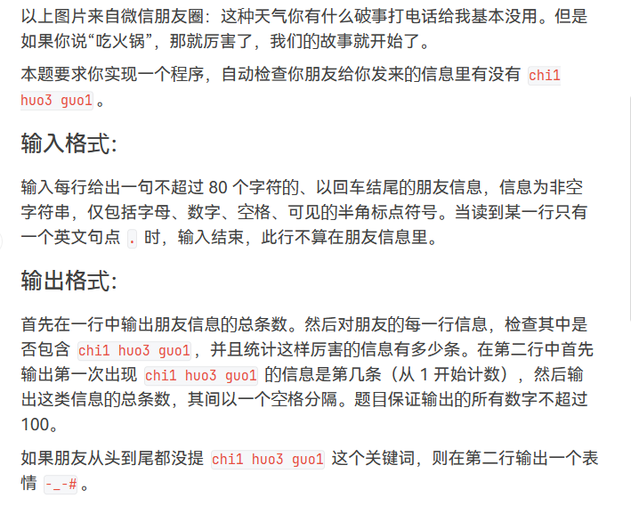

题目思路：

题目代码：

```
#include<bits/stdc++.h>
using namespace std;
#define inf 0x3f3f3f3f
#define N 100100
int n,m,k,g,d;
int x,y,z;
vector<int>v[N];

int main() {
    string str;
    vector<int>ans;
    int zongcount=0;
    for(int i=1; ; i++){
        getline(cin,str);
        if(str=="."){
            break;
        }
        zongcount++;
        if(str.find("chi1 huo3 guo1")!=string::npos){
            ans.push_back(zongcount);
        }
    }
    cout<<zongcount<<endl;
    if(ans.size()){
        cout<<ans[0]<<" "<<ans.size()<<endl;
    }else{
        cout<<"-_-#"<<endl;
    }
	return 0;
}
```

### 题目来源：PTA-L1-078 吉老师的回归

题目描述：  
 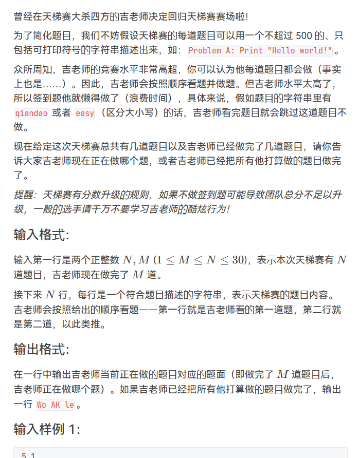

题目思路：

题目代码：

```
// 这个注意点是那个getchar();;

#include<bits/stdc++.h>
using namespace std;
#define inf 0x3f3f3f3f
#define N 100100
int n,m,k,g,d;
int x,y,z;
vector<int>v[N];

int main() {
    cin>>n>>k;
    int cnt=0;
    //这个注意要进行吃回车。。
    getchar();
    for(int i=1;i<=n;i++){
        string str;
        getline(cin,str);
        int ix=str.find("qiandao");
        int iy=str.find("easy");
        if(ix==string::npos && iy==string::npos ){
            cnt++;
        }
        //cnt表示这道题在吉老师的面前是第几道题。
        //老师已经做完了k道题，，所以就是，在老师面前的k道题之前都不需要。
        if(i==n && cnt<=k){
            cout<<"Wo AK le"<<endl;    
        }
        if(cnt>k){
            cout<<str<<endl;
            break;
        }
    }
	return 0;
}
```

### 题目来源：Acwing-4501-收集卡牌

题目描述：  
 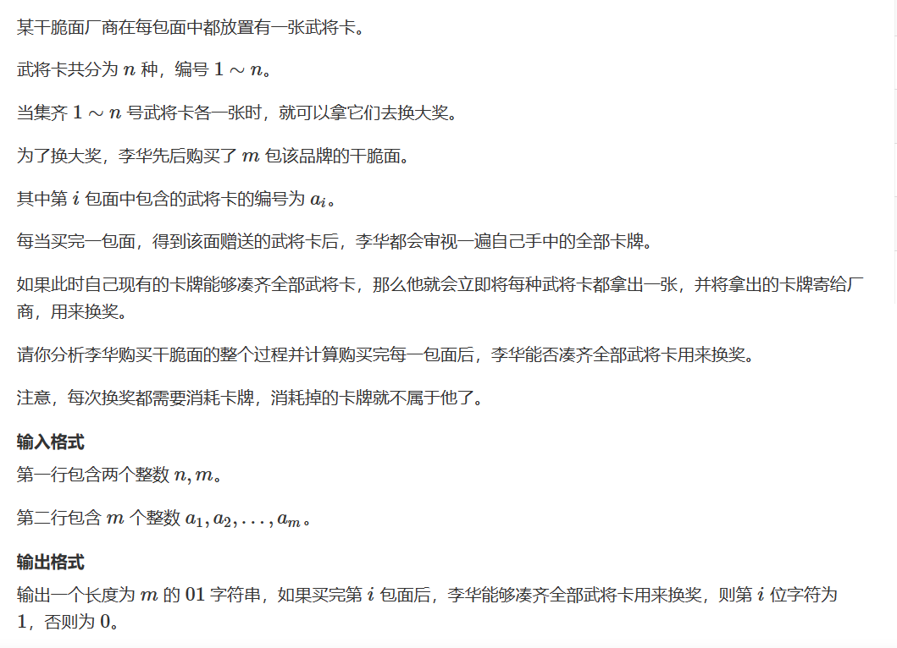

题目思路：


题目代码：

```
//自己的 潮湿的

//对于N要进行适应性的更改，对于字段错误
#include<bits/stdc++.h>
using namespace std;
#define inf 0x3f3f3f3f
#define N 100100
long long n,m,k,g,d,t;
int x,y,z;
char ch;
string str;
vector<int>v[N];

int main() {
	cin>>n>>m;
	map<int,int>mp;
	for(int i=1;i<=n;i++)mp[i]=0;
	while(m--){
		cin>>x;
		mp[x]++;
		int flag=0;
		for(int i=1;i<=n;i++){
			if(mp[i]<=0){
				flag=1;
				break;
			}
		}
		if(flag==1){
			cout<<0;
		}else{
			cout<<1;
			for(int i=1;i<=n;i++)mp[i]--;
		}
	}
	return 0;
}


、、
    未超时的
  用 bb 数组统计卡牌个数，一旦出现前面没有出现的卡牌，计数器 cnt++cnt++，只要 cnt==ncnt==n，就代表着一次卡片集全，输出 11，且将 bb 的每个数组元素减一，若减去后的数组元素等于 00，cnt–cnt–，否则输出 00。（这有两个减号，但不知道为啥被吞了）  

    
#include <bits/stdc++.h>
using namespace std;
int a, b[100010];

int main () {
    int n, m, cnt = 0;
    cin >> n >> m;
    for (int i = 1; i <= m; i++){
        cin >> a;
        b[a] ++;
        if (b[a] == 1) cnt ++;
        //若 a 只出现了这一次，就多了一个从前没出现的数
        if (cnt == n){//所有数都出现过
            cout << 1;
            for (int j = 1; j <= n; j++){
                b[j] --;
                if (b[j] == 0) cnt --;
                //如果这个数用掉了，这个数 j 等于没有出现
            }
        }
        else cout << 0;
    }
    return 0;
}
```

### 题目来源：蓝桥杯-2016省赛-赢球票

题目描述：

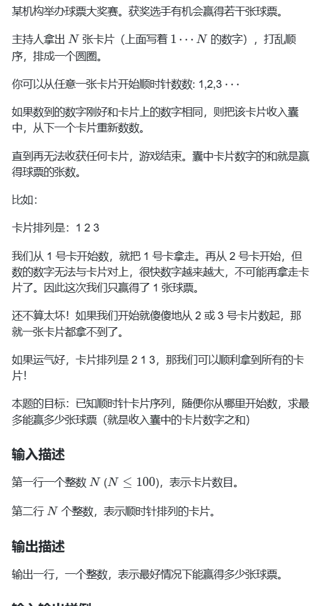

题目思路：


题目代码：

```
#include <iostream>
using namespace std;
int a[101];
int main()
{
  // 请在此输入您的代码
  int n;
  cin >> n;
  int maxn = 0;
  for(int i = 1; i <= n; i++)
  {
    cin>>a[i];
  }
  //遍历从卡片1-N开始的所有可能
  int ans = 0;
  for(int i = 1; i <= n; i++)
  {
    //模拟从i开始时，能拿到的球票数：
    int num = 1;//当前值
    int pos = i;//当前位置
    int res = 0;//球票数
    int flag[101]={0};//是否被取走
    int count = 0;//拿走的卡片数
    while(1)
    {
      //结束条件为:卡片全部被拿走，count==n 或者当前值num大于n，越来越大，
      if(count == n || num > n) break;
      //1. 卡片被取走，跳过pos++
      if(flag[pos]) 
      {
        pos++;
        if(pos == n + 1) pos = 1;//也就是说循环到开头继续
      }
      //2. 没被取走，判断是不是和num相同，是取走，不是跳过
      else
      {
        if(a[pos] == num) //找到一样的,取走，重新数数，num=1
        {
          //取走票数，并标记
          res += a[pos];
          flag[pos] = 1;
          count++;//卡片数加1
          num = 1;//重新计数，1,2,3...
          //pos位置就一直转转
          pos++;
          if(pos == n + 1) pos = 1;//也就是说循环到开头继续
        }
        else //pos++
        {
          num++;
          pos++;
          if(pos == n + 1) pos = 1;//也就是说循环到开头继续
        }
      }
    }
    if(res > ans) ans = res;
  }
  cout << ans <<endl;
  return 0;
}
```

## No.7 数组全排列

### 题目来源：蓝桥杯-第六届- 三羊献瑞

题目描述：  
 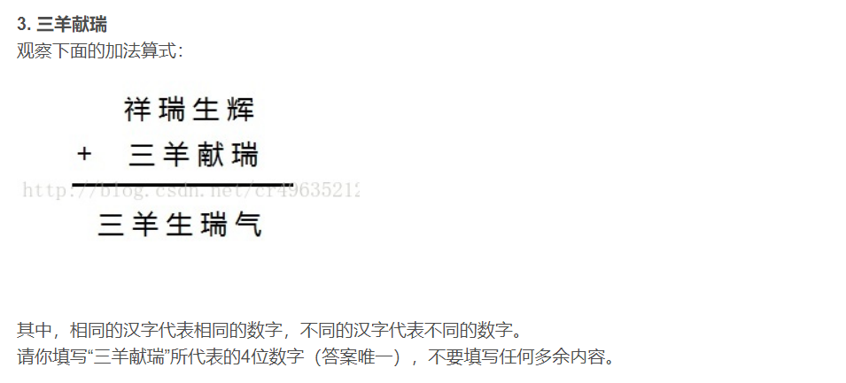

题目思路：

> 注意到上述加法算式中出现了8个不同的汉字：祥 瑞 生 辉 三 羊 献 气，且代表的数字不同。因此可枚举8个汉字对应的数字的所有可能情况。需要注意：由于祥、三位于最高位，故他们的取值范围为[1, 9]，其余为[0, 9]。

题目代码：

```
//全排列代码
#include <iostream>  
#include <algorithm>  
using namespace std;  
int main()  
{  
    int num[3]={1,2,3};  
    do  
    {  
        cout<<num[0]<<" "<<num[1]<<" "<<num[2]<<endl;  
    }while(next_permutation(num,num+3));  
    return 0;  
}  

#include <iostream>
#include <cstdio>
#include <algorithm>
using namespace std;
int a[10]={0,1,2,3,4,5,6,7,8,9};
int main()
{
	int i;
	int n1,n2,sum;
	do
	{
		//祥瑞生辉三羊献气<->a[0]~a[7] 
		n1=a[0]*1000+a[1]*100+a[2]*10+a[3];
		n2=a[4]*1000+a[5]*100+a[6]*10+a[1];
		sum=a[4]*10000+a[5]*1000+a[2]*100+a[1]*10+a[7];
		//最高位不为0，且满足等式 
		if(sum==n1+n2 && a[0]!=0 && a[4]!=0)
		{
			printf("%d + %d = %d\n",n1,n2,sum);
			break;
		}
	} while(next_permutation(a,a+10));
	return 0;
}
```

### 题目来源：蓝桥杯-第九届-递增三元组

题目描述：

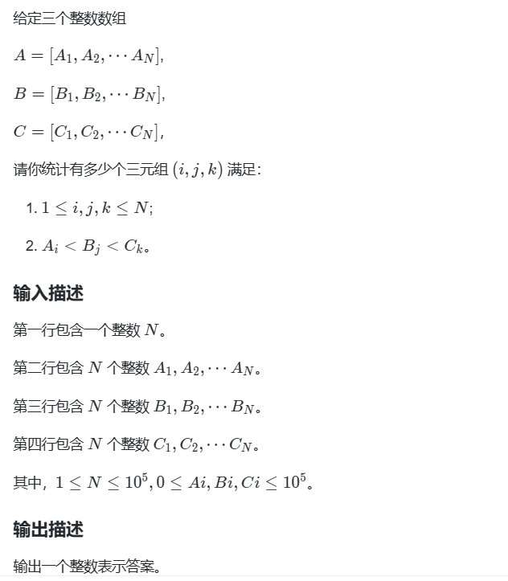

题目思路：

题目代码：

```
#include<stdio.h>
#include<algorithm>
using namespace std;
const int maxn=100010;
int main()
{
    int n;
    int a[maxn],b[maxn],c[maxn];
    scanf("%d",&n);
    for(int i=0;i<n;i++){
        scanf("%d",&a[i]);
    }
    sort(a,a+n);
    for(int i=0;i<n;i++){
        scanf("%d",&b[i]);
    }
    sort(b,b+n);
    for(int i=0;i<n;i++){
        scanf("%d",&c[i]);
    }
    sort(c,c+n);
    long long sum=0,s1=0,s2=0;
    //这里的 i 好像是
    for(int i=0;i<n;i++){
        while(s1<n&&a[s1]<b[i]) s1++;
            while(s2<n&&c[s2]<=b[i])s2++;
        sum+= ((long long)s1*(n-s2));
    }
    printf("%lld",sum);
    return 0;
}
```

### 题目来源：蓝桥杯-2011国赛-组合数问题

题目描述：

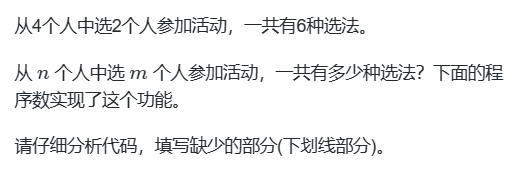

题目思路：


题目代码：

```
#include <iostream>
using namespace std;
int f(int n,int m){
    if(m>n) return 0;
    if(m==0) return 1;
    return f(n-1,m-1)+f(n-1,m);
}
int main(){
    cout<<f(10,3)<<'\n';
    cout<<f(5,3)<<'\n';
    cout<<f(5,2)<<'\n';
}
```

### 题目来源：蓝桥杯-2012省赛-古堡算式

题目描述：

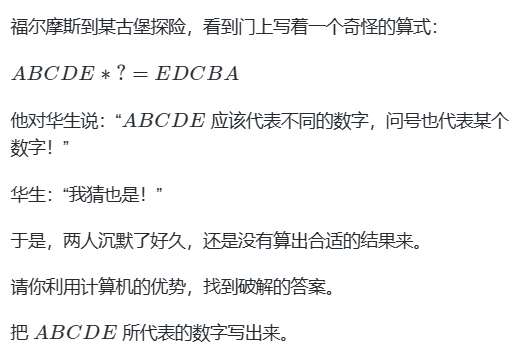

题目思路：


题目代码：

```
#include <iostream>
using namespace std;

int main()
{
  // 请在此输入您的代码
  int n = 10000;
  bool find=false;
  while(!find)
  {
    int A = n / 10000;
    int B = n / 1000 % 10;
    int C = n / 100 % 10;
    int D = n / 10 % 10;
    int E = n % 10;
    int x = E*10000+D*1000+C*100+B*10+A;

    if(A!=B && A!=C && A!=D && A!=E &&B!=C &&B!=D &&B!=E &&C!=D &&C!=E &&D!=E)
    {
      for(int i = 0;i<9;i++)
      {
        if(n * i == x)
        {
          printf("%d%d%d%d%d",A,B,C,D,E);
          find = true;
        }
      }
    }
    n++;
  }
  return 0;
}
```

### 题目来源：蓝桥杯-2014省赛-排列序数

题目描述：  
 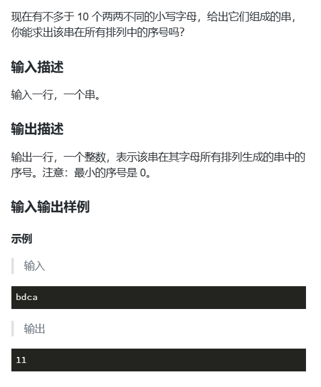

题目思路：


题目代码：

```
#include<iostream>
#include<algorithm>
#include<string>
using namespace std;
int main(){
    string str,strx;
    cin>>str;
    strx=str;
    sort(str.begin(),str.end());
    int ans=0;
    do {
        if(strx==str){
            break;
        }
        ans++;
    }while(next_permutation(str.begin(),str.end()));
    cout<<ans<<endl;
    return 0;
}
```

### 题目来源：蓝桥杯-2014省赛-李白打酒

题目描述：  
 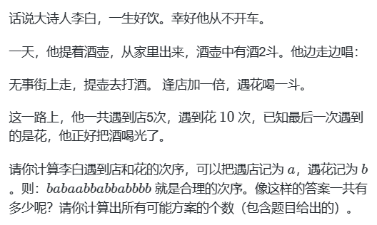

题目思路：


题目代码：

```
#include <iostream>
#include <string>
#include <algorithm>
using namespace std;
int main()
{
    string s="aaaaabbbbbbbbb";
    int n=s.size(),ans=0,i;
    do
    {
        int sum=2;
        for(i=0;i<n;i++)
        {
            if(s[i]=='a')    sum=sum*2;
            if(s[i]=='b')   sum--;
        }    
        if(sum==1)
        {
            ans++;
        }
    }
    while(next_permutation(s.begin(),s.end()));
    cout << ans;
    return 0;
}
```

### 题目来源：蓝桥杯-2014省赛-扑克序列

题目描述：

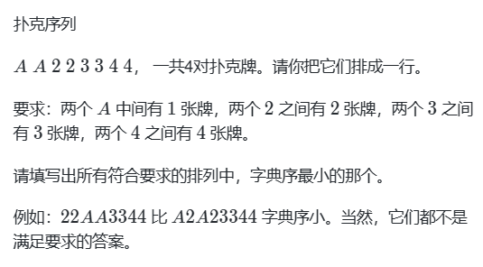

题目思路：


题目代码：

```
#include <iostream>
#include <algorithm>
using namespace std;

bool check(const string &str){
    if(str.rfind('A')-str.find('A') == 2 && str.rfind('2') - str.find('2') == 3 &&
       str.rfind('3') - str.find('3') == 4 && str.rfind('4') - str.find('4') == 5)
        return true;
    else
        return false;
}

int main(){
    string str = "223344AA";
    do {
        if (check(str)){
            if(str == "2342A3A4")
                cout <<str<<endl;
        }
    }while(next_permutation(str.begin(), str.end()));
    return 0;
}
```

### 题目来源：蓝桥杯-2016省赛-随意组合

题目描述：  
 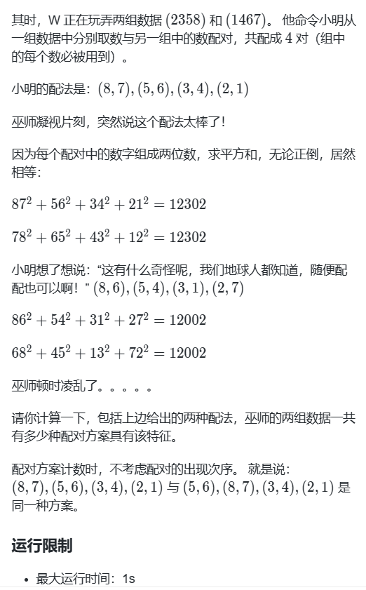

题目思路：


题目代码：

```
#include <iostream>
#include <algorithm>
using namespace std;
int main()
{
  // 请在此输入您的代码
  int a[4]={2,3,5,8};
  int b[4]={1,4,6,7};
  int count=0;
  do{
    int sum1=(a[0]*10+b[0])*(a[0]*10+b[0])+(a[1]*10+b[1])*(a[1]*10+b[1])+(a[2]*10+b[2])*(a[2]*10+b[2])+(a[3]*10+b[3])*(a[3]*10+b[3]);
    int sum2=(b[0]*10+a[0])*(b[0]*10+a[0])+(b[1]*10+a[1])*(b[1]*10+a[1])+(b[2]*10+a[2])*(b[2]*10+a[2])+(b[3]*10+a[3])*(b[3]*10+a[3]);
    if(sum1==sum2)
    {
      count++;
    }
  }while(next_permutation(b,b+4));
  cout<<count;
  return 0;
}
```

### 题目来源：LeetCode-31-下一个排列

题目描述：  
 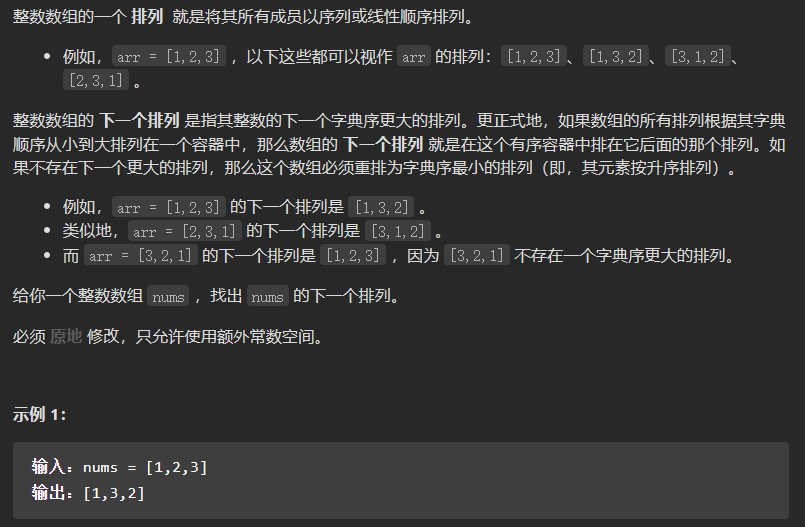

题目思路：

> 全排列的变化吧应该是；  
>  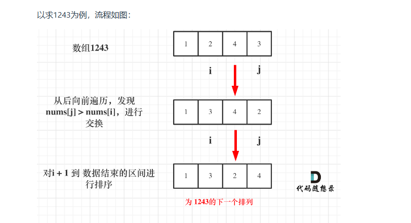

题目代码：

```
class Solution {
public:
    void nextPermutation(vector<int>& nums) {
        for (int i = nums.size() - 1; i >= 0; i--) {
            for (int j = nums.size() - 1; j > i; j--) {
                if (nums[j] > nums[i]) {
                    swap(nums[j], nums[i]);
                    reverse(nums.begin() + i + 1, nums.end());
                    return;
                }
            }
        }
        // 到这里了说明整个数组都是倒序了，反转一下便可
        reverse(nums.begin(), nums.end());
    }
};
```

## No.8 方程式求解

### 题目来源：蓝桥杯-第七届-一步之遥

题目描述：  
 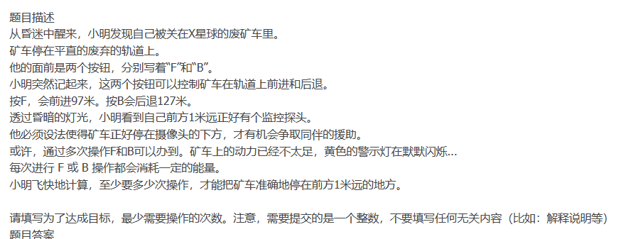

题目思路：

> 设x，y 自变量，进行 暴力枚举求解；

题目代码：

```
//对于N要进行适应性的更改，对于字段错误
#include<bits/stdc++.h>
using namespace std;
#define inf 0x3f3f3f3f
#define N 100100
#define mod 1000000007


long long n;
long long f[N];
long long res;
int m,k,g,d;
int x,y,z,t;
char ch;
string str;
vector<int>v[N];
int main() {
	for(int i=0;i<=1000;i++){
		for(int j=0;j<=1000;j++){
			if(97*i-127*j==1){
				cout<<i+j<<endl;
				return 0;
			}
		}
	}
	return 0;
}
```

## No.9 平面坐标综合

### 题目来源：LeetCode-657-机器人能否返回原点

题目描述：  
 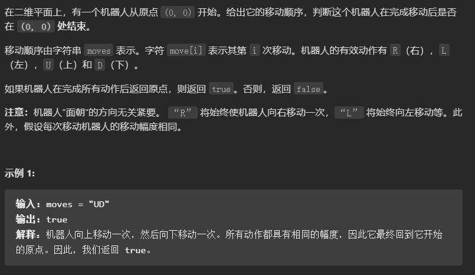

题目思路：

题目代码：

```
class Solution {
public:
    bool judgeCircle(string moves) {
        int x=0,y=0;
        for(auto ss:moves){
            if(ss=='U'){
                y--;
            }else if(ss=='D'){
                y++;
            }else if(ss=='L'){
                x--;
            }else if(ss=='R'){
                x++;
            }
        }
        if(x==0&&y==0)return true;

        return false;


    }
};
```

### 题目来源：LeetCode-463-岛屿的周长

题目描述：  
 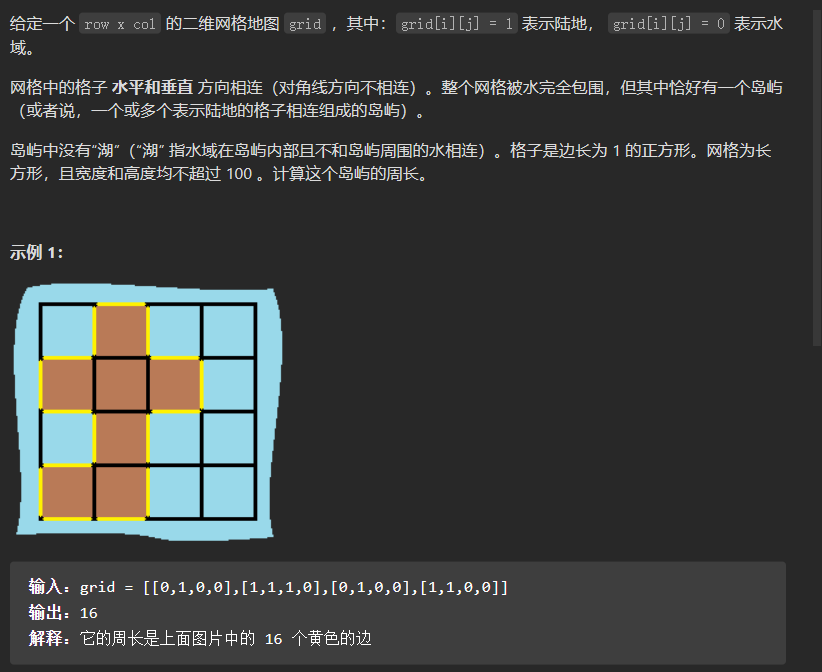

题目思路：

题目代码：

```
class Solution {
public:
    int islandPerimeter(vector<vector<int>>& grid) {
        //对于每一个陆地，都判断其上下左右是否有，如果没有，则自己的那边就为界限的边长

        int res=0;
        int n=grid.size();
        int m=grid[0].size();
        for(int i=0;i<n;i++){
            for(int j=0;j<m;j++){
                if(grid[i][j]==1){
                    if(i-1<0||grid[i-1][j]==0)res++;
                    if(i+1>=n||grid[i+1][j]==0)res++;

                    if(j-1<0||grid[i][j-1]==0)res++;
                    if(j+1>=m||grid[i][j+1]==0)res++;

                }
            }
        }

        return res;

    }
};
```

### 题目来源：LeetCode-59-螺旋矩阵 II

题目描述：  
 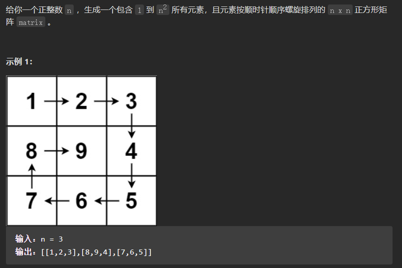

题目思路：

> 也是一个矩阵模拟的过程；可能可以归类到 矩阵那里去；

题目代码：

### 题目来源：蓝桥杯-第九届-螺旋折线

题目描述：  
 [转自这里：题目描述以及解题链接](http://t.csdn.cn/dG95w)  
 题目思路：

题目代码：

### 题目来源：蓝桥杯-第十四届模拟- 信号覆盖

题目描述：

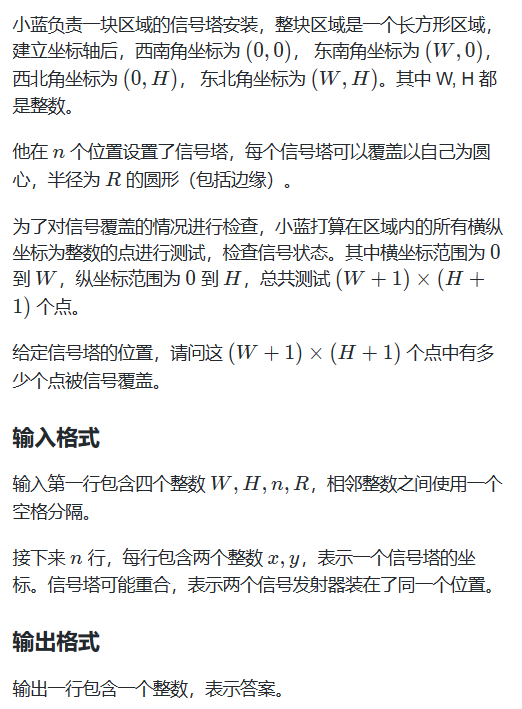

题目思路：


题目代码：

```
//对于N要进行适应性的更改，对于字段错误
#include<bits/stdc++.h>
using namespace std;
#define inf 0x3f3f3f3f
#define N 100100
int n,m,k,g,d;
int x,y,z;
char ch;
string str;
vector<int>v[N];

char name[]={'0','A','B','C','D','E','F','G','H','I','J','K','L','M','N','O','P','Q','R','S','T','U','V','W','X','Y','Z'};
int main()
{
	
  int w,h,n,r;
  cin>>w>>h>>n>>r;
  int ax[n+1],ay[n+1];
  for(int i=0;i<n;i++){
  	cin>>ax[i]>>ay[i];
  }
  int res=0;
  for(int x=0;x<=w;x++){
  	for(int y=0;y<=h;y++){
  		
  		for(int i=0;i<n;i++){
  			if(pow(x-ax[i],2)+pow(y-ay[i],2)<=pow(r,2)){
  				res++;
  				break;
			  }
		  }
	  }
  }
  cout<<res<<endl;
  return 0;
}
```

### 题目来源：蓝桥杯-2011省赛模拟-上三角矩阵

题目描述：

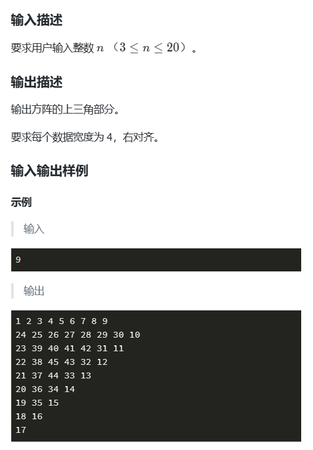

题目思路：

> 模拟矩阵；然后是那个左闭右开的方式：[讲解](https://blog.csdn.net/m0_74453256/article/details/129474856)

题目代码：

```
import java.util.Scanner;
 
public class 上三角方阵 {
 
    static int[][] arr = new int[25][25];
    static int num = 1;
 
    public static void main(String[] args) {
        Scanner scanner = new Scanner(System.in);
        int n = scanner.nextInt();
        dfs(1, n);
        for (int i = 1; i <= n; i++) {
            for (int j = 1; j <= n - i + 1; j++) {
                System.out.print(" "+arr[i][j]);
            }
            System.out.println();
        }
    }
 
    private static void dfs(int x, int y) {
        if (y < x) {
            return;
        }
        //处理边界问题很重要,这里一律采用左闭右开原则
        //处理上边界
        for (int i = x; i < y; i++) {
            arr[x][i] = num++;
        }
        //处理斜边
        int dy = y;
        for (int i = x; i < y; i++) {
            arr[i][dy] = num++;
            --dy;
        }
        //处理左边界
        for (int i = y; i >= x + 1; i--) {
            arr[i][x] = num++;
        }
        //内层循环
        dfs(x + 1, y - 2);
        //最中间的那个点
        if (x == y) {
            arr[x][y] = num++;
        }
    }
}
```

### 题目来源：蓝桥杯-2022省赛模拟-矩阵拼接

题目描述：

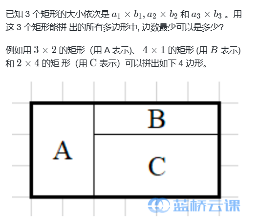

题目思路：


题目代码：

### 题目来源：蓝桥杯-2012省赛-机器人行走

题目描述：  
 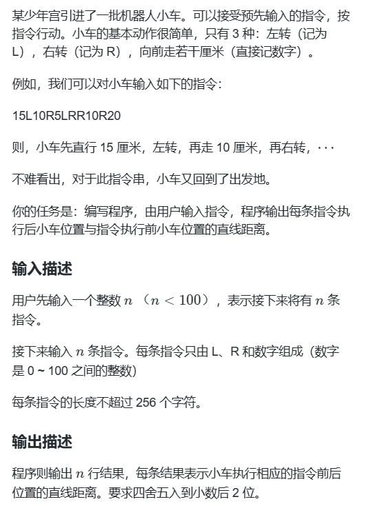

题目思路：


题目代码：

```
#include<iostream>
#include<cmath>
using namespace std;

int book[10006];
int you=0,shang=0;
int x=0,y=0;
void movie(int f,int s)
{
    while(f<1)
    {
        f+=4;
    }
    int rf=f%5;
    if(rf==1) you+=s;
    else if(rf==2) shang-=s;
    else if(rf==3) you-=s;
    else if(rf==4) shang+=s;
    
}
int main()
{
    int n,sum=0;
    int f=1;
    cin>>n;
    while(n--)
    {
        f=1;
        sum=0;
        x=0;
        y=0;
        you=0;
        shang=0;
        string a;
        cin>>a;
        for(int i=0;i<a.size();i++)
        {
            if(a[i]=='L') f=f-1;
            else if(a[i]=='R') f=f+1;
            else
            {
                sum=sum*10+(a[i]-48);
                if(a[i+1]=='R'||a[i+1]=='L'||i==a.size()-1)
                {
                    movie(f,sum);
                    sum=0;
                }
            }
        }
        x=abs(you),y=abs(shang);
        double p=pow(x*x+y*y,0.5);
        printf("%.2f\n",p);
        
    }
    
}
```

## No.10 等差数列

### 题目来源：蓝桥杯-第十届-等差数列

题目描述：  
 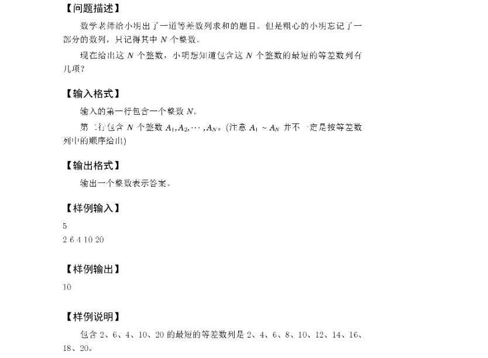

题目思路：

> 先排序，再求最小的公差，然后（（最大值-最小值）/最小的公差）+1，这个是错的思路，比如 输入6 2 4 7 10 12 20，如果用这个公式算那么得到答案为10，但实际为19，所以是求排序完后求每两个相邻数的最大公因数。

题目代码：

```
#include<bits/stdc++.h>
using namespace std;
int Ai[100005];
int main(){
	int N;
	cin>>N;
	for(int i = 0; i < N; i++)
		cin>>Ai[i];
	sort(Ai, Ai + N);
	int min_d = Ai[1] - Ai[0]; //升序排的序，所以公差大于0 
	if(min_d == 0) //如果 Ai[1] - Ai[0]等于0，说明这些数必定全部相等，那最小值就是N 
		cout<<N<<endl;
	else{
		int gcd = min_d; 
		for(int i = 2; i < N; i++){
			min_d = __gcd(min_d, Ai[i] - Ai[i - 1]); 
		}
		cout<<(Ai[N - 1] - Ai[0]) / min_d + 1<<endl;
	}
	return 0;
}
```

## No.11 小数点精度问题

### 题目来源：蓝桥杯-2012省赛-鲁卡斯队列

题目描述：

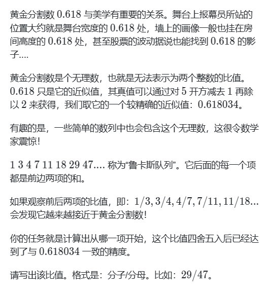

题目思路：


题目代码：

```
#include <iostream>
using namespace std;
int main()
{
  float a = 1,b = 3,c = 0;
  float n = 0;
  while(1){
    n = a/b;
    if((n>=0.6180335)&&(n<=0.6180344))
      break;
    c = a + b;
    a = b;
    b = c;
  }
  cout<<a<<'/'<<b;;
  return 0;
}
```

### 题目来源：蓝桥杯-2017省赛-小数第n位

题目描述：  
 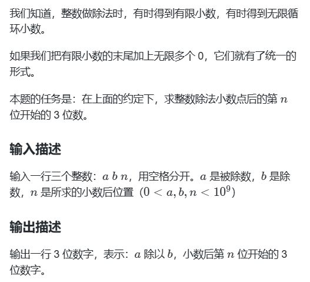

题目思路：


题目代码：

```
#include <iostream>
#include <algorithm>
#include <math.h>

using namespace std;

int main()
{
  long long a, b, n;
  cin >> a >> b >> n;
  while(n - 1 > 10){
    a *= 1e10;
    n -= 10;
    a %= b;
  }
  for(int i = 0; i <= n + 2; i++)
  {
    int ans = a / b;
    if(i >= n){
      cout << ans;//排除掉第n位之前的小数 
    }
    a = a % b;
    a = a * 10;
  }
  return 0;
}
```

## No.12 后缀表达式

### 题目来源：蓝桥杯-第十届-后缀表达式

题目描述：  
 [题目转自这里：后缀表达式的题解](http://t.csdn.cn/mAHGo)  
 题目思路：

题目代码：

## No.13 数字循环处理即模拟余数使用

### 题目来源：LeetCode-1015. 可被 K 整除的最小整数

题目描述：  
 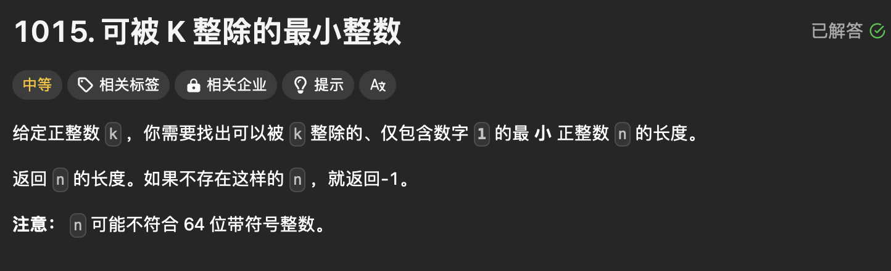

题目思路：


题目代码：

```
class Solution {
public:
    int smallestRepunitDivByK(int k) {

        /// 意思 是 n % k == 0 返回n的长度；这个pta好像有
        /// 只需要 余数 == k就行了？
        int now_mod = 1 % k;
        unordered_set<int>st; // unordered_set 这个的时间比set快了很多
        st.insert(now_mod);
        int res = 1;
        while(now_mod)
        {
            now_mod = (now_mod * 10 + 1) % k;
            res++;

            /// 注意无解的情况：
            if(st.find(now_mod) != st.end()){
                return -1;
            }
            st.insert(now_mod);
        }
        return res;
        
    }
};
```

### 题目来源：PTA-L2-029 特立独行的幸福

题目描述：  
 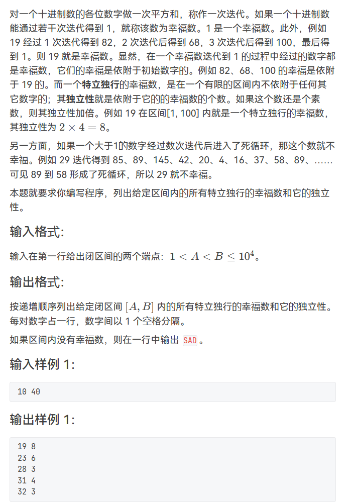

题目思路：

题目代码：

```
思路有点暴力，一开始这么想觉得可能会超时，幸好比赛的时候过了。

1、for循环对区间的每一个数进行判断是否是幸福数

2、迭代：对这个数一直求各位的平方和，直到平方和为1，或者平方和重复出现，平且标记出现过的平方和（用于排除非独立的幸福数）

3、如果是因为平方和为1而结束循环，说明这个数是一个幸福数，那么可以对它进行存储。

4、输出时注意，需要排除非独立的幸福数（本身出现在另一个数的求平方和过程中，就不是独立的幸福数（前面已标记））

#include<bits/stdc++.h>
using namespace std;
#define inf 0x3f3f3f3f
#define N 100100
int n,m,k,g,d;
int x,y,z;
char ch;
string str;
vector<int>v[N];
int isP(int x){
    for(int i=2;i<=sqrt(x);i++){
        if(x%i==0)return 1;
    }
    return 2;
}
int book[N]={0};
int main() {
    int l,r;
    cin>>l>>r;
    map<int,int>mp;
    for(int i=l;i<=r;i++){
        vector<int>ans;
        int t=i;
        while(t!=1){
            int sum=0;
            while(t){
                sum+=(t%10)*(t%10);
                t=t/10;
            }
            t=sum;
            if(find(ans.begin(),ans.end(),t)==ans.end()){
                ans.push_back(t);//第一个本身并不会被标记。只会标记其他过程中的。。
                book[t]=1;//标记出现过的数
            }else{
                break;
            }
        }
        //判断   //判断是由于异常跳出的还是正常出来的；；
        if(t==1){
            mp[i]=ans.size();//存储辛福数
        }
    }
    int flag=0;
    for(int i=l;i<=r;i++){
        if(book[i]==0 &&mp[i]>0){
            cout<<i<<" "<<mp[i]*isP(i)<<endl;
            flag=1;
        }
    }
    if(flag==0){
        cout<<"SAD"<<endl;
    }
	return 0;
}
```

### 题目来源：Acwing-3559-围圈报数

题目描述：  
 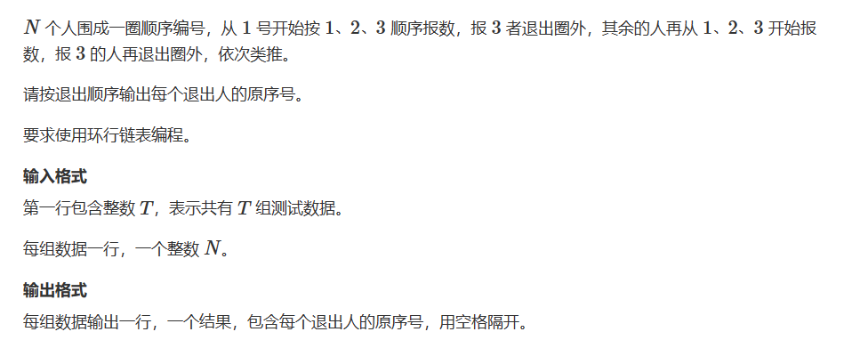

题目思路：

> 余数的使用，以及for循环里面的 截至条件的使用；

题目代码：

```
//对于N要进行适应性的更改，对于字段错误
#include<bits/stdc++.h>
using namespace std;
#define inf 0x3f3f3f3f
#define N 100100
int n,m,k,g,d;
int x,y,z;
char ch;
string str;
vector<int>v[N];

int main() {
    cin>>n;
    for(int j=0;j<n;j++){
        cin>>m;
        vector<int>ans;
        k=0;//标志到3
        int vis[m+1]={0};
        for(int i=1;ans.size()!=m;i++ ){
            if(vis[i]==1){//如果已经在了 就跳过；
                if(i==m)i=0;
                continue;
            }
            k=(k+1)%3;
            if(k==0){
                ans.push_back(i);
                vis[i]=1;
            }
            if(i==m)i=0;
        }
        for(int i=0;i<ans.size();i++){
            if(i==0)cout<<ans[i];
            else cout<<" "<<ans[i];
        }
        cout<<endl;
    }
	return 0;
}
```

### 题目来源：蓝桥杯-2018省赛-倍数问题

题目描述：  
 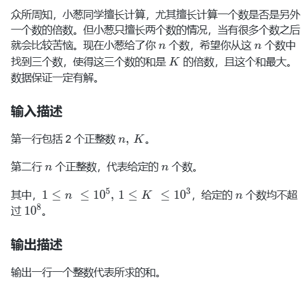

题目思路：

> 普通的暴力无法通过,需要进行优化. 设vet[i]中存储的是对k取余为i的数,因此要选择3个数使得它们的和为k的倍数,只需要满足(i+j+x)%k==0即可(0<=i,j,x<k),然后通过排序使得vet[i]是递增的,这样在取数时,取末尾的数即可保证取得的数的和最大 这样,我们就将时间复杂度降为了O(k\*k)

题目代码：

```
#include<bits/stdc++.h>
using namespace std;
typedef long long ll;
const ll mod=1000000007;

ll ans;
vector<int> vet[1010];
int main(){
    int n,k;
    int arr[100010];
    cin>>n>>k;
    for(int i=0;i<n;i++) cin>>arr[i];
    sort(arr,arr+n);
    for(int i=0;i<n;i++)  vet[arr[i]%k].push_back(arr[i]);
    for(int i=0;i<k;i++){
        for(int j=i;j<k;j++){
            int x=(2*k-i-j)%k;
            ll sum=0;
            if(i==j&&i==x){
                if(vet[i].size()<3) continue;
                for(int a=vet[i].size()-3;a<vet[i].size();a++) sum+=vet[i][a];
            }
            else if(i==j||i==x){
                if(vet[i].size()<2||vet[j].size()<1||vet[x].size()<1) continue;
                for(int a=vet[i].size()-2;a<vet[i].size();a++) sum+=vet[i][a];
                if(i!=j) sum+=vet[j].back();
                else sum+=vet[x].back();
            }
            else if(j==x){
                if(vet[j].size()<2||vet[i].size()<1) continue;
                for(int a=vet[j].size()-2;a<vet[j].size();a++) sum+=vet[j][a];
                sum+=vet[i].back();
            }
            else{
                if(vet[i].size()<1||vet[j].size()<1||vet[x].size()<1) continue;
                sum+=vet[i].back();sum+=vet[j].back();sum+=vet[x].back();
            }
            ans=max(ans,sum);
        }
    }
    cout<<ans<<endl;
    return 0;
}
```

## No.14 数值末尾处理

### 题目来源：PTA-L1-080 乘法口诀数列

题目描述：  
 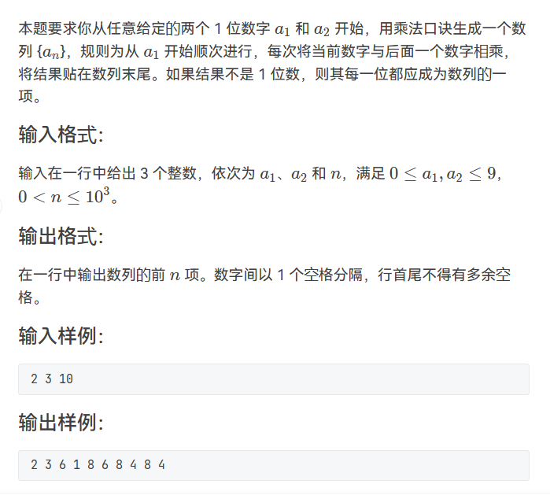

题目思路：

题目代码：

```
//用for可以标记次数。
#include<bits/stdc++.h>
using namespace std;
#define inf 0x3f3f3f3f
#define N 100100
int n,m,k,g,d;
int x,y,z;
vector<int>v[N];
vector<int>ans;
int main() {
    cin>>x>>y>>k;
    ans.push_back(x);
    ans.push_back(y);
    for(int i=0;i<=k;i++){
        int a=ans[i];
        int b=ans[i+1];
        if(a*b>=10){
            ans.push_back(a*b/10);
            ans.push_back(a*b%10);
        }else{
            ans.push_back(a*b);
        }
    }
    for(int i=0;i<k;i++){
        if(i==0){
            cout<<ans[i];
        }else{
            cout<<" "<<ans[i];
        }
    }
	return 0;
}
```

### 题目来源：Acwing-4520-质数

题目描述：  
 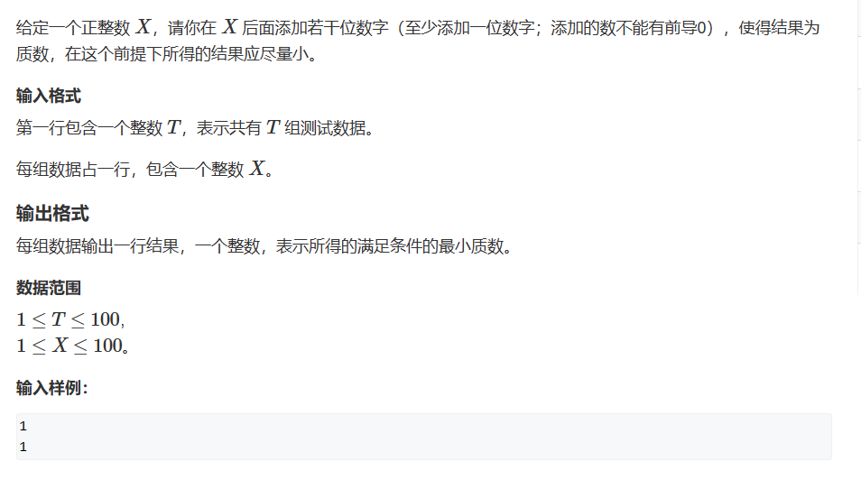

题目思路：

> 如何在 一个数值 后面 进行 增加变化

题目代码：

```
//对于N要进行适应性的更改，对于字段错误
#include<bits/stdc++.h>
using namespace std;
#define inf 0x3f3f3f3f
#define N 100100
int n,m,k,g,d;
int x,y,z;
char ch;
string str;
vector<int>v[N];
int iszhi(int x){
    if(x<2)return 0;
    for(int i=2;i<=sqrt(x);i++){
        if(x%i==0)return 0;
    }
    return 1;
}
int main() {
    cin>>n;
   // cout<<to_string(n).size()<<endl;
    while (n--)
    {
        cin>>m;
        //加的数字 自家， 然后统计长度，然后进行原数字x*百千万， 然后计算；
        for(int i=1; ; i++){
            x=m*pow(10,to_string(i).size())+i;
            if(iszhi(x)==1){
                cout<<x<<endl;
                break;
            }
        }
    }
	return 0;
}
```

### 题目来源：Acwing-2074- 倒计数

题目描述：  
 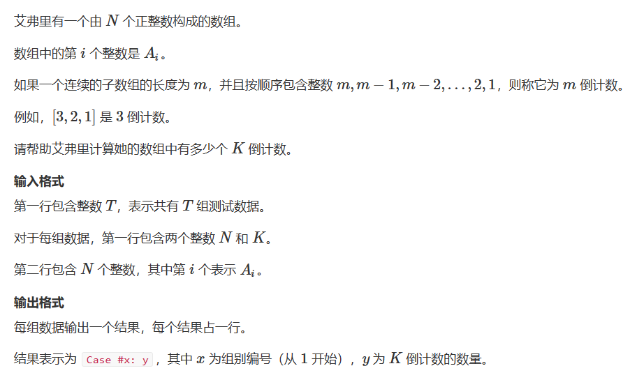

题目思路：

题目代码：

```
//对于N要进行适应性的更改，对于字段错误
#include<bits/stdc++.h>
using namespace std;
#define inf 0x3f3f3f3f
#define N 100100
int n,m,k,g,d;
int x,y,z;
char ch;
string str;
vector<int>v[N];

int main() {

	cin>>n;
	for(int i=1;i<=n;i++){
		cin>>x>>k;
		int co=0;
		vector<int>ans;
		for(int j=0;j<x;j++){
			cin>>y;
			ans.push_back(y);
		}
		for(int j=0;j<x;j++){
			if(ans[j]==k){
				vector<int>ans1;
				vector<int>ans2;
				for(int z=k;z>=1;z--){
					ans1.push_back(z);
				}
				for(int z=j;ans2.size()<k&&z<x;z++){
					ans2.push_back(ans[z]);
				}
				if(ans1==ans2){
					co++;
				}
			}
		}
		cout<<"Case #"<<i<<": "<<co<<endl;
	}

	return 0;
}
```

### 题目来源：Acwing-4426-整除子串

题目描述：  
 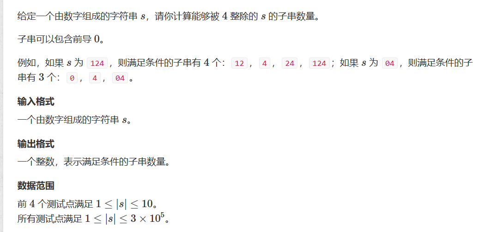

题目思路：

> /被4整除，即数字的最后两位能够被四整除；因为：nab=n\*100+ab；

题目代码：

```
//字串比连续，子序列不一定连续；
//被4整除，即数字的最后两位能够被四整除；因为：nab=n*100+ab；
#include<bits/stdc++.h>
using namespace std;
#define N 10001

int main()
{
    string s;
    cin>>s;
    long long count=0;
    for(int i=0;i<s.size();i++){
            //一位的
        if((s[i]-'0')%4==0)count++;
        //两位的
        if((i!=0)&&((s[i-1]-'0')*10+(s[i]-'0'))%4==0){
            count=count+i;
            // 因为前面有i位数
        }
    }
    cout<<count<<endl;


return 0;
}
```

### 题目来源：Acwing-4949-末尾连续0

题目描述：

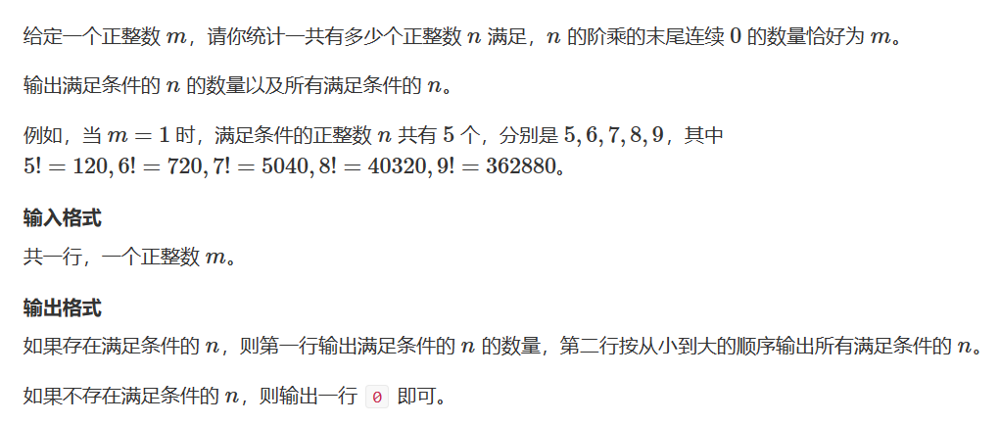

题目思路：


题目代码：

```
#include <iostream>
#include <vector>
using namespace std;
int n,m;
int cnt[10];
int main () {
    cin >> m;
    vector <int> v;
    for (int i = 1;i <= 1e7;i++) {
        int t = i;
        while (t % 2 == 0) cnt[2]++,t /= 2;
        while (t % 5 == 0) cnt[5]++,t /= 5;
        if (min (cnt[2],cnt[5]) == m) v.push_back (i);
    }
    cout << v.size () << endl;
    for (int x : v) cout << x << ' ';
    return 0;
}
```

### 题目来源：蓝桥杯-数列求值

题目描述：  
 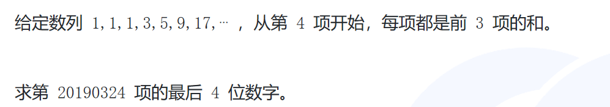

题目思路：

题目代码：

```
#include<bits/stdc++.h>
using namespace std;
typedef long long ll;
const int maxn = 20190325;
ll a[maxn];
int main()
{
    a[1] = 1, a[2] = 1, a[3] = 1;
    for(int i = 4;i < maxn;i++){
        a[i] = a[i - 1] + a[i - 2] + a[i - 3];
        a[i] %= 10000;
    }
    cout << a[20190324] << endl;
    return 0;
}
```

### 题目来源：蓝桥杯-2015省赛-循环节长度

题目描述：  
 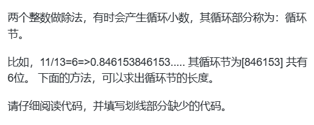

题目思路：


题目代码：

```
import java.util.*;
public class Main
{
    public static int f(int n, int m)
    {
        n = n % m;    
        Vector v = new Vector();        
        for(;;)
        {    
            v.add(n);
            n *= 10; //110
            n = n % m;  // 13 * 8= 6
            if(n==0) return 0;
            if(v.indexOf(n)>=0)  return v.size() - v.indexOf(n);
        }
    }    
    public static void main(String[] args)
    {
        System.out.println(f(1, 8));
        System.out.println(f(8, 3));
        System.out.println(f(11, 13));
        System.out.println(f(39, 190));
    }
}
```

### 题目来源：蓝桥杯-2016省赛-平方末尾

题目描述：

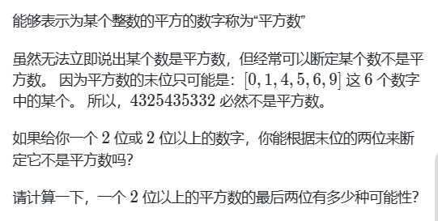

题目思路：


题目代码：

```
#include<iostream>
#include<set>
using namespace std;
int main()
{ 
    set<int>a;
    int i, j;
    for (i = 10; i <= 99; i++)
    {
        int t = i * i % 100;
        a.insert(t);
    }
    cout << a.size();
    return 0;
}
```

## No.15 超大数据存储运算

### 题目来源：LeetCode-7. 整数反转

题目描述：

[7. 整数反转](https://leetcode.cn/problems/reverse-integer/)

题目思路：

> 翻转容易，主要是32位 限制；

题目代码：

```
class Solution {
public:
    int reverse(int x) {
        int rev = 0;
        while (x != 0) {
            //如果反转后整数超过 32 位的有符号整数的范围
            // 因为不允许存储64位的，那么如果出现return 0 的情况就是使用了；
            // 所以变换
            if (rev < INT_MIN / 10 || rev > INT_MAX / 10) {
                return 0;
            }
            int digit = x % 10;
            x /= 10;
            rev = rev * 10 + digit;
            //if(rev < INT_MIN || rev> INT_MAX){
            //    return 0;
            //}
        }
        return rev;
    }
};
```

### 题目来源：Acwing-3596-a+b

题目描述：  
 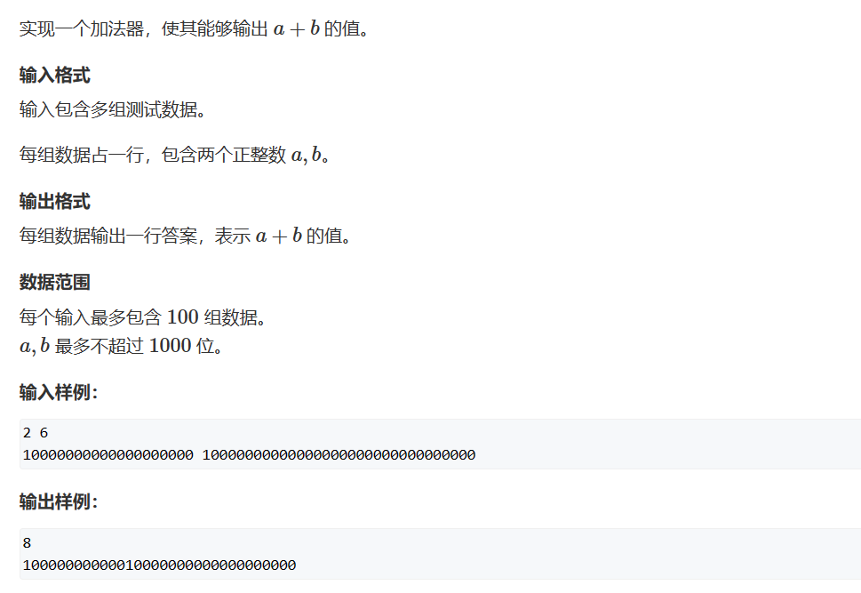

题目思路：

> 用a、b数组去存储每个位置的数据，然后再进行处理。  
>  (竖式法)我们可以输入两个字符串，再开两个数组来储存每个数每一位上的数。  
>  不过a0a0存放的是最后一个数，这样就能够实现数字末尾对齐，然后每位对齐实现竖式计算！

题目代码：

```
#include <bits/stdc++.h>
using namespace std;

int a[1005], b[1005], cnt;
string x, y;
int main() {
    while (cin >> x >> y) {
        memset(a, 0, sizeof(a));
        memset(b, 0, sizeof(b));
        for (int i = 0; i < x.size(); i++)
            a[x.size() - 1 - i] = x[i] - '0';
        for (int i = 0; i < y.size(); i++)
            b[y.size() - 1 - i] = y[i] - '0';
        cnt = max(x.size(), y.size());
        for (int i = 0; i < cnt; i++) {
            a[i] += b[i];
            a[i + 1] += a[i] / 10;
            a[i] %= 10;
        }
        while (a[cnt])
            cnt++;
        for (int i = cnt - 1; i >= 0; i--)
            cout << a[i];
        cout << endl;
    }
    return 0;
}
```

### 题目来源：Acwing-4425-改变数字

题目描述：  
 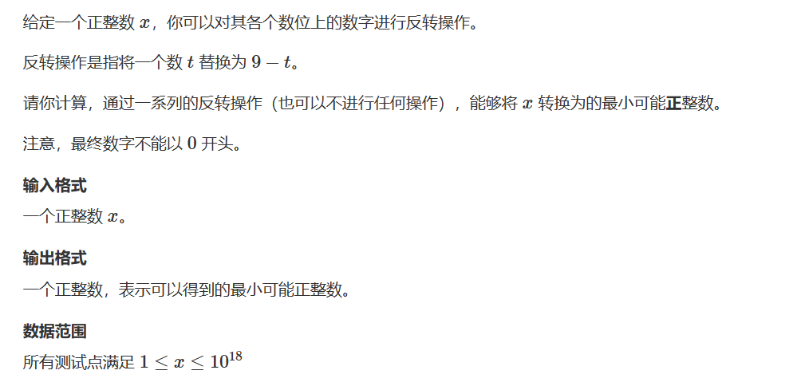

题目思路：


题目代码：

```
//数字认为字符串输入；；；防止爆int
#include<bits/stdc++.h>
using namespace std;
#define N 10001

int main()
{
    string x;
    cin>>x;
    vector<int>ans;
    vector<int>ans2;
    for(auto s:x){
        int num=s-'0';
        ans.push_back(num);
    }
    for(int i=0;i<ans.size();i++){
        int num=ans[i];
        if(i==0){
            if((9-num)>0&&(9-num)<num){
                ans2.push_back(9-num);
            }else{
                ans2.push_back(num);
            }
        }else{
            if((9-num)>=0&&(9-num)<num){
                ans2.push_back(9-num);
            }else{
                ans2.push_back(num);
            }
        }
    }
    for(auto i:ans2){
        cout<<i;
    }
return 0;
}
```

### 题目来源：Acwing-4948. 大乘积

题目描述：  
 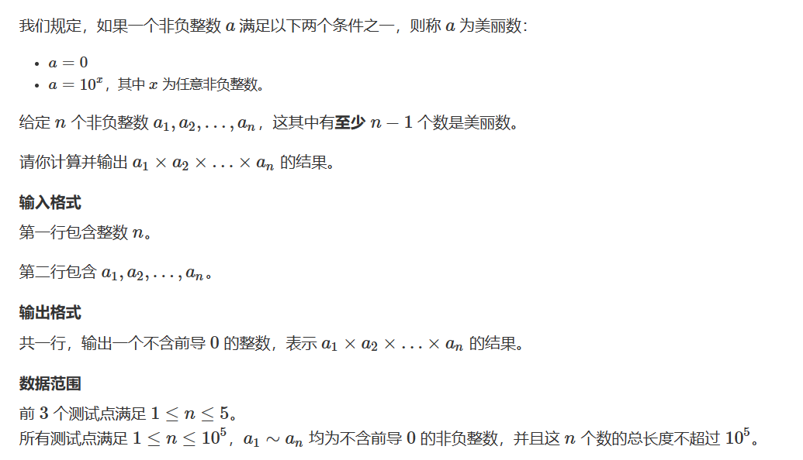

题目思路：


题目代码：

```
#include<bits/stdc++.h>
using namespace std;
#define inf 0x3f3f3f3f
#define N 505
int n,m,k,g,d;
int x,y,z;
char ch;
string str;
vector<int>v[N];
#define PII pair<int,int>

int check(string s)
{
    if (s[0] != '1' ) return 0;
    for (int i = 1; i < s.size(); i ++ )
        if (s[i] != '0')
            return 0;
    return 1;        
}
int main()
{	

	string res="1";
	int sum0=0;
	cin>>n;
	while(n--){
		cin>>str;
		if(str=="0"){
			cout<<0;
			return 0;
		}
		int flag=1;
		if(check(str)==1){
			sum0=sum0+str.size()-1;
		}else{
			res=str;
		}
	} 
	
	cout<<res;
	while(sum0--)cout<<0;

	
		
	
 	
    return 0;
}
```

### 题目来源：Acwing-791. 高精度加法

题目描述：  
 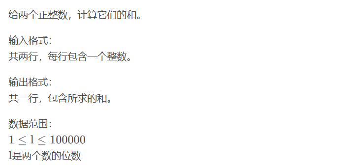

题目思路：


题目代码：

```
#include <iostream>
#include <vector>
using namespace std;

const int N = 1e6 + 10;

vector<int> add(vector<int>& A, vector<int>& B) {
    vector<int> C;
    int t = 0;

	// 如果A位数少，就反过来调用add函数
    if (A.size() < B.size()) return add(B, A);

    for (int i = 0; i < A.size(); i++) {
        t += A[i];
        if (i < B.size()) t += B[i];
        C.push_back(t % 10);
        t /= 10;
    }
	
	// 如果最高位还有个1，就把1添上去
    if (t) C.push_back(1);
    return C;
} 

int main() {
    string a, b;
    vector<int> A, B;

    cin >> a >> b;

    for (int i = a.size() - 1; i >= 0; i--) A.push_back(a[i] - '0');
    for (int i = b.size() - 1; i >= 0; i--) B.push_back(b[i] - '0');

    auto C = add(A, B);
    for (int i = C.size() - 1; i >= 0; i--) printf("%d", C[i]);

    return 0;
}
```

### 题目来源：Acwing-792. 高精度减法

题目描述：  
 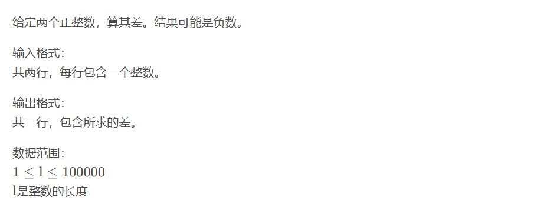

题目思路：


题目代码：

```
#include <iostream>
#include <string>
#include <vector>
using namespace std;

// 返回A >= B是否成立
bool cmp(vector<int>& A, vector<int>& B) {
    if (A.size() != B.size()) return A.size() >= B.size();
    for (int i = A.size(); i >= 0; i--) 
        if (A[i] != B[i])
            return A[i] >= B[i];

    return true;
}

// 这里假定A >= B，计算A - B后返回
vector<int> subtract(vector<int>& A, vector<int>& B) {
    vector<int> C;
    for (int i = 0; i < A.size(); i++) {
        if (A[i] >= B[i]) C.push_back(A[i] - B[i]);
        else {
            C.push_back(A[i] + 10 - B[i]);
            A[i + 1]--;
        }
    }
	
	// 去掉前导0
    while (C.size() > 1 && C.back() == 0) C.pop_back();

    return C;
}

int main() {
    string a, b;
    vector<int> A, B;

    cin >> a >> b;
    for (int i = a.size() - 1; i >= 0; i--) A.push_back(a[i] - '0');
    for (int i = b.size() - 1; i >= 0; i--) B.push_back(b[i] - '0');

    vector<int> C;
    if (cmp(A, B)) {
        C = subtract(A, B);
    } else {
        C = subtract(B, A);
        printf("-");
    }

    for (int i = C.size() - 1; i >= 0; i--) printf("%d", C[i]);

    return 0;
}
```

### 题目来源：Acwing-793.高精度乘法

题目描述：  
 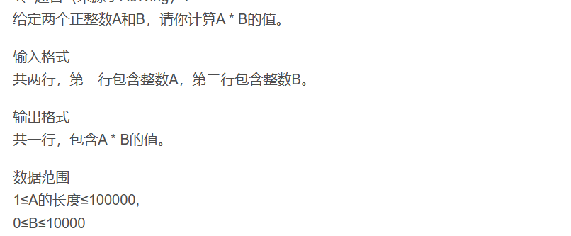

题目思路：


题目代码：

```
#include <iostream>
#include <vector>

using namespace std;

vector<int> mul(vector<int> &A, int b);

int main()
{
    string a;
    int b;
    
    cin >> a >> b;
    
    vector<int> A;
    for (int i = a.size() - 1; i>=0; i--) A.push_back(a[i] - '0');
    
    auto C = mul(A, b);
    
    for (int i = C.size() - 1; i>=0; i--) cout << C[i];
    
    return 0;
}

vector<int> mul(vector<int> &A, int b)
{
    vector<int> C;
    
    for(int i = 0, t = 0; i<A.size() || t; i++)
    {
        if(i<A.size()) t += A[i] * b;
        C.push_back(t % 10);//取对10的余数存入
        t /= 10;//进位
    }//计算A * b
    
    while(C.size() > 1 && C.back() == 0) C.pop_back();//清除前导0
    
    return C;
}//该代码引用AcWing网站的代码
```

### 题目来源：Acwing-794. 高精度除法

题目描述：  
 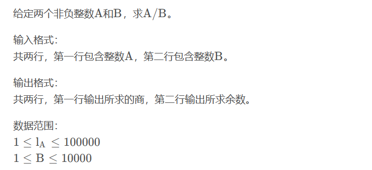

题目思路：


题目代码：

```
#include <iostream>
#include <string>
#include <vector>
#include <algorithm>
using namespace std;

// 返回商，并更新r为余数
vector<int> div(vector<int>& A, int b, int& r) {
    vector<int> C;
    r = 0;
    // A是将一个整数逆序存储的，所以其最高位是最后一位，要以从最高位到最低位的次序计算
    for (int i = A.size() - 1; i >= 0; i--) {
        r = r * 10 + A[i];
        C.push_back(r / b);
        r %= b;
    }

    reverse(C.begin(), C.end());
    while (C.size() > 1 && C.back() == 0) C.pop_back();

    return C;
}

int main() {
    string a;
    int b;

    cin >> a >> b;
    
    vector<int> A;
    for (int i = a.size() - 1; i >= 0; i--)  A.push_back(a[i] - '0');

    int r;
    auto C = div(A, b, r);
    for (int i = C.size() - 1; i >= 0; i--) printf("%d", C[i]);
    cout << endl << r << endl;

    return 0;
}
```

### 题目来源：蓝桥杯-2011年国赛-最小公倍数(大数)

题目描述：  
 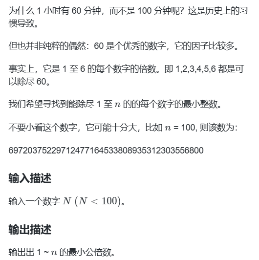

题目思路：

> 大数，用数组存储 超大范围数字

题目代码：

```
#include<iostream>
#include<cstring>
using namespace std;
int main() {
    int i, j;
    int num[100];//存储最大公倍数
    int a[105];
    //存储1-100
    for (i = 1; i <= 100; i++) {
        a[i] = i;
    }
    //在循环的过程中，如果发现 j 可以整除 i，就将 j 分解质因数后的 a[j] 中包含 i 的那个因数除掉，这样可以保证 a[j] 中不会重复包含相同的因数，也就是求得了 i 和 j 的最小公倍数。
    //将所有数的公因数除去，以求出它们的最小公倍数。
    for (i = 2; i <= 101; i++) {
        for (j = i + 1; j <= 101; j++) {
            if (a[j] % a[i] == 0) {
                a[j] = a[j] / a[i];//求多个数最小公倍数的核心思想
            }
        }
    }
    int n;
    while (cin >> n) {
        memset(num, 0, sizeof(num));
        num[0] = 1;
        for ( i = 2; i <= n; i++) {
            int c = 0;
            for (j = 0; j < i; j++) {
                //计算乘积
                int s = num[j] * a[i] + c;//大数的基本算法
                //取个位数
                num[j] = s % 10;
                //取十位数
                c = s / 10;
            }
        }
        for (i = 99; i >= 0; i--) {
            if (num[i]) {
                break;
            }
        }
        for ( j = i; j >= 0; j--) {
            cout << num[j];
        }
        cout << endl;
    }
    return 0;
}
```

### 题目来源：蓝桥杯-2013省赛-

题目描述：

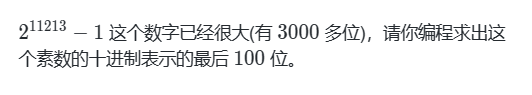

题目思路：


题目代码：

```
#include <iostream>
#include <vector>
using namespace std;
int main()
{
    vector<int> a(101, 0);
    a[1] = 1;
    for (int i = 1; i <= 11213; ++i) {
        int c = 0;
        for (int j = 1; j <= 100; ++j) {
            a[j] = a[j] * 2 + c;
            c = a[j] / 10;
            a[j] %= 10;
        }
    }
    a[1] -= 1;
    for (int i = 100; i >= 1; --i) {
        cout << a[i];
    }
    return 0;
}
```

### 题目来源：蓝桥杯-2016省赛-阶乘位数

题目描述：

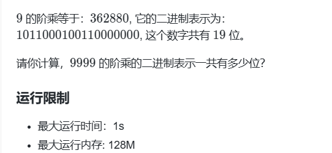

题目思路：


题目代码：

```
#include <iostream>
#include <cmath>
using namespace std;
int main()
{
    double sum = 0;
     
    for (int i = 1; i <= 9999; i++)
    {
        sum += log2(i);
    }

    cout << (int)sum + 1;
}
```

## No.16 字符矩阵

### 题目来源：蓝桥杯-2011国赛- 有理数的循环节

题目描述：  
 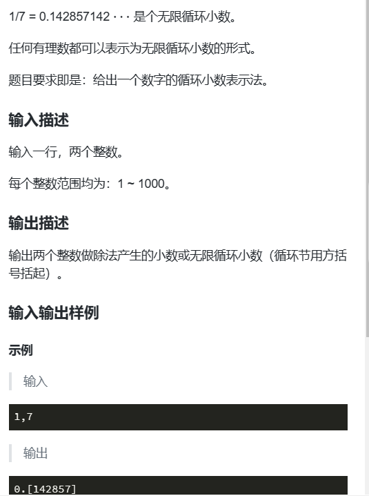

题目思路：

> 以为遇到第一个余数相等就是循环小数，实际上是遇到第一个被除数相等才是循环小数，就因为这个我卡了半天。

题目代码：

```
#include <bits/stdc++.h>
using namespace std;
const int N=10010;
int main()
{
  int x,y;
  char ch;
  cin>>x;
  cin>>ch;
  cin>>y;
  int a[N],b[N];
  int i=0,j=0,k=0;
  if(x%y==0){
    cout<<x/y;
    return 0;
  }

  int cnt=0;

  if(x>y){
    cout<<x/y;
    x%=y;
  }else{
    cout<<0;
  }
  while(true){
    if(x<y){
        if(cnt>0) a[i++]=0;
        if(x==0)
        {
            cout<<".";
            for(int l=0;l<=i-1;l++)
            cout<<a[l];
            break;
        }
        x*=10;
        cnt++;
    }else{
      int flag=false;
      cnt=0;
      if(i>0){
            for(j=k-1;j>=0;j--){
                if(b[j]==x){
                  flag=true;
                  break;
                }
            }
      if(flag){
            cout<<".[";
            for(;j<=i-1;j++)
              cout<<a[j];
            cout<<"]";
            break;
            }
      }
      a[i++]=x/y;
      b[k++]=x;
      x%=y;
    }
  }
  return 0;
}
```

## No.17 几何凸包

### 题目来源：PTA-L3-029 还原文件

题目描述：  
 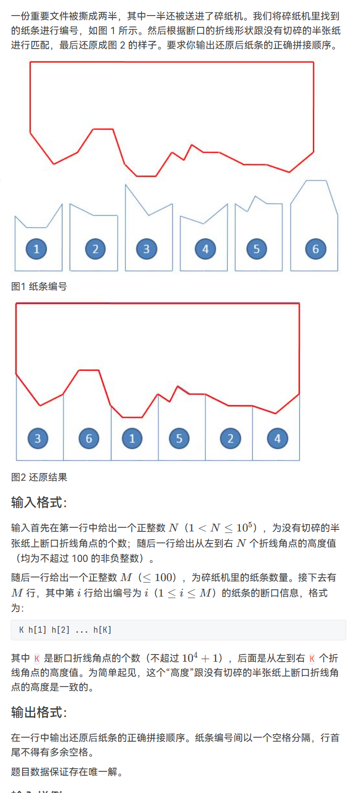

题目思路：

> 主要还是遍历，然后设置个vector 来比较是否相同。

题目代码：

```
//自己的这个思路是循环每一个v[ j ] 记录size 然后从该点开始存到动态数组upda里面存size()个，然后比较两个动态数组是否相等；

//26分博主为什么要对输入的每一组标签排序呢 要让最后的纸条最先排队 这是为啥？我感觉没必要啊 可是不加这个样例2就过不了？？
#include<bits/stdc++.h>
using namespace std;
#define N 100100
string str;
char ch;
int n,m,k,d,s;
int x,y,z;
vector<int>v[N];


int main(){
    vector<int>ans;
    cin>>n;
    for(int i=0;i<n;i++){
        cin>>x;
        ans.push_back(x);
    }
    
    
    cin>>k;
    for(int i=1;i<=k;i++){
        cin>>m;
        while(m--){
            cin>>x;
            v[i].push_back(x);
        }
    }
    vector<int>cur;
    int vis[N]={0};
    int len=0;
    for(int i=0;i<n;i++){
        //这个还必须是i在这里，因为如果不在这里设置的话，i=n-1；；一直运行；
        //所以还可以
        if(i==n-1)break;
        //95 70 80 97 97 68 58 58 80 72 88 81 81 68 68 60 80
        //95 70 80
        for(int j=1;j<=k;j++){
            if(vis[j]==1)continue;
            len=v[j].size();
            vector<int>upda;
            for(int p=i;p<i+len;p++){
                upda.push_back(ans[p]);
            }
            if(upda==v[j]){
                cur.push_back(j);
                vis[j]=1;
                i=i+len-2;
                break;
            }
        }
    }
    for(int i=0;i<cur.size();i++){
        if(i==0)cout<<cur[i];
        else cout<<" "<<cur[i];
    }
    return 0;
}


//30分，真的把循环一倒就30了：
#include<bits/stdc++.h>
using namespace std;
#define N 100100
string str;
char ch;
int n,m,k,d,s;
int x,y,z;
vector<int>v[N];


int main(){
    vector<int>ans;
    cin>>n;
    for(int i=0;i<n;i++){
        cin>>x;
        ans.push_back(x);
    }
    
    
    cin>>k;
    for(int i=1;i<=k;i++){
        cin>>m;
        while(m--){
            cin>>x;
            v[i].push_back(x);
        }
    }
    vector<int>cur;
    int vis[N]={0};
    int len=0;
    for(int i=0;i<n;i++){
        //这个还必须是i在这里，因为如果不在这里设置的话，i=n-1；；一直运行；
        //所以还可以
        if(i==n-1)break;
        //95 70 80 97 97 68 58 58 80 72 88 81 81 68 68 60 80
        //95 70 80
        for(int j=k;j>=1;j--){
            if(vis[j]==1)continue;
            len=v[j].size();
            vector<int>upda;
            for(int p=i;p<i+len;p++){
                upda.push_back(ans[p]);
            }
            if(upda==v[j]){
                cur.push_back(j);
                vis[j]=1;
                i=i+len-2;
                break;
            }
        }
    }
    for(int i=0;i<cur.size();i++){
        if(i==0)cout<<cur[i];
        else cout<<" "<<cur[i];
    }
    return 0;
}
```

## No.18 树状数组

### 题目来源：蓝桥杯-第十四届模拟-第二期 最小交换

题目描述：  
 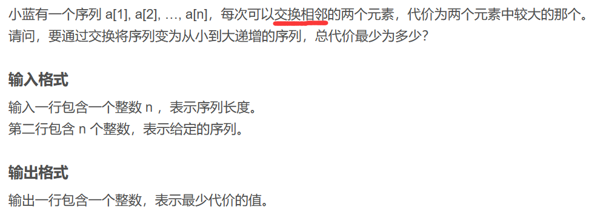

题目思路：


题目代码：

### 题目来源：蓝桥杯-2014省赛-小朋友排队

题目描述：  
 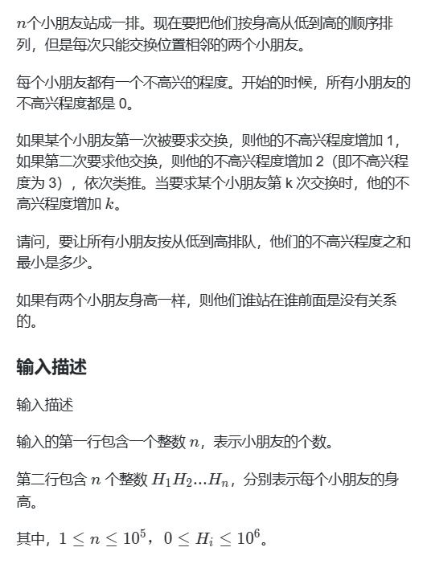

题目思路：


题目代码：

```
#include<bits/stdc++.h>
using namespace std;
const int N=1000010;
typedef long long LL;
int h[N],tree[N],k[N];
int lowbit(int x){return x & -x;}
void update(int x,int d){
    while(x<=N){
        tree[x]+=d;
        x+=lowbit(x);
    }
}
int sum(int x){
    int ans=0;
    while(x>0){
        ans+=tree[x];
        x-=lowbit(x);
    }
    return ans;
}
int main(){
    int n;cin>>n;
    for(int i=1;i<=n;i++){
        cin>>h[i];
        h[i]++;
    }
    for(int i=1;i<=n;i++){
        k[i]=sum(N-1)-sum(h[i]);
        update(h[i],1);
    }
    memset(tree,0,sizeof tree);
    for(int i=n;i;i--){
        k[i]+=sum(h[i]-1);
        update(h[i],1);
    }
    LL res=0;
    for(int i=1;i<=n;i++)
       res+=(LL)k[i]*(k[i]+1)/2;
    cout<<res;
    return 0;
}
```

## No.n 其它

### 题目来源：Acwing-4268-性感素数

题目描述：  
 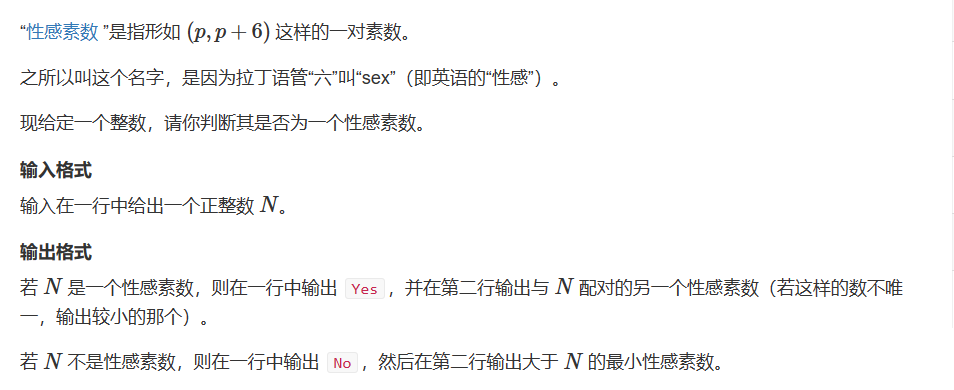

题目思路：

题目代码：

```
//对于N要进行适应性的更改，对于字段错误
#include<bits/stdc++.h>
using namespace std;
#define inf 0x3f3f3f3f
#define N 100100
int n,m,k,g,d;
int x,y,z;
char ch;
string str;
vector<int>v[N];

int isZ(int x){
	if(x<2)return 0;
	for(int i=2;i<=x/i;i++){
		if(x%i==0)return 0;
	}
	return 1;
}

int main() {
	cin>>n;
	if(isZ(n)==1&&(isZ(n-6)||isZ(n+6))){
		cout<<"Yes"<<endl;
		if(isZ(n-6))cout<<n-6<<endl;
		else cout<<n+6<<endl;
	}else{
		cout<<"No"<<endl;
		for(int i=n+1; ;i++){
			if(isZ(i)&&(isZ(i-6)||isZ(i+6))){
				cout<<i<<endl;
				break;
			}
		}
	}
	return 0;
}
```

### 题目来源：Acwing-4461-范围分区

题目描述：  
 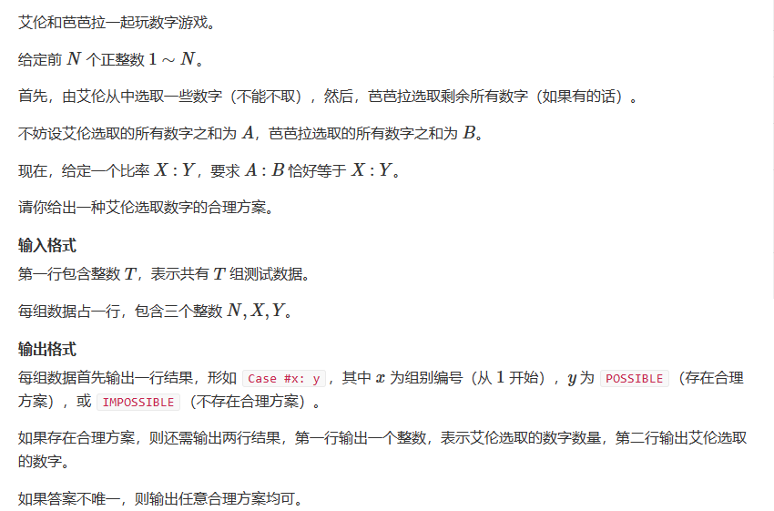

题目思路：

题目代码：

```
#include <iostream>
#include <cstring>
#include <algorithm>

using namespace std;

const int N = 5010;
int n, x, y;
int ans[N]; 

int main()
{
    int T;
    cin >> T;
    for (int t = 1; t <= T; t ++)
    {
        cin >> n >> x >> y;

        int sum = 0; //算出总和 1 - n
        for (int i = 1; i <= n; i ++) sum += i;


        //x , y是一个比例，所以1 -> n的总和加起来除x+y是可以完全除尽的
        //因为如果x跟y的比例不能够让1-n个数的总和除尽(即取模为0)，
        //那就不能够取到[x,y]这种比例的结果
        if (sum % (x + y)) printf("Case #%d: IMPOSSIBLE\n", t);  //不能除尽，就直接输出impossible
        else 
        {
            //这个就是总和除 (x + y)的比例，然后b表示的是比例每一份有多少
            int b = sum / (x + y);   
            memset(ans, 0, sizeof ans);  //记录选取的每一个数，多组数据，每一次清零
            printf("Case #%d: POSSIBLE\n", t);  //成功输出

            int cnt = 0;    //艾伦选取的个数
            int s = x * b;   //x是艾伦的比例， 比例 乘以 每份比例的数量就是艾伦选取的数的总数
            //然后从后往前选n -> 1，因为如果从头选，你就有可能选不到
            //比如样例n=8,x=3,y=6;
            //1-8总和是36, 每一份比例是b = 8/(3+6) = 4
            //x比例是3，每一份b是4，所以艾伦选的数的总和是3*4=12，
            //然后从1-n中选取能够加起来是12的数，12345678，这样看来加完前面1+2+3+4=10 不够12
            //这样就不能够成功取到
            //如果从后面往前87654321，可以取到8+4就可以直接取到了
            for (int i = n; i >= 1; i --)   
            {
                if (s >= i) //s表示艾伦取的总数，然后每一次取小于s的数
                {
                    ans[cnt ++] = i; 
                    s -= i;    //然后取到一个数记录下来，然后累减这个数
                }
            }

            cout << cnt << endl; // 输出个数
            for (int i = 0; i < cnt; i ++)  //输出记录下来的每个数
                cout << ans[i] << ' ';
            cout << endl;
        }
    }
}
```

### 题目来源：Acwing-3307-破纪录者

题目描述：  
 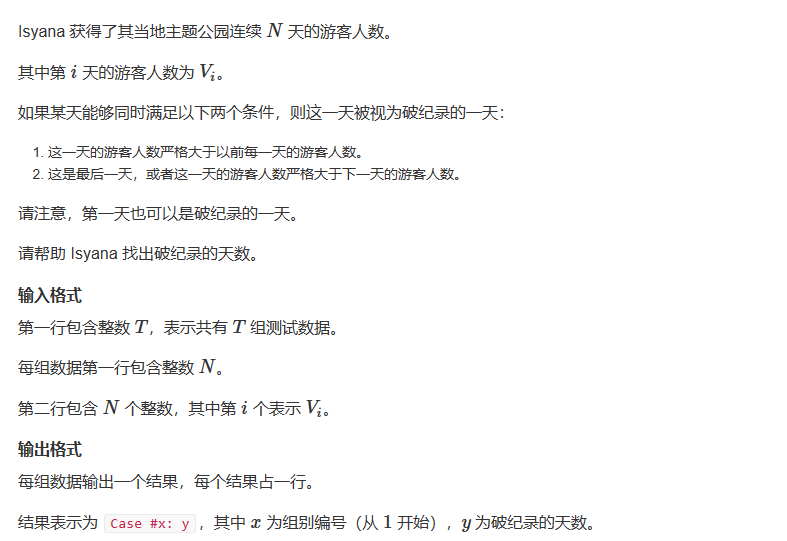

题目思路：

题目代码：

```
//对于N要进行适应性的更改，对于字段错误
#include<bits/stdc++.h>
using namespace std;
#define inf 0x3f3f3f3f
#define N 100100
long long n,m,k,g,d;
int x,y,z;
char ch;
string str;
vector<int>v[N];

int main() {
	cin>>n;
	int res=0;
	int maxx=0;
	for(int i=1;i<=n;i++){
		cin>>x;
		res=0;
		maxx=0;
		int a[x+1];
		for(int j=1;j<=x;j++){
			cin>>a[j];
		}
		for(int j=1;j<=x;j++){
			if(j==1){
				maxx=max(maxx,a[j]);
				if(a[j]>a[j+1]){
					res++;
				}
			}else if(j==x){
				if(a[j]>maxx)res++;

			}else{
				if(a[j]>maxx&&a[j]>a[j+1]){
					res++;
				}
				maxx=max(a[j],maxx);
			}

		}
		cout<<"Case #"<<i<<": "<<res<<endl;
	}
	return 0;
}
```

### 题目来源：蓝桥杯-四平方和

题目描述：  
 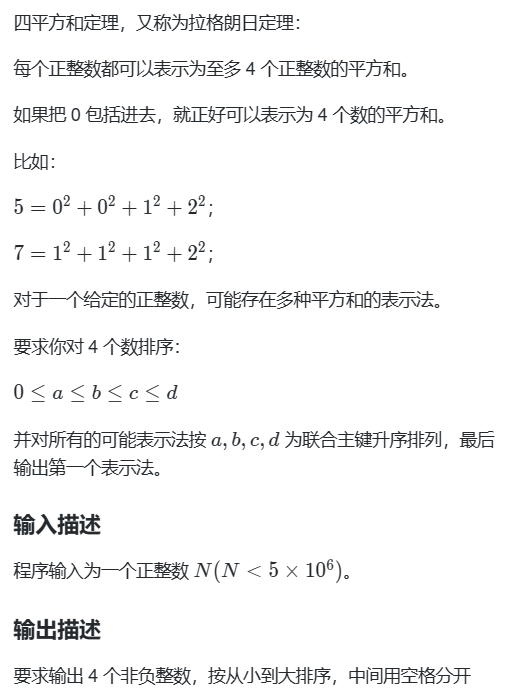

题目思路：

题目代码：

```
#include <bits/stdc++.h>
using namespace std;

int main() // 暴力。 
{
    int n, a, b, c, d, flag = 0;
    while (cin >> n){
        flag = 0;
        int temp = sqrt(n) + 1;

        for (a = 0; a <= temp; a++) {
            if (a*a > n) break;
            for (b = a; b <= temp; b++) { //
                if (a*a + b*b > n) break;
                for (c = b; c <= temp; c++) {
                    if (a*a + b*b + c*c > n) break;
                    for (d = c; d <= temp; d++) {
                        if (a*a + b*b + c*c + d*d == n) {
                            cout << a << ' ' << b << ' ' << c << ' ' << d << endl;
                            flag = 1;
                            break;
                        }
                        if (a*a + b*b + c*c + d*d > n) break;
                    }
                    if (flag) break;
                }
                if (flag) break;
            }
            if (flag) break;
        }
    }
}
```

### 题目来源：蓝桥杯-2022省赛模拟-平方和拆分

题目描述：

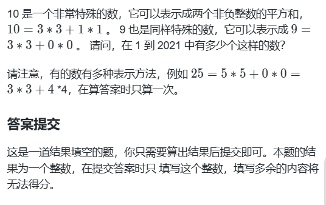

题目思路：


题目代码：

```
#include <iostream>
#include<math.h>
using namespace std;
bool check(int x){
  for(int i=0;i<=x/2;i++){//平方和的数包含零
    int a=sqrt(x-i*i);
    if(x==i*i+a*a){
      return true;
    }
  }
  return false;
}
int main()
{
  // 请在此输入您的代码
  int sum=0;
  for(int i=1;i<=2021;i++){//判断的数不包括0
    if(check(i)){
      sum++;
    }
  }
  cout<<sum<<endl;
  return 0;
}
```

### 题目来源：蓝桥杯-2013省赛-幸运数

题目描述：  
 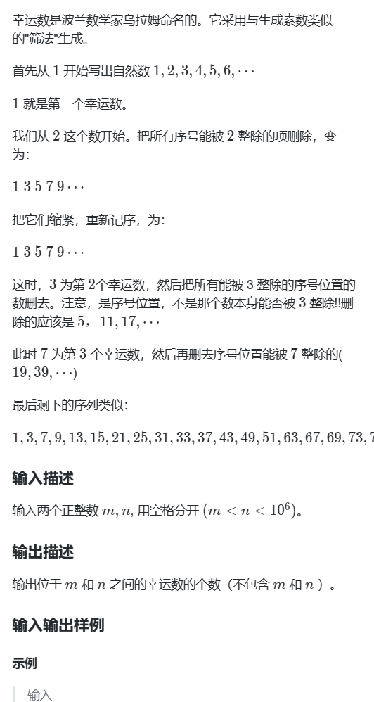

题目思路：


题目代码：

```
#include <iostream>
using namespace std;
int m,n;
const int N=1e6+10;
int a[N];
void dfs(int luck){
    if(luck>n)return;
    int k=luck;
    for(int i=luck;i<=n;i++)
    {
      if(i%a[luck])
      a[k++]=a[i];
    }
    dfs(luck+1);
}
int main()
{
  cin>>m>>n;
  for(int i=1;i<=n;i++)
   a[i]=i*2-1;
  dfs(2);
  int res=0;
  for(int i=1;a[i]<n;i++)
    if(a[i]>m)res++;
   cout<<res<<endl;
  return 0;
}
```

### 题目来源：蓝桥杯-2014省赛-蚂蚁感冒

题目描述：  
 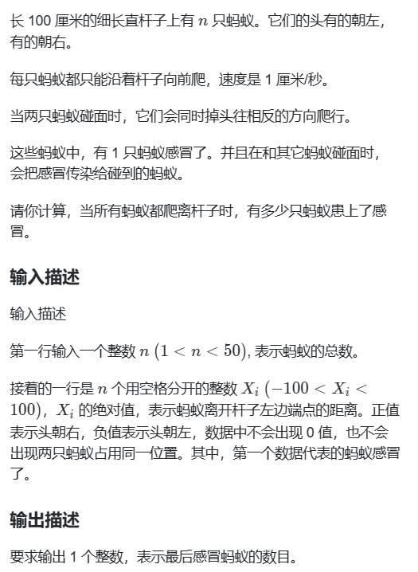

题目思路：


题目代码：

```
#include<cstdio>
#include<cmath>
#include <iostream>
using namespace std;

const int N =55;
int n,x[N];
int main()
{
  //掉头可以直接等价位原路继续前进
  cin>>n;
  for(int i=0;i<n;i++) cin>>x[i];

  int left_R=0 ,right_L=0; //分别表示左边向右走和右边向左走的蚂蚁数量
  for(int i=1;i<n;i++)
    if(abs(x[i])<abs(x[0])&&x[i]>0) left_R++;  //在左边向右走
    else if(abs(x[i])>abs(x[0])&&x[i]<0) right_L++;  //在右边向左走

  //如果感冒蚂蚁向右（左），右（左）边没有一只向左（右）走的蚂蚁，必然感染不了
  if(x[0]>0&&right_L==0||x[0]<0&&left_R==0) cout<<'1'<<endl;
  //否则，感冒的蚂蚁会把和他对着走的蚂蚁感染，而这些被感染的蚂蚁又会将向着他们的蚂蚁感染了
  else cout<<left_R+right_L+1<<endl;
  return 0;
}
```

### 题目来源：蓝桥杯-2019省赛-最大降雨量

题目描述：  
 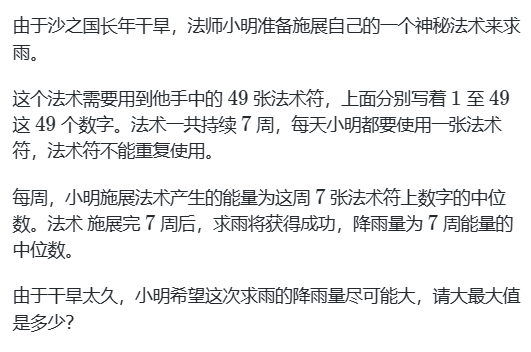

题目思路：


题目代码：

```
/*每周的能量为该周符数的中位数
   降雨量为7周能量的中位数，即第4周的中位数 
   求最大降雨量，只需使第4周的中位数尽可能的大
   即使最后3周的每周的后4天和第4周的后3天为极大值，可得解
*/
#include <iostream>
using namespace std;
int main()
{
  cout<<49-15<<endl;
  return 0;
}
```
