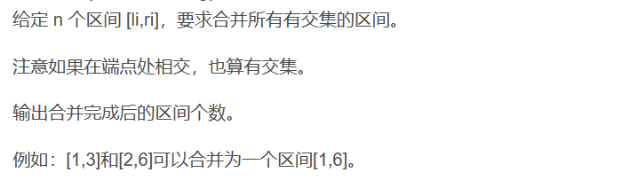
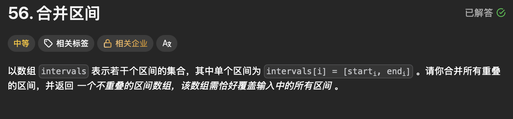
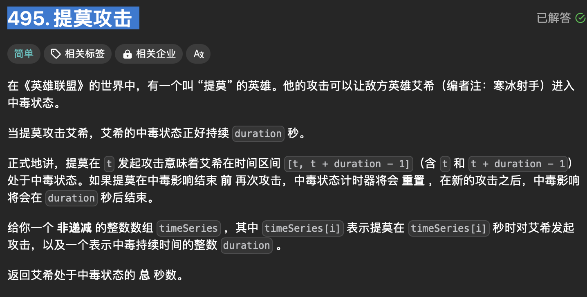

#### 目录

- [知识框架](#_2)
- [No.0 筑基](#No0__4)
- [No.1 区间数组](#No1__40)
- - [题目来源：Acwing-803. 区间合并](#Acwing803__48)
  - [题目来源：LeetCode-56. 合并区间](#LeetCode56__117)
- [No.2 数字数组](#No2__176)
- - [题目来源：LeetCode-495. 提莫攻击](#LeetCode495__179)

## 知识框架

## No.0 筑基

> 请先学习下知识点，道友！  
>  题目知识点大部分来源于此：
>
> 题目例题大部分来源于此：  
>  Y总的模板来自Acwing如下：

```cpp
// 将所有存在交集的区间合并
void merge(vector<PII> &segs)
{
    vector<PII> res;

    sort(segs.begin(), segs.end());

    int st = -2e9, ed = -2e9;
    for (auto seg : segs)
        if (ed < seg.first)
        {
            if (st != -2e9) res.push_back({st, ed});
            st = seg.first, ed = seg.second;
        }
        else ed = max(ed, seg.second);

    if (st != -2e9) res.push_back({st, ed});

    segs = res;
}
```

## No.1 区间数组

### 题目来源：Acwing-803. 区间合并

题目描述：  
 

题目思路：


题目代码：

```cpp
#include <iostream>
#include <algorithm>
#include <vector>

using namespace std;

typedef pair<int, int> PII;

int n, l, r;
vector<PII> segs;

void merge(vector<PII> &segs)
{
    vector<PII> res;
    
    sort(segs.begin(), segs.end());//按区间左端点排序，sort默认排序segs的第一项
    
    int st = -2e9, ed = -2e9;//此时st和ed只要比-1e9小就可以
    for (auto seg : segs)
    {
        if (ed < seg.first)
        {
            if (st != -2e9) res.push_back({st, ed});
            st = seg.first;
            ed = seg.second;
        }
        else ed = max(ed, seg.second);
    }
    
    if (st != -2e9) res.push_back({st, ed});
    
    segs = res;//不能忘
}

int main()
{
    cin >> n;
    
    for (int i = 0; i < n; i ++ )
    {
        cin >> l >> r;
        segs.push_back({l, r});
    }
    
    merge(segs);
    
    cout << segs.size() << endl;
    
    return 0;
}//该代码引用AcWing网站的代码
```

### 题目来源：LeetCode-56. 合并区间

题目描述：  
 

题目思路：

> 贪心？

题目代码：

```cpp
class Solution {
public:
    vector<vector<int>> merge(vector<vector<int>>& intervals) {
        int n = intervals.size();
        if(n == 0)return {};
        
        //很明显的区间合并；
        // 先根据。起始点start进行排序
        vector<pair<int, int>>ans;
        for(auto &inter : intervals){
            ans.push_back(pair<int, int>(inter[0], inter[1]));
        }
        sort(ans.begin(), ans.end());


        vector<vector<int>>res;
        res.push_back({ans[0].first, ans[0].second});

        for(int i = 1; i < n; i++){
            auto &last_res = res.back();
            auto &last_start = last_res[0];
            auto &last_end = last_res[1];

            auto now_ans = ans[i];
            auto now_start = now_ans.first;
            auto now_end = now_ans.second;

            if(now_start <= last_end){
                if(now_end < last_end){
                    continue;
                }else{
                    last_end = now_end;
                }
            }else{
                res.push_back({now_start, now_end});
            }
        }
        return res;
    }
};
```

## No.2 数字数组

### 题目来源：LeetCode-495. 提莫攻击

题目描述：  
 

题目思路：

> 感觉像是 区间合并，但是 贪心也行吧

题目代码：

```cpp
class Solution {
public:
    int findPoisonedDuration(vector<int>& timeSeries, int duration) {
        int n = timeSeries.size();
        if(n == 0)return 0;

        //   sort(timeSeries.begin(), timeSeries.end());
        // 非递减;

        int res = 0;
        int end = timeSeries[0] + duration;
        res = duration;

        for(int i = 1; i < n; i++){
            auto now_end = timeSeries[i] + duration;
            auto now_se = timeSeries[i];
            if(now_se <= end){
                // 无间隙续上
                res = res + (now_end - end);
            }else{
                // 没有续上
                res = res + duration;
            }
            // 新的end
            end = now_end;
        }
        return res;
    }
};
```
