#### 目录

- [知识框架](#_2)
- [No.0 筑基](#No0__4)
- [No.1 简单贪心](#No1__10)
- - [题目来源：LeetCode-121. 买卖股票的最佳时机](#LeetCode121__13)
  - [题目来源：LeetCode-55. 跳跃游戏](#LeetCode55__71)
  - [题目来源：LeetCode-45. 跳跃游戏 II](#LeetCode45__II_162)
  - [题目来源：LeetCode-763. 划分字母区间](#LeetCode763__284)
  - [题目来源：PTA-L2-017 人以群分](#PTAL2017__373)
  - [题目来源：PTA-L1-088 静静的推荐](#PTAL1088__422)
  - [题目来源：蓝桥杯-2022省赛-修剪灌木](#2022_536)
  - [题目来源：蓝桥杯-2013省赛-翻硬币](#2013_571)
  - [题目来源：蓝桥杯-2018省赛-付账问题](#2018_620)
  - [题目来源：蓝桥杯-2019省赛-扫地机器人](#2019_669)
- [No.2 贪心交换次数](#No2__736)
- - [题目来源：蓝桥杯-第七届-交换瓶子](#_737)
  - [题目来源 LeetCode-1007.行相等的最少多米诺旋转](#_LeetCode1007_774)
- [No.3 贪心-投资](#No3__875)
- - [题目来源：LeetCode-502-IPO](#LeetCode502IPO_876)

## 知识框架

## No.0 筑基

> 请先学习下知识点，阁下！  
>  题目大部分来源于此：[代码随想录：贪心](https://www.programmercarl.com/%E8%B4%AA%E5%BF%83%E7%AE%97%E6%B3%95%E7%90%86%E8%AE%BA%E5%9F%BA%E7%A1%80.html)

## No.1 简单贪心

### 题目来源：LeetCode-121. 买卖股票的最佳时机

题目描述：  
 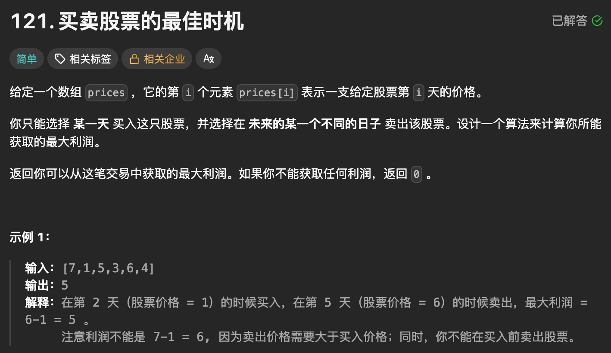

题目思路：


题目代码：

```
class Solution {
public:
    int maxProfit(vector<int>& prices) {
        //这个的话就是 left_min记住吧

        // 这个有点像是双指针里面的 维护左边， 然后for右边
        int left_min = INT_MAX;
        int n = prices.size();
        int res = 0;
        int left = 0, right = 0;
        for(right = 0; right < n; right++){
            res = max(res, prices[right] - left_min);

            left_min = min(left_min, prices[right]);
        }
        return res;
    }
};


class Solution {
public:
    int maxProfit(vector<int>& prices) {

        //i, j 并且 i < j 且，max(p[j] - p[i]);
        int maxx = 0;
        int n = prices.size();
        std::vector<int>dp(n, 0);
        int minn = 0x3f3f3f3f;
        for(int i = 0; i < n; i++){
            if(prices[i] < minn){
                minn = prices[i];
            }else{
                dp[i] = prices[i] - minn;
                maxx = max(maxx, dp[i]);
            }
        }
        return maxx;
        
    }
};
```

### 题目来源：LeetCode-55. 跳跃游戏

题目描述：  
 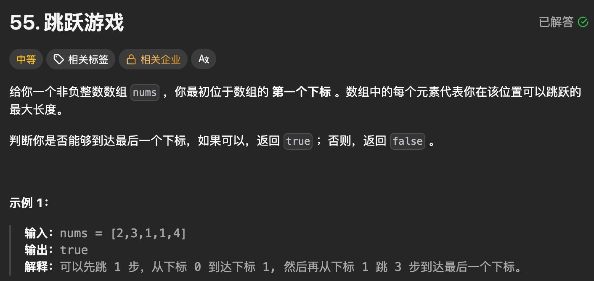

题目思路：

> 一开始想复杂了

题目代码：

```
class Solution {
public:
    bool canJump(vector<int>& nums) {
        // 维护最右可以到达的位置 rmx
        // 每个下标都判断是否能到达
        int right_max = 0;
        int n = nums.size();
        int right = 0;
        for(right = 0; right < n; right++){
            if(right > right_max)return false;
            right_max = max(right_max, right + nums[right]);
        }
        return true;
    }
};


class Solution {
public:
    bool canJump(vector<int>& nums) {
        int n = nums.size();
        if(n == 1) return true;
        vector<int>dp(n, 0);
        // 最大能到达的位置
        dp[0] = nums[0];

        for(int i = 1; i < n; i++){
            if(dp[i - 1] >= i){
                dp[i] = max(i + nums[i], dp[i - 1]);
            }else{
                return false;
            }
        }
        return dp[n - 1];
    }
};


class Solution {
public:
    bool canJump(vector<int>& nums) {

        int n = nums.size();
        if(n == 1)return true;
        if(nums[0] == 0)return false;
        // 动态规划：dp[n]  还能往后的最大
        // 转移公式呢？ 
        // std::vector<int>dp(n,0);
        // dp[0] = nums[0];
        // for(int i = 1; i < n; i++){
        //     dp[i] = nums[i];
        //     if(i - nums[i] >=0){
        //         dp[i] = dp[i] + dp[i - nums[i]] - (i - nums[i]);
        //     }
        // }
        // if(dp[n - 2]>=1)return true;
        // return false;
        
        // 因为每次到对应的位置之后就是归0了
        // maxx即是以往到达的最大位置, 利用下标算的，即 n - 1 位置。
        int maxx = 0;
        for(int i = 0; i < n - 1; i++){
            if(i > maxx)return false;
            maxx = max(maxx, i + nums[i]);
            if(i + nums[i] >= (n - 1)){
                return true;
            }
        }
        return false;
    }
};
```

### 题目来源：LeetCode-45. 跳跃游戏 II

题目描述：  
 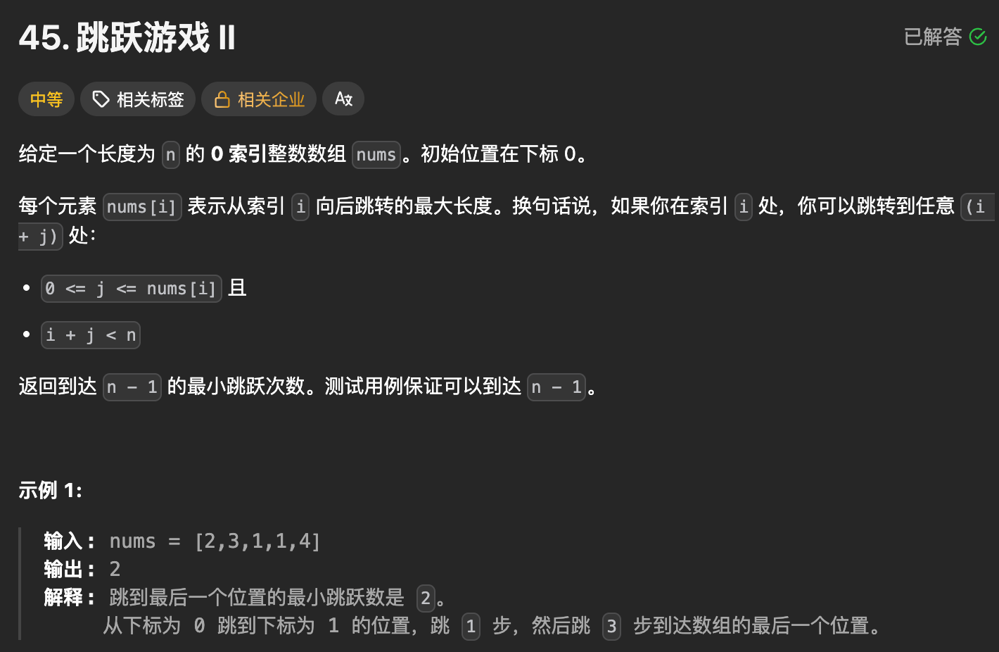

题目思路：

> 贪心即可

题目代码：

```
class Solution {
public:
    int jump(vector<int>& nums) {
        // 测试用例保证可以到达 n - 1
        // 所以每个位置都可以到达。
        // 如果还是维持一个 rmx
        // rmx 就 num++
        // 必须走到自己的尽头。
        int n = nums.size();
        if(n == 1)return 0;

        int right_max = 0;
        int cur_start = 0, cur_end = 0;
        int res = 0;
        int right = 0;
        for(right = 0; right < n - 1; right++){
            right_max = max(right_max, right + nums[right]);

            if(right == cur_end){
                res++;
                cur_end = right_max;
            }
        }
        return res;
    }
};


class Solution {
public:
    int jump(vector<int>& nums) {
        // 测试用例保证可以到达 n - 1
        // 所以每个位置都可以到达。
        // 如果还是维持一个 rmx
        // rmx 就 num++
        // 必须走到自己的尽头。
        int n = nums.size();
        if(n == 1)return 0;
        int right_max = nums[0];
        int cur_right_max =nums[0];
        int res = 0;
        int j = 0;
        for(int i = 1; i < n; ){
            for(j = i; j <= cur_right_max && j < n; j++){
                right_max = max(right_max, j + nums[j]);
            }
            // 这里是因为 退出for循环的时候 j>cur_right_max了。
            i = j; 
            res++;
            cur_right_max = right_max;
        }
        return res;
    }
};


class Solution {
public:
    int jump(vector<int>& nums) {


        int n = nums.size();
        if(n <= 1)return 0;
        std::vector<int>dp(n + 1, 0);

        // 每一次你都应该跳的更远，并且由于可以保证达到 n - 1，即每个位置都是可达的
        // 替换
        // 如果记录下每个位置最大能到的地方

        for(int i = 0; i < n; i++){
            dp[i] = i + nums[i];
        }
        // 主要是这个记录每次 可到达的最远的地方


        int maxx = 0;
        int next_pos = 0;
        int res_step = 0;
        for(int i = 0; i < n; i++){
            if(i == n - 1)break;
            if (dp[i] >= n - 1) {
                res_step++;
                break;
            }
            if(i == next_pos){
                maxx = 0;
                for(int j = i + 1; j <= dp[i] && j < n; j++){
                    if(dp[j] > maxx){
                        maxx = dp[j];
                        next_pos = j;
                    }
                }
                res_step++;
            }
        }
        return res_step;
    }
};
```

### 题目来源：LeetCode-763. 划分字母区间

题目描述：  
 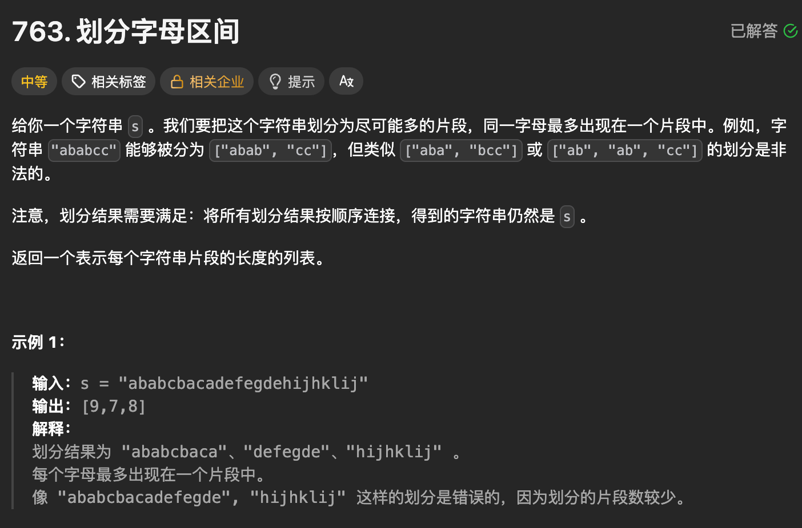

题目思路：

> 一般字母的就是进行统计个数，然后进行操作/  
>  但是最好按照这个贪心的思路进行吧。

题目代码：

```
class Solution {
public:
    vector<int> partitionLabels(string s) {
        // 记录每个字母出现的最右边的位置？
        // 以及 开始位置。
        // 有点像区间合并了。
        // 为了就一个for循环。
        // 对于每个位置的字母 可以先得到其right_max;
        int n = s.size();
        unordered_map<char, int> mp;
        for (int i = 0; i < n; i++) mp[s[i]] = i;

        vector<int> res;
        int cur_start = 0, cur_end = 0;
        int right_max = 0;
        int right = 0;
        for(right = 0; right < n; right++){
            right_max = max(right_max, mp[s[right]]);

            if(right == right_max){
                res.push_back(right - cur_start + 1);
                cur_start = right + 1;
            }
        }
        return res;
    }
};


class Solution {
public:
    vector<int> partitionLabels(string s) {
        // 还是利用 2*O(n)
        vector<int> res;
        int n = s.size();
        if (n == 0) return res;
        // 直接第一遍记录每个字母的个数，
        // 然后贪心的进行,已经出现的变为0 
        // 你的思路：统计次数
        map<char, int> cnt;
        for (char c : s) cnt[c]++;

        map<char, int> cur;
        int len = 0;

        for (char c : s) {
            cur[c]++;
            len++;

            // 判断：当前所有字符都已用完
            bool ok = true;
            for (auto& p : cur) {
                if (p.second != cnt[p.first]) {
                    ok = false;
                    break;
                }
            }

            if (ok) {
                res.push_back(len);
                cur.clear();
                len = 0;
            }
        }
        return res;

    }
};
```

### 题目来源：PTA-L2-017 人以群分

题目描述：  
 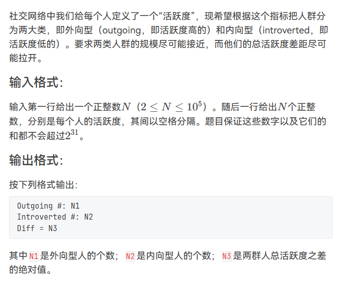

题目思路：

题目代码：

```
升序排序然后直接算差值就行，如果个数奇数一定是外向的比内向的多一个。
#include<bits/stdc++.h>
using namespace std;
#define inf 0x3f3f3f3f
#define N 100100
int n,m,k,g,d;
int x,y,z;
int num[N]={0};
int main() {
    cin>>n;
    for(int i=0;i<n;i++){
        cin>>num[i];
    }
    sort(num,num+n);
    int peo=0;
    int ple=0;
    if(n%2==0){
        peo=n/2;
        ple=peo;
    }else{
        peo=n/2;
        ple=n-peo;
    }
    
    int sum1=0;
    int sum2=0;
    for(int i=0;i<peo;i++){
        sum1=sum1+num[i];
    }
    for(int i=peo;i<n;i++){
        sum2=sum2+num[i];
    }
    cout<<"Outgoing #: "<<ple<<endl;
    cout<<"Introverted #: "<<peo<<endl;
    cout<<"Diff = "<<sum2-sum1<<endl;
	return 0;
}
```

### 题目来源：PTA-L1-088 静静的推荐

题目描述：  
 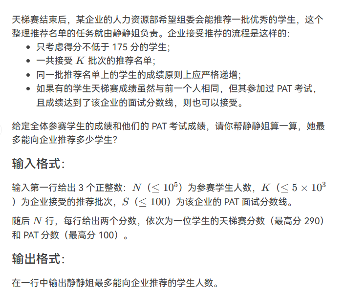

题目思路：


题目代码：

```
//对于N要进行适应性的更改，对于字段错误
#include<bits/stdc++.h>
using namespace std;
#define inf 0x3f3f3f3f
#define N 100100
int n,m,k,g,d;
int x,y,z,t;
char ch;
string str;
vector<int>v[N];
int s;
int main() {
    cin>>n>>k>>s;
    map<int,int>mp;
    set<int>sc;
    int ans = 0;
    // 算不能去的人数就行了
    for(int i=0;i<n;i++){
        cin>>x>>y;
        if(x<175){
            ans++;
        }else{
            if(y<s&&mp[x]>=k){
                ans++;
            }else{
                if(y<s){
                    mp[x]++;
                }
            }

        }
    }
    cout<<n-ans<<endl;
    

	return 0;
}


//正常计算可以去的
#include<bits/stdc++.h>
using namespace std;
#define inf 0x3f3f3f3f
#define N 505000
// 下面这两个的使用；； 
#define  debug(x) cout<<#x<<" = "<<x<<endl;
#define PII pair<int,int>
int n,m,k,s,g,d;
int x,y,z;
char ch;
string str;
vector<int>v[N];
struct node{
	int tianti;
	int pta;
}stu[N];


int main()
{	
	
	
	// 得分>=175  k ci  成绩 递增 每批次不能相同成绩  pta考试+面试成绩 
	set<int>fenshu;
	cin>>n>>k>>s;
	if(k==0){
		cout<<0<<endl;
		return 0;
	}
	for(int i=1;i<=n;i++){
		cin>>stu[i].tianti>>stu[i].pta;
		fenshu.insert(stu[i].tianti);
	} 

	int res=0;
	for(auto uu:fenshu){
		if(uu<175)continue;
		int renshu=0;
		
		for(int i=1;i<=n;i++){
			if(stu[i].tianti==uu&&stu[i].pta>=s){
				res++;
				continue;
			}
			if(stu[i].tianti==uu&&stu[i].pta<s){
				renshu++;
			}
		}
		if(renshu<=k)res=res+renshu;
		else res=res+k;
		
	}
	cout<<res<<endl;
    return 0;
}
```

### 题目来源：蓝桥杯-2022省赛-修剪灌木

题目描述：  
 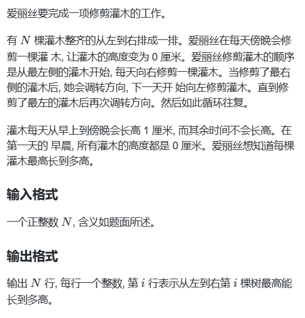

题目思路：


题目代码：

```
#include <iostream>
using namespace std;
/*
假设点i刚被修剪完为0，然后会向右/向左跑一趟，端点会被遍历1次，i与端点间的点会被遍历两次
而重新修剪i的当天早上（因为是傍晚修剪，所以当天也会被算上）达到最大高度，然后置零
也就是说：`最大长度=中间节点数*2+1（端点）+1（自生）==max(左边/右边节点数)*2`
左边端点数：i-1
右边端点数：n-i
*/
int main()
{
  int n;
  cin>>n;

  for(int i = 1;i<=n;i++) cout<<max(i-1,n-i)*2<<endl;

  return 0;
}
```

### 题目来源：蓝桥杯-2013省赛-翻硬币

题目描述：  
 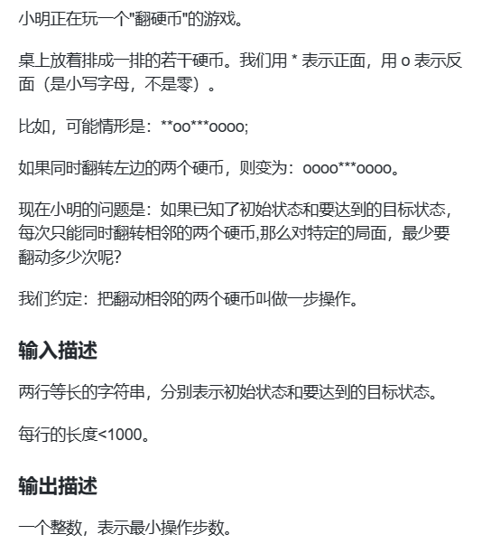

题目思路：


题目代码：

```
//对于N要进行适应性的更改，对于字段错误
#include<bits/stdc++.h>
using namespace std;
#define inf 0x3f3f3f3f
#define N 100100
long long n,m,k,g,d,t;
int x,y,z;
char ch;
string str;
vector<int>v[N];

int day[13]={0,31,28,31,30,31,30,31,31,30,31,30,31};

int main() {
	int res=0;
	string s1,s2;
	cin>>s1>>s2;
	for(int i=0;i<s1.size()-1;i++){
		if(s1[i]==s2[i])continue;
		res++;
		s1[i]=s2[i];
		if(s1[i+1]=='o'){
			s1[i+1]='*';
		}else if(s1[i+1]=='*'){
			s1[i+1]='o';
		}
	}
	cout<<res<<endl;
	
	

	return 0;
}
```

### 题目来源：蓝桥杯-2018省赛-付账问题

题目描述：  
 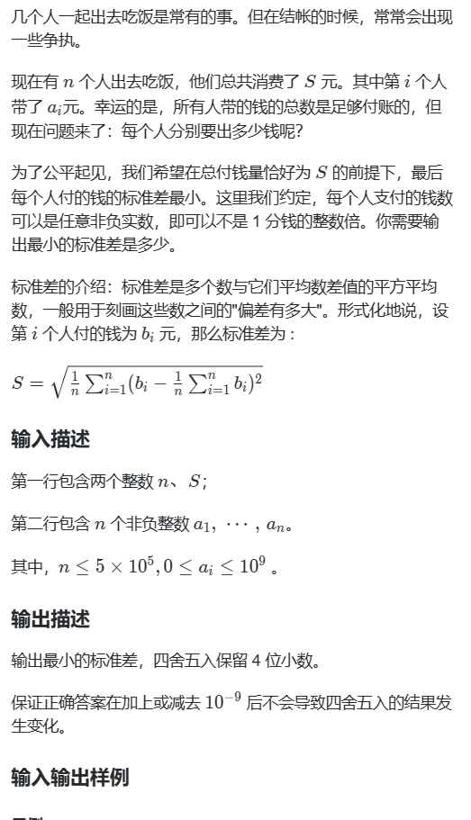

题目思路：

> 1/其实标准差最小的意思也就是让每个人出的钱都尽量靠近平均数  
>  2/钱不够平均数的人把钱都拿出来，钱多于平均数的人把前面的人没给出来的钱平均分一下  
>  2/先从小到大排序，然后从钱最少的人开始遍历，如果这个人钱不够平均数，那么就让他全部交出来，同时总钱数减去他的钱数，其方差就是 (这个人的钱-average)2 ，如果扫到这个人钱已经足够了，那么他之后所有的人钱都够了，遍历结束，剩余每个人的方差为（剩余的总钱数/剩余人数-average)2；  
>  3/最后要做的，就是在得到方差的基础上求出题目要求的标准差。

题目代码：

```
#include <bits/stdc++.h>
using namespace std;
 
long long a[500010];
 
int main() {
    int n;
    long long s;
    cin >> n >> s;
    for (int i = 0; i < n; i++) {
        cin >> a[i];
    }
    //开始贪心选择
    sort(a, a + n); //排序，从小到大
    double avg = 1.0 * s / n;
    double sum = 0.0;
    for (int i = 0; i < n; i++) {
        if (a[i] * (n - i) < s) { //把钱全拿出的人
            sum += (a[i] - avg) * (a[i] - avg);
            s -= a[i]; //更新还差多少钱
        } else { //不需要把钱全拿出的人。剩下的人中，钱最少的人都可以达到cur_avg
            double cur_avg = 1.0 * s / (n - i); //注意这里的s是还差多少钱
            sum += (cur_avg - avg) * (cur_avg - avg) * (n - i); //如果这个人有钱付，那么后面的人一定也能付，所以直接乘后面的人数(n - i)即可
            break;
        }
    }
    printf("%.4f", sqrt(sum / n));
 
    return 0;
}
```

### 题目来源：蓝桥杯-2019省赛-扫地机器人

题目描述：

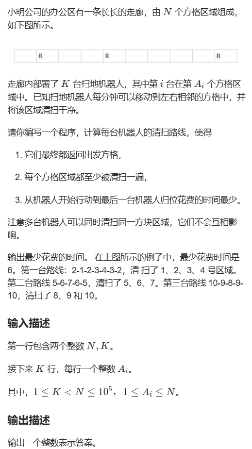

题目思路：


题目代码：

```
/*
解题思路：不用遍历所有机器人的运动轨迹，只需要求出单个机器人花的最大时间
即可完成本题，利用二分查找查找最大时间
步骤：
1.利用二分查找每次分两个区域
2.定义检查函数检查是否扫完
3.在函数体内遍历每个机器人一次性扫多少个地，这个地我们用x表示，求出最小x即可
在定义一个s代表扫了多少个地，遍历完在判断s是否>=n即可，
由于每个机器人扫的地都一样，所以最后的结果一定会>=n
4.那个最小的x就是我们的最终结果
*/

#include <iostream>
#include <algorithm>
using namespace std;
const int N = 1e5 + 10;
int n, k;
int pos[N];
bool check(int x){  //x代表一次性扫多少个地 
    /*cout << x<<endl;*/
    int s = 0;      //表示一共扫了多少地
    for(int i = 0; i < k; i++) {
        //当前扫不了 需要更大的距离才能扫
        if (pos[i]-x>s)   return false;
        if (pos[i]<= s)  s = pos[i] + x - 1;
        else              s += x;
    /*    cout << "i:" << i << "  pos[i]:" << pos[i] << "  s:" << s << endl;*/
    }
    /*cout << endl;*/
    return s>=n;
}
int main() {
    cin >> n >> k;
    for (int i = 0; i < k; i++)
    {
        cin >> pos[i];
    }
    sort(pos,pos+k);
    int left = 0, right = n;  //计算单例机器人的过程
    while (left < right) {
        int mid = (left + right) / 2;
        if (check(mid))  //如果当前距离合格 在往小的里面找合格的
            right = mid;
        else            //当前不合格  说明往大的找
            left = mid + 1;
    }
    cout << (left-1) * 2<<endl;
    return 0;


}
```

## No.2 贪心交换次数

### 题目来源：蓝桥杯-第七届-交换瓶子

题目描述：  
 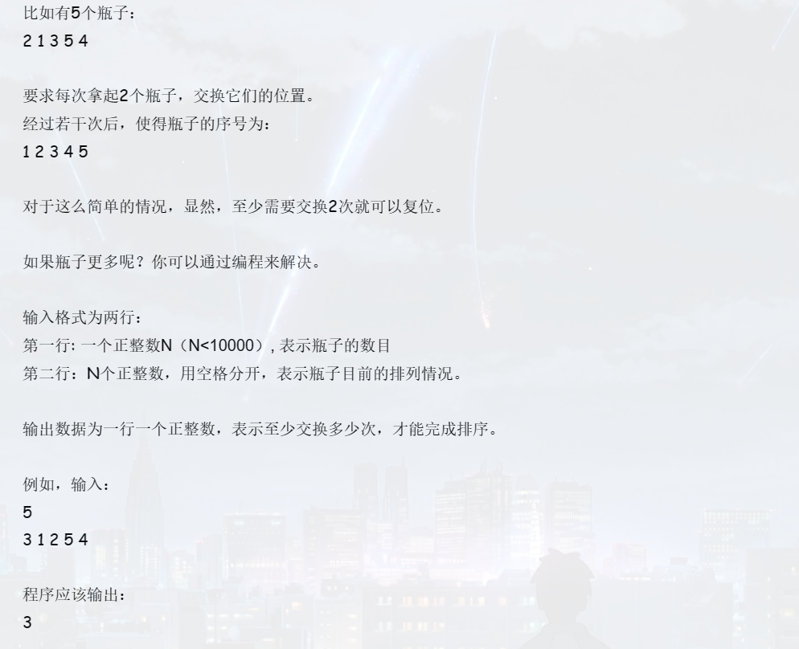

题目思路：

> 贪心的思想，但是最后好像就是 交换排序。或者是找时间复杂度最小的 排序算法。

题目代码：

```
#include<iostream>
using namespace std;
int main(){
	int n;
	cin>>n;
	int a[n+5];
	for(int i=0;i<n;i++)
	    cin>>a[i];
	int min;
	int num=0;
	for(int i=0;i<n;i++){
		min=i;
		for(int j=i+1;j<n;j++){//找最小的 
			if(a[min]>a[j])
			    min=j;
		}
		if(min!=i){
			num++;
			swap(a[i],a[min]);
		}
	}
	cout<<num<<endl;
	return 0;
}
```

### 题目来源 LeetCode-1007.行相等的最少多米诺旋转

题目描述：

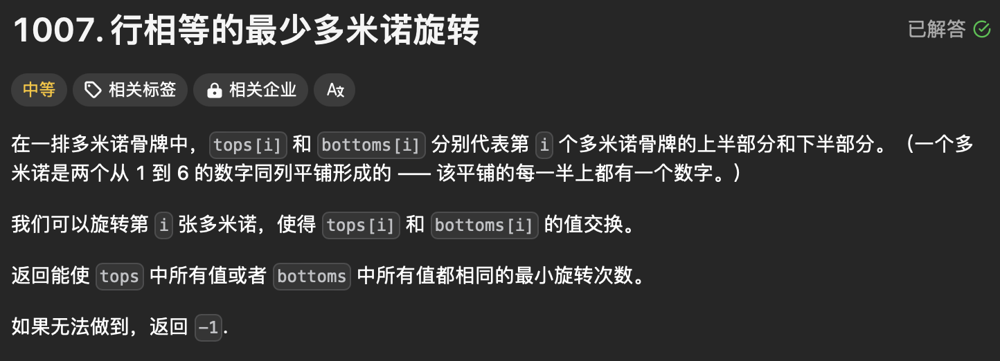

题目思路：


题目代码：

```
class Solution {
public:
    int fnums(const vector<int>& tops, const vector<int>& bottoms, const int target){
        int to_top = 0, to_bottom = 0;
        for(int i = 0; i < tops.size(); i++){
            if(tops[i] != target && bottoms[i] != target){
                return INT_MAX;
            }
            if(tops[i] == target && bottoms[i] != target){
                to_bottom++;
            }
            if(tops[i] != target && bottoms[i] == target){
                to_top++;
            }
        }
        return min(to_top, to_bottom);

    }
    int minDominoRotations(vector<int>& tops, vector<int>& bottoms) {
        // 这部分是因为必定和 tops[0] 或者 bottoms[0]的数字一样。
        // 所以就是四种情况 
        // 1:tops 全部和tops[0]一样的旋转次数
        // 2:tops 全部和bottoms[0]一样的旋转次数
        // 3:bottoms 全部和tops[0]一样的旋转次数
        // 4:bottoms 全部和bottoms[0]一样的旋转次数
        auto res1 = fnums(tops, bottoms, tops[0]);
        auto res2 = fnums(tops, bottoms, bottoms[0]);
        auto res = min(res1, res2);
        if(res == INT_MAX)return -1;
        return res;
        
    }
};


class Solution {
public:
    int minDominoRotations(vector<int>& tops, vector<int>& bottoms) {
        // 判断 -1 就是这次遍历的跟前面遍历的是否有不一样的。
        // 判断翻转次数的话： min(top , bottom)
        // 因为 1<= <=6 那么就可以不使用set，直接进行for了
        

        // 不够完美，因为是根据 错误一直在调试的。
        // 总体就是找到最多的那个数字。
        int n = tops.size();
        int ans_top[10] = {0};
        int ans_bottom[10] = {0};
        ans_top[ tops[0] ]++;
        ans_bottom[ bottoms[0] ]++;

        
        for(int i = 1; i < n; i++)
        {
            if(tops[i]!=bottoms[i-1] && tops[i]!=tops[i-1] && bottoms[i]!=tops[i-1] && bottoms[i]!=bottoms[i-1])return -1;

            /// 
            ans_top[ tops[i] ]++;
            ans_bottom[ bottoms[i] ]++;
        }

        int maxx_idx = 0;
        int maxx_num = 0;
        for(int i = 1; i <= 6; i++)
        {
            if(ans_top[i] >= maxx_num){
                maxx_idx = i;
                maxx_num = ans_top[i];
            }
            if(ans_bottom[i] >= maxx_num){
                maxx_idx = i;
                maxx_num = ans_bottom[i];
            }
        }
        if((ans_bottom[maxx_idx]+ans_top[maxx_idx])<n)return -1;
        return n - maxx_num;
    }
};
```

## No.3 贪心-投资

### 题目来源：LeetCode-502-IPO

题目描述：  
 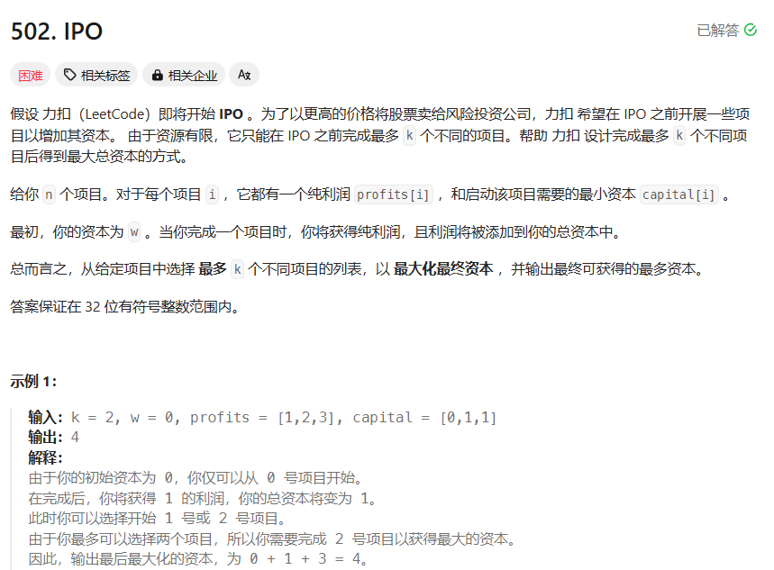

题目思路：

> 肯定是 贪心算法了，就是按照先根据 所需的启动资金进行排序，  
>  因为次数有限，所以不用考虑DP；即进行贪心进行；  
>  那么每次可以根据目前所拥有的资金进行选择最大的利润。  
>  关于为什么 是 int i = 0；在while外面？  
>  因为 前面已经按照资金进行排序了，即当出for循环的时候，前面的都已经加入到大顶堆里面了，就是说大顶堆一直在维护着。

题目代码：

```
class Solution {
public:
    int findMaximizedCapital(int k, int w, vector<int>& profits, vector<int>& capital) {
        vector<pair<int,int>>pc;
        for(int i = 0; i < capital.size(); ++i){
            pc.push_back(make_pair(capital[i], profits[i]));
        }

        // 存储了pair之后进行排序
        sort(pc.begin(),pc.end());

        //每次获得利润之后，
        // 使用一个大顶堆进行维护，因为后期进行加入的话，利润也增加了
        priority_queue<int>q;
        int cnt = 0;
        int i = 0; 
        while(cnt < k){
            // 因为是按照first进行排序的，所以能加入大顶堆的都加入了。
            for(; i < capital.size()&& pc[i].first <=w; i++){
                q.push(pc[i].second);
            }
            //上面已经得到了目前资金可以得到的利润,并且大顶堆排序了
            if(q.empty())break; //项目做完了可做的；
            w = w + q.top();
            q.pop();

            cnt++;
        }
        return w;


    }
};
```
