# 【完整题单11、二叉树】【✅✅✅✅】

> 来源：[【完整题单11、二叉树】【✅✅✅✅】](https://blog.csdn.net/weixin_51429773/article/details/129705622) · 发布时间：2026-06-14 · 阅读量：粉丝可见

#### 目录

- [知识框架](#_1)
- [No.0 筑基](#No0__2)
- - [一、递归](#_8)
  - [二、迭代](#_36)
  - [三、层序](#_126)
- [No.1 二叉树的性质题目](#No1__358)
- - [题目来源：LeetCode-94. 二叉树的中序遍历](#LeetCode94__362)
  - [题目来源：LeetCode-226-翻转二叉树](#LeetCode226_406)
  - [题目来源：LeetCode-101-对称二叉树](#LeetCode101_505)
  - [题目来源：LeetCode-199. 二叉树的右视图](#LeetCode199__589)
  - [题目来源：LeetCode-114. 二叉树展开为链表](#LeetCode114__684)
  - [题目来源：LeetCode-105. 从前序与中序遍历序列构造二叉树](#LeetCode105__784)
  - [题目来源：LeetCode-102. 二叉树的层序遍历](#LeetCode102__852)
  - [题目来源：LeetCode-104-二叉树的最大深度](#LeetCode104_900)
  - [题目来源：LeetCode-543. 二叉树的直径](#LeetCode543__962)
  - [题目来源：LeetCode-508-出现次数最多的子树元素和](#LeetCode508_1009)
  - [题目来源：LeetCode-236. 二叉树的最近公共祖先[❌]](#LeetCode236__1114)
  - [题目来源：LeetCode-111-二叉树的最小深度](#LeetCode111_1162)
  - [题目来源：LeetCode-257-二叉树的所有路径](#LeetCode257_1209)
  - [题目来源：LeetCode-437. 路径总和 III](#LeetCode437__III_1250)
  - [题目来源：LeetCode-124. 二叉树中的最大路径和](#LeetCode124__1392)
  - [题目来源：LeetCode-513-找树左下角的值](#LeetCode513_1494)
- [No.2 普通二叉树题目](#No2__1575)
- - [题目来源：PTA-L1-071 前世档案](#PTAL1071__1576)
  - [题目来源：PTA-L2-006 树的遍历](#PTAL2006__1614)
  - [题目来源：PTA-L2-011 玩转二叉树](#PTAL2011__1815)
  - [题目来源：LeetCode-501-二叉搜索树中的众数](#LeetCode501_1880)
- [No.3 完全二叉树](#No3__1981)
- - [题目来源：PTA-L2-035 完全二叉树的层序遍历](#PTAL2035__1983)
  - [题目来源：LeetCode-222-完全二叉树的节点个数](#LeetCode222_2020)
  - [题目来源：蓝桥杯-第十届-完全二叉树的权值](#_2098)
  - [题目来源：Acwing-3432-二叉树](#Acwing3432_2135)
- [No.4 二叉搜索树](#No4__2186)
- - [之前的数组模拟模板](#_2188)
  - [题目来源：LeetCode-108. 将有序数组转换为二叉搜索树](#LeetCode108__2252)
  - [题目来源：LeetCode-98. 验证二叉搜索树](#LeetCode98__2326)
  - [题目来源：LeetCode-230. 二叉搜索树中第 K 小的元素](#LeetCode230__K__2446)
  - [题目来源：PTA-L2-004 这是二叉搜索树吗？](#PTAL2004__2481)
  - [题目来源：PTA-L3-010 是否完全二叉搜索树](#PTAL3010__2549)
  - [题目来源：PTA-L3-016 二叉搜索树的结构](#PTAL3016__2710)
  - [题目来源：LeetCode-510-二叉搜索树中的中序后继II](#LeetCode510II_2793)
- [No.5 顶堆的模拟模板](#No5__2832)
- - [题目来源：PTA-L2-012 关于堆的判断](#PTAL2012__2833)
  - [题目来源：蓝桥杯-2018省赛-堆的计数](#2018_2916)
- [No.6 前缀树](#No6__2984)
- - [题目来源：LeetCode-208. 实现 Trie (前缀树)[❌]](#LeetCode208__Trie__2986)

## 知识框架

## No.0 筑基

> 请先学习下知识点，道友！  
>  题目知识点大部分来源于此：[代码随想录：二叉树](https://www.programmercarl.com/%E4%BA%8C%E5%8F%89%E6%A0%91%E7%90%86%E8%AE%BA%E5%9F%BA%E7%A1%80.html)

### 一、递归

> 递归算法：  
>  这里帮助大家确定下来递归算法的三个要素。**每次写递归，都按照这三要素来写，可以保证大家写出正确的递归算法**！

1. **确定递归函数的参数和返回值**： 确定哪些参数是递归的过程中需要处理的，那么就在递归函数里加上这个参数， 并且还要明确每次递归的返回值是什么进而确定递归函数的返回类型。
2. **确定终止条件**： 写完了递归算法, 运行的时候，经常会遇到栈溢出的错误，就是没写终止条件或者终止条件写的不对，操作系统也是用一个栈的结构来保存每一层递归的信息，如果递归没有终止，操作系统的内存栈必然就会溢出。
3. **确定单层递归的逻辑**： 确定每一层递归需要处理的信息。在这里也就会重复调用自己来实现递归的过程。

```
前序遍历的例子：来解释递归的过程；
class Solution {
public:
    void traversal(TreeNode* cur, vector<int>& vec) {//第一步，
        if (cur == NULL) return; //第二步
        vec.push_back(cur->val);    // 中 处理该结点；
        traversal(cur->left, vec);  // 左  第三步
        traversal(cur->right, vec); // 右   第三步
    }
    vector<int> preorderTraversal(TreeNode* root) {
        vector<int> result;
        traversal(root, result);
        return result;
    }
};
```

### 二、迭代

> 因为三种的迭代有的大不相同，所以代码随想录上面有个是 套路模板；可以仅仅调节几行代码的顺序就可以进行 三种 非递归即迭代的实现；

```
中序遍历代码如下：（详细注释）
class Solution {
public:
    vector<int> inorderTraversal(TreeNode* root) {
        vector<int> result;
        stack<TreeNode*> st;
        if (root != NULL) st.push(root);
        while (!st.empty()) {
            TreeNode* node = st.top();
            if (node != NULL) {
                st.pop(); // 将该节点弹出，避免重复操作，下面再将右中左节点添加到栈中
                if (node->right) st.push(node->right);  // 添加右节点（空节点不入栈）

                st.push(node);                          // 添加中节点
                st.push(NULL); // 中节点访问过，但是还没有处理，加入空节点做为标记。

                if (node->left) st.push(node->left);    // 添加左节点（空节点不入栈）
            } else { // 只有遇到空节点的时候，才将下一个节点放进结果集
                st.pop();           // 将空节点弹出
                node = st.top();    // 重新取出栈中元素
                st.pop();
                result.push_back(node->val); // 加入到结果集
            }
        }
        return result;
    }
};


迭代法前序遍历代码如下： (注意此时我们和中序遍历相比仅仅改变了两行代码的顺序)
class Solution {
public:
    vector<int> preorderTraversal(TreeNode* root) {
        vector<int> result;
        stack<TreeNode*> st;
        if (root != NULL) st.push(root);
        while (!st.empty()) {
            TreeNode* node = st.top();
            if (node != NULL) {
                st.pop();
                if (node->right) st.push(node->right);  // 右
                if (node->left) st.push(node->left);    // 左
                st.push(node);                          // 中
                st.push(NULL);
            } else {
                st.pop();
                node = st.top();
                st.pop();
                result.push_back(node->val);
            }
        }
        return result;
    }
};


后续遍历代码如下： (注意此时我们和中序遍历相比仅仅改变了两行代码的顺序)
class Solution {
public:
    vector<int> postorderTraversal(TreeNode* root) {
        vector<int> result;
        stack<TreeNode*> st;
        if (root != NULL) st.push(root);
        while (!st.empty()) {
            TreeNode* node = st.top();
            if (node != NULL) {
                st.pop();
                st.push(node);                          // 中
                st.push(NULL);

                if (node->right) st.push(node->right);  // 右
                if (node->left) st.push(node->left);    // 左

            } else {
                st.pop();
                node = st.top();
                st.pop();
                result.push_back(node->val);
            }
        }
        return result;
    }
};
```

### 三、层序

> 利用queue 进行的实现

```
// 模板如下：
class Solution {
public:
    vector<vector<int>> levelOrder(TreeNode* root) {
        queue<TreeNode*> que;
        if (root != NULL) que.push(root);
        vector<vector<int>> result;
        while (!que.empty()) {
            int size = que.size();
            vector<int> vec;
            // 这里一定要使用固定大小size，不要使用que.size()，因为que.size是不断变化的
            for (int i = 0; i < size; i++) {
                TreeNode* node = que.front();
                que.pop();
                vec.push_back(node->val);
                if (node->left) que.push(node->left);
                if (node->right) que.push(node->right);
            }
            result.push_back(vec);
        }
        return result;
    }
};
```

四、数组模拟二叉树等之前的模板：

```
//主要思考以下问题：
1：创建
    给出中+后or前  得到root+f[w];;

2：先序+中序+后序+层序+深度 等的求解
    对于：先序+中序+后序采用递归的方法；；
    对于：层序+深度；采用当时想出来的新方法；；
    

#include<bits/stdc++.h>
using namespace std;
#define inf 0x3f3f3f3f
#define N 35
int n,m,k,g,d;
int x,y,z;
char ch;
string str;
vector<int>v[N];
struct node{
    int lson,rson;
}f[N];
int post[N],mid[N];
int creat(int lmid , int rmid ,int lpost ,int rpost){
    if(lmid>rmid || lpost >rpost){
        return 0;
    }
    int root=post[rpost];
    int fa=lmid;
    while(mid[fa]!=root)fa++;
    int len=fa-lmid;
    f[root].lson=creat(lmid,fa-1,lpost,lpost+len-1);
    f[root].rson=creat(fa+1,rmid,lpost+len,rpost-1);
    return root;
}

void prePrint(int x){
    cout<<x<<" ";
    if(f[x].lson)prePrint(f[x].lson);
    if(f[x].rson)prePrint(f[x].rson);
    return ;
}

void midPrint(int x){
    if(f[x].lson)midPrint(f[x].lson);
    cout<<x<<" ";
    if(f[x].rson)midPrint(f[x].rson);
    return ;
}
void postPrint(int x){
    if(f[x].lson)postPrint(f[x].lson);
    if(f[x].rson)postPrint(f[x].rson);
    cout<<x<<" ";
}


int main() {
    cin>>n;
    for(int i=1;i<=n;i++)cin>>post[i];
    for(int i=1;i<=n;i++)cin>>mid[i];
    int root=creat(1,n,1,n);
    v[1].push_back(root);
    for(int i=1; ; i++){
        if(v[i].size()==0)break;
        for(int j=0;j<v[i].size();j++){
            if(f[v[i][j]].lson)v[i+1].push_back(f[v[i][j]].lson);
            if(f[v[i][j]].rson)v[i+1].push_back(f[v[i][j]].rson);
        }
    }
    //层序输出
    for(int i=1; ; i++){
        if(v[i].size()==0)break;
        for(int j=0;j<v[i].size();j++){
            if(i==1)cout<<v[i][j];
            else cout<<" "<<v[i][j];
        }
    }
    //求深度
    int dep=0;
    for(int i=1; ;i++){
        if(v[i].size()==0)break;
        dep++;
    }
    cout<<"深度"<<dep<<endl;
    //先序遍历
    prePrint(root);
    cout<<endl;
    //中序遍历
    midPrint(root);
    cout<<endl;
    //后序遍历
    postPrint(root);

	return 0;
}


#include<bits/stdc++.h>
using namespace std;
#define inf 0x3f3f3f3f
#define N 35
int n,m,k,g,d;
int x,y,z;
char ch;
string str;
vector<int>v[N];

int tree[N];
//创建，随着给出的前序or中序or后序 进而调整 cin>>tree[i] 的位置；；
void create(int i) {
    if (i > n)
        return;

    create(2 * i);
    create(2 * i + 1);
    cin >> tree[i];//给出后序
}

void prePrint(int x){
    cout<<tree[x]<<" ";
    if(2*x<=n)prePrint(2*x);
    if(2*x+1<=n)prePrint(2*x+1);
}

void midPrint(int x){
    if(2*x<=n)midPrint(2*x);
    cout<<tree[x]<<" ";
    if(2*x+1<=n)midPrint(2*x+1);

}
void postPrint(int x){
    if(2*x<=n)postPrint(2*x);
    if(2*x+1<=n)postPrint(2*x+1);
    cout<<tree[x]<<" ";
}
int main() {
    cin >> n;
    create(1);

    //层序
    for (int i = 1; i <= n; i++) {
        if (i > 1)
            cout << " ";
        cout << tree[i];
    }
    cout<<endl;

    //先序
    prePrint(1);
    cout<<endl;

    //中序
    midPrint(1);
    cout<<endl;

    //后序
    postPrint(1);
    cout<<endl;


    //存到v[N]中去,求深度
    int dep=0;
    int b=2;
    v[1].push_back(tree[1]);
    for(int i=2;  ; i++){
        for(int j=1;j<=(i-1)*2;j++){
            if(b>n)break;
            v[i].push_back(tree[b++]);
        }
        if(b>n)break;
    }
    for(int i=1;   ;i++){
        if(v[i].size()==0)break;
        dep++;
    }
    cout<<dep<<endl;
    //求深度
    for(int i=0; ; i++){
        if(n>pow(2,i)-1 &&n<=pow(2,i+1)-1){
            dep=i+1;
            break;
        }
    }
    cout<<dep<<" ";

	return 0;
}
```

## No.1 二叉树的性质题目

### 题目来源：LeetCode-94. 二叉树的中序遍历

题目描述：  
 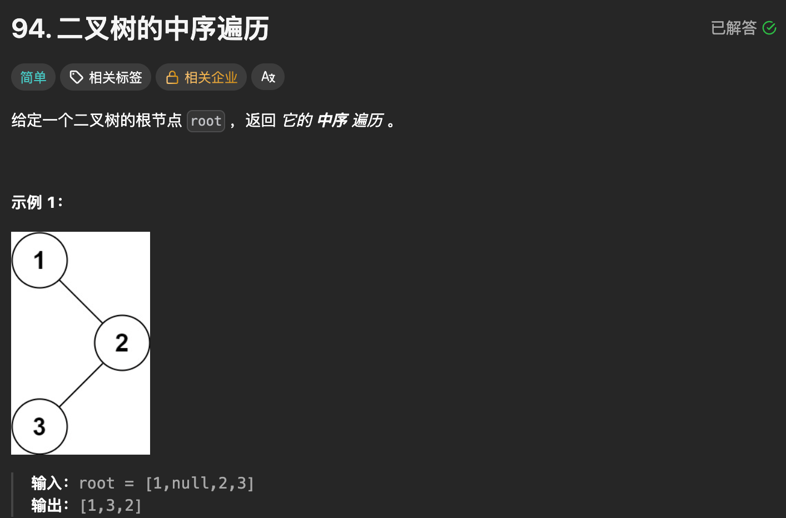

题目思路：

> 这个有很多方式一定要看看上面的基础知识

题目代码：

```
/**
 * Definition for a binary tree node.
 * struct TreeNode {
 *     int val;
 *     TreeNode *left;
 *     TreeNode *right;
 *     TreeNode() : val(0), left(nullptr), right(nullptr) {}
 *     TreeNode(int x) : val(x), left(nullptr), right(nullptr) {}
 *     TreeNode(int x, TreeNode *left, TreeNode *right) : val(x), left(left), right(right) {}
 * };
 */
class Solution {
public:
    void traversal(TreeNode* node, vector<int>& res){
        if(node == nullptr)return;
        traversal(node->left, res);
        res.push_back(node->val);
        traversal(node->right, res);
    }
    vector<int> inorderTraversal(TreeNode* root) {
        std::vector<int>res;
        // 左中右
        traversal(root, res);
        return res;
    }
};
```

### 题目来源：LeetCode-226-翻转二叉树

题目描述：  
 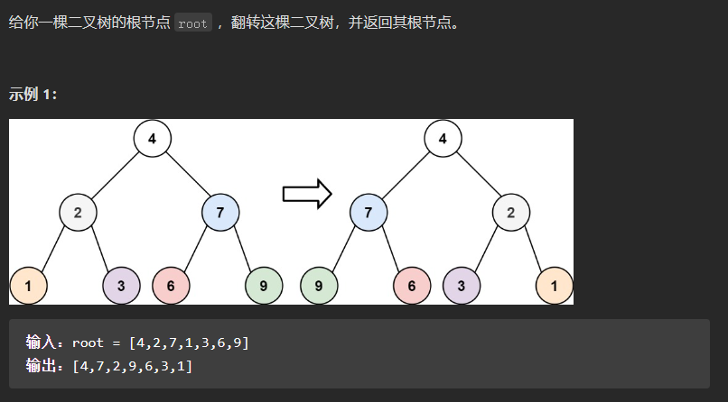

题目思路：

> 根据思路就是大概是 在层序遍历的时候将 顺序颠倒；  
>  有递归、迭代、层序解决的；

题目代码：

```
递归三部曲：
1：确定递归函数的参数和返回值
参数就是要传入节点的指针，不需要其他参数了，
通常此时定下来主要参数，如果在写递归的逻辑中发现还需要其他参数的时候，随时补充。
2：确定终止条件
当前节点为空的时候，就返回
3：因为是先前序遍历，所以先进行交换左右孩子节点，然后反转左子树，反转右子树。
swap(root->left, root->right);
invertTree(root->left);
invertTree(root->right);


整体代码如下:
class Solution {
public:
    TreeNode* invertTree(TreeNode* root) {
        if (root == nullptr) return root;
        // 递归思想。 交换的直接是指针。所以交换的就是其下面所链接的子树。
        // 递归思想还是要了解下的。
        swap(root->left, root->right);  // 中
        invertTree(root->left);         // 左
        invertTree(root->right);        // 右
        return root;
    }
};


C++代码如下迭代法（前序遍历）：模板
class Solution {
public:
    TreeNode* invertTree(TreeNode* root) {
        stack<TreeNode*> st;
        if (root != NULL) st.push(root);
        while (!st.empty()) {
            TreeNode* node = st.top();
            if (node != NULL) {
                st.pop();
                if (node->right) st.push(node->right);  // 右
                if (node->left) st.push(node->left);    // 左
                st.push(node);                          // 中
                st.push(NULL);
            } else {
                st.pop();
                node = st.top();
                st.pop();
                swap(node->left, node->right);          // 节点处理逻辑
            }
        }
        return root;
    }
};


层序遍历，层数遍历也是可以翻转这棵树的，
因为层序遍历也可以把每个节点的左右孩子都翻转一遍，代码如下：
class Solution {
public:
    TreeNode* invertTree(TreeNode* root) {
        queue<TreeNode*> que;
        if (root != NULL) que.push(root);
        while (!que.empty()) {
            int size = que.size();
            for (int i = 0; i < size; i++) {
                TreeNode* node = que.front();
                que.pop();
                swap(node->left, node->right); // 节点处理
                if (node->left) que.push(node->left);
                if (node->right) que.push(node->right);
            }
        }
        return root;
    }
};
```

### 题目来源：LeetCode-101-对称二叉树

题目描述：  
 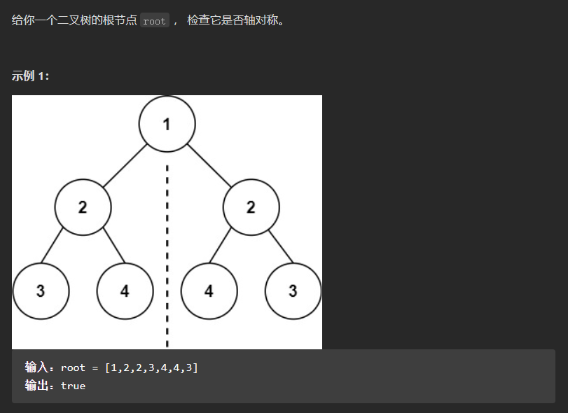

题目思路：

> 对于二叉树是否对称，要比较的是根节点的**左子树与右子树是不是相互翻转的**，理解这一点就知道了其实我们要比较的是两个树（这两个树是根节点的左右子树），所以在递归遍历的过程中，也是要同时遍历两棵树。  
>  正是因为要遍历两棵树而且要比较内侧和外侧节点，所以准确的来说是一个树的遍历顺序是左右中，一个树的遍历顺序是右左中。

题目代码：

```
class Solution {
public:
    bool isSameTree(TreeNode* left_tree, TreeNode* right_tree){
        if(left_tree == nullptr || right_tree == nullptr){
            if(left_tree == right_tree)return true;
            return false;
        }
        if(left_tree->val != right_tree->val)return false;

        // 真正的递归是 左边的树的左边的孩子 和 右边的树的右边的孩子比;
        //  左边的树的右边的孩子 和 右边的树的左边的孩子比;
        bool child_left = isSameTree(left_tree->left, right_tree->right);
        if(child_left == false)return false;

        bool child_right = isSameTree(left_tree->right, right_tree->left);
        if(child_right == false)return false;
        return true;
    }
    bool isSymmetric(TreeNode* root) {
        if (root == nullptr) return true;

        // 如果考虑递归的话
        // 就是root的左边和右边。
        return isSameTree(root->left, root->right);
    }
};


首先是递归的三部曲：
1：确定递归函数的参数和返回值
因为我们要比较的是根节点的两个子树是否是相互翻转的，进而判断这个树是不是对称树，所以要比较的是两个树，参数自然也是左子树节点和右子树节点。
返回值自然是bool类型。
2：确定终止条件
......太复杂有机会再看


然后就是迭代的方法了：


最后是类似于层序的方法了：
class Solution {
public:
    bool isSymmetric(TreeNode* root) {
        if (root == NULL) return true;
        queue<TreeNode*> que;
        que.push(root->left);   // 将左子树头结点加入队列
        que.push(root->right);  // 将右子树头结点加入队列
        
        while (!que.empty()) {  // 接下来就要判断这两个树是否相互翻转
            TreeNode* leftNode = que.front(); que.pop();
            TreeNode* rightNode = que.front(); que.pop();
            if (!leftNode && !rightNode) {  // 左节点为空、右节点为空，此时说明是对称的
                continue;
            }

            // 左右一个节点不为空，或者都不为空但数值不相同，返回false
            if ((!leftNode || !rightNode || (leftNode->val != rightNode->val))) {
                return false;
            }
            que.push(leftNode->left);   // 加入左节点左孩子
            que.push(rightNode->right); // 加入右节点右孩子
            que.push(leftNode->right);  // 加入左节点右孩子
            que.push(rightNode->left);  // 加入右节点左孩子
        }
        return true;
    }
};
```

### 题目来源：LeetCode-199. 二叉树的右视图

题目描述：  
 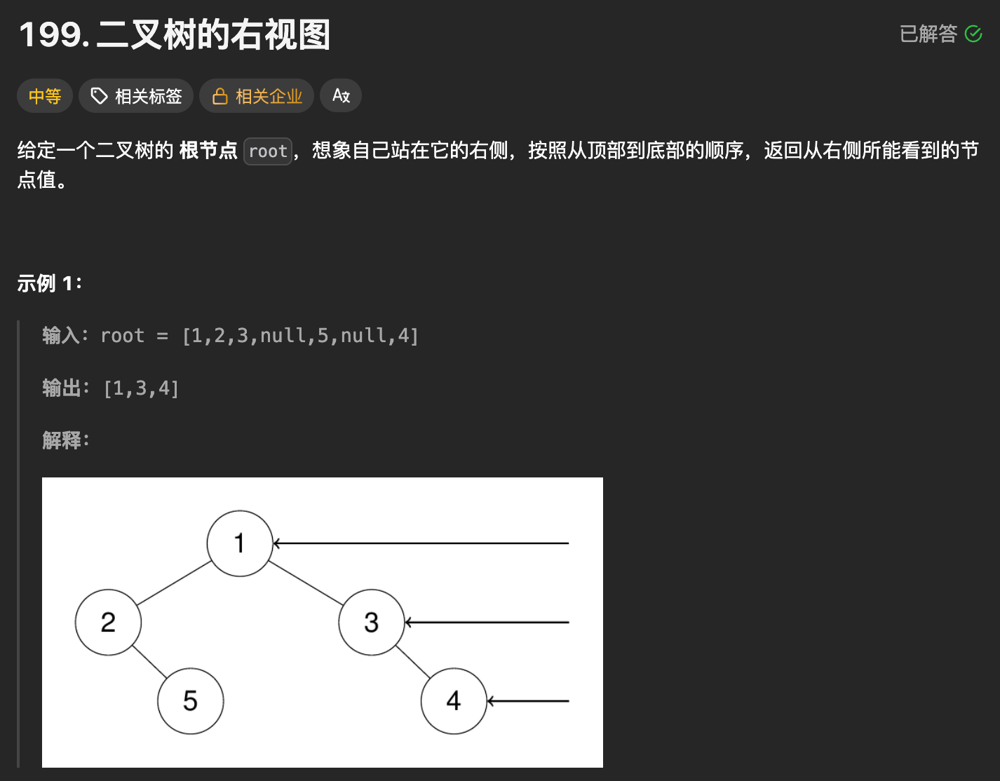

题目思路：

> 右视图 = 每一层最右边的节点  
>  用 \*\* 深度（层数）\*\* 判断：第一次走到该层时，一定是最右边节点  
>  写法：前序遍历：根 → 右 → 左（保证优先拿到最右）

题目代码：

```
/**
 * Definition for a binary tree node.
 * struct TreeNode {
 *     int val;
 *     TreeNode *left;
 *     TreeNode *right;
 *     TreeNode() : val(0), left(nullptr), right(nullptr) {}
 *     TreeNode(int x) : val(x), left(nullptr), right(nullptr) {}
 *     TreeNode(int x, TreeNode *left, TreeNode *right) : val(x), left(left), right(right) {}
 * };
 */
class Solution {
public:


    vector<int> rightSideView(TreeNode* root) {
        // 可以层序 也可以dfs
        // 整个层序吧
        if(root == nullptr)return {};

        vector<int>res;
        queue<TreeNode*>qt;
        qt.push(root);

        while(!qt.empty()){
            int sz = qt.size();
            for(int i = 0; i < sz; i++){
                auto cur = qt.front();
                if(cur->left)qt.push(cur->left);
                if(cur->right)qt.push(cur->right);
                qt.pop();
                if(i == sz-1)res.push_back(cur->val);
            }
        }
        return res;
    }
};
```

```
/**
 * Definition for a binary tree node.
 * struct TreeNode {
 *     int val;
 *     TreeNode *left;
 *     TreeNode *right;
 *     TreeNode() : val(0), left(nullptr), right(nullptr) {}
 *     TreeNode(int x) : val(x), left(nullptr), right(nullptr) {}
 *     TreeNode(int x, TreeNode *left, TreeNode *right) : val(x), left(left), right(right) {}
 * };
 */
class Solution {
public:
    vector<int> res;
    
    // 递归：根 → 右 → 左，记录深度
    void dfs(TreeNode* root, int depth) {
        if (!root) return;
        
        // 第一次来到这个深度 → 就是最右边的节点，加入答案
        if (depth == res.size()) {
            res.push_back(root->val);
        }
        
        // 关键：先右 后左（保证优先取到右边）
        dfs(root->right, depth + 1);
        dfs(root->left, depth + 1);
    }

    vector<int> rightSideView(TreeNode* root) {
        res.clear();
        dfs(root, 0);  // 从根开始，深度0
        return res;
    }
};
```

### 题目来源：LeetCode-114. 二叉树展开为链表

题目描述：  
 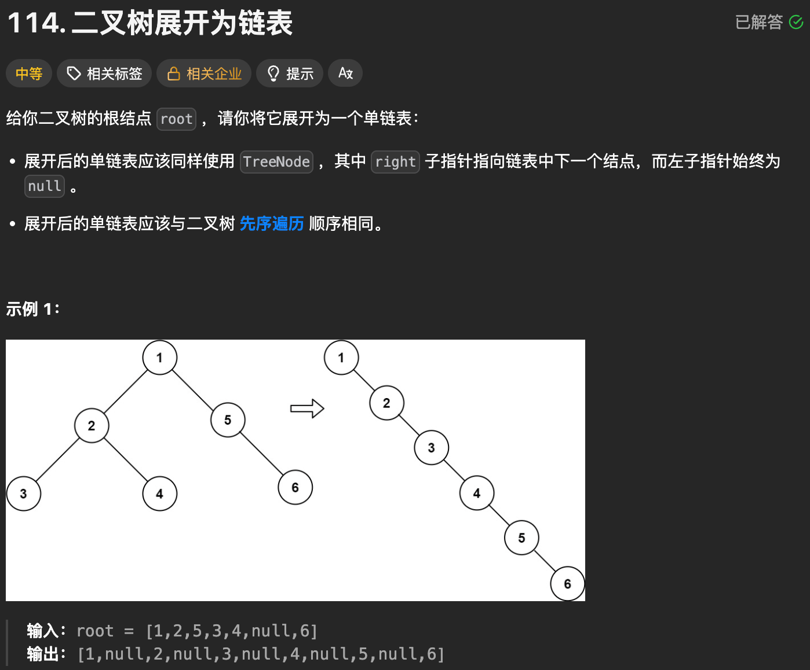

题目思路：

> 递归把左子树展开  
>  递归把右子树展开  
>  把左子树接到右边，右子树接到最后  
>  纯递归，无额外空间，

题目代码：

```
/**
 * Definition for a binary tree node.
 * struct TreeNode {
 *     int val;
 *     TreeNode *left;
 *     TreeNode *right;
 *     TreeNode() : val(0), left(nullptr), right(nullptr) {}
 *     TreeNode(int x) : val(x), left(nullptr), right(nullptr) {}
 *     TreeNode(int x, TreeNode *left, TreeNode *right) : val(x), left(left), right(right) {}
 * };
 */
class Solution {
public:
    void flatten(TreeNode* root) {
        // 空节点直接返回
        if(root == nullptr)return;

        //注意是 先序遍历 顺序相同即 中 左 右; 
        // 也就是说先假设 是 有 左边的和右边的;
        // 然后把 左边的放在右边的前面；然后再把左边的指针递归给该函数。
        flatten(root->left);
        // 这个代表 第一次运行该函数的时候 前面的已经变成一个串了
        // 开始处理右边的;
        flatten(root->right);

        // 这样就代表着 左子树拉成了 右子树也拉成了
        // 开始交换
        TreeNode* tmp_right = root->right;
        root->right = root->left;
        root->left = nullptr;

        TreeNode* cur = root;
        while(cur->right != nullptr){
            cur = cur->right;
        }
        cur->right = tmp_right;
    }
};


/**
 * Definition for a binary tree node.
 * struct TreeNode {
 *     int val;
 *     TreeNode *left;
 *     TreeNode *right;
 *     TreeNode() : val(0), left(nullptr), right(nullptr) {}
 *     TreeNode(int x) : val(x), left(nullptr), right(nullptr) {}
 *     TreeNode(int x, TreeNode *left, TreeNode *right) : val(x), left(left), right(right) {}
 * };
 */
class Solution {
public:
    void flatten(TreeNode* root) {
        // 空节点直接返回
        if (!root) return;

        // 1. 先把左、右子树分别展开（你熟悉的递归写法）
        flatten(root->left);
        flatten(root->right);

        // 2. 把展开的左子树移到右边
        TreeNode* right = root->right; // 保存原来的右子树
        root->right = root->left;      // 左子树变成右子树
        root->left = nullptr;          // 左子树置空

        // 3. 找到最末尾节点，把原来的右子树接上
        TreeNode* cur = root;
        while (cur->right) {
            cur = cur->right;
        }
        cur->right = right;
    }
};
```

### 题目来源：LeetCode-105. 从前序与中序遍历序列构造二叉树

题目描述：  
 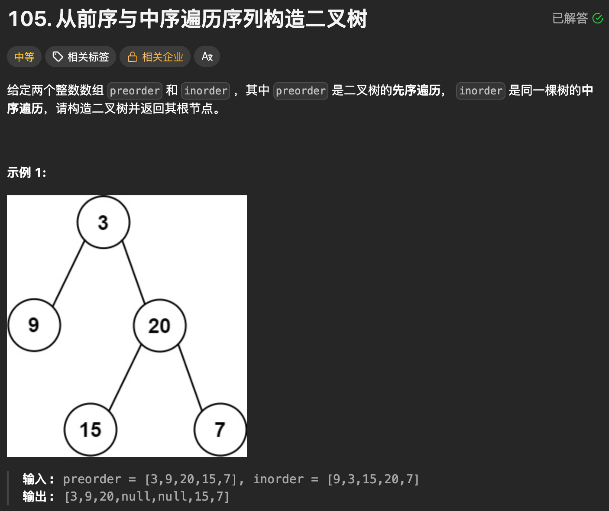

题目思路：

> 前序第一个 = 根节点  
>  在中序里找到根，分成左子树区间和右子树区间  
>  递归构建左子树  
>  递归构建右子树  
>  返回根节点

题目代码：

```
/**
 * Definition for a binary tree node.
 * struct TreeNode {
 *     int val;
 *     TreeNode *left;
 *     TreeNode *right;
 *     TreeNode() : val(0), left(nullptr), right(nullptr) {}
 *     TreeNode(int x) : val(x), left(nullptr), right(nullptr) {}
 *     TreeNode(int x, TreeNode *left, TreeNode *right) : val(x), left(left), right(right) {}
 * };
 */
class Solution {
public:
    // 为了快速查值对应的位置，用哈希表
    unordered_map<int, int> mp;

    TreeNode* build(vector<int>& pre, vector<int>& in, int pl, int pr, int il, int ir) {
        // 区间不合法，返回空
        if (pl > pr) return nullptr;
 
        // 前序第一个就是根
        int rootVal = pre[pl];
        TreeNode* root = new TreeNode(rootVal);

        // 找到根在中序里的位置
        int mid = mp[rootVal];
        // 左子树有多少个节点
        int leftLen = mid - il;

        // 递归构造左子树
        auto left_ptr = build(pre, in, pl + 1, pl + leftLen, il, mid - 1);
        
        // 递归构造右子树
        auto right_ptr = build(pre, in, pl + leftLen + 1, pr, mid + 1, ir);

        root->left = left_ptr;
        root->right = right_ptr;
        return root;
    }

    TreeNode* buildTree(vector<int>& preorder, vector<int>& inorder) {
        // 先把中序的值和下标存起来，方便查找
        int n = inorder.size();
        for(int i = 0; i < n; i++){
            mp[inorder[i]] = i;
        }
        auto root = build(preorder, inorder, 0, n - 1, 0, n - 1);
        return root;
    }
};
```

### 题目来源：LeetCode-102. 二叉树的层序遍历

题目描述：

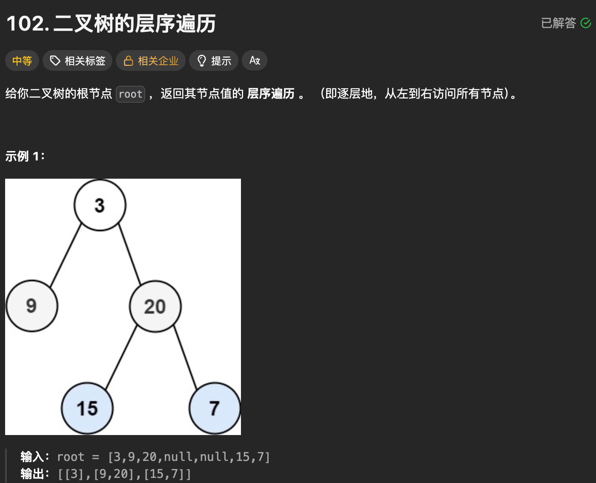

题目思路：


题目代码：

```
/**
 * Definition for a binary tree node.
 * struct TreeNode {
 *     int val;
 *     TreeNode *left;
 *     TreeNode *right;
 *     TreeNode() : val(0), left(nullptr), right(nullptr) {}
 *     TreeNode(int x) : val(x), left(nullptr), right(nullptr) {}
 *     TreeNode(int x, TreeNode *left, TreeNode *right) : val(x), left(left), right(right) {}
 * };
 */
class Solution {
public:
    vector<vector<int>> levelOrder(TreeNode* root) {
        queue<TreeNode*> que;
        if (root != NULL) que.push(root);
        vector<vector<int>> result;
        while (!que.empty()) {
            int size = que.size();
            vector<int> vec;
            // 这里一定要使用固定大小size，不要使用que.size()，因为que.size是不断变化的
            for (int i = 0; i < size; i++) {
                TreeNode* node = que.front();
                que.pop();
                vec.push_back(node->val);
                if (node->left) que.push(node->left);
                if (node->right) que.push(node->right);
            }
            result.push_back(vec);
        }
        return result;
    }
};
```

### 题目来源：LeetCode-104-二叉树的最大深度

题目描述：  
 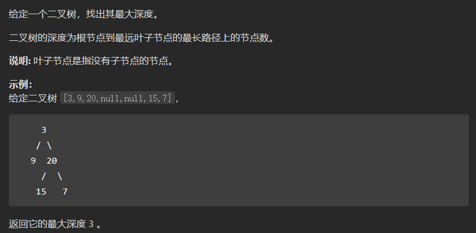

题目思路：

> 递归、迭代、层序

题目代码：

```
首先是递归：
1：确定递归函数的参数和返回值：参数就是传入树的根节点，返回就返回这棵树的深度，所以返回值为int类型。
2：确定终止条件：如果为空节点的话，就返回0，表示高度为0。
3：确定单层递归的逻辑：先求它的左子树的深度，再求右子树的深度，
最后取左右深度最大的数值 再+1 （加1是因为算上当前中间节点）就是目前节点为根节点的树的深度。

class Solution {
public:
    int getdepth(TreeNode* node) {
        if (node == nullptr) return 0;
        int leftdepth = getdepth(node->left);       // 左
        int rightdepth = getdepth(node->right);     // 右
        int depth = 1 + max(leftdepth, rightdepth); // 中
        return depth;
    }
    int maxDepth(TreeNode* root) {
        return getdepth(root);
    }
};


然后是迭代：


最后是层序遍历：
class solution {
public:
    int maxdepth(treenode* root) {
        if (root == NULL) return 0;
        int depth = 0;
        queue<treenode*> que;
        que.push(root);
        while(!que.empty()) {
            int size = que.size();
            depth++; // 记录深度
            for (int i = 0; i < size; i++) {
                treenode* node = que.front();
                que.pop();
                if (node->left) que.push(node->left);
                if (node->right) que.push(node->right);
            }
        }
        return depth;
    }
};
```

### 题目来源：LeetCode-543. 二叉树的直径

题目描述：  
 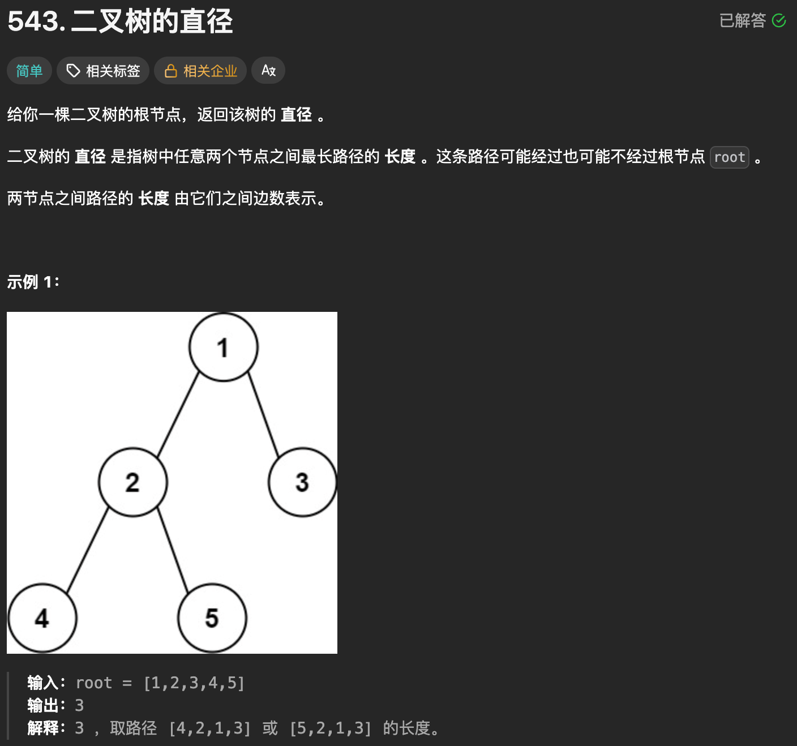

题目思路：


题目代码：

```
/**
 * Definition for a binary tree node.
 * struct TreeNode {
 *     int val;
 *     TreeNode *left;
 *     TreeNode *right;
 *     TreeNode() : val(0), left(nullptr), right(nullptr) {}
 *     TreeNode(int x) : val(x), left(nullptr), right(nullptr) {}
 *     TreeNode(int x, TreeNode *left, TreeNode *right) : val(x), left(left), right(right) {}
 * };
 */
class Solution {
    int res;
public:
    int depth(TreeNode* node){
        if(node == nullptr)return 0;

        int left = depth(node->left);
        int right = depth(node->right);
        res = max(res, left + right + 1);
        return max(left, right) + 1;
    }
    int diameterOfBinaryTree(TreeNode* root) {
        // 我理解的是左侧深度+右侧深度即可
        res = 1;

        depth(root);
        return res - 1;
    }
};
```

### 题目来源：LeetCode-508-出现次数最多的子树元素和

题目描述：  
 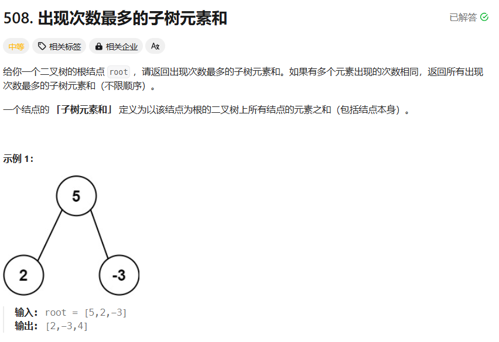

题目思路：

> 大概就是需要递归等等  
>  DFS 深度，递归、以及一些类中 变量声明和函数书写；

题目代码：

```
/**
 * Definition for a binary tree node.
 * struct TreeNode {
 *     int val;
 *     TreeNode *left;
 *     TreeNode *right;
 *     TreeNode() : val(0), left(nullptr), right(nullptr) {}
 *     TreeNode(int x) : val(x), left(nullptr), right(nullptr) {}
 *     TreeNode(int x, TreeNode *left, TreeNode *right) : val(x), left(left), right(right) {}
 * };
 */
class Solution {
public:
    unordered_map<int, int>mp;
    int dfs(TreeNode* root){
        if(root == nullptr)return 0;

        // 该节点sum = 本身 + 左边的 + 右边的
        int local_sum = root->val;
        local_sum += dfs(root->left);
        local_sum += dfs(root->right);
        mp[local_sum]++;
        return local_sum;
    }
    vector<int> findFrequentTreeSum(TreeNode* root) {
        auto root_sum = dfs(root);

        int maxNum = 0;
        vector<int>res;

        for(auto &mm : mp){
            maxNum = max(maxNum, mm.second);
        }
        for(auto &mm : mp){
            if(mm.second == maxNum){
                res.push_back(mm.first);
            }
        }
        return res;
    }
};


/**
 * Definition for a binary tree node.
 * struct TreeNode {
 *     int val;
 *     TreeNode *left;
 *     TreeNode *right;
 *     TreeNode() : val(0), left(nullptr), right(nullptr) {}
 *     TreeNode(int x) : val(x), left(nullptr), right(nullptr) {}
 *     TreeNode(int x, TreeNode *left, TreeNode *right) : val(x), left(left), right(right) {}
 * };
 */
class Solution {
    //全局的数据信息
    unordered_map<int,int>mp;
    int maxx = 0;

    int dfs(TreeNode *node){
        if(node == nullptr){
            return 0;
        }
        int sum = node->val + dfs(node->left) + dfs(node->right);
        mp[sum]++;
        maxx = max(maxx, mp[sum]);
        return sum;
    }

public:
    vector<int> findFrequentTreeSum(TreeNode* root) {
        dfs(root);
        vector<int>res;
        for(auto &[s,c] : mp){
            if(c == maxx){
                res.push_back(s);
            }
        }
        return res;
    }
};
```

### 题目来源：LeetCode-236. 二叉树的最近公共祖先[❌]

题目描述：  
 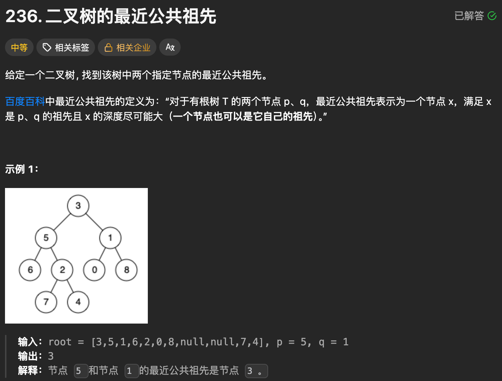

题目思路：


题目代码：

```
class Solution {
public:
    TreeNode* res = nullptr;
    bool dfs(TreeNode* root, TreeNode* p, TreeNode*q){
        if(root == nullptr)return false;

        bool left_h_porq = dfs(root->left, p, q);
        bool right_h_porq = dfs(root->right, p, q);

        // 这里的分情况讨论
        // p q 都在单边的话 继续往下。 
        // 左边有pq都有； 右边也是pq都有(这个不对；pq是指针参数。唯一性质)
        // 什么情况下才能敲定res的数值
        // 只有在 左边和右边各有一个的时候。
        if(left_h_porq && right_h_porq){
            res = root;
        }
        if(root->val == p->val && (left_h_porq || right_h_porq)){
            res = root;
        }
        if(root->val == q->val && (left_h_porq || right_h_porq)){
            res = root;
        }

        if(left_h_porq || right_h_porq)return true;
        if(root->val == p->val || root->val == q->val) return true;
        return false;
    }
    TreeNode* lowestCommonAncestor(TreeNode* root, TreeNode* p, TreeNode* q) {
        dfs(root, p, q);
        return res;
    }
};
```

### 题目来源：LeetCode-111-二叉树的最小深度

题目描述：  
 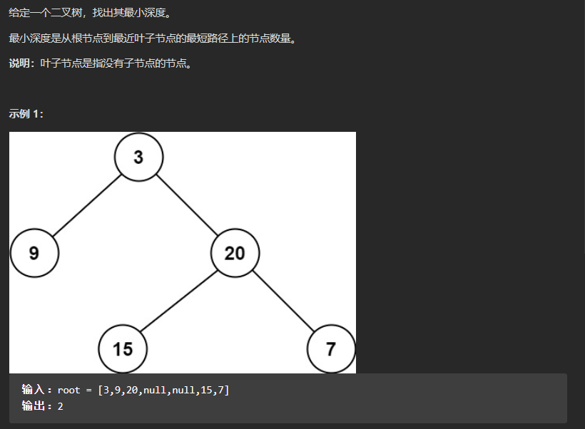

题目思路：

> 三种

题目代码：

```
首先是递归三部曲：


然后是迭代方法：


最后是层序
需要注意的是，只有当左右孩子都为空的时候，才说明遍历到最低点了。
如果其中一个孩子不为空则不是最低点
class Solution {
public:

    int minDepth(TreeNode* root) {
        if (root == NULL) return 0;
        int depth = 0;
        queue<TreeNode*> que;
        que.push(root);
        while(!que.empty()) {
            int size = que.size();
            depth++; // 记录最小深度
            for (int i = 0; i < size; i++) {
                TreeNode* node = que.front();
                que.pop();
                if (node->left) que.push(node->left);
                if (node->right) que.push(node->right);
                if (!node->left && !node->right) { // 当左右孩子都为空的时候，说明是最低点的一层了，退出
                    return depth;
                }
            }
        }
        return depth;
    }
};
```

### 题目来源：LeetCode-257-二叉树的所有路径

题目描述：  
 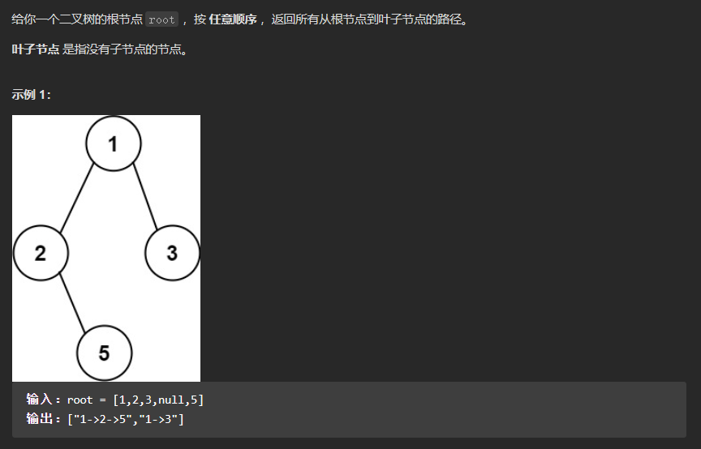

题目思路：

题目代码：

```
class Solution {
public:
    vector<string> res;
    string path;
    void dfs(TreeNode* root, string path) {
        // 1. 空节点直接返回
        if (root == nullptr) return;

        // 2. 先判断：是不是叶子节点！（放最前面）
        if (root->left == nullptr && root->right == nullptr) {
            path += to_string(root->val);
            res.push_back(path);
            return;
        }

        // 3. 不是叶子，就拼接当前值 + ->
        path += to_string(root->val);
        path += "->";
        dfs(root->left, path);
        dfs(root->right, path);
    }

    vector<string> binaryTreePaths(TreeNode* root) {
        dfs(root, "");
        return res;
    }
};
```

### 题目来源：LeetCode-437. 路径总和 III

题目描述：  
 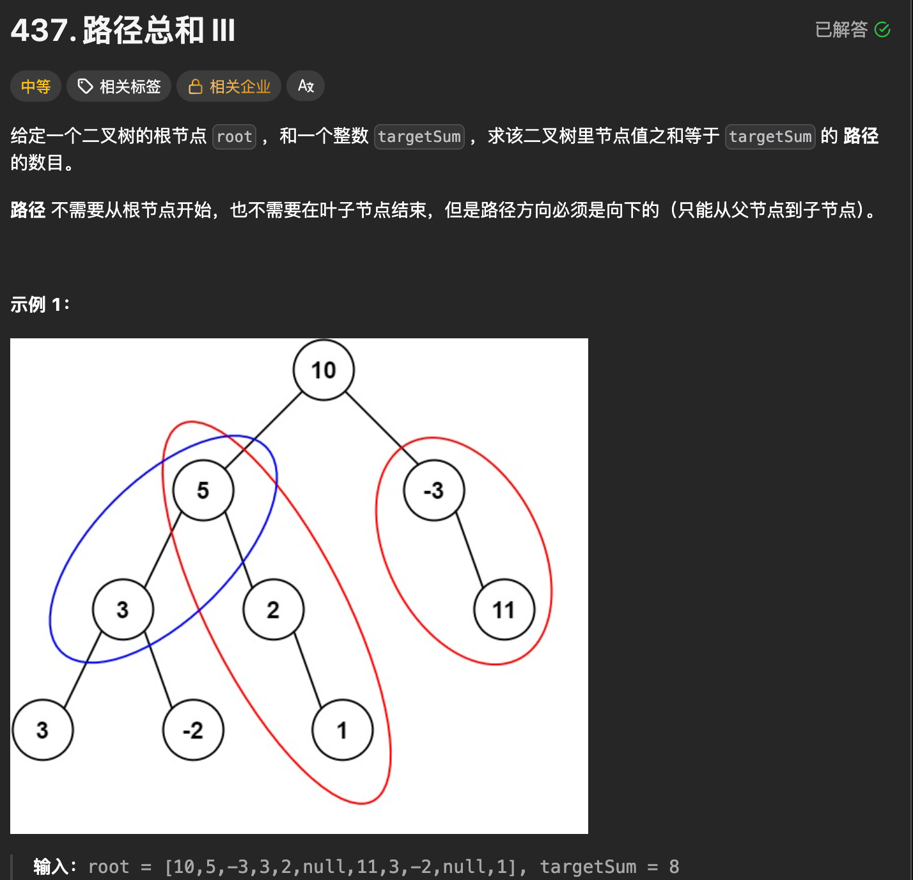

题目思路：

> 前序遍历每一个节点作为起点  
>  从这个起点往下递归求和  
>  找到和等于 targetSum 就计数 + 1  
>  双重递归，思路简单、好记、好写

题目代码：

```
class Solution {
public:
    int res = 0;  // 记录答案总数
    unordered_map<long long, int>prefix;

    void dfs(TreeNode* root, long long sum, int targetSum){
        if(root == nullptr)return;

        // 按照中序遍历。
        // 根左右
        int root_val = root->val;
        sum = sum + root_val;
        res = res + prefix[sum - targetSum]; //中间节点的差值

        // 因为dfs就是记录了 路径的。 每次走到
        prefix[sum]++;
        dfs(root->left, sum, targetSum);
        dfs(root->right, sum, targetSum);
        prefix[sum]--;


    }

    int pathSum(TreeNode* root, int targetSum) {
        prefix[0] = 1;
        dfs(root, 0, targetSum);
        return res;
    }
};
```

```
/**
 * Definition for a binary tree node.
 * struct TreeNode {
 *     int val;
 *     TreeNode *left;
 *     TreeNode *right;
 *     TreeNode() : val(0), left(nullptr), right(nullptr) {}
 *     TreeNode(int x) : val(x), left(nullptr), right(nullptr) {}
 *     TreeNode(int x, TreeNode *left, TreeNode *right) : val(x), left(left), right(right) {}
 * };
 */
class Solution {
public:
    int res = 0;  // 记录答案总数

    // 第二重递归：从 root 开始往下找，和为 target 的路径
    void dfs(TreeNode* root, long long sum, int target) {
        if (!root) return;
        
        // 加上当前节点的值
        sum += root->val;
        // 找到一条合法路径
        if (sum == target) res++;
        
        // 继续往左、往右找（你熟悉的递归结构）
        dfs(root->left, sum, target);
        dfs(root->right, sum, target);
    }

    // 第一重递归：遍历每个节点（前序：根→左→右）
    void solve(TreeNode* root, int target) {
        if (!root) return;
        
        // 以当前节点为起点，dfs找路径
        dfs(root, 0, target);
        
        // 递归处理左、右子树
        solve(root->left, target);
        solve(root->right, target);
    }

    int pathSum(TreeNode* root, int targetSum) {
        res = 0;
        solve(root, targetSum);
        return res;
    }
};
```

```
/**
 * Definition for a binary tree node.
 * struct TreeNode {
 *     int val;
 *     TreeNode *left;
 *     TreeNode *right;
 *     TreeNode() : val(0), left(nullptr), right(nullptr) {}
 *     TreeNode(int x) : val(x), left(nullptr), right(nullptr) {}
 *     TreeNode(int x, TreeNode *left, TreeNode *right) : val(x), left(left), right(right) {}
 * };
 */
class Solution {
public:
    int res = 0;  // 记录答案总数
    void dfs(TreeNode* root, long long sum, const int& targetSum){
        if(root == nullptr)return;
        sum += root->val;
        if(sum == targetSum)res++;
        dfs(root->left, sum, targetSum);
        dfs(root->right, sum, targetSum);
        sum -= root->val;
    }

    int pathSum(TreeNode* root, int targetSum) {
        res = 0;
        if(root == nullptr)return 0;

        // 也就是说遍历所有的节点 dfs
        queue<TreeNode*>qt;
        qt.push(root);
        while(!qt.empty()){
            int sz = qt.size();
            for(int i = 0; i < sz; i++){
                auto ff = qt.front();
                dfs(ff, 0, targetSum);
                qt.pop();
                if(ff->left)qt.push(ff->left);
                if(ff->right)qt.push(ff->right);
            }
        }
        return res;
    }
};
```

### 题目来源：LeetCode-124. 二叉树中的最大路径和

题目描述：  
 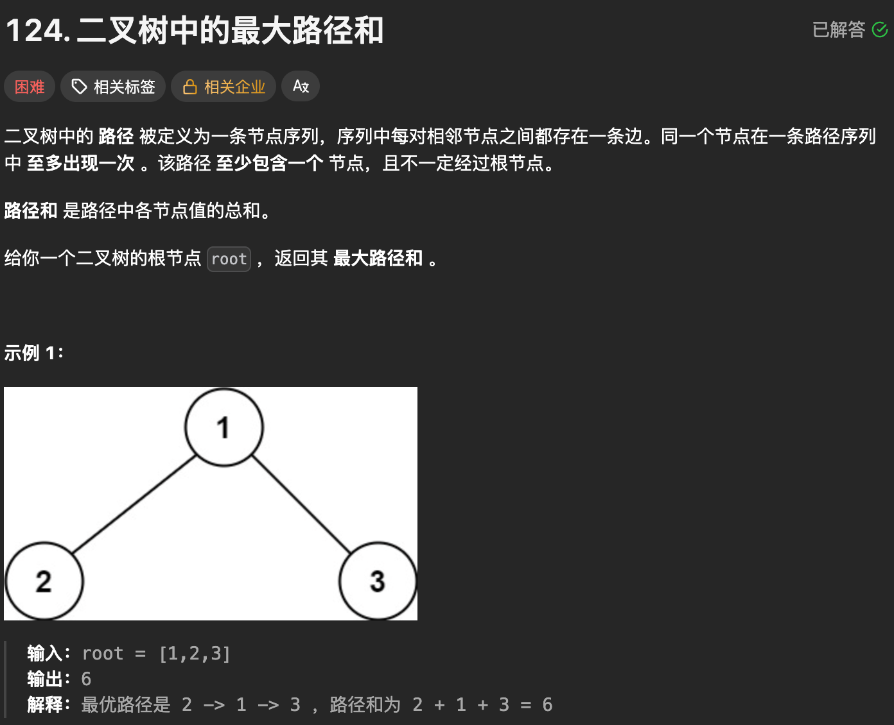

题目思路：

> 完全沿用统一的递归模板（左→右→根处理），  
>  递归算左子树最大贡献值  
>  递归算右子树最大贡献值  
>  更新全局最大路径和（左 + 根 + 右）  
>  返回根 + 最大单边给上层使用  
>  全程就是最熟悉的：先左、再右、最后处理根

题目代码：

```
/**
 * Definition for a binary tree node.
 * struct TreeNode {
 *     int val;
 *     TreeNode *left;
 *     TreeNode *right;
 *     TreeNode() : val(0), left(nullptr), right(nullptr) {}
 *     TreeNode(int x) : val(x), left(nullptr), right(nullptr) {}
 *     TreeNode(int x, TreeNode *left, TreeNode *right) : val(x), left(left), right(right) {}
 * };
 */
class Solution {
public:
    int maxSum = -INT_MAX;  
    // 递归：返回当前节点能给父节点的最大贡献
    int dfs(TreeNode* root) {
        if (root == nullptr) return 0;

        // local 
        int local_sum = root->val;
        int left_sum = max(dfs(root->left), 0);
        int right_sum = max(dfs(root->right), 0);
        local_sum += left_sum;
        local_sum += right_sum;
        maxSum = max(maxSum, local_sum);

        return root->val + max(left_sum, right_sum);
    }

    int maxPathSum(TreeNode* root) {
        dfs(root);
        return maxSum;
    }
};


/**
 * Definition for a binary tree node.
 * struct TreeNode {
 *     int val;
 *     TreeNode *left;
 *     TreeNode *right;
 *     TreeNode() : val(0), left(nullptr), right(nullptr) {}
 *     TreeNode(int x) : val(x), left(nullptr), right(nullptr) {}
 *     TreeNode(int x, TreeNode *left, TreeNode *right) : val(x), left(left), right(right) {}
 * };
 */
class Solution {
public:
    int maxSum = INT_MIN;  // 全局记录答案

    // 递归：返回当前节点能给父节点的最大贡献
    int dfs(TreeNode* root) {
        if (!root) return 0;

        // 左子树贡献（负数就不取，取0）
        int left = max(dfs(root->left), 0);
        // 右子树贡献
        int right = max(dfs(root->right), 0);

        // 更新全局最大路径：左 + 根 + 右
        maxSum = max(maxSum, left + root->val + right);

        // 返回给上层：只能选一条边走（根 + 最大单边）
        return root->val + max(left, right);
    }

    int maxPathSum(TreeNode* root) {
        dfs(root);
        return maxSum;
    }
};
```

### 题目来源：LeetCode-513-找树左下角的值

题目描述：  
 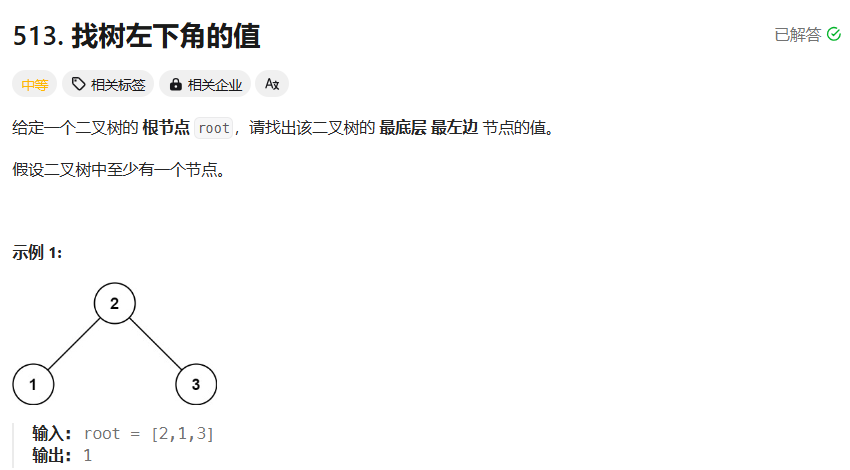

题目思路：

> 根据性质，一直往左就行了；也不是，是最底层，所以要到最底层，  
>  或者说可以层序遍历，然后保留最底层的然后就行了

> 使用广度优先搜索遍历每一层的节点。在遍历一个节点时，需要先把它的非空右子节点放入队列，然后再把它的非空左子节点放入队列，这样才能保证从右到左遍历每一层的节点。广度优先搜索所遍历的最后一个节点的值就是最底层最左边节点的值。

题目代码：

```
/**
 * Definition for a binary tree node.
 * struct TreeNode {
 *     int val;
 *     TreeNode *left;
 *     TreeNode *right;
 *     TreeNode() : val(0), left(nullptr), right(nullptr) {}
 *     TreeNode(int x) : val(x), left(nullptr), right(nullptr) {}
 *     TreeNode(int x, TreeNode *left, TreeNode *right) : val(x), left(left), right(right) {}
 * };
 */
class Solution {
public:

    int findBottomLeftValue(TreeNode* root) {
        if(root == nullptr)return 0;
        int res = 0;

        queue<TreeNode*>qt;
        qt.push(root);
        while(!qt.empty()){
            int sz = qt.size();
            for(int i = 0; i < sz; i++){
                auto tmp = qt.front();
                if(tmp->left)qt.push(tmp->left);
                if(tmp->right)qt.push(tmp->right);
                qt.pop();

                if(i == 0)res = tmp->val;
            }
        }
        return res;
    }
};


class Solution {
public:
    static constexpr int N = 1e4 + 6;
    vector<TreeNode*> v[N];

    int findBottomLeftValue(TreeNode* root) {
        if(root == nullptr)return 0;
        v[0].push_back(root);
        int level = 1;

        for(int i = 0; i < N; i++){
            if(v[i].size() == 0)break;
            for(int j = 0; j < v[i].size(); j++){
                auto node = v[i][j];
                if(node->left){
                    v[level].push_back(node->left);
                }
                if(node->right){
                    v[level].push_back(node->right);
                }
            }
            level++;
        }
        return v[level-2][0]->val;
    }
};
```

## No.2 普通二叉树题目

### 题目来源：PTA-L1-071 前世档案

题目描述：  
 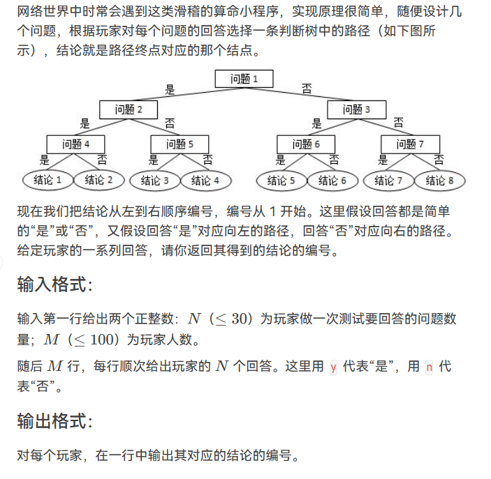

题目思路：

题目代码：

```
#include<bits/stdc++.h>
using namespace std;
#define inf 0x3f3f3f3f
#define N 100100
int n,m,k,g,d;
int x,y,z;
vector<int>v[N];

int main() {
    cin>>n>>m;
    while(m--){
        string str;
        cin>>str;
        int pos=1;
        for(int i=0;i<n;i++){
            if(str[i]=='y'){
                pos=pos*2-1;
            }else{
                pos=pos*2;
            }
        }
        cout<<pos<<endl;
    }
	return 0;
}
```

### 题目来源：PTA-L2-006 树的遍历

题目描述：  
 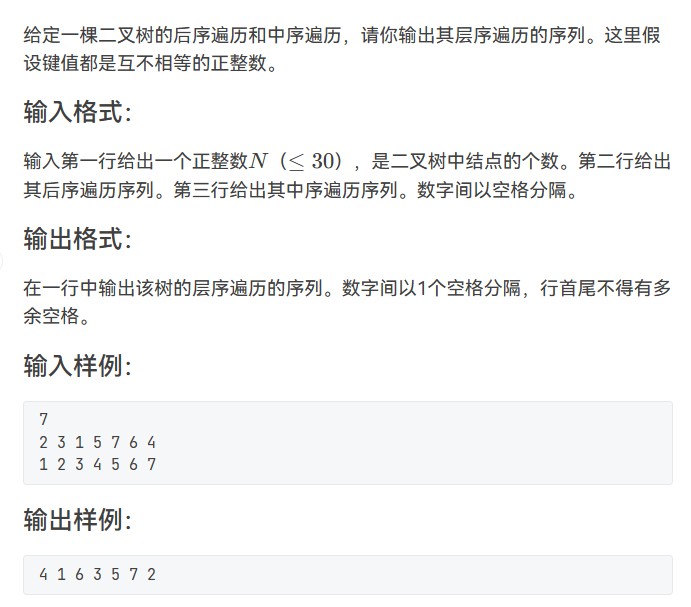

题目思路：

题目代码：

```
#include<bits/stdc++.h>
using namespace std;
#define inf 0x3f3f3f3f
#define N 35
int n,m,k,g,d;
int x,y,z;
char ch;
string str;
vector<int>v[N];
struct node{
    int lson,rson;
}f[N];
int post[N],mid[N];
int creat(int lmid , int rmid ,int lpost ,int rpost){
    if(lmid>rmid || lpost >rpost){
        return 0;
    }
    int root=post[rpost];
    int fa=lmid;
    while(mid[fa]!=root)fa++;
    int len=fa-lmid;
    f[root].lson=creat(lmid,fa-1,lpost,lpost+len-1);
    f[root].rson=creat(fa+1,rmid,lpost+len,rpost-1);
    
    return root;
    
}
void bfs(int x){
    vector<int>ve;
    queue<int>q;
    q.push(x);
    while(!q.empty()){
        int w=q.front();
        q.pop();
        ve.push_back(w);
        if(f[w].lson)q.push(f[w].lson);
        if(f[w].rson)q.push(f[w].rson);
    }
    for(int i=0;i<ve.size();i++){
        if(i==0)cout<<ve[i];
        else cout<<" "<<ve[i];
    }
}
int main() {
    cin>>n;
    for(int i=1;i<=n;i++)cin>>post[i];
    for(int i=1;i<=n;i++)cin>>mid[i];
    int root=creat(1,n,1,n);
    bfs(root);
	return 0;
}


对于给出后序和中序来重建二叉树, 因为后序的根一定在最后, 我们依次从后往前遍历post(见1处), 对于每一个post[postR], 找出其在in中的位置k, 然后递归重建即可
同理, 如果是给出前序和中序求得后序的话, 仅仅对顺序进行改动即可
#include<bits/stdc++.h>
using namespace std;
//思路：递归求解 分两个部分 恢复二叉树restree和利用队列层次遍历函数leveltra
vector<int> posord;
vector<int> midord;
//定义一个二叉树结构体
typedef struct btnode{
    int Data;
    struct btnode *Left,*Right;
}BTnode,*BTree;
//restree函数三个参数分别是后序遍历中的根节点，中序遍历的起点，中序遍历的终点
BTree restree(int root,int begin,int end){
    if(begin>end) return NULL;//叶子节点无子树
    int rnt;
    for(rnt=begin;rnt<end;rnt++)//在中序里找到根节点的位置
    {
        if(midord[rnt]==posord[root])
            break;
    }
    BTree Bt=BTree(malloc(sizeof(struct btnode)));
    Bt->Data=posord[root];
    Bt->Left=restree(root-1-(end-rnt),begin,rnt-1);
    Bt->Right=restree(root-1,rnt+1,end);
    return Bt;
}
void leveltra(BTree bt){
    queue<BTree> que;
    int flag=1;
    BTree temp = NULL;
    que.push(bt);
    while(!que.empty()){
        temp = que.front();
        if(flag)
        {
            cout<<temp->Data; 
            flag=0;
        }
        else
            cout<<" "<<temp->Data;
        que.pop();
        if(temp->Left)
             que.push(temp->Left);
         if(temp->Right)
             que.push(temp->Right);
    }
}
int main(){
    int n;
    cin>>n;
    int m;
    for(int i=0;i<n;i++)
    {
        cin>>m;
        posord.push_back(m);
    }
    for(int i=0;i<n;i++)
    {
        cin>>m;
        midord.push_back(m);
    }
    leveltra(restree(n-1,0,n-1));
    return 0;
}


///第二种
#include <cstdio>
#include <iostream>
#include <algorithm>
#include <cstring>
#include <queue>
using namespace std;
#define ms(x, n) memset(x,n,sizeof(x));
typedef  long long LL;
const int inf = 1<<30;
const LL maxn = 35;

struct node{
    int data;
    node *l, *r;
};
int N, pre[maxn], in[maxn], post[maxn];
//当前二叉树后序序列区间为[postL, postR], 中序序列区间为[inL, inR]
node* create(int postL, int postR, int inL, int inR){
    if(postL > postR)
        return NULL; //后序序列长度<=0

    node* root = new node;
    root->data = post[postR];
    int k;
    for(k = inL; k <= inR; k++)
        if(in[k] == post[postR])
            break;
    int numLeft = k - inL;  //左子树的节点个数
    root->l = create(postL, postL+numLeft-1, inL, k-1); //重建左子树
    root->r = create(postL+numLeft, postR-1, k+1, inR); //重建右子树 1处
    return root;
}
int indx = 1;
void Bfs(node* root){
    queue<node*> q;
    q.push(root);
    while(!q.empty()){
        node* cur = q.front();
        q.pop();
        if(indx++ != 1) cout << ' ' << cur->data;
        else cout << cur->data;

        if(cur->l != NULL) q.push(cur->l);
        if(cur->r != NULL) q.push(cur->r);
    }
}
int main()
{
    cin >> N;
    for(int i = 0; i < N; i++)
        cin >> post[i];
    for(int i = 0; i < N; i++)
        cin >> in[i];

    node* root = create(0, N-1, 0, N-1);//建树
    Bfs(root);                          //层序遍历

	return 0;
}
```

### 题目来源：PTA-L2-011 玩转二叉树

题目描述：  
 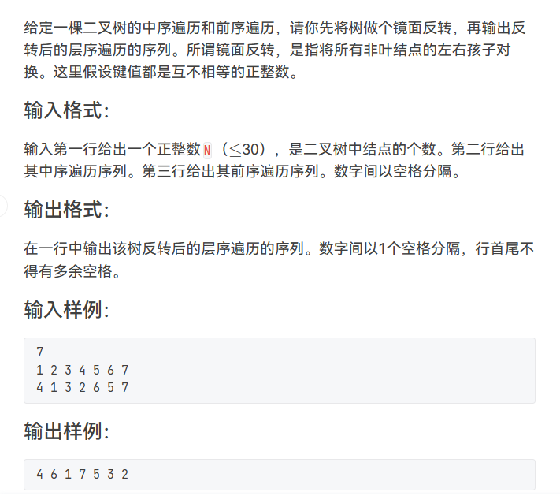

题目思路：

题目代码：

```
镜像反转只需将层次遍历中先遍历右边的即可 ，其他就是建树的操作了～～
#include<bits/stdc++.h>
using namespace std;
#define inf 0x3f3f3f3f
#define N 50
int n,m,k,g,d;
int x,y,z;
char ch;
string str;
vector<int>v[N];
int mid[N],pre[N];
struct node{
    int lson,rson;
}f[N];
int creat(int lmid, int rmid , int lpre ,int rpre){
    if(lmid >rmid || lpre>rpre){
        return 0;
    }
    int root=pre[lpre];
    int fa=lmid;
    while(mid[fa]!=root)fa++;
      //len是表示左子树的结点个数数量。
    int len=fa-lmid;
    f[root].lson=creat(lmid,fa-1,lpre+1,lpre+len);
    f[root].rson=creat(fa+1,rmid,lpre+len+1,rpre);
    return root;
}
void bfs(int x){
    vector<int>ve;
    queue<int>q;
    q.push(x);
    while(!q.empty()){
        int w=q.front();
        q.pop();
        ve.push_back(w);
        if(f[w].rson)q.push(f[w].rson);
        if(f[w].lson)q.push(f[w].lson);
    }
    for(int i=0;i<ve.size();i++){
        if(i==0)cout<<ve[i];
        else cout<<" "<<ve[i];
    }
}
int main() {
    cin>>n;
    for(int i=1;i<=n;i++)cin>>mid[i];
    for(int i=1;i<=n;i++)cin>>pre[i];
    int root=creat(1,n,1,n);
    bfs(root);
	return 0;
}
```

### 题目来源：LeetCode-501-二叉搜索树中的众数

题目描述：  
 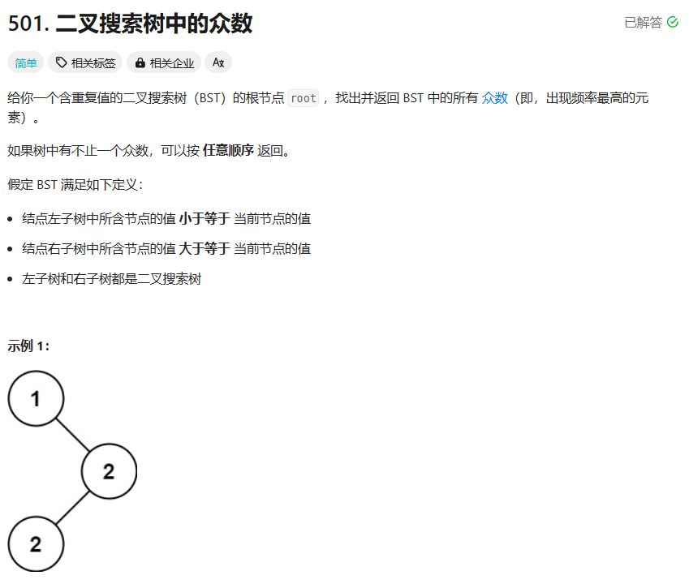

题目思路：

> 简单的一个二叉搜索树的遍历，以及cmp比较函数的使用  
>  以及 vector<pair<int,int>> vec(mp.begin(),mp.end());的使用；其中mp是unordered\_map;

题目代码：

```
/**
 * Definition for a binary tree node.
 * struct TreeNode {
 *     int val;
 *     TreeNode *left;
 *     TreeNode *right;
 *     TreeNode() : val(0), left(nullptr), right(nullptr) {}
 *     TreeNode(int x) : val(x), left(nullptr), right(nullptr) {}
 *     TreeNode(int x, TreeNode *left, TreeNode *right) : val(x), left(left), right(right) {}
 * };
 */
class Solution {
public:
    unordered_map<int, int>mp;

    void dfs(TreeNode* root){
        if(root == nullptr)return;
        dfs(root->left);
        mp[root->val]++;
        dfs(root->right);
    }
    vector<int> findMode(TreeNode* root) {
        dfs(root);
        int maxSum = INT_MIN;
        for(auto & mm : mp){
            maxSum = max(maxSum, mm.second);
        }
        vector<int>res;
        for(auto & mm : mp){
            if(mm.second == maxSum)res.push_back(mm.first);
        }
        return res;
    }
};


/**
 * Definition for a binary tree node.
 * struct TreeNode {
 *     int val;
 *     TreeNode *left;
 *     TreeNode *right;
 *     TreeNode() : val(0), left(nullptr), right(nullptr) {}
 *     TreeNode(int x) : val(x), left(nullptr), right(nullptr) {}
 *     TreeNode(int x, TreeNode *left, TreeNode *right) : val(x), left(left), right(right) {}
 * };
 */
class Solution {
public:
    void searchBST(TreeNode *cur, unordered_map<int, int>&mp){
        if(cur == NULL) return;
        mp[cur->val]++;  //统计下元素的频率
        searchBST(cur->left,mp);
        searchBST(cur->right,mp);
        return;
    }
    bool static cmp(const pair<int,int>&a, const pair<int,int>&b){
        return a.second > b.second;
    }
    vector<int> findMode(TreeNode* root) {
        unordered_map<int,int>mp;
        vector<int>res;
        if(root == NULL)return res;

        searchBST(root,mp);
        vector<pair<int,int>> vec(mp.begin(),mp.end());
        sort(vec.begin(),vec.end(),cmp);
        res.push_back(vec[0].first);
        for(int i = 1; i<vec.size(); i++){
            if(vec[i].second == vec[0].second){
                res.push_back(vec[i].first);
            }else{
                break;
            }
        }
        return res;
    }
};
```

## No.3 完全二叉树

### 题目来源：PTA-L2-035 完全二叉树的层序遍历

题目描述：  
 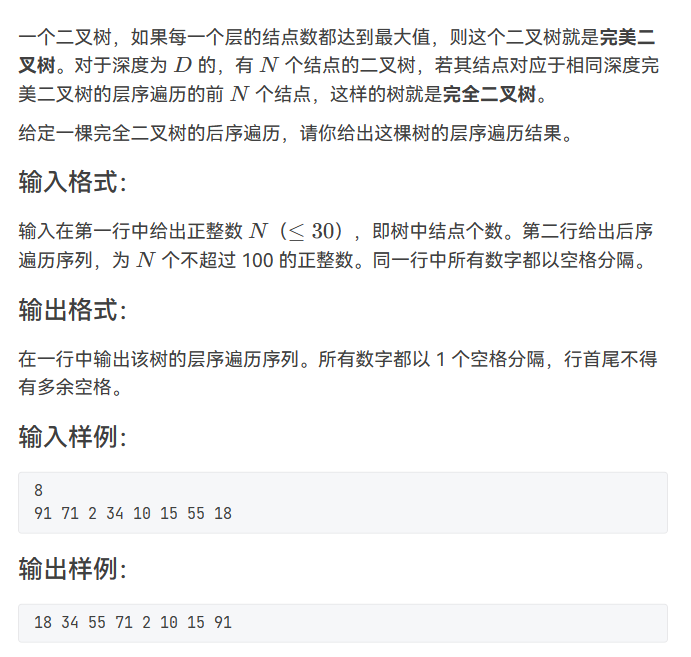

题目思路：

题目代码：

```
#include <iostream>
using namespace std;

int n, tree[31];
//创建
void create(int i) {
    if (i > n)
        return;
    create(2 * i);
    create(2 * i + 1);
    cin >> tree[i];
}

int main() {
    cin >> n;
    create(1);
    for (int i = 1; i <= n; i++) {
        if (i > 1)
            cout << " ";
        cout << tree[i];
    }
    return 0;
}
```

### 题目来源：LeetCode-222-完全二叉树的节点个数

题目描述：  
 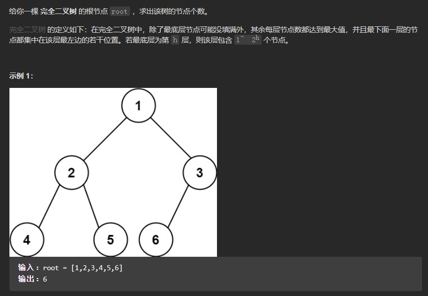

题目思路：

> 三种吧应该然后按照顺序进行整；

题目代码：

```
首先是递归：
1：确定递归函数的参数和返回值：参数就是传入树的根节点，
返回就返回以该节点为根节点二叉树的节点数量，所以返回值为int类型。
2：确定终止条件：如果为空节点的话，就返回0，表示节点数为0。
3：确定单层递归的逻辑：先求它的左子树的节点数量，再求右子树的节点数量，
最后取总和再加一 （加1是因为算上当前中间节点）就是目前节点为根节点的节点数量。
// 版本0
class Solution {
public:
    void dfs(TreeNode* now, int &sum){
        if(now == nullptr)return;
        dfs(now->left, sum);
        sum++;
        dfs(now->right, sum);
    }
    int countNodes(TreeNode* root) {
        if(root == nullptr)return 0;
        int sum = 0;
        dfs(root, sum);
        return sum;
    }
};


// 版本一
class Solution {
private:
    int getNodesNum(TreeNode* cur) {
        if (cur == NULL) return 0;
        int leftNum = getNodesNum(cur->left);      // 左
        int rightNum = getNodesNum(cur->right);    // 右
        int treeNum = leftNum + rightNum + 1;      // 中
        return treeNum;
    }
public:
    int countNodes(TreeNode* root) {
        return getNodesNum(root);
    }
};


然后是迭代法：


最后是层序遍历：
class Solution {
public:
    int countNodes(TreeNode* root) {
        queue<TreeNode*> que;
        if (root != NULL) que.push(root);
        int result = 0;
        while (!que.empty()) {
            int size = que.size();
            for (int i = 0; i < size; i++) {
                TreeNode* node = que.front();
                que.pop();
                result++;   // 记录节点数量
                if (node->left) que.push(node->left);
                if (node->right) que.push(node->right);
            }
        }
        return result;
    }
};
```

### 题目来源：蓝桥杯-第十届-完全二叉树的权值

题目描述：  
 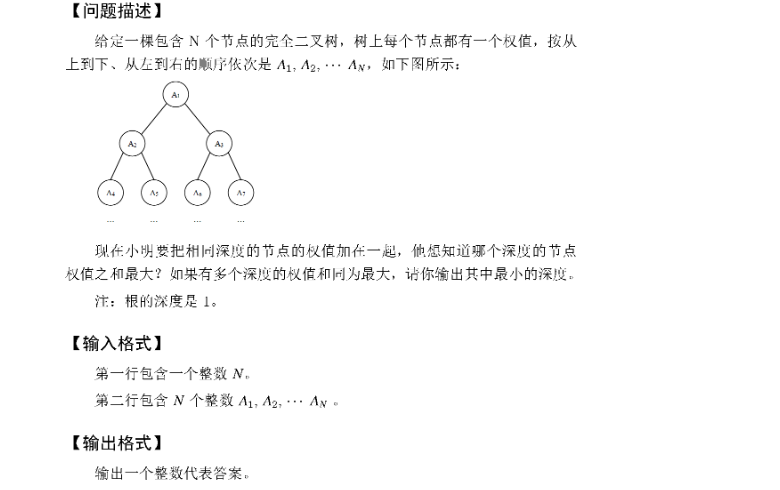

题目思路：

> 思路：边输入边处理，我们容易知道，每一行的最后一个数的下标都是等于(2n)-1，比如第二行的最后一个数等于22-1=3,第三行的最后一个数等于2^3-1=7,用deep表示当前深度，从当前这行的第一项加到最后一项然后和最大值max\_sum比较

题目代码：

```
#include<bits/stdc++.h>
using namespace std;
int Ai[100005];
int main(){
	int N;
	int deep = 1; //深度 
	int sum = 0; //每行的和 
	long long max_sum = -100000000000; //最大的和 
	int max_deep = 1;
	cin>>N;
	for(int i = 1; i <= N; ++i){
		cin>>Ai[i];
		sum += Ai[i];
		if(i == pow(2, deep) - 1){
			if(max_sum < sum){ //注意不要取等号，因为题目要最小的深度 
				max_deep = deep;
				max_sum = sum;
			}
			sum = 0;
			++deep;
		}
	}
	cout<<max_deep<<endl;
	return 0;
}
```

### 题目来源：Acwing-3432-二叉树

题目描述：  
 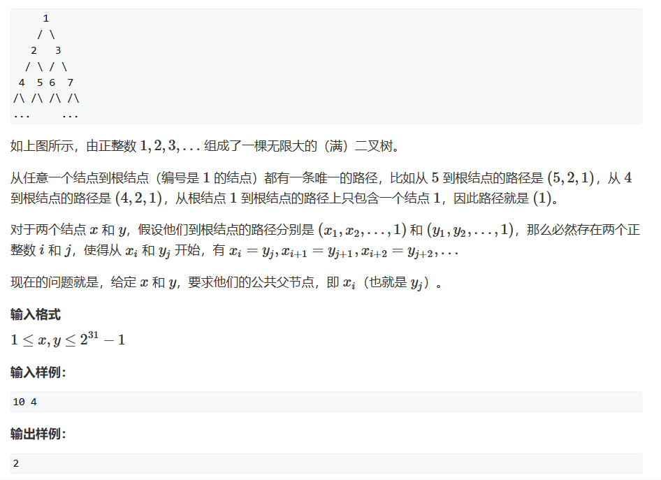

题目思路：

> 考虑满二叉树的，那些 性质；父节点和子节点的关系位置。

题目代码：

```
//因为是满二叉树, 加上二叉树的一些性质: [子节点的数 / 2]向下取整就可以得到父节点，
//所以我们只需要每次判断x跟y哪个大，然后谁大就说明谁的层数比较深 或者 同层，
//所以我们只需要每一次看谁大就除2,看什么时候两个数相等，就说明那个点是重合点，
//最后直接输出x或者y都行

//对于N要进行适应性的更改，对于字段错误
#include<bits/stdc++.h>
using namespace std;
#define inf 0x3f3f3f3f
#define N 100100
int n,m,k,g,d;
int x,y,z;
char ch;
string str;
vector<int>v[N];
void swap(int &a,int &b){
	int temp=a;
	a=b;
	b=temp;
}
int main() {
	//因为是满二叉树  所以直接用数组存了； 
	cin>>x>>y;
	if(x<y)swap(x,y);
	//永远保持x是大于y的
		
	while(x/2!=y){
		x=x/2;
		if(x<y)swap(x,y);
	}
	cout<<y<<endl;
	
	return 0;
}
```

## No.4 二叉搜索树

### 之前的数组模拟模板

```
#include<bits/stdc++.h>
using namespace std;
#define inf 0x3f3f3f3f
#define N 100100
int n,m,k,g,d;
int x,y,z;
char ch;
string str;
vector<int>v[N];
int pre[N];
int ism=0;
vector<int>anspre,ansmid,anspost;
void f(int l , int r){
    if(l>r)return;
    
    int tl=l+1;//左孩子的区间的尽头。
    int tr=r; // 右孩子的区间的尽头。
    if(!ism){
         //正常
        while(tl<=r&&pre[tl]<pre[l])tl++;
        while(tr>=l+1&&pre[tr]>=pre[l])tr--;
    }else{
        while(tl<=r&&pre[tl]>=pre[l])tl++;
        while(tr>=l+1&&pre[tr]<pre[l])tr--;
    }
    if(tl-tr!=1)return;///如果不是二叉搜索树
 	//类似输出前序遍历，中序遍历，后序遍历的写法
	//如果 要求输出中序遍历，则push_back()操作放在中间
    anspre.push_back(pre[l]);
    f(l+1,tr); //左,注意区间要去掉根
    ansmid.push_back(pre[l]);
    f(tl,r);//右
    anspost.push_back(pre[l]);//根，注意为pre[l];
}

struct node{
    int lson,rson;
}f[N];
int post[N],mid[N];
int creat(int lmid , int rmid ,int lpost ,int rpost){
    if(lmid>rmid || lpost >rpost){
        return 0;
    }
    int root=post[rpost];
    int fa=lmid;
    while(mid[fa]!=root)fa++;
    int len=fa-lmid;
    f[root].lson=creat(lmid,fa-1,lpost,lpost+len-1);
    f[root].rson=creat(fa+1,rmid,lpost+len,rpost-1);
    return root;
}

int main() {
    cin>>n;
    for(int i=1;i<=n;i++)cin>>pre[i];
    f(1,n);
```

### 题目来源：LeetCode-108. 将有序数组转换为二叉搜索树

题目描述：

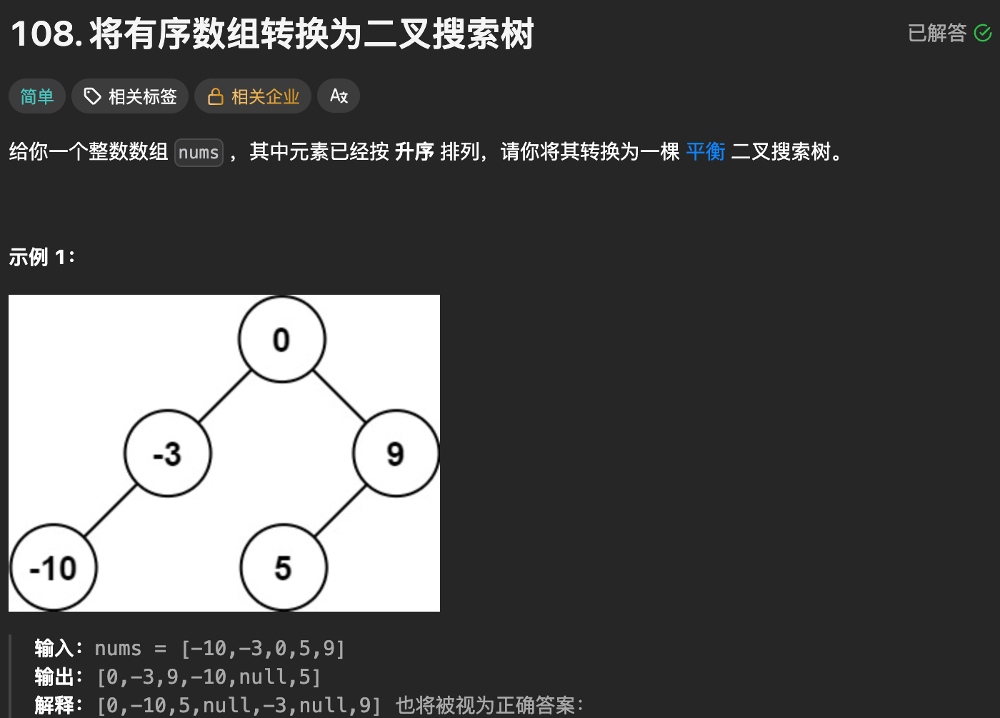

题目思路：

> 核心：取中间做根，左右区间递归建子树  
>  用 区间 l, r  
>  递归划分左右  
>  处理根节点  
>  处理左子树  
>  处理右子树

题目代码：

```
class Solution {
public:

    TreeNode* dfs(vector<int>& nums, int left, int right){
        if(left > right)return nullptr;

        TreeNode* newNode = new TreeNode();
        int mid = left + (right - left) / 2;
        int local_val = nums[mid];

        newNode->val = local_val;
        newNode->left = dfs(nums, left, mid - 1);
        newNode->right = dfs(nums, mid + 1, right);

        return newNode;
    }

    TreeNode* sortedArrayToBST(vector<int>& nums) {
        int n = nums.size();
        if(n == 0)return nullptr;

        return dfs(nums, 0, n - 1);
    }
};


class Solution {
public:
    TreeNode* sortedArrayToBST(vector<int>& nums) {
        return build(nums, 0, nums.size() - 1);
    }

    // 递归构造：中间节点做根 → 左半部分 → 右半部分
    TreeNode* build(vector<int>& nums, int l, int r) {
        if (l > r) return nullptr;

        // 取中间作为根（平衡二叉搜索树）
        int mid = (l + r) / 2;
        TreeNode* root = new TreeNode(nums[mid]);

        // 左区间构造左子树
        root->left = build(nums, l, mid - 1);
        // 右区间构造右子树
        root->right = build(nums, mid + 1, r);

        return root;
    }
};
```

### 题目来源：LeetCode-98. 验证二叉搜索树

题目描述：  
 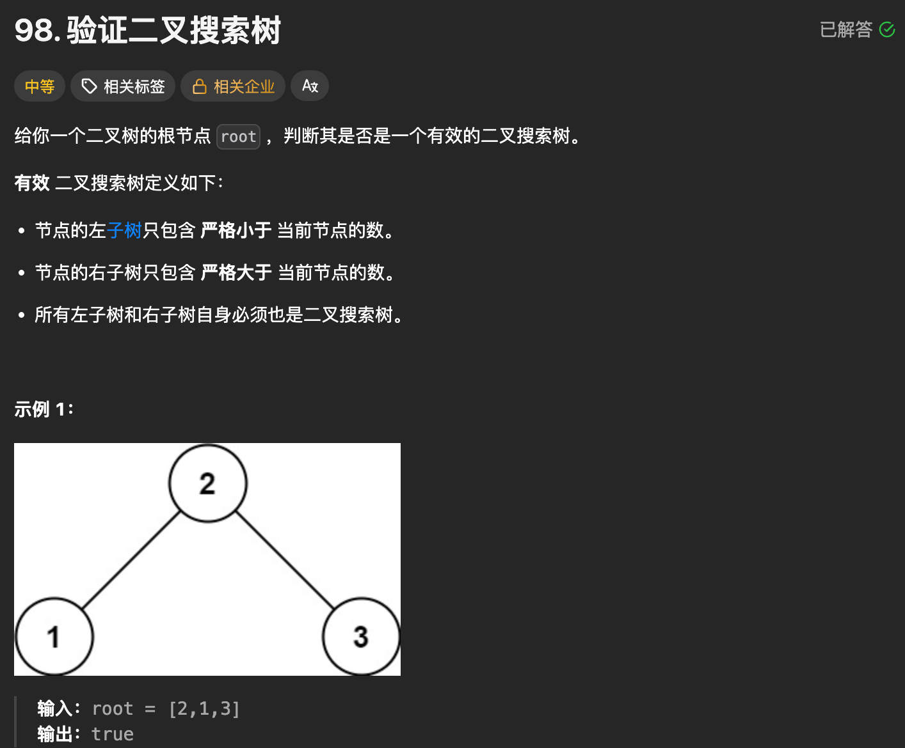

题目思路：

> 递归 + 区间 l, r  
>  判断左右子树范围  
>  先处理左，再处理右，最后判断根  
>  不满足条件直接返回 false

题目代码：

```
class Solution {
public:
    // 所有节点必须在 (low, high) 之间
    bool dfs(TreeNode* root, long long low, long long high) {
        if (root == nullptr) return true;

        // 当前节点不在范围 → 不是BST
        if (root->val <= low || root->val >= high)
            return false;

        // 左子树必须 < 当前值
        bool left = dfs(root->left, low, root->val);
        
        // 右子树必须 > 当前值
        bool right = dfs(root->right, root->val, high);
        
        return left && right;
    }

    bool isValidBST(TreeNode* root) {
        if(root == nullptr)return true;

        bool left = dfs(root->left, LLONG_MIN, root->val);
        bool right = dfs(root->right, root->val, LLONG_MAX);
        return left && right;
        // return dfs(root, LLONG_MIN, LLONG_MAX);
    }
};


class Solution {
public:
    void inorderTraversal(TreeNode* now, vector<int> &ans, bool &isV){
        if(now == nullptr)return;
        inorderTraversal(now->left, ans, isV);
        if(!ans.empty() && now->val <= ans.back()){
            isV = false;
            return;
        }
        ans.push_back(now->val);
        inorderTraversal(now->right, ans, isV);
    }


    bool isValidBST(TreeNode* root) {
        if(root == nullptr)return true;
        vector<int>ans;
        bool isV = true;
        inorderTraversal(root, ans, isV);
        return isV;
    }
};


/**
 * Definition for a binary tree node.
 * struct TreeNode {
 *     int val;
 *     TreeNode *left;
 *     TreeNode *right;
 *     TreeNode() : val(0), left(nullptr), right(nullptr) {}
 *     TreeNode(int x) : val(x), left(nullptr), right(nullptr) {}
 *     TreeNode(int x, TreeNode *left, TreeNode *right) : val(x), left(left), right(right) {}
 * };
 */
class Solution {
public:
    // 原来的写法：递归区间判断 + 范围限制
    bool helper(TreeNode* root, long long minVal, long long maxVal) {
        // 空节点合法
        if (root == nullptr) return true;

        // 当前节点不在 (min, max) 之间 → 不是 BST
        if (root->val <= minVal || root->val >= maxVal) {
            return false;
        }

        // 左子树必须 < 根
        bool left = helper(root->left, minVal, root->val);
        // 右子树必须 > 根
        bool right = helper(root->right, root->val, maxVal);

        // 左右都合法才是真的合法
        return left && right;
    }

    bool isValidBST(TreeNode* root) {
        // 初始：根可以是任意值（介于 极小值 ~ 极大值）
        return helper(root, LLONG_MIN, LLONG_MAX);
    }
};
```

### 题目来源：LeetCode-230. 二叉搜索树中第 K 小的元素

题目描述：  
 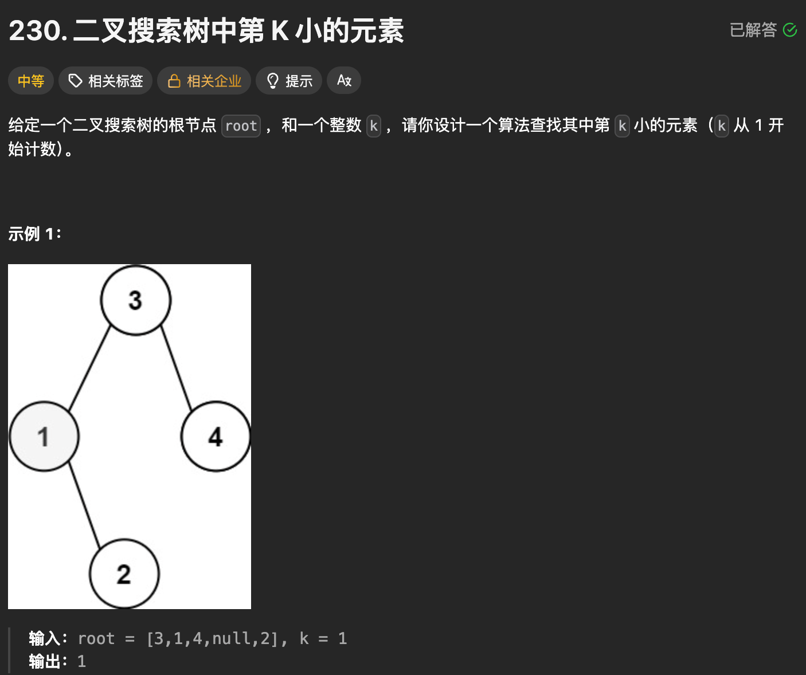

题目思路：

> 核心思路：  
>  二叉搜索树 中序遍历 = 升序序列  
>  之前代码用：递归 + 左→根→右  
>  这道题：遍历到第 k 个节点直接返回答案

题目代码：

```
class Solution {
public:
    void inorderTraversal(TreeNode* now, vector<int> &ans, const int k){
        if(now == nullptr)return;
        inorderTraversal(now->left, ans, k);
        ans.push_back(now->val);
        if(ans.size() == k)return;
        inorderTraversal(now->right, ans, k);
    }
    // 中序遍历是 升序;
    int kthSmallest(TreeNode* root, int k) {
        if(root == nullptr)return 0;
        vector<int>ans;
        inorderTraversal(root, ans, k);
        return ans[k - 1];
    }
};
```

### 题目来源：PTA-L2-004 这是二叉搜索树吗？

题目描述：  
 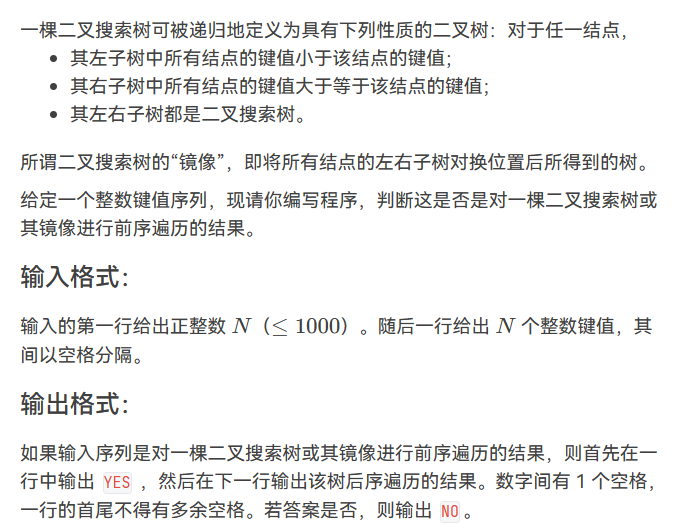

题目思路：

题目代码：

```
#include<bits/stdc++.h>
using namespace std;
#define inf 0x3f3f3f3f
#define N 100100
int n,m,k,g,d;
int x,y,z;
char ch;
string str;
vector<int>v[N];
int pre[N];
int ism=0;
vector<int>ans;
void f(int l , int r){
    if(l>r)return;
    
    int tl=l+1;//左孩子的区间的尽头。
    int tr=r; // 右孩子的区间的尽头。
    if(!ism){
         //正常
        while(tl<=r&&pre[tl]<pre[l])tl++;
        while(tr>=l+1&&pre[tr]>=pre[l])tr--;
    }else{
        while(tl<=r&&pre[tl]>=pre[l])tl++;
        while(tr>=l+1&&pre[tr]<pre[l])tr--;
    }
    if(tl-tr!=1)return;///如果不是二叉搜索树
 	//类似输出前序遍历，中序遍历，后序遍历的写法
	//如果 要求输出中序遍历，则push_back()操作放在中间
    f(l+1,tr); //左,注意区间要去掉根
    f(tl,r);//右
    ans.push_back(pre[l]);//根，注意为pre[l];
}
int main() {
    cin>>n;
    for(int i=1;i<=n;i++)cin>>pre[i];
    f(1,n);
    ///第一次不成功可能因为是镜像
    if(ans.size()!=n){
        ans.clear();
        ism=1;
        f(1,n);
    }
    ///镜像还不成功就说明不是搜索二叉树
    if(ans.size()!=n){
        cout<<"NO"<<endl;
    }else{
        cout<<"YES"<<endl;
        for(int i=0;i<ans.size();i++){
            if(i==0)cout<<ans[i];
            else cout<<" "<<ans[i];
        }
    }

	return 0;
}
```

### 题目来源：PTA-L3-010 是否完全二叉搜索树

题目描述：  
 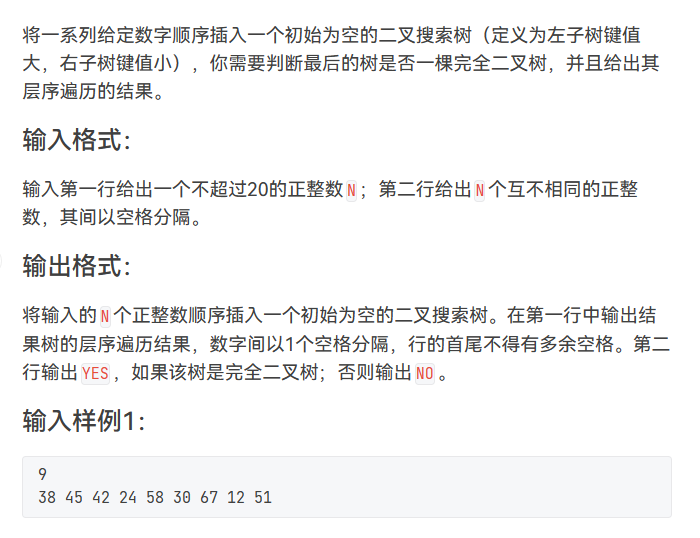

题目思路：

> 注意这里的题目 的 是 左边的大，右边的小；；

题目代码：

```
//普通模板
#include <bits/stdc++.h>
using namespace std;

struct node {
    int l = -1; // 左孩子
    int r = -1; // 右孩子
    int fa = -1; // 父亲
    int h; // 深度
};

map<int , node> tree;

void insert(int root, int v, int h) {
    if (root == -1) return;
    int& child = v < root ? tree[root].r : tree[root].l;
    if (child != -1) {
        insert(child, v, h + 1);
    } else {
        child = v;
        tree[v].fa = root;
        tree[v].h = h;
    }
}


// 判断以 root 为根的二叉树是否为完全二叉树
bool isCompleteTree(int root) {
    queue<int> q;
    q.push(root);
    bool flag = false; // 表示是否出现了没有右孩子的节点
    while (!q.empty()) {
        int cur = q.front();
        q.pop();
        if (tree[cur].l != -1) {
            if (flag) { // 如果之前已经出现了没有右孩子的节点
                return false;
            }
            q.push(tree[cur].l);
        } else { // 如果出现了没有左孩子或者左右孩子都没有的节点
            flag = true;
        }
        if (tree[cur].r != -1) {
            if (flag) {
                return false;
            }
            q.push(tree[cur].r);
        } else {
            flag = true;
        }
    }
    return true;
}

int main() {
    int n;
    cin >> n;
    int root;
    cin >> root;
    int x, y, z;
    for (int i = 2; i <= n; i++) {
        cin >> x;
        insert(root, x, 1);
    }

    // 层序输出
    vector<int> ans;
    queue<int> q;
    q.push(root);
    while (!q.empty()) {
        int index = q.front();
        ans.push_back(index);
        q.pop();
        if (tree[index].l != -1) q.push(tree[index].l);
        if (tree[index].r != -1) q.push(tree[index].r);
    }
    for(int i=0;i<ans.size();i++){
        if(i==0)cout<<ans[i];
        else cout<<" "<<ans[i];
    }
    cout << endl;
    
    // 判断是否为完全二叉树
    bool isComplete = isCompleteTree(root);
    if (isComplete) {
        cout<<"YES";
    }else{
        cout<<"NO";
    }

    return 0;
}


//奇思妙想的
#include<bits/stdc++.h>
using namespace std;
const int maxn = 1010;

int Tree[maxn];

//因为二叉树是直接给一堆数，让你创建，所以如果是完全的话，反正位置就是2*i 和 2*i+1
void update(int root, int val){
	if(Tree[root]==0) // 第一个根节点是没有的一开始就像ok那样的；；具体到每一个小树都是这样的。
		Tree[root] = val;
	else if(val > Tree[root])
		update(root*2, val);
	else 
		update(root*2+1,val);
}

int main(){
	int n;  
    cin>>n;
	for(int i = 1; i <= n; i++){
		int x;  
        cin>>x;  
        update(1,x);
	}
	int ok = 0, cnt = 0;
	for(int i = 1; i < maxn; i++){
		if(Tree[i]){
            if(ok==0){
                cout<<Tree[i];
                ok=1;
            }else{
                cout<<" "<<Tree[i];
            }
			cnt = i;
		}
	}
	if(cnt > n)cout<<"\nNO\n";
	else cout<<"\nYES\n";
	return 0;
}
```

### 题目来源：PTA-L3-016 二叉搜索树的结构

题目描述：  
 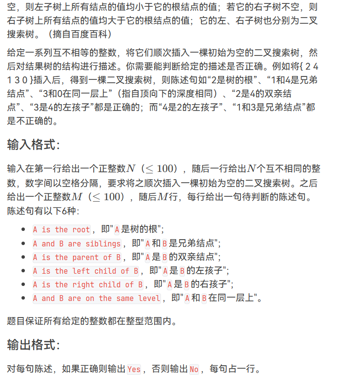

题目思路：

题目代码：

```
#include <bits/stdc++.h>
using namespace std;
#define inf 0x3f3f3f3f
#define N 10001
struct node{
    int l=-1;   //左孩子
    int r=-1;   //右孩子
    int fa=-1;  // 父
    int h;          //深度
};

map<int , node> tree;
void Increat(int ro, int h , int v){
    if(ro==-1) return ;
    int uu=(v<ro?tree[ro].l : tree[ro].r);
    if(uu!=-1){
        Increat(uu , h+1 , v);
    }else{
        if(v<ro){
            tree[ro].l=v;
        }else{
            tree[ro].r=v;
        }
        tree[v].fa=ro;
        tree[v].h=h;
    }
}

bool judge(int ro, int a, int b, string lk){
	if(lk=="root")return ro==a;
	if(tree.find(a)==tree.end() || tree.find(b)==tree.end())return false;
	if(lk=="siblings")return tree[a].fa==tree[b].fa;
	if(lk=="parent")return tree[a].l==b || tree[a].r==b;
	if(lk=="left")return tree[b].l == a;
	if(lk=="right")return tree[b].r == a;
	if(lk=="level")return tree[a].h==tree[b].h;
}

int main() {

    int n;
    int root;
    cin>>n;
    cin>>root;
    int x,y,z;
    for(int i=2;i<=n;i++){
        cin>>x;
        Increat(root, 1 ,x);
    }

	int m, a=0, b=0;
    cin>>m;
	for(int i = 1; i <= m; i++){
		string s, lk;
		cin>>a>>s;
		if(s=="and"){
			cin>>b>>s>>s;
			if(s=="siblings")lk = s;
			else cin>>s>>s>>lk;
		}else{  // 这个就是is了
			cin>>s>>lk;
			if(lk=="parent")cin>>s>>b;
			else if(lk!="root")cin>>s>>s>>b;
		}
		if(judge(root,a,b,lk))cout<<"Yes\n";
		else cout<<"No\n";
	}


    return 0;
}
```

### 题目来源：LeetCode-510-二叉搜索树中的中序后继II

题目描述：  
 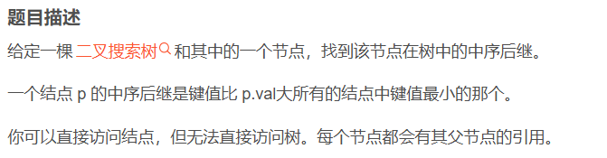

题目思路：

> 对于中序遍历要理解，以及结构过程  
>  二叉搜索树的性质。

题目代码：

```
class Solution {
public:
    Node* inorderSuccessor(Node* node) {
        if(!node) return nullptr;
        
        // 如果node有右子树，则后继节点是右子树最左节点
        if(node->right){
            node = node->right;
            while(node->left)
                node = node->left;
            return node;
        }else{
            // 如果node没有右子树
            // 1：如果node是父节点的左孩子，则后继节点是父节点
            // 2: 如果node是父节点右孩子，则不断向上找到某个节点p，是其父节点的左孩子，则该父节点为后继
            Node* parent = node->parent;
            while(parent && parent->left!=node){
                node = parent;
                parent = node->parent;
            }
            return parent;
        }
    }
};
```

## No.5 顶堆的模拟模板

### 题目来源：PTA-L2-012 关于堆的判断

题目描述：  
 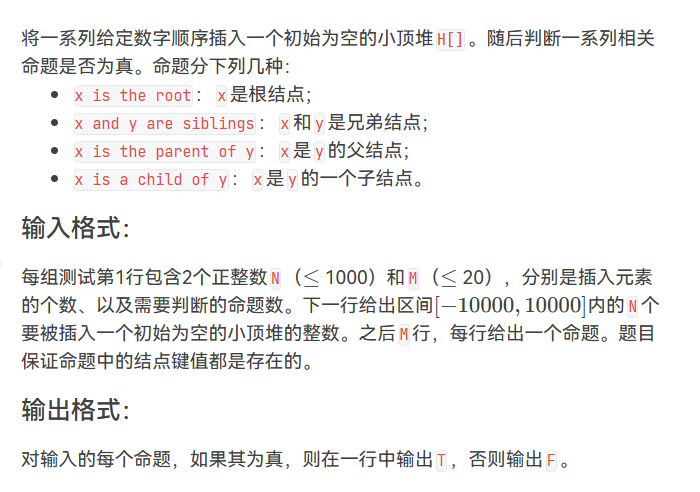

题目思路：

题目代码：

```
//下一行给出区间[−10000,10000]内的N个要被插入一个初始为空的小顶堆的整数
//即要根据给的进行建立堆，，
//且根据层序进行创建储存。。
//因为是堆总是一棵完全二叉树。所以可以用 2*i or 2*i+1


#include<bits/stdc++.h>
using namespace std;
#define inf 0x3f3f3f3f
#define N 100100
int n,m,k,g,d;
int x,y,z;
char ch;
string str;
vector<int>v[N];
int h[N];
int find(int x){
    for(int i=1;i<=n;i++){
        if(h[i]==x){
            return i;
        }
    }
    return -1;
}
int main() {
    cin>>n>>m;
    for(int i=1;i<=n;i++){
        cin>>h[i];
        int k=i;
        while(k>1&&h[k]<h[k/2]){
            swap(h[k],h[k/2]);
            k=k/2;
        }
    }
    string s;
    while(m--){
        cin>>x;
        int a=find(x);//根据结点的值找到该节点值的位置；
        cin>>s;
        if(s=="and"){
            cin>>y>>s>>s;
            int b=find(y);
            if(a/2==b/2)cout<<"T"<<endl;
            else cout<<"F"<<endl;
        }else{
            cin>>s;
            if(s=="a"){
                cin>>s>>s>>y;
                int b=find(y);
                if(a/2==b)cout<<"T"<<endl;
                else cout<<"F"<<endl;
            }else{
                cin>>s;
                if(s=="root"){
                    if(a==1)cout<<"T"<<endl;
                    else cout<<"F"<<endl;
                }else{
                    cin>>s>>y;
                    int b=find(y);
                    if(a==b/2)cout<<"T"<<endl;
                    else cout<<"F"<<endl;
                }
                
            }
        }
    }


	return 0;
}
```

### 题目来源：蓝桥杯-2018省赛-堆的计数

题目描述：  
 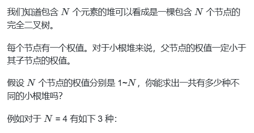

题目思路：


题目代码：

```
import java.util.*;

public class Main {
    static long mod=1000000009;
    static long[] f;//阶乘的数量
    static long[] k;
    static int[] sum;//用于记录以i为根节点的堆的个数；
    static long[] dp;//用于记录以i为根节点最小堆堆的个数；
    public static void main(String[] args) {
        // TODO Auto-generated method stub
        Scanner sc=new Scanner(System.in);
        int n=sc.nextInt();
        f=new long[n+5];
        k=new long[n+5];
        sum=new int[n+5];
        dp=new long[n+5];
        f[0]=k[0]=1;
        for(int i=1;i<n+5;i++){
            f[i]=f[i-1]*i%mod;
            k[i]=pow(f[i],mod-2);
        }
        Arrays.fill(dp, 1);
        for(int i=n;i>=1;i--){
            sum[i]=(i*2<=n?sum[i*2]:0)+(i*2+1<=n?sum[i*2+1]:0)+1;
        }
        for(int i=n;i>=1;i--){
            if(2*i+1<=n){
                dp[i]=C(sum[i]-1,sum[i*2])*dp[2*i]%mod*dp[2*i+1]%mod;
            }
        }
        System.out.println(dp[1]);
    }
    
    static long C(int a,int b){
        return f[a]*k[b]%mod*k[a-b]%mod;
    }
    
    static long pow(long a,long b){
        if(a==1||b==0)
            return 1;
        long ans=1;
        while(b>0){
            if(b%2!=0){
                ans=ans*a%mod;
            }
            a=a*a%mod;
            b/=2;
        }
        return ans;
    }
}
```

## No.6 前缀树

### 题目来源：LeetCode-208. 实现 Trie (前缀树)[❌]

题目描述：  
 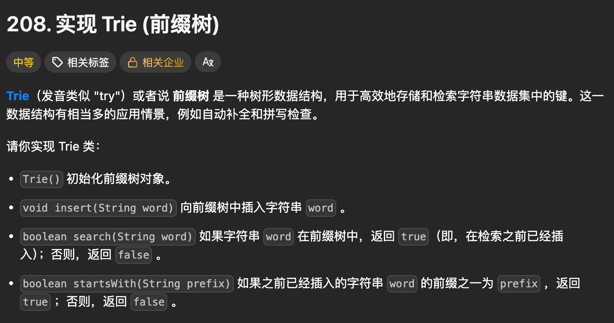

题目思路：


题目代码：

```
class Trie {
private:
    vector<Trie*> children;
    bool isEnd;

    Trie* searchPrefix(string prefix) {
        Trie* node = this;
        for (char ch : prefix) {
            ch -= 'a';
            if (node->children[ch] == nullptr) {
                return nullptr;
            }
            node = node->children[ch];
        }
        return node;
    }

public:
    Trie() : children(26), isEnd(false) {}

    void insert(string word) {
        Trie* node = this;
        for (char ch : word) {
            ch -= 'a';
            if (node->children[ch] == nullptr) {
                node->children[ch] = new Trie();
            }
            node = node->children[ch];
        }
        node->isEnd = true;
    }

    bool search(string word) {
        Trie* node = this->searchPrefix(word);
        return node != nullptr && node->isEnd;
    }

    bool startsWith(string prefix) {
        return this->searchPrefix(prefix) != nullptr;
    }
};
```
