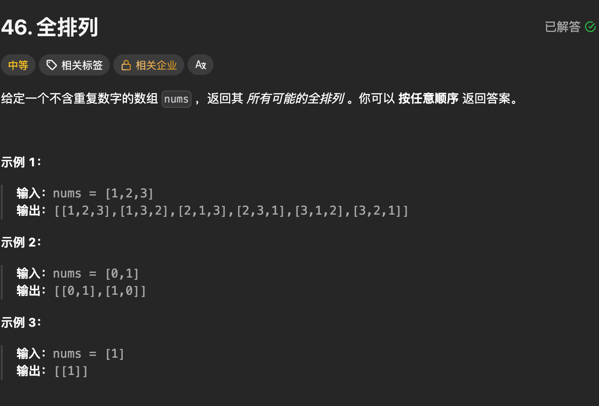
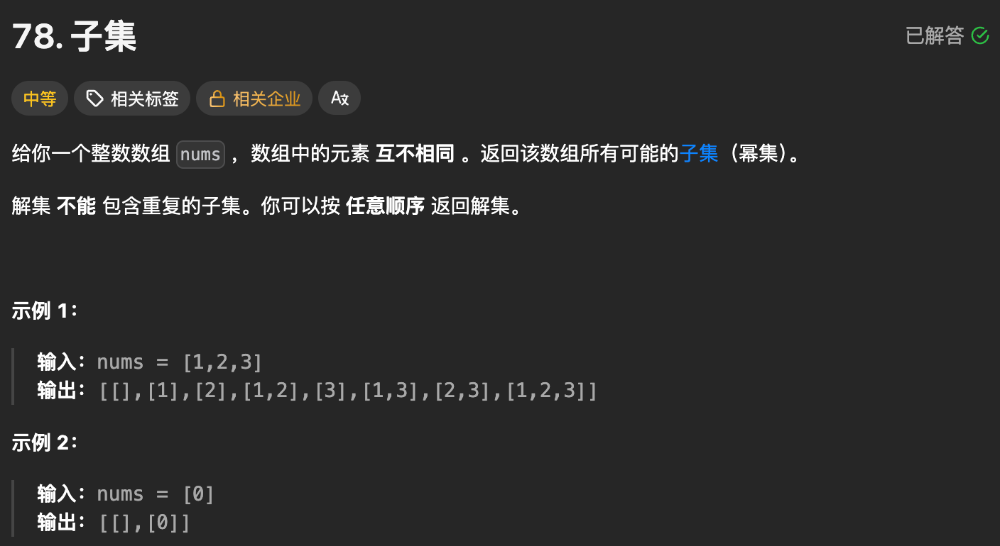
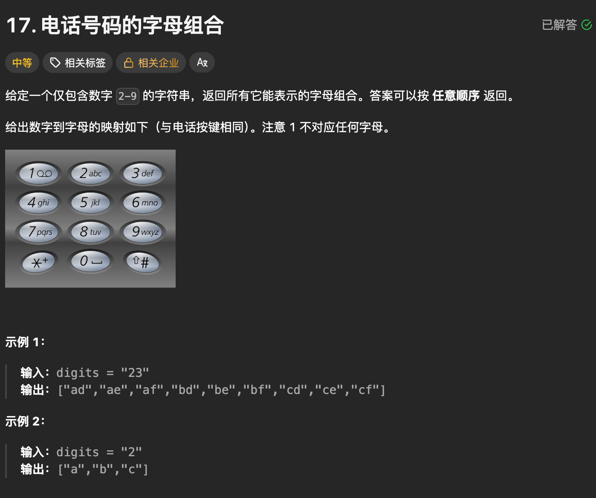
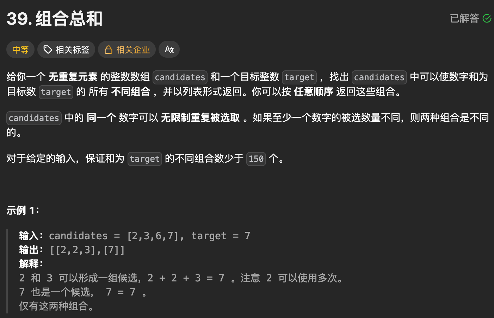
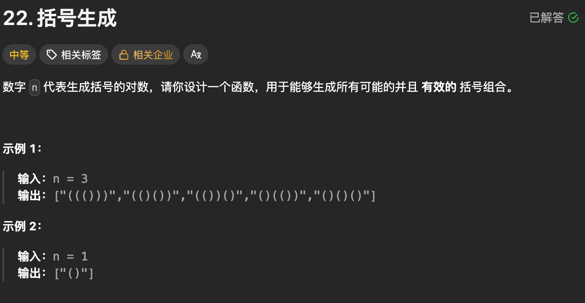
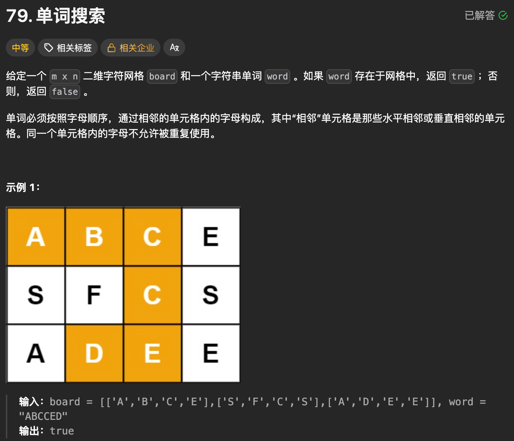
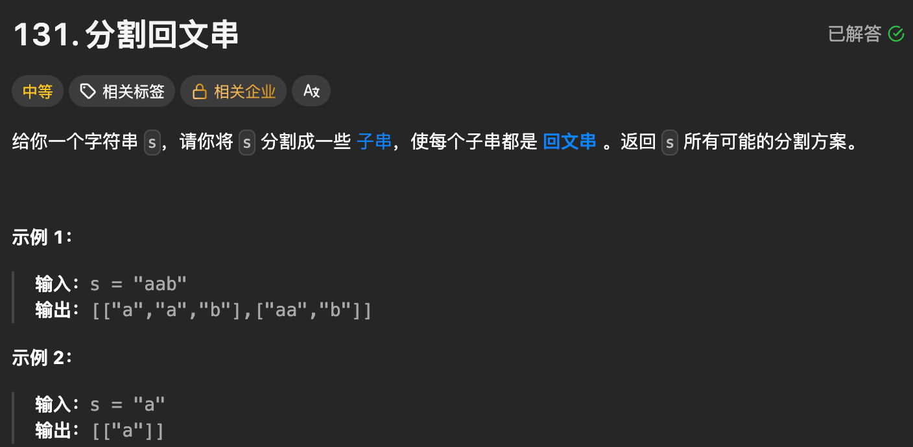
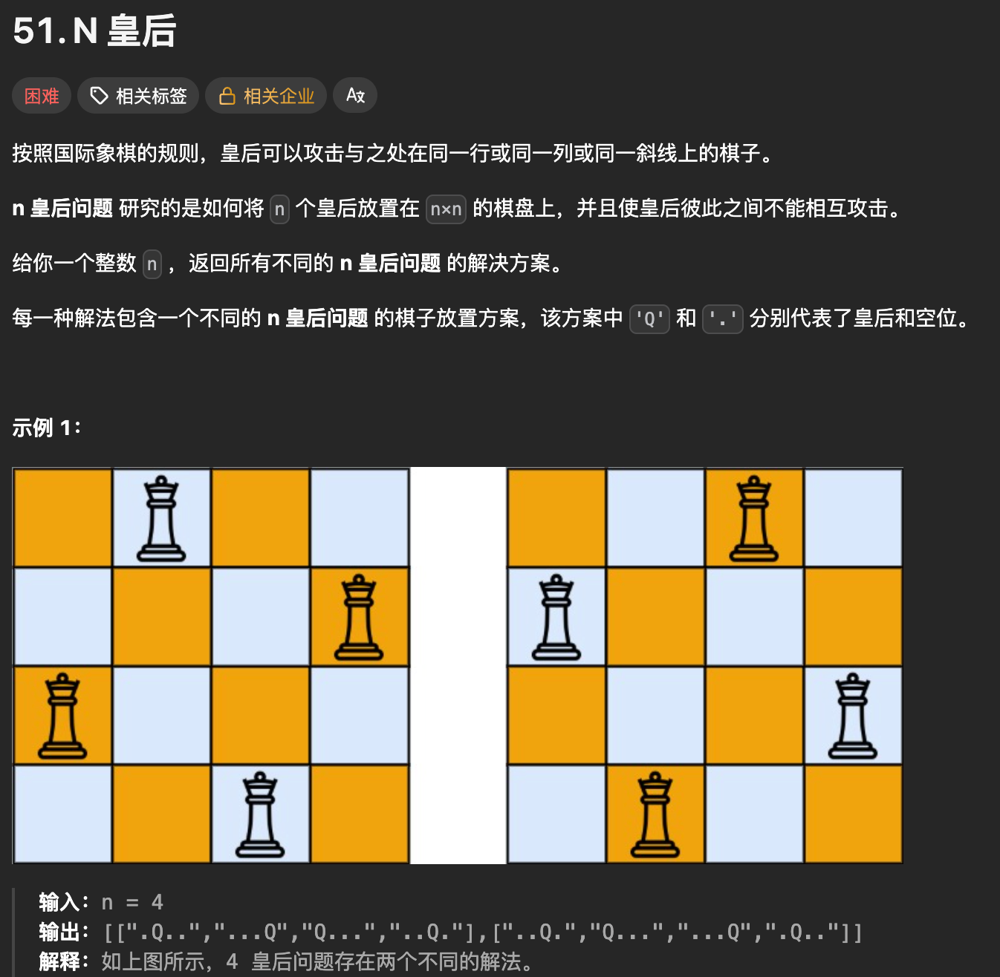
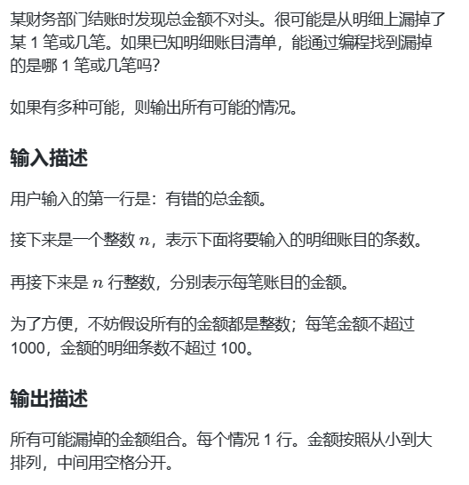
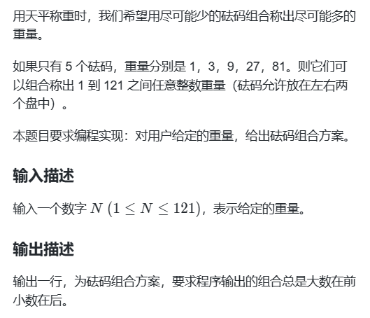

# 【完整题单11、回溯算法】【✅】

> 来源：[【完整题单11、回溯算法】【✅】](https://blog.csdn.net/weixin_51429773/article/details/129864974) · 发布时间：2026-06-14 · 阅读量：粉丝可见

#### 目录

- [知识框架](#_2)
- [No.0 筑基](#No0__4)
- - [一、回溯算法简介：](#_10)
  - [二、回溯算法问题解决方案：](#_22)
  - [三、回溯算法问题解决模板](#_34)
  - [四、整体模板如下](#_87)
- [No.1 组合问题](#No1__140)
- - [题目来源：LeetCode-46. 全排列](#LeetCode46__144)
  - [题目来源：LeetCode-78. 子集](#LeetCode78__202)
  - [题目来源：LeetCode-17-电话号码的字母组合](#LeetCode17_262)
  - [题目来源：LeetCode-39. 组合总和](#LeetCode39__321)
  - [题目来源：LeetCode-22. 括号生成](#LeetCode22__443)
  - [题目来源：LeetCode-79. 单词搜索](#LeetCode79__572)
  - [题目来源：LeetCode-131. 分割回文串](#LeetCode131__629)
  - [题目来源：LeetCode-51. N 皇后](#LeetCode51_N__702)
  - [题目来源：LeetCode-77-组合](#LeetCode77_784)
  - [题目来源：LeetCode-216-组合总和 III](#LeetCode216_III_845)
  - [题目来源：蓝桥杯-2011省赛-金额查错](#2011_915)
  - [题目来源：蓝桥杯-2011省赛-5个砝码](#20115_989)
- [No.2 切割问题](#No2__1059)
- [No.4 子集问题](#No4__1063)
- [No.5 排列问题](#No5__1067)
- [No.6 棋盘问题](#No6__1071)

## 知识框架

## No.0 筑基

> 请先学习下知识点，阁下！  
>  题目大部分来源于此：[代码随想录：回溯法](https://www.programmercarl.com/%E5%9B%9E%E6%BA%AF%E7%AE%97%E6%B3%95%E7%90%86%E8%AE%BA%E5%9F%BA%E7%A1%80.html)

### 一、回溯算法简介：

1. 回溯法也可以叫做回溯搜索法，它是一种搜索的方式。
2. 回溯是递归的副产品，只要有递归就会有回溯。
3. **因为回溯的本质是穷举，穷举所有可能，然后选出我们想要的答案**，如果想让回溯法高效一些，可以加一些剪枝的操作，但也改不了回溯法就是穷举的本质。那么既然回溯法并不高效为什么还要用它呢？因为没得选，一些问题能暴力搜出来就不错了，撑死了再剪枝一下，还没有更高效的解法。

### 二、回溯算法问题解决方案：

1. **回溯法解决的问题都可以抽象为树形结构**，是的，我指的是所有回溯法的问题都可以抽象为树形结构！
2. 因为回溯法解决的都是在集合中递归查找子集，**集合的大小就构成了树的宽度，递归的深度，都构成的树的深度**。
3. 递归就要有终止条件，所以必然是一棵高度有限的树（N叉树）。

### 三、回溯算法问题解决模板

1、回溯三部曲1：回溯函数模板返回值以及参数

回溯算法中函数返回值一般为void。再来看一下参数，因为回溯算法需要的参数可不像二叉树递归的时候那么容易一次性确定下来，所以一般是先写逻辑，然后需要什么参数，就填什么参数。

```
void backtracking(参数)
```

2、回溯三部曲2：回溯函数终止条件

因为所有的回溯问题基本就是转化为抽象的树结构，既然是树形结构，就知道遍历树形结构一定要有终止条件。

所以回溯也有要终止条件。什么时候达到了终止条件，树中就可以看出，一般来说搜到叶子节点了，也就找到了满足条件的一条答案，把这个答案存放起来，并结束本层递归。

```
if (终止条件) {
    存放结果;
    return;
}
```

3、回溯三部曲3：回溯搜索的遍历过程

回溯法一般是在集合中递归搜索，集合的大小构成了树的宽度，递归的深度构成的树的深度。

如下图所示：

https://code-thinking-1253855093.file.myqcloud.com/pics/20210130173631174.png

```
for (选择：本层集合中元素（树中节点孩子的数量就是集合的大小）) {
    处理节点;
    backtracking(路径，选择列表); // 递归
    回溯，撤销处理结果
}

for循环就是遍历集合区间，可以理解一个节点有多少个孩子，这个for循环就执行多少次。
大家可以从图中看出for循环可以理解是横向遍历，backtracking（递归）就是纵向遍历，这样就把这棵树全遍历完了，一般来说，搜索叶子节点就是找的其中一个结果了。这样就是暴力搜索的了；
```

### 四、整体模板如下

```
void backtracking(参数) {
    if (终止条件) {
        存放结果;
        return;
    }

    for (选择：本层集合中元素（树中节点孩子的数量就是集合的大小）) {
        处理节点;
        backtracking(路径，选择列表); // 递归
        回溯，撤销处理结果
    }
}


在这里要定义两个全局变量，一个用来存放符合条件单一结果，一个用来存放符合条件结果的集合
然后还需要一个参数，为int型变量startIndex，这个参数用来记录本层递归的中，集合从哪里开始遍历（集合就是[1,...,n] ）。
class Solution {
private:
    vector<vector<int>> result; // 存放符合条件结果的集合
    vector<int> path; // 用来存放符合条件结果
    void backtracking(int n, int k, int startIndex) {
        if (path.size() == k) {
            result.push_back(path);
            return;
        }
        for (int i = startIndex; i <= n; i++) {
            path.push_back(i); // 处理节点
            backtracking(n, k, i + 1); // 递归
            path.pop_back(); // 回溯，撤销处理的节点
        }
    }
public:
    vector<vector<int>> combine(int n, int k) {
        result.clear(); // 可以不写
        path.clear();   // 可以不写
        backtracking(n, k, 1);
        return result;
    }
};
```

## No.1 组合问题

### 题目来源：LeetCode-46. 全排列

题目描述：



题目思路：


题目代码：

```
class Solution {
private:
    vector<vector<int>>result;
    vector<int>path; // path的加入是此刻时态path的加入
    vector<int>used;
    int n;
    // 整个过程就一个 path
    void backtracking(const vector<int>& nums){
        if(path.size() == n){ // 这里经常使用path的size进行判断
            result.push_back(path);
            return;
        }

        //暴力遍历所有的path的时态,剩下的所有的
        for(int i = 0; i < n; i++){
            // 判断已经存在的
            if(used[i])continue;

            
            path.push_back(nums[i]); //加入到path里面即是true
            used[i] = 1;

            backtracking(nums);
            path.pop_back(); // 不在path里面即是false
            used[i] = 0;
        }
    }

public:
    vector<vector<int>> permute(vector<int>& nums) {
        result.clear();
        path.clear();
        n = nums.size();
        used.resize(n, 0);

        backtracking(nums);
        return result;
    }
};
```

### 题目来源：LeetCode-78. 子集

题目描述：  
 

题目思路：


题目代码：

```
class Solution {
private:
    std::vector<std::vector<int>>result;
    std::vector<int>path; // path的加入是此刻时态path的加入
    std::vector<int>used;
    int n;

    void backtracking(const vector<int> & nums, int start_id, const int k){
        if(path.size() == k){ // 这里经常使用path的size进行判断
            result.push_back(path);
            return;
        }

        // 暴力遍历所有的path的时态
        // 这里要弄清楚 全排列和子集的区别】】
        for(int i = start_id; i < n; i++){
            // 判断已经存在的
            if(used[i])continue;
            path.push_back(nums[i]); //加入到path里面即是true
            used[i] = 1;

            backtracking(nums, i + 1, k);
            path.pop_back(); // 不在path里面即是false
            used[i] = 0;
        }
    }

public:
    vector<vector<int>> subsets(vector<int>& nums) {
        path.clear();
        result.clear();
        n = nums.size();
        used.resize(n, 0);
        result.push_back(path);

        // 暴力size = i
        for(int i = 1; i <= n; i++){
            path.clear();
            used.assign(n, 0);
            backtracking(nums, 0, i);
        }
        return result;
    }
};
```

### 题目来源：LeetCode-17-电话号码的字母组合

题目描述：  
 

题目思路：


题目代码：

```
// 版本一
class Solution {
private:
    const string letterMap[10] = {
        "", // 0
        "", // 1
        "abc", // 2
        "def", // 3
        "ghi", // 4
        "jkl", // 5
        "mno", // 6
        "pqrs", // 7
        "tuv", // 8
        "wxyz", // 9
    };
public:
    vector<string> result;
    string s;
    void backtracking(const string& digits, int index) {
        if (index == digits.size()) {
            result.push_back(s);
            return;
        }
        int digit = digits[index] - '0';        // 将index指向的数字转为int
        string letters = letterMap[digit];      // 取数字对应的字符集
        for (int i = 0; i < letters.size(); i++) {
            s.push_back(letters[i]);            // 处理
            backtracking(digits, index + 1);    // 递归，注意index+1，一下层要处理下一个数字了
            s.pop_back();                       // 回溯
        }
    }
    vector<string> letterCombinations(string digits) {
        s.clear();
        result.clear();
        if (digits.size() == 0) {
            return result;
        }
        backtracking(digits, 0);
        return result;
    }
};
```

### 题目来源：LeetCode-39. 组合总和

题目描述：  
 

题目思路：


题目代码：

```
vector<vector<int>>result;
vector<int>path;
vector<int>used;
int n;

// 整个过程就一个 path
void backtracking(const vector<int>& nums, int index, const int target, int sum){
  if(sum > target)return;
  if(sum == target){
    result.push_back(path);
    return;
  }

  for(int i = index; i < n; i++){
    // if(used[i])continue;

    path.push_back(nums[i]);
    // used[i] = 1;
    sum += nums[i];
    backtracking(nums, i, target, sum);
    path.pop_back();
    // used[i] = 0;
    sum -= nums[i];
  }
}

vector<vector<int>> combinationSum(vector<int>& candidates, int target) {
  result.clear();
  path.clear();
  n = candidates.size();
  used.resize(n, 0);
  backtracking(candidates,0,target,0);
  return result;
}


class Solution {
private:
    std::vector<std::vector<int>>result;
    std::vector<int>path; // path的加入是此刻时态path的加入
    std::vector<int>used;
    int n;
    std::vector<int>nums;

    void backtracking(int start_id, int k,int target, int sum){
        // 这次这里适当剪枝
        if(sum > target)return;
        if(path.size() == k){ // 这里经常使用path的size进行判断
            if(sum == target){
                result.push_back(path);
            }
            return;
        }

        // 暴力遍历所有的path的时态
        // 这里要弄清楚 全排列和子集的区别】】
        // 因为这次也是 子集合的问题，但是可以选择本次的无限制所以
        // backtracking(i, k, target, sum); 这里是i 不是 i+1
        for(int i = start_id; i < n; i++){
            // 判断已经存在的
            // if(used[i])continue;
            path.push_back(nums[i]); //加入到path里面即是true
            // used[i] = 1;
            sum = sum + nums[i];

            backtracking(i, k, target, sum);


            path.pop_back(); // 不在path里面即是false
            sum = sum - nums[i];
            // used[i] = 0;
        }
    }


public:
    vector<vector<int>> combinationSum(vector<int>& candidates, int target) {
        path.clear();
        result.clear();
        n = candidates.size();
        used.resize(n, 0);
        

        // 找出所有size的组合，然后看是否 等于 target
        std::sort(candidates.begin(), candidates.end());
        int small_ = candidates[0];
        int max_ = target / small_ + 1;
        nums = candidates;

        // size = i
        for(int i = 1; i <= max_; i++){
            for(int j = 0; j < n; j++){
                path.clear();
                used.assign(n, 0);

                path.push_back(candidates[j]);
                used[j] = 1;
                backtracking(j, i, target, candidates[j]);
            }
        }
        return result;


    }
};
```

### 题目来源：LeetCode-22. 括号生成

题目描述：  
 

题目思路：


题目代码：

```
vector<string>result;
string  path;
vector<char>used;
int n_;
// 整个过程就一个 path
void backtracking(int left_num, int right_num){
  if(path.size() > n_)return;
  if(right_num > left_num)return;
  if(path.size() == n_ && left_num == right_num){
    result.push_back(path);
    return;
  }

  // 加入()
  {
    path.push_back('(');
    left_num++;
    backtracking(left_num, right_num);
    left_num--;
    path.pop_back();
  }
  {
    path.push_back(')');
    right_num++;
    backtracking(left_num, right_num);
    path.pop_back();
  }
}

vector<string> generateParenthesis(int n) {

  result.clear();
  path.clear();
  n_ = 2 * n;
  path.push_back('(');
  int left_num = 1;
  int right_num = 0;
  backtracking(left_num, right_num);
  return result;
}


class Solution {
private:
    std::vector<std::vector<char>>result;
    std::vector<char>path; // path的加入是此刻时态path的加入
    std::vector<int>used;
    int n_;

    void backtracking(int left_num, int right_num){
        // 这次这里适当剪枝
        if(right_num > left_num || path.size() > n_)return;
        if((path.size() == n_ )&& (left_num == right_num)){ // 这里经常使用path的size进行判断
            result.push_back(path);
            return;
        }

        // 暴力遍历所有的path的时态
        // 这里要弄清楚 全排列和子集的区别】】
        // 因为这次也是 子集合的问题，但是可以选择本次的无限制所以
        // backtracking(i, nums, k, target, sum); 这里是i 不是 i+1
        for(int i = 0; i < 2; i++){
            if(i == 0){
                // 加入 左括号
                left_num++;
                path.push_back('(');

                backtracking(left_num, right_num);

                left_num--;
                path.pop_back();
            }else{
                // 加入右括号
                right_num++;
                path.push_back(')');

                backtracking(left_num, right_num);
                
                right_num--;
                path.pop_back();
            }
        }
    }
public:
    vector<string> generateParenthesis(int n) {
        // 好难
        // 无论任何时候,左边的'('必须多余 右边的 ‘)’

        // 第一个位置必须是'('
        // 反正就是把所有的可能都遍历，然后判断剪纸就可以了
        // 标记上 左边的数量和右边的数量，然后判断剪纸
        result.clear();
        path.clear();
        n_ = 2 * n;
        backtracking(0, 0);

        std::vector<string>res;
        for(int i = 0; i < result.size(); i++){
            string str = "";
            for(auto ch : result[i])str += ch;
            res.push_back(str);
        }
        return res;

    }
};
```

### 题目来源：LeetCode-79. 单词搜索

题目描述：



题目思路：


题目代码：

```
class Solution {
public:
    int dirs[4][2] = {{0, 1}, {0, -1}, {1, 0}, {-1, 0}};
    bool dfs(vector<vector<char>>& board, vector<vector<int>>& visited, int i, int j, string& s, int k) {
        if(board[i][j] != s[k])return false;
        if(k == s.size() - 1)return true;

        visited[i][j] = true;
        bool res = false;
        for(int t = 0; t < 4; t++){
            int next_i = i + dirs[t][0];
            int next_j = j +dirs[t][1];
            if(next_i < 0 || next_i >= board.size() || next_j < 0 || next_j >= board[0].size())continue;

            if(visited[next_i][next_j])continue;
            auto flag = dfs(board, visited, next_i, next_j, s, k + 1);
            if(flag == true){
                res = true;
                break;
            }
        }

        visited[i][j] = false;
        return res;
    }
    bool exist(vector<vector<char>>& board, string word) {
        int m = board.size();
        int n = board[0].size();
        vector<vector<int>>visited(m, vector<int>(n, 0));

        for(int i = 0; i < m; i++){
            for(int j = 0; j < n; j++){
                auto t = dfs(board, visited, i, j, word, 0);
                if(t == true)return true;
            }
        }
        return false;
    }
};
```

### 题目来源：LeetCode-131. 分割回文串

题目描述：  
 

题目思路：


题目代码：

```
class Solution {
private:
    std::vector<std::vector<string>> result; // 存储所有分割方案
    std::vector<string> path;                // 存储当前分割的回文子串（你的path思路）
    int n_;                                  // 字符串长度（你的n_变量）

    // 辅助函数：判断子串s[left...right]是否是回文（闭区间）
    bool isPalindrome(const string& s, int left, int right) {
        while (left < right) {
            if (s[left] != s[right]) return false;
            left++;
            right--;
        }
        return true;
    }

    // 回溯函数：你的backtracking风格，start是当前分割起点
    void backtracking(const string& s, int start) {
        // 终止条件：分割到字符串末尾 → 记录方案
        if (start == n_) {
            result.push_back(path);
            return;
        }

        // 暴力遍历所有分割点（你的for循环思路）
        for (int i = start; i < n_; i++) {
            // 剪枝：当前分割出的子串不是回文 → 跳过
            if (!isPalindrome(s, start, i)) {
                continue;
            }

            // 做出选择：截取回文子串，加入path
            string sub = s.substr(start, i - start + 1);
            path.push_back(sub);

            // 递归：从下一个起点继续分割（你的backtracking递归思路）
            backtracking(s, i + 1);

            // 回溯：撤销选择（你的pop_back思路）
            path.pop_back();
        }
    }

public:
    vector<vector<string>> partition(string s) {
        // 初始化：和你之前的初始化逻辑一致
        result.clear();
        path.clear();
        n_ = s.size();

        // 从起点0开始回溯分割
        backtracking(s, 0);

        return result;
    }
};
```

### 题目来源：LeetCode-51. N 皇后

题目描述：  
 

题目思路：


题目代码：

```
#include <vector>
#include <string>
using namespace std;

class Solution {
private:
    vector<vector<string>> result; // 存储所有合法布局（你的result）
    vector<string> path;           // 存储当前棋盘布局（你的path）
    vector<bool> col;              // 标记列是否被占用
    vector<bool> diag1;            // 标记左上-右下对角线是否被占用
    vector<bool> diag2;            // 标记右上-左下对角线是否被占用
    int n_;                        // 皇后数量（你的n_变量）

    // 回溯函数：处理第row行的皇后放置
    void backtracking(int row) {
        // 终止条件：所有行都放完皇后 → 记录方案
        if (row == n_) {
            result.push_back(path);
            return;
        }

        // 暴力遍历当前行的所有列（你的for循环思路）
        for (int c = 0; c < n_; c++) {
            // 剪枝：列/对角线冲突 → 跳过该列
            int d1 = row - c + n_ - 1; // 调整diag1索引为非负
            int d2 = row + c;
            if (col[c] || diag1[d1] || diag2[d2]) {
                continue;
            }

            // 做出选择：放置皇后
            col[c] = true;
            diag1[d1] = true;
            diag2[d2] = true;
            string row_str(n_, '.'); // 生成当前行的字符串（初始全是.）
            row_str[c] = 'Q';        // 第c列放皇后
            path.push_back(row_str);

            // 递归：处理下一行（你的backtracking递归思路）
            backtracking(row + 1);

            // 回溯：撤销选择（你的pop_back思路）
            path.pop_back();
            col[c] = false;
            diag1[d1] = false;
            diag2[d2] = false;
        }
    }

public:
    vector<vector<string>> solveNQueens(int n) {
        // 初始化：和你之前的初始化逻辑一致
        result.clear();
        path.clear();
        n_ = n;

        // 初始化标记数组
        col.resize(n, false);
        diag1.resize(2 * n - 1, false); // 对角线1的数量：2n-1
        diag2.resize(2 * n - 1, false); // 对角线2的数量：2n-1

        // 从第0行开始放置皇后
        backtracking(0);

        return result;
    }
};
```

### 题目来源：LeetCode-77-组合

题目描述：

题目思路：

1. 当k比较大的话，显然写k个for循环是比较离谱的事情，**暴力写法需要嵌套50层for循环，那么回溯法就用递归来解决嵌套层数的问题**。即递归来做层叠嵌套（可以理解是开k层for循环），**每一次的递归中嵌套一个for循环，那么递归就可以用于解决多层嵌套循环的问题了**。
2. 如果脑洞模拟回溯搜索的过程，绝对可以让人窒息，所以需要抽象图形结构来进一步理解。**回溯法解决的问题都可以抽象为树形结构（N叉树），用树形结构来理解回溯就容易多了**。那么我把组合问题抽象为如下树形结构：

https://code-thinking-1253855093.file.myqcloud.com/pics/20201123195223940.png

1. **每次从集合中选取元素，可选择的范围随着选择的进行而收缩，调整可选择的范围**。

   **图中可以发现n相当于树的宽度，k相当于树的深度**。

   那么如何在这个树上遍历，然后收集到我们要的结果集呢？

   **图中每次搜索到了叶子节点，我们就找到了一个结果**。

   相当于只需要把达到叶子节点的结果收集起来，就可以求得 n个数中k个数的组合集合。

题目代码：

```
class Solution {
private:
    vector<vector<int>> result; // 存放符合条件结果的集合
    vector<int> path; // 用来存放符合条件结果
    void backtracking(int n, int k, int startIndex) {
        if (path.size() == k) {
            result.push_back(path);
            return;
        }
        for (int i = startIndex; i <= n; i++) {
            path.push_back(i); // 处理节点
            backtracking(n, k, i + 1); // 递归
            path.pop_back(); // 回溯，撤销处理的节点
        }
    }
public:
    vector<vector<int>> combine(int n, int k) {
        result.clear(); // 可以不写
        path.clear();   // 可以不写
        backtracking(n, k, 1);
        return result;
    }
};
```

### 题目来源：LeetCode-216-组合总和 III

题目描述：

题目思路：

1. 本题k相当于树的深度，9（因为整个集合就是9个数）就是树的宽度。

   例如 k = 2，n = 4的话，就是在集合[1,2,3,4,5,6,7,8,9]中求 k（个数） = 2, n（和） = 4的组合。

   强调一下，回溯法中递归函数参数很难一次性确定下来，一般先写逻辑，需要啥参数了，填什么参数。

题目代码：

```
class Solution {
private:
    vector<vector<int>> result; // 存放结果集
    vector<int> path; // 符合条件的结果
    // targetSum：目标和，也就是题目中的n。
    // k：题目中要求k个数的集合。
    // sum：已经收集的元素的总和，也就是path里元素的总和。
    // startIndex：下一层for循环搜索的起始位置。
    void backtracking(int targetSum, int k, int sum, int startIndex) {
        if (path.size() == k) {
            if (sum == targetSum) result.push_back(path);
            return; // 如果path.size() == k 但sum != targetSum 直接返回
        }
        for (int i = startIndex; i <= 9; i++) {
            sum += i; // 处理
            path.push_back(i); // 处理
            backtracking(targetSum, k, sum, i + 1); // 注意i+1调整startIndex
            sum -= i; // 回溯
            path.pop_back(); // 回溯
        }
    }

public:
    vector<vector<int>> combinationSum3(int k, int n) {
        result.clear(); // 可以不加
        path.clear();   // 可以不加
        backtracking(n, k, 0, 1);
        return result;
    }
};
```

### 题目来源：蓝桥杯-2011省赛-金额查错

题目描述：  
 

题目思路：


题目代码：

```
//对于N要进行适应性的更改，对于字段错误
#include<bits/stdc++.h>
using namespace std;
#define inf 0x3f3f3f3f
#define N 100100
long long n,m,k,g,d,t;
int x,y,z;
char ch;
string str;
vector<int>v[N];
	int p[N];
	int cha;
vector<vector<int>>res;
vector<int>path;
void dfs(int startindex,vector<int>&path){
	//结束条件
	
	int sum=0;
	for(auto s:path){
		sum+=s;
	}
	if(sum==cha){
		res.push_back(path);
		return ;
	}
	
	//遍历子结点；
	for(int i=startindex+1;i<n;i++){
		path.push_back(p[i]);
		dfs(i,path);
		path.pop_back();
	} 
	
}
int main() {
	
	
	
	int sum=0;
	int now=0;
	cin>>now>>n;
	for(int i=0;i<n;i++){
		cin>>p[i];
		sum+=p[i];
	}
	sort(p,p+n);
	cha=sum-now;
	//也就是从数组中找到k个数字和 为差值cha； 回溯法
	dfs(-1,path);//虚拟根结点； 
	for(int i=0;i<res.size();i++){
		for(auto j:res[i]){
			cout<<j<<" ";
		}
		cout<<endl;
	}
	return 0;
}
```

### 题目来源：蓝桥杯-2011省赛-5个砝码

题目描述：  
 

题目思路：

> 回溯记录

题目代码：

```
//对于N要进行适应性的更改，对于字段错误
#include<bits/stdc++.h>
using namespace std;
#define inf 0x3f3f3f3f
#define N 100100
long long n,m,k,g,d,t;
int x,y,z;
char ch;
string str;
vector<int>v[N];
	int a[N];
	int cha;
vector<vector<int>>res;
vector<int>path;

void dfs(int startindex,vector<int>&path){
	//结束条件
	
	if(startindex>5)return;
	int sum=0;
	for(auto i:path)sum+=i;
	if(sum==n){
		res.push_back(path);
		return;
	}
	
	for(int i=startindex+1;i<=n;i++){
		path.push_back(a[i]);
		dfs(i,path);
		path.pop_back();
		path.push_back(-a[i]);
		dfs(i,path);
		path.pop_back();
	}
}
int main() {
	cin>>n;
	 a[1]=81,a[2]=27,a[3]=9,a[4]=3,a[5]=1;
	 
	 dfs(0,path);
	 for(int i=0;i<res.size();i++){
	 	
	 	for(auto j:res[i]){
	 		cout<<abs(j)<<" ";
		 }
		 cout<<endl;
	 }
	
	
	return 0;
}
```

## No.2 切割问题

## No.4 子集问题

## No.5 排列问题

## No.6 棋盘问题
