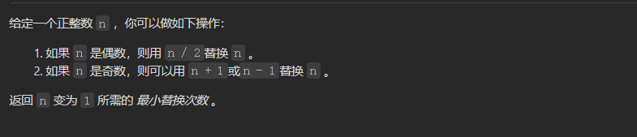
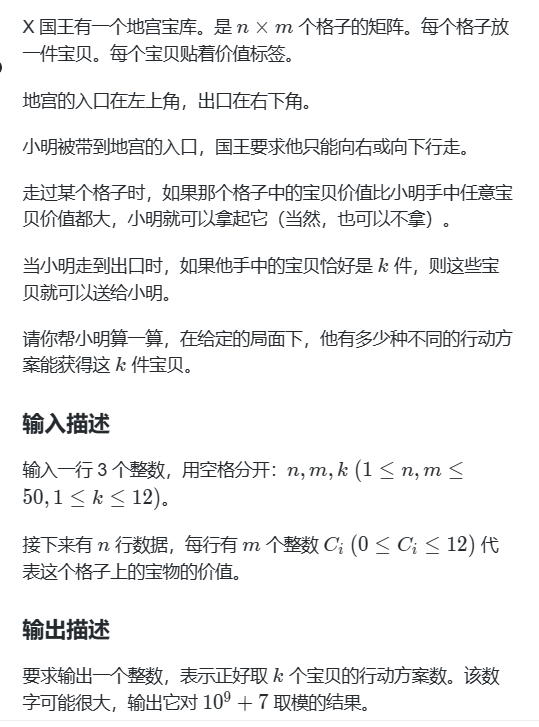

#### 目录

- [知识框架](#_2)
- [No.0 筑基](#No0__4)
- [No.1 记忆化搜索](#No1__16)
- - [题目来源：LeetCode-70-爬楼梯](#LeetCode70_19)
  - [题目来源：LeetCode-397-整数替换](#LeetCode397_54)
  - [题目来源：蓝桥杯-2014省赛-地宫取宝](#2014_141)

## 知识框架

## No.0 筑基

> 请先学习下知识点，道友！  
>  题目知识点大部分来源于此：[OI WiKi里面的知识点讲解](https://oi-wiki.org/dp/memo/)
>
> 题目例题大部分来源于此：[LeetCode中的记忆化搜索题目](https://leetcode.cn/tag/memoization/problemset/)

## No.1 记忆化搜索

### 题目来源：LeetCode-70-爬楼梯

题目描述：  
 

题目思路：


题目代码：

```cpp
class Solution {
public:
    int climbStairs(int n) {
        // 直接按照三部曲进行
        if(n <= 1)return 1;
        std::vector<int>dp(n + 1, 0);
        // 1- dp[i]的意思
        // 2- dp的初始化
        // 3- dp的转移公式

        // 
        dp[1] = 1;
        dp[2] = 2;
        for(int i = 3; i <= n; i++){
            dp[i] = dp[i - 1] + dp[i - 2];
        }
        return dp[n];

    }
};
```

### 题目来源：LeetCode-397-整数替换

题目描述：  
 

题目思路：

> 递归操作，想到进行记忆化才行

题目代码：

```cpp
int dfs(long long index, unordered_map<long long, int>&mp){
  if(index == 1)return 0;
  if(mp[index])return mp[index];
  int cnt = 0;
  if(index % 2 == 0){
    cnt = 1 + dfs(index / 2, mp);
  }else{
    cnt = 1 + min(dfs(index - 1, mp), dfs(index + 1, mp));
  }
  mp[index] = cnt;
  return cnt;
}
int integerReplacement(int n) {
  unordered_map<long long, int>mp;
  int res = dfs(n, mp);
  return res;
}


//对于N要进行适应性的更改，对于字段错误
#include<bits/stdc++.h>
using namespace std;
#define inf 0x3f3f3f3f
#define N 505
int n,m,k,g,d;
int x,y,z;
char ch;
string str;
vector<int>v[N];

int minn=inf;
int vis[N]={0};
//方法一对于同一个 x，可能被搜索多次，因此可以将计算过的值，
//用哈希表存储起来，这样下次再搜索到的时候，可哈希表直接返回。
void dfs(int index,int num){
	
	if(index==1){
		minn=min(minn,num);
		return ;
	}
	if(vis[index]==1){
		return ;
	}
	
	if(index%2==0){
	
		dfs(index/2,num+1);
		vis[index/2]=1;
	}else{
	
		dfs((index+1)/2,num+1);
		dfs((index-1)/2,num+1);
		vis[(index+1)/2]=1;
		vis[(index-1)/2]=1;
	}
}
int main() {
	cin>>n;
	dfs(n,0);
	cout<<minn<<endl;
	return 0;
}
```

### 题目来源：蓝桥杯-2014省赛-地宫取宝

题目描述：



题目思路：

> [题解](https://blog.csdn.net/m0_51955470/article/details/114421209)

题目代码：

```cpp
#include <iostream>
#include <vector>
#include <cstring>
using namespace std;

const int MOD = 1e9 + 7;
const int MAXN = 55;
const int MAXK = 13;
const int MAXC = 13;

int dp[MAXN][MAXN][MAXK][MAXC]; // dp[i][j][count][max_val]
int grid[MAXN][MAXN];

int main() {
    int n, m, k;
    cin >> n >> m >> k;
    for (int i = 0; i < n; ++i) {
        for (int j = 0; j < m; ++j) {
            cin >> grid[i][j];
        }
    }

    memset(dp, 0, sizeof(dp));
    // 起点初始化
    // 不拿
    dp[0][0][0][0] = 1;
    // 拿（价值为0也不能拿，因为不比手里大）
    if (grid[0][0] > 0) {
        dp[0][0][1][grid[0][0]] = 1;
    }

    for (int i = 0; i < n; ++i) {
        for (int j = 0; j < m; ++j) {
            if (i == 0 && j == 0) continue; // 起点已处理
            int val = grid[i][j];
            // 来自上方
            if (i > 0) {
                for (int t = 0; t <= k; ++t) {
                    for (int v = 0; v <= 12; ++v) {
                        if (dp[i-1][j][t][v] == 0) continue;
                        // 不拿
                        dp[i][j][t][v] = (dp[i][j][t][v] + dp[i-1][j][t][v]) % MOD;
                        // 拿
                        if (t < k && val > v) {
                            dp[i][j][t+1][val] = (dp[i][j][t+1][val] + dp[i-1][j][t][v]) % MOD;
                        }
                    }
                }
            }
            // 来自左方
            if (j > 0) {
                for (int t = 0; t <= k; ++t) {
                    for (int v = 0; v <= 12; ++v) {
                        if (dp[i][j-1][t][v] == 0) continue;
                        // 不拿
                        dp[i][j][t][v] = (dp[i][j][t][v] + dp[i][j-1][t][v]) % MOD;
                        // 拿
                        if (t < k && val > v) {
                            dp[i][j][t+1][val] = (dp[i][j][t+1][val] + dp[i][j-1][t][v]) % MOD;
                        }
                    }
                }
            }
        }
    }

    int ans = 0;
    for (int v = 0; v <= 12; ++v) {
        ans = (ans + dp[n-1][m-1][k][v]) % MOD;
    }
    cout << ans << endl;
    return 0;
}
```
