#### 目录

- [知识框架](#_1)
- [No.0 筑基](#No0__2)
- - [一、链表核心思想](#_7)
  - [二、链表必背 5 大模板（背会=秒杀80%题）](#_5_80_15)
  - - [1. 反转链表（万能）](#1__16)
    - [2. 快慢指针模块（分3个用法：找中点、倒数N节点、环形链表）](#2_3N_48)
    - - [① 快慢指针找中点](#__49)
      - [② 删除倒数第 N 个节点](#__N__60)
      - [③ 环形链表（141判环 +142找入环点，附数学推导）](#_141_142_66)
      - [③数学结论（图中公式文字整理）](#_67)
    - [3. 双指针合并有序链表](#3__109)
    - [4. 虚拟头节点（必用）](#4__127)
- [No.1 链表遍历](#No1__135)
- - [题目来源：LeetCode-1290. 二进制链表转整数](#LeetCode1290__136)
  - [题目来源：LeetCode-160. 相交链表](#LeetCode160__174)
- [No.2 链表插入删除节点](#No2__304)
- - [题目来源：LeetCode-21. 合并两个有序链表](#LeetCode21__305)
  - [题目来源：LeetCode-2. 两数相加](#LeetCode2__356)
  - [题目来源：LeetCode-138. 随机链表的复制](#LeetCode138__420)
  - [题目来源：LeetCode-146. LRU 缓存](#LeetCode146_LRU__554)
- [No.3 反转链表实现](#No3__682)
- - [题目来源：LeetCode-206. 反转链表](#LeetCode206__683)
  - [题目来源：LeetCode-234. 回文链表](#LeetCode234__730)
- [No.4 快慢指针 & 双指针](#No4____821)
- - [题目来源：LeetCode-141. 环形链表](#LeetCode141__824)
  - [题目来源：LeetCode-142. 环形链表 II](#LeetCode142__II_865)
  - [题目来源：LeetCode-19. 删除链表的倒数第 N 个结点](#LeetCode19__N__911)
  - [题目来源：LeetCode-287. 寻找重复数](#LeetCode287__960)
- [No.5 链表的递归旋转合并操作[❌]](#No5__1001)
- - [题目来源：LeetCode-24. 两两交换链表中的节点](#LeetCode24__1003)
  - [题目来源：LeetCode-25. K 个一组翻转链表](#LeetCode25_K__1087)
  - [题目来源：LeetCode-148. 排序链表](#LeetCode148__1250)
  - [题目来源：LeetCode-23. 合并 K 个升序链表](#LeetCode23__K__1415)
- [No.1 数组链表模拟](#No1__1539)
- - [题目来源：PTA-L2-002 链表去重](#PTAL2002__1545)
  - [题目来源：PTA-L2-022 重排链表](#PTAL2022__1613)
  - [题目来源：Acwing-4273-链表合并](#Acwing4273_1690)
- [No.2 题意链表模拟转化](#No2__1751)
- - [题目来源：PAT-L2-040 哲哲打游戏](#PATL2040__1752)

## 知识框架

## No.0 筑基

> 请先学习下知识点，道友！  
>  题目知识点大部分来源于此：[代码随想录：链表](https://www.programmercarl.com/%E9%93%BE%E8%A1%A8%E7%90%86%E8%AE%BA%E5%9F%BA%E7%A1%80.html)

### 一、链表核心思想

1. **链表 = 指针串联**
2. **相等 = 地址相同，不是值相同**
3. **虚拟头节点 dummy** → 解决头节点删除/插入问题
4. **快慢指针** → 找中点、倒数第k个、环形判环+找入环口
5. **递归** → 反转、交换、分组反转
6. **栈/队列** → 回文、反转

### 二、链表必背 5 大模板（背会=秒杀80%题）

#### 1. 反转链表（万能）

```cpp
ListNode* reverse(ListNode* head) {
    ListNode* pre = nullptr;
    while (head) {
        auto next = head->next;
        head->next = pre;
        pre = head;
        head = next;
    }
    return pre;
}

ListNode* reverseList(ListNode* head) {
    // 新建一个链表头，完全不碰原来的链表
    ListNode* pre = nullptr;
    ListNode* cur = head;  // 只遍历，不修改原链表
    
    while (cur) {
        // 【关键】每次创建新节点，不改动原来的节点！
        ListNode* newNode = new ListNode(cur->val);
        // 头插法
        newNode->next = pre;
        pre = newNode;

        cur = cur->next;
    }
    return pre;
}
```

#### 2. 快慢指针模块（分3个用法：找中点、倒数N节点、环形链表）

##### ① 快慢指针找中点

```cpp
ListNode* middle(ListNode* head) {
    ListNode *slow = head, *fast = head;
    while (fast && fast->next) {
        slow = slow->next;
        fast = fast->next->next;
    }
    return slow;
}
```

##### ② 删除倒数第 N 个节点

> 逻辑：fast先走n步，之后slow、fast同步后移，fast到末尾时，slow指向倒数第n的前驱节点

```text
// 配合dummy头节点使用
fast 先走 n 步，再一起同步向后走
```

##### ③ 环形链表（141判环 +142找入环点，附数学推导）

##### ③数学结论（图中公式文字整理）

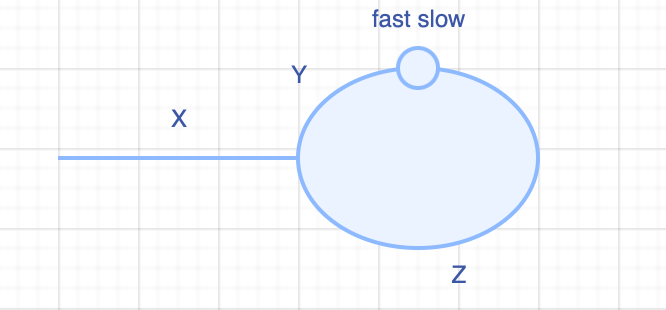

- 原始到入环的为x， 入环到相遇为y 相遇到入环为z 则 slow = x + y fast = x + y + z + y ;且 fast = 2 slow 则得到 z = x
- 设：**头→入环口 = X 步**，环总长 = `Y + Z`；相遇时慢指针总路程`X + Y`，快指针总路程`X+ Y + Z + Y`
- `快慢速度2倍关系`：`2X + 2Y = X + 2Y + Z`（快比慢多走k整圈）
- 得到路程关系：`X = Z`
- **关键结论：从相遇点再走Z步恰好抵达入环口**

> 操作：一个指针从**链表头**、一个指针从**相遇点**同步一步一步走，首次相遇位置 = 环入口

```cpp
//141 判断是否有环
bool hasCycle(ListNode *head) {
    ListNode* slow=head,*fast=head;
    while(fast&&fast->next){
        slow=slow->next;
        fast=fast->next->next;
        if(slow==fast) return true;
    }
    return false;
}

//142 返回环入口节点
ListNode *detectCycle(ListNode *head) {
    ListNode* slow=head,*fast=head;
    while(fast&&fast->next){
        slow=slow->next;
        fast=fast->next->next;
        if(slow==fast){
            //相遇，头指针和慢指针同速出发
            ListNode* p=head;
            while(p!=slow){
                p=p->next;
                slow=slow->next;
            }
            return p;
        }
    }
    return nullptr;
}
```

#### 3. 双指针合并有序链表

```cpp
ListNode* merge(ListNode* l1, ListNode* l2) {
    ListNode dummy, *cur = &dummy;
    while (l1 && l2) {
        if (l1->val < l2->val) {
            cur = cur->next = l1;
            l1 = l1->next;
        } else {
            cur = cur->next = l2;
            l2 = l2->next;
        }
    }
    cur->next = l1 ? l1 : l2;
    return dummy.next;
}
```

#### 4. 虚拟头节点（必用）

```text
ListNode* dummy = new ListNode();
dummy->next = head;
```

## No.1 链表遍历

### 题目来源：LeetCode-1290. 二进制链表转整数

题目描述：

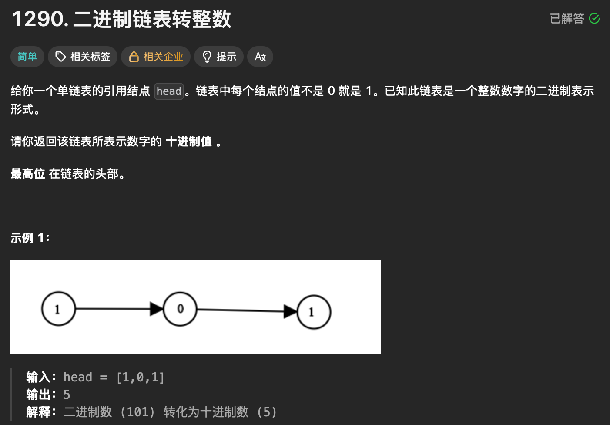

题目思路：


题目代码：

```cpp
/**
 * Definition for singly-linked list.
 * struct ListNode {
 *     int val;
 *     ListNode *next;
 *     ListNode() : val(0), next(nullptr) {}
 *     ListNode(int x) : val(x), next(nullptr) {}
 *     ListNode(int x, ListNode *next) : val(x), next(next) {}
 * };
 */
class Solution {
public:
    int getDecimalValue(ListNode* head) {
        int res = 0;
        ListNode* cur = head;
        while(cur){
            res = res * 2 + cur->val;
            cur = cur->next;
        }
        return res;
    }
};
```

### 题目来源：LeetCode-160. 相交链表

题目描述：  
 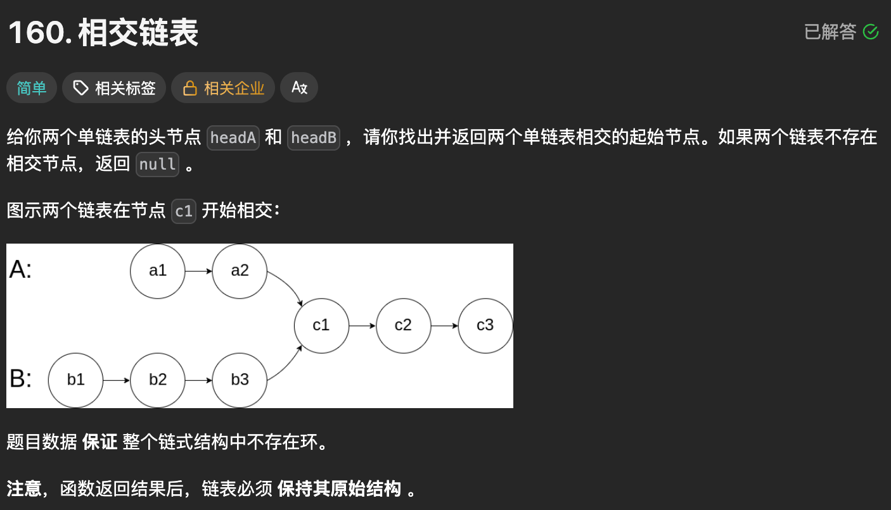

题目思路：

> 先是暴力进行的  
>  如果符合O(m + n)的话，还必须是双指针
>
> 1. 核心痛点:  
>     两个链表可能长度不同，直接遍历无法对齐相交节点（比如 A 链表长 5，B 链表长 3，相交节点在 A 的第 3 位、B 的第 1 位）。
> 2. 解决思路  
>     让两个指针交叉遍历两个链表：  
>     指针 A 先遍历完链表 A，再从链表 B 的头节点开始遍历；  
>     指针 B 先遍历完链表 B，再从链表 A 的头节点开始遍历；  
>     最终两个指针会在相交节点相遇（若相交），或同时走到NULL（若不相交）。
> 3. 数学证明（为什么能相遇？）

题目代码：

```cpp
/**
 * Definition for singly-linked list.
 * struct ListNode {
 *     int val;
 *     ListNode *next;
 *     ListNode(int x) : val(x), next(NULL) {}
 * };
 */
class Solution {
public:
    ListNode *getIntersectionNode(ListNode *headA, ListNode *headB) {
        //这个记住 当 A跑了全程+B的第一段
        // 当B跑了全程+A的第一段； 上面的和下面的是一样的;
        ListNode* cura = headA;
        ListNode* curb = headB;
        if(cura == nullptr || curb == nullptr)return nullptr;

        while(cura != curb){
            // a跑
            if(cura == nullptr){
                cura = headB;
            }else{
                cura = cura->next;
            }

            // b跑
            if(curb == nullptr){
                curb = headA;
            }else{
                curb = curb->next;
            }
        }
        return cura;
    }
};
```

```cpp
/**
 * Definition for singly-linked list.
 * struct ListNode {
 *     int val;
 *     ListNode *next;
 *     ListNode(int x) : val(x), next(NULL) {}
 * };
 */
class Solution {
public:
    ListNode *getIntersectionNode(ListNode *headA, ListNode *headB) {
        // 不是正常的有序
        // 指针移动
        // 完全可以这样，
        // 相交的节点是。地址相等，我靠
        std::vector<ListNode*> node_ptrs;
        while (headA != nullptr) {
            node_ptrs.push_back(headA); // 存指针，不是存val
            headA = headA->next;
        }

        // 遍历链表B，检查当前节点的指针是否在vector中
        while (headB != nullptr) {
            auto it = std::find(node_ptrs.begin(), node_ptrs.end(), headB);
            if (it != node_ptrs.end()) {
                // 找到相同指针，说明是相交节点
                return headB;
            }
            headB = headB->next;
        }
        return nullptr;

    }
};
```

```cpp
/**
 * Definition for singly-linked list.
 * struct ListNode {
 *     int val;
 *     ListNode *next;
 *     ListNode(int x) : val(x), next(NULL) {}
 * };
 */
class Solution {
public:
    ListNode *getIntersectionNode(ListNode *headA, ListNode *headB) {
        // 边界处理：空链表直接返回NULL
        if (headA == nullptr || headB == nullptr) {
            return nullptr;
        }

        // 初始化两个指针，分别指向两个链表的头节点
        ListNode* pA = headA;
        ListNode* pB = headB;

        // 核心循环：直到两个指针地址相等
        // （相等时要么是相交节点，要么都是NULL）
        while (pA != pB) {
            // 指针A：没走到头就后移，走到头就切换到B的头
            pA = (pA == nullptr) ? headB : pA->next;
            // 指针B：没走到头就后移，走到头就切换到A的头
            pB = (pB == nullptr) ? headA : pB->next;
        }

        // 循环结束时，pA和pB要么是相交节点，要么是NULL
        return pA;
    }
};
```

## No.2 链表插入删除节点

### 题目来源：LeetCode-21. 合并两个有序链表

题目描述：  
 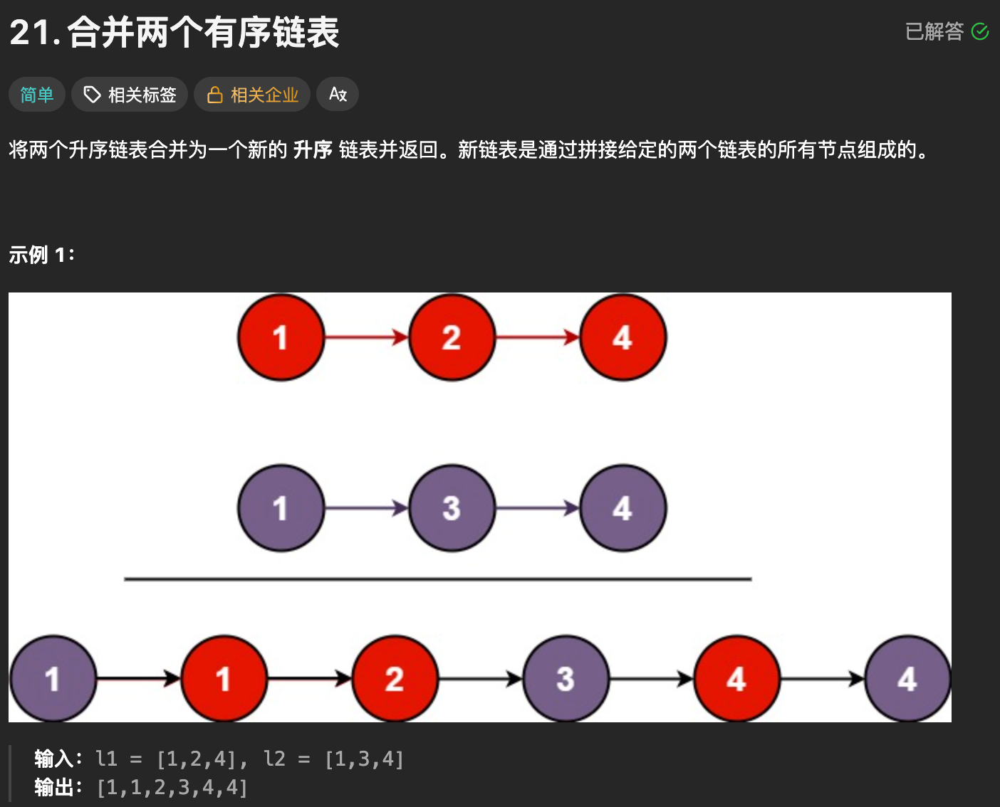

题目思路：


题目代码：

```cpp
/**
 * Definition for singly-linked list.
 * struct ListNode {
 *     int val;
 *     ListNode *next;
 *     ListNode() : val(0), next(nullptr) {}
 *     ListNode(int x) : val(x), next(nullptr) {}
 *     ListNode(int x, ListNode *next) : val(x), next(next) {}
 * };
 */
class Solution {
public:
    ListNode* mergeTwoLists(ListNode* list1, ListNode* list2) {
        // 虚拟头节点（哨兵节点），避免空指针处理，简化逻辑
        ListNode* dummy = new ListNode();
        // 移动指针，用于构建新链表
        ListNode* cur = dummy;

        while(list1 && list2){
            if(list1->val <= list2->val){
                ListNode* newNode = new ListNode(list1->val);
                cur->next = newNode;
                cur = cur->next;
                list1 = list1->next;
            }else{
                ListNode* newNode = new ListNode(list2->val);
                cur->next = newNode;
                cur = cur->next;
                list2 = list2->next;
            }
        }
        if(list1)cur->next = list1;
        if(list2)cur->next = list2;
        return dummy->next;
    }
};
```

### 题目来源：LeetCode-2. 两数相加

题目描述：

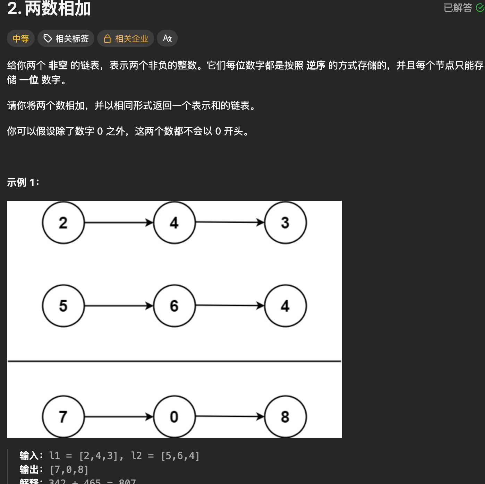

题目思路：


题目代码：

```cpp
/**
 * Definition for singly-linked list.
 * struct ListNode {
 *     int val;
 *     ListNode *next;
 *     ListNode() : val(0), next(nullptr) {}
 *     ListNode(int x) : val(x), next(nullptr) {}
 *     ListNode(int x, ListNode *next) : val(x), next(next) {}
 * };
 */
class Solution {
public:
    ListNode* addTwoNumbers(ListNode* l1, ListNode* l2) {
        // 虚拟头节点：简化链表拼接的边界处理（避免空指针）
        ListNode* dummy = new ListNode(0);
        // 移动指针：用于拼接新节点
        ListNode* cur = dummy;

        int carry = 0;
        while(l1 || l2 || carry){
            int sum = 0;
            if(l1){
                sum += l1->val;
                l1 = l1->next;
            }
            if(l2){
                sum += l2->val;
                l2 = l2->next;
            }
            sum += carry;

            if(sum >= 10){
                carry = sum / 10;
                sum = sum % 10;
                ListNode* newNode = new ListNode(sum);
                cur->next = newNode;
                cur = cur->next;
            }else{
                carry = 0;
                ListNode* newNode = new ListNode(sum);
                cur->next = newNode;
                cur = cur->next;
            }
        }
        return dummy->next;
    }
};
```

### 题目来源：LeetCode-138. 随机链表的复制

题目描述：  
 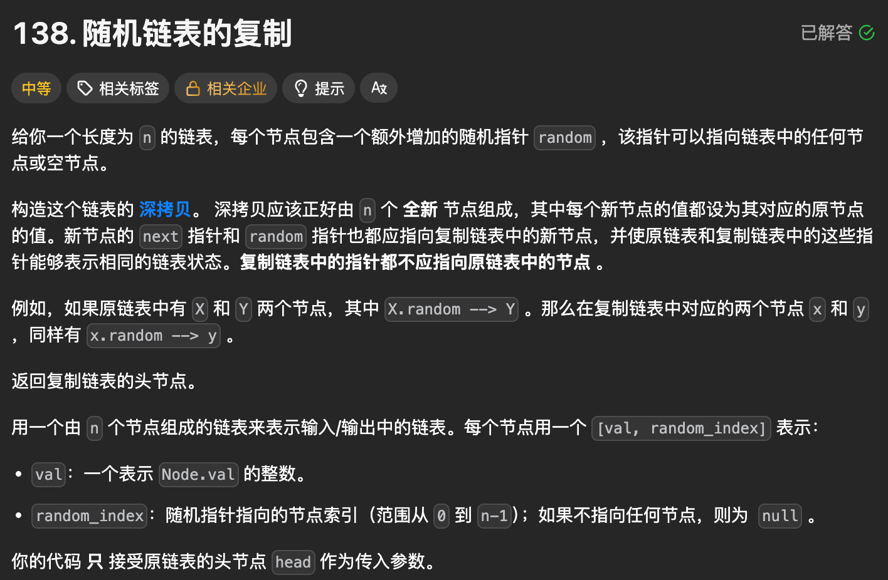

题目思路：


题目代码：

```cpp
/*
// Definition for a Node.
class Node {
public:
    int val;
    Node* next;
    Node* random;
    
    Node(int _val) {
        val = _val;
        next = NULL;
        random = NULL;
    }
};
*/

class Solution {
public:
    Node* copyRandomList(Node* head) {
        if(head == nullptr)return head;
        Node* dummy = new Node(0);
        dummy->next = head;
        Node* cur = head;
        // 对于每一个都节点 都先创建一个副本；跳的时候跳2hops
        for(cur = head; cur != nullptr; cur = cur->next->next){
            Node* newNode = new Node(cur->val);
            newNode->next = cur->next;
            cur->next = newNode;
        }
        // 现在上面的val 和 next好了
        for(cur = head; cur != nullptr; cur = cur->next->next){
            Node* newNode = cur->next;
            if(cur->random == nullptr){
                newNode->random = nullptr;
            }else{ //记住这里
                newNode->random = cur->random->next;
            }
        }
        // 现在 random 好了 
        // 下一步进行清除之前的
        dummy = head->next;
        for(cur = head; cur != nullptr; cur = cur->next){
            Node* newNode = cur->next;
            cur->next = cur->next->next;
            if(newNode->next == nullptr){ // 后面没节点了
                newNode->next = nullptr;
            }else{
                newNode->next = newNode->next->next;
            }
        }
        return dummy;
    }
};
```

```cpp
/*
// Definition for a Node.
class Node {
public:
    int val;
    Node* next;
    Node* random;
    
    Node(int _val) {
        val = _val;
        next = NULL;
        random = NULL;
    }
};
*/

class Solution {
public:
    Node* copyRandomList(Node* head) {
        // 边界：空链表直接返回
        if (head == nullptr) return nullptr;

        // 步骤1：插桩 - 在原节点后插入复制节点
        Node* p = head;
        while (p != nullptr) {
            // 创建复制节点，val和原节点相同，next指向原节点的next
            Node* copy_node = new Node(p->val);
            copy_node->next = p->next;
            // 原节点的next指向复制节点
            p->next = copy_node;
            // 移动到下一个原节点
            p = copy_node->next;
        }

        // 步骤2：复制random指针
        p = head;
        while (p != nullptr) {
            Node* copy_node = p->next; // 复制节点是原节点的next
            // 若原节点的random不为空，则复制节点的random指向原random的next（即random的复制节点）
            if (p->random != nullptr) {
                copy_node->random = p->random->next;
            }
            // 移动到下一个原节点（跳过复制节点）
            p = copy_node->next;
        }

        // 步骤3：拆分链表 - 分离原链表和复制链表
        p = head;
        Node* new_head = head->next; // 复制链表的头节点
        Node* copy_p = new_head;
        while (p != nullptr) {
            // 恢复原节点的next（指向原下一个节点）
            p->next = copy_p->next;
            p = p->next; // 移动原节点指针
            
            // 若还有复制节点，更新复制节点的next
            if (p != nullptr) {
                copy_p->next = p->next;
                copy_p = copy_p->next;
            }
        }

        return new_head;
    }
};
```

### 题目来源：LeetCode-146. LRU 缓存

题目描述：  
 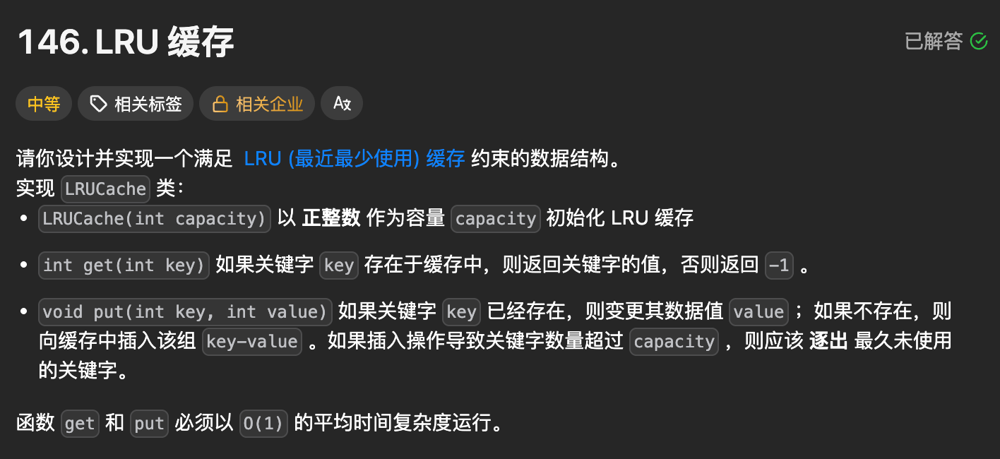

题目思路：

> 不会  
>  直接看答案了  
>  1-自己设计Node，然后整双向链表  
>  2-直接使用C++自带的list标准库

题目代码：

```cpp
struct Node {
    int key;
    int value;
    Node* prev;
    Node* next;

    Node(int k = 0, int v = 0) : key(k), value(v) {}
};

class LRUCache {
private:
    int capacity;
    Node* dummy; // 哨兵节点
    unordered_map<int, Node*> key_to_node;

    // 删除一个节点（抽出一本书）
    void remove(Node* x) {
        x->prev->next = x->next;
        x->next->prev = x->prev;
    }

    // 在链表头添加一个节点（把一本书放到最上面）
    void push_front(Node* x) {
        x->prev = dummy;
        x->next = dummy->next;
        x->prev->next = x;
        x->next->prev = x;
    }

    // 获取 key 对应的节点，同时把该节点移到链表头部
    Node* get_node(int key) {
        auto it = key_to_node.find(key);
        if (it == key_to_node.end()) { // 没有这本书
            return nullptr;
        }
        Node* node = it->second; // 有这本书
        remove(node); // 把这本书抽出来
        push_front(node); // 放到最上面
        return node;
    }

public:
    LRUCache(int capacity) : capacity(capacity), dummy(new Node()) {
        dummy->prev = dummy;
        dummy->next = dummy;
    }

    int get(int key) {
        Node* node = get_node(key); // get_node 会把对应节点移到链表头部
        return node ? node->value : -1;
    }

    void put(int key, int value) {
        Node* node = get_node(key); // get_node 会把对应节点移到链表头部
        if (node) { // 有这本书
            node->value = value; // 更新 value
            return;
        }
        key_to_node[key] = node = new Node(key, value); // 新书
        push_front(node); // 放到最上面
        if (key_to_node.size() > capacity) { // 书太多了
            Node* back_node = dummy->prev;
            key_to_node.erase(back_node->key);
            remove(back_node); // 去掉最后一本书
            delete back_node; // 释放内存
        }
    }
};
```

```cpp
class LRUCache {
private:
    int capacity;
    list<pair<int, int>> cache_list; // pair 里面保存的是 key 和 value
    unordered_map<int, list<pair<int, int>>::iterator> key_to_iter; // key -> 链表节点迭代器

public:
    LRUCache(int capacity) : capacity(capacity) {}

    int get(int key) {
        auto umap_iter = key_to_iter.find(key);
        if (umap_iter == key_to_iter.end()) { // 没有这本书
            return -1;
        }
        auto list_iter = umap_iter->second; // 有这本书
        // 把这本书（list_iter）从书堆（cache_list）中抽出来，放到最上面（cache_list.begin()）
        cache_list.splice(cache_list.begin(), cache_list, list_iter);
        return list_iter->second; // 返回这本书的 value
    }

    void put(int key, int value) {
        auto umap_iter = key_to_iter.find(key);
        if (umap_iter != key_to_iter.end()) { // 有这本书
            auto list_iter = umap_iter->second;
            list_iter->second = value; // 更新 value
            // 把这本书（list_iter）从书堆（cache_list）中抽出来，放到最上面（cache_list.begin()）
            cache_list.splice(cache_list.begin(), cache_list, list_iter);
            return;
        }
        // 新书，放到最上面（emplace_front）
        cache_list.emplace_front(key, value);
        key_to_iter[key] = cache_list.begin();
        // 书太多了
        if (key_to_iter.size() > capacity) {
            // 去掉最后一本书
            key_to_iter.erase(cache_list.back().first);
            cache_list.pop_back();
        }
    }
};
```

## No.3 反转链表实现

### 题目来源：LeetCode-206. 反转链表

题目描述：  
 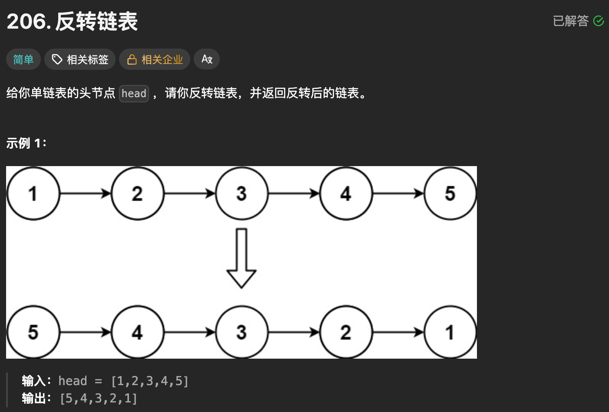

题目思路：


题目代码：

```cpp
/**
 * Definition for singly-linked list.
 * struct ListNode {
 *     int val;
 *     ListNode *next;
 *     ListNode() : val(0), next(nullptr) {}
 *     ListNode(int x) : val(x), next(nullptr) {}
 *     ListNode(int x, ListNode *next) : val(x), next(next) {}
 * };
 */
class Solution {
public:
    ListNode* reverseList(ListNode* head) {
        // 定义三个指针：pre（前驱节点）、cur（当前节点）、next（后继节点）
        ListNode* pre = nullptr;  // 初始时前驱为空（反转后尾节点指向空）
        ListNode* cur = head;     // 从链表头开始遍历
        
        while (cur != nullptr) {
            // 1. 先保存当前节点的下一个节点（避免反转后丢失）
            ListNode* next = cur->next;
            // 2. 反转当前节点的指向：让当前节点指向前驱
            cur->next = pre;
            // 3. 指针后移：前驱变为当前节点，当前节点变为之前保存的后继节点
            pre = cur;
            cur = next;
        }
        
        // 循环结束后，prev指向原链表的最后一个节点（新链表的头节点）
        return pre;
    }
};
```

### 题目来源：LeetCode-234. 回文链表

题目描述：

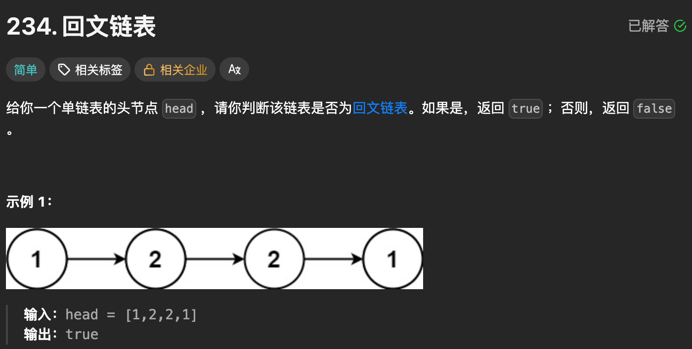

题目思路：


题目代码：

```cpp
/**
 * Definition for singly-linked list.
 * struct ListNode {
 *     int val;
 *     ListNode *next;
 *     ListNode() : val(0), next(nullptr) {}
 *     ListNode(int x) : val(x), next(nullptr) {}
 *     ListNode(int x, ListNode *next) : val(x), next(next) {}
 * };
 */
class Solution {
public:
    ListNode* reverseList(ListNode* head){
        ListNode* pre = nullptr;
        ListNode* cur = head;
        while(cur){
            ListNode* newNode = new ListNode(cur->val);
            newNode->next = pre;
            pre = newNode;
            cur = cur->next;
        }
        return pre;
    }
    bool isPalindrome(ListNode* head) {
        ListNode* rev = reverseList(head);
        while(head){
            if(head->val != rev->val)return false;
            head = head->next;
            rev = rev->next;
        }
        return true;
    }
};
```

```cpp
class Solution {
    // 876. 链表的中间结点
    ListNode* middleNode(ListNode* head) {
        ListNode* slow = head, *fast = head;
        while (fast && fast->next) {
            slow = slow->next;
            fast = fast->next->next;
        }
        return slow;
    }

    // 206. 反转链表
    ListNode* reverseList(ListNode* head) {
        ListNode* pre = nullptr, *cur = head;
        while (cur) {
            ListNode* nxt = cur->next;
            cur->next = pre;
            pre = cur;
            cur = nxt;
        }
        return pre;
    }

public:
    bool isPalindrome(ListNode* head) {
        ListNode* mid = middleNode(head);
        ListNode* head2 = reverseList(mid);
        while (head2) {
            if (head->val != head2->val) { // 不是回文链表
                return false;
            }
            head = head->next;
            head2 = head2->next;
        }
        return true;
    }
};
```

## No.4 快慢指针 & 双指针

### 题目来源：LeetCode-141. 环形链表

题目描述：  
 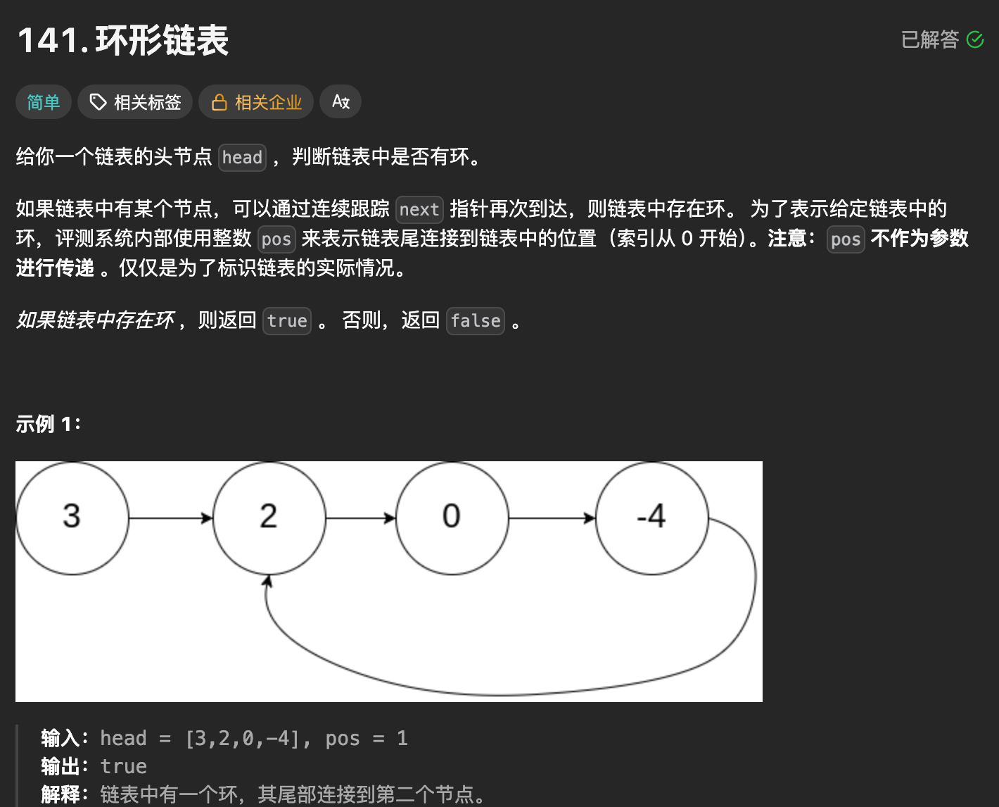

题目思路：


题目代码：

```cpp
/**
 * Definition for singly-linked list.
 * struct ListNode {
 *     int val;
 *     ListNode *next;
 *     ListNode(int x) : val(x), next(NULL) {}
 * };
 */
class Solution {
public:
    bool hasCycle(ListNode *head) {
        // 一点要记住 链表里面的相等 是 指针相同，不是指向的元素相同
        // 快慢指针。
        // 一个速度快、另一个速度慢。如果跑道有环，一段时间后追上。对于链表来说，如果在链表中引入两个以不同速度（一个比另一个快一倍）前进的指针，在链表存在环的情况下，这两个指针必定会相遇。
        ListNode* fast = head;
        ListNode* slow = head;
        while(fast && fast->next){
            slow = slow->next; // 慢的走1步
            fast = fast->next->next; // 快的走2步
            if(slow == fast){
                return true;
            }
        }
        return false;
    }
};
```

### 题目来源：LeetCode-142. 环形链表 II

题目描述：  
 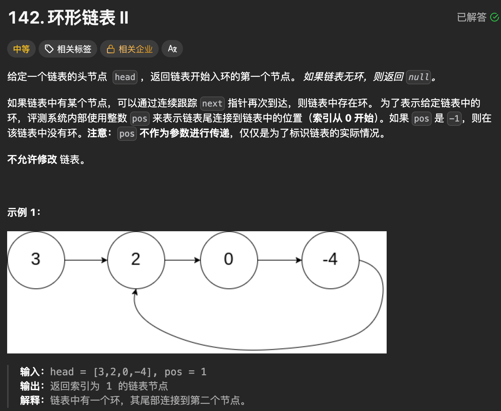

题目思路：


题目代码：

```cpp
/**
 * Definition for singly-linked list.
 * struct ListNode {
 *     int val;
 *     ListNode *next;
 *     ListNode(int x) : val(x), next(NULL) {}
 * };
 */
class Solution {
public:
    ListNode *detectCycle(ListNode *head) {
        // 一点要记住 链表里面的相等 是 指针相同，不是指向的元素相同
        ListNode* fast = head;
        ListNode* slow = head;
        while(fast && fast->next){
            slow = slow->next;
            fast = fast->next->next;
            if(fast == slow){
                // 这里就是筑基里面说的z =x;
                while(slow != head){
                    slow = slow->next;
                    head = head->next;
                }
                return slow;
            }
        }
        return nullptr;
    }
};
```

### 题目来源：LeetCode-19. 删除链表的倒数第 N 个结点

题目描述：  
 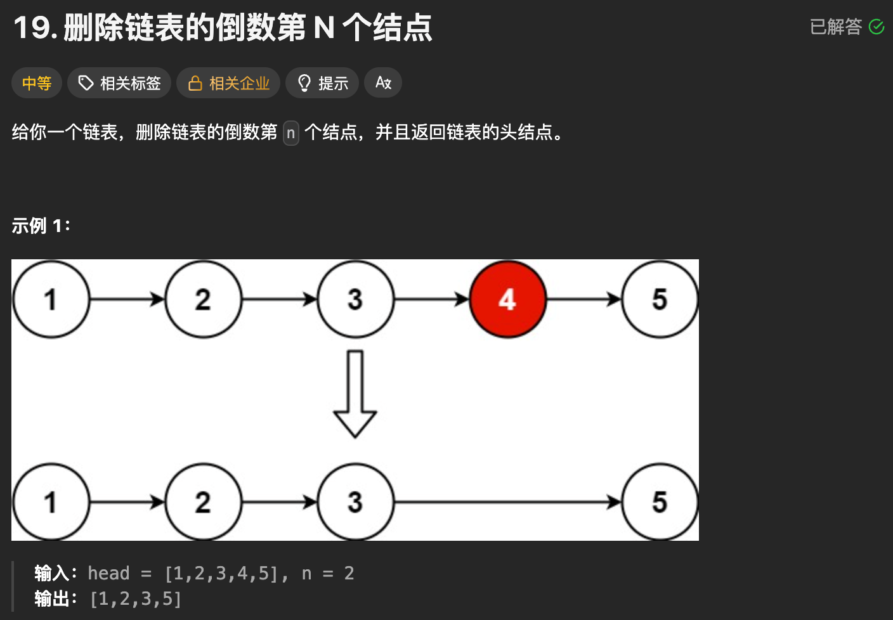

题目思路：

> 快慢指针

题目代码：

```cpp
/**
 * Definition for singly-linked list.
 * struct ListNode {
 *     int val;
 *     ListNode *next;
 *     ListNode() : val(0), next(nullptr) {}
 *     ListNode(int x) : val(x), next(nullptr) {}
 *     ListNode(int x, ListNode *next) : val(x), next(next) {}
 * };
 */
class Solution {
public:
    ListNode* removeNthFromEnd(ListNode* head, int n) {
        // 可能删除头部。
        ListNode* dummy = new ListNode();
        dummy->next = head;

        ListNode* fast = dummy;
        ListNode* slow = dummy;
        ListNode* cur_n = slow;

        for(int i = 0; i < n; i++)fast = fast->next;

        while(fast){
            fast = fast->next;
            cur_n = slow;
            slow = slow->next;
        }
        // 现在cur_n 指向的就是 倒数第n + 1个节点了;
        // 现在 slow指向的是 倒数第n个节点了；
        cur_n->next = slow->next;
        return dummy->next;
    }
};
```

### 题目来源：LeetCode-287. 寻找重复数

题目描述：  
 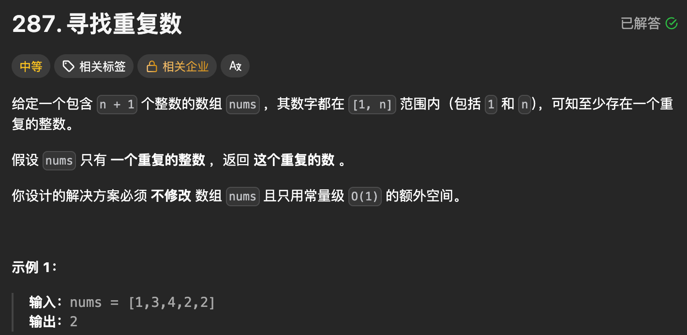

题目思路：


题目代码：

```cpp
class Solution {
public:
    int findDuplicate(vector<int>& nums) {
        // 假设想象成环。
        // 那么就是 slow。fast 
        // 相遇的时候就是 相同的。

        int n = nums.size();
        int slow = 0, fast = 0;
        while(true){
            slow = nums[slow];
            fast = nums[fast];
            fast = nums[fast];
            if(fast == slow){
                break;
            }
        }
        // 现在上面的就是相遇了; 按照之前的那个圈
        int head = 0;
        while(nums[head] != nums[fast]){
            head = nums[head];
            fast = nums[fast];
        }
        return nums[head];
    }
};
```

## No.5 链表的递归旋转合并操作[❌]

### 题目来源：LeetCode-24. 两两交换链表中的节点

题目描述：  
 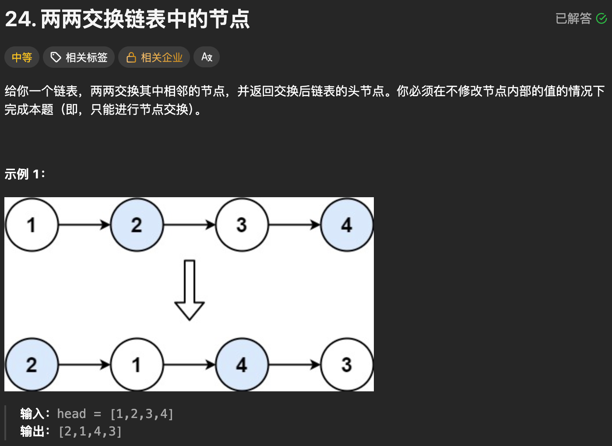

题目思路：

> 1-直接进行迭代模拟，找两个然后进行交换、、  
>  2-进行递归操作、、、、

题目代码：

```cpp
/**
 * Definition for singly-linked list.
 * struct ListNode {
 *     int val;
 *     ListNode *next;
 *     ListNode() : val(0), next(nullptr) {}
 *     ListNode(int x) : val(x), next(nullptr) {}
 *     ListNode(int x, ListNode *next) : val(x), next(next) {}
 * };
 */
class Solution {
public:
    ListNode* swapPairs(ListNode* head) {
        if(head == nullptr || head->next == nullptr){
            return head;
        }
        ListNode* node1 = head;
        ListNode* node2 = node1->next;
        ListNode* node3 = node2->next;

        // 想象3个点
        // 1 2 3
        // 2 1 3
        node2->next = node1;
        node1->next = swapPairs(node3);
        return node2;
    }
};
```

```cpp
/**
 * Definition for singly-linked list.
 * struct ListNode {
 *     int val;
 *     ListNode *next;
 *     ListNode() : val(0), next(nullptr) {}
 *     ListNode(int x) : val(x), next(nullptr) {}
 *     ListNode(int x, ListNode *next) : val(x), next(next) {}
 * };
 */
class Solution {
public:
    ListNode* swapPairs(ListNode* head) {
        if(head == nullptr)return nullptr;
        ListNode* dummy = new ListNode(0);
        dummy->next = head;
        ListNode* node0 = dummy;
        ListNode* node1 = head;

        while(node1 && node1->next){
            // 交换两个。node1 node2
            ListNode* node2 = node1->next;
            ListNode* node3 = node2->next;

            // 最好画4个小方块进行。 
            // 0 1 2 3
            // 0 2 1 3
            node0->next = node2;
            node2->next = node1;
            node1->next = node3;
            
            node0 = node1;
            node1 = node3;
        }
        return dummy->next;
    }
};
```

### 题目来源：LeetCode-25. K 个一组翻转链表

题目描述：  
 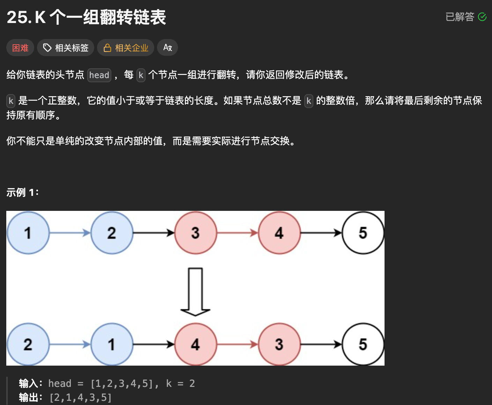

题目思路：

> 还是两种方式：  
>  1- 进行迭代模拟，找到满足k个，然后反转  
>  2-进行递归操作、、、

题目代码：

```cpp
class Solution {
public:
    // 反转从 st 到 ed 的链表（包含两端），返回 {newHead, newTail}
    pair<ListNode*, ListNode*> myReverse(ListNode* st, ListNode* ed) {
        ListNode* prev = nullptr;
        ListNode* cur = st;
        ListNode* stop = ed->next;  // 用于标记终点，但不会修改外部
        while (cur != stop) {
            ListNode* nxt = cur->next;
            cur->next = prev;
            prev = cur;
            cur = nxt;
        }
        return {ed, st};   // 反转后 ed 变成头，st 变成尾
    }


    ListNode* reverseKGroup(ListNode* head, int k) {
        // 挺合理的; k 个为一段 进行 反转
        ListNode* dummy = new ListNode(0);
        dummy->next = head;


        // 所以总共记录四个变量。pre [段head 段tail] next
        ListNode* pre = dummy;
        ListNode* k_s = nullptr;
        ListNode* k_e = nullptr;
        ListNode* nxt = nullptr;
        while(head){
            k_s = pre->next;
            k_e = pre;
            // 记录k个,寻找k_e的指向
            for(int i = 1; i <= k; i++){
                k_e = k_e->next; 
                if(k_e == nullptr)return dummy->next;
            }
            nxt = k_e->next;
            // 现在pre k_s k_e next都好了
            auto tmp = myReverse(k_s, k_e);
            pre->next = tmp.first;
            tmp.second->next = nxt;

            pre = tmp.second;
            head = tmp.second->next;
        }
        return dummy->next;
    }
};
```

```cpp
/**
 * Definition for singly-linked list.
 * struct ListNode {
 *     int val;
 *     ListNode *next;
 *     ListNode() : val(0), next(nullptr) {}
 *     ListNode(int x) : val(x), next(nullptr) {}
 *     ListNode(int x, ListNode *next) : val(x), next(next) {}
 * };
 */
class Solution {
private:
    // 辅助函数：反转区间 [a, b) 的链表，返回反转后的头节点
    ListNode* reverse(ListNode* a, ListNode* b) {
        ListNode* prev = nullptr;
        ListNode* curr = a;
        while (curr != b) {
            ListNode* next = curr->next; // 保存后继节点
            curr->next = prev;          // 反转指向
            prev = curr;                // 前驱指针后移
            curr = next;                // 当前指针后移
        }
        return prev; // 反转后的头节点（原区间最后一个节点）
    }
public:
    ListNode* reverseKGroup(ListNode* head, int k) {
        // 1. 虚拟头节点：指向原链表头，作为已翻转部分的尾部初始值
        ListNode* dummy = new ListNode(0);
        dummy->next = head;
        // pre：当前组的前驱节点（已翻转部分的最后一个节点）
        // end：当前组的结束节点
        ListNode* pre = dummy;
        ListNode* end = dummy;

        while (end->next != nullptr) {
            // 2. 找到当前组的结束节点（移动k步）
            for (int i = 0; i < k && end != nullptr; ++i) {
                end = end->next;
            }
            // 如果剩余节点不足k个，直接退出（保持原有顺序）
            if (end == nullptr) break;

            // 3. 记录关键节点：
            ListNode* start = pre->next;   // 当前组的开始节点
            ListNode* next = end->next;    // 下一组的开始节点（当前组end的下一个）

            // 4. 断开当前组与下一组的连接（方便反转）
            end->next = nullptr;
            // 5. 反转当前组，并用pre->next指向反转后的头节点
            pre->next = reverse(start, end->next); // reverse是左闭右开，end->next=nullptr刚好反转[start, end]
            // 6. 拼接：将反转后的组的尾部（原start）指向next（下一组）
            start->next = next;

            // 7. 更新指针，进入下一组：
            pre = start;  // pre变为当前组的尾部（原start）
            end = pre;    // end回到pre，重新找下一组的end
        }

        // 释放虚拟头节点，返回结果
        ListNode* result = dummy->next;
        delete dummy;
        return result;
    }
};
```

```cpp
class Solution {
public:
    ListNode* reverseKGroup(ListNode* head, int k) {
        // 递归终止条件：剩余节点不足k个
        ListNode* p = head;
        for (int i = 0; i < k; ++i) {
            if (p == nullptr) return head;
            p = p->next;
        }
        // 反转当前k个节点（[head, p)）
        ListNode* new_head = reverse(head, p);
        // 递归处理剩余节点，当前组的尾部（head）指向剩余节点的结果
        head->next = reverseKGroup(p, k);
        return new_head;
    }

private:
    ListNode* reverse(ListNode* a, ListNode* b) {
        ListNode* prev = nullptr;
        ListNode* curr = a;
        while (curr != b) {
            ListNode* next = curr->next;
            curr->next = prev;
            prev = curr;
            curr = next;
        }
        return prev;
    }
};
```

### 题目来源：LeetCode-148. 排序链表

题目描述：  
 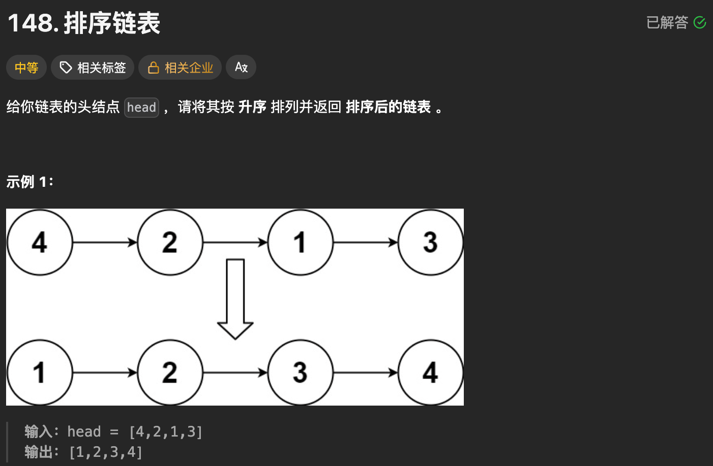

题目思路：

> 1-一个找中间的模版代码  
>  2-进行递归sort

题目代码：

```cpp
/**
 * Definition for singly-linked list.
 * struct ListNode {
 *     int val;
 *     ListNode *next;
 *     ListNode() : val(0), next(nullptr) {}
 *     ListNode(int x) : val(x), next(nullptr) {}
 *     ListNode(int x, ListNode *next) : val(x), next(next) {}
 * };
 */
class Solution {
public:
    int getLen(ListNode* head){
        int len = 0;
        while(head != nullptr){
            len++;
            head = head->next;
        }
        return len;
    }
    ListNode* merge(ListNode* head1, ListNode*head2){
        ListNode* dummy = new ListNode(0);
        ListNode* cur_h1 = head1;
        ListNode* cur_h2 = head2;
        ListNode* cur_h  = dummy;
        while(cur_h1 && cur_h2){
            if(cur_h1->val <= cur_h2->val){
                cur_h->next = cur_h1;
                cur_h = cur_h->next;
                cur_h1 = cur_h1->next;
            }else{
                cur_h->next = cur_h2;
                cur_h = cur_h->next;
                cur_h2 = cur_h2->next;
            }

        }
        if(cur_h1){
            cur_h->next = cur_h1;
        }
        if(cur_h2){
            cur_h->next = cur_h2;
        }
        return dummy->next;
    }

    ListNode* sortList(ListNode* head) {
        if(head == nullptr)return head;

        ListNode* dummy = new ListNode(0);
        dummy->next = head;
        ListNode* cur = head;
        int len = getLen(cur);
        // 整体思路是这样的；
        // 1-并没有新 建立 一个链表
        // 2-进行merge输入的两个子链表是 通过 切前后切出来的
        // 3-merge的话也是 把这两个子链表 的next打乱成一个新的链表
        // 4-并无太多的新Node进行创建。创建的是 指向Node的指针变量

        for(int sublen = 1; sublen < len; sublen += sublen){
            // 就是说分四步吧， pre head1头指针 head2头指针 next指针
            ListNode* pre = dummy;
            ListNode* cur = dummy->next;
            while(cur != nullptr){
                // 1-先切head1，以nullptr结尾
                ListNode* head1 = cur;
                for(int i = 1; i < sublen && cur->next != nullptr; i++){
                    cur = cur->next;
                }
                ListNode* head2 = cur->next;
                cur->next = nullptr;

                // 2-再切head2,以nullptr结尾
                cur = head2;
                for(int i = 1; i < sublen && cur != nullptr && cur->next != nullptr; i++){
                    cur = cur->next;
                }
                ListNode* next = nullptr;
                if(cur != nullptr){
                    next = cur->next;
                    cur->next = nullptr;
                }
                // 搞好每个head的最后都是nullptr
                // 3-合并 head1和head2,
                ListNode* merge_head = merge(head1, head2);
                // 4-合并四部分
                pre->next = merge_head;
                while(pre->next != nullptr){
                    pre = pre->next;
                }
                cur = next;
            }
        }
        return dummy->next;
    }
};
```

```cpp
class Solution {
    // 876. 链表的中间结点（快慢指针）
    ListNode* middleNode(ListNode* head) {
        ListNode* pre = head;
        ListNode* slow = head;
        ListNode* fast = head;
        while (fast && fast->next) {
            pre = slow; // 记录 slow 的前一个节点
            slow = slow->next;
            fast = fast->next->next;
        }
        pre->next = nullptr; // 断开 slow 的前一个节点和 slow 的连接
        return slow;
    }

    // 21. 合并两个有序链表（双指针）
    ListNode* mergeTwoLists(ListNode* list1, ListNode* list2) {
        ListNode dummy; // 用哨兵节点简化代码逻辑
        ListNode* cur = &dummy; // cur 指向新链表的末尾
        while (list1 && list2) {
            if (list1->val < list2->val) {
                cur->next = list1; // 把 list1 加到新链表中
                list1 = list1->next;
            } else { // 注：相等的情况加哪个节点都是可以的
                cur->next = list2; // 把 list2 加到新链表中
                list2 = list2->next;
            }
            cur = cur->next;
        }
        cur->next = list1 ? list1 : list2; // 拼接剩余链表
        return dummy.next;
    }

public:
    ListNode* sortList(ListNode* head) {
        // 如果链表为空或者只有一个节点，无需排序
        if (head == nullptr || head->next == nullptr) {
            return head;
        }
        // 找到中间节点 head2，并断开 head2 与其前一个节点的连接
        // 比如 head=[4,2,1,3]，那么 middleNode 调用结束后 head=[4,2] head2=[1,3]
        ListNode* head2 = middleNode(head);
        // 分治
        head = sortList(head);
        head2 = sortList(head2);
        // 合并
        return mergeTwoLists(head, head2);
    }
};
```

### 题目来源：LeetCode-23. 合并 K 个升序链表

题目描述：  
 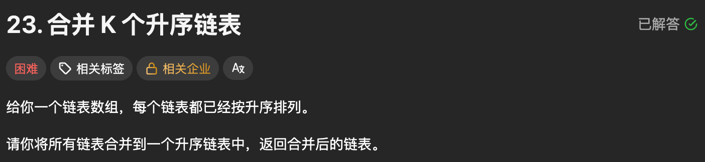

题目思路：

> 1-迭代：直接进行暴力循环 merge，每次进行两个list进行merge，merge后的当新的list  
>  2-进行递归操作、、、、

题目代码：

```cpp
class Solution {
    // 21. 合并两个有序链表
    ListNode* mergeTwoLists(ListNode* list1, ListNode* list2) {
        ListNode dummy{}; // 用哨兵节点简化代码逻辑
        auto cur = &dummy; // cur 指向新链表的末尾
        while (list1 && list2) {
            if (list1->val < list2->val) {
                cur->next = list1; // 把 list1 加到新链表中
                list1 = list1->next;
            } else { // 注：相等的情况加哪个节点都是可以的
                cur->next = list2; // 把 list2 加到新链表中
                list2 = list2->next;
            }
            cur = cur->next;
        }
        cur->next = list1 ? list1 : list2; // 拼接剩余链表
        return dummy.next;
    }

public:
    ListNode* mergeKLists(vector<ListNode*>& lists) {
        int m = lists.size();
        if(m == 0)return nullptr;

        // 像是规约了
        for(int step = 1; step < m; step = step * 2){
            for(int j = 0; j + step < m; j = j + step * 2){
                lists[j] = mergeTwoLists(lists[j], lists[j + step]);
            }
        }
        return lists[0];
    }
};
```

```cpp
class Solution {
    // 21. 合并两个有序链表
    ListNode* mergeTwoLists(ListNode* list1, ListNode* list2) {
        ListNode dummy{}; // 用哨兵节点简化代码逻辑
        auto cur = &dummy; // cur 指向新链表的末尾
        while (list1 && list2) {
            if (list1->val < list2->val) {
                cur->next = list1; // 把 list1 加到新链表中
                list1 = list1->next;
            } else { // 注：相等的情况加哪个节点都是可以的
                cur->next = list2; // 把 list2 加到新链表中
                list2 = list2->next;
            }
            cur = cur->next;
        }
        cur->next = list1 ? list1 : list2; // 拼接剩余链表
        return dummy.next;
    }

public:
    ListNode* mergeKLists(vector<ListNode*>& lists) {
        int m = lists.size();
        if (m == 0) {
            return nullptr;
        }
        for (int step = 1; step < m; step *= 2) {
            for (int i = 0; i < m - step; i += step * 2) {
                lists[i] = mergeTwoLists(lists[i], lists[i + step]);
            }
        }
        return lists[0];
    }
};
```

```cpp
class Solution {
    // 21. 合并两个有序链表
    ListNode* mergeTwoLists(ListNode* list1, ListNode* list2) {
        ListNode dummy{}; // 用哨兵节点简化代码逻辑
        auto cur = &dummy; // cur 指向新链表的末尾
        while (list1 && list2) {
            if (list1->val < list2->val) {
                cur->next = list1; // 把 list1 加到新链表中
                list1 = list1->next;
            } else { // 注：相等的情况加哪个节点都是可以的
                cur->next = list2; // 把 list2 加到新链表中
                list2 = list2->next;
            }
            cur = cur->next;
        }
        cur->next = list1 ? list1 : list2; // 拼接剩余链表
        return dummy.next;
    }

    // 合并从 lists[i] 到 lists[j-1] 的链表
    ListNode* mergeKLists(vector<ListNode*>& lists, int i, int j) {
        int m = j - i;
        if (m == 0) {
            return nullptr; // 注意输入的 lists 可能是空的
        }
        if (m == 1) {
            return lists[i]; // 无需合并，直接返回
        }
        auto left = mergeKLists(lists, i, i + m / 2); // 合并左半部分
        auto right = mergeKLists(lists, i + m / 2, j); // 合并右半部分
        return mergeTwoLists(left, right); // 最后把左半和右半合并
    }

public:
    ListNode* mergeKLists(vector<ListNode*>& lists) {
        return mergeKLists(lists, 0, lists.size());
    }
};
```

## No.1 数组链表模拟

### 题目来源：PTA-L2-002 链表去重

题目描述：  
 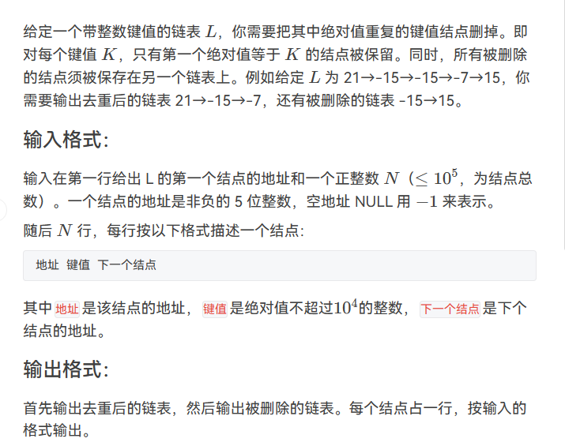

题目思路：

题目代码：

```cpp
//这道题要注意的是 可能 b1的数量为0 即没有重复的
//对于N要进行适应性的更改，对于字段错误
#include<bits/stdc++.h>
using namespace std;
#define inf 0x3f3f3f3f
#define N 100100
int n,m,k,g,d;
int x,y,z;
char ch;
string str;
vector<int>v[N];
struct node{
    int data;
    int next;
}ss[N];
int main() {
    int firadd,add;
    cin>>firadd>>n;
    for(int i=0;i<n;i++){
        cin>>add>>ss[add].data>>ss[add].next;
        
    }
    
    int a[N],b[N];
    int a1=0,b1=0;
    int book[N]={0};
    for(int i=firadd;i!=-1;i=ss[i].next){
        int num=abs(ss[i].data);
        if(book[num]==0){
            a[a1++]=i;
            book[num]=1;
        }else{
            b[b1++]=i;
        }
    }
    
    printf("%05d %d ",a[0],ss[a[0]].data);
    for(int i=1;i<a1;i++){
        printf("%05d\n",a[i]);
        printf("%05d %d ",a[i],ss[a[i]].data);
    }
    cout<<"-1"<<endl;
    if(b1>0){
            printf("%05d %d ",b[0],ss[b[0]].data);
    for(int i=1;i<b1;i++){
        printf("%05d\n",b[i]);
        printf("%05d %d ",b[i],ss[b[i]].data);
    }
        cout<<"-1"<<endl;
    }


	return 0;
}
```

### 题目来源：PTA-L2-022 重排链表

题目描述：  
 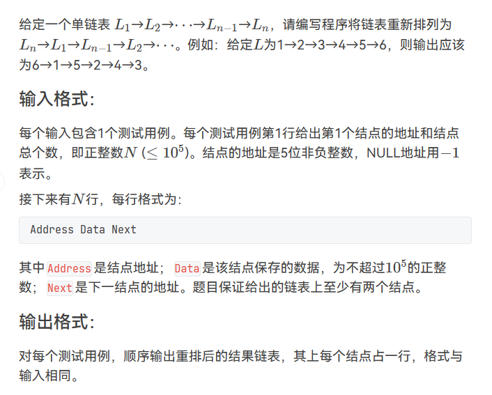

题目思路：

题目代码：

```cpp
//对于N要进行适应性的更改，对于字段错误
//

struct node{
    int data;
    int next;
}ss[N];

//


#include<bits/stdc++.h>
using namespace std;
#define inf 0x3f3f3f3f
#define N 100100
int n,m,k,g,d;
int x,y,z;
char ch;
string str;
vector<int>v[N];
struct node{
    int data;
    int next;
}ss[N];
int main() {
    int firadd,add;
    cin>>firadd>>n;
    for(int i=0;i<n;i++){
        cin>>add>>ss[add].data>>ss[add].next;
    }
    //a用来存一开始的所有点的顺序地址
    //b用来存后来按要求需要的地址输出的位置
    int a[N],b[N];
    int a1=0,b1=0;
    for(int i=firadd;i!=-1;i=ss[i].next){
        a[a1++]=i;
    }
    
    int l=0,r=a1-1;
    //表示往中间走，l，r表示该存哪个位置的信息了；
    //该存，表示这个位置还是空的？尝试book？
    while(l<=r){
        if(l<=r){
            b[b1++]=a[r];
            r--;
        }
        if(l<=r){
            b[b1++]=a[l];
            l++;
        }
    }
    
    
    //输出
    printf("%05d %d ",b[0],ss[b[0]].data);
    for(int i=1;i<b1;i++){
        printf("%05d\n",b[i]);
        printf("%05d %d ",b[i],ss[b[i]].data);
    }
    cout<<"-1"<<endl;
	return 0;
}
```

### 题目来源：Acwing-4273-链表合并

题目描述：  
 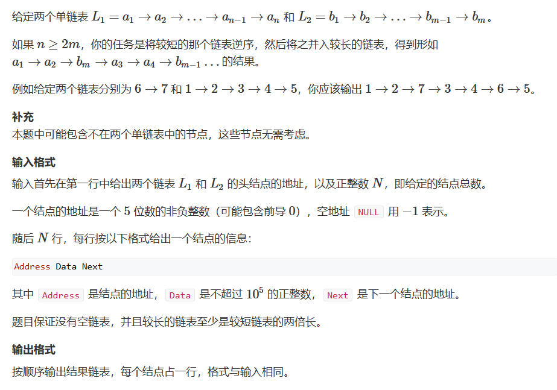

题目思路：

题目代码：

```cpp
//对于N要进行适应性的更改，对于字段错误
#include<bits/stdc++.h>
using namespace std;
#define inf 0x3f3f3f3f
#define N 100100
int n,m,k,g,d;
int x,y,z;
char ch;
string str;
vector<int>v[N];
//无序的去重的set
unordered_set<string>a,b,c;
struct node
{
	int data;
	int next;
	int id;
}ss[N];

int main() {
	int h1,h2;
	cin>>h1>>h2;
	cin>>n;
	while(n--){
		cin>>x;
		ss[x].id=x;
		cin>>ss[x].data>>ss[x].next;
	}
	vector<int>a,b,res;
	for(int i=h1;i!=-1;i=ss[i].next){
		a.push_back(i);
	}
	for(int i=h2;i!=-1;i=ss[i].next){
		b.push_back(i);
	}
	if(a.size()<b.size())swap(a,b);
	reverse(b.begin(),b.end());

	for(int i=0,j=0; i<a.size() ;i++){
		res.push_back(a[i]);
		if((i+1)%2==0&&j<b.size())res.push_back(b[j++]);
	}
    for (int i = 0; i < res.size(); i ++ )
    {
        printf("%05d %d ", res[i], ss[res[i]]);
        if (i == res.size() - 1) printf("-1\n");
        else printf("%05d\n", res[i + 1]);
    }
	return 0;
}
```

## No.2 题意链表模拟转化

### 题目来源：PAT-L2-040 哲哲打游戏

题目描述：  
 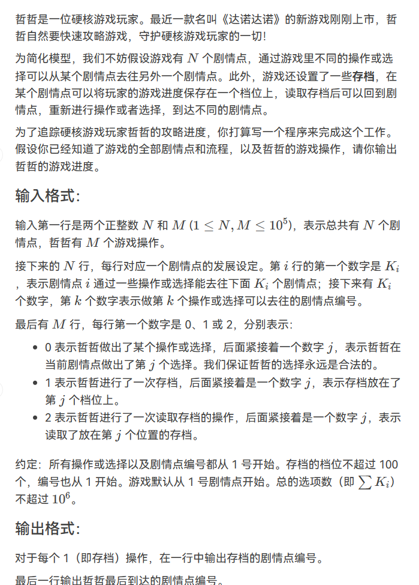

题目思路：

> 用数组进行存储，然后模拟；主要是cur的存储当前位置。

题目代码：

```cpp
//注意 int cur=1 和存档：ans[N];
//以及最后要输出一下最后那个景点cur
#include<bits/stdc++.h>
using namespace std;
#define N 100100
#define inf 0x3f3f3f3f
int n,m,k,d;
int x,y,z;
vector<int>v[N];

int main()
{
    cin>>n>>m;
    //剧情点从1标记
    for(int i=1;i<=n;i++){
        cin>>k;
        while(k--){
            cin>>x;
            v[i].push_back(x);
        }
    }
    int ans[N];
    //因为从剧情点1开始进行的游戏
    int cur=1;
    while(m--){
        cin>>x>>y;
        if(x==0){
            cur=v[cur][y-1];
        }else if(x==1){
            ans[y]=cur;
            cout<<cur<<endl;
        }else if(x==2){
            cur=ans[y];
        }
    }
    //最后要输出一下最终到达的地方
    cout<<cur<<endl;
    return 0;
}
```
