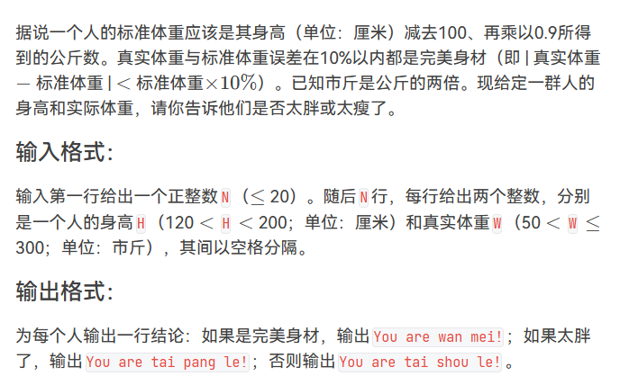
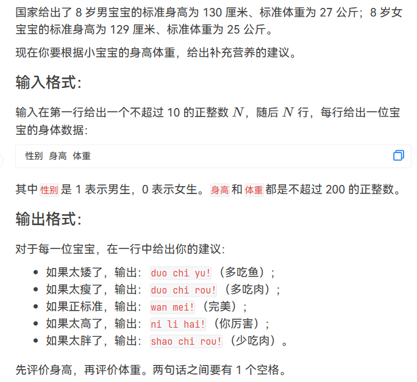
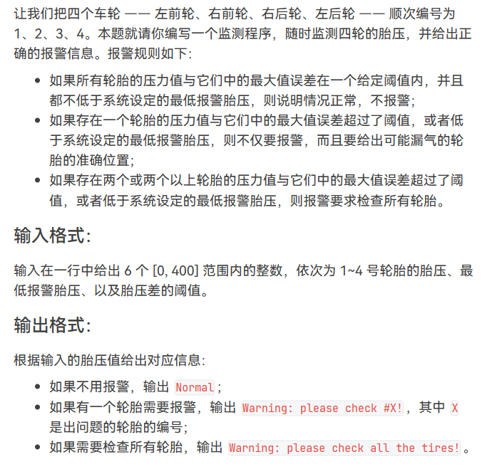
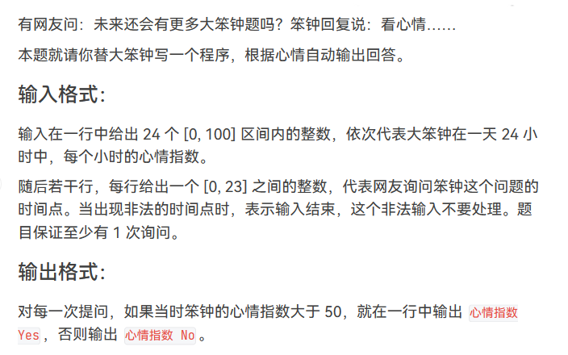
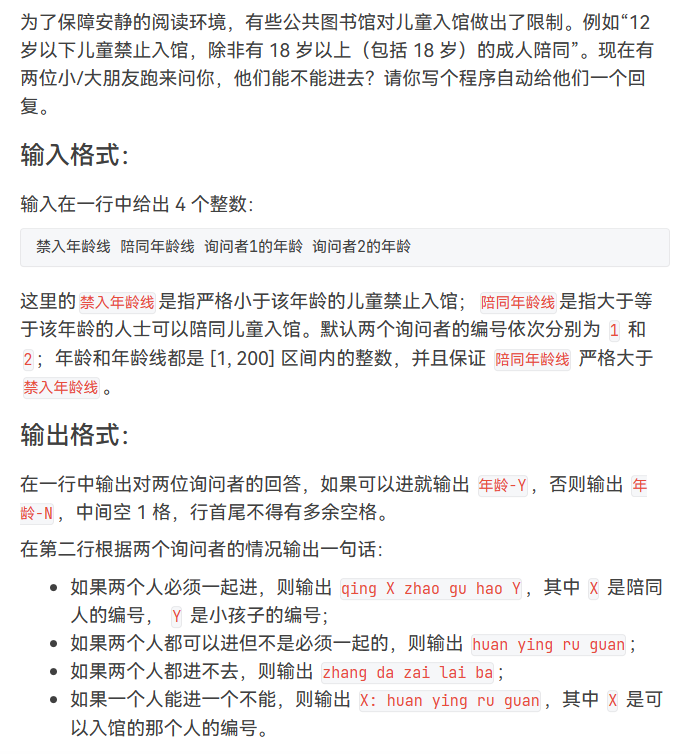

# 【完整题单12、字符串(条件判断)】【无】

> 来源：[【完整题单12、字符串(条件判断)】【无】](https://blog.csdn.net/weixin_51429773/article/details/130113566) · 发布时间：2026-06-03 · 阅读量：粉丝可见

#### 目录

- [知识框架](#_2)
- [No.0 筑基](#No0__4)
- [No.1 条件判断](#No1__17)
- - [题目来源：PTA-L1-031 到底是不是太胖了](#PTAL1031__18)
  - [题目来源：PTA-L1-063 吃鱼还是吃肉](#PTAL1063__55)
  - [题目来源：PTA-L1-069 胎压监测](#PTAL1069__119)
  - [题目来源：PTA-L1-077 大笨钟的心情](#PTAL1077__173)
  - [题目来源：PTA-L1-083 谁能进图书馆](#PTAL1083__213)

## 知识框架

## No.0 筑基

> 请先学习下知识点，道友！  
>  题目知识点大部分来源于此：
>
> 题目例题大部分来源于此：

## No.1 条件判断

### 题目来源：PTA-L1-031 到底是不是太胖了

题目描述：  
 

题目思路：


题目代码：

```
#include <stdio.h>
#include <math.h>
int main()
{
	int n;
	scanf("%d", &n);
	for (int i = 0; i < n; i++)
	{
		float h, w;
		scanf("%f %f", &h, &w);
		float stan = (h - 100) * 0.9 * 2;
		if (fabs(w - stan) < stan * 0.1)
			printf("You are wan mei!\n");
		else if (stan < w)
			printf("You are tai pang le!\n");
		else
			printf("You are tai shou le!\n");
	}

	return 0;
}
```

### 题目来源：PTA-L1-063 吃鱼还是吃肉

题目描述：  
 

题目思路：


题目代码：

```
#include <iostream>

using namespace std;

int main()
{
    int n;
    int sex,height,weight;
    cin>>n;
    for(int i=0;i<n;i++){
        cin>>sex>>height>>weight;
        if(sex==0){
            if(height<129){
                cout<<"duo chi yu! ";
            }else if(height==129){
              cout<<"wan mei! ";
            }else{cout<<"ni li hai! ";}

                            //显示旁的
            if(weight<25){
                cout<<"duo chi rou!"<<endl;
            }else if(weight==25){
                cout<<"wan mei!"<<endl;
            }else{
            cout<<"shao chi rou!"<<endl;
            }
        }else{
                        if(height<130){
                cout<<"duo chi yu! ";
            }else if(height==130){
              cout<<"wan mei! ";
            }else{cout<<"ni li hai! ";}

                            //显示旁的
            if(weight<27){
                cout<<"duo chi rou!"<<endl;
            }else if(weight==27){
                cout<<"wan mei!"<<endl;
            }else{
            cout<<"shao chi rou!"<<endl;
            }

        }

    }
    return 0;
}
```

### 题目来源：PTA-L1-069 胎压监测

题目描述：  
 

题目思路：


题目代码：

```
#include<bits/stdc++.h>
using namespace std;
#define inf 0x3f3f3f3f
#define N 10010
int n,m,k,g,d;
int x,y,z;
char ch;
string str;
vector<int>v[N];

int main() {
    int a1,a2,a3,a4;
    cin>>a1>>a2>>a3>>a4>>g>>d;
    int maxx=0;
    maxx=max({a1,a2,a3,a4});
    int count=0;
    int flag1=0,flag2=0,flag3=0,flag4=0;
    if(a1<g||(maxx-a1)>d)count++;flag1=1;
    if(a2<g||(maxx-a2)>d)count++;flag2=1;
    if(a3<g||(maxx-a3)>d)count++;flag3=1;
    if(a4<g||(maxx-a4)>d)count++;flag4=1;
    if(count==0)cout<<"Normal"<<endl;
    else if(count==1){
        if(flag1==1){
            cout<<"Warning: please check #1!"<<endl;
        }else if(flag2==1){
            cout<<"Warning: please check #2!"<<endl;
        }else if(flag3==1){
            cout<<"Warning: please check #3!"<<endl;

        }else{
            cout<<"Warning: please check #4!"<<endl;
        }
    }else{
        cout<<"Warning: please check all the tires!"<<endl;
    }

	return 0;
}
```

### 题目来源：PTA-L1-077 大笨钟的心情

题目描述：  
 

题目思路：


题目代码：

```
#include<bits/stdc++.h>
using namespace std;
#define inf 0x3f3f3f3f
#define N 10010
int n,m,k,g,d;
int x,y,z;
char ch;
string str;
vector<int>v[N];

int main() {
    int num[24]={0};
    for(int i=0;i<24;i++){
        cin>>num[i];
    }
    for(int i=0; ;i++){
        cin>>x;
        if(x<0 || x>23)break;
        if(num[x]>50)cout<<num[x]<<" Yes"<<endl;
        else cout<<num[x]<<" No"<<endl;
    }
  
	return 0;
}
```

### 题目来源：PTA-L1-083 谁能进图书馆

题目描述：  
 

题目思路：


题目代码：

```
#include<bits/stdc++.h>
using namespace std;
#define inf 0x3f3f3f3f
#define N 505
int n,m,k,g,d;
int x,y,z;
char ch;
string str;
vector<int>v[N];
#define PII pair<int,int>


	
	
int main()
{
    int jin,pei,year1,year2;
    cin>>jin>>pei>>year1>>year2;
    if(year1<jin&&year2<pei){
        cout<<year1<<"-N ";
    }else{
        cout<<year1<<"-Y ";
    }
    if(year2<jin&&year1<pei){
        cout<<year2<<"-N";
    }else{
        cout<<year2<<"-Y";
    }
    cout<<endl;
    
    
    if(year1<jin&&year2>=jin&&year2<pei){
        cout<<2<<": huan ying ru guan"<<endl;
    }
    if(year2<jin&&year1>=jin&&year1<pei){
        cout<<1<<": huan ying ru guan"<<endl;
    }
    if(year1<jin&&year2<jin){
        cout<<"zhang da zai lai ba"<<endl;
    }
    if(year1>=jin&&year2>=jin){
        cout<<"huan ying ru guan"<<endl;
    }
    if(year1<jin&&year2>=pei){
        cout<<"qing "<<2<<" zhao gu hao "<<1<<endl;
    }
    if(year2<jin&&year1>=pei){
        cout<<"qing "<<1<<" zhao gu hao "<<2<<endl;
    }
    
	
    
    return 0;
}
```
