#### 目录

- [知识框架](#_1)
- [No.0 筑基](#No0__3)
- [No.1 字符串输入](#No1__6)
- - [题目来源：PTA-L1-032 Left-pad](#PTAL1032_Leftpad_7)
- [No.2 字符串逐个搜索模拟模板](#No2__55)
- - [题目来源：PTA-L1-011 A-B](#PTAL1011_AB_57)
  - [题目来源：PTA-L1-016 查验身份证](#PTAL1016__96)
  - [题目来源：PTA-L1-017 到底有多二](#PTAL1017__148)
  - [题目来源：PTA-L1-025 正整数A+B](#PTAL1025_AB_187)
  - [题目来源：PTA-L1-027 出租](#PTAL1027__242)
  - [题目来源：PTA-L1-058 6翻了](#PTAL1058_6_297)
  - [题目来源：PTA-L1-059 敲笨钟](#PTAL1059__347)
  - [题目来源：PTA-L1-086 斯德哥尔摩火车上的题](#PTAL1086__403)
  - [题目来源：Acwing-3449-数字根](#Acwing3449_461)
  - [题目来源：蓝桥杯-2019省赛-不同子串](#2019_507)
- [No.3 字符串截断处理](#No3__544)
- - [题目来源：PTA-L1-064 估值一亿的AI核心代码](#PTAL1064_AI_546)
  - [题目来源：Acwing-4269-校庆](#Acwing4269_629)
  - [题目来源：Acwing-3593-单词统计](#Acwing3593_688)
  - [题目来源：Acwing-3452-进制转换](#Acwing3452_730)
  - [题目来源：Acwing-4506-三国语言](#Acwing4506_802)
  - [题目来源：蓝桥杯-2011省赛-串的处理](#2011_846)
  - [题目来源：蓝桥杯-2011省赛-中奖计算](#2011_886)
  - [题目来源：蓝桥杯-2012省赛-第一个数字](#2012_939)
  - [题目来源：蓝桥杯-2014省赛-猜字母](#2014_977)
  - [题目来源：蓝桥杯-2019省赛-人物相关性分析](#2019_1017)
- [No.4 循环处理字符串](#No4__1071)
- - [题目来源：RoboCom-2020-RC-u3 跑团机器人](#RoboCom2020RCu3__1072)
- [No.5 串的移位](#No5__1168)
- - [题目来源：蓝桥杯-2022省赛-排列字母](#2022_1170)
  - [题目来源：蓝桥杯-2011省赛-轮换](#2011_1198)
- [No.6 回文字符串处理](#No6__1246)
- - [题目来源：LeetCode-9. 回文数](#LeetCode9__1248)
  - [题目来源：PTA-L2-008 最长对称子串](#PTAL2008__1298)
  - [题目来源：蓝桥杯-第十四届模拟-第二期 最短回文串](#___1351)
  - [题目来源：蓝桥杯-2012省赛-提取字串](#2012_1393)
  - [题目来源：蓝桥杯-2015省赛-生成回文数](#2015_1455)
- [No.7 字符串元胞自动机](#No7__1515)
- - [题目来源：LeetCode-8. 字符串转换整数 (atoi)](#LeetCode8__atoi_1517)

## 知识框架

## No.0 筑基

> 请先学习下知识点，道友！  
>  题目知识点大部分来源于此：[代码随想录：字符串](https://www.programmercarl.com/0344.%E5%8F%8D%E8%BD%AC%E5%AD%97%E7%AC%A6%E4%B8%B2.html)

## No.1 字符串输入

### 题目来源：PTA-L1-032 Left-pad

题目描述：  
 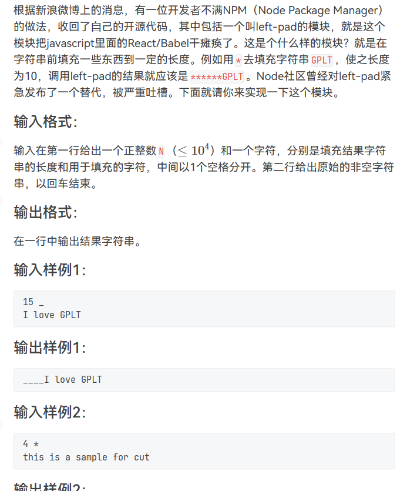

题目思路：

题目代码：

```cpp
//对于N要进行适应性的更改，对于字段错误
#include<bits/stdc++.h>
using namespace std;
#define inf 0x3f3f3f3f
#define N 100100
int n,m,k,g,d;
int x,y,z;
char ch;
string str;
vector<int>v[N];

int main() {
    cin>>n>>ch;
    getchar();
    getline(cin,str);
    if(str.size()==n){
        cout<<str<<endl;
        
    }else if(str.size()<n){
        for(int i=0;i<n-str.size();i++){
            cout<<ch;
        }
        cout<<str<<endl;
        
    }else{
        for(int i=str.size()-n;i<str.size();i++){
            cout<<str[i];
        }
        
        
    }


	return 0;
}
```

## No.2 字符串逐个搜索模拟模板

### 题目来源：PTA-L1-011 A-B

题目描述：  
 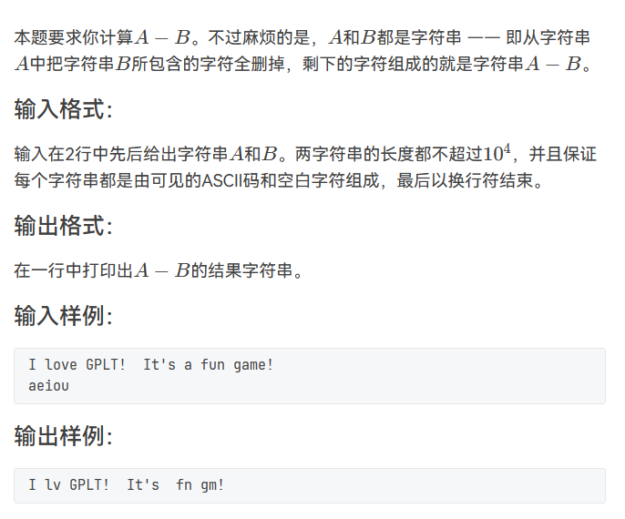

题目思路：


题目代码：

```cpp
//对于N要进行适应性的更改，对于字段错误
#include<bits/stdc++.h>
using namespace std;
#define inf 0x3f3f3f3f
#define N 100100
int n,m,k,g,d;
int x,y,z;
char ch;
string str;
vector<int>v[N];

int main() {
    string s1,s2;
    getline(cin,s1);
    getline(cin,s2);
    map<char,int>mp;
    for(auto i:s2)mp[i]=1;
    for(auto i:s1){
        if(mp[i]!=1)cout<<i;
    }
	return 0;
}
```

### 题目来源：PTA-L1-016 查验身份证

题目描述：  
 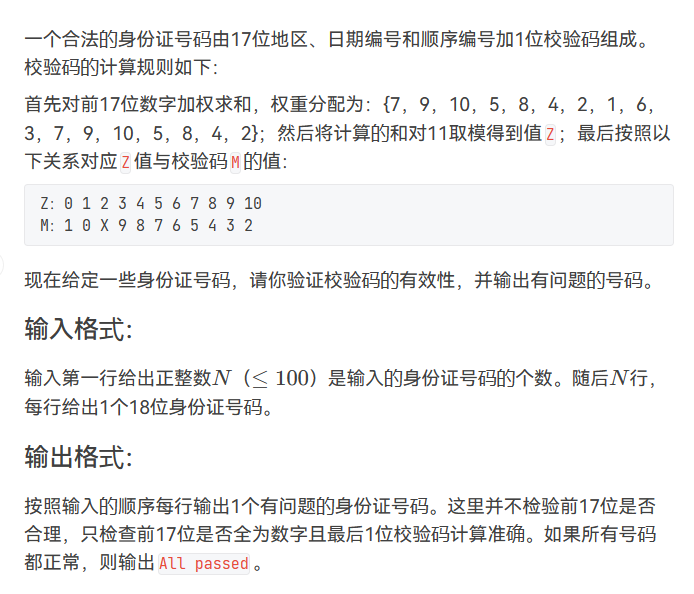

题目思路：

题目代码：

```cpp
 注意权重和duiying 都要自己打上去
// for(int j=0;j<str.size()-1;j++){  十八位的，要进行前十七位的遍历

#include <bits/stdc++.h>
using namespace std;
#define N 100100
#define inf 0x3f3f3f3f
int n,m,k,s,d;
int x,y,z;
string str;
char ch;
vector<int>v[N];
int value[17]={7,9,10,5,8,4,2,1,6,3,7,9,10,5,8,4,2};
char dui[11]={'1','0','X','9','8','7','6','5','4','3','2'};
int main()
{
    cin>>n;
    int flag2=0;
    for(int i=0;i<n;i++){
        cin>>str;
        int sum=0;
        int flag=0;
        for(int j=0;j<str.size()-1;j++){
            if(str[j]<'0' || str[j]>'9'){
                flag=1;
                break;
            }
            int num=str[j]-'0';
            sum+=num*value[j];
        }
        if(flag==1||dui[sum%11]!=str[17]){
            cout<<str<<endl;
            flag2=1;
        }
    }
    if(flag2==0)cout<<"All passed"<<endl;
    return 0;
}
```

### 题目来源：PTA-L1-017 到底有多二

题目描述：  
 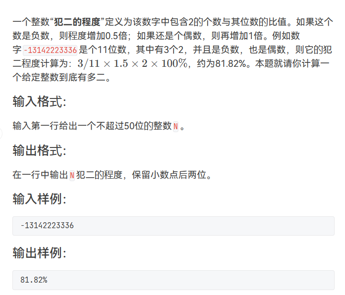

题目思路：

题目代码：

```cpp
//记得增加一倍是*2 ， 增加0.5倍是*1.5
//对于N要进行适应性的更改，对于字段错误
#include<bits/stdc++.h>
using namespace std;
#define inf 0x3f3f3f3f
#define N 100100
int n,m,k,g,d;
int x,y,z;
char ch;
string str;
vector<int>v[N];

int main() {
    int geshu,weishu;
    double beishu=1.0;
    cin>>str;
    if(str[0]=='-')beishu=beishu*1.5;
    if(str[0]=='-')weishu=str.size()-1;
    else weishu=str.size();
    if(str[str.size()-1]%2==0)beishu=beishu*2.0;
    for(auto i:str){
        if(i=='2')geshu++;
    }
    printf("%.2f",geshu*1.0/weishu*1.0*beishu*100);
    cout<<"%"<<endl;
	return 0;
}
```

### 题目来源：PTA-L1-025 正整数A+B

题目描述：  
 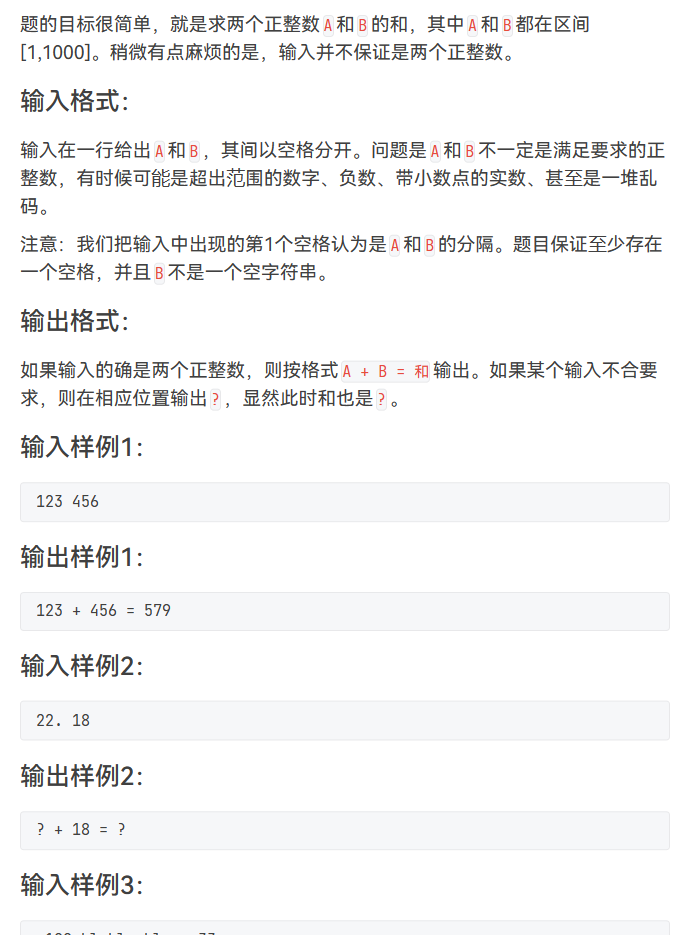

题目思路：

题目代码：

```cpp
#include<bits/stdc++.h>
using namespace std;
#define inf 0x3f3f3f3f
#define N 10010
int n,m,k,g,d;
int x,y,z;
char ch;
vector<int>v[N];
int flag=0;
int check(string str){
    for(int i=0;i<str.size();i++){
        if(str[i]<'0' || str[i]>'9'){
            return 1;
        }
    }
    if(stoi(str)<1 || stoi(str)>1000){
        return 1;
    }
    return 0;
}

int main() {
    string s1,s2;
    cin>>s1;
    ch=getchar();
    getline(cin,s2);
    
    int flag1=check(s1);
    int flag2=check(s2);
    if(flag1==0 && flag2==0){
        cout<<s1<<" + "<<s2<<" = "<<stoi(s1)+stoi(s2)<<endl;
    }else if(flag1==1 && flag2==1){
        cout<<"? + ? = ?"<<endl;
    }else if(flag1==1 && flag2==0){
        cout<<"? + "<<s2<<" = ?"<<endl;
    }else{
        cout<<s1<<" + ? = ?"<<endl;
    }

    
	return 0;
}
```

### 题目来源：PTA-L1-027 出租

题目描述：  
 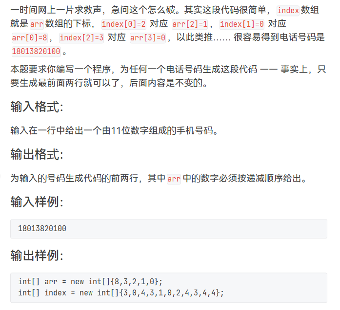

题目思路：

题目代码：

```cpp
#include<bits/stdc++.h>
using namespace std;
#define inf 0x3f3f3f3f
#define N 100100
int n,m,k,g,d;
int x,y,z;
char ch;
string str;
vector<int>v[N];

int main() {
    
    cin>>str;
    int book[15]={0};
    for(auto i:str){
        int num=i-'0';
        book[num]++;
    }
    vector<int>ans;
    for(int i=9;i>=0;i--){
        if(book[i]>0)ans.push_back(i);
    }
    cout<<"int[] arr = new int[]{";
    for(auto nn:ans){
        if(nn==ans[0])cout<<nn;
        else cout<<","<<nn;
    }
    cout<<"};"<<endl;
    cout<<"int[] index = new int[]{";
    for(int i=0;i<str.size();i++){
        int num=str[i]-'0';
        for(int j=0;j<ans.size();j++){
            if(ans[j]==num){
                if(i==0)cout<<j;
                else cout<<","<<j;
                break;
            }
        }
    }
    cout<<"};"<<endl;
	return 0;
}
```

### 题目来源：PTA-L1-058 6翻了

题目描述：  
 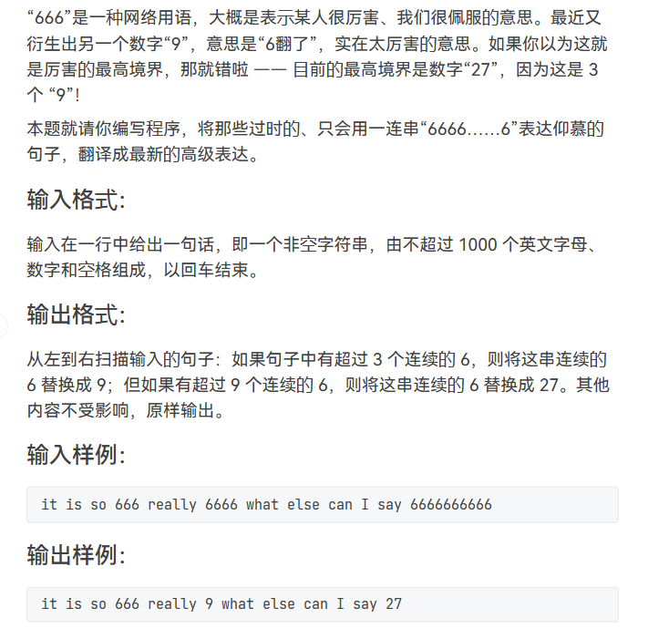

题目思路：

题目代码：

```cpp
#include<bits/stdc++.h>
using namespace std;
#define inf 0x3f3f3f3f
#define N 100100
int n,m,k,g,d;
int x,y,z;
char ch;
string str;
vector<int>v[N];

int main() {
    int count=0;
    getline(cin,str);
        //需要注意的是，使用getline函数输入会以换行为结束，所以在循环时 i <= str.length()
    for(int i=0;i<=str.size();i++){
        if(str[i]=='6'){
            count++;
            continue;
        }else{
          //走到这里count表示已经累积了多少个6
            if(count>9){
                cout<<"27";
            }else if(count>3){
                cout<<"9";
            }else{
                while(count--){
                    cout<<"6";
                }
            }
            count=0;
            cout<<str[i];
        }
    }


	return 0;
}
```

### 题目来源：PTA-L1-059 敲笨钟

题目描述：  
 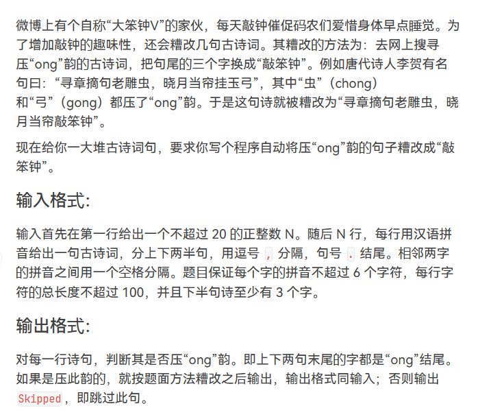

题目思路：

题目代码：

```cpp
#include<bits/stdc++.h>
using namespace std;
#define inf 0x3f3f3f3f
#define N 10010
int n,m,k,g,d;
int x,y,z;
char ch;
string str;
vector<int>v[N];

int main() {
    cin>>n;
    getchar();
    while(n--){
        int flag1=0,flag2=0;
        getline(cin,str);
        int len=str.size();
        vector<int>ans;
        for(int i=0;i<len;i++){
            if(str[i]==' '){
                ans.push_back(i);
            }
            if(str[i]==',' &&str[i-1]=='g' && str[i-2]=='n' && str[i-3]=='o'){
                flag1=1;
            }
            if(str[i]=='.' &&str[i-1]=='g' && str[i-2]=='n' && str[i-3]=='o'){
                flag2=1;
            }
            
        }
        if(flag1 && flag2){
            m=ans[ans.size()-3];
            for(int i=0;i<=m;i++){
                cout<<str[i];
            }
            cout<<"qiao ben zhong."<<endl;
        }else{
            cout<<"Skipped"<<endl;
        }
    }
	return 0;
}
```

### 题目来源：PTA-L1-086 斯德哥尔摩火车上的题

题目描述：  
 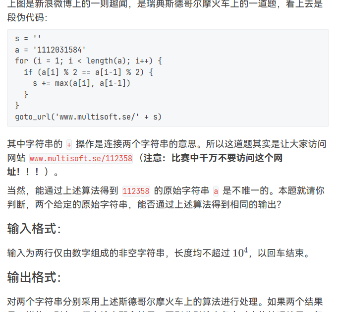

题目思路：


题目代码：

```cpp
#include<bits/stdc++.h>
using namespace std;
#define inf 0x3f3f3f3f
#define N 505
int n,m,k,g,d;
int x,y,z;
char ch;
string str;
vector<int>v[N];
#define PII pair<int,int>


	
int main()
{
    string str1,str2;
    getline(cin,str1);
    getline(cin,str2);
    
    string s1="";
    string s2="";
    for(int i=1;i<str1.size();i++){
        if((str1[i]-'0')%2==(str1[i-1]-'0')%2){
            s1=s1+max(str1[i],str1[i-1]);
        }
    }
    
    for(int i=1;i<str2.size();i++){
        if((str2[i]-'0')%2==(str2[i-1]-'0')%2){
            s2=s2+max(str2[i],str2[i-1]);
        }
    }
    if(s1==s2){
        cout<<s1<<endl;
    }else{
        cout<<s1<<endl;
        cout<<s2<<endl;
    }
    return 0;
}
```

### 题目来源：Acwing-3449-数字根

题目描述：

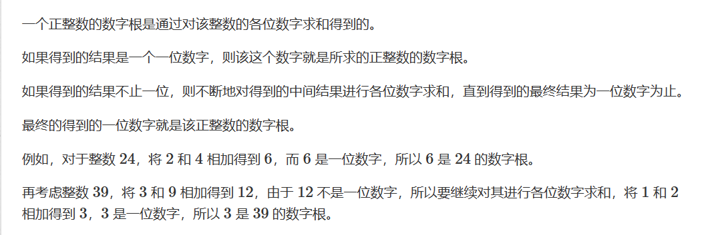

题目思路：

> //当数据量变得比较大的时候，就考虑使用字符串进行处理。to\_string()

题目代码：

```cpp
//对于N要进行适应性的更改，对于字段错误
#include<bits/stdc++.h>
using namespace std;
#define inf 0x3f3f3f3f
#define N 100100
int n,m,k,g,d;
int x,y,z;
char ch;
string str;
vector<int>v[N];

int main() {
	
	
	while(cin>>str){
		if(str=='0')break;
		
		int res=0;
		while(str.size()>1){
			for(auto i:str){
				res=res+i-'0';	
			}
			str=to_string(res);
		}
		cout<<str<<endl;
		
	}
	return 0;
}
```

### 题目来源：蓝桥杯-2019省赛-不同子串

题目描述：  
 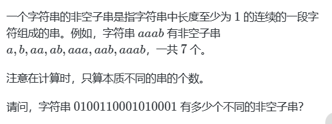

题目思路：


题目代码：

```cpp
#include <iostream>
#include<set>
#include<string>
using namespace std;
int main()
{
string s="0100110001010001";
set<string> se;
for(int i=0;i<s.length();i++)
{
  for(int j=0;j<s.length();j++)
  {
    se.insert(s.substr(i,j));
  }
}
cout<<se.size();
  return 0;
}
```

## No.3 字符串截断处理

### 题目来源：PTA-L1-064 估值一亿的AI核心代码

题目描述：  
 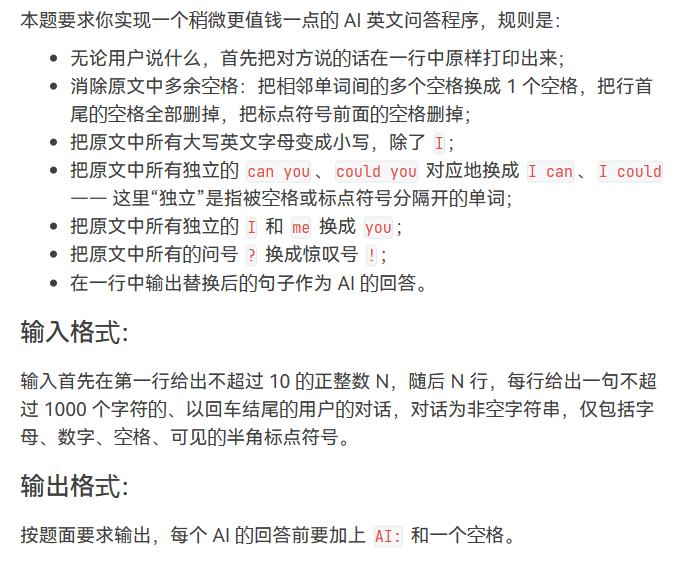

题目思路：

题目代码：

```cpp
#include<bits/stdc++.h>
using namespace std;
#define inf 0x3f3f3f3f
#define N 100100
int n,m,k,g,d;
int x,y,z;
char ch;
string str;
vector<int>v[N];
int pan1(string s,int x){
    if(s[x]>='a'&&s[x]<='z')return 1;
    else if(s[x]>='A' &&s[x]<='Z')return 2;
    else if(s[x]>='0'&&s[x]<='9')return 3;
    else if(s[x]==' ')return 4;
    else return 5;// 除空格以外的标点符号
}
//判断 独立性
int pan2(string s, int x ,int y){
    if((x<0 ||s[x]==' '||pan1(s,x)==5)&&(y>=s.size() || s[y]==' ' || pan1(s,y)==5)){
        return 1;
    }
    return 0;
}
int main() {
    cin>>n;
    getchar();
    while(n--){
        getline(cin,str);
        cout<<str<<endl<<"AI: ";
        string b="";//b是修改后的字符串 
        int l=0,r=str.size()-1;
        while(str[l]==' ')l++; // 去掉全部首空格
        while(str[r]==' ')r--;// 去掉全部尾空格 
        for(int i=l;i<=r;i++){
            if(str[i]==' ' &&(str[i+1]==' ' || pan1(str,i+1)==5)){ // 去掉多余空格（单词间的空格、标点符号前的空格） 
                continue;
            }else if(str[i]=='?'){// ?变！
                b+='!';
            }else if(str[i]!='I'&&pan1(str,i)==2){ // 大写变小写 
                b+=str[i]+32;
            }else{
                b+=str[i]; // 其他字符
            }
        }
        for(int i=0;i<b.size();i++){
            if(b[i]=='I'&&pan2(b,i-1,i+1)){
                cout<<"you";
            }else if(b.substr(i,2)=="me"&&pan2(b,i-1,i+2)){// b.substr(i,2)代表截取b字符串从i下标开始的两个字符 
                cout<<"you";
                i=i+1;
            }else if(b.substr(i,7)=="can you"&&pan2(b,i-1,i+7)){
                cout<<"I can";
                i+=6;
            }else if(b.substr(i,9)=="could you"&&pan2(b,i-1,i+9)){
                cout<<"I could";
                i+=8;
            }else{
                cout<<b[i];
            }
        }
        cout<<endl;
        
    }


	return 0;
}
```

### 题目来源：Acwing-4269-校庆

题目描述：  
 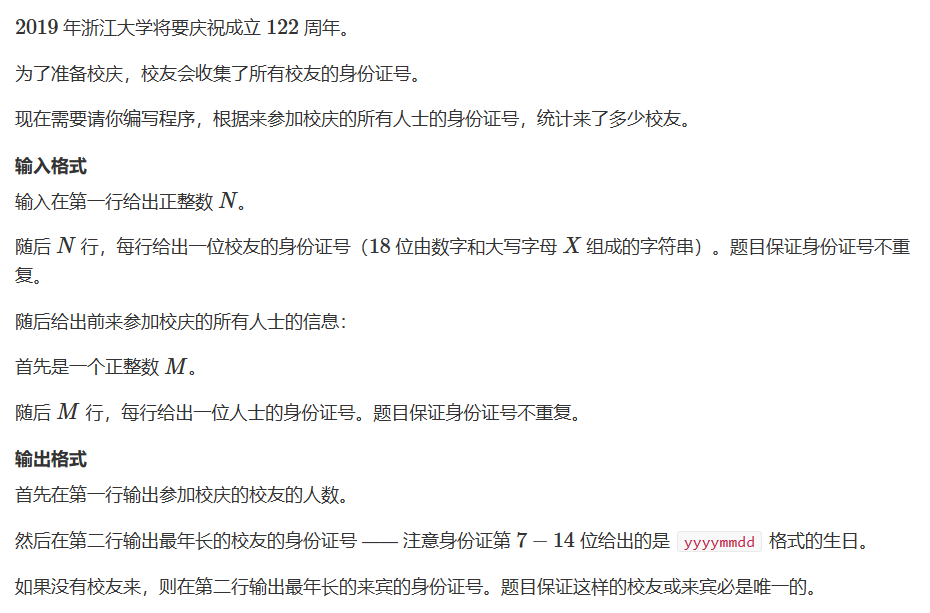

题目思路：

题目代码：

```cpp
//对于N要进行适应性的更改，对于字段错误
//使用无序的去重的set；；： unordered_set   以及函数count
#include<bits/stdc++.h>
using namespace std;
#define inf 0x3f3f3f3f
#define N 100100
int n,m,k,g,d;
int x,y,z;
char ch;
string str;
vector<int>v[N];
//无序的去重的set
unordered_set<string>a,b,c;

int main() {
	cin>>n;
	for(int i=0;i<n;i++){
		cin>>str;
		a.insert(str);
	}
	cin>>m;
	while(m--){
		cin>>str;
		b.insert(str);
	}
	int count=0;
	for(auto p:b){
		count=count+a.count(p);
	}
	cout<<count<<endl;
	string ri="99999999";
	if(count==0){
		c=b;
	}else{
		c=a;
	}
	for(auto p:c){
		if(b.count(p)==0)continue;

		string birth=p.substr(6,8);
		if(birth<ri)ri=birth,str=p;
	}
	cout<<str<<endl;
	return 0;
}
```

### 题目来源：Acwing-3593-单词统计

题目描述：

题目思路：

题目代码：

```cpp
//对于N要进行适应性的更改，对于字段错误
#include<bits/stdc++.h>
using namespace std;
#define inf 0x3f3f3f3f
#define N 100100
typedef long long LL;
typedef pair<LL,LL>PLL;
long long n,m,k,g,d,t;
int x,y,z;
char ch;
string str;
vector<int>v[N];
priority_queue<LL,vector<LL>>q1;
priority_queue<PLL,vector<PLL>>q2;
priority_queue<int,vector<int>>q;
PLL p[N];
int main() {
   vector<int>ans;
   while(cin>>str){
      if(str.back()=='.'){
         ans.push_back(str.size()-1);
         break;
      }else{
         ans.push_back(str.size());
      }
   }
   for(auto p:ans){
      cout<<p<<" ";
   }
	return 0;
}
```

### 题目来源：Acwing-3452-进制转换

题目描述：  
 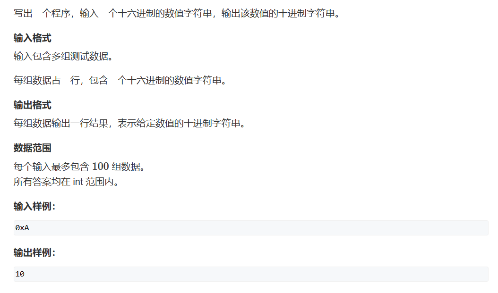

题目思路：


题目代码：

```cpp
//对于N要进行适应性的更改，对于字段错误
#include<bits/stdc++.h>
using namespace std;
#define inf 0x3f3f3f3f
#define N 100100
typedef long long LL;
typedef pair<LL,LL>PLL;
long long n,m,k,g,d,t;
int x,y,z;
char ch;
string str;
vector<int>v[N];
priority_queue<LL,vector<LL>>q1;
priority_queue<PLL,vector<PLL>>q2;
priority_queue<int,vector<int>>q;
PLL p[N];
string str1;
int main() {
   while (cin>>str1)
   {
      if(str1[0]=='-'){
         str=str1.substr(3,str1.size()-3);

      }else{
         str=str1.substr(2,str1.size()-2);
      }
   reverse(str.begin(),str.end());
   int res=0;
   for(int i=str.size()-1;i>=0;i--){
      int num=0;
      if(str[i]<='9'){
         num=(str[i]-'0')*pow(16,i);
      }else if(str[i]=='A'||str[i]=='a'){
         num=10*pow(16,i);
      }else if(str[i]=='B'||str[i]=='b'){
         num=11*pow(16,i);
      }else if(str[i]=='C'||str[i]=='c'){
         num=12*pow(16,i);
      }else if(str[i]=='D'||str[i]=='d'){
         num=13*pow(16,i);
      }else if(str[i]=='E'||str[i]=='e'){
         num=14*pow(16,i);
      }else if(str[i]=='F'||str[i]=='f'){
         num=15*pow(16,i);
      }
      res=res+num;
   }
   if(str1[0]=='-')cout<<"-"<<res<<endl;
   else cout<<res<<endl;
   }
	return 0;
}
```

### 题目来源：Acwing-4506-三国语言

题目描述：

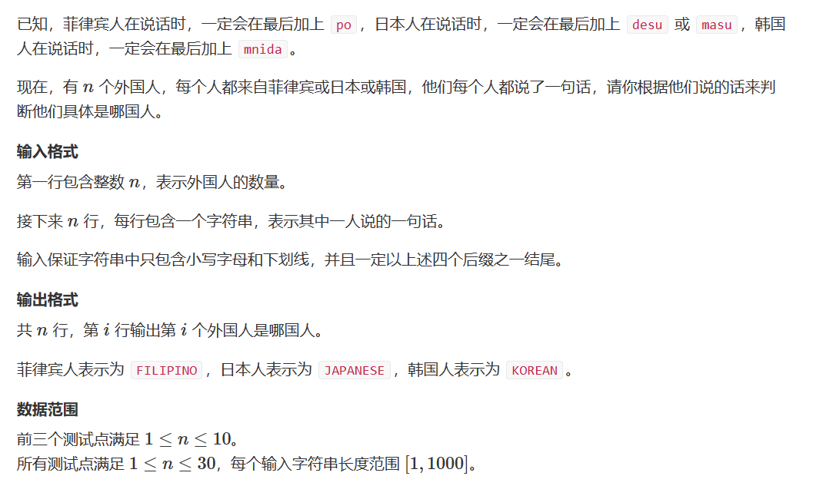

题目思路：


题目代码：

```cpp
//对于N要进行适应性的更改，对于字段错误
#include<bits/stdc++.h>
using namespace std;
#define inf 0x3f3f3f3f
#define N 100100
int n,m,k,g,d;
int x,y,z;
char ch;
string str;
vector<int>v[N];

int main() {

    cin>>n;
    while(n--){
        cin>>str;
        int size=str.size();
        if(str.substr(size-2,2)=="po"){
            cout<<"FILIPINO"<<endl;
        }else if(str.substr(size-4,4)=="desu"||str.substr(size-4,4)=="masu"){
            cout<<"JAPANESE"<<endl;
        }else{
            cout<<"KOREAN"<<endl;
        }
    }
	return 0;
}
```

### 题目来源：蓝桥杯-2011省赛-串的处理

题目描述：  
 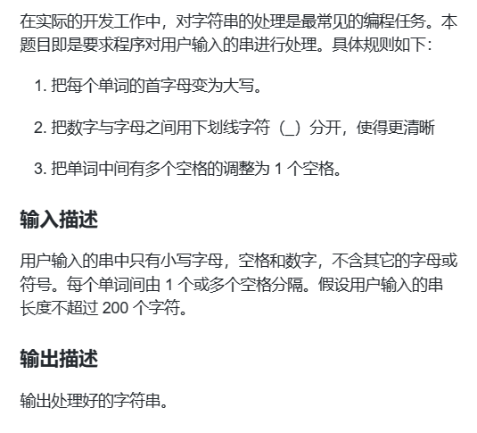

题目思路：

> 也可以将最前面的空格去掉，可处理最后面的空格；

题目代码：

```cpp
#include<iostream>
#include<cstring>
using namespace std;
int main(){
   string str;
   getline(cin,str);//可以将带有空格的string输入
   for(int i=0;i<str.size();i++){
     if(i==0&&str[i]>='a'&&str[i]<='z') str[i]-=32;//单词首字母小写变大写
       if(str[i]==' '){
           int j=i+1;
           while(str[j]==' '){  //去除多个空格，只保留一个空格
               str.erase(j,1);
       }
           if(str[j]>='a'&&str[j]<='z') str[j]-=32;//小写变大写
     }
       
       if((str[i]-'0')>=0&&(str[i]-'0')<=9&&str[i+1]>='a'&&str[i+1]<='z') 
        str.insert(i+1,"_");//数字在单词前面
       if((str[i]-'0')>=0&&(str[i]-'0')<=9&&((str[i-1]>='a'&&str[i-1]<='z')||(str[i-1]>='A'&&str[i-1]<='Z')))  
        str.insert(i,"_");//数字在单词后面(注意大写单词后面接数字的情况)
   }
   cout<<str<<endl;
    return 0;
}
```

### 题目来源：蓝桥杯-2011省赛-中奖计算

题目描述：

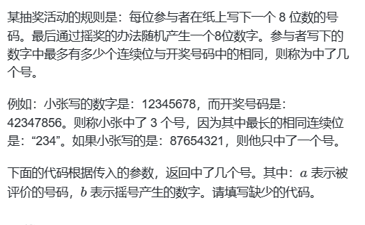

题目思路：


题目代码：

```cpp
#include <iostream>
using namespace std;
#include <stdio.h>
#include <stdlib.h>
#include <cstring>


int g(int a, int b)
{
    char sa[]="00000000";
    char sb[]="00000000";
    int n = 0;
    int i,j;

    sprintf(sa,"%8d",a);
    sprintf(sb,"%8d",b);
    for(i=0; i<8; i++)
    {
        for(j=1; j<=8-i; j++)
        {
            char t = sa[i+j];
            sa[i+j] = 0;
            if(strstr(sb, sa+i))
            {
                if(j>n) n=j;
            }
            sa[i+j] = t;
        }
    }

    return n;
}
int main(int argc, char* argv[])
{
    printf("%d\n", g(12345678,42234566));    
    printf("%d\n", g(12345678,12345678));
    return 0;
}
```

### 题目来源：蓝桥杯-2012省赛-第一个数字

题目描述：  
 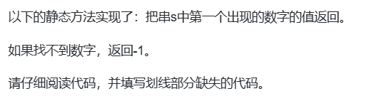

题目思路：


题目代码：

```cpp
import java.util.*;
public class Main
{
    public static int getFirstNum(String s)
    {
        if(s==null || s.length()==0) return -1;
        
        char c = s.charAt(0);//字符串的第一个
        if(c>='0' && c<='9') return Integer.parseInt(s.substring(0,1));  // 填空1
        
        return getFirstNum(s.substring(1));  // 填空2
    }
    
    public static void main(String[] args)
    {
        System.out.println(getFirstNum("ac1y5"));
        System.out.println(getFirstNum("2ac3y5"));
        System.out.println(getFirstNum("kkkacy3"));
        System.out.println(getFirstNum("abb"));
    }
}
```

### 题目来源：蓝桥杯-2014省赛-猜字母

题目描述：  
 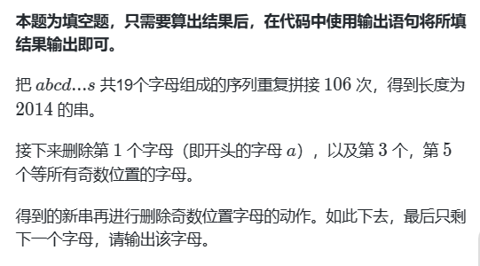

题目思路：


题目代码：

```cpp
/*把 abcd...sabcd...s 共19个字母组成的序列重复拼接 106106 次，得到长度为 20142014 的串。

接下来删除第 11 个字母（即开头的字母 aa），以及第 33 个，第 55 个等所有奇数位置的字母。

得到的新串再进行删除奇数位置字母的动作。如此下去，最后只剩下一个字母，请输出该字母。*/
#include<bits/stdc++.h>
using namespace std;
string s;
int main(){
s="abcdefghijklmnopqrs";
string temp;
temp=s;
for(int i=1;i<=105;i++){
    s+=temp;
}
while(s.size()>1){//长度不等于1继续循环
    for(int i=0;i<=(int)s.size()-1;i++){//i++不是i+2：比如当0位置元素被删除后，原本1位置元素来到0位置，二位置元素来到1位置
                                        //所以要删除原来的二位置是i++不是i+=2
        s.erase(i,1);//从位置i开始删删除1个元素
    }
}
cout<<s<<endl;
}
```

### 题目来源：蓝桥杯-2019省赛-人物相关性分析

题目描述：  
 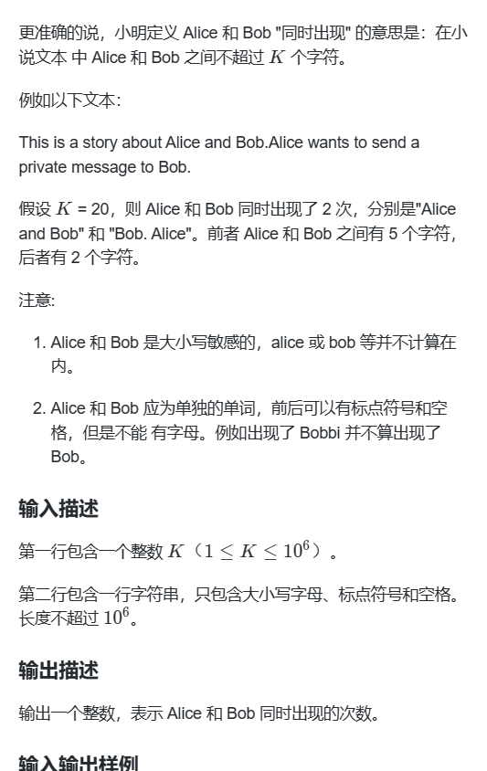

题目思路：


题目代码：

```cpp
#include<iostream>
#include<vector>
#include<cstdio>
#include<cstring>
#include<algorithm>
using namespace std;
typedef long long ll;
ll k;
string s;
int main(){
    cin>>k;
    getchar();
    getline(cin,s);
    vector<int>v,ve;
    for(int i=0;i<s.size();i++){
        if(s[i]=='A'&&s[i+1]=='l'&&s[i+2]=='i'&&s[i+3]=='c'&&s[i+4]=='e'){
            v.push_back(i);
        }
        if(s[i]=='B'&&s[i+1]=='o'&&s[i+2]=='b'){
            ve.push_back(i);
        }
    }
    ll l=0,r=0;
    ll count=0;
    for(int i=0;i<v.size();i++){
        while(l<ve.size()&&v[i]-ve[l]-3>k){
                l++;
        }
        while(r<ve.size()&&ve[r]-v[i]-5<=k){
                r++;
        }
        count+=r-l;
    }
    cout<<count;
    return 0;
}
```

## No.4 循环处理字符串

### 题目来源：RoboCom-2020-RC-u3 跑团机器人

题目描述：  
 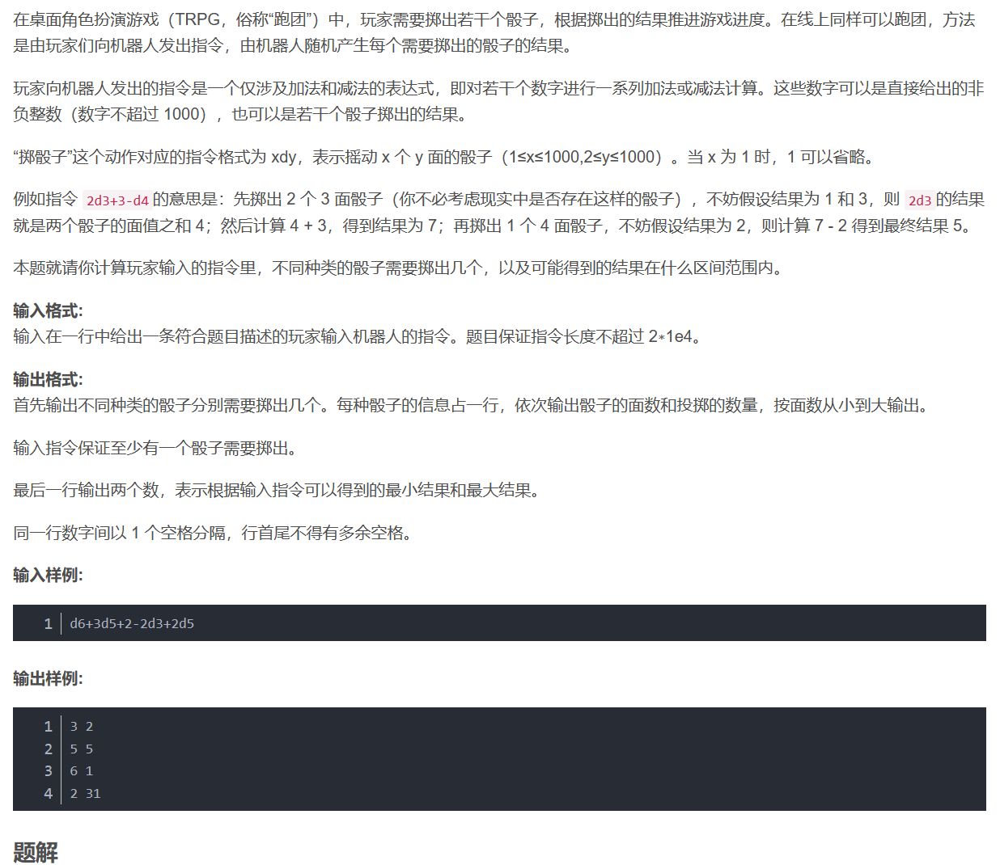

题目思路：


题目代码：

```cpp
#include <bits/stdc++.h>
using namespace std;
#define N 100010
#define inf 0x3f3f3f3f
#define debug(x) cout<<#x<<" = "<<x<<endl;
#define LL long long
int n,m,k,d,g;
int x,y,z;
string str;
char ch;
vector<int>v[N];


map<int,int>num;
int maxx=0,minn=0;
int main()
{
	cin>>str;
	string a,b;
    a="+";
    for(int i=0;i<str.size();i++){
        if(str[i]=='d'&&(i==0||str[i-1]=='+'||str[i-1]=='-')){
            a+="1";
        }
        a=a+str[i];
    }

    int fu=1;//1+，-1-为当前指令的正负号

	for(int i=0;i<a.size();){

		//新一轮的读取；先符号；
		if(a[i]=='+'){
			fu=1;
		}else{
			fu=-1;
		}
		i++;
		////读取x
		x=0,y=0;
		while(a[i]!='d'&&a[i]!='+'&&a[i]!='-'&&i<a.size()){
			x=x*10+a[i]-'0';
			i++;
		}
		  //读取完x后停止在d字符， 说明是一个指令
		if(a[i]=='d'){
			//读取y了
			i++;
			while(a[i]!='+'&&a[i]!='-'&&i<a.size()){
				y=y*10+a[i]-'0';
				i++;
			}
			num[y]+=x;
			if(fu==1){
				maxx=maxx+y*x;
				minn=minn+1*x;
			}else{
				maxx=maxx-1*x;
				minn=minn-y*x;
			}

		}else{
		//读取完x后停止在+/-或越界， 说明是一个常量， 乘上符号直接加到
			maxx=maxx+fu*x;
			minn=minn+fu*x;
		}
	}

	for(auto uu:num){
		cout<<uu.first<<" "<<uu.second<<endl;
	}
	cout<<minn<<" "<<maxx<<endl;


    return 0;
}
```

## No.5 串的移位

### 题目来源：蓝桥杯-2022省赛-排列字母

题目描述：

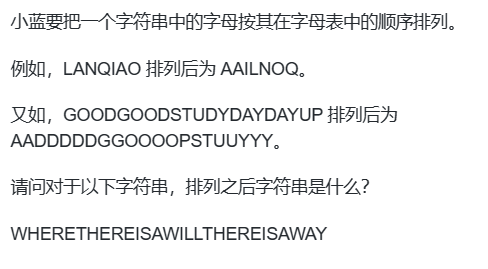

题目思路：


题目代码：

```cpp
#include <iostream>
#include<bits/stdc++.h>
using namespace std;
int main()
{
  // 请在此输入您的代码
  string s;
  cin>>s;
  sort(s.begin(),s.end());
  cout<<s;
  return 0;
}
```

### 题目来源：蓝桥杯-2011省赛-轮换

题目描述：

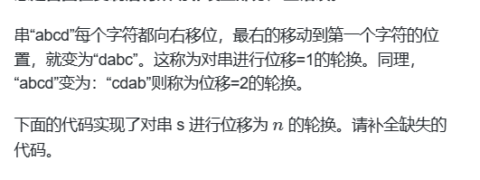

题目思路：


题目代码：

```cpp
#include <stdio.h>
#include <stdlib.h>
void shift(char* s, int n)
{
    char* p;
    char* q;
    int len = strlen(s);
    if(len==0) return;
    if(n<=0 || n>=len) return;

    char* s2 = (char*)malloc(len*sizeof(char));
    p = s;
    q = s2 + n % len;
    while(*p)
    {    
        *q++ = *p++;
        if(q-s2>=len)
        {
            *q =*s2;
            q = s2;
        }
    }
    strcpy(s,s2);
    free(s2);
}
int main(int argc, char* argv[])
{
    char x[] = "abcdefg";
    shift(x,2);
    printf("%s\n", x);
    return 0;
}
```

## No.6 回文字符串处理

### 题目来源：LeetCode-9. 回文数

题目描述：

[9. 回文数](https://leetcode.cn/problems/palindrome-number/)

题目思路：

> 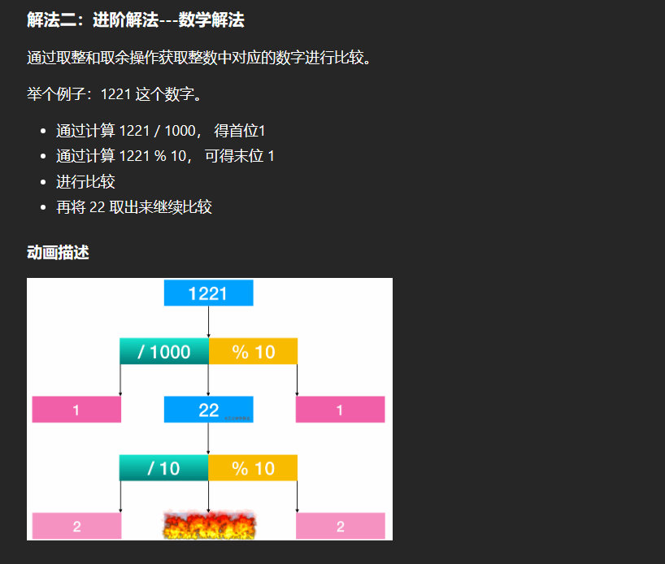

题目代码：

```cpp
///简单粗暴，看看就行
class Solution {
    public boolean isPalindrome(int x) {
        String reversedStr = (new StringBuilder(x + "")).reverse().toString();
        return (x + "").equals(reversedStr);
    }
}


class Solution {
public:
    bool isPalindrome(int x) {
      if(x<0)return false;

      int div=1;
      //找到最开始的除数，即x的位数；
      while(x / div >=10) div=div*10;

      while(x){
          int left = x/div;
          int right = x%10;
          if(left!=right) return false;
          x=(x%div)/10;
          div=div/100;
      }
      return true;
    }
};
```

### 题目来源：PTA-L2-008 最长对称子串

题目描述：  
 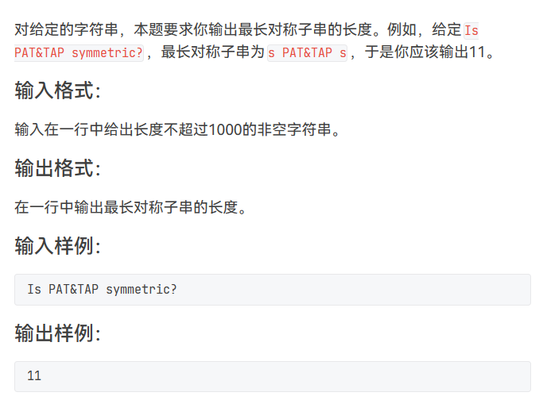

题目思路：


题目代码：

```cpp
//对于N要进行适应性的更改，对于字段错误
#include<bits/stdc++.h>
using namespace std;
#define inf 0x3f3f3f3f
#define N 100100
int n,m,k,g,d;
int x,y,z;
char ch;
string str;
vector<int>v[N];

int main() {
    x=0;
    getline(cin,str);
    int len=str.size();
    
    for(int i=0;i<len;i++){
        
        for(int j=len-1;j>=i;j--){
            if(str[i]==str[j]){
                int l=i,r=j;
                while(l<=r&&str[l++]==str[r--]){
                    if(l>r){
                        x=max(x,j-i+1);
                    }
                }
            }
        }
    }
    cout<<x<<endl;
 

	return 0;
}
```

### 题目来源：蓝桥杯-第十四届模拟-第二期 最短回文串

题目描述：  
 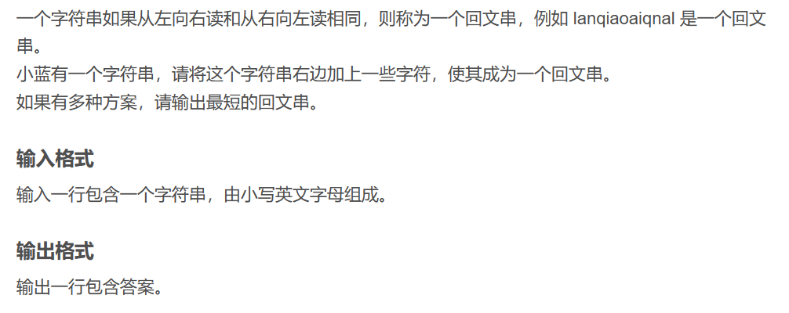

题目思路：


题目代码：

```cpp
#include <bits/stdc++.h>
using namespace std;

string str;

bool check(int i, int j) {
    while (i < j) {
        if (str[i] != str[j])
            return false;
        i ++;
        j --;
    }
    return true;
}

int main() {
    cin >> str;
    int n = str.length();
    for (int i = 0; i < n; i ++) {
        if (check(i, n - 1)) {
            string s = str.substr(0, i);
            reverse(s.begin(), s.end());
            cout << str << s << endl;
            return 0;
        }
    }
    return 0;
}
```

### 题目来源：蓝桥杯-2012省赛-提取字串

题目描述：  
 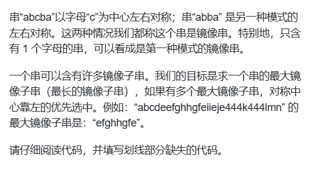

题目思路：


题目代码：

```cpp
public class 提取字串 {
    public static String getMaxMirrorString(String s)
    {
        String max_s = "";  // 所求的最大对称子串

        for(int i=0; i<s.length(); i++)
        {
            // 第一种对称模式
            int step = 1;
            try{
                for(;;)
                {
                    if(s.charAt(i-step) != s.charAt(i+step)) break;
                    step++;
                }
            }catch(Exception e){}

            String s1 = s.substring(i-step+1,i+step-1);  // 填空1


            // 第二种对称模式
            step = 0;
            try{
                for(;;)
                {
                    if(s.charAt(i-step) != s.charAt(i+step+1)) break;  // 填空2
                    step++;
                }
            }catch(Exception e){}

            String s2 = s.substring(i-step+1,i+step+1);//这里是break出来的，所以step变大了1，得+1


            if(s1.length() > max_s.length()) max_s = s1;
            if(s2.length() > max_s.length()) max_s = s2;
        }

        return max_s;
    }

    public static void main(String[] args)
    {
        System.out.println(getMaxMirrorString("abcdeefghhgfeiieje444k444lmn"));
    }
}
```

### 题目来源：蓝桥杯-2015省赛-生成回文数

题目描述：  
 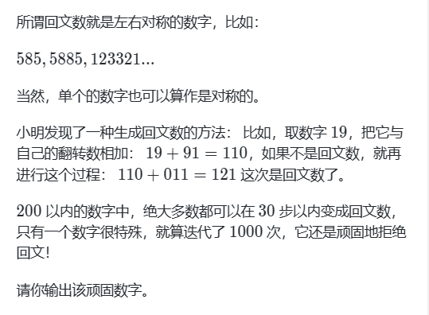

题目思路：


题目代码：

```cpp
#include <bits/stdc++.h>
using namespace std;
typedef long long LL; 
int cnt, flag;
LL dz(LL a)       //倒转数字;
{
    LL b = 0;
    while(a)
    {
        b = b*10 + a%10;
        a /= 10;
    }
    return b;
}
void dg(LL x)
{
    if(cnt > 30 || flag == 1) return ;      //若找了超过30次或已经找到回文就退出;
    LL m = dz(x);
    if(m == x)           //若找到回文;
    {
        flag = 1;
        return ;
    } 
    LL t = x + m;        //没找到，继续;
    cnt++;
    dg(t);
    return ;
}
int main()
{
    for(LL i = 1; i <= 200; i++)
    {
        flag = 0;
        cnt = 0;
        dg(i);
        if(flag == 0)
        {
            cout << i << endl;
            return 0;
        }
    }
    return 0;
}
```

## No.7 字符串元胞自动机

### 题目来源：LeetCode-8. 字符串转换整数 (atoi)

题目描述：

[8. 字符串转换整数 (atoi)](https://leetcode.cn/problems/string-to-integer-atoi/)

题目思路：

> 字符串处理的题目往往涉及复杂的流程以及条件情况，如果直接上手写程序，一不小心就会写出极其臃肿的代码。
>
> 因此，为了有条理地分析每个输入字符的处理方法，我们可以使用自动机这个概念：
>
> 我们的程序在每个时刻有一个状态 s，每次从序列中输入一个字符 c，并根据字符 c 转移到下一个状态 s’。这样，我们只需要建立一个覆盖所有情况的从 s 与 c 映射到 s’ 的表格即可解决题目中的问题。

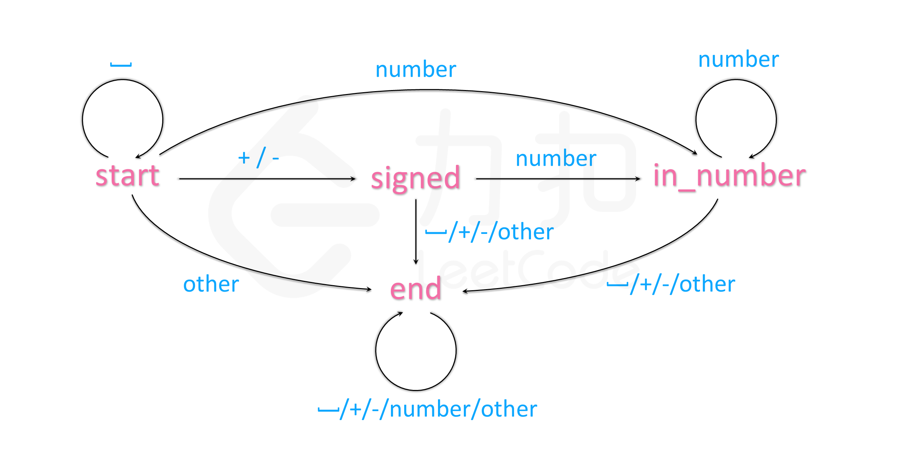

题目代码：

```cpp
class Automaton {
    string state = "start";
    unordered_map<string, vector<string>> table = {
        {"start", {"start", "signed", "in_number", "end"}},
        {"signed", {"end", "end", "in_number", "end"}},
        {"in_number", {"end", "end", "in_number", "end"}},
        {"end", {"end", "end", "end", "end"}}
    };

    int get_col(char c) {
        if (isspace(c)) return 0;
        if (c == '+' or c == '-') return 1;
        if (isdigit(c)) return 2;
        return 3;
    }
public:
    int sign = 1;
    long long ans = 0;

    void get(char c) {
        state = table[state][get_col(c)];
        if (state == "in_number") {
            ans = ans * 10 + c - '0';
            ans = sign == 1 ? min(ans, (long long)INT_MAX) : min(ans, -(long long)INT_MIN);
        }
        else if (state == "signed")
            sign = c == '+' ? 1 : -1;
    }
};

class Solution {
public:
    int myAtoi(string str) {
        Automaton automaton;
        for (char c : str)
            automaton.get(c);
        return automaton.sign * automaton.ans;
    }
};
```
